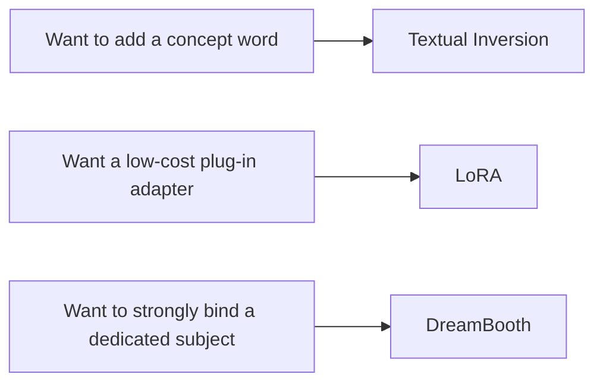

# Image Generation Fine-tuning


:::tip Reading guide
When fine-tuning image generation models, do not start by thinking about “full training.” First decide whether you want a new concept trigger word, a plug-and-play style adapter, or consistency for a dedicated subject, then choose Textual Inversion, LoRA, or DreamBooth.
:::

:::tip Section overview
Once the base Stable Diffusion model is already strong, the new question becomes:

> **How do we make it better understand a specific subject, a specific style, or a specific brand look?**

That is the real question image generation fine-tuning needs to answer.
:::

## Learning objectives

- Understand why image generation models also need fine-tuning
- Distinguish the differences among DreamBooth, LoRA, and Textual Inversion
- Understand what each method is more like “changing”
- Build a very practical intuition for choosing among them

---

## First, build a map

Image generation fine-tuning is easier to understand if you think in terms of “Do you want to change a concept, a style, or a dedicated subject?”



So what this section really wants to solve is:

- Not which path is the most popular
- But what you are actually trying to fine-tune

---

## 1. Why is the base model still not enough?

The base model can of course already generate many things.  
But real-world needs are usually more specific:

- Generate a specific dedicated character
- Generate a fixed brand style
- Keep a product consistent across different scenes

At this point, prompt engineering alone is often not stable enough.

So the essence of fine-tuning can be remembered as:

> **Letting the model converge toward a more specific visual target while keeping its original capabilities.**

### 1.1 A beginner-friendly overall analogy

You can think of image generation fine-tuning as:

- Doing “targeted style training” for an artist who already knows how to draw many things

The base model is like a generalist who can draw many subjects,  
but what you really want may be:

- A fixed IP character
- A certain brand look
- A dedicated style

At that point, you are not asking it to learn drawing from scratch,  
but to draw more consistently in a certain direction.

---

## 2. The three core routes in image generation fine-tuning

### 2.1 Textual Inversion

The lightest approach.  
It is more like:

> Teaching the model a new trigger word / concept word.

### 2.2 LoRA

More like:

> Attaching a small, plug-in adapter to the base model.

### 2.3 DreamBooth

More like:

> Strengthening the model’s memory of a specific dedicated subject.

If you first separate these three intuitions, many later terms will stop feeling mixed up.

---

## 3. Textual Inversion: why is it called the lightest?

### 3.1 What is it actually learning?

It is not making large changes to the whole model, but more like:

- Learning a new token representation

You can think of it as:

> Teaching the model to recognize a new “word.”

### 3.2 A minimal example

```python
textual_inversion = {
    "new_token": "<my_style>",
    "meaning": "a specific visual style",
    "learned_object": "token embedding"
}

print(textual_inversion)
```

### 3.3 What is it good for?

- Style trigger words
- Some lightweight concept injection

Its advantages are:

- Light
- Fast
- Small scope of changes

But it is usually less powerful than heavier methods.

---

## 4. LoRA: why has it become the most common engineering choice?

### 4.1 Its core idea

LoRA does not change the entire original model. Instead, it is:

> Learning a low-cost incremental adapter.

This makes it very suitable for:

- Mounting multiple styles on one large base model
- Switching between different adapters
- Reducing training and storage costs

### 4.2 A simple example

```python
base_model = "stable_diffusion_base"
lora_adapter = {
    "target": "attention blocks / U-Net blocks",
    "size": "small",
    "effect": "adds style or subject control capability"
}

print(base_model)
print(lora_adapter)
```

### 4.3 Why is it especially practical in engineering?

Because it is especially well-suited for:

- One base model
- Many different style or character adapters

In other words:

> You do not need to store a full copy of the entire model for every customized version.

That is one of the main reasons LoRA became so popular.

---

## 5. DreamBooth: why is it more often used for “dedicated subjects”?

### 5.1 What problem is it solving?

DreamBooth is commonly used to:

- Teach the model a specific person
- Teach the model a specific object
- Teach the model a specific IP character

### 5.2 Why is it “stronger” than Textual Inversion?

Because it usually does more than learn just one word; it more deeply adapts the model to how this subject appears in image space.

### 5.3 What is the cost?

- Heavier
- More prone to overfitting
- More dependent on data quality

So you can roughly remember it like this:

- Textual Inversion: light
- LoRA: balanced
- DreamBooth: stronger but heavier

---

## 6. How do you choose? A very practical rule of thumb

### 6.1 If you want a lightweight style trigger word

Prefer:

- Textual Inversion

### 6.2 If you want low-cost, plug-and-play, and maintainable

Prefer:

- LoRA

### 6.3 If you want to strongly bind a specific subject

Prefer:

- DreamBooth

So the really useful question is not:

> “Which method is the strongest?”

But:

> “What am I actually fine-tuning: a word, a style, or a subject?”

### 6.4 A selection table that is very beginner-friendly

| Your goal | Safer first choice |
|---|---|
| Add a trigger word or a lightweight concept | Textual Inversion |
| Maintain many style versions at low cost | LoRA |
| Strongly bind a specific person / object / IP | DreamBooth |

This table is helpful for beginners because it brings method selection back to “What is the actual goal?”

---

## 7. Why is evaluating image generation fine-tuning especially difficult?

Because this is not like a classification task, where you can look at one accuracy number.

You usually also need to check:

- Whether the generated result matches the target style
- Whether the subject stays consistent
- Whether the model overfits the training images
- Whether it remains stable under different prompts

In other words:

> Evaluation is more like judging visual and creative quality than judging a single metric.

### 7.1 A beginner-friendly evaluation table

| Evaluation dimension | What should you ask first? |
|---|---|
| Style consistency | Does it look like the target style? |
| Subject consistency | Is it the same person / object? |
| Generalization stability | Is it still stable after changing the prompt? |
| Overfitting | Does it just repeat the training images? |

This table is helpful for beginners because it breaks “evaluation is subjective” into several more observable questions.

---

## 8. A very practical summary table

| Method | More like | Advantage | Cost |
|---|---|---|---|
| Textual Inversion | Learning a new word | Lightweight, fast | Limited control ability |
| LoRA | Installing a small adapter | Low cost, easy to switch | Still requires understanding target modules |
| DreamBooth | Learning a dedicated subject | Stronger subject control | Heavier, easier to overfit |

This table is not for memorizing mechanically, but for building a judgment habit.

---

## 9. The most common misconceptions

### 9.1 Starting with full fine-tuning right away

In many cases, that is completely unnecessary.

### 9.2 Not being clear about what exactly you want to fine-tune

Is it style? Subject? Trigger word?  
If this is unclear, it is very easy to choose the wrong method.

### 9.3 Only looking at a few successful images

What really matters is:

- Is it stable under multiple prompts?
- Does it still look right across multiple samplings?

## If you turn this into a project or solution, what is most worth showing?

What is most worth showing is usually not:

- “I fine-tuned SD”

Instead, show:

1. What your goal is: concept, style, or subject
2. Why you chose this fine-tuning route
3. Which dimensions you used for evaluation
4. Under which prompts the generation is stable, and under which prompts it is not

That way, others can more easily see:

- You understand method selection and evaluation
- You did not just run a training script once

---

## Summary

The most important thing in this section is not memorizing the names DreamBooth, LoRA, and Textual Inversion, but understanding:

> **The core of image generation fine-tuning is using different costs to gain more stable control over style, subjects, or concepts.**

Once you build that judgment, it will be much easier to understand specific training workflows later.

---

## Exercises

1. Explain in your own words what Textual Inversion, LoRA, and DreamBooth are more like “changing.”
2. Think about this: if you only want to add a style trigger word to the model, why might you not need DreamBooth?
3. If you need to maintain many style versions over the long term, why is LoRA especially valuable from an engineering perspective?
4. Why is evaluation in image generation fine-tuning more dependent on human perceptual judgment than text classification?
