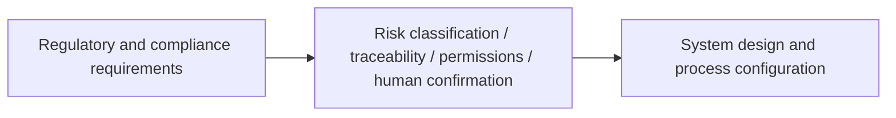

# AI Regulations and Compliance


:::tip Reading the diagram
Compliance requirements eventually become system design requirements: data permissions, log auditing, risk classification, human oversight, content labeling, and traceability. When reading the diagram, focus on how “regulatory language” is translated into “engineering configuration.”
:::

:::tip What this section is about
Talking about regulations can easily make people feel like it is far away from technology.  
But once a system actually enters:

- an enterprise environment
- a commercial product
- a high-risk industry

you will quickly discover:

> **Compliance is not a layer added at the very end; it is something that can shape the system structure from the start.**

This lesson is here to make that relationship clear.
:::

## Learning Objectives

- Understand why AI compliance issues directly affect product design
- Understand why keywords such as risk classification, auditing, and traceability matter
- Learn how to translate regulatory requirements into system requirements
- Build the perspective that “regulatory issues are not handled by legal alone; engineering must also participate in the design”

---

## First, Build a Map

AI regulations and compliance are easier to understand as “legal requirements -> system capabilities -> engineering implementation”:



So what this section is really trying to solve is:

- Why regulatory issues directly become part of system structure
- Why technical teams must participate in “compliance translation”

---

## 1. Why Are Regulatory Issues Not Far From Engineers?

### 1.1 A Common Misunderstanding

Many technical learners instinctively think:

- regulations are the legal team’s job
- models are the engineering team’s job

But in real projects, these two often meet directly.

### 1.2 Why Do They Meet?

Because many regulatory requirements eventually become questions like these:

- Do you have logs?
- Can you trace the source?
- Do you have permission control?
- Can a human take over?

In other words:

> Regulatory requirements often end up becoming system capability requirements.

So compliance is not a post-check; it is often an architecture input.

### 1.1 A Better Analogy for Beginners

You can think of compliance as:

- a set of “building codes” that must be satisfied before a product can go live

Building codes do not directly tell you how to place every brick,  
but they do specify:

- where fire exits must be kept clear
- where emergency exits must be installed

AI compliance is very similar:

- it does not directly write your code for you
- but it does constrain what shape your system must take

---

## 2. What Are the Most Common Compliance Concerns?

### 2.1 Data and Privacy

Does the system handle:

- personal information
- sensitive information
- internal enterprise data

### 2.2 Traceability

Can the system explain:

- where this answer came from
- which data was used
- what happened at each step

### 2.3 Risk Classification

Different systems have different risk levels.  
Not all generative systems need the same level of control.

### 2.4 Human Oversight and Appeal Mechanisms

In high-risk scenarios, the system usually cannot be fully automated end to end.

---

## 3. A Very Practical Way to Translate Requirements into Engineering

When translating regulatory requirements into system requirements, you can usually think about them like this:

| Regulatory / compliance issue | What it becomes in engineering |
|---|---|
| Data protection | Data masking, access control, minimal retention |
| Explainability / traceability | Logs, traces, source citations |
| Restrictions on high-risk decisions | Human confirmation, dual approval, refusing automatic execution |
| Audit capability | Operation records, version records, request traceability |

This table is very important because it turns “compliance” from an abstract term into an engineering problem you can act on.

### 3.1 A Beginner-Friendly Table to Remember First

| Compliance requirement | What engineering should think of first |
|---|---|
| Data protection | Masking, permissions, retention boundaries |
| Traceability | Logs, traces, source references |
| High-risk restrictions | Approval flow, human confirmation, refusing automatic execution |
| Audit | Version records, operation traces, replayable configuration |

This table is especially useful for beginners because it translates “regulatory vocabulary” back into engineering language.

---

## 4. Why Has “Traceability” Become Such a Frequent Term in AI Compliance?

Because many AI system problems are not just “the output is wrong,” but rather:

- you do not know why it is wrong
- you do not know what data it used
- you do not know which module caused the issue

That is why compliance often places strong emphasis on:

- source citations
- task traces
- decision logs

You can think of it like this:

> It is not enough for the system to run; you also need to be able to look back and find out what happened.

---

## 5. Why Is Risk Classification So Important for AI Systems?

Not all AI applications should be controlled with the same level of strictness.

For example:

- a poster generator
- a medical advice assistant

These two clearly do not carry the same level of risk.

So one core idea is:

> **Governance and compliance are usually tiered, not one-size-fits-all.**

This affects:

- whether human confirmation is required
- whether automatic decisions are allowed
- whether stronger auditing is required

---

## 6. A Minimal Illustration of “Compliance Requirements -> System Configuration”

```python
compliance_config = {
    "data_traceable": True,
    "human_override": True,
    "audit_log_enabled": True,
    "sensitive_action_requires_approval": True
}

print(compliance_config)
```

Although this example is simple, it expresses a very important idea:

> Compliance requirements often end up becoming system switches, policies, and workflows.

---

## 7. In AIGC / Agent Scenarios, Where Are Compliance Problems Most Likely to Appear?

### 7.1 Retrieval and Knowledge Bases

If the system looks up internal documents, then it will definitely involve:

- permission boundaries
- source scope

### 7.2 Tool Calls

If the system can:

- send emails
- modify databases
- call enterprise systems

then the risk of automatic execution will appear quickly.

### 7.3 Generated Content

If the system can generate:

- user-facing advice
- marketing copy
- contract drafts

then content responsibility and misinformation risk will rise.

---

## 8. Why Is “Human in the Loop” Becoming More and More Important?

Because in many scenarios, what regulations and compliance care about most is not:

- whether the model can produce output

but rather:

- whether a human still has control over the final critical action

For example:

- high-risk approvals
- official external releases
- decisions involving legal and financial matters

This means:

> Many system designs need to leave room for “human takeover points.”

This is both a compliance requirement and an engineering requirement.

### 8.1 A Beginner-Friendly Tiering Idea

You can first think of systems in three categories:

1. Low risk: more automation
2. Medium risk: stronger logs and auditing
3. High risk: human confirmation and takeover points are retained

This tiering idea is important because it helps you avoid one-size-fits-all governance.

---

## 9. A Very Important Engineering Habit

If you are building a high-risk AI application, it is recommended that you develop this way of thinking:

1. First ask what risk level the system belongs to
2. Then ask what logs and tracing are needed
3. Then ask which actions must be confirmed by a human
4. Finally, think about how the model and workflow should be implemented

This is much more reliable than “building the system first and adding compliance later.”

## If You Turn This Into a System Design or Governance Document, What Is Most Worth Showing?

What is most worth showing is usually not:

- “We are compliant”

but rather:

1. How the risk level is classified
2. Which capabilities were added to meet compliance requirements
3. Which actions require human confirmation
4. Which logs and traces can support auditing

This makes it easier for others to see:

- that you understand the translation process from compliance to engineering
- not just the policy layer

---

## Summary

The most important thing in this section is not memorizing legal text, but understanding:

> **The parts of AI regulations and compliance that truly land on the technical side are usually data boundaries, log tracing, access control, and human confirmation mechanisms.**

Once you start looking at the problem this way, compliance is no longer “a term far away from engineering,” but a layer you must actively consider when designing systems.

---

## Exercises

1. Pick an AI system you are familiar with and try to list its requirements in the four areas of “data, logs, permissions, and human confirmation.”
2. Think about why “traceability” has become a core term in many AI compliance discussions.
3. Explain in your own words why risk classification directly affects system design.
4. Try translating “compliance” into three specific technical requirements that you can implement in a system.
