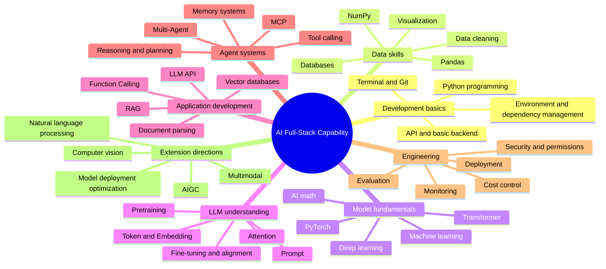

# AI Full-Stack Capability Map

The easiest way to get lost when learning AI is that you will see many terms at the same time: Python, math, machine learning, deep learning, Transformer, Prompt, RAG, Agent, MCP, vector databases, fine-tuning, deployment, security, and more. These are not side-by-side topics; they are layers of capability stacked on top of one another.

This course divides AI full-stack capability into seven layers: development basics, data skills, model fundamentals, LLM understanding, application development, Agent systems, and engineering plus extended directions.

## Remember this table first

| Layer | Problem it solves | What you will eventually build |
| --- | --- | --- |
| Development basics | Where to write code, how to run it, how to save it | Small runnable, reviewable projects |
| Data skills | How to clean, organize, and inspect materials | Data reports, charts, searchable materials |
| Model fundamentals | Why models can learn patterns from data | Basic models for classification, prediction, clustering, recommendation, and more |
| LLM understanding | Why LLMs can understand and generate text | Intuition for Prompt, Embedding, and Transformer |
| Application development | How to turn a model into a feature users can use | Chat assistants, knowledge-base Q&A, document processing tools |
| Agent systems | How to let AI break down tasks, use tools, and keep memory | Automation assistants, learning-planning Agents |
| Engineering and expansion | How to launch applications reliably and explore deeper directions | Deployed projects, evaluation systems, CV/NLP/AIGC works |

## Overall capability map

## How the seven layers connect

| From which layer to which layer | Connection |
| --- | --- |
| Development basics -> Data skills | First learn to write scripts, then you can automatically clean, summarize, and save data |
| Data skills -> Model fundamentals | The patterns a model learns come from data quality, features, and labels |
| Model fundamentals -> LLM understanding | Concepts such as Transformer, Embedding, and loss functions appear again and again |
| LLM understanding -> Application development | Only after understanding context, hallucinations, and boundaries can you design reliable Prompts and RAG |
| Application development -> Agent systems | RAG handles information retrieval, while Agents further break down tasks and call tools |
| Agent systems -> Engineering | Real production systems must handle permissions, logs, evaluation, cost, and error recovery |

## Minimal memory version

Combine the seven layers into one sentence: first get the code running, then organize the data, then understand how models learn, then use LLMs to build applications, and finally deploy, present, and review the project.

You do not need to memorize the entire map the first time you study it. Just remember this main thread: "tools -> data -> model -> LLM -> application -> Agent -> engineering" and you will not get lost in the terminology.
