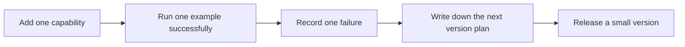
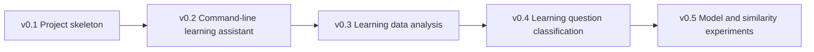
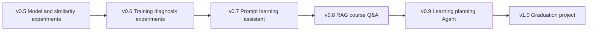

# AI Learning Assistant Version Roadmap


The AI Learning Assistant is the most recommended end-to-end project in this course. Its value is not in becoming a huge all-in-one product from the start, but in turning what you learn at each stage into a small version release: first it can run, then it can save data, then it can analyze, then it can connect to LLM, RAG, Agent, and multimodal capabilities.

This page answers one question in particular: what exactly should be added to the AI Learning Assistant at each stage, what evidence should be left behind, and when can you move on to the next version?

## First, look at the release rules



| Each version must have | What it proves |
|---|---|
| A way to run it | It does not only work by accident in the editor |
| Sample input and output | Users can understand what the feature looks like |
| Failure samples | You know where the system boundary is |
| Next version plan | The project is evolving continuously, not a one-time exercise |

## Overall version line





Version numbers are not a strict format. If your project progresses differently in practice, you can merge or split versions, but do not skip these four kinds of evidence: a way to run it, sample input and output, failure samples, and an evaluation method.

## v0.1 Project skeleton: make the project exist stably first

The goal of v0.1 is not to implement AI, but to build a repository that can keep evolving later. Many portfolio projects fail not because the model is weak, but because the project never had a directory structure, README, dependencies, or a run command from the beginning.

| Project item | Minimum version | Standard version | Acceptance evidence |
|---|---|---|---|
| Repository | Create the project directory and Git repository | Add `src/`, `data/`, `reports/`, `evals/`, `logs/` | commit history, directory screenshot |
| README | Clearly explain the project goal and run command | Add version records, input/output, and limitations | README can be reproduced step by step |
| Environment | Be able to run one Python entry file | Add dependency file and environment notes | screenshot of `python main.py` output |
| Records | Save one learning log | Standardize log fields | example JSON or Markdown |

Before moving to the next version, you should be able to run the project in a new terminal by following the README, not just make it work in the current editor.

## v0.2 Command-line learning assistant: make it able to record tasks

v0.2 corresponds to Python programming basics. The goal is to build a command-line learning assistant that can add learning tasks, view tasks, mark them as done, and save data to a JSON file.

| Feature | Minimum version | Standard version | Common failures |
|---|---|---|---|
| Add task | Enter a title and save it | Support topic, deadline, and priority | JSON write failure, path error |
| View tasks | Print all tasks | Support filtering by status or topic | Poor empty-data handling |
| Complete task | Modify the `done` field | Record completion time and notes | Unstable or out-of-range ID |
| Error handling | Return an empty list when the file does not exist | Give a friendly message when the file is corrupted | Only shows a traceback when an error occurs |

The core abilities in this version are Python file I/O, lists and dictionaries, functions, exception handling, and command-line input/output.

## v0.3 Learning data analysis: make it able to discover learning patterns

v0.3 corresponds to data analysis and visualization. The goal is to turn learning tasks and learning logs into analyzable data, such as study time, completion rate, high-frequency topics, procrastinated tasks, and weekly trends.

| Analysis question | Minimum output | Portfolio output |
|---|---|---|
| What topics do I spend my time on | Summarize minutes by topic | Chart + conclusion + limitations |
| Which tasks are most likely to be delayed | List delayed tasks | Delay reason categories and improvement suggestions |
| Is my learning stable | Daily or weekly study time | Trend chart and explanation of abnormal dates |
| Is the data trustworthy | Check missing and duplicate values | Data dictionary, cleaning log, before-and-after comparison |

In this version, do not just draw pretty charts. Every chart should answer a learning question and explain what limitations the data has.

## v0.4 Learning question classification: help locate sticking points

v0.4 corresponds to introductory applications of math and machine learning. The goal is to classify learning problems into categories such as environment, Python, data, model, Prompt, RAG, Agent, and deployment. The minimum version can use rules, and the standard version can train a simple classification model.

| Approach | Suitable stage | Evaluation method | Portfolio evidence |
|---|---|---|---|
| Keyword rules | Just starting classification | Manually check 20 samples | rule table, error samples |
| ML baseline | After learning machine learning | train/test metrics | metric table, confusion matrix |
| LLM classification | After learning Prompt | Compare fixed input-output pairs | Prompt version table, schema validation |
| RAG-assisted location | After learning RAG | Can it cite relevant course pages | retrieval logs, citation checks |

This version connects the earlier troubleshooting index with later RAG and Agent work: when a user enters a sticking point, the system first determines which category it belongs to, and then gives suggestions for which chapter to review.

## v0.5 Model and similarity experiments: understand the prerequisites of representation and retrieval

v0.5 corresponds to machine learning, vectors, and the prerequisites for understanding Embedding. The goal is to help the learning assistant compare similarity among learning questions, course chapters, and notes, preparing for later RAG work.

| Experiment | Minimum version | Standard version |
|---|---|---|
| Text similarity | Use simple bag-of-words or keyword overlap | Compare TF-IDF, Embedding, or different similarity methods |
| Chapter recommendation | Match chapters based on the question | Output recommendation reasons and confidence |
| Error analysis | Record mismatched samples | Analyze whether the issue is keywords, phrasing, or label boundaries |
| Metric explanation | Manually judge whether the match is correct | Count top-k hit rate or simple accuracy |

The key point in this version is not how advanced the algorithm is, but understanding that “the representation method affects retrieval results.” Many problems in later RAG work can be traced back to this layer.

## v0.6 Training diagnosis experiments: understand model failures

v0.6 corresponds to the basics of deep learning and Transformer. The AI Learning Assistant itself does not necessarily need to train a large model, but you need to understand the training loop, loss, validation set, overfitting, and failure samples through a small experiment.

| Training evidence | Minimum requirement | Portfolio requirement |
|---|---|---|
| Data | A small text or image dataset | Annotation notes and data split |
| Training | Run through a training loop | Save config, random seed, and logs |
| Evaluation | Output validation metrics | Confusion matrix, error samples, curves |
| Retrospective | Explain one failure | Describe possible causes and the next experiment |

The value of this version is that when you later face LLMs, fine-tuning, or multimodal models, you will not only look at the final result, but also pay attention to data, metrics, and failure attribution.

## v0.7 Prompt learning assistant: make it able to generate plans and retrospectives

v0.7 corresponds to LLM principles, Prompt, and structured output. The learning assistant starts connecting to an LLM API to help users generate study plans, review cards, question rewrites, and stage summaries.

| Feature | Minimum version | Standard version | Evaluation materials |
|---|---|---|---|
| Study plan | Enter a goal and output 3 to 5 tasks | Adjust the plan based on time, background, and goal | fixed input-output comparison |
| Review card | Organize learning records into a summary | Output structured JSON or Markdown | schema validation results |
| Question rewrite | Turn vague questions into clear ones | Generate multiple retrieval queries | Prompt version table |
| Failure handling | Retry manually when output is invalid | Automatic validation and retry | failure sample records |

The most important thing in this version is stability. Do not save only one nice answer; save the differences in output for the same set of inputs across different Prompt versions.

## v0.8 RAG course Q&A: make it answer based on materials

v0.8 is a key version of the end-to-end project. The goal is for the learning assistant to read course Markdown, personal notes, or project README files, answer questions based on the materials, and provide source citations.

| Module | Minimum version | Standard version | Portfolio evidence |
|---|---|---|---|
| Document import | Read Markdown text | Save metadata such as title, stage, and path | document list, chunk samples |
| Retrieval | Simple vector retrieval | Hybrid Search, Rerank, Query Rewrite | retrieval logs |
| Answering | Answer based on retrieved chunks | Refuse to answer or ask for more material when there is no answer | Q&A samples, citation checks |
| Evaluation | 10 fixed questions | gold_doc, gold_answer, citation_ok | eval questions, failure statistics |

In this version, focus on recording why RAG fails: was the document not imported, were the chunks cut poorly, was the query unclear, did retrieval miss, or did the model fail to use the citations faithfully?

## v0.9 Learning planning Agent: make it able to execute multi-step tasks

v0.9 corresponds to the Agent stage. The learning assistant upgrades from “answering questions” to “executing tasks around a goal.” For example, if the user says “help me prepare for RAG review,” it can break the task into several steps such as looking up materials, listing key points, generating practice questions, arranging review, and outputting a plan.

| Agent capability | Minimum version | Standard version | Risk control |
|---|---|---|---|
| Task decomposition | Generate a step list | Adjust steps based on intermediate results | Limit the maximum number of steps |
| Tool calling | Call the course retrieval tool | Call todo, summary, and evaluation tools | tool whitelist |
| Execution trace | Print each action and observation | Save `agent_traces.jsonl` | trace can be replayed |
| Human confirmation | Pause on high-risk steps | Distinguish read-only, write, send, delete | default dry-run |

In this version, do not chase “fully autonomous models.” A better portfolio story is: I restricted tool permissions, recorded execution traces, set stop conditions, and evaluated completion rate and tool error rate with a fixed task set.

## v1.0 Graduation project: organize the learning assistant into a showcaseable product

v1.0 does not have to have the most features, but it should be complete, runnable, explainable, and evaluable. It can be a RAG course Q&A assistant, a learning planning Agent, a multimodal courseware assistant, or a combination of the three.

| Graduation requirement | Minimum standard | Excellent standard |
|---|---|---|
| Problem definition | Explain which learning problem and who it solves for | Have user scenarios, boundaries, and cases where it should not be used |
| Run mode | Can run locally | Includes deployment, environment variables, and startup instructions |
| Examples | 3 successful examples | Includes success, failure, and boundary examples |
| Evaluation | Fixed question or task set | Completion rate, citation accuracy, cost, and failure type statistics |
| Engineering | README, logs, configuration | Monitoring, rate limiting, security boundaries, regression tests |
| Demonstration | Screenshots or screen recording | Demo script, portfolio description, retrospective article |

When presenting at the end, do not just say “I built an AI assistant.” A better way to say it is: this project iterated from the v0.1 command-line tool to v1.0, and each version left behind run records, failure samples, and evaluation evidence.

## Fixed record template for each version

It is recommended that every time you complete a version, you add a version record in the project README or `reports/improvement_record.md`.

```md
## v0.x Version Name

### Goal of this version
What problem does this version aim to solve?

### New capabilities
What features or modules were added in this version?

### Run mode
What command is used to run it, and what data or configuration does it depend on?

### Sample input and output
Provide one real input and the corresponding output.

### Evaluation method
Which samples, metrics, or manual checks are used to judge the result?

### Failure samples
Record at least one failed input, the actual result, the cause, and the fix plan.

### Next version plan
What capability will be added in the next version?
```

If you can stick to this template, you will not need to reorganize your portfolio materials when you graduate, because the project growth process has already been recorded.
