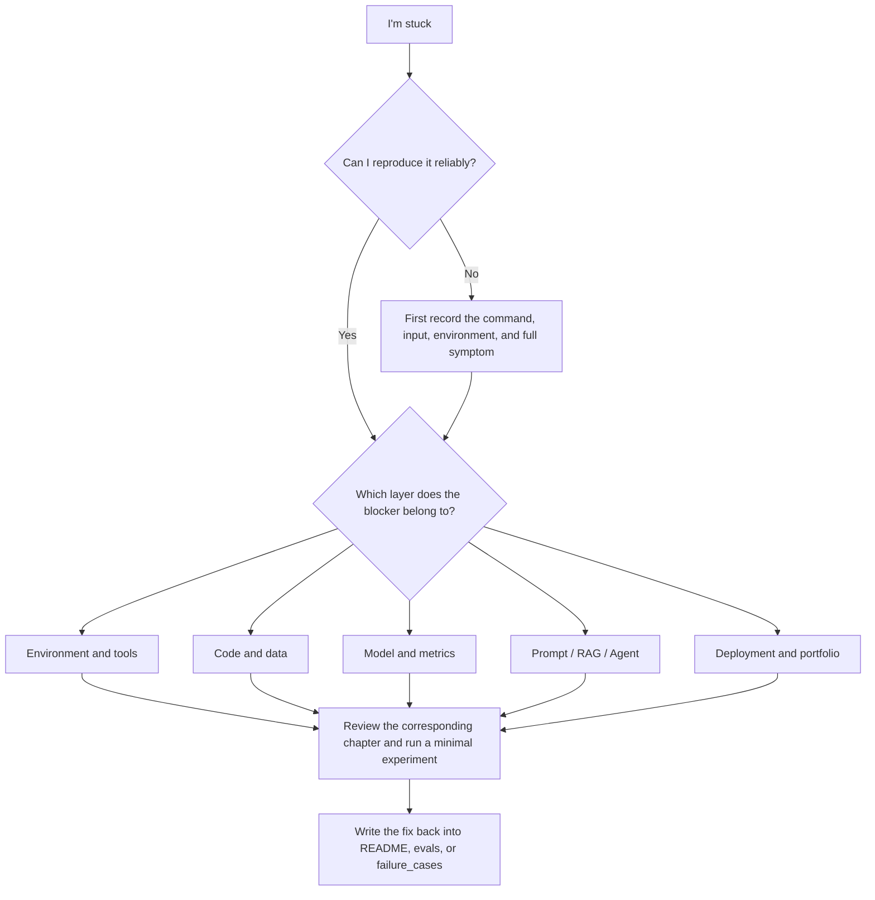

# Learning Blocker Diagnosis Map


When learning AI full-stack, getting stuck does not mean you are not suited for it. It usually means the current project has exposed a gap in some layer of your skills. The most effective response is not to keep forcing your way through later chapters, but to first identify which layer the blocker belongs to, then go back to the corresponding content and run a minimal reproduction experiment.

The difference between this page and the [Common Errors and Troubleshooting Index](/intro/troubleshooting-index) is: the troubleshooting index focuses more on specific errors, while this page focuses more on learning paths and project return-to-learn actions. You can think of it as a map for “tracing course chapters backward from failure symptoms.”

## Overall diagnosis flow



When you hit a blocker, first ask four questions: Can I reproduce it, what is the input, what do I expect, and what actually happened. If these four things are unclear, prioritize taking notes before filling knowledge gaps.

## Quick location table

| Blocker symptom | What is probably missing | Review first | Minimal fix action | Portfolio evidence |
|---|---|---|---|---|
| Commands do not run, environment is chaotic | Development tools and runtime environment | 1 Developer tools basics, environment setup | Rerun once from a new terminal according to the README | Command log, environment versions, fix notes |
| Python scripts often have path errors or cannot read files | File paths, exception handling, project structure | 2 Python programming basics | Write a minimal file read/write script | Input file, output file, exception examples |
| Data analysis conclusions are not trustworthy | Data quality and cleaning process | 3 Data analysis and visualization | Print checks for missing values, duplicates, and outliers | Data dictionary, cleaning log, chart explanations |
| I do not understand similarity, loss, probabilities, or metrics | Mathematical intuition and metric interpretation | 4 AI math basics | Reproduce one metric with 5 lines of code | Small experiment, hand-calculation notes, metric boundaries |
| Model scores are very high, but I do not trust them | Data leakage, baseline, evaluation method | 5 Machine Learning | Redo the train/test split and the Dummy baseline | Baseline, metric table, error samples |
| Training does not converge, shape mismatch | Deep learning training loop | 6 Deep learning and Transformer | Print tensor shapes and run an overfit test on a tiny dataset | Training logs, curves, failed samples |
| LLM output format drifts, JSON is unstable | Prompt, schema, validation, retry | 7 Large models and Prompt | Fix 10 inputs and compare outputs | Prompt versions, schema validation results |
| RAG answers are off-topic or citations do not support them | Document processing, retrieval, RAG evaluation | 8 LLM applications and RAG | Print retrieval results only, without calling the model | chunks, retrieval logs, citation_check |
| Agent loops forever or uses tools incorrectly | Goal boundaries, tool schema, stop conditions | 9 AI Agent | Limit to 3 steps and save the trace | agent_traces, tool_calls, safety boundaries |
| Multimodal outputs look good but are uncontrollable | Assets, review, export, and quality standards | 10–12 expansion directions | Save input assets and manual review records | Asset sources, review table, failed samples |
| The project runs, but I cannot explain it clearly | README, evaluation, and postmortem are missing | Project delivery standards, portfolio checklist | Add run instructions, examples, and failed samples | README, demo_notes, improvement_record |
| It runs locally, but others cannot run it | Dependencies, configuration, deployment instructions | Engineering, environment setup, deployment chapters | Rerun in a clean directory according to the README | `.env.example`, dependency files, deployment logs |

Once you have located the problem, do not just “read the relevant chapter once.” It is much more effective to perform a minimal fix and write the result back into the project materials.

## Environment and tool blockers

Environment issues most easily make beginners think they are not good at this. In reality, they are usually related to the current directory, PATH, Python environment, Node dependencies, or Git state.

| Symptom | What to check first | Return to chapter | What to add after fixing |
|---|---|---|---|
| `command not found` | Whether the command is installed and whether the current shell has loaded PATH | Terminal and command line, package managers | Add installation commands to the README |
| `ModuleNotFoundError` | Whether pip installed into the current Python environment | Python environment, virtual environments | `requirements.txt` or dependency notes |
| `npm run start` fails | Whether you are in the project root and whether dependencies are installed | Development environment setup | Record the Node version and startup command |
| Git commit fails | Whether Git has been initialized, staged, and configured with your identity | Git and version control | Record the `git status` troubleshooting steps |

The minimal experiment is: close the current terminal, open a new terminal, and run the full process from the project root according to the README. If it still does not work, then the README or environment instructions are not complete enough yet.

## Python, data, and project structure blockers

If you can write some code, but often get stuck on paths, JSON, DataFrame, encoding, or empty data, it means you need to return to “how data is checked and protected after it enters the program.”

| Symptom | Possible cause | Minimal experiment | Return to chapter |
|---|---|---|---|
| Relative paths break after changing directories | Working directory not understood | Print `Path.cwd()` and the target file path | Python file reading and writing |
| Program crashes after a JSON file is damaged | Missing exception handling | Prepare a corrupted JSON test case | Exception handling, file I/O |
| DataFrame column names do not match | Header, spaces, case, or delimiter issues | Print `df.columns.tolist()` | Pandas reading and cleaning |
| Charts have conclusions, but the explanation is weak | No connection to the business question | Write one sentence for each chart answering “what question does this answer?” | Data visualization best practices |

After fixing this layer, your project should include more samples of exceptional input, empty input, corrupted files, or data quality checks.

## Model and metric blockers

A common mistake in the model stage is only looking at scores, without checking whether the scores are trustworthy. Whenever you run into “the score is too high, too low, hard to explain, or tuning has no direction,” you should return to the baseline, split, metrics, and error samples.

| Symptom | First check | Minimal experiment | Evidence to leave behind |
|---|---|---|---|
| Accuracy is unusually high | Data leakage, duplicate samples, answer field | Remove suspicious features and retrain the baseline | Leakage check record |
| Validation set is very poor | Overfitting, too little data, unreasonable split | Compare the training/validation curves | Curves and error samples |
| Loss does not decrease | Learning rate, label format, normalization | Overfit test on a tiny dataset | Configuration and training logs |
| Metrics are hard to explain | Metrics do not match the business question | Manually calculate metrics with 5 samples | Metric explanation document |

If the project does not have a baseline, do not rush to talk about model optimization. First build the simplest possible baseline; many issues will reveal themselves naturally.

## Prompt and LLM blockers

The most common blocker in LLM projects is “it seems to answer, but it is not stable.” If the output format drifts, fields are missing, hallucinations appear, or costs suddenly rise, treat the Prompt as a testable component rather than one-time text.

| Symptom | Possible cause | Minimal fix | Evaluation material |
|---|---|---|---|
| JSON is missing fields | Schema is unclear or not validated | Add required fields and validation | prompt_eval_cases.csv |
| The same question produces very different outputs | Weak Prompt constraints, high temperature, insufficient examples | Fix 10 inputs and compare versions | Prompt version table |
| The answer invents facts | No restriction on information sources | Require refusal when there is no evidence | Failed samples and refusal examples |
| Costs are high | Context is too long, too many retries | Record tokens and request count | llm_calls.jsonl |

The goal at the Prompt stage is not to write one universal prompt, but to build versioning, testing, and regression awareness.

## RAG blockers

When RAG fails, do not blame the model first. Turn the model off and only look at the retrieval results. If retrieval does not hit the right materials, the generation step will be hard to trust.

| Symptom | Diagnosis order | Minimal experiment | Return to chapter |
|---|---|---|---|
| No relevant documents are retrieved | Were the documents ingested, are chunks reasonable, does the query match | Search using keywords from the original text | Document processing, vector retrieval |
| Relevant documents are retrieved but the answer is wrong | Does the Prompt require grounding in sources, did the model ignore the retrieved snippets | Feed the retrieved snippets directly to the model | RAG generation and citation |
| Citations do not support the answer | Is citation precise enough at the chunk level, can the answer sentence be aligned | Manually label `citation_ok` | RAG evaluation |
| A slight rewrite of the question causes failure | Query rewrite, synonyms, or metadata filtering are insufficient | Test with 10 fixed rewritten questions | Retrieval optimization |

Core evidence for a RAG project includes `eval_questions`, `gold_doc`, `gold_answer`, `citation_ok`, `retrieval_logs`, and failure type statistics.

## Agent blockers

When an Agent gets stuck, it is usually not because “the model is not smart enough,” but because the goal, tools, state, and stop conditions are not well designed. An Agent project must be able to replay every step, otherwise one successful demo is not credible enough.

| Symptom | First check | Minimal fix | Portfolio evidence |
|---|---|---|---|
| It loops forever | Is the goal too broad, are the stop conditions clear | Set a maximum number of steps and completion conditions | trace comparison |
| Tool parameters are wrong | Are the schema, examples, and required fields clear | Manually write one tool call | tool schema and error samples |
| The wrong tool is chosen | Tool descriptions overlap or permission boundaries are unclear | Merge or rewrite tool descriptions | `tool_calls.jsonl` |
| Unauthorized actions occur | Are read-only, write, delete, and send actions distinguished | Require manual confirmation for high-risk actions | Safety boundary notes |
| It finishes but cannot be replayed | No `thought/action/observation` records | Save `agent_traces.jsonl` | trace replay examples |

The minimum acceptance standard for an Agent is not “it completed a task,” but “when it fails, it can explain which step went wrong.”

## Portfolio and course-planning blockers

Some learners are not blocked technically, but by course planning and project presentation: they have learned a lot but do not know how to show it, the project runs but cannot be explained clearly, or every stage feels like starting from zero.

| Symptom | Core problem | Return page | Fix action |
|---|---|---|---|
| Do not know what to learn first | Roadmap selection is unclear | Four main learning tracks | Choose one track and stick with one phase |
| Projects are disconnected across phases | No running-through project | AI learning assistant version roadmap | Merge phase outputs into the same project |
| Many projects but no portfolio | Delivery standards are missing | Project page delivery standards, portfolio checklist | Standardize README, screenshots, evaluation, and postmortem |
| Forget everything after finishing a chapter | No minimal practice | Course page usage guide | Add one runnable action for each chapter |
| Do not know what to choose for the capstone | Input materials and goals are unclear | Capstone project design guide | Use a decision tree to pick a direction |

When the course feels too big, do not add more materials. First reduce the current goal: only complete the minimum deliverable for the current track, current phase, and current project version.

## Blocker recording template

Each time you get stuck, it is recommended to record it as a reusable entry. This way, your failure is not wasted, but becomes engineering evidence in your portfolio.

```md
## Blocker title

### Current phase
Which stop I am learning at, and which project version I am working on.

### Symptom
What command I ran or what input I gave, and what actually happened.

### Expected result
What I originally thought should happen.

### Attribution layer
Environment / Python / data / mathematical metrics / Machine Learning / deep learning / Prompt / RAG / Agent / deployment / portfolio presentation.

### Minimal reproduction
Use the smallest input or smallest command to reproduce the issue.

### Return-to-learn chapter
Which course pages I reviewed.

### Fix action
What I changed, and why I changed it.

### Regression check
Which test case I will use later to confirm it does not come back.
```

Smooth learning does not mean never failing. It means being able to quickly locate, fix, record, and regress after failure. Every blocker can become a piece of evidence, and then the course will feel lighter and lighter to learn.
