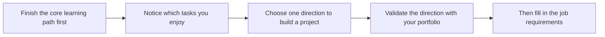

# Career Path Exploration Guide

> **Recommended time to read:** After completing 3 Data Analysis and Visualization (by then, you will have a foundation in Python and data analysis, which helps you better understand the differences between each path)  
> **Reading time:** 20-30 minutes  
> **Goal:** Understand the main career paths in the AI industry, evaluate which one suits you best, and create a targeted learning plan

---

## Don’t rush to choose a role



| If you prefer | Focus on |
|---|---|
| Building products, connecting APIs, solving business problems | LLM Application Engineer, AI Agent Engineer |
| Data, metrics, experiments, and model performance | Data Science, Machine Learning, Model Engineering |
| Images, video, and visual detection | CV Engineer, Multimodal direction |
| Text understanding, extraction, search, and Q&A | NLP, RAG Engineer |

## Part 1: The AI career landscape

### Seven mainstream directions at a glance

| Direction | One-sentence summary | Core tech stack | Monthly salary range | Job volume | Entry barrier |
|------|----------|----------|---------|:---:|:---:|
| **LLM Application Engineer** | Build products with LLMs | Python, LLM APIs, RAG, LangChain | 20-50K | ⭐⭐⭐⭐⭐ | ⭐⭐⭐ |
| **AI Agent Engineer** | Build AI that can act autonomously | LangGraph, MCP, Function Calling | 25-60K | ⭐⭐⭐⭐ | ⭐⭐⭐⭐ |
| **CV Engineer** | Enable AI to understand images and video | PyTorch, OpenCV, YOLO | 20-45K | ⭐⭐⭐⭐ | ⭐⭐⭐⭐ |
| **NLP Engineer** | Enable AI to understand and generate text | Transformers, BERT, fine-tuning | 22-50K | ⭐⭐⭐⭐ | ⭐⭐⭐⭐ |
| **AIGC Engineer** | Use AI to generate images, video, and music | Stable Diffusion, ComfyUI | 25-55K | ⭐⭐⭐ | ⭐⭐⭐⭐⭐ |
| **AI Algorithm Researcher** | Improve algorithms and publish papers | Deep learning, advanced math, paper reproduction | 30-80K | ⭐⭐ | ⭐⭐⭐⭐⭐ |
| **MLOps / Deployment Engineer** | Keep models running reliably in production | Docker, K8s, TensorRT, ONNX | 22-48K | ⭐⭐⭐ | ⭐⭐⭐⭐ |

:::tip 2025 trend
**LLM applications** and **Agent development** have grown rapidly in recent years. CV and NLP roles are relatively mature and stable, but competition is also more intense. The AIGC path has broad potential, but the number of openings varies by industry and region.
:::

### A typical workday in each direction

Imagine your day after joining the company and see which one makes you think, “I could do this for life”:

**🔵 A day in the life of an LLM Application Engineer**

| Time | What you do |
|------|-------|
| 09:00 | Optimize the retrieval recall of a RAG system and adjust the text chunking strategy |
| 11:00 | Debug Prompt templates to make the LLM output a more stable JSON format |
| 14:00 | Analyze bad cases from user feedback and identify whether the issue is retrieval or generation |
| 16:00 | Compare the performance of DeepSeek and Qwen, and prepare a model migration plan |

**🟢 A day in the life of a CV Engineer**

| Time | What you do |
|------|-------|
| 09:00 | Train an object detection model and try a new data augmentation strategy |
| 11:00 | Clean and label the dataset, and handle a batch of bad cases from detection errors |
| 14:00 | Use TensorRT to optimize inference speed and prepare for deployment on edge devices |
| 16:00 | Read the YOLOv11 paper and evaluate whether an upgrade is worth it |

**🟡 A day in the life of an AI Agent Engineer**

| Time | What you do |
|------|-------|
| 09:00 | Design a new Agent workflow: receive user needs → break down tasks → call tools → summarize results |
| 11:00 | Develop an MCP Server so the Agent can query the company’s internal database |
| 14:00 | Debug a multi-Agent collaboration system and solve information loss between Agents |
| 16:00 | Optimize token usage and response speed, reducing one request from 15 seconds to 3 seconds |

---

## Part 2: Self-check for direction fit

Use the questions below to find your tendency. No need to score strictly—just follow your intuition.

### Test A: What are you most interested in?

- [ ] Helping AI understand requirements, solve problems, and complete tasks → **LLM Application / Agent**
- [ ] Helping AI “understand” images and video → **CV**
- [ ] Helping AI understand and generate human language → **NLP**
- [ ] Creating images, video, and music with AI → **AIGC**
- [ ] Researching new algorithms and pursuing SOTA → **Algorithm research**
- [ ] Making models run fast and reliably → **MLOps / Deployment**

### Test B: Which working style do you prefer?

- [ ] Fast iteration and seeing product results quickly → **Application development** (LLM applications, Agent)
- [ ] Going deep and optimizing every detail → **Algorithm / deployment**
- [ ] Solving real business problems and working closely with product and business teams → **Application / Agent**
- [ ] Exploring the unknown and pursuing cutting-edge work → **Research / AIGC**

### Test C: Your background

- [ ] Good at math and like derivations → Any direction works; algorithm research is also possible
- [ ] Average at math, but strong at understanding → Most directions are fine (as long as the math is enough)
- [ ] Weak at math, but strong at hands-on work → **Application development** is the most beginner-friendly (frameworks and tools package most of the math for you)
- [ ] No programming background at all → Don’t rush to choose a direction; finish 2 Python Programming Basics first

### Result reference

| Your tendency | Recommended direction | Focus in this course |
|------------|---------|-------------|
| Mostly application-oriented choices | LLM Application + Agent | Focus on 8 LLM Application Development and RAG, 9 AI Agent and Intelligent Agent Systems |
| Mostly vision-oriented choices | CV | Focus on 10 Computer Vision and do more projects |
| Mostly language-oriented choices | NLP + LLMs | Focus on 11 Natural Language Processing, 7 LLM Principles, Prompt, and fine-tuning |
| Mostly creative choices | AIGC | Focus on 12 AIGC and multimodal |
| Mostly research-oriented choices | Algorithm research | Build a strong math foundation and read more papers |
| Mostly engineering-oriented choices | MLOps / Deployment | After finishing the core path, focus on Elective Module A |

:::info It’s okay if you can’t choose yet
Many people only truly clarify their direction after learning 6 Deep Learning and Transformer Basics. Stages 1–6 are the common foundation for most directions, so there is no such thing as “choosing the wrong direction and wasting time.” Start learning first, and figure it out as you go.
:::

---

## Part 3: Create your learning plan

### Four example plans

Choose the one that is closest to your goal and available time:

#### Plan 1: LLM Application Engineer (fastest to employment, recommended)

```
1 Developer Tool Basics → 2 Python Programming Basics → 3 Data Analysis and Visualization → 4 AI Math (just enough) →
5 Machine Learning → 6 Deep Learning (focus on Transformer) → 7 LLM Principles → 8 LLM Application Development and RAG (focus) → 9 AI Agent (focus) → Job search
```

- **Time:** 8-10 months full-time
- **Core strengths:** RAG systems, Prompt engineering, Agent development
- **Best for:** People who want to enter the AI industry quickly

#### Plan 2: CV Engineer

```
1 Developer Tool Basics → 2 Python Programming Basics → 3 Data Analysis and Visualization → 4 AI Math (learn in parallel) →
5 Machine Learning → 6 Deep Learning → 10 Computer Vision (focus, 3-4 projects) → Deployment path → Job search
```

- **Time:** 10-12 months full-time
- **Core strengths:** Object detection, image segmentation, model deployment
- **Best for:** People interested in image processing and who enjoy the sense of accomplishment from visual results

#### Plan 3: Full-stack AI Engineer (strongest competitiveness)

```
All core stages + Elective Module A (deployment) + Elective Module E (frontend) → Apply for senior positions
```

- **Time:** 16-20 months full-time
- **Core strengths:** End-to-end capability from algorithms to products
- **Best for:** People with enough time who want the strongest competitiveness

#### Plan 4: Fast career switch (already have Python basics)

```
1 Developer Tool Basics (quick pass) → 2 Python Programming Basics (quick pass) → 3 Data Analysis and Visualization → 4 AI Math, 5 Machine Learning (focus on practice) →
6 Deep Learning → 7 LLM Principles → 8 LLM Application Development and RAG → 9 AI Agent → Job search
```

- **Time:** 6-8 months full-time
- **Best for:** People who already have a Python and data analysis foundation and want to switch into AI quickly

### Monthly target reference (full-time study · Plan 1)

| Month | Learning stage | Goal | Key output |
|:---:|---------|------|---------|
| Month 1 | 1 Developer Tool Basics, 2 Python Programming Basics | Become proficient in Python | Web scraping project, Web API |
| Month 2-3 | 3 Data Analysis and Visualization | Master data analysis | Complete data analysis report |
| Month 4-6 | 4 AI Math, 5 Machine Learning, 6 Deep Learning | Understand ML/DL principles | House price prediction, image classification project |
| Month 7-9 | 7 LLM Principles, 8 LLM Application Development and RAG | Master LLM applications | RAG application, fine-tuning project |
| Month 10 | 9 AI Agent and Intelligent Agent Systems | Master Agent development | Agent project + portfolio |

### Weekly time allocation template (part-time · 15-20 hours per week)

| Time | Content | Method |
|------|------|------|
| Monday to Friday evenings (2h per day) | Theory + coding practice | Watch tutorials + code along |
| Saturday morning (3-4h) | Focused learning of new knowledge | Deep dive into this week’s key points |
| Saturday afternoon (2-3h) | Project practice | Build course projects or do Kaggle |
| Sunday morning (2-3h) | Review + notes | Organize code and write study notes |

---
