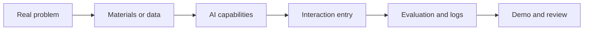
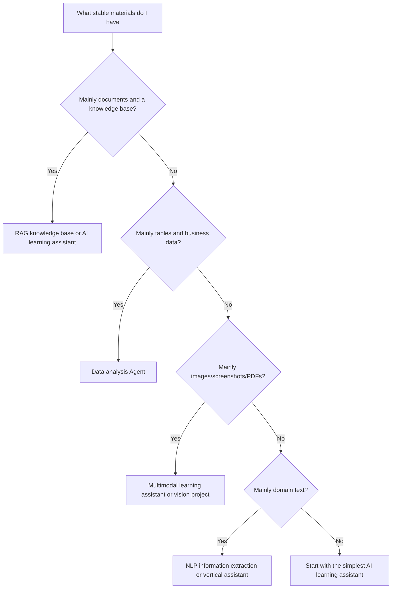

# Final Project Design Guide


A final project is not about building a bigger exercise. It is about turning everything you learned across the course—development tools, Python, data processing, machine learning, deep learning, LLM applications, RAG, Agent, deployment, and evaluation—into one complete work. Its goal is not to prove that you “read many chapters,” but to prove that you can independently break a real problem into requirements, data, models, systems, evaluation, and iteration plans.

If you are not sure what to choose, prioritize the “AI Learning Assistant” used throughout the course. This project naturally covers knowledge base processing, retrieval, Q&A, citations, study plans, tool calling, logs, evaluation, and deployment. It demonstrates both AI application ability and engineering thinking.

## First, look at the diagram: a final project must be a closed loop



| Closed-loop stage | Minimum requirement |
|---|---|
| Real problem | Explain the user, scenario, and pain point |
| Materials or data | Explain the source, format, and cleaning method |
| AI capabilities | Explain whether you used Prompt, RAG, Agent, a model, or multimodal methods |
| Evaluation and logs | Have fixed examples, failure cases, and key logs |
| Demo and review | Have a README, screenshots, or a demo script |

## What problem should the final project solve?

A qualified final project should first explain who the user is, what the problem is, why AI is needed, what the process looks like without AI, and what improvement you hope to achieve after adding AI. Do not start by saying, “I want to build a RAG system” or “I want to build an Agent,” because RAG and Agent are implementation methods, not project goals.

A better description is: learners often do not know which chapter to study first, how a concept relates to previous and next chapters, or where to look when they hit an error. So the project should provide a course Q&A and study-planning assistant. It can read course documents, give answers with sources, recommend learning paths based on learning goals, and generate troubleshooting steps when the user gets stuck.

## Final project topic decision tree

If you do not know which final project to pick, do not first ask, “Which technology is the hottest?” Instead, ask, “What materials can I most easily get, what evaluation criteria can I define most easily, and what kind of ability do I most want to showcase?” You can choose in the following order.



| Selection condition | Recommended direction | Minimum closed loop | Evaluation focus |
| --- | --- | --- | --- |
| Have course docs, company docs, or a knowledge base | RAG / AI learning assistant | Import documents, retrieve, answer, cite | Hit rate, citation support, no-answer handling |
| Have CSV, Excel, or business metrics | Data analysis Agent | Read data, generate charts and reports | Analysis correctness, code safety, chart explanation |
| Have images, screenshots, PDFs, or courseware | Multimodal learning assistant | Extract visual information and structure it | OCR/parsing quality, uncertainty, manual review |
| Have comments, contracts, resumes, or customer service text | NLP / domain assistant | Classification, extraction, or summarization | Label boundaries, field accuracy, factual consistency |
| Want to showcase full AI application engineering ability | AI learning assistant | RAG + tool calling + logs + evaluation | Reproducibility, observability, reviewability |

The default recommendation is still the AI learning assistant, because it naturally covers Prompt, RAG, Agent, logs, evaluation, and deployment. If you already have clear industry materials, choose a vertical assistant instead; if you have visual or creative materials, then choose a multimodal or AIGC project.

## How to recover when you get stuck later in the course

The final project will expose the weak spots from earlier stages. Do not treat getting stuck as failure. It is actually telling you which stage to review.

| Project bottleneck | Review first | Ability to strengthen |
| --- | --- | --- |
| Others cannot run the commands in the README | 1 Development tools basics | Environment, paths, dependencies, Git, and reproducibility instructions |
| Python scripts become messy | 2 Python programming basics | Function decomposition, exception handling, module organization, and file I/O |
| RAG document chunking and data processing are confusing | 3 Data analysis and visualization | Data cleaning, field descriptions, data quality records |
| Embedding, similarity, or metrics are hard to understand | 4 AI math basics | Vectors, probability, gradients, and evaluation intuition |
| Model scores are not trustworthy | 5 Machine learning | Baseline, data splitting, metrics, and error analysis |
| Training curves are hard to read | 6 Deep learning and Transformer | Loss, optimizer, overfitting, and training diagnosis |
| Prompt outputs are unstable | 7 LLM principles and Prompt | Structured output, Prompt versioning, and fixed test samples |
| RAG answers are wrong but you do not know why | 8 LLM applications and RAG | Retrieval logs, citation checks, evaluation sets, and failure attribution |
| Agent behavior is uncontrollable | 9 AI Agent | Tool schema, trace, permission boundaries, and human confirmation |
| Multimodal results cannot be delivered | 10 Computer vision, 11 Natural language processing, 12 AIGC and multimodal | Annotation, material sources, review checklist, and export format |

A truly mature final project is not one that gets everything right on the first try. It is one where each failure can be traced to a specific layer: data, retrieval, Prompt, tools, model, deployment, or evaluation. This recovery table can serve as a checklist during project review.

## Minimum deliverable version

The first version of the final project should keep the scope small and only do one shortest path. Using the AI learning assistant as an example, the minimum version only needs to: read a set of Markdown course documents, chunk and index them, accept one learning question, return an answer and its source, save one Q&A log, and provide 10 fixed test questions.

This version does not need a complex UI, multiple Agents, long-term memory, or automatic planning for all learning tasks. First make the system runnable, observable, and evaluable, and then expand it. The most common problem in a final project is not insufficient technology, but an overly large scope, which leaves no closed loop actually usable in the end.

## Standard version structure

The standard version should include six modules: data ingestion, core capabilities, interaction entry, evaluation system, observability, and deployment instructions.

Data ingestion explains where the data comes from, how it is cleaned, how it is chunked, and how it is updated. Core capabilities explain which models, retrieval strategies, prompts, tools, or Agent workflows are used. The interaction entry can be a CLI, Notebook, web page, or API. The evaluation system should include a fixed question set, expected answer points, citation checks, and failure case analysis. Observability should record requests, retrieved chunks, model outputs, tool calls, latency, and errors. Deployment instructions should let others reproduce the run in a new environment.

## Challenge version directions

After the standard version is stable, you can choose one challenge direction to go deeper. Do not try too many challenge items at once, or it will easily get out of control. Suitable challenges include adding user learning profiles and personalized paths, adding multi-turn conversation memory, adding tool calls to generate review plans or practice questions, adding permission and sensitive-content filtering, adding an automatic evaluation dashboard, adding a frontend page, or deploying the project to a cloud server.

The value of the challenge version is not “more features,” but your ability to explain why you added this feature, what problem it solves, what trade-offs it brings, and how you evaluate whether it is actually better.

## README must-have content

The README for a final project should let the reviewer understand the project without asking you. At minimum, include the project background, target users, feature list, architecture diagram, run instructions, sample inputs and outputs, evaluation method, key technical choices, failure cases, known limitations, and next steps.

The easiest thing to overlook is failure cases and known limitations. A portfolio project does not need to pretend to be perfect. On the contrary, clearly explaining where the system fails, why it fails, and how you plan to fix it often better demonstrates engineering ability.

## Evaluation and review standards

Prepare at least 20 to 50 test questions or tasks for the final project. For RAG projects, evaluate whether retrieval hits the right content, whether the answer cites sources, whether the citation supports the conclusion, and whether hallucinations appear. For Agent projects, evaluate whether the task is completed, whether the tools are called correctly, whether the steps are traceable, and whether the system can recover after failure. For multimodal projects, evaluate output quality, consistency, controllability, and the manual review process.

When reviewing, do not just write “the result is good.” A better review method is to separate successful samples, failed samples, and boundary samples, and explain what each type of sample revealed. For example, a retrieval miss may be caused by the chunking strategy, an inaccurate answer may be caused by insufficient Prompt constraints, an incorrect tool call may be caused by an unclear tool description, and high cost may be caused by an unreasonable model choice or context strategy.

## Final project ability integration checklist

The most important thing in a final project is to connect the abilities you learned earlier, not to showcase a single technology in isolation. An AI full-stack final project should at least be able to explain what each of the following layers does.

| Ability layer | Minimum requirement | Portfolio-level requirement |
| --- | --- | --- |
| Problem definition | Clear user and scenario | Can explain why AI is needed and what alternatives exist without AI |
| LLM API layer | Unified model call entry | Record model, prompt_version, tokens, latency, error |
| Prompt layer | Reusable prompt templates | Have version history, fixed test inputs, and failure samples |
| RAG layer | Can retrieve materials and cite sources | Have chunk, metadata, top-k, score, citation check |
| Agent / tool layer | Can call at least one tool | Have tool schema, permission boundaries, trace, and human confirmation strategy |
| Evaluation layer | Fixed test questions | Have baseline, metrics, failure attribution, and improvement records |
| Observability | Save basic logs | Can replay the retrieval, model calls, and tool execution process for one request |
| Deployment layer | Can run in a new environment | Have environment variables, startup commands, limitation notes, and production troubleshooting methods |

You can use this table as the overall acceptance checklist for the final project. You do not need every layer to be very complex, but you cannot have only one final answer. The reviewer should be able to see what steps the system goes through from input to output, and how to troubleshoot each step if something goes wrong.

## A recommended final project directory structure

Using the AI learning assistant or knowledge base assistant as an example, the project directory can be organized like this:

```text
ai-fullstack-final-project/
├── README.md
├── docs/
│   ├── architecture.md
│   ├── evaluation.md
│   └── failure_cases.md
├── data/
│   ├── raw/
│   ├── chunks.jsonl
│   └── eval_questions.csv
├── src/
│   ├── llm_client.py
│   ├── prompts.py
│   ├── retrieval.py
│   ├── agent.py
│   ├── observability.py
│   └── app.py
├── logs/
│   ├── llm_calls.jsonl
│   ├── retrieval_logs.jsonl
│   └── agent_traces.jsonl
└── reports/
    ├── baseline.md
    ├── improvement_record.md
    └── demo_notes.md
```

This structure is not mandatory, but it reflects an important idea: code, data, logs, evaluation, and review should be separated. That way, when others look at the project, they can more easily tell whether you truly understand the full engineering pipeline.

## Final project demo script

It is best to prepare a fixed demo script for the final project. During the demo, do not just ask a random question on the spot. Instead, show the complete closed loop in a fixed order.

| Time | Demo content | Key point |
| --- | --- | --- |
| 1 minute | Project background and user problem | Why this problem is worth solving |
| 2 minutes | System architecture | Where the LLM, RAG, Agent, and logs are |
| 3 minutes | One successful example | Input, matched document, answer, citation, trace |
| 2 minutes | One failure example | Which layer failed and how you located it |
| 2 minutes | Evaluation results | Baseline, after optimization, remaining issues |
| 1 minute | Next steps | What to optimize next and why |

Being able to show a failure example is the key step that moves a final project from “showing a work sample” to “showing engineering ability.” Real systems will fail. What matters is whether you can locate and improve the problem.

## Questions you are most likely to be asked in an interview

Once a final project becomes part of your portfolio, people often ask not “what framework did you use,” but questions like these:

| Question | What you should be able to answer |
| --- | --- |
| Why use RAG instead of a long context directly? | Trade-offs in data updates, citations, cost, and controllability |
| Why do we need an Agent instead of a fixed workflow? | Whether there are dynamic decisions, multi-step tools, and observe-then-act behavior |
| If the answer is wrong, how do you locate the problem? | Check retrieval logs, context, prompt, tool trace, and citation checks |
| How do you control cost and latency? | top-k, context length, model choice, caching, and retry limits |
| How do you handle high-risk actions? | Tool permissions, human confirmation, audit logs, and rollback plans |
| What are the project’s remaining limitations? | Data scale, evaluation coverage, model stability, and deployment constraints |

If you can answer these questions clearly, then your final project is not just “running,” but something you can discuss in terms of engineering trade-offs.

## Final project passing standards

| Level | Standard | Explanation |
| --- | --- | --- |
| Minimum pass | Can run the full flow | Has input, processing, output, logs, and examples |
| Recommended pass | Can explain technical choices | Can explain why this model, framework, retrieval method, or tool design was chosen |
| Portfolio pass | Can evaluate and review | Has a test set, metrics, failure samples, improvement plan, and reproducible README |
| Interview pass | Can answer trade-off questions | Can explain cost, latency, safety, scalability, and alternatives |

After completing the final project, you should be able to explain the project background in 3 minutes, demonstrate the core flow in 5 minutes, explain the architecture in 10 minutes, and discuss the evaluation results and improvement directions in 15 minutes. Once you reach this level, the project is no longer just a course assignment, but an AI full-stack project that can be added to your portfolio.
