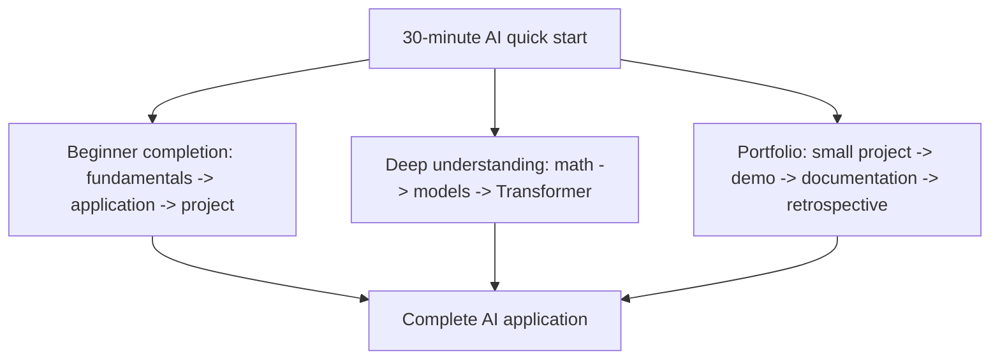

# Recommended Learning Path

This course contains a lot of material, but you do not need to flatten every branch the first time through. A better approach is to choose one main path first, complete the full loop from fundamentals to project work, and then fill in additional direction-specific content based on your interests.

## First, choose a learning mode

| Learning mode | Who it is for | How to learn | Key to avoiding boredom |
|---|---|---|---|
| Beginner completion mode | You know a bit of programming, but your AI foundation is not systematic | Follow Route 1 from 1 to 9, and complete a minimum project at each stage | Focus only on “what can I do with this” in each chapter; do not chase every detail at the beginning |
| Portfolio mode | You want a job, a career switch, or a way to showcase your skills | Move forward with Route 1 + Route 3 at the same time, and produce one portfolio piece at each stage | Update the project README, screenshots, and result analysis after each learning segment |
| Deep understanding mode | You want to work on algorithms, training, fine-tuning, and evaluation | Follow Route 2, and spend more time on math, deep learning, and Transformer | Ask for each concept: “What problem did it solve for the previous generation?” |
| Fast application mode | You already have development experience and want to build LLM applications quickly | Quickly skim 1–6, and focus on 7–9 | Use one real business problem to connect Prompt, RAG, and Agent |

If you are not sure which mode to choose, use “Beginner completion mode” by default: first complete one full main path, then go back and strengthen weaker areas.

## Understand the three main paths at a glance

## Choose a path based on time and goals

Do not choose a learning path based only on interest. Also choose based on how much time you can invest and what your final goal is.

| Current situation | Recommended path | Learning strategy | Stage deliverables |
|---|---|---|---|
| 3–5 hours per week | Minimal completion path | Focus only on core concepts and one minimum project at each stage | README, run commands, sample output |
| 6–10 hours per week | Application engineering path | Focus on completing Python, data, Prompt, RAG, and Agent | Small projects, logs, failure cases, evaluation table |
| Preparing a portfolio or job search | Portfolio path | Turn every major stage into evidence you can showcase | Screenshots/GIFs, metrics, retrospectives, deployment notes |
| Existing development experience | Fast application path | Quickly cover the basics and concentrate on the LLM application loop | LLM API, RAG, Agent, launch checklist |
| Want to go into models/algorithms | Model understanding path | Go deeper into math, machine learning, deep learning, and Transformer | Experiment logs, model comparisons, error analysis |

After choosing a path, do not switch frequently. A more stable approach is to complete one full main path first, then use [Full-course capability assessment and completion standards](/intro/assessment-standards) to check weak areas, and finally return to the relevant chapters to strengthen them.

## Important reference pages

| What you need | Where to look |
| --- | --- |
| Keep up with 2025–2026 AI application engineering | [2025-2026 AI Application Technology Map](/intro/modern-ai-stack) |
| Want to confirm the main path further | [Four Main Learning Paths](/intro/main-learning-routes) |
| Want one project to run through the whole course | [Capstone Project: AI Learning Assistant Growth Path](/intro/ai-learning-assistant-project) |
| Want to see how RAG, Agent, and multimodal systems evolve step by step | [AI Learning Assistant Version Roadmap](/intro/ai-learning-assistant-version-roadmap) |
| Already have a clear career goal | [Role-Based Path Selection](/intro/role-based-paths) |
| Want to check project quality | [AI Engineering Evaluation and Launch Checklist](/intro/ai-engineering-checklist) |
| Need a weekly plan | [Learning Schedule Planning](/intro/learning-schedule) |

## Route switching rules

| From | When to switch | How to fill the gap |
|---|---|---|
| Beginner completion -> Portfolio | You have already completed 3 or more stage projects | Go back and add README, screenshots, failure cases, and evaluation methods |
| Fast application -> Systematic learning | You often get stuck on basic issues in RAG or Agent | Fill in Python, data processing, HTTP/API, and database fundamentals |
| Application engineering -> Model understanding | You start caring about model performance and fine-tuning | Fill in math, machine learning, deep learning, and Transformer |
| Model understanding -> Application engineering | You want to turn model capabilities into products | Fill in backend interfaces, Prompt, RAG, logs, and deployment |

The key to switching paths is not “learning everything again,” but filling in the capabilities your current project is missing. Use the project to expose problems, then use the chapters to fill in the knowledge. Learning will feel smoother.

## Project challenge track: leave one project behind at every stage

One of the easiest reasons AI learning becomes boring is that you only look at concepts and produce nothing. It is recommended that you treat the whole course as a track of project upgrades: after completing each stage, leave behind a small result that can be explained, run, and shown.

| Stage | Challenge task | Project standard |
|---|---|---|
| 1 Developer tools basics | Set up the development environment and learn the command line and Git | Can create a project from scratch, commit code, and explain how to run it |
| 2 Python programming basics | Write a script or API that solves a small problem | Has input, output, exception handling, and can be run by others |
| 3 Data analysis and visualization | Analyze a real or simulated dataset | Has a cleaning process, key charts, conclusions, and limitations |
| 4 Minimum necessary AI math foundation | Translate formulas into model intuition | Can explain what vectors, probability, and gradients do in a model |
| 5 Machine learning from basics to practice | Build a prediction, classification, or clustering project | Has a baseline, metrics, error analysis, and improvement directions |
| 6 Deep learning and Transformer basics | Run a neural network training experiment | Has training curves, test results, and failure case analysis |
| 7 LLM principles, Prompt, and fine-tuning | Design a stable set of Prompts or a fine-tuning plan | Can explain why Prompt, RAG, or fine-tuning was chosen |
| 8 LLM application development and RAG | Build a knowledge-base assistant with citations | Has document processing, retrieval, answering, citations, RAGOps logs, and evaluation examples |
| 9 AI Agent and intelligent agent systems | Build an Agent that can execute step by step | Has tool calling, execution traces, permission boundaries, failure handling, and logs |
| 10–12 Direction expansion | Choose computer vision, natural language processing, or AIGC multimodal work for your capstone project | Has a complete problem definition, technical approach, evaluation, and presentation materials |

This challenge track can be layered onto any learning path. Beginners can create a basic version, while experienced learners can turn each project into a more complete engineering project.

## How to read the three paths

| Path | Who it is for | How to read it the first time |
| --- | --- | --- |
| Application-focused AI full-stack main path | You want to work on AI application engineering, RAG, Agent, and automation tools | Follow Chapters 1 to 9 in order, and first build intuition for math and models |
| Model understanding enhancement path | You want to work on algorithms, training, fine-tuning, evaluation, or model engineering | Spend more time on math, machine learning, deep learning, and Transformer |
| Project portfolio path | You want a job, a career switch, or a way to show your skills | Leave behind README, screenshots, result analysis, and next-step plans at every stage |

None of the paths is isolated. The application path needs some model intuition, the model path also needs projects, and the portfolio path needs real runnable code even more.

## How to choose

If you are not sure what to choose, default to Route 1. It is the best fit for moving from “knows a bit of programming” to “can build AI applications.”

If, during learning, you keep wanting to know what is happening inside the model, then spend more time in the machine learning and deep learning sections, and add the CV, NLP, and math chapters as needed.

If you want to see results faster, complete a small project after each stage. Do not wait until you finish the entire course to start projects, because projects will reveal what you really have not mastered.

## Suggested learning rhythm

When learning for the first time, do not try to master every detail. It is recommended to move forward with a “main path first, project-driven, direction-specific content later” approach.

After finishing each stage, you should complete at least one retrospective: what problem does this stage solve, can I explain the core concepts in my own words, have I run the code myself, and do I have a small result that I can show?

If a chapter feels too difficult, you can first understand where it fits in the system, and then keep moving forward. AI learning is not a one-pass linear process; it is an ongoing cycle of returning and strengthening weak areas.
