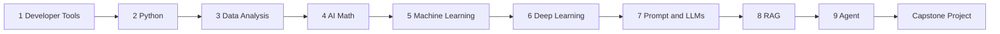
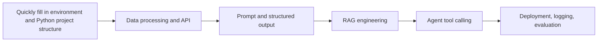
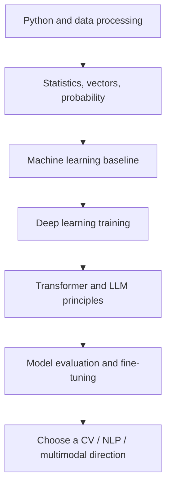
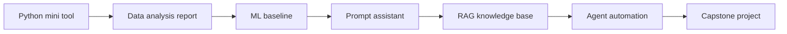

# Four Main Learning Routes

You can study this course in full, step by step, or choose a main route based on your goal. The purpose of a route is not to cut content out of the course, but to tell you which parts to read deeply on the first pass, which parts you only need to know where they fit, and which parts you should come back to later when a project needs them.

If you are not sure which one to choose, default to the “Zero-to-One Full-Stack AI Application Route.” It is the most stable and the best choice for moving from tools, Python, and data all the way to RAG, Agent, and a capstone project.

## How to Choose Among the Four Routes

| Route | Who It Is For | First Goal | Final Outcome |
|---|---|---|---|
| Zero-to-One Full-Stack AI Application Route | People with a little computer experience or just starting to code | Complete the full path from environment setup, Python, and data to AI applications | An AI study assistant or a course Q&A assistant |
| AI Engineering Route for Learners with Development Experience | People who already know how to write code, work with APIs, or do product development | Quickly fill in gaps in data, Prompt, RAG, Agent, and engineering practices | A deployable LLM application or Agent tool |
| Data and Model Understanding Route | People who want to pursue data analysis, machine learning, or model evaluation | Develop a deep understanding of data, metrics, model training, and error analysis | Data analysis + ML/DL experiment report |
| Portfolio Sprint Route | People preparing for jobs, career changes, or capability demonstrations | Quickly build runnable, explainable, and evaluable projects | A portfolio of 3–5 projects + a capstone project |

You can switch between routes, but do not switch every day. A better approach is to complete one stage along a single route first, then go back and fill in gaps based on problems exposed by the project.

## Route 1: Zero-to-One Full-Stack AI Application Route

This route is suitable for most learners. It follows the default course order and aims to build a complete capability chain: you can set up the environment, write Python, handle data, understand the basic logic of models, and finally build RAG, Agent, and a capstone project.

On the first pass, each stage only needs to reach this standard: “I can run a minimum project, explain the key concepts, and record one failed example.” You do not need to become an expert in math, deep learning, or Transformer all at once, but you should understand why they support Embedding, retrieval, Prompting, model evaluation, and multimodality later on.

| Stage | First-Pass Focus | Can Delay Deep Dive Into | Must Deliver |
|---|---|---|---|
| 1–3 | Environment, Python, data loading, cleaning, charts | Complex toolchains and advanced Pandas techniques | Runnable scripts, data analysis charts |
| 4–6 | Vectors, probability, baseline, training curves, overfitting | Complex mathematical derivations and large-scale training | Baseline, metrics, failure cases |
| 7–9 | Prompt, structured output, RAG, tool calling, Agent traces | Advanced framework details and complex multi-Agent setups | RAG Q&A, Agent execution traces |
| 10–12 | Choose one direction and build a capstone project | Deeply developing all three directions | A presentable capstone project |

The completion standard is this: you can create an AI application project from scratch, explain where its data comes from, what the model or LLM did, how the result was evaluated, and how you would review and improve it when it fails.

## Route 2: AI Engineering Route for Learners with Development Experience

This route is suitable for people who already know how to write code, build APIs, make frontends, or build backends. You do not need to spend too long on basic syntax, but you cannot skip data, evaluation, and engineering boundaries. Otherwise, you will get stuck later on input/output, logging, permissions, and deployment when building RAG and Agent systems.

| Learning Segment | Read Closely | Skim Quickly | Project Action |
|---|---|---|---|
| Basics to Fill In | Python files, exceptions, APIs, data processing | Terminal basics, syntax introduction | Transfer your existing development habits to Python projects |
| AI Applications | Prompt, LLM API, structured output, RAG | Machine learning algorithm details | Build a course or business knowledge-base assistant |
| System Engineering | Tool schema, Agent trace, permissions, security, logging | Complex multi-Agent frameworks | Build a controllable Agent or automation tool |
| Delivery and Launch | README, environment variables, deployment, monitoring, cost estimation | Large-scale training | Build a demo and evaluation report |

The easiest mistake to make on this route is “I can call the API, but I cannot evaluate the output.” Every LLM feature needs fixed test cases, failure samples, log fields, and a regression-check method.

## Route 3: Data and Model Understanding Route

This route is suitable for people who want to work in data analysis, machine learning, model evaluation, model engineering, or research assistance. It places more emphasis on data quality, mathematical intuition, baselines, experiment records, and error analysis.

| Learning Segment | Key Question | Project Evidence |
|---|---|---|
| Data Analysis | Is the data trustworthy, and are the conclusions limited? | Data dictionary, cleaning log, chart explanations |
| Math and Metrics | What do similarity, probability, loss, and metrics each explain? | Small experiments, metric explanations, hand-calculated examples |
| Machine Learning | What is the baseline, and is there data leakage? | Train/test split, metric table, error samples |
| Deep Learning | Why does the loss change, and where does the model fail? | Training curves, confusion matrix, failed images or text |
| LLMs and Evaluation | What are Prompt, RAG, and fine-tuning each best for? | Comparative experiments, fixed test set, conclusion boundaries |

This route is not only about theory. Every model concept should be grounded in an experiment: what the input is, what the output is, what the metric is, what the failure samples are, and how the next iteration will improve it.

## Route 4: Portfolio Sprint Route

This route is suitable for people who are under time pressure and want to build a portfolio as quickly as possible. Its focus is not to read every chapter in the deepest possible way, but to learn through projects and fill in the gaps as you go.

| Period | Learning Focus | Portfolio Deliverable |
|---|---|---|
| Stage 1 | Environment, Python, README, Git | A small runnable tool |
| Stage 2 | Data cleaning, visualization, conclusion writing | A data analysis report |
| Stage 3 | Baseline, metrics, error samples | An ML or classification experiment |
| Stage 4 | Prompt, structured output, LLM API | A Prompt assistant |
| Stage 5 | Document processing, retrieval, citations, evaluation | A RAG Q&A project |
| Stage 6 | Tool calling, trace, permissions, failure recovery | An Agent automation project |
| Stage 7 | Deployment, demo, review, portfolio packaging | A capstone project |

The portfolio sprint route must avoid “only building successful demos.” Each project should have at least a README, run commands, sample inputs and outputs, an evaluation method, failure samples, and a next-step plan. When preparing for a job search, being able to explain the project clearly matters more than stuffing in more features.

## Route Switching and Backtracking Rules

If you get stuck during learning, do not immediately reject the whole route. First determine which layer the problem belongs to, then go back to the corresponding chapter to fill in the minimum needed skill.

| Current Route | Common Bottleneck | How to Go Back |
|---|---|---|
| Zero-to-One Full-Stack Route | Too much content in the later stages; RAG and Agent are mixed together | Finish RAG Q&A first, then build Agent; do not chase every framework at once |
| AI Engineering Route | The API works, but the answers are unstable | Review data, evaluation, Prompt schema, and RAG evaluation |
| Data/Model Route | The theory makes sense, but the project presentation is weak | Review README, project delivery standards, and the portfolio checklist |
| Portfolio Sprint Route | The project can be demonstrated, but the principles are hard to explain | Review the capability map, minimum math foundations, and model evaluation |

If you get stuck three times in a row in one stage, prioritize a minimum experiment instead of reading more material. Being able to run, reproduce, and record is what shows you are ready to move to the next stage.

## Minimum Graduation Standard for Each Route

No matter which route you choose, you should eventually deliver a complete project. A complete project does not mean the most features; it means a clear problem definition, a way to run it, input/output examples, evaluation samples, failure analysis, and an improvement plan.

| Route | Minimum Graduation Project | What Must Be Proven |
|---|---|---|
| Zero-to-One Full-Stack AI Application | AI study assistant or course Q&A assistant | A complete loop from fundamentals to AI application |
| AI Engineering Route | A deployable LLM / RAG / Agent application | The engineering is runnable, observable, and regression-testable |
| Data and Model Route | A model experiment or evaluation report | The data is trustworthy, the metrics are clear, and the conclusions have boundaries |
| Portfolio Sprint Route | A portfolio of 3–5 projects and one main project | It can be shown, explained, and reviewed |

The route is only the learning order; the project is the real proof of ability. After completing each stage, go back to the project and add a run log, a result screenshot, or a failure sample. That will make your learning much more stable.
