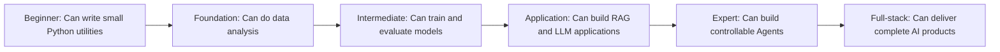

# Learning Milestones

> When learning a complex skill, what’s most frightening is not that it’s hard, but that you **don’t know how far you’ve come or how much farther you have to go**.  
> This page is your map. Every time you reach a milestone, come back and take a look, and give yourself a checkpoint: you are making progress.

---

## Understand the six milestones at a glance

For each milestone, don’t just look at “which chapters you finished.” Pay more attention to “what proof can you deliver.” Projects, screenshots, evaluation sheets, failure samples, and retrospectives are the real proof that you’ve moved to the next stop.

## Overview: Six milestones from zero to AI full stack

| Milestone | Learning stations completed | What you can do | Job search reference | Full-time study time |
|:---:|---------|----------|---------|:---:|
| 🌱 **Beginner** | 1 Developer Tools Basics, 2 Python Programming Basics | Write automation scripts, crawlers, and simple APIs with Python | Not ready for AI roles yet, but you can try Python roles | 1-2 months |
| 🌿 **Foundation** | + 3 Data Analysis and Visualization | Data analysis, visualization reports, data cleaning | Can try for data analysis internships | 3-4 months |
| 🌳 **Intermediate** | + 4 AI Math, 5 Machine Learning, 6 Deep Learning | Train AI models, image classification, text classification | Can look for AI engineer internships | 6-8 months |
| 🌲 **Application** | + 7 LLM Principles, 8 RAG Applications | Develop AI applications, fine-tune LLMs, build RAG systems | **AI Application Engineer** | 10-12 months |
| 🏆 **Expert** | + 9 AI Agent and Intelligent Agent Systems | Develop AI Agents, autonomous reasoning systems, and multi-Agent collaboration | **Senior AI Engineer** | 12-15 months |
| 🎯 **Full-stack** | All learning stations + deployment | End-to-end development from algorithms to products | **AI Full-stack Engineer / Tech Lead** | 16-20 months |

:::note About time estimates
The estimates above are for full-time study (6-8 hours a day). Part-time study (2-3 hours a day) usually takes about 2-2.5 times longer. Everyone learns at a different pace, so don’t worry too much about the exact numbers. The key is to **keep moving forward**.
:::

---

## Detailed explanation of each milestone

### 🌱 Milestone 1: Beginner (1 Developer Tools Basics + 2 Python Programming Basics)

**What you completed:**
- Learned development tools such as the terminal, Git, and VS Code
- Learned basic Python syntax, data structures, functions, and object-oriented programming
- Completed 4 small projects (command-line tools, crawlers, Web API, AI API practice)

**Your skill level:**
- Can write 200-500 line programs in Python
- Can crawl data from the web and save it
- Can build a simple backend service with FastAPI
- Can call LLM APIs to build simple applications

**What it feels like:** "I can finally make the computer do what I tell it to do! The code is not elegant yet, but it runs."

**Self-check:** Can you independently write a "guess the number" game without following a tutorial? Can you use the requests library to crawl a list of titles from a website?

---

### 🌿 Milestone 2: Foundation (+ 3 Data Analysis and Visualization)

**What you completed:**
- Learned data analysis tools such as NumPy, Pandas, and Matplotlib
- Learned data cleaning, exploratory analysis, and visualization

**Your skill level:**
- Given a CSV dataset, you can independently complete the full data analysis workflow
- You can create clear data visualizations
- You can answer business questions with data ("Which month had the highest sales?" "What is the churn rate?")

**What it feels like:** "So there are so many stories hidden in data! One chart can explain a whole thing clearly."

**Self-check:** After downloading a dataset from Kaggle (for example, the Titanic survival prediction dataset), can you use Pandas to do a complete EDA and draw at least 5 meaningful charts?

---

### 🌳 Milestone 3: Intermediate (+ 4 AI Math, 5 Machine Learning, 6 Deep Learning)

**What you completed:**
- Understood how linear algebra, probability and statistics, and calculus are used in AI
- Mastered classic machine learning algorithms (linear regression, logistic regression, decision trees, random forests, XGBoost)
- Learned the PyTorch framework and core deep learning concepts (CNN, RNN, Transformer basics)

**Your skill level:**
- Can independently complete the full workflow of a machine learning project (data processing → feature engineering → model training → evaluation and tuning)
- Can build and train neural networks with PyTorch
- Can handle real tasks such as image classification and text classification
- Have developed a systematic understanding of AI’s core principles

**What it feels like:** "I used to think AI was black magic. Now I realize it’s just math + data + code. It’s not as mysterious, but it is truly elegant."

**Self-check:** Can you implement a CNN from scratch with PyTorch and train it to 80%+ accuracy on the CIFAR-10 dataset? Can you manually derive the basics of backpropagation?

---

### 🌲 Milestone 4: Application (+ 7 LLM Principles, 8 LLM Application Development and RAG)

**What you completed:**
- Understood the principles of large language models (Transformer, pre-training, fine-tuning, alignment)
- Mastered Prompt engineering and LoRA fine-tuning
- Learned to develop RAG systems, deploy local LLMs, and build production-grade AI services
- Mastered engineering skills such as Docker and FastAPI

**Your skill level:**
- Can independently develop an enterprise knowledge-base Q&A system (RAG)
- Can fine-tune open-source LLMs for specific domains
- Can package and deploy AI services with Docker
- Your code includes logging, error handling, and API documentation

**What it feels like:** "I can really build AI products that users can use now, not just run demos."

**Self-check:** Can you independently build a RAG system: read a batch of PDF documents → vectorize and store them in a database → retrieve relevant content when the user asks a question → generate an answer with an LLM?

:::tip Job search milestone
By this stage, you already have the core skills of an **AI Application Engineer**. If your goal is to find a job quickly, you can start preparing your resume and interview now.
:::

---

### 🏆 Milestone 5: Expert (+ 9 AI Agent and Intelligent Agent Systems)

**What you completed:**
- Mastered the core architecture of AI Agents (reasoning, tool use, memory systems)
- Learned frameworks such as MCP, LangGraph, and CrewAI
- Can develop single-Agent and multi-Agent collaboration systems
- Have the ability to evaluate Agents, protect against risks, and deploy them in production

**Your skill level:**
- Can design and develop an AI Agent that can reason on its own, call tools, and remember context
- Can build multi-Agent collaboration systems (for example: a research Agent + a writing Agent + a review Agent working together to complete a research report)
- Can evaluate Agent performance, apply safety protections, and control costs

**What it feels like:** "AI is no longer just a Q&A tool. It can help me automatically complete complex workflows. I’m building an 'AI employee.'"

---

### 🎯 Milestone 6: Full-stack (all stages + electives)

**What you completed:**
- Finished the main learning path, and learned elective modules as needed
- Have knowledge of CV, NLP, AIGC, and Agent, and are at least proficient in 1-2 of these directions
- Can handle the entire chain from requirement analysis to product deployment

**Your skill level:**
- Given an AI-related business requirement, you can independently handle technology selection, architecture design, development, testing, and deployment
- Can lead a team to deliver AI projects
- Have a clear judgment on the development trends of the AI industry

---

## Suggested learning pace

### Full-time study (6-8 hours per day)

| Month | Learning content | Key output |
|:---:|---------|---------|
| Month 1 | 1 Developer Tools Basics, 2 Python Programming Basics | Python crawler project, Web API project |
| Month 2-3 | 3 Data Analysis and Visualization | A complete data analysis report |
| Month 4-6 | 4 AI Math, 5 Machine Learning, 6 Deep Learning (integrated learning) | ML project + PyTorch project |
| Month 7-9 | 7 LLM Principles, 8 LLM Application Development and RAG | RAG system, LLM fine-tuning project |
| Month 10-12 | 9 AI Agent and Intelligent Agent Systems + job search prep | Agent project + complete portfolio |

### Part-time study (2-3 hours per day)

You can simply multiply the schedule above by 2. The key is to **study a little every day**. Even 30 minutes a day is much better than studying one full day each week.
