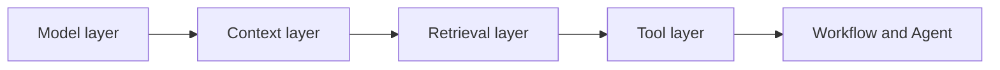
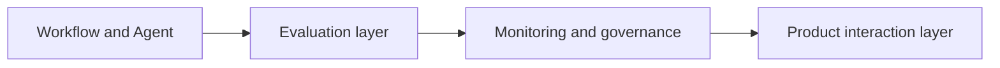
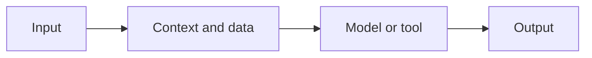
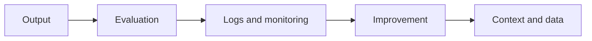

# 2025-2026 AI Application Technology Map

## What this section is about

This page is the “modern technology overview” for the second half of the course. You will see that the main direction of AI application engineering in 2025–2026 has evolved from “knowing how to call an LLM” to “being able to build AI systems that are searchable, actionable, evaluable, monitorable, and deployable.”

As a beginner reading this page, you do not need to memorize every new term. First, build a map: RAG solves knowledge access, Agent solves multi-step actions, multimodal AI solves real-world input and output, model engineering solves cost and deployment, and LLMOps / RAGOps / AgentOps solve long-term operation and quality control.

## First remember these 5 things

| Technology block | Problem it solves | Where you mainly learn it in the course |
|---|---|---|
| RAGOps | Can the knowledge base be continuously updated, retrieved, and evaluated? | Station 8 |
| AgentOps | Can an Agent be traced, controlled, and executed safely? | Station 9 |
| Multimodal AI | Can AI handle images, PDFs, audio, and video? | Stations 10–12 |
| Model engineering | How do you balance performance, cost, and latency? | Stations 6–8 |
| LLMOps | How do you maintain Prompt, evaluation, logs, and deployment over time? | Stations 7–9 and the capstone project |

## A modern AI system is not just a model

A common early form of LLM application was: the user asks a question, the backend calls a model, and the model returns an answer. But real products quickly run into problems: the model does not know private data, answers have no sources, tool calling is unstable, costs are uncontrollable, generated content cannot be reviewed, and online failures cannot be traced back.

That is why modern AI applications are more like a system than a single model.

Once you understand these two diagrams, you will see why the second half of the course moves from Prompt into RAG, Agent, multimodal AI, deployment, and evaluation. The real skill is not “successfully calling a model once,” but making the system inspectable and improvable across different users, different data, and different failure scenarios.

## RAGOps: making a knowledge base more than a one-time demo

RAGOps can be understood as the engineering methods for operating, evaluating, and maintaining a RAG system. Basic RAG only cares whether it can retrieve and answer; RAGOps also cares whether documents are updated, whether indexes are stale, whether recall is stable, whether citations are trustworthy, and whether cost and latency are acceptable.

Common modern RAG techniques include Hybrid Search, Reranking, Query Rewrite, Multi-query Retrieval, GraphRAG, Agentic RAG, and Multimodal RAG. They solve different problems: Hybrid Search avoids missing keywords with pure vector retrieval, Reranking reorders retrieved results, Query Rewrite makes vague questions more suitable for retrieval, GraphRAG is good for cross-document entity relationships, Agentic RAG lets the system decide across multiple rounds whether it should continue looking up information, and Multimodal RAG brings images, tables, PDFs, and screenshots into the knowledge sources.

This part will mainly appear in Station 8: LLM Application Development and RAG.

## AgentOps: making Agents traceable and controllable

AgentOps can be understood as the engineering approach around an Agent’s execution traces, tool calls, permissions, safety, evaluation, and deployment. An Agent should not merely look like it can act; it should also be clear why it acted, which tools it called, how much it cost, how it recovers when it fails, and when human confirmation is needed.

The key idea in modern Agents is not to let the model act completely freely, but to combine workflows, tool protocols, and safety boundaries. Protocols like MCP make connections between models, tools, files, databases, and business systems more standardized; Agentic Workflow combines open-ended tasks with fixed processes; Human-in-the-loop keeps human confirmation for high-risk steps; and Agent Observability records plans, tool calls, results, and errors.

This part will mainly appear in Station 9: AI Agents and Agent Systems.

## Multimodal AI: from text assistant to real-world assistant

The focus of multimodal AI is not “making pretty images,” but enabling AI to handle many kinds of real-world input and output: screenshots, charts, PDFs, document pages, speech, video, images, and text. In modern applications, multimodal capabilities are often combined with RAG, Agent, content generation, and review workflows.

For example, a course materials assistant can read Markdown and also understand lecture screenshots and PDF tables; a research Agent can look at webpage screenshots, extract chart information, and call tools to generate reports; an AIGC workspace can generate copy, image prompts, storyboard scripts, voice scripts, and review checklists from a topic.

This part will mainly appear in Station 12: AIGC and Multimodal AI, and it will also connect with document parsing and multimodal RAG in Station 8, as well as multimodal Agents in Station 9.

## Model engineering: not always using the strongest model

In real projects, you do not always need the strongest, most expensive, or largest model. Many scenarios require balancing performance, latency, cost, privacy, and deployment complexity.

Modern model engineering considers small models, model routing, quantization, distillation, LoRA / QLoRA, local deployment, hybrid deployment, caching, batching, and inference optimization. One system may use a cheap model for simple tasks, a strong model for complex reasoning, a vision model for images, and a local model for private data.

This part appears in Station 6’s deep learning basics, Station 7’s LLM principles and fine-tuning, and Station 8’s model deployment and engineering practices.

## LLMOps: treating LLM applications as long-running software

LLMOps focuses on the full lifecycle of LLM applications: Prompt versioning, evaluation sets, automated testing, logs, traces, token cost, latency, model version changes, access control, content safety, and deployment rollback.

Without LLMOps, an application may answer well today, but get worse tomorrow because of document updates, Prompt changes, model version changes, or changes in user questions, and nobody knows why. The engineering parts of the course will gradually add these capabilities to the project: first logging, then evaluation sets, then monitoring and cost statistics, and finally a deployment checklist.

## The minimum closed loop of a modern AI application

Whether you are building RAG, Agent, or multimodal applications, you can use the following loop to check whether the system is reliable.

If a project only has input and output, but no evaluation, logs, or improvement, it is still just a demo. If it can tell you which data it used, which tools it called, why it failed, and how to compare results before and after optimization, then it is starting to approach real AI engineering.

## Learning advice

The first time you read this page, just remember four sentences: RAG brings external knowledge in, Agent executes multi-step tasks around a goal, multimodal AI handles real-world input and output, and Ops keeps the system stable over time.

When you move into the specific chapters, do not treat new technologies as a list of terms. Every time you learn a technology, ask: What failure does it solve? When should it not be used? What is the smallest example? How do you evaluate it? How do you write it into the project README? In this way, what you learn is not just a trend, but transferable engineering capability.
