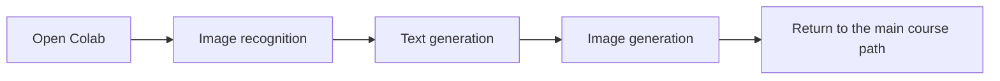

# 30-Minute AI Quick Experience

> **Goal:** Before formal study, try AI hands-on first and see what it can do  
> **Time:** 30 minutes ~ 1 hour  
> **What you need:** A Google account (to open Colab). Nothing else needs to be installed.

## Understand the 30-minute experience at a glance



Many people start learning programming by grinding through syntax and memorizing concepts, and after two weeks they still do not know what they are doing. We will do it the other way around: play first, learn later. First, see what AI can do, then return to the structured course with curiosity.

## Just do these 3 things

| Experience | What you will see | Corresponding chapter later |
| --- | --- | --- |
| Let AI recognize images | You give it a photo, and it tells you what is in the photo | Deep learning, computer vision |
| Talk with AI | You say a sentence, and it continues writing | Prompt engineering, large language models |
| Let AI draw | You describe a scene in words, and it generates an image | AIGC, multimodal |

:::tip No programming background needed
You do not need to understand the code below right now. Just copy, paste, and run it. After you finish 2 Python programming basics, come back and look at this code again—you will find it very simple.
:::

---

## Experience 1: Let AI understand images (10 minutes)

### Step 1: Open Google Colab

1. Open [Google Colab](https://colab.research.google.com) in your browser
2. Create a new notebook using either method:
   - If you see a **"New notebook"** button on the homepage, click it
   - Or click the top menu **File → New notebook**
3. After opening it, you will see an interface similar to a notepad, with a box where you can enter code (called a "code cell")

### Step 2: Install the required libraries

Paste the following code into a code cell, then run it with `Shift + Enter`:

```python
!pip install transformers torch pillow requests -q
```

Wait about 1 minute. As long as the output does not show red errors, you are good.

:::tip If you see `HF_TOKEN` or a Hugging Face login prompt
When you run the later code, you may see a warning such as **"The secret HF_TOKEN does not exist"**. **You can ignore it** — the models used in this tutorial (such as `google/vit-base-patch16-224` and `gpt2`) are public and can be downloaded and used without logging in, so the code will run normally.

If you want to remove this warning (or later access models that require login), you can:
1. Open [Hugging Face → Settings → Access Tokens](https://huggingface.co/settings/tokens) and create a new Token (Read permission is enough)
2. In Colab, click the **key icon 🔑 (Secrets)** on the left and add a Secret: set the name to `HF_TOKEN`, and paste the Token value you copied
3. Restart the Colab session: click **Runtime → Restart runtime**. In the Chinese interface, there is no wording for "Restart runtime"; choose **Restart session**. After restarting, run the cells again
:::

### Step 3: Run image recognition

Click **"+ Code"** in the upper-left corner to create a new cell, paste the following code, and run it:

```python
from transformers import pipeline
from PIL import Image
import requests
import io

# Load an image classification model (the first run will download the model, so wait a moment)
classifier = pipeline("image-classification", model="google/vit-base-patch16-224")

# Use a dog image from the internet for testing (download bytes first, then open them to avoid recognition failures caused by Colab network issues)
url = "https://upload.wikimedia.org/wikipedia/commons/thumb/2/26/YellowLabradorLooking_new.jpg/1200px-YellowLabradorLooking_new.jpg"
resp = requests.get(url, headers={"User-Agent": "Mozilla/5.0"})
resp.raise_for_status()
image = Image.open(io.BytesIO(resp.content))

# Let AI recognize this image
results = classifier(image)

# Check the result
print("🤖 AI thinks this image is:")
for r in results[:3]:
    print(f"  {r['label']:30s} confidence: {r['score']:.1%}")
```

### You should see output similar to this

```
🤖 AI thinks this image is:
  Labrador retriever              confidence: 95.6%
  golden retriever                confidence: 1.0%
  kuvasz                          confidence: 0.5%
```

> 🎉 **Think about it:** You did not teach AI what a Labrador is, and you did not label the image, so how did it recognize it? Because this model has already "learned" from 14 million images. This process of "learning at large scale first, then recognizing new things" is the core idea of **deep learning** — and it is exactly what this course will teach you.

### Try using your own image

Replace `url` with a link to any image online and see whether AI can recognize it:

```python
url = "https://upload.wikimedia.org/wikipedia/commons/thumb/3/3a/Cat03.jpg/1200px-Cat03.jpg"
resp = requests.get(url, headers={"User-Agent": "Mozilla/5.0"})
resp.raise_for_status()
image = Image.open(io.BytesIO(resp.content))
results = classifier(image)

print("🤖 AI thinks this image is:")
for r in results[:3]:
    print(f"  {r['label']:30s} confidence: {r['score']:.1%}")
```

---

## Experience 2: Talk with AI (10 minutes)

### Option A: Run a small model in Colab (free)

Create a new code cell, paste, and run:

```python
from transformers import pipeline

# Load a text generation model
generator = pipeline("text-generation", model="gpt2")

# Give it a starting prompt and let AI continue writing
prompt = "The future of artificial intelligence is"
result = generator(prompt, max_length=80, num_return_sequences=1)

print("📝 Your prompt:", prompt)
print()
print("🤖 AI continues writing:")
print(result[0]['generated_text'])
```

:::info About this model
GPT-2 is a model from 2019, so it is much weaker than today’s ChatGPT. The generated content may not be very fluent. But it helps you understand a key principle — AI writing articles is actually just repeatedly predicting "what is the most likely next word?" ChatGPT uses the same principle, except the model is hundreds of times larger and trained on hundreds of times more data.
:::

### Option B: Try the latest large models directly (recommended)

If you want to experience the most powerful AI conversation capability, open any of the following (all free):

| Product | URL | Features |
|------|------|------|
| **ChatGPT** | [chat.openai.com](https://chat.openai.com) | The most well-known globally, strongest in English |
| **Claude** | [claude.ai](https://claude.ai) | Strong at long-text understanding, also good in Chinese |
| **Tongyi Qianwen** | [tongyi.aliyun.com](https://tongyi.aliyun.com) | Made by Alibaba, directly accessible in China |
| **Kimi** | [kimi.moonshot.cn](https://kimi.moonshot.cn) | Supports very long context |
| **DeepSeek** | [chat.deepseek.com](https://chat.deepseek.com) | Open-source model, high cost performance |

Try asking it a challenging question:

```
Please write a Python function to compute the nth Fibonacci number.
Requirements:
1. Implement one version using recursion
2. Implement one version using dynamic programming
3. Compare the efficiency difference between the two approaches
```

> 🎉 **Think about it:** AI can do much more than chat — it can write code, translate, summarize documents, analyze data, and more... After finishing this course, you will be able to build AI applications like this yourself, and even create AI Agents that can call tools on their own and make decisions independently.

---

## Experience 3: Let AI draw pictures (10 minutes)

### Steps to try it out (no coding required)

1. Open any of the following AI image generation tools:
   - [Stable Diffusion on Hugging Face Spaces](https://huggingface.co/stabilityai/stable-diffusion-xl-base-1.0)
   - [LiblibAI](https://www.liblib.art/) (direct access in China)
   - Or search for "AI online drawing" to find other tools

2. Enter the English description in the input box (called a **Prompt**):

```
a cute robot reading a book in a cozy library, digital art, warm lighting
```

3. Click **Generate** and wait 10–30 seconds

4. AI will generate a brand-new image for you — an image that has never existed in the world before, imagined by AI

### More Prompts to try

```
a futuristic city at sunset, cyberpunk style, neon lights, rain
```

```
an astronaut riding a horse on the moon, oil painting style
```

```
a traditional Chinese ink painting of mountains and rivers, misty, elegant
```

:::tip The secret of Prompts
You will notice that the more specific your description is, the better the generated image becomes. This technique of controlling AI output with text is called **Prompt Engineering**, and it is an important part of the course’s 7 major model principles, Prompt, and fine-tuning content. It is also one of the most practical skills in today’s AI industry.
:::

> 🎉 **Think about it:** This is AIGC (AI Generated Content). You only need to describe the scene you want in words, and AI can "draw" it. Chapter 12, AIGC and multimodal, will teach you the diffusion model principles behind this, as well as how to fine-tune models to generate the style you want.

---

## ✅ Experience complete! Let’s review

Congratulations on completing the AI quick experience! In just 30 minutes, you have personally experienced the three core capabilities of AI:

| What you experienced | Underlying technology | Where you will learn it in the course |
|------------|----------|------------|
| Image recognition | Convolutional Neural Networks + pre-trained models | 6 Deep Learning and Transformer Basics + 10 Computer Vision |
| Text conversation | Large language models + Transformer architecture | 7 Large Model Principles, Prompt, and Fine-Tuning |
| Image generation | Diffusion Model | 12 AIGC and Multimodal |

:::note No need to memorize the terms
CNN, Transformer, Diffusion... It is totally fine if these words still feel unfamiliar right now. As you learn step by step, each one will become crystal clear. For now, just remember one thing — **you can learn all of this**.
:::
