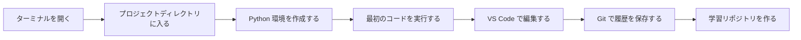
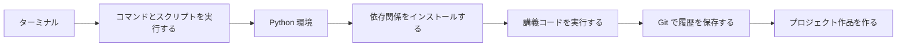

# 1 開発者ツールの基礎


この段階で解決したいのは、「コードを安定して書けるか、実行できるか、保存できるか」です。後で AI を学ぶときにつまずく新人の多くは、モデルが難しすぎるからではなく、コマンドラインの使い方が分からない、環境が乱れている、依存関係の入れ方を間違えた、コードのバージョン管理ができていない、といった理由です。

## 物語で始める導入：まずは AI 作業台を作ろう

モデルやアプリを書き始める前に、まず作業台をしっかり整えましょう。ターミナルは操作コンソール、Git は保存システム、Python 環境は実験室、VS Code と Jupyter は 2 種類の作業台のようなものです。ツールの段階での目標は、多くのコマンドを覚えることではありません。これからプロジェクトに出会ったときに、自分で作成・実行・保存・復元できるようになることです。


:::tip この漫画をワークフローとして読む
この段階は、ツールを 5 つの別々の話題として見るより、1 つの作業台として見ると理解しやすくなります。ターミナルは再現できる命令を出し、Python 環境は実験を分離し、VS Code はプロジェクトコードを整理し、Jupyter は探索を記録し、Git は安定したチェックポイントを保存します。
:::

## 学習チャレンジマップ



## 体験練習：毎日 1 つ、再現できる記録を残す

ツール操作を 1 つ終えるごとに、学習リポジトリに「何をしたか」「どのコマンドを使ったか」「どんなエラーが出たか」「最後にどう解決したか」を 1 行でも記録しましょう。これらの記録は、あなた自身の開発マニュアルになります。後で環境に問題が起きても、ゼロから当てずっぽうで探すのではなく、履歴の中から手がかりを見つけられます。

## プロジェクトのおまけ

この段階のおまけ作品は `ai-learning-lab` リポジトリです。見た目はただのシンプルなフォルダですが、これから Python スクリプト、データ分析 Notebook、モデル実験、RAG プロジェクト、Agent Demo を少しずつ入れていきます。つまり、このリポジトリは初日の小さなツール箱から、あなたの AI フルスタック作品集へ育っていくのです。

## 段階の位置づけ

| 情報 | 説明 |
|---|---|
| 対象者 | AI フルスタックを体系的に学び始めた人、または開発ツールチェーンが不安定な学習者 |
| 目安学習時間 | 8～12 時間 |
| 前提条件 | なし |
| この段階の成果 | 再現可能な Python 開発環境、Git で管理できる学習リポジトリ |

## 初心者向けの最短クリアルート

初心者はまず、ターミナルの基本、Git の基本操作、Python 環境の設定を通せば十分です。最初から複雑なブランチモデルや、すべてのコマンド引数を覚える必要はありません。プロジェクトを作成し、Python ファイルを実行し、依存関係をインストールし、Git の記録を 1 回残せれば、この段階の最小クリアです。

## 発展学習ルート

すでに開発経験があるなら、環境分離、Git ブランチでの共同作業、リモートリポジトリ同期、再現可能なプロジェクト説明を重点的に補いましょう。さらに `ai-learning-lab` を標準的なプロジェクトリポジトリとして整え、環境説明、実行コマンド、ディレクトリ構成、よくある問題の記録を入れてみてください。

## 初学者が先にやること、発展学習者が後でやること

初めてこの段階を学ぶ人は、まず目標をできるだけ低くしましょう。ターミナルを開ける、プロジェクトディレクトリに入れる、Python ファイルを 1 つ実行できる、依存関係を 1 つ入れられる、Git のコミットを 1 回できる、これで十分です。コマンドの引数に怖がらず、まずは「問題が起きたらパスを見る、エラーを見る、今の環境を見る」という習慣を作りましょう。

経験者は再現性に重点を置けます。異なるプロジェクトで環境をどう分けるか、README にどう実行手順を書くか、依存関係のバージョンをどう記録するか、Git の履歴がどうロールバックに役立つか、です。目標は「ツールを使えること」ではなく、後の AI プロジェクトを誰でももう一度実行できるようにすることです。

## コマンドを実行する前の安全ガード

ツールが強力なのは、ファイル、環境、リポジトリを素早く変更できるからです。初心者向けのルールはシンプルです。**危険度のあるコマンドは、この章で作った練習用リポジトリの中だけで実行すること。**

| 場面 | より安全な習慣 |
|---|---|
| ファイルを削除する前 | まず `pwd` と `ls` を実行し、練習フォルダの中にいることを確認する |
| パッケージを入れる前 | `which python` または `conda info --envs` で現在の Python 環境を確認する |
| コミットする前 | `git status` を実行し、何が記録されるかを読む |
| Git 履歴を戻す前 | まず `git status`、`git diff`、`git restore --staged` を使い、いきなり破壊的なロールバックをしない |
| コードを共有する前 | `.env`、API key、大きなデータ、モデル重みが無視されているか確認する |

これはツールを怖がらせるためではありません。むしろ逆です。この小さな確認を持つと、ターミナルと Git はずっと扱いやすくなります。

## なぜ先にツールを学ぶのか

AI 学習は、Web ページで概念を見るだけでは終わりません。これから何度もライブラリを入れ、スクリプトを実行し、Notebook を開き、データをダウンロードし、API を呼び出し、モデルを学習し、サービスを起動し、エラーを調べることになります。ツールチェーンが早く安定するほど、後で関係ない問題に時間を取られにくくなります。



## この段階の学習ルート

第 1 章では、まずターミナルとコマンドラインを学びます。ディレクトリに移動し、ファイルを確認し、コマンドを実行し、パスやよくあるエラーを理解できるようになる必要があります。

第 2 章では、Git とバージョン管理を学びます。書きながらこまめにコミットする習慣をつけ、履歴の確認、変更の巻き戻し、ブランチ管理、リモートリポジトリとの同期ができるようになります。

第 3 章では、最後に開発環境の設定を学びます。Python 環境の構築、VS Code の設定、Jupyter の使用、そしてなぜ仮想環境で依存関係を分けるのかを理解します。

## 学習後にできるようになること

- ターミナルで基本的なファイル操作やプロジェクト操作ができる
- Python 環境を作成、起動、管理できる
- VS Code を使って Python ファイルを作成、実行、デバッグできる
- Git を使って学習の過程を保存し、プロジェクトを GitHub に送れる
- 環境問題が起きたとき、まずパス・インタプリタ・依存関係・権限のどれかを判断できる

## よくある誤解

「コマンドラインと Git は後で覚えればいい」と考える新人は多いです。でも AI プロジェクトでは、環境、依存関係、データパス、モデルファイル、デプロイ用コマンドがほぼ毎日出てきます。ツール基礎が不安定だと、その後の各段階で何度も学習が止まってしまいます。

もう 1 つのよくある誤解は、すべての Python パッケージを同じ環境に入れてしまうことです。短期的には楽ですが、長期的にはバージョン衝突が起きます。最初から仮想環境の意味を理解しておきましょう。

## ツールエラー劇場：環境問題はまずどこを見る？

ターミナルでコマンドが見つからないと言われたら、まずそのコマンドがインストールされているか、今の shell が更新されているか、PATH の書き方が間違っていないかを確認します。Python は動くのにパッケージの import に失敗するなら、今使っているインタプリタと依存関係をインストールした環境が同じかを確認します。Git のコミットが失敗するなら、リポジトリを初期化したか、ユーザー名とメールを設定したか、ファイルを本当にステージングしたかを見ます。

## 最小実行実験：空フォルダから再現可能なリポジトリへ

この段階の最小実験は、複雑なコードを書くことではありません。開発ワークフローを 1 回通しで行うことです。`ai-learning-lab` フォルダを作り、`hello_ai.py` を書き、ターミナルで実行し、コマンドと出力を README に書き、最後に Git で 1 回コミットします。

```bash
mkdir ai-learning-lab
cd ai-learning-lab
python -m venv .venv
python hello_ai.py
git init
git add .
git commit -m "init learning lab"
```

この流れを自力で完了できれば、後で Python、データ分析、RAG、Agent を学ぶときに安定した作業台があります。

## ツール失敗ケース集：まずはパス、環境、バージョンを見る

| 現象 | よくある原因 | 特定方法 | 修正方針 |
|---|---|---|---|
| ターミナルで command not found と出る | コマンドが未インストール、または PATH が反映されていない | インストール場所と現在の shell を確認する | 再インストールする、ターミナルを更新する、PATH を確認する |
| Python は動くのに import で失敗する | pip と python が同じ環境ではない | `which python` と `python -m pip --version` を比べる | 仮想環境を使い、`python -m pip install` で入れる |
| Git のコミットが失敗する | 初期化していない、ステージングしていない、または身元設定がない | `git status` と `git config --list` を実行する | リポジトリを初期化し、ユーザー名とメールを設定し、先に add してから commit する |
| README のコマンドが動かない | パス、ファイル名、または依存関係が足りない | 新しいターミナルで README をそのまま再実行する | ディレクトリ、依存関係、完全なコマンドを追記する |

## 段階ごとの到達度 Rubric

| レベル | 到達基準 | 作品集の証拠 |
|---|---|---|
| 最低クリア | ターミナルを開き、Python を実行し、Git のコミットを 1 回できる | 実行スクリーンショット、commit 記録 |
| 推奨クリア | 仮想環境を作成し、依存関係をインストールし、README をきれいに書ける | `.venv` の説明、`requirements.txt`、README |
| 作品集クリア | ツールチェーンを今後の講座でも使える共通リポジトリにまとめられる | ディレクトリ構成、コマンド記録、トラブル対応メモ、リモートリポジトリのリンク |

## 段階プロジェクト

ベーシック版は、`ai-learning-lab` 学習リポジトリを作り、実行できる `hello_ai.py`、1 回の Git コミット、コマンド記録を用意することです。標準版では、Python 環境の説明、依存関係の入れ方、VS Code または Jupyter の使用記録を追加し、リポジトリをリモートに push します。チャレンジ版では、これを今後 12 個の学習ステーションの作品集ルートに整理し、`scripts/`、`notebooks/`、`projects/`、`notes/` などのディレクトリを先に設計して、講座全体の成果を継続的に蓄積できるようにします。


もっと細かい学習リズムを見たいなら、[段階学習タスクシート：開発者ツールの基礎](task-list.md) を読んでください。


## この段階の楽しいタスクカード

| 遊び方 | この段階のタスク |
|---|---|
| ストーリータスク | AI 学習アシスタントのために最初の作業台を作る：ターミナルを開ける、Python を実行できる、README を書ける、Git で 1 回保存できる。 |
| ボス戦 | **作業台の番人** |
| 解放できるバッジ | ターミナル生存者、Git 保存職人 |
| 初心者向けかんたん版 | 最小の入力から出力までの流れを 1 つ完成させ、実行スクリーンショットかコマンド出力を残す |
| 作品集の証拠 | 空フォルダから 1 回の再現可能なコミットまで作る |

この段階の内容が多く感じたら、まずこのタスクカードを最低目標として使ってください。初心者向けかんたん版を達成できたら、先へ進んで大丈夫です。あとで作品集を整えるときに、標準版とチャレンジ版へアップグレードしましょう。

## 段階の提出物

| 提出物 | 最小版 | 作品集版 |
|---|---|---|
| 学習リポジトリ | `ai-learning-lab` を作成し、Python ファイルを 1 つ実行する | 分かりやすいディレクトリ、README、スクリーンショット、コミット履歴がある |
| 環境説明 | Python バージョンとインストールコマンドを記録する | 仮想環境、依存ファイル、よくある問題の切り分けを示す |
| コマンド記録 | よく使うターミナルコマンドを 5～10 個保存する | 各コマンドの用途、出力、失敗時の対応を説明する |
| Git 記録 | ローカルで 1 回コミットする | ブランチ、リモートリポジトリ、コミットメッセージ、ロールバック記録がある |
| README | `hello_ai.py` の実行方法を書く | プロジェクトの目的、ディレクトリ構成、環境設定、次のステップを説明する |

## AI 学習アシスタントとの通しプロジェクトとの関係

この段階は AI 学習アシスタント v0.1 に対応します。リポジトリの作成、Python 環境の設定、README の作成、最初の実行スクリーンショットの保存です。通しプロジェクトの学習ルートで進めているなら、この段階の終わりに少なくとも 1 回はバージョン記録を残すのがおすすめです。たとえば、この段階で増えた能力、どう実行するか、入力と出力の例、どんな問題があったか、次にどう改善するか、です。


## 段階クリア基準

| クリアレベル | できるようになること |
|---|---|
| 最低クリア | ターミナル、Git、エディタ、Python/Jupyter 環境を自力で使える。 |
| 推奨クリア | この段階の少なくとも 1 つの実行可能な小プロジェクトを完成させ、README に実行方法、入力と出力の例、起きた問題を記録できる。 |
| 作品集クリア | この段階の成果を「AI 学習アシスタント」通しプロジェクトに接続し、スクリーンショット、ログ、評価サンプル、次の計画を残せる。 |

この段階を学び終えたら、すべての細部を暗記する必要はありません。大切なのは、何を解決する段階なのか、前の段階との関係は何か、そして次の学習をどう支えるのかを説明できることです。次の段階では、これらのツールを使って Python プログラムを書き、プロジェクトコードを保存します。
