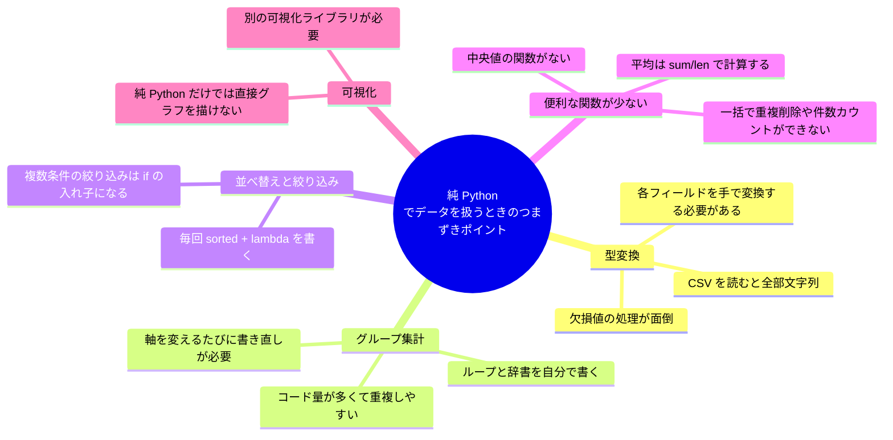

# ウォームアップ：純 Python でデータを扱う

## 学習目標

- 純 Python（csv モジュール + 辞書 + リスト）で実際のデータセットを扱う
- 純 Python でデータを扱うときの**つまずきやすい点**を体感する
- 専用のデータ分析ツール（NumPy、Pandas）がなぜ必要かを理解する
- これからの学習のために、直感とモチベーションを作る

---

## なぜこのウォームアップをするの？

「もう Python はできるし、そのまま NumPy と Pandas を学べばよくない？」

そう思うかもしれません。

でも、あわてないでください。まずは小さな実験をしてみましょう。

これは、車を学ぶ前に自転車で 20km 走ってみるようなものです。実際に「自転車は遅いし大変だ」と体験してこそ、車の価値が本当にわかります。

**この節の目標は、純 Python で実際のデータを扱ってみて、最後にこう言いたくなることです。——「もっと簡単な方法はないの？！」**

---

## データ分析の全体像

手を動かす前に、まずはデータ分析の典型的な流れを見てみましょう。


今日は**純 Python**で最初の 4 ステップを進めます。あとで NumPy と Pandas を学ぶと、同じことをするコードが **5〜10 倍**も少なくなるとわかります。

---

## データセットを知ろう：Titanic

ここでは、データサイエンス入門でよく使われる定番の **Titanic（タイタニック）データセット** を使います。

1 行が 1 人の乗客を表し、次の情報が含まれています。

| フィールド | 意味 | 例 |
|------|------|--------|
| `PassengerId` | 乗客番号 | 1 |
| `Survived` | 生存したか（0=死亡, 1=生存） | 0 |
| `Pclass` | 客室等級（1=1等, 2=2等, 3=3等） | 3 |
| `Name` | 名前 | Braund, Mr. Owen Harris |
| `Sex` | 性別 | male |
| `Age` | 年齢 | 22 |
| `SibSp` | 乗船していた兄弟姉妹/配偶者の数 | 1 |
| `Parch` | 乗船していた親/子の数 | 0 |
| `Ticket` | 乗船券番号 | A/5 21171 |
| `Fare` | 料金 | 7.25 |
| `Cabin` | 客室番号 | C85 |
| `Embarked` | 乗船港（C/Q/S） | S |

---

## ステップ 1：データを準備する

まずは、練習用の小さな Titanic データを作ってみましょう。次のコードを保存して実行すると、`titanic_sample.csv` ファイルが作成されます。

```python
# create_sample_data.py
# 小さな Titanic サンプルデータを作成する

csv_content = """PassengerId,Survived,Pclass,Name,Sex,Age,SibSp,Parch,Ticket,Fare,Cabin,Embarked
1,0,3,"Braund, Mr. Owen Harris",male,22,1,0,A/5 21171,7.25,,S
2,1,1,"Cumings, Mrs. John Bradley",female,38,1,0,PC 17599,71.2833,C85,C
3,1,3,"Heikkinen, Miss. Laina",female,26,0,0,STON/O2. 3101282,7.925,,S
4,1,1,"Futrelle, Mrs. Jacques Heath",female,35,1,0,113803,53.1,C123,S
5,0,3,"Allen, Mr. William Henry",male,35,0,0,373450,8.05,,S
6,0,3,"Moran, Mr. James",male,,0,0,330877,8.4583,,Q
7,0,1,"McCarthy, Mr. Timothy J",male,54,0,0,17463,51.8625,E46,S
8,0,3,"Palsson, Master. Gosta Leonard",male,2,3,1,349909,21.075,,S
9,1,3,"Johnson, Mrs. Oscar W",female,27,0,2,347742,11.1333,,S
10,1,2,"Nasser, Mrs. Nicholas",female,14,1,0,237736,30.0708,,C
11,1,3,"Sandstrom, Miss. Marguerite Rut",female,4,1,1,PP 9549,16.7,G6,S
12,1,1,"Bonnell, Miss. Elizabeth",female,58,0,0,113783,26.55,C103,S
13,0,3,"Saundercock, Mr. William Henry",male,20,0,0,A/5. 2151,8.05,,S
14,0,3,"Andersson, Mr. Anders Johan",male,39,1,5,347082,31.275,,S
15,0,3,"Vestrom, Miss. Hulda Amanda",female,14,0,0,350406,7.8542,,S
16,1,2,"Hewlett, Mrs. Mary D",female,55,0,0,248706,16,,S
17,0,3,"Rice, Master. Eugene",male,2,4,1,382652,29.125,,Q
18,1,2,"Williams, Mr. Charles Eugene",male,,0,0,244373,13,,S
19,0,3,"Vander Planke, Mrs. Julius",female,31,1,0,345763,18,,S
20,1,3,"Masselmani, Mrs. Fatima",female,,0,0,2649,7.225,,C
21,0,2,"Fynney, Mr. Joseph J",male,35,0,0,239865,26,,S
22,1,2,"Beesley, Mr. Lawrence",male,34,0,0,248698,13,,S
23,1,3,"McGowan, Miss. Anna",female,15,0,0,330923,8.0292,,Q
24,1,1,"Sloper, Mr. William Thompson",male,28,0,0,113788,35.5,A6,S
25,0,3,"Palsson, Miss. Torborg Danira",female,8,3,1,349909,21.075,,S
26,1,3,"Asplund, Mrs. Carl Oscar",female,38,1,5,347077,31.3875,,S
27,0,3,"Emir, Mr. Farred Chehab",male,,0,0,2631,7.225,,C
28,0,1,"Fortune, Mr. Charles Alexander",male,19,3,2,19950,263,,S
29,1,3,"O'Dwyer, Miss. Ellen",female,,0,0,330959,7.8792,,Q
30,0,3,"Todoroff, Mr. Lalio",male,,0,0,349216,7.8958,,S"""

with open("titanic_sample.csv", "w", encoding="utf-8") as f:
    f.write(csv_content)

print("✅ titanic_sample.csv を作成しました！（30 件のレコード）")
```

このコードを実行すると、作業フォルダの中に `titanic_sample.csv` が追加されます。

:::tip 実データも使えます
完全なデータセット（891 件）に挑戦したい場合は、[Kaggle の Titanic ページ](https://www.kaggle.com/c/titanic/data) から `train.csv` をダウンロードできます。このチュートリアルのコードは、どちらにも使えます。
:::

---

## ステップ 2：CSV ファイルを読み込む

### タスク：CSV ファイルを Python のデータ構造として読み込む

```python
import csv

def read_csv(filename):
    """CSV ファイルを読み込み、辞書のリストを返す"""
    passengers = []

    with open(filename, "r", encoding="utf-8") as f:
        reader = csv.DictReader(f)
        for row in reader:
            passengers.append(dict(row))

    return passengers

# データを読み込む
passengers = read_csv("titanic_sample.csv")

# 最初の 1 件がどんな形か見てみる
print(f"全部で {len(passengers)} 件読み込みました\n")
print("最初の乗客の情報：")
for key, value in passengers[0].items():
    print(f"  {key}: {value}")
```

出力：

```
全部で 30 件読み込みました

最初の乗客の情報：
  PassengerId: 1
  Survived: 0
  Pclass: 3
  Name: Braund, Mr. Owen Harris
  Sex: male
  Age: 22
  SibSp: 1
  Parch: 0
  Ticket: A/5 21171
  Fare: 7.25
  Cabin:
  Embarked: S
```

:::caution 最初のつまずきポイント：すべて文字列！
注目してください。`Age` は `22` ではなく `"22"`、`Survived` は `0` ではなく `"0"` です。CSV から読み込むと、**すべて文字列** になります。数値計算をするには、各フィールドを手動で型変換しなければいけません。
:::

---

## ステップ 3：データの整形と型変換

分析の前に、文字列を正しい型に変換し、欠損値を処理する必要があります。

```python
def clean_data(passengers):
    """データを整形する：型変換 + 欠損値処理"""
    cleaned = []

    for p in passengers:
        # Age を変換する（年齢がない乗客もいる）
        age = None
        if p["Age"] and p["Age"].strip():
            try:
                age = float(p["Age"])
            except ValueError:
                age = None

        # Fare を変換する
        fare = 0.0
        if p["Fare"] and p["Fare"].strip():
            try:
                fare = float(p["Fare"])
            except ValueError:
                fare = 0.0

        cleaned.append({
            "id": int(p["PassengerId"]),
            "survived": int(p["Survived"]),
            "pclass": int(p["Pclass"]),
            "name": p["Name"],
            "sex": p["Sex"],
            "age": age,             # None の場合がある
            "sibsp": int(p["SibSp"]),
            "parch": int(p["Parch"]),
            "fare": fare,
            "cabin": p["Cabin"] if p["Cabin"] else None,
            "embarked": p["Embarked"] if p["Embarked"] else None,
        })

    return cleaned

passengers = clean_data(passengers)

# 整形結果を確認する
p = passengers[0]
print(f"名前: {p['name']}")
print(f"年齢: {p['age']} (型: {type(p['age']).__name__})")
print(f"料金: {p['fare']} (型: {type(p['fare']).__name__})")
print(f"生存: {p['survived']} (型: {type(p['survived']).__name__})")

# 年齢がない人が何人いるか確認する
missing_age = sum(1 for p in passengers if p["age"] is None)
print(f"\n年齢データがない乗客: {missing_age} 人")
```

ここまでで、もう気づいたかもしれません。**データを読み込んで、きれいに整えるだけで、何十行も書いています。** しかも、これはまだ小さなデータセットです。

---

## ステップ 4：データ分析をする

データが整ったので、いくつか分析してみましょう。

### タスク 1：性別ごとの生存率を集計する

```python
def survival_rate_by_gender(passengers):
    """性別ごとの生存率を集計する"""
    # 男性と女性の総数と生存者数をそれぞれ集計する
    stats = {}

    for p in passengers:
        sex = p["sex"]
        if sex not in stats:
            stats[sex] = {"total": 0, "survived": 0}
        stats[sex]["total"] += 1
        stats[sex]["survived"] += p["survived"]

    # 生存率を計算する
    print("=== 性別ごとの生存率 ===")
    print(f"{'性別':<10}{'総人数':<10}{'生存者数':<10}{'生存率'}")
    print("-" * 40)

    for sex, data in stats.items():
        rate = data["survived"] / data["total"] * 100
        print(f"{sex:<10}{data['total']:<10}{data['survived']:<10}{rate:.1f}%")

survival_rate_by_gender(passengers)
```

出力：

```
=== 性別ごとの生存率 ===
性別        総人数      生存者数    生存率
----------------------------------------
male      14        3         21.4%
female    16        13        81.2%
```

**歴史的な事実：** タイタニック号が沈没したとき、「女性と子どもを先に」というルールが実際に実行されました。女性の生存率は男性よりずっと高くなっています。

### タスク 2：料金が高い上位 5 人を見つける

```python
def top_fare_passengers(passengers, n=5):
    """料金が高い上位 n 人を見つける"""
    # 料金で並べ替える（並べ替えロジックを手で書く必要がある）
    sorted_passengers = sorted(passengers, key=lambda p: p["fare"], reverse=True)

    print(f"\n=== 料金が高い上位 {n} 人 ===")
    print(f"{'順位':<6}{'名前':<35}{'等級':<6}{'料金'}")
    print("-" * 60)

    for i, p in enumerate(sorted_passengers[:n], 1):
        pclass_name = {1: "1等", 2: "2等", 3: "3等"}[p["pclass"]]
        print(f"{i:<6}{p['name']:<35}{pclass_name:<6}${p['fare']:.2f}")

top_fare_passengers(passengers)
```

出力：

```
=== 料金が高い上位 5 人 ===
順位    名前                                 等級    料金
------------------------------------------------------------
1     Fortune, Mr. Charles Alexander       1等    $263.00
2     Cumings, Mrs. John Bradley           1等    $71.28
3     Futrelle, Mrs. Jacques Heath         1等    $53.10
4     McCarthy, Mr. Timothy J              1等    $51.86
5     Sloper, Mr. William Thompson         1等    $35.50
```

### タスク 3：客室等級ごとに平均年齢を集計する

この課題は、純 Python でデータを扱う大変さがいちばんよくわかる例です。

```python
def avg_age_by_class(passengers):
    """客室等級ごとに平均年齢を集計する"""
    # ステップ 1：客室等級ごとにグループ分けする
    groups = {}  # {pclass: [age1, age2, ...]}

    for p in passengers:
        pclass = p["pclass"]
        if pclass not in groups:
            groups[pclass] = []

        # 年齢データがある乗客だけ集計する
        if p["age"] is not None:
            groups[pclass].append(p["age"])

    # ステップ 2：各グループの統計量を計算する
    print("\n=== 各客室等級の年齢統計 ===")
    print(f"{'等級':<10}{'人数':<10}{'平均年齢':<12}{'最大年齢':<12}{'最小年齢'}")
    print("-" * 55)

    for pclass in sorted(groups.keys()):
        ages = groups[pclass]
        if ages:
            avg = sum(ages) / len(ages)
            max_age = max(ages)
            min_age = min(ages)
            pclass_name = {1: "1等客室", 2: "2等客室", 3: "3等客室"}[pclass]
            print(f"{pclass_name:<10}{len(ages):<10}{avg:<12.1f}{max_age:<12.0f}{min_age:.0f}")

avg_age_by_class(passengers)
```

出力：

```
=== 各客室等級の年齢統計 ===
等級        人数      平均年齢      最大年齢      最小年齢
-------------------------------------------------------
1等客室      5         39.4        58          19
2等客室      4         34.5        55          14
3等客室      14        19.4        39          2
```

### タスク 4：各乗船港の平均料金を計算する

```python
def avg_fare_by_embarked(passengers):
    """各乗船港の平均料金を計算する"""
    port_names = {"S": "Southampton", "C": "Cherbourg", "Q": "Queenstown"}
    groups = {}

    for p in passengers:
        port = p["embarked"]
        if port is None:
            continue
        if port not in groups:
            groups[port] = []
        groups[port].append(p["fare"])

    print("\n=== 各乗船港の料金統計 ===")
    print(f"{'港':<20}{'人数':<10}{'平均料金':<15}{'合計料金'}")
    print("-" * 55)

    for port, fares in sorted(groups.items()):
        avg = sum(fares) / len(fares)
        total = sum(fares)
        name = port_names.get(port, port)
        print(f"{name:<20}{len(fares):<10}${avg:<14.2f}${total:.2f}")

avg_fare_by_embarked(passengers)
```

---

## ステップ 5：つまずきポイントを振り返る

純 Python でこれらの分析をしてみて、どんな問題があったか振り返ってみましょう。



### つまずきポイントまとめ表

| つまずきポイント | 純 Python でのやり方 | コード量 |
|------|-----------------|-----------|
| CSV を読む | `csv.DictReader` + 手動で型変換 | 約 30 行 |
| 性別ごとの生存率を集計する | 手作業で辞書グループ化 + ループ計算 | 約 15 行 |
| 並べ替えて上位 N 件を取る | `sorted()` + スライス + 表示整形 | 約 10 行 |
| 客室ごとに平均を出す | 手作業で辞書グループ化 + 欠損値の手動処理 + 手動計算 | 約 20 行 |

**合計：** たった 4 つの簡単な分析をするだけで、だいたい 75〜100 行くらい必要です。

---

## ステップ 6：予告 — 同じことを Pandas でやると、何行で済む？

まだ Pandas の文法は学ばなくて大丈夫です。まずは結果の違いだけ見てみましょう。

```python
# ⚠️ これは予告です！後で 1 行ずつ詳しく学びます

import pandas as pd

# 読み込み + 自動で型変換（1 行、あなたが書いた 30 行の代わり）
df = pd.read_csv("titanic_sample.csv")

# 性別ごとの生存率（1 行、あなたが書いた 15 行の代わり）
print(df.groupby("Sex")["Survived"].mean())

# 料金が高い上位 5 人（1 行、あなたが書いた 10 行の代わり）
print(df.nlargest(5, "Fare")[["Name", "Pclass", "Fare"]])

# 客室ごとの平均年齢（1 行、あなたが書いた 20 行の代わり）
print(df.groupby("Pclass")["Age"].mean())

# 各港の平均料金（1 行）
print(df.groupby("Embarked")["Fare"].mean())
```

**Pandas の 5 行 = 純 Python の 75 行。**

しかも Pandas は**型変換や欠損値の扱いも自動でやってくれる**ので、追加のコードはほとんど要りません。

### コード量の比較

```mermaid
xychart-beta
    title "コード行数の比較：純 Python vs Pandas"
    x-axis ["データ読み込み", "性別生存率", "料金Top5", "グループ平均", "合計"]
    y-axis "コード行数" 0 --> 100
    bar [30, 15, 10, 20, 75]
    bar [1, 1, 1, 1, 5]
```



## ハンズオン練習

### 練習 1：生存者と死亡者の平均料金を計算する

純 Python で次を計算してみましょう。
- 生存者の平均料金
- 死亡者の平均料金
- その差

```python
def avg_fare_by_survival(passengers):
    """生存者と死亡者の平均料金を集計する"""
    # ヒント：性別ごとの集計と同じ考え方です
    # survived == 1 が生存者、survived == 0 が死亡者です
    pass  # コードを追加する

avg_fare_by_survival(passengers)
```

考えてみよう：料金（客室等級）と生存率には、どんな関係がありそうでしょうか？

### 練習 2：すべての子ども乗客を見つける（年齢 < 18）

```python
def find_children(passengers):
    """18 歳未満の乗客を見つける"""
    # age が None の場合に注意する
    children = []
    # コードを追加する

    print(f"子ども乗客は全部で {len(children)} 人です：")
    for c in children:
        status = "生存" if c["survived"] else "死亡"
        print(f"  {c['name']}, {c['age']:.0f}歳, {status}")

    # 子どもの生存率を計算する
    # コードを追加する

find_children(passengers)
```

### 練習 3：総合統計表

次のような総合統計表を作ってみましょう。

```
=== Titanic データ総合統計 ===
総乗客数: 30
生存者数: 16 (53.3%)
平均年齢: 26.8 歳
平均料金: $31.23
男性人数: 14 (46.7%)
女性人数: 16 (53.3%)
年齢欠損: 7 人 (23.3%)
客室欠損: 21 人 (70.0%)
```

### チャレンジ練習：クロス集計

**各客室等級ごとに、男女別の生存率** を集計してみましょう（2 つの軸をまたぐ集計です）。

```
=== 各客室等級の男女別生存率 ===
        男性生存率    女性生存率
1等客室   33.3%       100.0%
2等客室   50.0%       100.0%
3等客室   0.0%        62.5%
```

ヒント：`pclass + sex` の 2 つのフィールドで同時にグループ分けする必要があります。どれくらいの行数になるか、試してみましょう。

---

## この節の完全コード

上のコードを 1 つのファイルにまとめると、次のようになります。

```python
"""
純 Python データ分析のウォームアップ練習
データセット：Titanic（タイタニック）
目的：純 Python でデータを扱うつまずきポイントを体験し、NumPy/Pandas 学習の土台を作る
"""

import csv


def read_csv(filename: str) -> list[dict]:
    """CSV ファイルを読み込む"""
    with open(filename, "r", encoding="utf-8") as f:
        return [dict(row) for row in csv.DictReader(f)]


def clean_data(passengers: list[dict]) -> list[dict]:
    """データ整形：型変換 + 欠損値処理"""
    cleaned = []
    for p in passengers:
        age = None
        if p["Age"] and p["Age"].strip():
            try:
                age = float(p["Age"])
            except ValueError:
                age = None

        fare = 0.0
        if p["Fare"] and p["Fare"].strip():
            try:
                fare = float(p["Fare"])
            except ValueError:
                fare = 0.0

        cleaned.append({
            "id": int(p["PassengerId"]),
            "survived": int(p["Survived"]),
            "pclass": int(p["Pclass"]),
            "name": p["Name"],
            "sex": p["Sex"],
            "age": age,
            "fare": fare,
            "cabin": p["Cabin"] if p["Cabin"] else None,
            "embarked": p["Embarked"] if p["Embarked"] else None,
        })
    return cleaned


def analyze(passengers: list[dict]) -> None:
    """すべての分析タスクを実行する"""

    # タスク 1：性別ごとの生存率
    print("=== 性別ごとの生存率 ===")
    gender_stats = {}
    for p in passengers:
        sex = p["sex"]
        if sex not in gender_stats:
            gender_stats[sex] = {"total": 0, "survived": 0}
        gender_stats[sex]["total"] += 1
        gender_stats[sex]["survived"] += p["survived"]

    for sex, data in gender_stats.items():
        rate = data["survived"] / data["total"] * 100
        print(f"  {sex}: {data['survived']}/{data['total']} ({rate:.1f}%)")

    # タスク 2：料金 Top 5
    print(f"\n=== 料金が高い上位 5 人 ===")
    sorted_by_fare = sorted(passengers, key=lambda p: p["fare"], reverse=True)
    for i, p in enumerate(sorted_by_fare[:5], 1):
        print(f"  {i}. {p['name'][:30]:<32} ${p['fare']:.2f}")

    # タスク 3：各客室等級の平均年齢
    print(f"\n=== 各客室等級の平均年齢 ===")
    class_ages = {}
    for p in passengers:
        pc = p["pclass"]
        if pc not in class_ages:
            class_ages[pc] = []
        if p["age"] is not None:
            class_ages[pc].append(p["age"])

    for pc in sorted(class_ages.keys()):
        ages = class_ages[pc]
        avg = sum(ages) / len(ages) if ages else 0
        label = {1: "1等客室", 2: "2等客室", 3: "3等客室"}[pc]
        print(f"  {label}: {avg:.1f} 歳 ({len(ages)} 人)")


if __name__ == "__main__":
    raw = read_csv("titanic_sample.csv")
    passengers = clean_data(raw)
    print(f"全部で {len(passengers)} 件読み込みました\n")
    analyze(passengers)
```

---

## まとめ

| ポイント | 説明 |
|------|------|
| CSV を読むと全部文字列になる | 各フィールドを手動で `int()` / `float()` に変換する必要がある |
| 欠損値の処理が面倒 | 空値を 1 つずつ確認し、変換エラーを `try/except` で防ぐ必要がある |
| グループ集計のコード量が多い | 毎回、辞書とループを手作業で書く必要がある |
| 便利な統計関数が足りない | 平均、中央値、標準偏差などの関数がすぐには使えない |
| コードの再利用性が低い | 別の軸で集計すると、ほぼ同じコードをまた書き直すことになる |

:::tip いちばん大事な気づき
このウォームアップの目的は、コードを暗記することではありません。**つまずきポイントを、自分の手で体験すること** です。この「しんどさ」を覚えておいてください。これから NumPy や Pandas を学ぶたびに、「あ、これが前にほしかったやつだ！」と思えるはずです。

この「まず大変さを知ってから、あとで楽さを知る」学び方は、理解を深めて、記憶にも残りやすくなります。
:::

---

## 次に学ぶこと

これからの学習の流れはこんな感じです。

```mermaid
flowchart TD
    A["✅ 第1章：純 Python ウォームアップ（ここまで）"] --> B["第2章：NumPy の科学計算"]
    B --> C["第3章：Pandas データ処理"]
    C --> D["第4章：データ可視化"]
    D --> E["第6章：実践プロジェクト"]

    B -- "つまずきポイントを解決" --> B1["高速な配列演算<br/>ループ不要<br/>ベクトル化計算"]
    C -- "つまずきポイントを解決" --> C1["1 行で CSV 読み込み<br/>自動型変換<br/>1 行でグループ集計"]
    D -- "つまずきポイントを解決" --> D1["グラフでデータを見せる<br/>規則性を直感的に見つける"]

    style A fill:#4caf50,color:#fff
    style B fill:#2196f3,color:#fff
    style C fill:#2196f3,color:#fff
    style D fill:#2196f3,color:#fff
    style E fill:#ff9800,color:#fff
```



準備はできましたか？NumPy の世界へ進みましょう！
