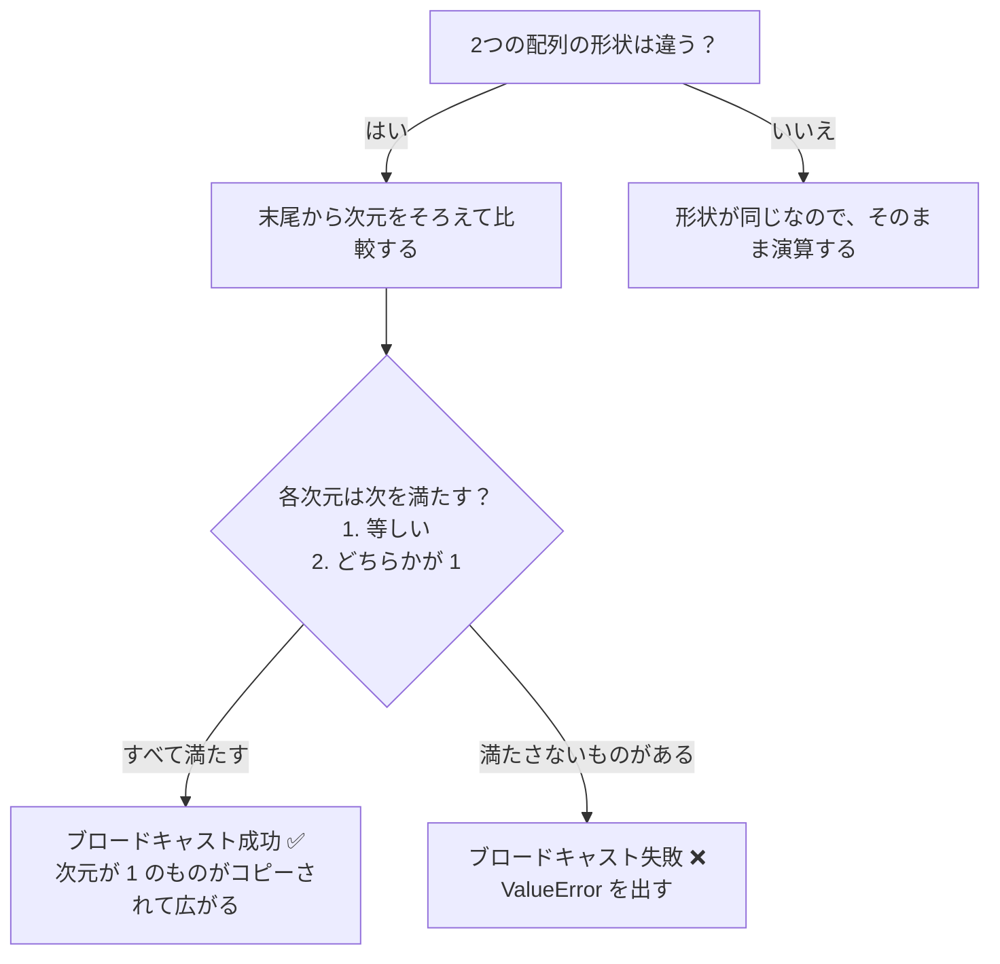

# 配列演算


## 学習目標

- ベクトル化演算の概念と利点を理解する
- 要素ごとの演算と汎用関数（ufunc）を身につける
- ブロードキャスト機構（Broadcasting）のルールを理解する
- 集約関数を使って統計計算を行えるようにする

---

## ベクトル化演算：ループからの卒業

**ベクトル化演算**は NumPy の核心的な考え方です。つまり、配列全体に対して操作し、ループを書かずに処理します。

### 純 Python vs NumPy

```python
import numpy as np

# 純 Python：1つずつ計算
prices = [100, 200, 300, 400, 500]
discounted = []
for p in prices:
    discounted.append(p * 0.8)
print(discounted)  # [80.0, 160.0, 240.0, 320.0, 400.0]

# NumPy：1行で完了
prices = np.array([100, 200, 300, 400, 500])
discounted = prices * 0.8
print(discounted)  # [ 80. 160. 240. 320. 400.]
```

### 要素ごとの演算

NumPy 配列の算術演算は**要素ごと**に行われます。

```python
a = np.array([1, 2, 3, 4])
b = np.array([10, 20, 30, 40])

print(a + b)     # [11 22 33 44]    対応する位置どうしを足す
print(a - b)     # [ -9 -18 -27 -36]
print(a * b)     # [ 10  40  90 160]  対応する位置どうしを掛ける（行列積ではありません！）
print(a / b)     # [0.1 0.1 0.1 0.1]
print(a ** 2)    # [ 1  4  9 16]      2乗
print(b % 3)     # [1 2 0 1]          余り
print(b // 3)    # [ 3  6 10 13]      切り捨て除算
```

### スカラーとの演算

配列と 1 つの数値（スカラー）を計算するときは、スカラーが自動的に各要素へ適用されます。

```python
arr = np.array([10, 20, 30, 40])

print(arr + 5)    # [15 25 35 45]
print(arr * 2)    # [20 40 60 80]
print(arr / 10)   # [1. 2. 3. 4.]
print(1 / arr)    # [0.1  0.05 0.033 0.025]
```

### 比較演算

```python
arr = np.array([15, 23, 8, 42, 31])

print(arr > 20)      # [False  True False  True  True]
print(arr == 23)     # [False  True False False False]
print(arr != 8)      # [ True  True False  True  True]
```

---

## 汎用関数（ufunc）

NumPy にはたくさんの**汎用関数**があり、配列の各要素に数学的な演算を適用できます。

### よく使う数学関数

```python
arr = np.array([1, 4, 9, 16, 25])

# 平方根
print(np.sqrt(arr))     # [1. 2. 3. 4. 5.]

# 絶対値
neg = np.array([-3, -1, 0, 2, 5])
print(np.abs(neg))      # [3 1 0 2 5]

# べき乗
print(np.power(arr, 0.5))  # sqrt と同じ

# 指数と対数
print(np.exp([0, 1, 2]))      # [1.    2.718 7.389]  e のべき乗
print(np.log([1, np.e, 10]))   # [0.    1.    2.303]  自然対数
print(np.log10([1, 10, 100]))  # [0. 1. 2.]           10 を底とする
print(np.log2([1, 2, 8, 64]))  # [0. 1. 3. 6.]       2 を底とする
```

### 三角関数

```python
# 0 から 2π までの角度を作成
angles = np.linspace(0, 2 * np.pi, 5)  # [0, π/2, π, 3π/2, 2π]

print(np.sin(angles))  # [ 0.  1.  0. -1.  0.]  ← 正弦
print(np.cos(angles))  # [ 1.  0. -1.  0.  1.]  ← 余弦
```

### 切り上げ・切り捨て関数

```python
arr = np.array([1.2, 2.5, 3.7, -1.3, -2.8])

print(np.floor(arr))    # [ 1.  2.  3. -2. -3.]  切り捨て
print(np.ceil(arr))     # [ 2.  3.  4. -1. -2.]  切り上げ
print(np.round(arr))    # [ 1.  2.  4. -1. -3.]  四捨五入
print(np.trunc(arr))    # [ 1.  2.  3. -1. -2.]  小数点以下を切り捨て
```

### 2 つの配列間の演算

```python
a = np.array([3, 5, 7, 9])
b = np.array([1, 4, 2, 8])

print(np.maximum(a, b))  # [3 5 7 9]   対応する位置で大きい方を取る
print(np.minimum(a, b))  # [1 4 2 8]   対応する位置で小さい方を取る
print(np.where(a > b, a, b))  # maximum と同じだが、より柔軟
```

---

## ブロードキャスト機構（Broadcasting）

形状の異なる 2 つの配列で演算するとき、NumPy は自動的に小さい配列を「ブロードキャスト」して、形状をそろえます。

### いちばん簡単な例

```python
arr = np.array([1, 2, 3])

# スカラー + 配列 → スカラーが [10, 10, 10] にブロードキャストされる
print(arr + 10)   # [11 12 13]
```

これはブロードキャストの例です。NumPy は `10` を `[10, 10, 10]` に広げてから、要素ごとに足しています。

### 2 次元配列 + 1 次元配列

```python
matrix = np.array([
    [1, 2, 3],
    [4, 5, 6],
    [7, 8, 9]
])

row = np.array([10, 20, 30])

# row が各行にブロードキャストされる
result = matrix + row
print(result)
# [[11 22 33]
#  [14 25 36]
#  [17 28 39]]
```

ブロードキャストの流れは次のように理解できます。

```
matrix:         row (ブロードキャスト前):  row (ブロードキャスト後):
[[1, 2, 3],    [10, 20, 30]  →   [[10, 20, 30],
 [4, 5, 6],                        [10, 20, 30],
 [7, 8, 9]]                        [10, 20, 30]]
```

### 列ベクトル + 行ベクトル

```python
col = np.array([[1], [2], [3]])    # shape: (3, 1) 列ベクトル
row = np.array([10, 20, 30])       # shape: (3,)   行ベクトル

# 両方がブロードキャストされる
result = col + row
print(result)
# [[11 21 31]
#  [12 22 32]
#  [13 23 33]]
```

### ブロードキャストのルール



覚え方は簡単です。**次元は後ろから比べて、同じか、どちらかが 1 なら OK** です。

```python
# ✅ ブロードキャストできる
# (3, 4) + (4,)     → (3, 4)     最後の次元はどちらも 4
# (3, 4) + (1, 4)   → (3, 4)     1 行目の 3 と 1 → 3 に広がる
# (3, 1) + (1, 4)   → (3, 4)     両方の次元がブロードキャストされる

# ❌ ブロードキャストできない
# (3, 4) + (3,)     → エラー！最後の次元は 4 ≠ 3 で、どちらも 1 ではない
```

### ブロードキャストの実用例

```python
# データの標準化：各列からその列の平均を引く
data = np.array([
    [85, 170, 60],
    [92, 180, 75],
    [78, 165, 55],
    [90, 175, 70]
])  # 4 人の学生：成績、身長、体重

# 各列の平均を計算
col_mean = data.mean(axis=0)        # [86.25 172.5  65.  ]  shape: (3,)

# ブロードキャスト：(4, 3) - (3,) → (4, 3)
centered = data - col_mean
print(centered)
# [[-1.25 -2.5  -5.  ]
#  [ 5.75  7.5  10.  ]
#  [-8.25 -7.5 -10.  ]
#  [ 3.75  2.5   5.  ]]
```

---

## 集約関数

集約関数は、複数のデータを 1 つ、または少数の値に「まとめる」関数です。

### よく使う集約関数

```python
arr = np.array([4, 7, 2, 9, 1, 5, 8, 3, 6])

print(np.sum(arr))      # 45    合計
print(np.mean(arr))     # 5.0   平均
print(np.median(arr))   # 5.0   中央値
print(np.std(arr))      # 2.58  標準偏差
print(np.var(arr))      # 6.67  分散
print(np.min(arr))      # 1     最小値
print(np.max(arr))      # 9     最大値
print(np.argmin(arr))   # 4     最小値のインデックス
print(np.argmax(arr))   # 3     最大値のインデックス
print(np.cumsum(arr))   # [ 4 11 13 22 23 28 36 39 45]  累積和
print(np.cumprod(arr[:5]))  # [  4  28  56 504 504]  累積積
```

### axis を使った集約

多次元配列では、`axis` パラメータでどの方向に沿って集約するかを指定します。

```python
matrix = np.array([
    [1, 2, 3],
    [4, 5, 6],
    [7, 8, 9]
])

# axis を指定しない：すべての要素をまとめる
print(np.sum(matrix))          # 45

# axis=0：行方向に沿って（列ごとに）集約する —— 上下にまとめる
print(np.sum(matrix, axis=0))  # [12 15 18]

# axis=1：列方向に沿って（行ごとに）集約する —— 左右にまとめる
print(np.sum(matrix, axis=1))  # [ 6 15 24]
```

`axis` の考え方は、**axis=0 は行を消す、axis=1 は列を消す** です。

```
元の形 (3, 3):
[[1, 2, 3],
 [4, 5, 6],
 [7, 8, 9]]

axis=0 (行を消す → 結果の shape=(3,)):
[1+4+7, 2+5+8, 3+6+9] = [12, 15, 18]

axis=1 (列を消す → 結果の shape=(3,)):
[1+2+3, 4+5+6, 7+8+9] = [6, 15, 24]
```

### 実践：成績分析

```python
# 5 人の学生の 3 科目の成績
scores = np.array([
    [85, 92, 78],   # 学生1：国語、数学、英語
    [90, 88, 95],   # 学生2
    [72, 65, 80],   # 学生3
    [95, 98, 92],   # 学生4
    [60, 55, 70]    # 学生5
])

subjects = ["国語", "数学", "英語"]

# 各学生の合計点
total = np.sum(scores, axis=1)
print("各学生の合計点:", total)   # [255 273 217 285 185]

# 各学生の平均点
avg_per_student = np.mean(scores, axis=1)
print("各学生の平均点:", avg_per_student)

# 各科目の平均点
avg_per_subject = np.mean(scores, axis=0)
for sub, avg in zip(subjects, avg_per_subject):
    print(f"  {sub}平均点: {avg:.1f}")

# クラス全体で最高点は誰のどの科目か
max_idx = np.unravel_index(np.argmax(scores), scores.shape)
print(f"最高点: {scores[max_idx]} (学生{max_idx[0]+1}の{subjects[max_idx[1]]})")

# 合計点がいちばん高い学生
best_student = np.argmax(total)
print(f"合計点が最高: 学生{best_student + 1}, 合計点 {total[best_student]}")
```

---

## np.where：条件による選択

`np.where` は、NumPy 版の三項演算子です。

```python
arr = np.array([85, 42, 91, 67, 55, 78])

# 合格は "PASS"、不合格は "FAIL" とする
result = np.where(arr >= 60, "PASS", "FAIL")
print(result)  # ['PASS' 'FAIL' 'PASS' 'PASS' 'FAIL' 'PASS']

# 不合格の点数を 60 にする
adjusted = np.where(arr >= 60, arr, 60)
print(adjusted)  # [85 60 91 67 60 78]
```

---

## まとめ

| カテゴリ | 内容 | 例 |
|------|------|------|
| ベクトル化演算 | 配列全体をまとめて計算し、ループ不要 | `arr * 2`, `a + b` |
| 汎用関数 | 要素ごとの数学関数 | `np.sqrt()`, `np.exp()`, `np.log()` |
| ブロードキャスト | 形状の異なる配列を自動で拡張する | `(3,4) + (4,)` → `(3,4)` |
| 集約関数 | 統計量をまとめて計算する | `np.sum()`, `np.mean()`, `np.std()` |
| axis パラメータ | 集約する方向を指定する | `axis=0` は列ごと、`axis=1` は行ごと |
| np.where | 条件による選択 | `np.where(arr > 0, arr, 0)` |

---

## 手を動かしてみよう

### 練習 1：ベクトル化計算

```python
# 華氏温度を摂氏温度に変換する
# 公式：C = (F - 32) × 5/9
fahrenheit = np.array([32, 68, 100, 212, 72, 98.6])

# ベクトル化演算で 1 行で変換する
celsius = ?
```

### 練習 2：ブロードキャストの練習

```python
# 3 つの商品の元の価格
prices = np.array([100, 200, 300])

# 3 種類の割引率（列ベクトル）
discounts = np.array([[0.9], [0.8], [0.7]])

# ブロードキャストを使って、各商品が各割引率のときの価格を計算する（3×3 行列）
final_prices = ?
# 期待結果：
# [[ 90. 180. 270.]
#  [ 80. 160. 240.]
#  [ 70. 140. 210.]]
```

### 練習 3：成績統計

```python
# 50 人の学生のランダムな成績を生成する（40〜100 の範囲）
np.random.seed(42)
scores = np.random.randint(40, 101, size=50)

# 1. 平均、中央値、標準偏差を計算する
# 2. 最高点、最低点とその位置を見つける
# 3. 各点数帯の人数を集計する：不合格(<60)、合格(60-69)、普通(70-79)、良い(80-89)、優秀(90+)
# 4. 合格率を計算する
```
