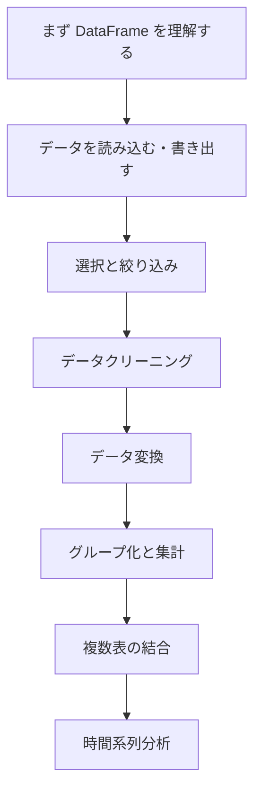

# Pandas 入門：この章では何を学ぶのか

この章で解決したいのは、実際のデータ表を手に入れたあとに、コードでどう読み込み、内容を把握し、きれいに整え、必要な部分を絞り込み、集計して、次の可視化・機械学習・業務分析につなげるか、ということです。

多くの初心者は、`Pandas` を初めて学ぶときに「それぞれの関数は少しわかるのに、実際の分析問題では何から手をつければいいのかわからない」と感じます。これは自然なことです。`Pandas` の本当の難しさは API を覚えることだけではなく、「データを読む → クリーニングする → 絞り込む → 集計する → 結合する → 結果を出す」という流れを、無理なくひとつの作業フローにできるかどうかにあるからです。

## この章がコース全体でどこにあるか

第 2 ステップはデータ分析と可視化で、この段階の中心になるのが `Pandas` です。前の NumPy は基礎的な計算力に近く、Pandas は現実のデータを扱う作業台に近い存在です。列名があり、欠損値があり、カテゴリ列があり、時間列があり、汚れたデータもある表形式データを扱います。

Pandas をしっかり身につけると、その後の可視化、EDA、機械学習の特徴量準備、プロジェクト分析がかなり楽になります。実際のプロジェクトでは、モデルやグラフの前に、大量の表データ整理が必要になることが多いからです。

## この章で本当に解決したいこと

この章では、次の 5 つの問いに答えます。`DataFrame` とは何か。CSV、Excel、JSON などのファイルからデータをどう読み込むか。データをどう選択、フィルタリング、クリーニングするか。`groupby` を使ってカテゴリ別、時間別、部署別の集計をどう行うか。複数の表をどう結合して、分析できるひとつの表にするか。

初心者がやりがちなミスは、最初から関数を暗記しようとすることです。より安定したやり方は、まずデータの流れを考えることです。今手元にある表は何か、最終的に何を得たいのか、その途中でクリーニング、絞り込み、変換、集計、結合のどれが必要かを考えます。

## 初心者におすすめの学習順序

まずはコアとなるデータ構造を学び、`Series / DataFrame / Index` をしっかり理解しましょう。次にデータの読み書きと選択・絞り込みを学び、「読み込める」「必要なものを取り出せる」状態を目指します。続いてデータクリーニングを学び、欠損値、重複、型の間違い、文字列の問題を、安心して分析できるレベルまで処理します。その次に `groupby` を学び、集計の中心をつかみます。最後にデータ変換、結合、時間系列を学び、より複雑な業務データに対応します。

## この章で押さえるべき主線

この章の主線は、Pandas で大事なのは API の多さではなく、データの流れがスムーズであること、という点です。

各ステップで「入力は何か、出力は何か、なぜこの処理をするのか」を説明できれば、Pandas は単なる関数の寄せ集めにはなりません。

## この章の 8 節はそれぞれ何を解決するのか

| 章節 | 一番解決したい問題 |
|---|---|
| [3.1 Pandas の中核データ構造](./01-core-structures.md) | まず `Series / DataFrame / Index` が何かを理解する |
| [3.2 データの読み書き](./02-read-write.md) | CSV / Excel / JSON を読み込み、書き出す |
| [3.3 データの選択と絞り込み](./03-selection-filter.md) | 本当に欲しい部分のデータを取り出す |
| [3.4 データクリーニング](./04-data-cleaning.md) | 欠損値、重複、異常値、形式の問題を処理する |
| [3.5 データ変換](./05-data-transform.md) | 列どうしの変換、マッピング、派生を行う |
| [3.6 分组与聚合](./06-groupby.md) | 「部署別 / 月別 / カテゴリ別」の集計分析を行う |
| [3.7 データ結合](./07-merge.md) | 複数の表をつなげる |
| [3.8 时间序列](./08-time-series.md) | 表を時間の観点で扱えるようにする |

## この章と次の段階の関係

Pandas は、後の多くのスキルの入力層です。可視化ではデータ整理に使い、機械学習では特徴量準備に使い、RAG や Agent のプロジェクトでも、表の読み込み、ログ分析、評価データ処理によく使います。

この章が不安定だと、よくある問題は次のようになります。グラフが描けないのは可視化ができないからではなく、データ整理が不十分だから。機械学習の精度が悪いのはモデルのせいではなく、列の型や欠損値、データリークの処理ができていないから。Agent のデータ分析ツールは動くのに、表のロジックが間違っている、ということも起こります。

## 初心者と上級学習者はどう読むとよいか

初心者がこの章を最初に読むときは、主線と最小実行例をつかむことを優先してください。細部を一度に全部理解する必要はありません。この章が何を解決するのか、入力と出力は何か、最小限のプロジェクトをどう動かすのかがわかれば、先へ進めます。

経験者は、この章を抜け漏れ確認と実装練習として使えます。境界条件、失敗例、評価方法、コードの再現性、前後の段階とのつながりに注目しましょう。読み終えたら、本章の内容を自分の作品の README や実験記録に残すとよいです。

## 学習時間と難易度の目安

| 学習方法 | 目安時間 | 目標 |
|---|---|---|
| ざっと読む | 20～30 分 | この章が何を解決するかを理解し、どこで使うかを知る |
| 最小通過 | 1～2 時間 | 最小例を動かし、章の小プロジェクトの出口まで到達する |
| じっくり練習 | 半日～1 日 | エラー分析、比較実験、プロジェクト README の記録を補う |

## 本章のセルフチェック

| セルフチェック | 合格基準 |
|---|---|
| この章は何を解決するか？ | コース全体の中での位置を一言で説明できる |
| 最小の入力と出力は何か？ | 例に必要な入力と、何が結果として出るかを説明できる |
| つまずきやすい点はどこか？ | エラー、結果が悪い、理解のズレの原因を少なくとも 1 つ挙げられる |
| 学んだあと何を残せるか？ | 本章の成果を README、実験記録、作品集に書ける |

## 本章のミニプロジェクトの出口

この章を学び終えたら、「小規模な売上データのクリーニングと分析」をやってみるのがおすすめです。注文、ユーザー、商品、時間の列を含む表を入力として、データ読み込み、列の確認、欠損値の処理、型変換、月別・カテゴリ別の集計、主要指標の出力を行い、可視化に使えるきれいなデータ表として保存します。

このプロジェクトで大事なのは、関数をたくさん使うことではなく、各ステップをわかりやすいデータフローとして整理できることです。

## 合格基準

この章が終わる時点で、表を受け取ったらまず構造を確認でき、読み書き、絞り込み、クリーニング、変換、グループ化と集計、基本的な複数表の結合ができ、`groupby`、`merge`、`loc/iloc` がデータの流れの中でそれぞれどんな役割を持つか説明できるはずです。

元の表をきれいな分析用テーブルに変え、各ステップをなぜそう行ったのか説明できれば、データ分析段階における Pandas 入門の基準を満たしています。

## ここまで来たら、次はどう読むとスムーズか

まずは Pandas のコアデータ構造、データの読み書き、データの選択と絞り込み、データクリーニング、グループ化と集計を読むのがおすすめです。これらがスムーズになったら、データ変換、データ結合、時間系列へ進みましょう。
