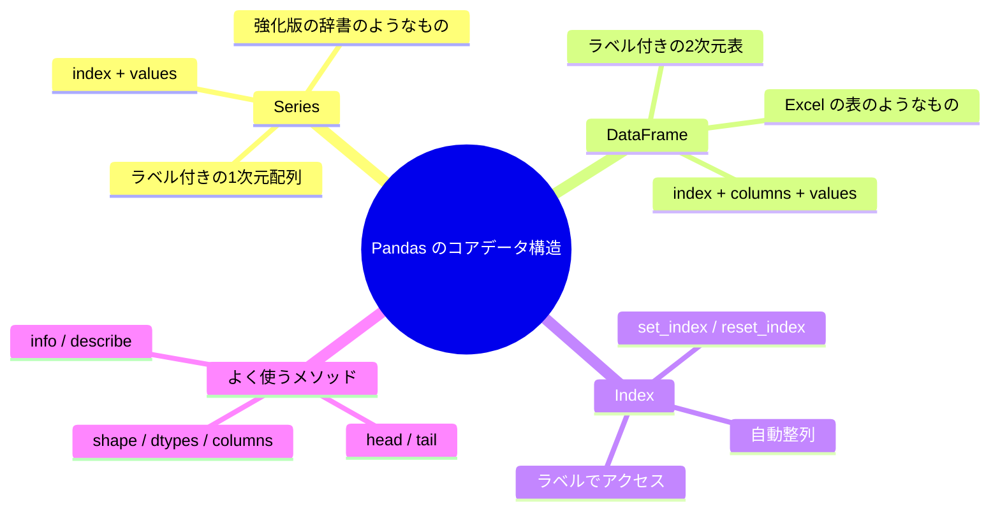

# 3.3.2 Pandas のコアデータ構造


:::tip この節の位置づけ
多くの初心者が初めて `Pandas` を学ぶと、次のように感じます。

- API が多い
- DataFrame は表みたいだけど、コードのオブジェクトにも見える

いちばん安定した理解のしかたは、実はこうです。

> **まずは「ラベル付きの表システム」として捉えて、そこから少しずつ操作を学ぶ。**

つまり、この節で大事なのは、すべての属性を覚えることではなく、まず次を知ることです。

- `Series` は何に似ているか
- `DataFrame` は何に似ているか
- なぜ Index が何度も出てくるのか
:::

## 学習目標

- データ分析における Pandas の立ち位置を理解する
- Series の作成と基本操作を身につける
- DataFrame の作成と基本属性を身につける
- Index の仕組みを理解する

---

## まずは地図を1枚つくろう

初めて `Pandas` を学ぶとき、いちばん安定した順番は「いきなり全部のメソッドを暗記する」ことではなく、まず全体像をつかむことです。


つまり、この節で本当に解決したいのは次のことです。

- なぜ `Pandas` は単なる「Python 版 Excel」ではないのか
- なぜ `Series / DataFrame / Index` がこの章全体の土台になるのか

---

## Pandas とは？

NumPy が Python データサイエンスの**エンジン**だとすると、Pandas は**ハンドルとメーター**のようなものです。
データを見やすく、扱いやすくしてくれます。


Pandas の主な機能：

| 機能 | 説明 |
|------|------|
| データの読み書き | 1行で CSV、Excel、JSON、SQL を読み込める |
| データクリーニング | 欠損値、重複値、異常値を処理する |
| データの絞り込み | SQL のように柔軟にフィルタ・検索できる |
| グループ集計 | groupby は純粋な Python のループより何十倍も速い |
| データの結合 | SQL の JOIN のように複数の表を結合できる |

### 初心者向けのいちばんわかりやすい比喩

`Pandas` は、次のように考えると理解しやすいです。

- 行と列のラベルを覚えてくれる、かしこい表

普通の `list` は、むしろ次のようなものです。

- 列名のない、生のデータのかたまり

`NumPy` は、次のようなものです。

- 高速な数値計算に向いた行列エンジン

`Pandas` は、次のような場面で使います。

- 「項目」「行レコード」「表の構造」を本格的に扱い始めるとき

第1章のウォームアップ練習を覚えていますか？ 75行の純粋な Python コードでやっていたことを、Pandas なら 5 行で書けました。
ここから、Pandas を本格的に学んでいきましょう。

```python
import pandas as pd
import numpy as np

print(pd.__version__)  # 例: 2.2.0
```

:::tip インポートの約束
NumPy を `np` と書くのと同じように、Pandas は `pd` と略すのが標準です。
:::

---

## Series：ラベル付きの1次元配列

**Series** は Pandas の最も基本的なデータ構造です。
**ラベル付きの NumPy 配列**だと考えるとわかりやすいです。

### はじめて Series を見るとき、まず何をつかむ？

まず押さえたいのは、この一文です。

> **Series = 1列のデータ + 1組のラベル**

この感覚が安定すると、その後に出てくる次の操作がかなり楽になります。

- ラベルで値を取る
- 位置で値を取る
- 1列全体に対して計算する

### Series の作成

```python
import pandas as pd

# リストから作成（0, 1, 2... の Index が自動でつく）
s1 = pd.Series([85, 92, 78, 95, 88])
print(s1)
# 0    85
# 1    92
# 2    78
# 3    95
# 4    88
# dtype: int64

# Index を指定する
s2 = pd.Series(
    [85, 92, 78, 95, 88],
    index=["国語", "数学", "英語", "物理", "化学"]
)
print(s2)
# 国語    85
# 数学    92
# 英語    78
# 物理    95
# 化学    88
# dtype: int64

# 辞書から作成（キーがそのまま Index になる）
scores = {"国語": 85, "数学": 92, "英語": 78, "物理": 95}
s3 = pd.Series(scores)
print(s3)
```

### Series の構造

```
Index          値 (Values)
───────────    ──────────
国語            85
数学            92
英語            78
物理            95
化学            88
```

各 Series は次の2つでできています。
- **Index**：ラベル。データの位置を決める
- **Values**：実際のデータ。中身は NumPy 配列

### 初心者向けの対応表

| 今見えているもの | まずはこう考える |
|---|---|
| `Series` | ラベル付きの1列データ |
| `Index` | この列データの「行名」 |
| `Values` | 実際に入っているデータ本体 |

この対応表は、抽象的な言葉を、もっと直感的な役割に置き換えてくれます。

```python
s = pd.Series([85, 92, 78], index=["国語", "数学", "英語"])

print(s.index)    # Index(['国語', '数学', '英語'], dtype='object')
print(s.values)   # [85 92 78]  ← これは NumPy 配列です！
print(s.dtype)    # int64
print(s.shape)    # (3,)
print(len(s))     # 3
```

### Series のアクセス

```python
s = pd.Series([85, 92, 78, 95], index=["国語", "数学", "英語", "物理"])

# ラベルでアクセス
print(s["数学"])      # 92

# 位置でアクセス
print(s.iloc[1])      # 92

# スライス
print(s["国語":"英語"])  # ラベルのスライス（終端を含む！）
# 国語    85
# 数学    92
# 英語    78

# ブールインデックス
print(s[s >= 90])
# 数学    92
# 物理    95
```

:::caution ラベルスライスと位置スライスの違い
- **ラベルスライス** `s["国語":"英語"]`：終端を**含む**
- **位置スライス** `s.iloc[0:2]`：終端を**含まない**（Python のリストと同じ）

初心者が混乱しやすいポイントです。
:::

### Series の演算

```python
s = pd.Series([85, 92, 78, 95], index=["国語", "数学", "英語", "物理"])

# ベクトル化演算（NumPy と同じ）
print(s + 5)         # 各科目に 5 点加算
print(s * 1.1)       # 各科目に 1.1 を掛ける
print(s.mean())      # 87.5  平均点
print(s.max())       # 95    最高点
print(s.describe())  # 1回で記述統計を出す
```

---

## DataFrame：ラベル付きの2次元表

**DataFrame** は Pandas の中心です。
**Excel の表**や、**複数の Series をまとめたもの**だと考えるとよいです。

### はじめて DataFrame を見るとき、まず覚えること

まず覚えたいのはこの一文です。

> **DataFrame = 複数の Series を、同じ行 Index でそろえて並べた表**

つまり、まずは次のように捉えれば十分です。

- 列名と行番号を持つ、ちゃんとしたデータ表

「ただの配列が並んでいるもの」と考えるより、ずっと理解しやすくなります。

### DataFrame の作成

```python
# 方法 1：辞書から作成（いちばんよく使う）
data = {
    "名前": ["山田", "鈴木", "高橋", "田中", "伊藤"],
    "年齢": [22, 25, 23, 28, 21],
    "都市": ["東京", "大阪", "名古屋", "福岡", "札幌"],
    "給与": [15000, 22000, 18000, 25000, 16000]
}
df = pd.DataFrame(data)
print(df)
#    名前  年齢   都市     給与
# 0  山田   22  東京  15000
# 1  鈴木   25  大阪  22000
# 2  高橋   23  名古屋  18000
# 3  田中   28  福岡  25000
# 4  伊藤   21  札幌  16000
```

```python
# 方法 2：リストのリストから作成
data = [
    ["山田", 22, "東京"],
    ["鈴木", 25, "大阪"],
    ["高橋", 23, "名古屋"]
]
df = pd.DataFrame(data, columns=["名前", "年齢", "都市"])

# 方法 3：NumPy 配列から作成
rng = np.random.default_rng(seed=42)
arr = rng.integers(60, 100, size=(5, 3))
df = pd.DataFrame(arr, columns=["国語", "数学", "英語"])

# 方法 4：Series の辞書から作成
df = pd.DataFrame({
    "数学": pd.Series([90, 85, 78], index=["山田", "鈴木", "高橋"]),
    "英語": pd.Series([88, 92, 75], index=["山田", "鈴木", "高橋"])
})
```

### DataFrame の構造

```
        列 (Columns)
        ↓
Index →  名前   年齢   都市     給与
(Index)
  0     山田    22    東京    15000
  1     鈴木    25    大阪    22000
  2     高橋    23    名古屋  18000
  3     田中    28    福岡    25000
  4     伊藤    21    札幌    16000
```

DataFrame = **行 Index** + **列名 (Columns)** + **データ (Values)**

### 基本属性

```python
data = {
    "名前": ["山田", "鈴木", "高橋", "田中", "伊藤"],
    "年齢": [22, 25, 23, 28, 21],
    "都市": ["東京", "大阪", "名古屋", "福岡", "札幌"],
    "給与": [15000, 22000, 18000, 25000, 16000]
}
df = pd.DataFrame(data)

print(df.shape)      # (5, 4)  → 5行4列
print(df.columns)    # Index(['名前', '年齢', '都市', '給与'], dtype='object')
print(df.index)      # RangeIndex(start=0, stop=5, step=1)
print(df.dtypes)
# 名前    object    ← 文字列
# 年齢     int64
# 都市    object
# 給与     int64
print(df.size)       # 20  → 5 × 4 = 20 個の要素
print(len(df))       # 5   → 行数
```

### データをさっと見る

```python
# 先頭 3 行
print(df.head(3))

# 末尾 2 行
print(df.tail(2))

# 基本情報
print(df.info())
# <class 'pandas.core.frame.DataFrame'>
# RangeIndex: 5 entries, 0 to 4
# Data columns (total 4 columns):
#  #   Column  Non-Null Count  Dtype
# ---  ------  --------------  -----
#  0   名前     5 non-null      object
#  1   年齢     5 non-null      int64
#  2   都市     5 non-null      object
#  3   給与     5 non-null      int64

# 数値列の統計要約
print(df.describe())
#              年齢           給与
# count   5.000000      5.000000
# mean   23.800000  19200.000000
# std     2.774887   4147.288271
# min    21.000000  15000.000000
# 25%    22.000000  16000.000000
# 50%    23.000000  18000.000000
# 75%    25.000000  22000.000000
# max    28.000000  25000.000000
```

:::tip info() と describe() は強い味方
新しいデータを受け取ったら、まず `df.info()` と `df.describe()` を実行しましょう。
これだけで、データの「全体像」が数秒で見えてきます。
:::

### 新しい表を受け取ったら、まず何をする？

おすすめの順番は次のとおりです。

1. まず `df.head()` を見る
2. 次に `df.info()` を見る
3. 次に `df.describe()` を見る
4. そのあとで絞り込みやクリーニングを始める

この流れのほうが、最初から複雑な操作を書くより迷いにくいです。

### 列を取り出す

```python
# 単一列を取得 → Series を返す
print(df["名前"])
# 0    山田
# 1    鈴木
# ...

# 点記法でも可（列名に空白がなく、メソッド名と衝突しない場合）
print(df.年齢)

# 複数列を取得 → DataFrame を返す
print(df[["名前", "給与"]])
#    名前     給与
# 0  山田  15000
# 1  鈴木  22000
# ...
```

### 「まず列を見られるようになる」ことが大事な理由

Pandas の仕事の多くは、次の3つに集約されます。

- 列を選ぶ
- 列を変える
- 列をもとに集計・組み合わせをする

だから、最初のうちは高級なメソッドをたくさん覚えるよりも、
「この列はどこにあるか」「どんな型か」「何ができるか」を押さえるほうが大切です。

### 列の追加と削除

```python
# 新しい列を追加
df["手取り給与"] = df["給与"] * 0.85
print(df[["名前", "給与", "手取り給与"]])

# 条件に基づいて列を追加
df["給与ランク"] = np.where(df["給与"] >= 20000, "高", "中")
print(df[["名前", "給与", "給与ランク"]])

# 列を削除
df = df.drop(columns=["手取り給与"])  # 新しい DataFrame を返す
# または
# df.drop(columns=["手取り給与"], inplace=True)  # 元のデータを直接変更
```

---

## Index の重要性

Index は、Pandas が NumPy と大きく違うポイントの1つです。

### Index を設定する

```python
df = pd.DataFrame({
    "名前": ["山田", "鈴木", "高橋"],
    "年齢": [22, 25, 23],
    "給与": [15000, 22000, 18000]
})

# "名前" 列を Index にする
df_indexed = df.set_index("名前")
print(df_indexed)
#       年齢     給与
# 名前
# 山田    22  15000
# 鈴木    25  22000
# 高橋    23  18000

# Index でアクセス
print(df_indexed.loc["鈴木"])
# 年齢       25
# 給与    22000

# Index を元に戻す
df_reset = df_indexed.reset_index()
print(df_reset)  # 元と同じ形
```

### Index の自動整列

Pandas の演算は、**Index に合わせて自動でそろえる**ことができます。
これはとても強力な機能です。

```python
s1 = pd.Series({"国語": 85, "数学": 92, "英語": 78})
s2 = pd.Series({"数学": 88, "英語": 82, "物理": 90})

# Index を自動でそろえて足し算
result = s1 + s2
print(result)
# 数学    180.0
# 物理      NaN   ← s1 に物理がないので NaN
# 英語    160.0
# 国語      NaN   ← s2 に国語がないので NaN
```

---

## Series と DataFrame の比較

| 特性 | Series | DataFrame |
|------|--------|-----------|
| 次元 | 1次元 | 2次元 |
| たとえ | Excel の1列 | Excel の表全体 |
| 作成 | `pd.Series([1,2,3])` | `pd.DataFrame({"a":[1,2]})` |
| 列の取得 | — | `df["列名"]` は Series を返す |
| Index | 1つの Index | 行 Index + 列 Index |

---

## 残す証拠

このページを終えたら、この evidence card を残します。

```text
データフレーム状態: 列、dtype、行数、欠損値、サンプル行
操作：read/write、select/filter、clean、transform、groupby、merge、または時系列処理
出力：resulting table、保存ファイル、aggregation、join結果、または時系列インデックスビュー
失敗確認：dtype 不一致、欠損データ、重複キー、チェーン代入、または誤った時間頻度
期待される成果：前後の表サンプルと、変換理由
```

## まとめ



---

## 手を動かしてみよう

### 練習 1：Series を作る

```python
# 1週間の毎日の歩数を表す Series を作成する
# Index は "月曜" から "日曜" にする
# 1. 平均歩数を表示する
# 2. いちばん歩数が多い日を見つける
# 3. 8000歩を超える日を見つける
```

### 練習 2：DataFrame を作る

```python
# 機能の進捗 DataFrame を作成する
# 列は 機能、担当者、予定時間、実績時間、状態 の5列
# 少なくとも 5 件のタスクを入れる
# 1. "時間差" の列を追加する
# 2. "超過" の列を追加する
# 3. "リスク" の列を追加する（ブロック中 -> 高、レビュー中 -> 中、完了 -> 低、それ以外は要観察）
# 4. describe() で数値列の統計情報を見る
```

### 練習 3：Index 操作

```python
# 練習 2 の DataFrame を使う
# 1. "機能" を Index にする
# 2. 機能名から、その進捗レコードを調べる
# 3. Index を元に戻す
```


<details>
<summary>参考実装と解説</summary>

- 1週間の歩数 Series では、曜日名を index にし、平均、最多歩数日の `idxmax`、ブール条件による高歩数日の抽出を行います。
- 機能進捗の DataFrame では `時間差` と `超過` を追加し、ルールに応じて関数、`map`、または `pd.cut` で `リスク` 列を作ります。`describe()` は有用な証拠ですが、それだけで分析完了ではありません。
- index の練習では `set_index` と `reset_index` の両方を示します。よい答えは、位置指定の `.iloc` よりラベル指定の `.loc` が読みやすい場面を説明します。

</details>
