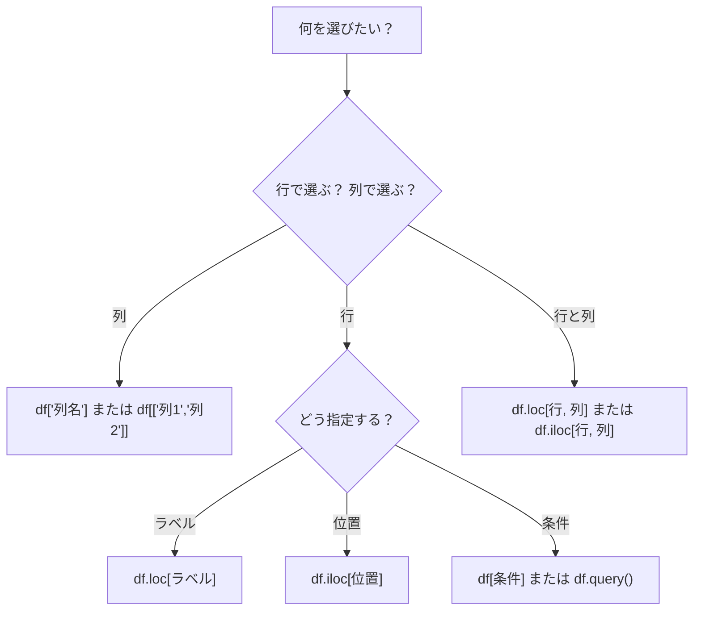

# データの選択とフィルタリング

:::tip この節の位置づけ
多くの初心者が最初に `Pandas` を学ぶとき、いちばんつまずきやすいのは、最初のデータ整形ではなく、次の点です。

- いったいどうやって、欲しい部分のデータを取り出すの？

この節でいちばん大事なのは、全部の書き方を覚えることではなく、まず次の判断基準を持つことです。

> **ラベルで取るのか、位置で取るのか、それとも条件で絞るのか？**
:::

## 学習目標

- `loc`（ラベルインデックス）と `iloc`（位置インデックス）を身につける
- ブールインデックスを使って条件で絞り込めるようになる
- `query()` メソッドを身につける
- 複数条件を組み合わせて絞り込めるようになる

---

## まずは地図を1枚つくろう

データの選択とフィルタリングは、「誰を選ぶか」という視点で考えると分かりやすいです。


この節で本当に解決したいのは、次のことです。

- さまざまな場面で、まず `loc`、`iloc`、それともブールインデックスのどれを思い浮かべるべきか
- なぜ多くの `Pandas` の問題で、最初の一歩が「まず見たいデータを取り出す」なのか

## サンプルデータを準備する

```python
import pandas as pd
import numpy as np

df = pd.DataFrame({
    "氏名": ["張三", "李四", "王五", "趙六", "銭七", "孫八"],
    "年齢": [22, 28, 25, 35, 21, 30],
    "部署": ["技術", "市場", "技術", "管理", "技術", "市場"],
    "給与": [15000, 18000, 22000, 35000, 12000, 20000],
    "入社年": [2023, 2020, 2021, 2018, 2024, 2019]
})
print(df)
```

### 初心者におすすめの全体イメージ

この節は、次のように考えると理解しやすいです。

- 大きな表の中から、本当に見たい行や列を探す

つまり、この節で大事なのは「書き方が多いこと」ではなく、次の点です。

- 名前で探すのか
- 位置で探すのか
- 条件で絞るのか

---

## loc：ラベルインデックス

`loc` は**ラベル（名前）** を使ってデータを指定します。形式は `df.loc[行ラベル, 列ラベル]` です。

### `loc` を最初に学ぶとき、まず覚えること

まず覚えるべきなのは、次の一文です。

> **`loc` は「名前やラベル」で選ぶ。**

つまり、次のような感覚です。

- どの列が欲しいか、どのラベル範囲が欲しいかが分かっている

```python
# 1行を取り出す
print(df.loc[0])         # 1行目（ラベルが 0 の行）

# 複数行を取り出す
print(df.loc[0:2])       # ラベル 0 から 2 まで（2 を含む！）

# 特定の行と列を取り出す
print(df.loc[0, "氏名"])          # "張三"
print(df.loc[0:2, "氏名"])       # 最初の 3 行の氏名
print(df.loc[0:2, ["氏名", "給与"]])  # 最初の 3 行の氏名と給与

# すべての行の一部の列を取り出す
print(df.loc[:, ["氏名", "年齢"]])

# 条件で絞る（いちばんよく使う！）
print(df.loc[df["年齢"] > 25])    # 年齢が 25 より大きいすべての行
```

---

## iloc：位置インデックス

`iloc` は**位置（整数）** を使ってデータを指定します。Python のリストのスライス規則と同じです。

### `iloc` を最初に学ぶとき、まず覚えること

まず覚えるべきなのは、次の一文です。

> **`iloc` は「何行目、何列目」で選ぶ。**

つまり、次のような感覚です。

- 表の座標を見て値を取り出す

```python
# 1行を取り出す
print(df.iloc[0])        # 1行目

# 複数行を取り出す（末尾は含まない。Python と同じ）
print(df.iloc[0:3])      # 0、1、2 行目

# 特定の位置を取り出す
print(df.iloc[0, 0])     # 0行目 0列目 → "張三"
print(df.iloc[0:3, 0:2]) # 最初の 3 行、最初の 2 列
print(df.iloc[[0, 2, 4]])  # 0、2、4 行目

# 最後の行を取り出す
print(df.iloc[-1])
```

### loc と iloc の比較

| 特性 | `loc` | `iloc` |
|------|-------|--------|
| 指定方法 | ラベル（名前） | 位置（整数） |
| スライスの末尾 | **含む** | **含まない** |
| 例 | `df.loc[0:2]` → 3 行 | `df.iloc[0:2]` → 2 行 |
| 条件での絞り込み | ✅ 可能 | ❌ 不可 |

:::caution いちばんよくある落とし穴
インデックスがデフォルトの 0, 1, 2... のとき、`loc[0:2]` は **3 行**、`iloc[0:2]` は **2 行** を返します。

```python
print(len(df.loc[0:2]))    # 3  （ラベル 2 を含む）
print(len(df.iloc[0:2]))   # 2  （位置 2 は含まない）
```
:::

### 初心者がまず覚えるとよい選び方の表

| やりたいこと | まず思い浮かべるもの |
|---|---|
| 列名やラベルが分かっている | `loc` |
| 何行目、何列目しか分からない | `iloc` |
| 条件で人や注文を絞りたい | ブールインデックス |
| 条件が長くて、文のように書きたい | `query()` |

この表は初心者にとても役立ちます。なぜなら、「結局どれを使えばいいの？」を、そのまま判断できる形にしてくれるからです。

---

## ブールインデックス：条件で絞り込む

これはデータ分析で**最もよく使う**操作です。

### なぜブールインデックスが重要なのか？

実際の分析では、次のようなことをよくします。

- 金額がある値より大きい注文を探す
- ある部署の人を探す
- 2〜3個の条件を満たすデータだけを取り出す

つまり、分析の最初の一歩は、たいてい次のことです。

- まず分析したいデータだけを絞り込む

### 単一条件での絞り込み

```python
# 給与が 20000 より大きい社員
high_salary = df[df["給与"] > 20000]
print(high_salary)

# 部署が "技術" の社員
tech = df[df["部署"] == "技術"]
print(tech)

# 年齢が 22 ではない社員
print(df[df["年齢"] != 22])
```

### 複数条件の組み合わせ

```python
# 技術部門かつ給与が 15000 より大きい（AND は & を使う）
result = df[(df["部署"] == "技術") & (df["給与"] > 15000)]
print(result)

# 技術部門または管理部門（OR は | を使う）
result = df[(df["部署"] == "技術") | (df["部署"] == "管理")]
print(result)

# 否定（NOT は ~ を使う）
result = df[~(df["部署"] == "技術")]  # 非技術部門
print(result)
```

:::caution 複数条件では必ずかっこを付ける
NumPy と同じで、各条件は必ずかっこで囲み、`and` `or` `not` ではなく `&` `|` `~` を使います。

```python
# ❌ 間違い
df[df["年齢"] > 25 and df["給与"] > 20000]

# ✅ 正しい
df[(df["年齢"] > 25) & (df["給与"] > 20000)]
```
:::

### isin：複数の値に一致するか調べる

```python
# 部署が ["技術", "市場"] に含まれる社員
result = df[df["部署"].isin(["技術", "市場"])]
print(result)

# 逆に、これらの部門に含まれない
result = df[~df["部署"].isin(["技術", "市場"])]
print(result)
```

### between：範囲で絞り込む

```python
# 年齢が 22〜30 の間（両端を含む）
result = df[df["年齢"].between(22, 30)]
print(result)
```

### 文字列条件

```python
# 氏名に "三" を含む
result = df[df["氏名"].str.contains("三")]

# 氏名が "張" で始まる
result = df[df["氏名"].str.startswith("張")]
```

### 初めて絞り込み問題を解くときの、いちばん安定した順番

よくある安定した順番は、次のとおりです。

1. ラベルで選ぶのか、位置で選ぶのか、条件で絞るのかを考える
2. 条件が簡単なら、まずブールインデックスを使う
3. 条件が長いなら、`query()` を検討する
4. 最後に、行と列の取り出し方を組み合わせる

この順番なら、最初から複数の書き方を混ぜるより、ずっと迷いにくくなります。

---

## query() メソッド

`query()` を使うと、より自然な文章に近い形でデータを絞り込めます。

```python
# df[df["salary"] > 20000] と同じ
result = df.query("salary > 20000")
print(result)

# 複数条件
result = df.query("department == 'Technology' and salary > 15000")
print(result)

# 変数を使う
min_salary = 20000
result = df.query("salary > @min_salary")  # @ で外部変数を参照する
print(result)

# 範囲検索
result = df.query("22 <= age <= 30")
print(result)
```

:::tip いつ `query()` を使う？
- 条件が簡単なとき：ブールインデックス `df[df["col"] > 5]` のほうが直接的
- 条件が複雑なとき：`query()` のほうが読みやすい、特に複数条件の組み合わせ
- 変数を参照したいとき：`query("col > @var")` はとても便利
:::

---

## 特定のデータを選ぶ方法のまとめ



## 初心者がそのまま使えるデータ選択チェックリスト

初めて `Pandas` の絞り込み問題を解くとき、いちばん安定したチェックリストは次のとおりです。

1. 列を選びたいのか、行を選びたいのか、行と列の両方を選びたいのか？
2. ラベルで選ぶのか、位置で選ぶのか、条件で選ぶのか？
3. 条件にかっこは付いているか？
4. 結果は、自分が思っていた行や列になっているか？

この 4 つを確認するだけで、多くの絞り込み問題はかなり解きやすくなります。

---

## 実践：データの絞り込み

```python
import pandas as pd
import numpy as np

# EC注文データを作成する
rng = np.random.default_rng(seed=42)
n = 100
orders = pd.DataFrame({
    "orderID": range(1001, 1001 + n),
    "customer": rng.choice(["Alice", "Bob", "Charlie", "Diana", "Eve"], n),
    "product_category": rng.choice(["electronics", "clothing", "food", "books"], n),
    "amount": rng.integers(10, 500, n),
    "quantity": rng.integers(1, 10, n),
    "is_returned": rng.choice([True, False], n, p=[0.1, 0.9])
})

# データを確認する
print(orders.head(10))
print(orders.info())

# 絞り込み練習
# 1. 金額が 300 より大きい注文
print(orders[orders["amount"] > 300])

# 2. Alice が購入した電子製品
print(orders.query("customer == 'Alice' and product_category == 'electronics'"))

# 3. 返品されていない注文のうち、金額が上位 10 件
not_returned = orders[~orders["is_returned"]]
top10 = not_returned.nlargest(10, "amount")
print(top10[["orderID", "customer", "amount"]])
```

---

## やってみよう

### 練習 1：基本の絞り込み

```python
# 上の orders データを使う
# 1. すべての返品注文を探す
# 2. 金額が 100〜200 の注文数を調べる
# 3. "books" または "food" カテゴリを購入した注文を探す
# 4. Bob の非返品注文の平均金額を求める
```

### 練習 2：応用の絞り込み

```python
# 1. 各顧客の最大注文金額はいくら？（ヒント：先に絞ってから集計する）
# 2. どの顧客に返品履歴がある？
# 3. 金額上位 5% の注文はどれ？（ヒント：quantile を使う）
```

## この節でいちばん持ち帰ってほしいこと

- `loc` はラベルで選び、`iloc` は位置で選び、ブールインデックスは条件で絞る
- 実際の分析問題では、最初の一歩は計算ではなく、まず絞り込みであることが多い
- 「誰を選びたいのか」を先に整理してからコードを書くと、書き方を丸暗記するよりずっと安定する
