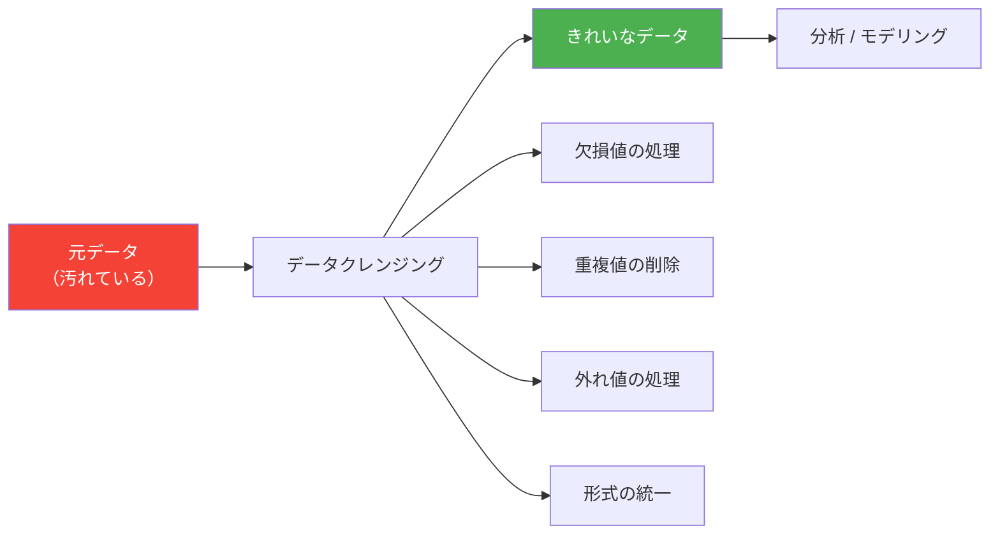

# 3.3.5 データクレンジング

:::tip この節の位置づけ
多くの初心者がはじめてデータクレンジングを学ぶとき、いちばん理解しやすいイメージは次のようなものです。

- どの関数を使えば汚いデータを片づけられるか

でも、より安定した理解はこうです。

> **まず問題の種類を見分けてから、削除するか、補うか、修正するか、残すかを決める。**

だから、この節でいちばん大事なのは関数を覚えることではなく、クレンジングの順番と判断の習慣を身につけることです。
:::

## 学習目標

- 欠損値の検出、削除、補完の方法を身につける
- 重複値の処理を学ぶ
- 外れ値の検出方法を理解する
- データ型変換と文字列処理を身につける

---

## まずは全体像をつかもう

データクレンジングは、「まず確認して、次にどう処理するか決める」という流れで考えると理解しやすいです。


この節で本当に解決したいのは、次の2つです。

- 実際のデータによくある問題は何か
- はじめて汚いデータを受け取ったとき、どんな順番で確認するのが安全か

## なぜデータクレンジングが必要なのか？

現実世界のデータは**かなり汚れている**ことが多いです。欠損値、重複行、形式の不統一、外れ値……。これらをクレンジングせずにそのまま分析すると、結果は信頼できません。

> 「データサイエンティストは時間の80%をデータクレンジングに、20%をデータクレンジングへの愚痴に使う。」—— 業界の名言



### 初心者向けのたとえ

データクレンジングは、次のように考えるとわかりやすいです。

- 料理の前に野菜を洗って、不要な部分を取り除いて、材料をそろえる作業

これは「見た目を整えるため」だけではありません。
本当の目的は、

- あとで分析を始めたとき、壊れたデータや重複データ、形式の乱れに引っ張られないようにすること

です。

---

## 欠損値の処理

### 欠損値を含むデータを作る

```python
import pandas as pd
import numpy as np

df = pd.DataFrame({
    "氏名": ["张三", "李四", "王五", "赵六", "钱七"],
    "年龄": [22, np.nan, 25, 28, np.nan],
    "城市": ["北京", "上海", None, "深圳", "杭州"],
    "給与": [15000, 22000, np.nan, 35000, 12000]
})
print(df)
```

### 欠損値を検出する

```python
# 各位置が欠損かどうかを確認
print(df.isna())        # True = 欠損（isnull() でも同じ）
print(df.notna())       # True = 非欠損

# 各列の欠損数
print(df.isna().sum())
# 氏名    0
# 年龄    2
# 城市    1
# 給与    1

# 欠損率
print(df.isna().mean())
# 年龄    0.4
# 城市    0.2
# 給与    0.2

# 欠損値を含む行
print(df[df.isna().any(axis=1)])
```

### 欠損値を削除する

```python
# 欠損値を含む行をすべて削除
df_cleaned = df.dropna()
print(df_cleaned)  # 2 行だけ残る（张三、赵六）

# すべてが欠損の行だけ削除
df.dropna(how="all")

# 特定の列だけを見る
df.dropna(subset=["年龄"])         # 年齢が欠損の行を削除
df.dropna(subset=["年龄", "給与"]) # 年齢または給与が欠損の行を削除

# 少なくとも N 個の非欠損値がある行だけ残す
df.dropna(thresh=3)  # 少なくとも 3 列に値がある行だけ残す
```

### 欠損値を補完する

```python
# 固定値で補完
df["城市"].fillna("未知")

# 平均値で補完（数値列でよく使う）
df["年龄"].fillna(df["年龄"].mean())

# 中央値で補完
df["給与"].fillna(df["給与"].median())

# 1つ前の値で補完（時系列でよく使う）
df["年龄"].ffill()    # forward fill

# 1つ後の値で補完
df["年龄"].bfill()    # backward fill

# 列ごとに違う方法を使う
df_filled = df.fillna({
    "年龄": df["年龄"].median(),
    "城市": "未知",
    "給与": 0
})
print(df_filled)
```

### 欠損値の処理方針

| 方針 | 適した場面 | 方法 |
|------|-----------|------|
| 行を削除 | 欠損率が小さい（5%未満）、データ量が多い | `dropna()` |
| 平均値/中央値で補完 | 数値型、分布が対称 | `fillna(mean/median)` |
| 最頻値で補完 | カテゴリ変数 | `fillna(mode()[0])` |
| 前/後の値で補完 | 時系列データ | `ffill() / bfill()` |
| 固定値で補完 | ルールがはっきりしている | `fillna(0)` または `fillna("未知")` |
| 補間 | 連続データ | `interpolate()` |

### はじめて欠損値を扱うときの、いちばん安全な順番

一般的には、次の順番が安定しています。

1. まず欠損率を確認する
2. 次に、その列が重要かどうかを判断する
3. 欠損が少ないなら、行削除を考える
4. 欠損が多いなら、補完方法を考える

この順番のほうが、最初から `dropna()` を使うより、データを壊しにくいです。

---

## 重複値の処理

```python
df = pd.DataFrame({
    "氏名": ["张三", "李四", "张三", "王五", "李四"],
    "部署": ["技術", "市場", "技術", "技術", "市場"],
    "給与": [15000, 18000, 15000, 22000, 18000]
})

# 重複行を検出
print(df.duplicated())
# 0    False
# 1    False
# 2     True   ← 0 行目と完全に同じ
# 3    False
# 4     True   ← 1 行目と完全に同じ

# 重複行の数
print(f"重复行数: {df.duplicated().sum()}")  # 2

# 重複行を削除
df_unique = df.drop_duplicates()
print(df_unique)  # 3 行

# 特定の列で重複を判断
df.drop_duplicates(subset=["氏名"])        # 同じ名前は最初の1件だけ残す
df.drop_duplicates(subset=["氏名"], keep="last")  # 最後の1件を残す
```

### 重複値は何と間違えやすい？

初心者は「重複値 = 必ず削除」と考えがちです。
でも、より安全な考え方は次のとおりです。

- それが本当に重複なのか確認する
- それとも、業務上は自然な複数回の記録なのか考える

たとえば、

- 同じユーザーが何回も注文するのは、汚いデータではありません
- 同じ注文が2回取り込まれたなら、それは本当に削除すべき重複です

---

## 外れ値の処理

### Z-score 法

```python
rng = np.random.default_rng(seed=42)
df = pd.DataFrame({
    "給与": np.concatenate([
        rng.normal(20000, 5000, 97),  # 正常データ
        np.array([100000, 150000, 200000])    # 外れ値
    ])
})

# Z-score を計算
z_scores = (df["給与"] - df["給与"].mean()) / df["給与"].std()

# |Z| > 3 を外れ値とみなす
outliers = df[z_scores.abs() > 3]
print(f"検出された外れ値は {len(outliers)} 個です")
print(outliers)

# 外れ値を除去
df_clean = df[z_scores.abs() <= 3]
```

### IQR 法（より頑健）

```python
Q1 = df["給与"].quantile(0.25)
Q3 = df["給与"].quantile(0.75)
IQR = Q3 - Q1

lower = Q1 - 1.5 * IQR
upper = Q3 + 1.5 * IQR

print(f"正常範囲: [{lower:.0f}, {upper:.0f}]")

# 範囲外のデータを除去
df_clean = df[(df["給与"] >= lower) & (df["給与"] <= upper)]

# または外れ値を境界値に丸める
df["給与_clipped"] = df["給与"].clip(lower, upper)
```

### 初心者がまず覚えるとよい判断表

| 現象 | まず取るべき安定した行動 |
|---|---|
| 欠損値が多い | まずその列を残すべきか判断する |
| 数値が極端におかしい | まず入力ミスを疑う |
| 同じ行が何度も出る | まず重複取り込みか確認する |
| 数字のはずなのに文字列になっている | まず型変換する |

この表は、データの汚れを「いくつかの処理しやすい問題」に分けて考える助けになります。

---

## データ型変換

```python
df = pd.DataFrame({
    "ID": ["001", "002", "003"],
    "価格": ["12.5", "23.8", "15.0"],
    "数量": ["3", "5", "2"],
    "日付": ["2024-01-15", "2024-02-20", "2024-03-10"]
})
print(df.dtypes)  # すべて object（文字列）

# データ型を変換
df["価格"] = df["価格"].astype(float)
df["数量"] = df["数量"].astype(int)
df["日付"] = pd.to_datetime(df["日付"])
print(df.dtypes)
# ID       object
# 価格    float64
# 数量      int64
# 日付    datetime64[ns]

# 変換エラーへの対応
dirty = pd.Series(["10", "20", "abc", "40"])
# dirty.astype(int)  # ❌ エラーになる

# to_numeric を使うときれいに処理できる
clean = pd.to_numeric(dirty, errors="coerce")  # 変換できないものは NaN になる
print(clean)
# 0    10.0
# 1    20.0
# 2     NaN
# 3    40.0
```

---

## 文字列処理（str アクセサ）

Pandas の `.str` アクセサを使うと、列全体の文字列にまとめて処理できます。

```python
df = pd.DataFrame({
    "氏名": ["  张三 ", "李四", " 王五  "],
    "邮箱": ["Zhang@Email.COM", "li4@email.com", "WANG5@EMAIL.COM"],
    "スマホ": ["138-0000-1111", "139-2222-3333", "137-4444-5555"]
})

# 前後の空白を削除
df["氏名"] = df["氏名"].str.strip()

# 小文字にする
df["邮箱"] = df["邮箱"].str.lower()

# 置換
df["スマホ_clean"] = df["スマホ"].str.replace("-", "")

# 含まれているかを判定
print(df["邮箱"].str.contains("email"))  # すべて True

# 抽出
df["スマホ前3位"] = df["スマホ"].str[:3]

# 分割
df["邮箱用户名"] = df["邮箱"].str.split("@").str[0]

print(df)
```

### よく使う str メソッド

| メソッド | 役割 | 例 |
|------|------|------|
| `.str.strip()` | 前後の空白を削除 | `" hello " → "hello"` |
| `.str.lower()` | 小文字に変換 | `"ABC" → "abc"` |
| `.str.upper()` | 大文字に変換 | `"abc" → "ABC"` |
| `.str.replace()` | 置換 | `"a-b".replace("-","")` |
| `.str.contains()` | 含まれているか判定 | 真偽値の Series を返す |
| `.str.startswith()` | 先頭か判定 | 真偽値の Series を返す |
| `.str.len()` | 文字列の長さ | `"hello" → 5` |
| `.str.split()` | 分割 | `"a,b".split(",")` |
| `.str.extract()` | 正規表現で抽出 | 一致した部分を取り出す |

---

## 実践：汚いデータをクレンジングする

```python
import pandas as pd
import numpy as np

# "汚い"データを作る
dirty_data = pd.DataFrame({
    "氏名": ["  张三", "李四 ", "王五", "张三", " 赵六", "钱七", "李四"],
    "年龄": [22, 28, np.nan, 22, "未知", 150, 28],       # 欠損、非数値、外れ値あり
    "城市": ["北京", "上海 ", None, "北京", " 广州", "深圳", "上海"],
    "給与": [15000, 22000, 18000, 15000, 20000, -5000, 22000]  # 負の値あり
})

print("=== 元データ ===")
print(dirty_data)
print(f"\n行数: {len(dirty_data)}")

# ステップ 1: 文字列の空白を削除
dirty_data["氏名"] = dirty_data["氏名"].str.strip()
dirty_data["城市"] = dirty_data["城市"].str.strip()

# ステップ 2: データ型を変換
dirty_data["年龄"] = pd.to_numeric(dirty_data["年龄"], errors="coerce")

# ステップ 3: 外れ値を処理
dirty_data.loc[dirty_data["年龄"] > 120, "年龄"] = np.nan    # 年齢 > 120 は不自然
dirty_data.loc[dirty_data["給与"] < 0, "給与"] = np.nan      # 給与 < 0 は不自然

# ステップ 4: 欠損値を補完
dirty_data["年龄"] = dirty_data["年龄"].fillna(dirty_data["年龄"].median())
dirty_data["城市"] = dirty_data["城市"].fillna("未知")
dirty_data["給与"] = dirty_data["給与"].fillna(dirty_data["給与"].median())

# ステップ 5: 重複行を削除
dirty_data = dirty_data.drop_duplicates()

print("\n=== クレンジング後 ===")
print(dirty_data)
print(f"\n行数: {len(dirty_data)}")
```

### この小さな実践で、まず何を学ぶべき？

いちばん大事なのは、特定の関数名を覚えることではありません。
クレンジングには、だいたい次のような安定した順番がある、ということです。

1. まず形式をそろえる
2. 次に型を変換する
3. 次に外れ値を処理する
4. 最後に欠損値の補完と重複削除をする

順番が整理できると、汚いデータの問題はかなり分解しやすくなります。

## 初心者がそのまま使えるデータクレンジングチェックリスト

はじめてデータクレンジングをするとき、安定したチェックリストは次のとおりです。

1. 各列の型は正しいか？
2. 欠損率は高すぎないか？
3. 明らかな外れ値はないか？
4. 重複記録はないか？
5. クレンジングルールを他人に説明できるか？

最後の項目はとても重要です。なぜなら、クレンジングも本質的には「判断」だからです。
自分で「なぜ削除したのか」「なぜこの値で補ったのか」を説明できないと、その後の分析は信頼されにくくなります。

---

## 残す証拠

このページを終えたら、この evidence card を残します。

```text
データフレーム状態: 列、dtype、行数、欠損値、サンプル行
操作：read/write、select/filter、clean、transform、groupby、merge、または時系列処理
出力：resulting table、保存ファイル、aggregation、join結果、または時系列インデックスビュー
失敗確認：dtype 不一致、欠損データ、重複キー、チェーン代入、または誤った時間頻度
期待される成果：前後の表サンプルと、変換理由
```

## まとめ

| 種類 | 検出 | 処理方法 |
|------|------|---------|
| 欠損値 | `isna()`, `info()` | `dropna()`, `fillna()` |
| 重複値 | `duplicated()` | `drop_duplicates()` |
| 外れ値 | Z-score, IQR | `clip()`, 削除, `NaN` に置換 |
| 型エラー | `dtypes` | `astype()`, `pd.to_numeric()` |
| 文字列の汚れ | 目視, `str.contains()` | `str.strip()`, `str.replace()` |

---

## 練習問題

### 練習 1：欠損値の処理

```python
# 欠損値を含む DataFrame を作る（最低 20 行 5 列）
# 1. 各列の欠損率を集計する
# 2. 数値列は中央値で補完する
# 3. カテゴリ列は最頻値で補完する
# 4. 欠損率が 50% を超える列を削除する（あれば）
```

### 練習 2：完全なクレンジングの流れ

```python
# さまざまな問題を含むデータを作り、完全なクレンジングを行う：
# 文字列の空白 → 型変換 → 外れ値処理 → 欠損値補完 → 重複削除
```


<details>
<summary>参考実装と解説</summary>

- まず `isna().sum()` と `isna().mean()` で欠損レポートを作ります。列ごとに、削除、中央値や最頻値での補完、欠損自体を意味あるシグナルとして残すかを決めます。
- 外れ値がありそうな数値列は中央値を使うことが多く、カテゴリ列は最頻値または明示的な `Unknown` を使うことが多いです。欠損率が非常に高い列を使うなら理由を書きます。
- クリーニングログには、元の行数、削除行数、補完した値、重複ルール、外れ値ルールを残します。このログがないと、クリーン後のデータを信頼しにくくなります。

</details>
