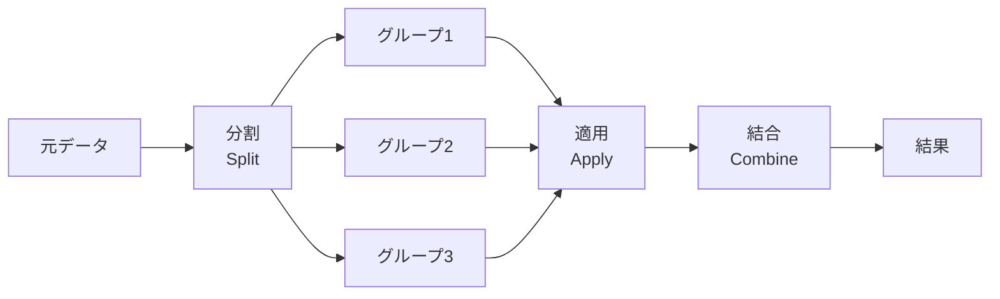

# 3.3.7 グループ化と集計


:::tip この節の位置づけ
多くの初心者が最初に `groupby` を学ぶとき、よくある感覚は次の通りです。

- 文法はあまり難しくなさそう
- でも実際の問題になると、どう考えればいいかわからない

いちばん安定した理解方法は、次の考え方です。

> **まず「何でグループ化するか」「各グループで何を計算したいか」を考えてからコードを書く。**

なので、この節で大事なのは、たくさんの集計関数を暗記することではなく、「分割 -> 集計 -> 結合」という流れを意識することです。
:::

## 学習目標

- groupby の「分割—適用—結合」の仕組みを理解する
- よく使う集計関数と `agg` メソッドを身につける
- グループ変換（transform）とグループフィルタ（filter）を学ぶ
- ピボットテーブル（pivot_table）を身につける

---

## まずは全体像をつかもう

`groupby` は、「分割 -> 適用 -> 結合」で考えると理解しやすいです。


この節で本当に解決したいのは、次の点です。

- なぜ `groupby` で「部署ごと / カテゴリごと / 月ごと」の集計問題をまとめて扱えるのか
- `agg / transform / filter / pivot_table` は、それぞれ何を補っているのか

## なぜ groupby はそんなに重要なのか？

第 1 章を思い出してください。純粋な Python で「性別ごとの生存率」を集計するには、辞書とループを手で書く必要がありました。Pandas の groupby を使えば、**1 行で**できます。

```python
# 純粋な Python：15 行
# Pandas：1 行
df.groupby("Sex")["Survived"].mean()
```

`groupby` は SQL の `GROUP BY` のようなものです。つまり、ある列でグループ化して、各グループごとに計算します。

### 初心者向けの、いちばんわかりやすいたとえ

`groupby` は次のように考えると理解しやすいです。

- 同じ種類のものを先にいくつかのかたまりに分けて、それぞれ数える・計算する・比べる

たとえば：

- 部署ごとに分ける
- 都市ごとに分ける
- 月ごとに分ける

こう考えると、頭の中でずっと「Pandas の文法」を追うより、本質をつかみやすくなります。

---

## groupby の基礎

### 分割の仕組み



```python
import pandas as pd
import numpy as np

df = pd.DataFrame({
    "部署": ["技術", "市場", "技術", "管理", "市場", "技術", "管理"],
    "氏名": ["张三", "李四", "王五", "赵六", "钱七", "孙八", "周九"],
    "給与": [15000, 18000, 22000, 35000, 20000, 19000, 30000],
    "年龄": [22, 28, 25, 35, 30, 24, 40]
})

# 部門ごとにグループ化して、平均給与を計算する
result = df.groupby("部署")["給与"].mean()
print(result)
# 部署
# 市場    19000.0
# 技術    18666.7
# 管理    32500.0
```

### 基本的な集計

```python
grouped = df.groupby("部署")

# よく使う集計関数
print(grouped["給与"].sum())       # 合計給与
print(grouped["給与"].mean())      # 平均給与
print(grouped["給与"].median())    # 中央値
print(grouped["給与"].min())       # 最低給与
print(grouped["給与"].max())       # 最高給与
print(grouped["給与"].std())       # 標準偏差
print(grouped["給与"].count())     # 人数
```

### 複数列の集計

```python
# 複数列をまとめて集計する
print(df.groupby("部署")[["給与", "年龄"]].mean())
#        給与       年龄
# 部署
# 市場  19000.0  29.000000
# 技術  18666.7  23.666667
# 管理  32500.0  37.500000
```

### 複数キーでのグループ化

```python
df2 = pd.DataFrame({
    "部署": ["技術", "技術", "市場", "市場", "技術", "市場"],
    "レベル": ["初級", "上級", "初級", "上級", "初級", "初級"],
    "給与": [15000, 25000, 12000, 22000, 18000, 14000]
})

# 部署とレベルでグループ化する
result = df2.groupby(["部署", "レベル"])["給与"].mean()
print(result)
# 部署  レベル
# 市場  初級    13000.0
#       上級    22000.0
# 技術  初級    16500.0
#       上級    25000.0
```

### 初めて分割集計の問題を解くときの、いちばん安全な順番

おすすめの順番は次の通りです。

1. まず「何で分けるか」を考える
2. 次に「各グループで何を計算するか」を考える
3. 最後に、結果を要約表として返すのか、元の表に書き戻すのかを決める

この順番はとても大事です。なぜなら、その後に使うべきものが次のどれかに決まるからです。

- `agg`
- `transform`
- `filter`

---

## agg: 複数の集計をまとめて行う

`agg` を使うと、同じ列や異なる列に対して、いろいろな集計関数をまとめて適用できます。

```python
# 給与列に対して、複数の統計量を同時に計算する
result = df.groupby("部署")["給与"].agg(["mean", "min", "max", "count"])
print(result)
#            mean    min    max  count
# 部署
# 市場  19000.0  18000  20000      2
# 技術  18666.7  15000  22000      3
# 管理  32500.0  30000  35000      2
```

```python
# 列ごとに異なる集計関数を使う
result = df.groupby("部署").agg({
    "給与": ["mean", "max"],
    "年龄": ["mean", "min"],
    "氏名": "count"           # 人数
})
print(result)

# カスタム集計関数
result = df.groupby("部署")["給与"].agg(
    平均給与="mean",
    最高給与="max",
    給与差距=lambda x: x.max() - x.min()
)
print(result)
```

### どんなときにまず `agg` を思い浮かべるべき？

頭の中の質問が次のような形なら、まず `agg` を考えるとよいです。

- 「各部署の平均、最大値、人数はそれぞれいくつ？」

この場合は、たいてい

- `groupby(...).agg(...)`

です。

つまり、`agg` は次のようなときに向いています。

- いくつかの集計を一度にまとめて出したいとき

---

## transform: グループ変換

`transform` は各グループに関数を適用しますが、**元のデータと同じ長さの結果**を返します。新しい列を作るときにとても便利です。

```python
# 例：各人に「部署平均との差」を付ける
df["部署平均給与"] = df.groupby("部署")["給与"].transform("mean")
df["給与差距"] = df["給与"] - df["部署平均給与"]
print(df[["氏名", "部署", "給与", "部署平均給与", "給与差距"]])

# 例：グループ内標準化（各グループで平均を引き、標準偏差で割る）
df["給与_标准化"] = df.groupby("部署")["給与"].transform(
    lambda x: (x - x.mean()) / x.std() if x.std() > 0 else 0
)
```

:::tip transform と agg の違い
- `agg`：各グループから**1つの値**を返す（要約）、結果の行数 = グループ数
- `transform`：各グループから**元と同じ数の値**を返す、結果の行数 = 元の行数

```python
# agg: 3 つの部門 → 3 行
df.groupby("部署")["給与"].agg("mean")

# transform: 7 人 → 7 行（各人に自分の部門の平均値が入る）
df.groupby("部署")["給与"].transform("mean")
```
:::

### 初学者が最初に覚えやすい比較表

| 方法 | まず覚えるべき返り値 |
|---|---|
| `agg` | 各グループにつき 1 つの要約結果 |
| `transform` | 行数は変えず、グループ内統計を列として追加 |
| `filter` | グループ全体を残すか削除する |
| `pivot_table` | 結果をクロス集計表に整理する |

この表は、初心者にとても役立ちます。混同しやすい機能の違いを、すっきり分けて理解できます。

---

## filter: グループの絞り込み

`filter` は、条件に合うグループ全体を残すか、除外します。

```python
# 平均給与が 20000 より大きい部署だけ残す
result = df.groupby("部署").filter(lambda x: x["給与"].mean() > 20000)
print(result)
# "管理" 部門だけ平均給与 > 20000 なので、管理部門の人だけ残る

# 人数が 3 人以上の部署だけ残す
result = df.groupby("部署").filter(lambda x: len(x) >= 3)
print(result)
```

---

## ピボットテーブル（pivot_table）

ピボットテーブルは、Excel を使っている人にはおなじみの機能です。Pandas でも同じように使えます。

```python
# 売上データを準備する
sales = pd.DataFrame({
    "月": ["1月", "1月", "2月", "2月", "1月", "2月"],
    "商品": ["りんご", "牛乳", "りんご", "牛乳", "パン", "パン"],
    "販売数": [50, 30, 60, 25, 40, 45],
    "売上": [250, 240, 300, 200, 120, 135]
})

# ピボットテーブル：月ごと・商品ごとの合計販売数
pivot = pd.pivot_table(
    sales,
    values="販売数",      # 集計する値
    index="商品",         # 行
    columns="月",         # 列
    aggfunc="sum"         # 集計方法
)
print(pivot)
# 月     1月   2月
# 商品
# りんご 50   60
# パン   40   45
# 牛乳   30   25

# 複数の集計
pivot2 = pd.pivot_table(
    sales,
    values="売上",
    index="商品",
    columns="月",
    aggfunc=["sum", "mean"],
    margins=True              # 合計の行と列を追加する
)
print(pivot2)
```

### クロス集計表（crosstab）

```python
# 部署とレベルの人数分布を数える
ct = pd.crosstab(df2["部署"], df2["レベル"])
print(ct)
# レベル  初級  上級
# 部署
# 市場      2    1
# 技術      2    1

# 合計と割合を追加する
ct2 = pd.crosstab(df2["部署"], df2["レベル"], margins=True, normalize="index")
print(ct2)  # 各行の割合（各部署内での初級/上級の比率）
```

---

## 実践: 売上データのグループ分析

```python
import pandas as pd
import numpy as np

rng = np.random.default_rng(seed=42)
n = 200

orders = pd.DataFrame({
    "月": rng.choice(["1月", "2月", "3月", "4月"], n),
    "地域": rng.choice(["東日本", "西日本", "北日本", "南日本"], n),
    "商品": rng.choice(["スマホ", "PC", "イヤホン", "タブレット"], n),
    "販売数": rng.integers(1, 50, n),
    "単価": rng.choice([99, 299, 999, 2999, 5999], n)
})
orders["売上"] = orders["販売数"] * orders["単価"]

# 1. 各地域の総売上
print(orders.groupby("地域")["売上"].sum().sort_values(ascending=False))

# 2. 各商品の平均販売数と総売上
print(orders.groupby("商品").agg(
    平均販売数=("販売数", "mean"),
    総売上=("売上", "sum"),
    注文件数=("売上", "count")
))

# 3. ピボットテーブル：地域 × 商品 の総売上
print(pd.pivot_table(orders, values="売上", index="地域", columns="商品", aggfunc="sum"))

# 4. 月ごとに売上が最も高い地域
monthly_top = orders.groupby(["月", "地域"])["売上"].sum().reset_index()
idx = monthly_top.groupby("月")["売上"].idxmax()
print(monthly_top.loc[idx])
```

---

## 残す証拠

このページを終えたら、この evidence card を残します。

```text
データフレーム状態: 列、dtype、行数、欠損値、サンプル行
操作：read/write、select/filter、clean、transform、groupby、merge、または時系列処理
出力：resulting table、保存ファイル、aggregation、join結果、または時系列インデックスビュー
失敗確認：dtype 不一致、欠損データ、重複キー、チェーン代入、または誤った時間頻度
期待される成果：前後の表サンプルと、変換理由
```

## まとめ

| 操作 | 方法 | 返される行数 | 用途 |
|------|------|---------|------|
| 基本集計 | `groupby().mean()` など | グループ数 | 要約統計 |
| 複数集計 | `groupby().agg()` | グループ数 | 複数の統計量 |
| グループ変換 | `groupby().transform()` | 元の行数 | 新しい列を作る |
| グループ絞り込み | `groupby().filter()` | ≤ 元の行数 | 条件でグループを残す |
| ピボットテーブル | `pivot_table()` | 行の種類数 | クロス集計 |
| クロス集計表 | `crosstab()` | 行の種類数 | 頻度集計 |

---

## 手を動かしてみよう

### 練習 1: 基本のグループ化

```python
# 上の orders データを使う
# 1. 月ごとの平均客単価（売上/販売数）を集計する
# 2. どの月・どの商品が最も多く売れたか？
# 3. 各地域でいちばん売れた商品は何か？
```

### 練習 2: transform の活用

```python
# 1. 各注文に「地域平均金額」列を追加する
# 2. その注文の金額が、所属地域の平均より高いかどうかを判定する
# 3. 各注文金額が、その地域の総金額に占める割合を計算する
```

### 練習 3: ピボットテーブル

```python
# 1. ピボットテーブルを作る：行=地域、列=月、値=総金額、合計付き
# 2. どの地域が、どの月に最も売上が高かったか？
```


<details>
<summary>参考実装と解説</summary>

- 平均注文額は合計金額を注文数で割ったものです。そのため、すでに平均された行をさらに平均せず、分子と分母を両方計算します。
- 月別や地域別の最良商品を探すときは、まず正しい粒度まで集計してから sort や `idxmax` を使います。元の行の最大値を拾うだけでは、同じ商品が複数回出る場合に誤ります。
- 各元行にグループ値を付けたいとき、例えば地域平均や月売上シェアには `transform` を使います。出力がグループごとに 1 行なら `agg` を使います。

</details>
