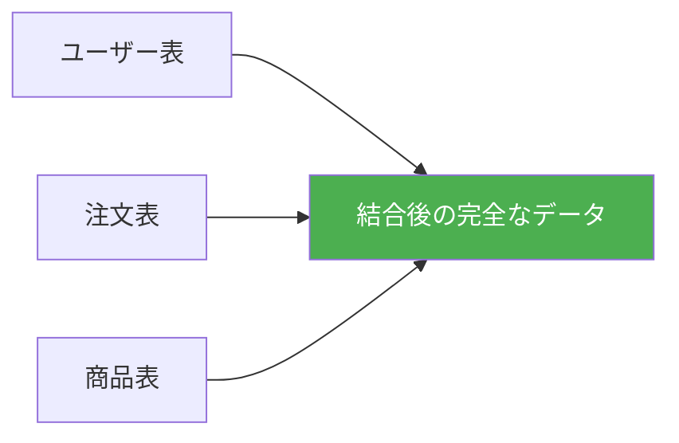
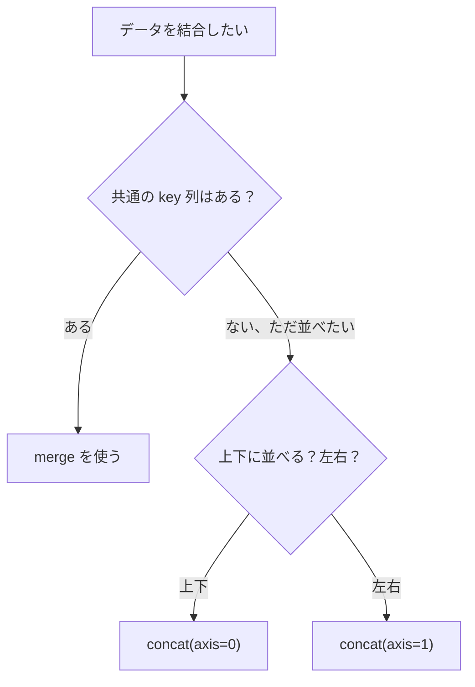

# データ結合

:::tip この節の位置づけ
多くの初心者がデータ結合を初めて学ぶとき、いちばん混乱しやすいのがここです。

- `merge`
- `concat`
- `join`

これらの名前は見たことがあっても、問題が出ると「まずどれを使えばいいのか」が分からなくなりがちです。

だからこの節でいちばん大事なのは、名前を丸暗記することではありません。まず次の判断基準を身につけることです。

> **今やっているのは「共通キーでそろえる」ことか、それとも「表を上下・左右にくっつける」ことか。**
:::

## 学習目標

- `merge`（SQL 風の結合）を身につける
- `join`（インデックスベースの結合）を理解する
- `concat`（連結操作）を身につける
- さまざまな結合方法の使い分けを理解する

---

## まずは全体像をつかもう

データ結合は、「共通キーがあるかどうか」で考えると分かりやすいです。


この節で本当に解決したいのは、次の2点です。

- どんなときに `merge` を最初に思い浮かべるべきか
- どんなときに単純な連結でよいのか

## なぜデータを結合するのか？

実際のデータは、たいてい複数の表に分かれています。たとえば EC サイトなら、次のような表があります。

- **ユーザー表**：ユーザーID、名前、登録時間
- **注文表**：注文ID、ユーザーID、商品、金額
- **商品表**：商品ID、名前、カテゴリ、価格

「各ユーザーが何を買ったか」を分析するには、これらの表を**結合**する必要があります。



### 初心者向けの分かりやすいたとえ

データ結合は、次のように考えると理解しやすいです。

- さまざまな表にある情報を、同じ人や同じ記録にひも付ける

つまり、

- `merge` は、身分証番号で2つの台帳をそろえるイメージ
- `concat` は、2つの表を上下または左右に並べてつなぐイメージ

この違いはとても大切です。なぜなら、ここで次の2つを分けて考えられるようになるからです。

- 「そろえる」
- 「つなぐ」

この2つは、実は同じではありません。

---

## merge：SQL 風の結合

`merge` は、最も強力な結合方法で、SQL の JOIN に似ています。

### 例データを準備する

```python
import pandas as pd

# ユーザー表
users = pd.DataFrame({
    "ユーザーID": [1, 2, 3, 4],
    "名前": ["張三", "李四", "王五", "趙六"],
    "都市": ["北京", "上海", "広州", "深圳"]
})

# 注文表
orders = pd.DataFrame({
    "注文ID": [101, 102, 103, 104, 105],
    "ユーザーID": [1, 2, 1, 3, 5],       # 注意：ユーザー5はユーザー表にいない
    "商品": ["スマホ", "パソコン", "イヤホン", "タブレット", "キーボード"],
    "金額": [5999, 8999, 299, 3999, 199]
})
```

### 内部結合（inner join）

両方にあるものだけを残します。

```python
result = pd.merge(users, orders, on="ユーザーID", how="inner")
print(result)
#    ユーザーID  名前  都市  注文ID  商品    金額
# 0      1  張三  北京    101  スマホ   5999
# 1      1  張三  北京    103  イヤホン    299
# 2      2  李四  上海    102  パソコン   8999
# 3      3  王五  広州    104  タブレット   3999
# ユーザー4（趙六）には注文がない → 表示されない
# ユーザー5 はユーザー表にない → 表示されない
```

### 左外部結合（left join）

左側の表の行をすべて残します。

```python
result = pd.merge(users, orders, on="ユーザーID", how="left")
print(result)
#    ユーザーID  名前  都市  注文ID   商品     金額
# 0      1  張三  北京  101.0  スマホ   5999.0
# 1      1  張三  北京  103.0  イヤホン    299.0
# 2      2  李四  上海  102.0  パソコン   8999.0
# 3      3  王五  広州  104.0  タブレット   3999.0
# 4      4  趙六  深圳    NaN   NaN      NaN   ← 趙六には注文がないので NaN になる
```

### 右外部結合（right join）

右側の表の行をすべて残します。

```python
result = pd.merge(users, orders, on="ユーザーID", how="right")
print(result)
# ユーザー5 が表示される（名前と都市は NaN）
```

### 完全外部結合（outer join）

両方の表の行をすべて残します。

```python
result = pd.merge(users, orders, on="ユーザーID", how="outer")
print(result)
# すべてのユーザーとすべての注文が表示され、足りない部分は NaN で埋められる
```

### 4種類の結合方法の比較

```
ユーザー表: {1,2,3,4}    注文表: {1,2,3,5}

inner:  {1,2,3}       両方にあるもの
left:   {1,2,3,4}     左表すべて + 右表で一致するもの
right:  {1,2,3,5}     右表すべて + 左表で一致するもの
outer:  {1,2,3,4,5}   すべて残す
```

### 初心者がまず覚えやすい早見表

| 目的 | まず思い浮かべる方法 |
|---|---|
| 両方に一致する行だけ残したい | `inner merge` |
| 左表を基準にして、右表の情報を補いたい | `left merge` |
| 両方を残して、足りない部分は NaN にしたい | `outer merge` |
| 複数の表を上下にくっつけたい | `concat(axis=0)` |
| 複数の列を左右に並べたい | `concat(axis=1)` |

この表は初心者にとても役立ちます。なぜなら、「結合方法がたくさんある」という状態を、よくある業務目的に整理し直してくれるからです。

### 列名が違う場合の結合

```python
# 2つの表で結合列の名前が違う場合
df1 = pd.DataFrame({"user_id": [1, 2], "name": ["A", "B"]})
df2 = pd.DataFrame({"uid": [1, 2], "score": [90, 85]})

result = pd.merge(df1, df2, left_on="user_id", right_on="uid")
print(result)
```

### 複数列での結合

```python
# 複数の列で一致させる
result = pd.merge(df1, df2, on=["col1", "col2"])
```

---

## concat：連結操作

`concat` は、複数の DataFrame を縦または横に連結するときに使います（共通キーは不要です）。

### 最初に `concat` で覚えるべきこと

まずいちばん大事なのはこれです。

> **`concat` は「キーをそろえる」のではなく、「表をつなぐ」操作です。**

なので、頭の中で考えていることが

- ユーザーID が一致するか

なら、まずは `merge` を考えるのが自然です。

### 縦方向の連結（上下に追加）

```python
# 1月と2月の売上データ
jan = pd.DataFrame({
    "商品": ["リンゴ", "牛乳"],
    "売上": [100, 80],
    "月": ["1月", "1月"]
})

feb = pd.DataFrame({
    "商品": ["リンゴ", "パン"],
    "売上": [120, 90],
    "月": ["2月", "2月"]
})

# 上下に連結
all_sales = pd.concat([jan, feb], ignore_index=True)
print(all_sales)
#    商品  売上  月
# 0  リンゴ  100  1月
# 1  牛乳   80  1月
# 2  リンゴ  120  2月
# 3  パン   90  2月
```

:::tip ignore_index=True
`ignore_index=True` にすると、0, 1, 2... のインデックスを作り直します。付けない場合、インデックスが重複することがあります。
:::

### 横方向の連結

```python
info = pd.DataFrame({"名前": ["張三", "李四"], "年齢": [22, 25]})
scores = pd.DataFrame({"数学": [90, 85], "英語": [88, 92]})

# 左右に連結
combined = pd.concat([info, scores], axis=1)
print(combined)
#    名前  年齢  数学  英語
# 0  張三   22   90   88
# 1  李四   25   85   92
```

---

## merge vs concat vs join

| 方法 | 適用場面 | たとえ |
|------|---------|------|
| `merge` | 共通列で2つの表を結合する | SQL JOIN |
| `concat` | 単純に上下または左右に連結する | のりで貼り合わせる |
| `join` | インデックスで結合する | 特別な `merge` |



## 初心者がそのまま使えるデータ結合チェックリスト

初めて複数表の問題に取り組むときは、次の順番で確認すると安全です。

1. 共通キーはあるか？
2. キーの型と値の範囲は一致しているか？
3. 結合後に行数が増えたり減ったりするのはなぜか？
4. 今やっているのは「そろえる」ことか、それとも「つなぐ」ことか？

この4つを先に考えるだけで、`merge` / `concat` の問題は、魔法のように見えなくなります。

---

## 実践：複数表の結合分析

```python
import pandas as pd
import numpy as np

# 3つの表を作成
np.random.seed(42)

# 学生表
students = pd.DataFrame({
    "学籍番号": [1, 2, 3, 4, 5],
    "名前": ["張三", "李四", "王五", "趙六", "銭七"],
    "クラス": ["A組", "B組", "A組", "B組", "A組"]
})

# 成績表（学生によっては複数科目の成績がある）
scores = pd.DataFrame({
    "学籍番号": [1, 1, 2, 2, 3, 3, 4, 4, 5, 5],
    "科目": ["数学", "英語", "数学", "英語", "数学", "英語", "数学", "英語", "数学", "英語"],
    "点数": [90, 85, 78, 92, 88, 75, 95, 88, 72, 80]
})

# クラス情報表
classes = pd.DataFrame({
    "クラス": ["A組", "B組"],
    "担任": ["王先生", "李先生"],
    "教室": ["101", "102"]
})

# 結合1：学生 + 成績
student_scores = pd.merge(students, scores, on="学籍番号")
print(student_scores.head())

# 結合2：さらにクラス情報を追加
full = pd.merge(student_scores, classes, on="クラス")
print(full.head())

# 分析：各クラスの平均点
print(full.groupby(["クラス", "担任"])["点数"].mean())

# 分析：各学生の合計点ランキング
total_scores = full.groupby(["学籍番号", "名前"])["点数"].sum().reset_index()
total_scores["順位"] = total_scores["点数"].rank(ascending=False, method="dense")
print(total_scores.sort_values("順位"))
```

---

## まとめ

| 操作 | 関数 | 重要な引数 |
|------|------|---------|
| SQL 風の結合 | `pd.merge()` | `on`, `how` (inner/left/right/outer) |
| 縦方向の連結 | `pd.concat(axis=0)` | `ignore_index=True` |
| 横方向の連結 | `pd.concat(axis=1)` | |
| インデックスでの結合 | `df.join()` | `how` |

## この節で必ず持ち帰りたいこと

- `merge` は共通キーでそろえる操作、`concat` は表をつなぐ操作
- 「共通キーがあるか？」を先に考えると、どの方法を使うか判断しやすい
- 複数表の分析では、後の集計ミスよりも、最初の結合ミスのほうがよく起こる

---

## 手を動かしてみよう

### 練習 1：基本的な merge

```python
# 2つの表がある：社員表と部署表
# 1. inner join で結合する
# 2. left join で部署が未割り当ての社員を見つける
# 3. outer join で社員がいない部署を見つける
```

### 練習 2：複数表の結合分析

```python
# 商品表、注文表、顧客表を作成する
# 1. 3つの表を結合して1つの完全な表にする
# 2. 各顧客がどのカテゴリの商品を買ったかを分析する
# 3. 購入金額が最も高い上位3人の顧客を見つける
```

### 練習 3：concat 連結

```python
# 四半期ごとの売上データ（4つの独立した DataFrame）がある
# 1. 縦方向に連結して年間データにする
# 2. "四半期" 列を追加してデータの出所を示す
# 3. 年間の各四半期の売上傾向を集計する
```
