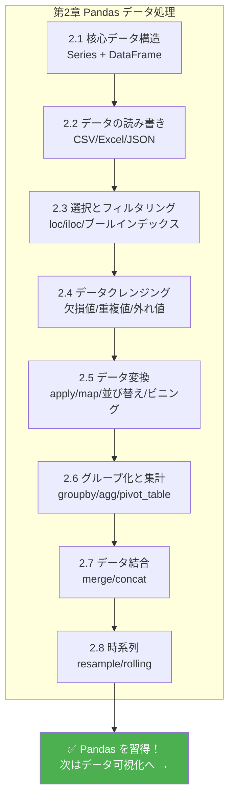

# 3.3.9 時系列

:::tip この節の位置づけ
多くの初心者が初めて時系列を学ぶとき、いちばんよくある理解は次のようなものです：

- データに日付の列が1つ増えただけ

でも、より安定した理解はこうです：

> **時間が入ると、多くの分析はもう単に「値がいくつか」を見るだけではなく、「時間とともにどう変化するか」を見るものになる。**

なので、この節でいちばん大事なのは `resample()` や `rolling()` を暗記することではなく、まず「時間が分析のしかたを変える」という感覚をつかむことです。
:::

## 学習目標

- 日付時刻型の作成と変換を身につける
- 時系列のインデックスとスライスを学ぶ
- リサンプリング（resample）と頻度変換を身につける
- ローリングウィンドウ計算（rolling）を学ぶ

---

## まずは全体の地図をつくろう

時系列は、「まず日付を操作可能なオブジェクトに変えてから、時間の軸で分析する」と考えると理解しやすいです：


この節で本当に解決したいのは、次の2つです。

- なぜ日付列は普通の文字列のままではだめなのか
- なぜ時間データをきちんと整理すると、その後の分析が大きく変わるのか

## なぜ時系列が必要なのか？

株価、売上データ、Webサイトのアクセス数、気象記録……
多くのデータは時間と関係しています。時間データを扱うことは、データ分析の必須スキルです。

### 初心者向けの、よりわかりやすい比喩

時系列は次のように考えるとよいです。

- データに、きちんと順番のある時間軸を追加したもの

この軸があると、ただ「今いくつか」を聞くだけでなく、次のような問いができるようになります。

- 先月より高いか、低いか
- 直近7日間で上昇しているか
- 昨年同月と今年同月でどれくらい差があるか

---

## 日付時刻型

### タイムスタンプを作る

```python
import pandas as pd
import numpy as np

# 単一のタイムスタンプを作成
ts = pd.Timestamp("2024-01-15")
print(ts)        # 2024-01-15 00:00:00
print(ts.year)   # 2024
print(ts.month)  # 1
print(ts.day)    # 15
print(ts.day_name())  # Monday

# ほかの書き方
ts2 = pd.Timestamp("2024-01-15 14:30:00")
ts3 = pd.Timestamp(year=2024, month=3, day=20)
```

### 文字列を日付に変換する

```python
# 1列を変換
dates = pd.Series(["2024-01-15", "2024-02-20", "2024-03-10"])
dt_series = pd.to_datetime(dates)
print(dt_series)
print(dt_series.dtype)  # datetime64[ns]

# いろいろな形式を処理する
pd.to_datetime("15/01/2024", format="%d/%m/%Y")
pd.to_datetime("2024年3月15日", format="%Y年%m月%d日")

# 解析できない値を処理する
dirty = pd.Series(["2024-01-15", "not a date", "2024-03-10"])
clean = pd.to_datetime(dirty, errors="coerce")  # 解析できない値は NaT になる
print(clean)
# 0   2024-01-15
# 1          NaT   ← Not a Time
# 2   2024-03-10
```

### 日付範囲

```python
# 日付範囲を作成
dates = pd.date_range("2024-01-01", periods=10, freq="D")  # 毎日
print(dates)

# さまざまな頻度
pd.date_range("2024-01-01", periods=12, freq="ME")   # 月末
pd.date_range("2024-01-01", periods=4, freq="QE")    # 四半期末
pd.date_range("2024-01-01", "2024-12-31", freq="W")  # 毎週

# よく使う頻度コード
# D=日, W=週, ME=月末, MS=月初, QE=四半期末, YE=年末
# h=時間, min=分, s=秒
# B=営業日
```

### はじめて日付列を扱うとき、まず何を覚えるべき？

最初に覚えるべきことは、これです。

> **日付列は、まず本物の datetime に変換してから、その後の時間分析を考える。**

文字列のままだと、
次のようなことが自然にはやりにくくなります。

- 月を取り出す
- 時間差を計算する
- リサンプリングする

---

## 時系列データ

### 時系列 DataFrame を作る

```python
# 2024年の日次売上データをシミュレーション
rng = np.random.default_rng(seed=42)
dates = pd.date_range("2024-01-01", periods=365, freq="D")
sales = pd.DataFrame({
    "日付": dates,
    "売上": rng.integers(5000, 20000, 365) + \
              np.sin(np.arange(365) * 2 * np.pi / 365) * 3000  # 季節性を追加
})
sales = sales.set_index("日付")
print(sales.head())
print(sales.shape)  # (365, 1)
```

### 日付の要素を取り出す

```python
df = pd.DataFrame({
    "日付": pd.date_range("2024-01-01", periods=100, freq="D"),
    "販売数": rng.integers(10, 100, 100)
})

# dt アクセサで日付の要素を取り出す
df["年"] = df["日付"].dt.year
df["月"] = df["日付"].dt.month
df["日"] = df["日付"].dt.day
df["曜日"] = df["日付"].dt.day_name()
df["週末かどうか"] = df["日付"].dt.dayofweek >= 5  # 5=土曜日, 6=日曜日
df["第何週"] = df["日付"].dt.isocalendar().week

print(df.head())
```

### 時間インデックスのスライス

日付がインデックスになっていると、文字列で簡単にスライスできます。

```python
# sales のインデックスは日付
# 2024年3月のデータを選ぶ
print(sales.loc["2024-03"])

# 2024年第1四半期を選ぶ
print(sales.loc["2024-01":"2024-03"])

# ある1日を選ぶ
print(sales.loc["2024-06-15"])
```

### 初学者が最初に覚えやすい、時間分析の順番

より安定した順番は、たいてい次の通りです。

1. まず datetime に変換する
2. まず年 / 月 / 曜日を取り出す
3. そのあと日付をインデックスにする
4. 最後にリサンプリングとローリングウィンドウを使う

この順番はとても大事です。というのも、多くの初心者は順番を飛ばして学んでしまい、最終的に時間インデックスと普通の列を混ぜてしまうからです。

---

## リサンプリング（resample）


リサンプリングは、時系列で最も重要な操作の1つです。データの**時間頻度**を変えます。

### ダウンサンプリング（高頻度 → 低頻度）

```python
# 日次データ → 月次データ
monthly = sales.resample("ME").sum()  # 月末で集計
print(monthly.head())

# 日次 → 週次
weekly = sales.resample("W").mean()  # 週平均

# 日次 → 四半期
quarterly = sales.resample("QE").agg({
    "売上": ["sum", "mean", "max"]
})
print(quarterly)
```

### アップサンプリング（低頻度 → 高頻度）

```python
# 月次データ → 日次データ（補完が必要）
daily = monthly.resample("D").ffill()     # 前方埋め
# または
daily = monthly.resample("D").interpolate()  # 補間
```

### 初学者が最初に覚えやすい判定表

| やりたいこと | まず考えること |
|---|---|
| 日次を月次にしたい | `resample()` でダウンサンプリング |
| 月次を日次にしたい | `resample()` でアップサンプリング |
| 直近7日平均を見たい | `rolling()` |
| 開始から現在までの平均を見たい | `expanding()` |

この表は初心者にとても役立ちます。時系列でよくある操作を、よくある問題の形に戻して整理できるからです。

---

## ローリングウィンドウ（rolling）

ローリングウィンドウは、連続するN個のデータ点に対して統計量を計算します。データの平滑化や移動平均によく使われます。

### 移動平均

```python
# 7日移動平均（日々のブレをなめらかにする）
sales["MA7"] = sales["売上"].rolling(window=7).mean()

# 30日移動平均（長期トレンドを見る）
sales["MA30"] = sales["売上"].rolling(window=30).mean()

print(sales.head(10))
# 最初の6日分の MA7 は NaN（7日分そろわないため）
```

### ほかのローリング統計

```python
# ローリング標準偏差（変動性）
sales["STD7"] = sales["売上"].rolling(7).std()

# ローリング最大値
sales["MAX7"] = sales["売上"].rolling(7).max()

# ローリング合計
sales["SUM7"] = sales["売上"].rolling(7).sum()
```

### expanding：累積計算

```python
# 累積平均（最初から現在までの平均）
sales["累積平均"] = sales["売上"].expanding().mean()

# 累積最大値
sales["過去最高"] = sales["売上"].expanding().max()
```

### なぜ `rolling` はこんなに使われるのか？

実際の時間データは、たいてい大きく上下します。
毎日の生データだけを見ていると、ブレに引っ張られやすいです。

`rolling` のいちばん大きな役割は、次のことです。

- ブレの中から傾向を見る

---

## 時間差の計算

```python
df = pd.DataFrame({
    "登録日時": pd.to_datetime(["2023-01-15", "2023-06-20", "2024-01-10"]),
    "最終ログイン": pd.to_datetime(["2024-06-01", "2024-05-15", "2024-06-10"])
})

# 時間差を計算
df["利用日数"] = (df["最終ログイン"] - df["登録日時"]).dt.days
print(df)

# 今日からの経過日数
df["登録から今日までの日数"] = (pd.Timestamp.now() - df["登録日時"]).dt.days
```

---

## 実践：売上トレンド分析

```python
import pandas as pd
import numpy as np

rng = np.random.default_rng(seed=42)

# 2年分の日次売上データを作成
dates = pd.date_range("2023-01-01", "2024-12-31", freq="D")
n = len(dates)

sales = pd.DataFrame({
    "日付": dates,
    "売上": (
        10000 +                                    # 基本値
        np.sin(np.arange(n) * 2 * np.pi / 365) * 3000 +  # 季節性
        np.arange(n) * 5 +                         # 成長トレンド
        rng.normal(0, 1000, n)                     # ランダムな変動
    ).astype(int)
}).set_index("日付")

# 1. 月次集計
monthly = sales.resample("ME").agg(
    月売上=("売上", "sum"),
    日平均売上=("売上", "mean"),
    最高日売上=("売上", "max")
)
print("=== 月次集計 ===")
print(monthly.head())

# 2. 移動平均でトレンドを見る
sales["MA30"] = sales["売上"].rolling(30).mean()
print("\n=== 30日移動平均（最後の5日）===")
print(sales[["売上", "MA30"]].tail())

# 3. 前年同月比（去年の同じ月と比べる）
monthly_pivot = sales.resample("ME")["売上"].sum()
monthly_pivot.index = monthly_pivot.index.to_period("M")
# 2024年の各月と2023年の同月を簡単に比較する
m2024 = monthly_pivot["2024"]
m2023 = monthly_pivot["2023"]

print("\n=== 2024年 vs 2023年 の月次比較 ===")
for m24, m23 in zip(m2024.items(), m2023.items()):
    month = m24[0].month
    growth = (m24[1] - m23[1]) / m23[1] * 100
    print(f"  {month}月: 2023={m23[1]:,.0f}, 2024={m24[1]:,.0f}, 成長率={growth:+.1f}%")

# 4. 曜日ごとの売上差
sales_with_dow = sales.copy()
sales_with_dow["曜日"] = sales_with_dow.index.day_name()
dow_avg = sales_with_dow.groupby("曜日")["売上"].mean()
print("\n=== 各曜日の平均売上 ===")
print(dow_avg.sort_values(ascending=False))
```

### この小さな実践で、いちばん先に学ぶべきことは？

先に覚えるべきなのは、特定の関数名ではありません。
時系列分析は、ふつう次の順番で進める、ということです。

1. まず集計する
2. 次にトレンドを見る
3. その次に前年同月比 / 前月比を見る
4. 最後に周期ごとの違いを見る

この流れは、最初から複雑な予測をするよりずっと安定しています。

---

## 残す証拠

このページを終えたら、この evidence card を残します。

```text
dataframe_state: columns, dtypes, row count, missing values, and sample rows
operation: read/write, select/filter, clean, transform, groupby, merge, or time-series step
output: resulting table, saved file, aggregation, join result, or time index view
failure_check: dtype mismatch, missing data, duplicated keys, chained assignment, or wrong time frequency
Expected_output: before/after table sample with the transformation reason
```

## まとめ

| 操作 | メソッド | 用途 |
|------|------|------|
| 文字列を日付に変換 | `pd.to_datetime()` | 型変換 |
| 日付範囲 | `pd.date_range()` | 連続した日付を作る |
| 要素を取り出す | `.dt.year/month/day` | 日付を分解する |
| リサンプリング | `.resample()` | 時間頻度を変える |
| ローリングウィンドウ | `.rolling()` | 移動平均、平滑化 |
| 累積計算 | `.expanding()` | 累積統計 |
| 時間差 | 引き算 `.dt.days` | 間隔を計算する |

## この節でいちばん持ち帰ってほしいこと

- 時系列は「日付が1列増える」だけではなく、分析のしかたそのものが変わる
- まず日付を datetime に変換してから、スライス、リサンプリング、ローリングウィンドウを考える
- `resample` は時間頻度を変えるためのもの、`rolling` は局所的なトレンドを見るためのもの

---

## 章のまとめ：Pandas の全体像

おめでとうございます！これで Pandas の内容をすべて終えました。ここまでを振り返ってみましょう。



> **✅ セルフチェック：** 売上データの CSV が1つあったら、Pandas を使って欠損値を処理し、月ごと・商品ごとに売上を集計し、さらに各月で売上が最も高い商品を見つけられますか？ 第1章のウォーミングアップ練習を思い出してみてください。今なら、もっと簡単に感じませんか？

---

## ハンズオン練習

### 練習 1：日付処理

```python
# "2024-01-01" から "2024-12-31" までの日付を含む DataFrame を作る
# 1. 月と曜日を取り出す
# 2. 営業日かどうかを判定する
# 3. 各月の営業日数を計算する
```

### 練習 2：時系列分析

```python
# 上の sales データを使う
# 1. 7日移動平均と30日移動平均を計算する
# 2. 売上が最も高い月と最も低い月を見つける
# 3. 各月の前月比成長率を計算する
# 4. 週末と平日の売上差を分析する
```

### 練習 3：総合実践

```python
# App のユーザーアクティブデータ（365日）をシミュレーションする
# 内容：日付、DAU（日次アクティブユーザー数）、新規ユーザー、収益
# 1. 週次アクティブユーザー数（WAU）と月次アクティブユーザー数（MAU）を計算する
# 2. 7日リテンション率の推移を計算する
# 3. rolling を使って ARPU（1ユーザーあたりの平均収益）の30日平均を計算する
# 4. ユーザー増加が最も速い月を見つける
```


<details>
<summary>参考解答と解説</summary>

- まず `pd.to_datetime` で日付文字列を日時型に変換し、その後で月、曜日、四半期、営業日フラグなどのカレンダー特徴を作ります。
- カレンダー集計には `resample`、移動窓には `rolling`、成長率には `pct_change` を使います。それぞれ答える質問が異なります。
- プロダクトやユーザー指標を時系列で見るときは、必ず時間粒度を書きます。同じ生イベントでも、日次、週次、月次では違う話になることがあります。

</details>
