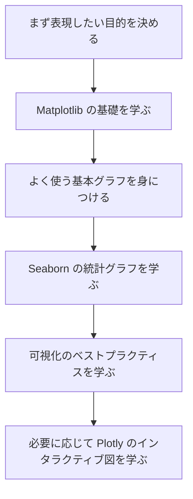
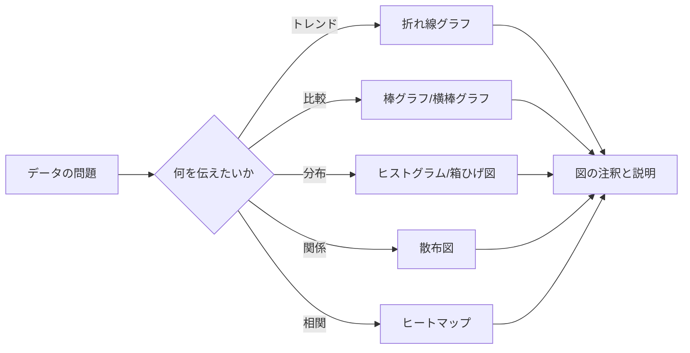

# 可視化ガイド：まずは図の選び方を学び、それから見た目を整える

この章で解決したいのは、データの中にあるトレンド、比較、分布、関係を、見た人がひと目で理解できる図表で表す方法です。

可視化を初めて学ぶ人は、API に圧倒されがちです。`plot()` はどう書くのか、パラメータはどう調整するのか、色はどう変えるのか。ですが、可視化で最も大事な最初の一歩は、関数を暗記することではありません。まずは「いま読者にひと目で何を見せたいのか」をはっきりさせることです。

## この章がコース全体の中でどこにあるか

すでに Pandas を学び、データの読み込み、クレンジング、抽出、集計のやり方は分かっているはずです。可視化は、そうして整理したデータを図として表現し、自分がデータを素早く探索できるようにし、さらに他の人にも結論を素早く理解してもらうためのものです。

この後の機械学習やプロジェクトの段階でも、可視化は EDA、特徴量分布の分析、モデル結果の表示、エラー分析、プロジェクト発表に使います。つまりこの章は「図をきれいにする」ためのおまけではなく、データ分析の表現力の中核です。

## この章で本当に解決したいこと

この章では、次の5つの問いに答えます。いつ折れ線グラフ、棒グラフ、散布図、ヒストグラム、箱ひげ図、ヒートマップを使うべきか。Matplotlib、Seaborn、Plotly はそれぞれどんな場面に向いているか。探索用の図と報告用の図は何が違うのか。タイトル、軸、凡例、色をどう使えば図が分かりやすくなるのか。どうすれば図表で読者を誤解させずに済むのか。

初心者がいちばんやりがちな失敗は、図の目的を決めないままコードを書き始めることです。ツールは大事ですが、ツールは表現のためにあります。まず「トレンドを見せたいのか」「比較したいのか」「分布を見せたいのか」「関係を見せたいのか」「割合を見せたいのか」を判断してから、図の種類を決めましょう。

## 初心者におすすめの学習順序

まずは Matplotlib を学ぶのがおすすめです。Figure、Axes、軸、基本的な描画オブジェクトの考え方を理解できます。次に Seaborn を学び、少ないコードでよく使う統計グラフと探索的分析をできるようにします。その後、可視化のベストプラクティスを学び、図の選び方、タイトル、色、注釈、誤解の避け方を理解します。最後に必要に応じて Plotly を学び、インタラクティブな図、Web 表示、動的な探索が必要なときに使いましょう。

## この章を学ぶときに押さえる主線

この章の流れは、ひとことで言うと「まず何を伝えるかを決め、それからどの図を使うかを決め、最後に見た目を整える」です。

この流れが分かると、「図をきれいに見せること」が目的ではなく、「他の人がデータをすばやく理解できること」が目的だと分かります。

## この章の4つのレッスンで何をするか

| 章 | 一番助けたい問題 |
|---|---|
| [4.1 Matplotlib 基礎](./01-matplotlib.md) | まず基本的な描画操作と Figure/Axes モデルを身につける |
| [4.2 Seaborn の統計可視化](./02-seaborn.md) | 少ないコードで探索的分析と統計グラフをすばやく作る |
| [4.3 インタラクティブ可視化（選択）](./03-plotly.md) | インタラクション、発表、Web 図表が必要なときのやり方を知る |
| [4.4 可視化のベストプラクティス](./04-best-practices.md) | 図の選び方、配色、誤解の防ぎ方を学び、図を本当に「見やすく」する |

## この章と次の段階との関係

可視化は、これから学ぶ機械学習、深層学習、大規模言語モデルアプリのプロジェクト全体で使います。機械学習では、データ分布、特徴量の関係、モデル誤差、評価結果を見るために図が必要です。深層学習では、学習曲線や予測例を見せる必要があります。Agent や RAG のプロジェクトでも、評価データ、呼び出しコスト、失敗パターンを図で示せます。

この章が不安定なままだと、後でよくある問題が起きます。データ分析レポートに表しかなく結論がない。機械学習プロジェクトでスコアだけを出して説明がない。学習過程の曲線がない。プロジェクト発表で、見た人がすぐ理解できる図が足りない。こうした問題です。

## 初心者と上級学習者ではどう読み方を変えるか

初めてこの章を学ぶ人は、まず主線と最小実行例に集中してください。細かい部分を一度に全部理解する必要はありません。この章が何を解決するのか、入力と出力は何か、最小プロジェクトをどう動かすのかが説明できれば、先に進んで大丈夫です。

経験のある学習者は、この章を理解の穴埋めと実践練習の材料として使えます。境界条件、失敗例、評価方法、コードの再現性、前後の章とのつながりに注目しましょう。読み終えたら、この章の内容を自分の作品の README や実験記録にまとめるのがおすすめです。

## 学習時間と難易度の目安

| 学び方 | 目安時間 | 目標 |
|---|---|---|
| ざっと読む | 20～30 分 | この章が何を解決するのかを理解し、後でどこで使うかを知る |
| 最低限クリア | 1～2 時間 | 最小例を動かし、この章の小プロジェクトの出口までたどり着く |
| じっくり練習 | 半日～1日 | エラー分析、比較実験、プロジェクト README の記録まで補う |

## この章の自己チェック問題

| 自己チェック問題 | 合格基準 |
|---|---|
| この章は何を解決する？ | コース全体の中での位置を 1 文で説明できる |
| 最小の入力と出力は何？ | 例に何が必要で、どんな結果が出るかを説明できる |
| よくある失敗点はどこ？ | エラー、見た目の悪さ、理解のずれの原因を少なくとも 1 つ挙げられる |
| 学んだ後に何を残せる？ | この章の成果を README、実験記録、ポートフォリオに書ける |

## この章の小プロジェクトの出口

この章を終えたら、「売上データの可視化レポート」を作るのがおすすめです。Pandas で整理した売上データを使って、月ごとのトレンド、カテゴリ比較、注文金額の分布、価格と売上数の関係、地域ヒートマップ、またはピボットテーブルをそれぞれ作り、各図に 1 文の結論を書きましょう。

大事なのは図の数ではありません。各図が、はっきりした 1 つの問いに答えられることです。

## 合格ライン

この章の終わりには、トレンド、比較、分布、関係、相関に応じて適切な図を選べるようになっているはずです。Matplotlib と Seaborn で基本的な図を描けること、Plotly がどんな場面に向いているか説明できること、タイトル、軸、凡例、色で図を分かりやすくできることが目標です。

もしデータを 4～6 枚の、結論のある図にまとめられ、それぞれの図をなぜそのように選んだのか説明できるなら、データ可視化の入門基準は達成です。

## ここまで学んだら、次はどう読むとよいか

まず Matplotlib 基礎を読み、その次に Seaborn の統計可視化を読み、続けて可視化のベストプラクティスを学び、最後に必要に応じて Plotly のインタラクティブ可視化を読みましょう。
