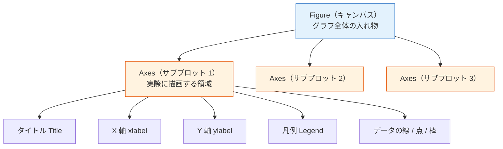
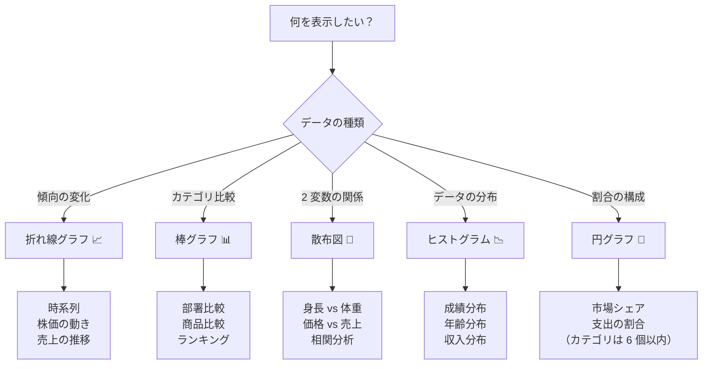

# 3.4.2 Matplotlib 基礎


:::tip この節の位置づけ
多くの初心者が最初に `Matplotlib` を学ぶとき、つまずきやすいのは次の点です。

- パラメータが多い
- コードが長い
- グラフは描けたけれど、自分がなぜこの図を描いたのか分からない

なので、この節でいちばん大事なのは、先に API を暗記することではなく、まず一番安定した作業の流れを作ることです。

> **何を伝えたいかを先に考え、それからどんな図を描くかを決め、最後にコードを書く。**
:::

## 学習目標

- Figure と Axes のオブジェクトモデルを理解する
- 5 種類の基本グラフの描き方を身につける
- グラフ要素（タイトル、凡例、グリッドなど）をカスタマイズできるようになる
- サブプロットのレイアウトを理解する

---

## まずは地図を作ろう

初めて `Matplotlib` を学ぶとき、いちばん安定した順番は「すべての関数を先に覚える」ことではなく、まず 1 枚の図がどうやって出来上がるのかを見通すことです。


この節で本当に解決したいのは、次の 2 つです。

- いちばん基本の描画操作は何か
- なぜ `Figure / Axes` モデルが、これから出てくるすべての図の土台になるのか

---

## なぜ可視化を学ぶのか？

> 「1 枚の図は千の言葉に勝る。」

同じデータでも、

- 表で見せると：`平均給与: 技術部 18667, 営業部 19000, 管理部 32500`
- グラフで見せると：管理部の給与が他の部署よりかなり高いことが、一目で分かる

データ可視化の目的は、**データに語らせること**です。
数秒で、その背景にある規則やストーリーを理解できるようにします。

### 初心者向けの分かりやすい比喩

`Matplotlib` は次のように考えると分かりやすいです。

- いちばん基本的な描画ツールボックス

`Seaborn` のように、あらかじめ多くのデフォルトスタイルが整っているわけではありません。
でも、その分メリットがあります。

- グラフがどうやって少しずつ組み立てられるのかを、ちゃんと見られる

なので `Matplotlib` を学ぶ価値は、ただグラフを描けるようになることだけではありません。
次の感覚を身につけることにもあります。

- グラフは、データ・キャンバス・座標軸からどう作られているのか

---

## インストールとインポート

```python
# インストール（通常はすでに入っています）
# python -m pip install --upgrade matplotlib

import matplotlib.pyplot as plt
import numpy as np

# Jupyter Notebook でグラフを表示する
# %matplotlib inline
```

:::tip インポートの定番
`import matplotlib.pyplot as plt` は定番の書き方で、データサイエンスの世界では広く使われています。
:::

---

## 最初の 1 枚：5 行のコード

```python
import matplotlib.pyplot as plt

x = [1, 2, 3, 4, 5]
y = [2, 4, 6, 8, 10]

plt.plot(x, y)        # 折れ線グラフを描く
plt.title("最初のグラフ")  # タイトル
plt.show()             # グラフを表示する
```

これだけです！ 左下から右上に伸びる直線が表示されます。

### 初めて描くときに、まず覚えたい順番

初めて何かのグラフを描くときは、次の順番がいちばん安定しています。

1. まず `x` と `y` を準備する
2. まずは最小限の形で描く
3. そのあとでタイトルとラベルを入れる
4. 最後に凡例、色、見た目の調整をする

最初から配色やスタイルを細かく考えるより、この順番のほうがずっと進めやすいです。

---

## 重要な概念：Figure と Axes

Matplotlib のグラフは、次の 2 つの重要なオブジェクトでできています。



- **Figure**：グラフ全体のキャンバス。複数のサブプロットを含められる
- **Axes**：1 つの具体的なグラフ領域（注意：ここでの "Axes" は「軸」ではなく「サブプロット」に近い意味です）

### 2 つの描画スタイル

```python
# スタイル 1：plt を使った簡単な描画（シンプルな場面向け）
plt.plot([1, 2, 3], [4, 5, 6])
plt.title("簡単な描画")
plt.show()

# スタイル 2：オブジェクト指向スタイル（おすすめ、より柔軟）
fig, ax = plt.subplots()         # キャンバスとサブプロットを作成
ax.plot([1, 2, 3], [4, 5, 6])   # サブプロット上に描画
ax.set_title("オブジェクト指向の描画")      # タイトルを設定
plt.show()
```

:::tip オブジェクト指向スタイルをおすすめ
`plt.plot()` のほうが簡単に見えますが、複数のサブプロットを扱うときや、細かく制御したいときは、オブジェクト指向スタイル（`fig, ax = plt.subplots()`）のほうが便利です。最初からこの習慣をつけるのがおすすめです。
:::

---

## 5 種類の基本グラフ

### まず関数名を暗記するより、「何を伝えるのに向いているか」を覚えよう

| グラフ | まず覚えるべき用途 |
|------|----------------|
| 折れ線グラフ | 傾向を見る |
| 棒グラフ | カテゴリを比較する |
| 散布図 | 関係を見る |
| ヒストグラム | 分布を見る |
| 円グラフ | 割合を見る（ただしカテゴリは少なめ） |

この表は初心者にとても大事です。
「関数名」を、もう一度「何を表現したいか」に戻してくれます。

### 折れ線グラフ（Line Plot）

**適した場面：** 時間や連続変数に沿った変化の傾向を示すとき

```python
import matplotlib.pyplot as plt
import numpy as np

# 12 か月の売上データを作る
months = np.arange(1, 13)
sales_2023 = [120, 135, 150, 180, 200, 210, 195, 188, 220, 250, 280, 310]
sales_2024 = [140, 155, 170, 195, 230, 245, 225, 210, 260, 290, 320, 350]

fig, ax = plt.subplots(figsize=(10, 6))  # キャンバスサイズを設定

ax.plot(months, sales_2023, marker="o", label="2023年", color="#2196F3", linewidth=2)
ax.plot(months, sales_2024, marker="s", label="2024年", color="#FF5722", linewidth=2)

ax.set_title("月ごとの売上推移", fontsize=16, fontweight="bold")
ax.set_xlabel("月", fontsize=12)
ax.set_ylabel("売上（万元）", fontsize=12)
ax.set_xticks(months)
ax.set_xticklabels([f"{m}月" for m in months])
ax.legend(fontsize=12)     # 凡例を表示
ax.grid(True, alpha=0.3)   # グリッド線を表示

plt.tight_layout()  # 余白を自動調整
plt.show()
```

**重要なパラメータ：**

| パラメータ | 役割 | 例 |
|------|------|------|
| `marker` | データ点の印 | `"o"` 丸, `"s"` 四角, `"^"` 三角 |
| `linestyle` | 線の種類 | `"-"` 実線, `"--"` 破線, `":"` 点線 |
| `linewidth` | 線の太さ | `2` |
| `color` | 色 | `"red"`, `"#FF5722"`, `"C0"` |
| `label` | 凡例のラベル | `"2023年"` |
| `alpha` | 透明度 | `0.7`（0 は完全透明、1 は不透明） |

### 棒グラフ（Bar Chart）

**適した場面：** いくつかのカテゴリの大きさを比較するとき

```python
# 各部署の給与比較
departments = ["技術部", "営業部", "管理部", "財務部", "人事部"]
avg_salary = [18500, 16200, 28000, 15800, 14500]

fig, ax = plt.subplots(figsize=(8, 5))

bars = ax.bar(departments, avg_salary, color=["#4CAF50", "#2196F3", "#FF9800", "#9C27B0", "#607D8B"])

# 棒の上に数値を表示する
for bar, val in zip(bars, avg_salary):
    ax.text(bar.get_x() + bar.get_width()/2, bar.get_height() + 300,
            f"¥{val:,}", ha="center", fontsize=10)

ax.set_title("各部署の平均給与", fontsize=14)
ax.set_ylabel("給与（円）")
ax.set_ylim(0, max(avg_salary) * 1.15)  # Y 軸に数値ラベルの余白を確保

plt.tight_layout()
plt.show()
```

**横棒グラフ**（ラベルが長いときに見やすい）：

```python
fig, ax = plt.subplots(figsize=(8, 5))
ax.barh(departments, avg_salary, color="#4CAF50")
ax.set_xlabel("給与（円）")
ax.set_title("各部署の平均給与")
plt.tight_layout()
plt.show()
```

**グループ棒グラフ：**

```python
# 2 年比較
x = np.arange(len(departments))
width = 0.35

fig, ax = plt.subplots(figsize=(10, 5))
ax.bar(x - width/2, [17000, 15000, 26000, 14500, 13000], width, label="2023", color="#64B5F6")
ax.bar(x + width/2, avg_salary, width, label="2024", color="#1565C0")

ax.set_xticks(x)
ax.set_xticklabels(departments)
ax.legend()
ax.set_title("各部署の給与比較（2023 vs 2024）")
plt.tight_layout()
plt.show()
```

### 散布図（Scatter Plot）

**適した場面：** 2 つの変数の関係を観察するとき

```python
rng = np.random.default_rng(seed=42)

# 身長と体重のデータをシミュレーション
height = rng.normal(170, 8, 100)
weight = height * 0.65 - 40 + rng.normal(0, 5, 100)

fig, ax = plt.subplots(figsize=(8, 6))

scatter = ax.scatter(height, weight, c=weight, cmap="RdYlGn_r",
                     s=50, alpha=0.7, edgecolors="white", linewidth=0.5)

ax.set_title("身長と体重の関係", fontsize=14)
ax.set_xlabel("身長（cm）")
ax.set_ylabel("体重（kg）")

plt.colorbar(scatter, label="体重")  # カラーバー
plt.tight_layout()
plt.show()
```

**重要なパラメータ：**

| パラメータ | 役割 | 例 |
|------|------|------|
| `s` | 点の大きさ | `50`、または配列を渡して大きさを変える |
| `c` | 点の色 | `"red"`、または配列を渡して色を割り当てる |
| `cmap` | カラーマップ | `"viridis"`, `"RdYlGn"`, `"Blues"` |
| `alpha` | 透明度 | `0.7` |

### ヒストグラム（Histogram）

**適した場面：** データの分布を確認するとき

```python
rng = np.random.default_rng(seed=42)
scores = rng.normal(75, 12, 500)  # 500 人の学生の成績

fig, ax = plt.subplots(figsize=(8, 5))

# ヒストグラムを描画
n, bins, patches = ax.hist(scores, bins=20, color="#42A5F5", edgecolor="white",
                            alpha=0.8)

# 平均線を追加
mean_val = scores.mean()
ax.axvline(mean_val, color="red", linestyle="--", linewidth=2, label=f"平均: {mean_val:.1f}")

ax.set_title("学生の成績分布", fontsize=14)
ax.set_xlabel("点数")
ax.set_ylabel("人数")
ax.legend()

plt.tight_layout()
plt.show()
```

### 円グラフ（Pie Chart）

**適した場面：** 全体に対する各部分の割合を示すとき（カテゴリは 5〜6 個以内）

```python
labels = ["Python", "JavaScript", "Java", "C++", "その他"]
sizes = [35, 25, 20, 10, 10]
colors = ["#4CAF50", "#FFC107", "#2196F3", "#FF5722", "#9E9E9E"]
explode = (0.05, 0, 0, 0, 0)  # Python を強調

fig, ax = plt.subplots(figsize=(7, 7))

ax.pie(sizes, explode=explode, labels=labels, colors=colors,
       autopct="%1.1f%%", startangle=90, shadow=False,
       textprops={"fontsize": 12})

ax.set_title("AI 分野におけるプログラミング言語の使用割合", fontsize=14)

plt.tight_layout()
plt.show()
```

:::caution 円グラフは慎重に使おう
円グラフは、カテゴリが多いとき（6 個を超えるとき）や、割合が近いときに**差がとても見えにくくなります**。多くの場合、棒グラフのほうが見やすいです。「全体に対する部分」を強調したいときだけ円グラフを使いましょう。
:::

---

## グラフの選び方ガイド



---

## グラフのカスタマイズ

### 初学者がまず覚えるとよい最小チェックリスト

見た目を整える前に、まず次の 4 つを確認しましょう。

1. タイトルは、この図が何を表しているかを伝えているか？
2. X 軸と Y 軸にラベルと単位はあるか？
3. 凡例は本当に必要か？
4. 色は理解を助けているか、それとも邪魔しているか？

この 4 つができていれば、多くの場合、すでに「動くけれど見づらい図」よりずっと分かりやすくなっています。

### 日本語表示

Matplotlib はデフォルトでは日本語表示に対応していないため、設定が必要です。

```python
import matplotlib.pyplot as plt

# 方法 1：グローバル設定（おすすめ）
plt.rcParams["font.sans-serif"] = ["SimHei", "Arial Unicode MS", "DejaVu Sans"]
plt.rcParams["axes.unicode_minus"] = False  # マイナス記号の表示問題を解決

# macOS の場合
# plt.rcParams["font.sans-serif"] = ["Arial Unicode MS"]

# Linux の場合
# plt.rcParams["font.sans-serif"] = ["WenQuanYi Micro Hei"]
```

:::tip いちど設定すればずっと楽
この 2 行を、すべての描画コードの先頭に入れておけば、毎回設定する必要がありません。Jupyter では最初の Cell に置けば OK です。
:::

### タイトルとラベル

```python
fig, ax = plt.subplots()
ax.plot([1, 2, 3], [4, 5, 6])

ax.set_title("メインタイトル", fontsize=16, fontweight="bold", color="#333")
ax.set_xlabel("X 軸ラベル", fontsize=12)
ax.set_ylabel("Y 軸ラベル", fontsize=12)
```

### 凡例

```python
ax.plot(x, y1, label="データ A")
ax.plot(x, y2, label="データ B")
ax.legend(loc="upper left", fontsize=10, frameon=True, shadow=True)

# loc のよく使う値：
# "best" (自動), "upper left", "upper right", "lower left", "lower right", "center"
```

### グリッドとスタイル

```python
ax.grid(True, alpha=0.3, linestyle="--")  # 半透明の破線グリッド

# 事前定義スタイルを使う（グローバル設定）
plt.style.use("seaborn-v0_8-whitegrid")  # すっきりした白背景グリッド
# 他にも見やすいスタイル：
# "ggplot", "seaborn-v0_8", "fivethirtyeight", "bmh"
```

使用できるすべてのスタイルを確認するには：

```python
print(plt.style.available)
```

### 注釈とラベル付け

```python
fig, ax = plt.subplots(figsize=(8, 5))
x = np.arange(1, 13)
y = [120, 135, 150, 180, 200, 210, 195, 188, 220, 250, 280, 310]
ax.plot(x, y, marker="o")

# 最大値に注釈を付ける
max_idx = np.argmax(y)
ax.annotate(f"最高点: {y[max_idx]}",
            xy=(x[max_idx], y[max_idx]),       # 矢印の指す先
            xytext=(x[max_idx]-2, y[max_idx]+20),  # 文字の位置
            arrowprops=dict(arrowstyle="->", color="red"),
            fontsize=12, color="red")

plt.show()
```

---

## サブプロットのレイアウト

### subplots：複数のサブプロットを作る

```python
# 2 行 2 列 = 4 つのサブプロット
fig, axes = plt.subplots(2, 2, figsize=(12, 8))

# axes は 2×2 の配列
axes[0, 0].plot([1, 2, 3], [1, 4, 9])
axes[0, 0].set_title("折れ線グラフ")

axes[0, 1].bar(["A", "B", "C"], [3, 7, 5])
axes[0, 1].set_title("棒グラフ")

rng = np.random.default_rng(seed=42)
axes[1, 0].scatter(rng.random(50), rng.random(50))
axes[1, 0].set_title("散布図")

axes[1, 1].hist(rng.standard_normal(200), bins=15)
axes[1, 1].set_title("ヒストグラム")

fig.suptitle("4 種類の基本グラフ", fontsize=16, fontweight="bold")
plt.tight_layout()
plt.show()
```

### 不均等なサブプロット

```python
fig = plt.figure(figsize=(12, 5))

# 左側は幅の 2/3
ax1 = fig.add_axes([0.05, 0.1, 0.6, 0.8])   # [left, bottom, width, height]
ax1.plot([1, 2, 3, 4], [10, 20, 25, 30])
ax1.set_title("メイン図")

# 右側は幅の 1/3
ax2 = fig.add_axes([0.72, 0.1, 0.25, 0.8])
ax2.bar(["A", "B"], [15, 25])
ax2.set_title("補助図")

plt.show()
```

---

## グラフを保存する

```python
fig, ax = plt.subplots()
ax.plot([1, 2, 3], [4, 5, 6])
ax.set_title("保存の例")

# PNG として保存（最もよく使う）
fig.savefig("my_chart.png", dpi=150, bbox_inches="tight")

# SVG として保存（ベクター画像、拡大してもぼやけない）
fig.savefig("my_chart.svg", bbox_inches="tight")

# PDF として保存
fig.savefig("my_chart.pdf", bbox_inches="tight")
```

| パラメータ | 役割 | 推奨値 |
|------|------|--------|
| `dpi` | 解像度 | 150（通常）, 300（印刷） |
| `bbox_inches` | 余白の切り取り | `"tight"` 自動で切り取る |
| `transparent` | 背景を透明にする | `True`（PPT 向け） |

---

## 残す証拠

このページを終えたら、この evidence card を残します。

```text
question: what comparison, distribution, trend, or relationship the chart answers
chart_choice: line, bar, scatter, histogram, box, heatmap, or interactive dashboard
artifact: saved chart image/html plus the data slice used
failure_check: misleading scale, overloaded chart, wrong aggregation, or missing labels
Expected_output: chart artifact with one sentence explaining the insight
```

## まとめ

| グラフ | 関数 | 適した場面 |
|------|------|---------|
| 折れ線グラフ | `ax.plot()` | 傾向、時系列 |
| 棒グラフ | `ax.bar()` / `ax.barh()` | カテゴリ比較 |
| 散布図 | `ax.scatter()` | 2 変数の関係 |
| ヒストグラム | `ax.hist()` | データ分布 |
| 円グラフ | `ax.pie()` | 割合（慎重に使う） |

基本のワークフロー：

```python
fig, ax = plt.subplots(figsize=(8, 5))   # 1. キャンバスを作る
ax.plot(x, y)                             # 2. データを描画する
ax.set_title("タイトル")                       # 3. タイトル / ラベルを設定する
ax.legend()                               # 4. 凡例を追加する
plt.tight_layout()                        # 5. レイアウトを整える
plt.show()                                # 6. 表示する
```

## この節でいちばん持ち帰ってほしいこと

- `Matplotlib` の大事な点は、関数の多さではなく、グラフがどう組み上がるかを理解できること
- 何を伝えたいかを先に考え、それから図を選び、最後にコードを書くと、API を暗記するよりずっと安定する
- `Figure / Axes` は、その後のほぼすべての Python 可視化ライブラリで必要になる、土台の感覚です

---

## 実践練習

### 練習 1：折れ線グラフ

```python
# sin(x) と cos(x) の曲線を描く
# x は 0 から 2π まで、100 点取る
# 条件：色と線の種類を変える、凡例を付ける、グリッドを付ける、タイトルを付ける
```

### 練習 2：棒グラフ

```python
# 6 つの都市の住宅価格データと 1 人当たり収入データがある
# グループ棒グラフを描いて比較する
# 条件：棒の上に数値を表示する
```

### 練習 3：総合サブプロット

```python
# 1000 個の正規分布の乱数を生成する
# 2×2 のサブプロットでそれぞれ次を表示する：
# 1. 折れ線グラフ（最初の 100 個のデータの推移）
# 2. ヒストグラム（分布）
# 3. 散布図（隣り合う 2 つのデータ点の関係）
# 4. 棒グラフ（区間ごとの出現回数）
```


<details>
<summary>参考解答と解説</summary>

- 正弦と余弦のグラフには、ラベル付きの 2 本の線、タイトル、軸ラベル、凡例、薄いグリッドを入れます。比較しにくい場合は、装飾より先に色と線種を調整します。
- グループ棒グラフでは x 位置を明示的に計算し、読者がコードを見なくても理解できるように棒や軸をラベル付けします。
- 複数グラフでは `fig, ax = plt.subplots()` を使い、`fig.savefig(...)` で保存します。保存画像は証拠の一部であり、後回しのおまけではありません。

</details>
