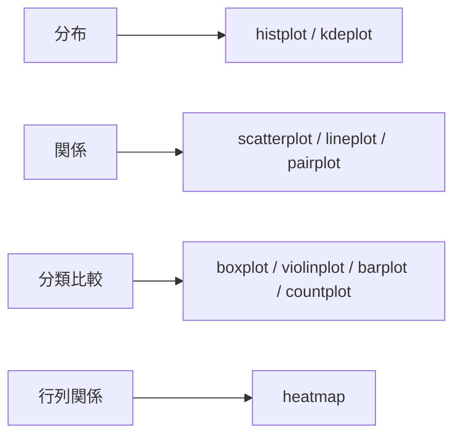
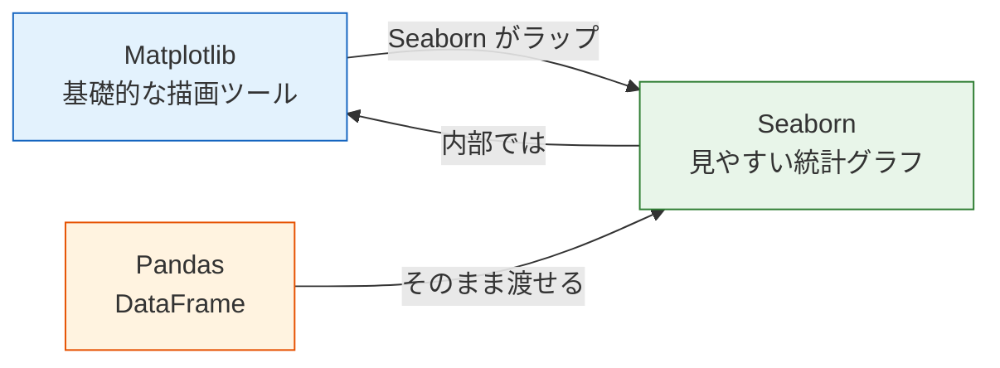
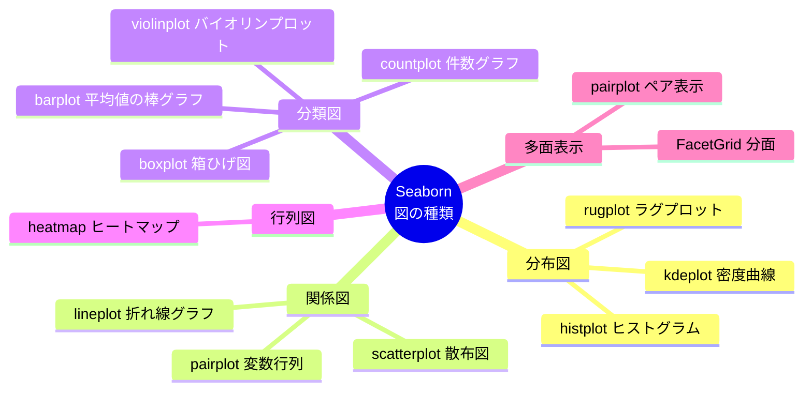

# 3.4.3 Seaborn 統計可視化


:::tip この節の位置づけ
多くの初心者が `Matplotlib` と `Seaborn` で最も混同しやすいのは、次の点です。

- この2つのライブラリは、それぞれ何を担当しているのか

いちばん安定した理解のしかたは、次のとおりです。

- `Matplotlib` は、基礎的な描画ツールキットに近い
- `Seaborn` は、デフォルトの見た目や統計グラフのテンプレートをあらかじめ整えてくれる高機能ツールに近い

なので、この節で一番大事なのは、新しいライブラリをもう1つ覚えることではなく、次を身につけることです。

> **探索的分析のグラフを、どうすればより速く、わかりやすく描けるか。**
:::

## 学習目標

- Seaborn と Matplotlib の関係を理解する
- 分布図、関係図、分類図を使いこなす
- ヒートマップと相関行列を描けるようになる
- FacetGrid を使って分面グラフを作る

---

## まず全体像をつかもう

初心者にとって `Seaborn` を理解する順番は、「関数一覧」を見ることではなく、まず得意な4種類の問題をはっきりさせることです。



つまり、この節で本当に解決したいのは次の点です。

- EDA をするとき、どのグラフを最初に使うとよいか
- なぜ `Seaborn` は、純粋な `Matplotlib` より素早い探索に向いているのか

---

## Seaborn とは？

Matplotlib を**筆と絵の具**だとすると、Seaborn は**筆セット + カラーパレット + テンプレート**のようなものです。



| 比較 | Matplotlib | Seaborn |
|------|-----------|---------|
| 位置づけ | 低レベルの描画ライブラリ | 高レベルの統計可視化ライブラリ |
| コード量 | 多い。手動設定が必要 | 少ない。すぐ使える |
| デフォルトの見た目 | ふつう | とても見やすい |
| データ形式 | 配列、リスト | DataFrame をそのまま使える |
| 統計機能 | 自分で計算する必要あり | 平均、信頼区間などを自動計算 |
| カスタマイズ性 | 非常に高い | 中程度（Matplotlib で補える） |

**ひとことで言うと：** Seaborn は、Matplotlib で 10 行かかるような見やすい統計グラフを、1 行で描けるようにしてくれます。

### 初心者向けのわかりやすいたとえ

`Seaborn` は、次のように考えると理解しやすいです。

- すでにお皿が並んでいるデータ可視化ツール

`Matplotlib` は、自分で鍋や食器を全部そろえるイメージ、  
`Seaborn` は、食器や基本の見た目が最初から整っているイメージです。  
その分、次のことに集中しやすくなります。

- このグラフで、どんな統計的な特徴を見たいのか

---

## インストールと import

```python
# インストール
# python -m pip install --upgrade seaborn

import seaborn as sns
import matplotlib.pyplot as plt
import pandas as pd
import numpy as np

# Seaborn に付属するサンプルデータセット
tips = sns.load_dataset("tips")      # レストランのチップデータ
iris = sns.load_dataset("iris")      # アヤメのデータ
titanic = sns.load_dataset("titanic")  # タイタニック号のデータ

# 全体のスタイルを設定
sns.set_theme(style="whitegrid")     # 白背景 + グリッドで、すっきり見やすい
```

### よく使うスタイル一覧

| スタイル | 説明 | 向いている場面 |
|------|------|----------|
| `"whitegrid"` | 白背景 + グリッド | 数値比較（おすすめのデフォルト） |
| `"darkgrid"` | グレー背景 + グリッド | データ点を強調したいとき |
| `"white"` | まっ白な背景 | 論文、レポート |
| `"dark"` | グレー背景 | アート寄りの表現 |
| `"ticks"` | 白背景 + 目盛線 | シンプルで専門的な見た目 |

---

## 分布図：データはどんな形？

分布図は、次のような疑問に答えてくれます。  
**このデータはどこに集中している？ 分散はどれくらい？ 偏りはある？**

### まず EDA で見るときの、安定した順番

一般的には、次の順番が見やすいです。

1. まず分布図を見る  
   データがどこに集まっているか、偏りがあるかを確認する。
2. 次に関係図を見る  
   変数同士に関係があるかを見る。
3. 次に分類図を見る  
   グループごとの差が大きいかを見る。
4. 最後にヒートマップを見る  
   全体の相関をざっと確認する。

この順番は、初心者にとても向いています。探索の流れに筋道ができるからです。

### histplot：ヒストグラム

```python
fig, axes = plt.subplots(1, 3, figsize=(15, 4))

# 基本のヒストグラム
sns.histplot(data=tips, x="total_bill", ax=axes[0])
axes[0].set_title("基本のヒストグラム")

# 密度曲線を追加
sns.histplot(data=tips, x="total_bill", kde=True, ax=axes[1])
axes[1].set_title("ヒストグラム + 密度曲線")

# カテゴリごとに色分け
sns.histplot(data=tips, x="total_bill", hue="time", kde=True, ax=axes[2])
axes[2].set_title("食事時間ごとに分ける")

plt.tight_layout()
plt.show()
```

### kdeplot：核密度推定

```python
fig, axes = plt.subplots(1, 2, figsize=(12, 4))

# 1次元の密度
sns.kdeplot(data=tips, x="total_bill", hue="sex", fill=True, ax=axes[0])
axes[0].set_title("支払い金額の密度分布")

# 2次元の密度（等高線）
sns.kdeplot(data=tips, x="total_bill", y="tip", fill=True, cmap="Blues", ax=axes[1])
axes[1].set_title("支払い額 vs チップの संयुक्त密度")

plt.tight_layout()
plt.show()
```

:::tip KDE とは？
KDE（核密度推定）は、「なめらか版のヒストグラム」と考えるとわかりやすいです。データの確率密度を連続的な曲線で表すので、ヒストグラムより滑らかで、比較しやすくなります。
:::

### rugplot：ラグプロット

```python
fig, ax = plt.subplots(figsize=(8, 4))
sns.kdeplot(data=tips, x="total_bill", fill=True, ax=ax)
sns.rugplot(data=tips, x="total_bill", ax=ax, alpha=0.5)
ax.set_title("密度曲線 + ラグプロット（各線は1つのデータ点）")
plt.show()
```

---

## 関係図：変数同士はどう関係している？

### scatterplot：散布図

```python
fig, axes = plt.subplots(1, 2, figsize=(14, 5))

# 基本の散布図。色でカテゴリを区別
sns.scatterplot(data=tips, x="total_bill", y="tip", hue="time", ax=axes[0])
axes[0].set_title("支払い額 vs チップ")

# サイズと色の両方で情報を表す
sns.scatterplot(data=tips, x="total_bill", y="tip",
                hue="day", size="size", sizes=(20, 200), ax=axes[1])
axes[1].set_title("多次元散布図")

plt.tight_layout()
plt.show()
```

### lineplot：折れ線グラフ（信頼区間つき）

```python
# 疑似的な実験データ: 各 x に複数の y 値がある
rng = np.random.default_rng(seed=42)
data = pd.DataFrame({
    "step": np.tile(np.arange(1, 51), 10),
    "accuracy": np.tile(np.linspace(0.5, 0.95, 50), 10) + rng.normal(0, 0.03, 500),
    "model": np.repeat(["モデル A", "モデル B"], 250)
})

fig, ax = plt.subplots(figsize=(10, 5))
sns.lineplot(data=data, x="step", y="accuracy", hue="model", ax=ax)
ax.set_title("モデルの学習精度の変化（影 = 95% 信頼区間）")
plt.show()
```

:::info Seaborn の自動集計
同じ x に対して複数の y があるとき、`lineplot` は平均値と 95% 信頼区間を自動で計算します。実験結果を見せるときにとても便利です。
:::

### pairplot：変数同士の関係をまとめて見る

```python
# アヤメデータセットの全変数の関係
sns.pairplot(iris, hue="species", diag_kind="kde", corner=True)
plt.suptitle("アヤメデータセットの特徴量の関係", y=1.02)
plt.show()
```

`pairplot` は、1 行で変数同士の関係をまとめて表示できます。  
**データ探索の強力な味方**です。

---

## 分類図：グループごとの差は？

分類図は Seaborn の得意分野です。カテゴリごとの分布や統計量を比べるのに向いています。

### 初学者が最初に覚えやすい図の選び方

| いちばん知りたいこと | 最初に選びやすい図 |
|---|---|
| この列の値はどんな分布？ | `histplot` |
| 2つの変数に関係はある？ | `scatterplot` |
| 2群以上で分布はかなり違う？ | `boxplot` / `violinplot` |
| どのカテゴリの件数が多い？ | `countplot` |
| 複数の数値変数は相関している？ | `heatmap` |

この表を覚えておくと、最初から関数名に圧倒されにくくなります。

### boxplot：箱ひげ図

```python
fig, axes = plt.subplots(1, 2, figsize=(14, 5))

# 基本の箱ひげ図
sns.boxplot(data=tips, x="day", y="total_bill", ax=axes[0])
axes[0].set_title("各日の支払い額の分布")

# 子カテゴリを色で区別
sns.boxplot(data=tips, x="day", y="total_bill", hue="sex", ax=axes[1])
axes[1].set_title("各日の支払い額の分布（性別ごと）")

plt.tight_layout()
plt.show()
```

:::tip 箱ひげ図の見方

```
          最大値（上ひげ）
            │
    ┌───────┤
    │  第3四分位数(Q3) ─── 75% のデータがここ以下
    │       │
    │  中央値(Q2) ──── 50% 点
    │       │
    │  第1四分位数(Q1) ─── 25% のデータがここ以下
    └───────┤
            │
          最小値（下ひげ）

    ●       外れ値（ひげの外にある点）
```

箱が高いほどデータのばらつきが大きく、中線が上にあるほど全体の値が大きいです。
:::

### violinplot：バイオリンプロット

```python
fig, ax = plt.subplots(figsize=(10, 5))

sns.violinplot(data=tips, x="day", y="total_bill", hue="sex",
               split=True, inner="quart", ax=ax)
ax.set_title("各日の支払い額の分布（バイオリンプロット、左が女性・右が男性）")

plt.show()
```

バイオリンプロットは、箱ひげ図 + 密度分布です。  
箱ひげ図よりも、分布の形がよく見えます。

### barplot：平均値の棒グラフ（誤差線つき）

```python
fig, ax = plt.subplots(figsize=(8, 5))

sns.barplot(data=tips, x="day", y="total_bill", hue="sex",
            ci=95, ax=ax)  # ci=95 は 95% 信頼区間
ax.set_title("各日の平均支払い額（誤差線 = 95% 信頼区間）")

plt.show()
```

:::caution barplot の誤差線
Seaborn の `barplot` は、各棒に誤差線を自動で付けます（bootstrap による信頼区間）。これは標準偏差ではありません。標準偏差を使いたい場合は、`ci="sd"` にします。
:::

### countplot：件数のグラフ

```python
fig, axes = plt.subplots(1, 2, figsize=(12, 4))

# 単純な件数
sns.countplot(data=tips, x="day", order=["Thur", "Fri", "Sat", "Sun"], ax=axes[0])
axes[0].set_title("各日の来店人数")

# グループ別の件数
sns.countplot(data=titanic, x="class", hue="survived", ax=axes[1])
axes[1].set_title("各等級の生存状況")

plt.tight_layout()
plt.show()
```

---

## ヒートマップ（Heatmap）

ヒートマップは、色の濃さで数値の大きさを表します。  
最もよく使うのは**相関行列**です。

### 相関行列を描く

```python
# 数値列の相関係数を計算
# tips から数値列だけを選ぶ
numeric_cols = tips.select_dtypes(include="number")
corr = numeric_cols.corr()

fig, ax = plt.subplots(figsize=(8, 6))
sns.heatmap(corr, annot=True, fmt=".2f", cmap="RdBu_r",
            center=0, vmin=-1, vmax=1,
            square=True, linewidths=0.5, ax=ax)
ax.set_title("チップデータセットの相関行列")
plt.tight_layout()
plt.show()
```

**重要なパラメータ：**

| パラメータ | 役割 | よく使う値 |
|------|------|--------|
| `annot` | 数値を表示する | `True` |
| `fmt` | 数値の表示形式 | `".2f"` で小数2桁 |
| `cmap` | カラーマップ | `"RdBu_r"` 赤青反転 |
| `center` | 色の中心値 | `0`（相関係数） |
| `square` | 正方形のマスにする | `True` |

### カスタムヒートマップ

```python
# クロス集計のヒートマップ（たとえば、各日 × 各時間帯の平均支払い額）
pivot = tips.pivot_table(values="total_bill", index="day", columns="time", aggfunc="mean")

fig, ax = plt.subplots(figsize=(6, 4))
sns.heatmap(pivot, annot=True, fmt=".1f", cmap="YlOrRd",
            linewidths=1, ax=ax)
ax.set_title("各日・各時間帯の平均支払い額")
plt.show()
```

---

## FacetGrid：分面グラフ

ある変数ごとに**グラフを複数の小さな図に分けたい**ときは、FacetGrid を使います。

```python
# 食事時間ごとに分面し、支払い額とチップの関係を見る
g = sns.FacetGrid(tips, col="time", row="sex", hue="smoker",
                  height=4, aspect=1.2)
g.map_dataframe(sns.scatterplot, x="total_bill", y="tip")
g.add_legend()
g.fig.suptitle("時間と性別で分けた支払い額-チップの関係", y=1.02)
plt.show()
```

### もっと分面の例

```python
# 曜日ごとに分けたヒストグラム
g = sns.FacetGrid(tips, col="day", col_wrap=2, height=3)
g.map_dataframe(sns.histplot, x="total_bill", kde=True)
g.set_titles("曜日: {col_name}")
g.fig.suptitle("各日の支払い額の分布", y=1.02)
plt.show()
```

| パラメータ | 役割 |
|------|------|
| `col` | この変数で列方向に分ける |
| `row` | この変数で行方向に分ける |
| `hue` | この変数で色分けする |
| `col_wrap` | 1 行あたりの最大列数（自動で折り返す） |
| `height` | 各サブプロットの高さ |
| `aspect` | 幅と高さの比率 |

### なぜ分面は探索に向いているの？

理由は、次のように見方を分解できるからです。

- 「全体としてはまあまあ見える」

を、

- カテゴリ別、グループ別にすると、どこが違うのか

へと分けて確認できます。

これは初心者にとても大切です。なぜなら、データの問題は全体図だけでは見えず、

- 分けて見ると、はっきり見えてくる

ことが多いからです。

---

## Seaborn のよく使う図 早見表



---

## まとめ

| 目的 | 関数 | 説明 |
|------|------|------|
| 分布を見る | `histplot` / `kdeplot` | ヒストグラム / 密度曲線 |
| 2変数の関係を見る | `scatterplot` / `lineplot` | 散布図 / 折れ線グラフ |
| すべての変数の関係を見る | `pairplot` | 1 回でまとめて表示 |
| カテゴリを比較する | `boxplot` / `violinplot` / `barplot` | 分布 / 平均 |
| 件数を数える | `countplot` | 件数グラフ |
| 数値の行列を見る | `heatmap` | ヒートマップ |
| 分面で表示する | `FacetGrid` | 複数の小さな図 |

**最大の強み：** 見やすく、しかも統計情報を含むグラフを、少ないコードで描けることです。DataFrame をそのまま渡せるのも便利です。

## この節で必ず持ち帰りたいこと

- `Seaborn` の価値は、派手さではなく、統計的な探索を素早くしやすいこと
- 初めて EDA をするときは、分布 → 関係 → 分類比較 の順で見ると安定しやすい
- 図を選ぶときは、「何を見たいのか」という統計的な目的を先に考えるのが大事

---

## 手を動かしてみよう

### 練習 1：データの分布を調べる

```python
# tips データセットを読み込む
# 1. histplot で tip（チップ）の分布を描き、time で色分けする
# 2. kdeplot で total_bill の密度曲線を描き、sex ごとに分ける
```

### 練習 2：カテゴリ比較

```python
# titanic データセットを読み込む
# 1. boxplot で各等級 (class) の年齢 (age) 分布を比較する
# 2. countplot で各等級の生存者数を表示する
```

### 練習 3：相関分析

```python
# iris データセットを読み込む
# 1. 数値列の相関係数行列を計算する
# 2. heatmap で可視化し、数値ラベルを追加する
# 3. pairplot で全変数の関係を見る
```

### 練習 4：分面グラフ

```python
# tips データセットを使う
# FacetGrid で day ごとに分面し、total_bill と tip の散布図を描く
# sex で色分けする
```
