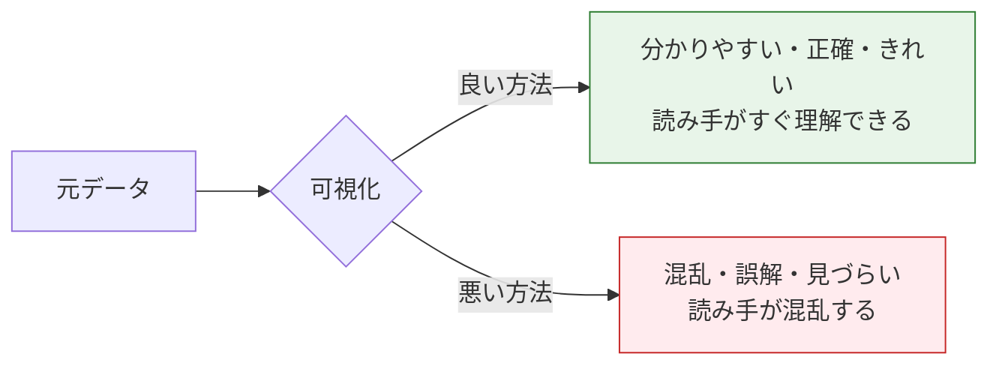
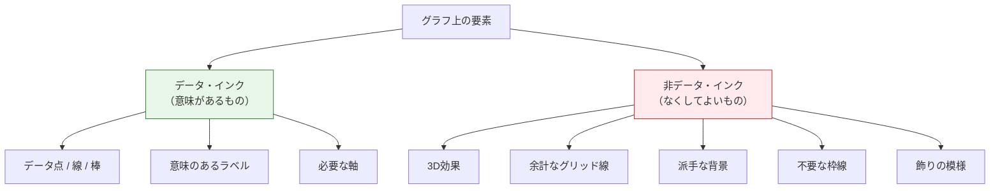
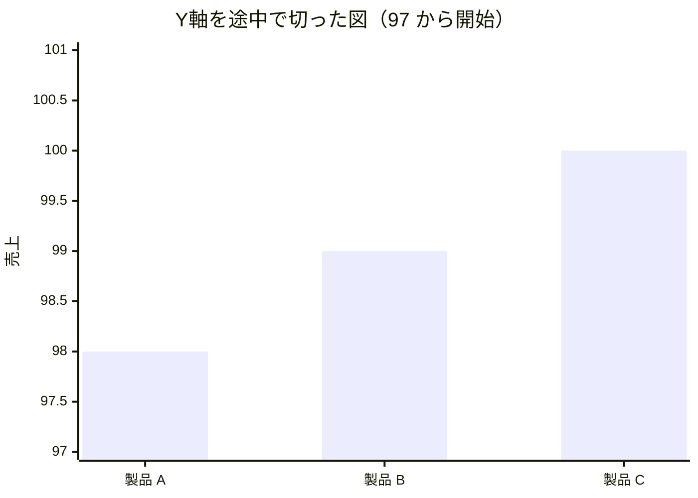
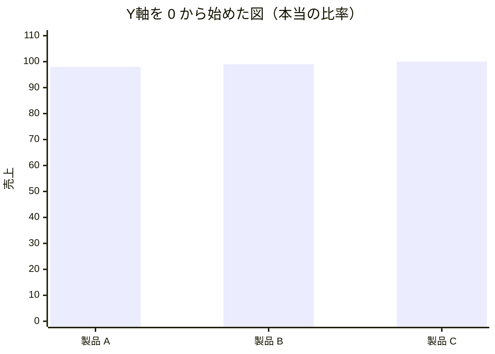
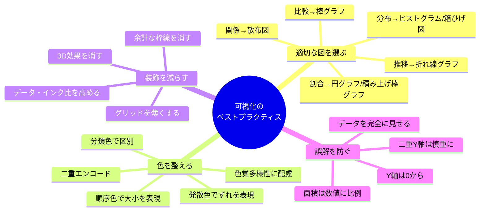

# 可視化のベストプラクティス


:::tip この節の位置づけ
可視化を学び始めたばかりの人は、つい次の点に意識が向きがちです。

- 色がきれいかどうか
- 見た目が派手かどうか

でも、本当に大事なのは、実は次のことです。

> **この図は、人にもっと早く理解してもらえるか。それとも、かえって誤解させてしまうか。**

なので、この節で一番大事なのは「見た目をきれいにすること」ではなく、

- 図の選び方
- 邪魔な要素を減らすこと
- 事実を正直に伝えること

です。
:::

## 学習目標

- グラフの種類を選ぶ考え方を身につける
- 配色の原則と、色覚多様性に配慮したデザインを理解する
- 「データ・インク比」の考え方を理解する
- よくある可視化の誤解を見分けて避ける

---

## まずは全体像をつかもう

可視化のベストプラクティスは、「伝えたいこと -> 図を選ぶ -> 邪魔を減らす -> 誤解を防ぐ」という流れで理解すると分かりやすいです。


この節で本当に解決したいのは、次のような疑問です。

- どうして、図を描けばそれだけで見やすくなるわけではないのか
- どうして、ダメな図の原因はコードではなく、伝え方にあることが多いのか

---

## なぜベストプラクティスを学ぶのか？

> 同じデータでも、良い可視化なら一瞬で理解できるし、悪い可視化だとどんどん分かりにくくなり、ひどいときは誤解まで生みます。



### 初心者向けの分かりやすい例え

1枚の図は、こんなふうに考えるとイメージしやすいです。

- 短いプレゼンテーション

良い図は、伝えたいことがはっきりしたプレゼンのようなものです。

- 話し始めた瞬間に、要点が分かる

悪い図は、こんな感じです。

- 話が長い
- 装飾が多い
- でも、結局何が大事か分からない

だから、ベストプラクティスで一番大事なのは「見栄え」ではなく、

- 情報をもっと少ない労力で伝えられるか

です。

---

## 一、グラフの種類の選び方

### 基本原則：まず自分に「何を見せたいのか？」と聞く

```mermaid
flowchart TD
    Q["何を見せたい？"]

    Q --> T["推移の変化"]
    Q --> C["カテゴリの比較"]
    Q --> R["関係・相関"]
    Q --> D["データの分布"]
    Q --> P["割合・構成"]

    T --> T1["折れ線グラフ<br/>時系列に向いている"]
    T --> T2["面グラフ<br/>累積を強調したいとき"]

    C --> C1["棒グラフ<br/>最もよく使う"]
    C --> C2["横棒グラフ<br/>ラベルが長いとき"]
    C --> C3["レーダーチャート<br/>多次元の評価"]

    R --> R1["散布図<br/>2変数の関係"]
    R --> R2["ヒートマップ<br/>行列の関係"]
    R --> R3["バブルチャート<br/>3変数の関係"]

    D --> D1["ヒストグラム<br/>頻度を見る"]
    D --> D2["箱ひげ図<br/>分布 + 外れ値"]
    D --> D3["バイオリンプロット<br/>分布の形を見る"]

    P --> P1["円グラフ<br/>カテゴリが少ない割合"]
    P --> P2["積み上げ棒グラフ<br/>複数カテゴリの割合"]
    P --> P3["ツリーマップ<br/>階層的な割合"]

    style Q fill:#e3f2fd,stroke:#1565c0,color:#333
    style T fill:#fff3e0,stroke:#e65100,color:#333
    style C fill:#e8f5e9,stroke:#2e7d32,color:#333
    style R fill:#f3e5f5,stroke:#7b1fa2,color:#333
    style D fill:#fff8e1,stroke:#f57f17,color:#333
    style P fill:#fce4ec,stroke:#c62828,color:#333
```



### 詳しい選び方の対照表

| 目的 | おすすめの図 | 非推奨 | 説明 |
|---------|---------|--------|------|
| 時系列の変化を見せる | 折れ線グラフ | 円グラフ | 折れ線は連続変化と相性が良い |
| いくつかのカテゴリを比較する | 棒グラフ | 円グラフ（6カテゴリ超） | 棒の高さで一目で比べやすい |
| 2変数の関係を見る | 散布図 | 折れ線グラフ | 散布図は分布と傾向が直感的 |
| データ分布を見る | ヒストグラム / 箱ひげ図 | 折れ線グラフ | ヒストグラムは頻度分布を表せる |
| 割合を見せる | 円グラフ（少数カテゴリ）/ 積み上げ棒グラフ | 3D円グラフ | 3D円グラフは面積の見え方がずれる |
| 分布の違いを比べる | 箱ひげ図 / バイオリンプロット | 平均だけの棒グラフ | 平均だけだと分布の情報が消える |
| 相関行列を見せる | ヒートマップ | 表 | 色で表す方が直感的 |

### 初心者が最初に覚えておくと良い「作図前の5つの質問」

本当に描き始める前に、次の5つを確認しましょう。

1. 推移、比較、分布、関係のどれを伝えたい？
2. この図は自分のための探索用？ それとも相手への報告用？
3. 読み手が最初に見つけるべきポイントは何？
4. 余計な装飾で消せるものはある？
5. この図は誰かを誤解させる可能性がある？

この5つは、多くのライブラリのパラメータよりずっと大事です。

---

## 二、配色の原則

### 1. 色の3つの使い方

| 用法 | 場面 | 例 |
|------|------|------|
| **分類**（定性的な色） | 異なるカテゴリを区別する | 男女を別の色にする |
| **順序**（連続色） | 数値の大小を表す | 温度を青から赤へ |
| **発散**（両端色） | 中心値があるデータ | 相関係数 -1 から 1 |

### 2. おすすめの配色

```python
import matplotlib.pyplot as plt
import seaborn as sns

# === 分類色（カテゴリの区別）===
# Matplotlib のデフォルト色パレット（Tab10）
# 色: 青、オレンジ、緑、赤、紫、茶、ピンク、グレー、黄緑、シアン
# 適用例: 最大 10 カテゴリまで

# Seaborn のパレット
sns.color_palette("Set2")       # やわらかい色合い
sns.color_palette("colorblind") # 色覚多様性に配慮！

# === 順序色（大きさを表す）===
# 薄い色から濃い色へ
# "Blues", "Greens", "Reds", "YlOrRd"（黄-オレンジ-赤）

# === 発散色（中心値がある）===
# "RdBu_r"（赤-白-青）——相関係数でよく使う
# "RdYlGn"（赤-黄-緑）——良い/悪いを表しやすい
```

### 3. 色覚多様性に配慮したデザイン

世界の男性のおよそ 8% は色覚に特性があります（最も多いのは赤緑の見分けが難しいタイプです）。

**避けたい組み合わせ：**

| 避けるもの | 理由 | 代わりの案 |
|------|------|---------|
| 赤 + 緑 | 赤緑の見分けが難しい人には区別しにくい | 青 + オレンジ |
| 色だけで区別する | 色だけでは違いが分からない人がいる | 色 + 形 / 線種 |

**おすすめのやり方：**

```python
# 色覚多様性に配慮したパレットを使う
sns.set_palette("colorblind")

# あるいは、マーカーの形 + 色を変える
markers = ["o", "s", "^", "D"]  # 円、四角、三角、ひし形
linestyles = ["-", "--", ":", "-."]  # 実線、破線、点線、鎖線

# 例：色 + 線種 の二重エンコード
fig, ax = plt.subplots()
for i, (style, marker) in enumerate(zip(linestyles, markers)):
    ax.plot(range(10), [x + i*2 for x in range(10)],
            linestyle=style, marker=marker, label=f"系列 {i+1}")
ax.legend()
plt.show()
```

:::tip 二重エンコード
情報を色だけに頼らず、**形、線種、ラベル、パターン**も使って区別しましょう。そうすれば、白黒印刷でも読み取りやすくなります。
:::

---

## 三、データ・インク比

### データ・インク比とは？

この考え方は、可視化の第一人者 **Edward Tufte** によるものです。

> **データ・インク比 = データを表すために使っているインク / 図全体で使っているインク**

簡単にいうと、**不要な装飾をなくして、インクの1滴1滴までデータのために使う**ということです。

### 「チャートのゴミ」を減らす



### 実際の比較

**良くない例（データ・インク比が低い）：**

```python
# ❌ 装飾しすぎ
fig, ax = plt.subplots(figsize=(8, 5))
values = [25, 40, 30, 55, 45]
categories = ["A", "B", "C", "D", "E"]

ax.bar(categories, values, color="skyblue", edgecolor="navy", linewidth=2, hatch="//")
ax.set_facecolor("#f0f0f0")          # 背景色
ax.grid(True, linewidth=2, alpha=1)  # 太いグリッド
ax.set_title("売上データ", fontsize=20, fontweight="bold",
             fontstyle="italic", color="red")
# 装飾が多すぎると、データが目立たない
plt.show()
```

**良い例（データ・インク比が高い）：**

```python
# ✅ シンプルで分かりやすい
fig, ax = plt.subplots(figsize=(8, 5))

bars = ax.bar(categories, values, color="#4CAF50", width=0.6)

# 棒の上に数値を直接表示する（軸への依存を減らす）
for bar, val in zip(bars, values):
    ax.text(bar.get_x() + bar.get_width()/2, bar.get_height() + 1,
            str(val), ha="center", fontsize=12)

ax.set_title("売上データ", fontsize=14)
ax.spines["top"].set_visible(False)     # 上の枠線を消す
ax.spines["right"].set_visible(False)   # 右の枠線を消す
ax.set_ylabel("売上高")

plt.tight_layout()
plt.show()
```

### シンプル化チェックリスト

| 要素 | 残す？ | 理由 |
|------|---------|------|
| 上/右の枠線 | 消す | 情報量が少ない |
| 密なグリッド | 消すか薄くする | `alpha=0.2` などで十分 |
| 3D効果 | 消す | 比率がゆがむ |
| データラベル | 必要に応じて | 軸より分かりやすいことがある |
| 凡例 | 必要に応じて | 1系列だけなら不要 |
| 背景色 | 白が基本 | もっとも邪魔になりにくい |

### 初心者が最初に覚えるとよい、すっきり見せる基本形

どうやって「プロっぽく」見せればいいか迷ったら、まずは次の設定を基本にすると良いです。

1. 白背景
2. 上と右の枠線を消す
3. グリッド線を薄くする
4. タイトルは要点だけにする
5. 派手な色を使いすぎない

これだけでも、よくある「頑張って飾った図」よりずっと見やすくなります。

---

## 四、よくある可視化の誤解

### 誤解 1：Y軸を途中で切る

3つの製品の売上がそれぞれ 98、99、100 だとします。データとしてはほとんど同じです。ところが、Y軸を 0 から始めないと、

**Y軸を途中で切った図（97 から開始）—— 差がとても大きく見える：**



C の棒が A の **3倍** くらい高く見えます。でも実際は、たった 2% の違いしかありません。

**Y軸を 0 から始めた図 —— 本当の比率：**



0 から始めると、3本の棒はほとんど同じ高さになります。これが実際のデータに近い見え方です。

:::tip 重要な結論
**Y軸が 0 から始まらない**と、小さな差が大きな差のように見えてしまいます。ニュースなどでもよく使われる誤解を生む手法なので、見分けられるようになりましょう。
:::

**コードでの比較：**

```python
import matplotlib.pyplot as plt

fig, axes = plt.subplots(1, 2, figsize=(12, 4))

data = [98, 99, 100]
labels = ["製品 A", "製品 B", "製品 C"]

# ❌ 誤解を招く：Y軸を途中で切る
axes[0].bar(labels, data, color="#F44336")
axes[0].set_ylim(97, 101)  # Y軸を 97 から始める！
axes[0].set_title("❌ Y軸を途中で切った図（97 から開始）")
axes[0].set_ylabel("売上")

# ✅ 正しい：0 から始める
axes[1].bar(labels, data, color="#4CAF50")
axes[1].set_ylim(0, 110)
axes[1].set_title("✅ Y軸を 0 から始めた図")
axes[1].set_ylabel("売上")

plt.tight_layout()
plt.show()
```

:::caution いつなら 0 から始めなくてもよい？
折れ線グラフで**変化の傾向**を見たいときは、Y軸を途中から始めてもよい場合があります（読み手が線の動きを見るからです）。ただし、棒グラフは棒の面積が数量を表すので、**必ず 0 から始める**べきです。
:::

### 誤解 2：3D円グラフ

3D円グラフは、手前にある部分が実際より大きく見えます。

```python
# ❌ 3D円グラフ
# matplotlib には本当の 3D 円グラフはありませんが、考え方としては：
# 手前の扇形は遠近法で大きく見え、奥の扇形は小さく見える
# そのせいで、割合の判断を間違えやすくなります

# ✅ 正しい方法：2D円グラフか棒グラフを使う
fig, axes = plt.subplots(1, 2, figsize=(12, 5))

labels = ["Python", "Java", "JS", "C++"]
sizes = [35, 25, 25, 15]

axes[0].pie(sizes, labels=labels, autopct="%1.0f%%")
axes[0].set_title("2D円グラフ（分かりやすい）")

axes[1].barh(labels, sizes, color=["#4CAF50", "#2196F3", "#FFC107", "#FF5722"])
axes[1].set_xlabel("割合 (%)")
axes[1].set_title("棒グラフ（より正確に比べやすい）")

plt.tight_layout()
plt.show()
```

### 誤解 3：二重Y軸の落とし穴

```python
# ❌ 二重Y軸は、実際にはない相関をそれっぽく見せることがある
fig, ax1 = plt.subplots(figsize=(8, 5))

months = range(1, 13)
temp = [5, 7, 12, 18, 23, 28, 30, 29, 24, 17, 10, 6]
ice_cream = [20, 25, 35, 50, 70, 90, 95, 88, 60, 40, 22, 18]

ax1.plot(months, temp, "r-", label="気温")
ax1.set_ylabel("気温 (°C)", color="r")

ax2 = ax1.twinx()
ax2.plot(months, ice_cream, "b-", label="アイスクリーム売上")
ax2.set_ylabel("アイスクリーム売上", color="b")

ax1.set_title("気温 vs アイスクリーム売上")
plt.show()

# たしかに相関はありますが、二重Y軸はスケールを自由に変えられるので、
# 2本の線がぴったり重なって見えたり、まったく関係なさそうに見えたりします。
# 相関を見せたいなら、散布図の方が正直です。
```

### 誤解 4：面積やサイズの不適切な使い方

```python
# ❌ 直径で数量を表す
# たとえば A = 100, B = 200 のとき
# 直径が2倍 → 面積は4倍 → B が A の4倍に見えてしまう

# ✅ 正しい方法：面積で数値を表す
import numpy as np

values = [100, 200, 300]
# 面積が数値に比例するなら、半径は sqrt(数値) に比例させる
sizes = [v * 2 for v in values]  # 面積に比例
```

### よくある誤解のまとめ

| 誤解の種類 | なぜ誤解を生むか | 正しいやり方 |
|---------|-----------|---------|
| Y軸を途中で切る | 差を大きく見せすぎる | 棒グラフは 0 から始める |
| 3D円グラフ | 面積の比率がゆがむ | 2D円グラフか棒グラフを使う |
| 二重Y軸 | 視覚的な相関を操作しやすい | 散布図を使うか、別々に描く |
| 面積の誤用 | 大きさの感覚がずれる | 面積を数値に比例させる |
| 都合のいい部分だけ見せる | 不利なデータを隠せる | データ全体を見せる |
| 色で誤解させる | 派手な色で小さいデータを強調しすぎる | 中立的な色を中心に使う |

---

## 五、完全チェックリスト

毎回グラフを作ったら、このチェックリストで確認しましょう。

```
☐ 図の種類は適切？（折れ線 vs 棒 vs 散布図…）
☐ タイトルは、何を伝える図なのかはっきり示している？
☐ 軸にラベルと単位はある？
☐ Y軸の開始値は適切？（棒グラフは 0 から）
☐ 凡例は必要で、分かりやすい？
☐ 色は色覚多様性に配慮できている？
☐ 不要な装飾を減らせている？（3D効果、派手な背景など）
☐ データラベルは理解の助けになっている？
☐ 文字の大きさは十分？（見やすい？）
☐ データの見せ方は正直？（誤解を生まない？）
```

### 初めて報告用の図を作るときの、いちばん安全な順番

より安全な流れは、だいたい次の順番です。

1. まず適切な図を選ぶ
2. 次にタイトルと軸を分かりやすくする
3. 余計な装飾を減らす
4. 最後に、誤解を生まないか確認する

最初から配色や影の見た目にこだわりすぎるより、この順番の方が失敗しにくいです。

---

## 六、「使える」から「見やすい」へ

### ミニマルでプロっぽいテンプレート

```python
import matplotlib.pyplot as plt
import numpy as np

def professional_style(ax):
    """プロっぽい見た目を一発で設定する"""
    ax.spines["top"].set_visible(False)
    ax.spines["right"].set_visible(False)
    ax.grid(True, axis="y", alpha=0.2, linestyle="--")
    ax.tick_params(labelsize=10)

# テンプレートを使う
fig, ax = plt.subplots(figsize=(8, 5))

categories = ["製品 A", "製品 B", "製品 C", "製品 D", "製品 E"]
values = [42, 38, 55, 29, 47]

bars = ax.bar(categories, values, color="#1976D2", width=0.6)

# データラベル
for bar, val in zip(bars, values):
    ax.text(bar.get_x() + bar.get_width()/2, bar.get_height() + 1,
            f"{val}万", ha="center", fontsize=11)

ax.set_title("2024年の各製品売上", fontsize=14, pad=15)
ax.set_ylabel("売上高（万元）")
ax.set_ylim(0, max(values) * 1.15)

professional_style(ax)
plt.tight_layout()
plt.show()
```

### Seaborn のミニマルテンプレート

```python
import seaborn as sns
import matplotlib.pyplot as plt

# グローバル設定
sns.set_theme(
    style="ticks",                         # ミニマルなティックスタイル
    palette="colorblind",                  # 色覚多様性に配慮
    rc={
        "figure.figsize": (8, 5),
        "axes.spines.top": False,          # 上の枠線を消す
        "axes.spines.right": False,        # 右の枠線を消す
        "font.size": 11,
    }
)

# これ以降の sns/plt の図は、このスタイルが使われる
```

---

## まとめ



**大事な3つのポイント：**

1. **適切な図を選ぶ** —— データに図を合わせるのであって、その逆ではない
2. **少ないほうがよい** —— データに関係ない要素は減らす
3. **正直に見せる** —— 大げさにしない、隠さない、誤解させない

## この節で一番持ち帰ってほしいこと

- ベストプラクティスの本質は「もっときれい」ではなく、「もっと分かりやすく、もっと正直に」
- 図の種類を正しく選ぶことは、装飾を足すことよりずっと重要
- 可視化で一番怖いのは、派手さが足りないことではなく、読み手に間違った重点を見せてしまうこと

---

## 実践演習

### 演習 1：見づらい図を改善する

```python
# 次の図には問題がたくさんあります。プロっぽい形に直してください：
import matplotlib.pyplot as plt

fig, ax = plt.subplots()
data = [45, 52, 38, 67, 41]
labels = ["北京", "上海", "广州", "深圳", "杭州"]

ax.bar(labels, data, color=["red", "green", "blue", "yellow", "purple"],
       edgecolor="black", linewidth=3, hatch="xxx")
ax.set_ylim(30, 70)  # Y軸を途中で切っている！
ax.set_facecolor("#cccccc")
ax.grid(True, linewidth=3)
ax.set_title("SALES DATA!!!", fontsize=24, color="red")
plt.show()

# 問題リスト：
# 1. Y軸が 0 から始まっていない（誤解を招く）
# 2. 配色が派手で統一感がない
# 3. 背景色が邪魔
# 4. グリッドが太すぎる
# 5. タイトルが分かりにくい
# 6. 枠線が余計
# 1つずつ直してみましょう！
```

### 演習 2：図の選び方

```
次の場面に合うグラフの種類を選び、理由も説明してください。

1. ある会社の 2018-2024 年の年間売上の変化を見せる
2. 5つの都市の平均住宅価格を比較する
3. 広告費と売上の関係を分析する
4. 1000人の社員の年齢分布を見る
5. 会社の各部門の人数割合を見せる（4部門）
6. 3グループの実験データの分布の違いを比べる
```

### 演習 3：色覚多様性への対応

```python
# 次のグラフを、色覚多様性に配慮した版に直してください
# 条件：色覚多様性に安全なパレット + 異なる線種/マーカーの二重エンコード

fig, ax = plt.subplots()
x = range(10)
ax.plot(x, [i**1.5 for i in x], color="red", label="モデル A")
ax.plot(x, [i**1.3 for i in x], color="green", label="モデル B")
ax.plot(x, [i**1.1 for i in x], color="red", alpha=0.5, label="モデル C")  # A と似すぎ！
ax.legend()
plt.show()
```
