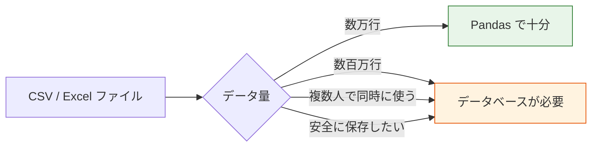
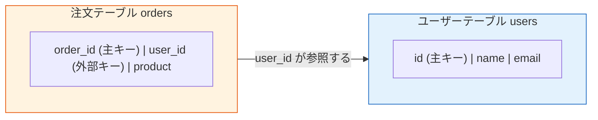
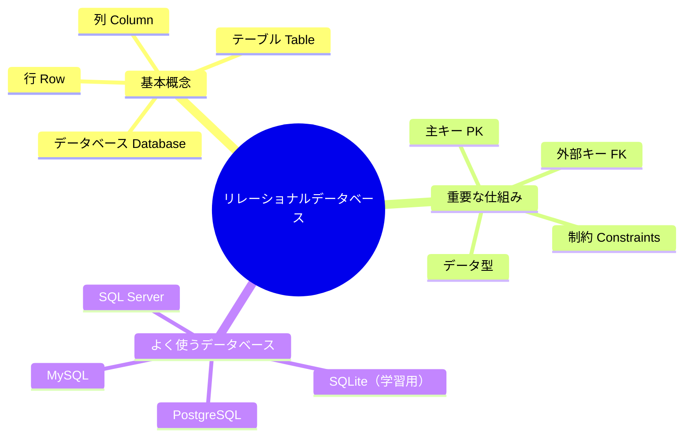

# 3.5.2 リレーショナルデータベースの基礎


:::info 選択章
この章は選択内容です。データ分析やモデリングだけをしたいなら、いったん飛ばしてもかまいません。ですが、将来 AI アプリ開発（たとえば RAG システム、AI Agent）をするなら、データベースの知識は必須です。
:::

## 学習目標

- データベースとは何か、なぜ必要なのかを理解する
- リレーショナルデータベースの基本概念を身につける
- テーブル、行、列、主キー、外部キーの意味を理解する
- よく使われるデータベース管理システムを知る

---

## なぜ AI エンジニアはデータベースを学ぶ必要があるのか？

「もう Pandas で CSV を読めるのに、どうしてデータベースまで学ぶ必要があるの？」と思うかもしれません。



| シーン | CSV ファイル | データベース |
|------|---------|--------|
| データ量 | 数万行なら大丈夫、百万行だと重くなる | 数億行でも軽く処理できる |
| 複数人での協力 | どこを誰が変えたか分かりにくく、競合しやすい | 同時読み書きに対応し、権限管理もできる |
| データの安全性 | ファイルを消したらなくなる | バックアップ、トランザクション、障害復旧がある |
| 検索速度 | 毎回全体を走査する必要がある | インデックスがあり、ミリ秒単位で検索できる |
| データの関連付け | 複数ファイルを手作業で merge する | SQL JOIN ひとつで解決できる |

**実際の場面の例：**

- RAG システムを作る → ユーザーの質問と回答の履歴をデータベースに保存する
- AI Agent を作る → メモリシステムには永続的な保存が必要
- レコメンドシステムを作る → ユーザー行動データはデータベースにある
- データ分析をする → 企業データの 99% はデータベースに保存されている

---

## リレーショナルデータベースとは？

### Excel にたとえてみる

Excel を使ったことがあるなら、リレーショナルデータベースの概念の 80% はすでに理解できています。

| Excel の概念 | データベースの概念 | 説明 |
|-----------|-----------|------|
| 1 つの Excel ファイル | 1 つの**データベース**（Database） | すべてのデータを入れておく入れ物 |
| 1 つの Sheet ワークシート | 1 つの**テーブル**（Table） | ある種類のデータを保存する |
| 1 行 | 1 件の**レコード**（Row / Record） | 1 つの具体的なデータ |
| 1 列 | 1 つの**フィールド**（Column / Field） | データの 1 つの属性 |
| 列の見出し | **列名**（Column Name） | 属性の名前 |
| セルのデータ型 | **データ型**（Data Type） | 整数、文字列、日付など |

### 例で理解する

たとえば、あなたがネットショップを運営していて、**ユーザー**と**注文**を管理したいとします。

**ユーザーテーブル（users）：**

| id | name | email | age | city |
|----|------|-------|-----|------|
| 1 | 張三 | zhang@mail.com | 28 | 北京 |
| 2 | 李四 | li@mail.com | 35 | 上海 |
| 3 | 王五 | wang@mail.com | 22 | 広州 |

**注文テーブル（orders）：**

| order_id | user_id | product | amount | order_date |
|----------|---------|---------|--------|------------|
| 101 | 1 | iPhone 16 | 7999 | 2024-11-01 |
| 102 | 1 | AirPods | 999 | 2024-11-05 |
| 103 | 2 | MacBook | 14999 | 2024-11-10 |

この 2 つのテーブルは `user_id` でつながっています。これが、リレーショナルデータベースという名前の由来です。テーブル同士に**関係**があるからです。

---

## 基本概念

### 主キー（Primary Key）

主キーは各レコードの**一意な識別子**です。身分証番号のようなもので、重複してはいけず、空欄にもできません。

```
ユーザーテーブルでは：id が主キー → 各ユーザーに一意の id がある
注文テーブルでは：order_id が主キー → 各注文に一意の order_id がある
```

:::tip なぜ主キーが必要なの？
主キーがないと、たとえば「張三」という名前のユーザーが 2 人いたとき、どう区別すればいいでしょうか。主キーはこの問題を解決します。名前が同じでも、id は必ず違います。
:::

### 外部キー（Foreign Key）

外部キーとは、**別のテーブルの主キーを参照するフィールド**のことです。テーブル同士の関係を作るために使います。



注文テーブルの `user_id` は外部キーです。これはユーザーテーブルの `id` を指していて、「この注文はどのユーザーのものか」を表します。

### よくあるデータ型

| 型 | 説明 | 例 |
|------|------|------|
| `INTEGER` | 整数 | 1, 42, -100 |
| `REAL` / `FLOAT` | 浮動小数点数 | 3.14, 99.9 |
| `TEXT` / `VARCHAR` | 文字列 | "張三", "hello" |
| `DATE` | 日付 | 2024-11-01 |
| `DATETIME` | 日付と時刻 | 2024-11-01 14:30:00 |
| `BOOLEAN` | 真偽値 | TRUE / FALSE |
| `BLOB` | バイナリデータ | 画像、ファイル（あまり使わない） |

### 制約（Constraints）

制約はデータに対する**ルールの制限**で、データの品質を保つためのものです。

| 制約 | 役割 | 例 |
|------|------|------|
| `PRIMARY KEY` | 主キー、一意で空欄不可 | `id` |
| `NOT NULL` | 空欄にできない | `name NOT NULL` |
| `UNIQUE` | 値を重複させない | `email UNIQUE` |
| `DEFAULT` | デフォルト値 | `city DEFAULT '未知'` |
| `FOREIGN KEY` | 外部キー、他のテーブルを参照する | `user_id REFERENCES users(id)` |

---

## よく使われるデータベース管理システム

| データベース | 特徴 | 適用場面 |
|--------|------|---------|
| **SQLite** | 設定不要で、単一ファイルとして保存される | 学習、小規模アプリ、モバイル端末 |
| **MySQL** | 最も人気のあるオープンソースデータベース | Web アプリ、中小規模プロジェクト |
| **PostgreSQL** | 機能が最も強力なオープンソースデータベース | 大規模プロジェクト、AI アプリ（ベクトル検索をサポート） |
| **SQL Server** | Microsoft 製 | 企業向けの Windows 環境 |

:::tip この章では SQLite を使う
SQLite はサーバーをインストールする必要がなく、Python には標準で `sqlite3` モジュールが入っています。学習に最適です。SQL の文法は他のデータベースでもそのまま使えます。
:::

### データベースを初めて学ぶときの、いちばん安定した順番

一般的に、より安定しやすい順番は次のとおりです。

1. まず「テーブル、主キー、外部キー」の意味をつかむ
2. 次に SQL の検索を学ぶ
3. その後で Python からデータベースにつなぐ
4. 最後にデータベース設計を見る

こうすると、最初からたくさんの SQL の細かいルールを覚えるより、混乱しにくくなります。

---

## 実践: はじめてのデータベースを作る

```python
import sqlite3

# 1. データベースに接続する（存在しなければ自動で作成される）
conn = sqlite3.connect("my_shop.db")
cursor = conn.cursor()

# 2. ユーザーテーブルを作成する
cursor.execute("""
    CREATE TABLE IF NOT EXISTS users (
        id INTEGER PRIMARY KEY AUTOINCREMENT,
        name TEXT NOT NULL,
        email TEXT UNIQUE,
        age INTEGER,
        city TEXT DEFAULT '未知'
    )
""")

# 3. データを挿入する
cursor.execute("INSERT INTO users (name, email, age, city) VALUES ('張三', 'zhang@mail.com', 28, '北京')")
cursor.execute("INSERT INTO users (name, email, age, city) VALUES ('李四', 'li@mail.com', 35, '上海')")
cursor.execute("INSERT INTO users (name, email, age, city) VALUES ('王五', 'wang@mail.com', 22, '広州')")

# 4. 変更を保存する
conn.commit()

# 5. データを検索する
cursor.execute("SELECT * FROM users")
rows = cursor.fetchall()
for row in rows:
    print(row)
# (1, '張三', 'zhang@mail.com', 28, '北京')
# (2, '李四', 'li@mail.com', 35, '上海')
# (3, '王五', 'wang@mail.com', 22, '広州')

# 6. 接続を閉じる
conn.close()
```

おめでとうございます！  
これで、データベースを 1 つ作り、1 つのテーブルを作成し、3 件のデータを保存できました。

### この小さな例で、まず何を学ぶべき？

まず学ぶべきなのは、SQL の各キーワードを全部覚えることではありません。  
データベースの最小の流れは、実はとてもシンプルです。

1. データベースに接続する
2. テーブルを作成する
3. データを挿入する
4. 結果を検索する

この流れを先に理解できれば、その後の SQL や Python からの接続も、ずっと分かりやすくなります。

---

## まとめ



| 概念 | 一言でいうと |
|------|----------|
| データベース | すべてのテーブルを入れておく「フォルダ」 |
| テーブル | ある種類のデータを入れる「Excel ワークシート」 |
| 主キー | 各レコードの「身分証番号」 |
| 外部キー | 2 つのテーブルをつなぐ「つながり」 |
| 制約 | データ品質を守る「ルール」 |

## この節でいちばん持ち帰ってほしいこと

- リレーショナルデータベースで大事なのは「たくさんのテーブルを保存すること」ではなく、テーブル同士をキーで関係づけられること
- 主キーは一意に識別するため、外部キーはテーブルをつなぐために使う
- ここを先にしっかり押さえると、後の SQL や複数テーブルの分析がスムーズになります

---

## 実践練習

### 練習 1: テーブル構造を設計する

```
図書管理システムのために、2 つのテーブルを設計してください:
- books テーブル: 書名、著者、出版年、価格、分類
- borrows テーブル: 貸出記録（誰がどの本を借りたか、貸出日、返却日）

考えること:
1. 各テーブルの主キーは何ですか？
2. borrows テーブルにはどの外部キーが必要ですか？
3. どのフィールドに NOT NULL 制約を付けるべきですか？
```

### 練習 2: SQLite で実践する

```python
# sqlite3 を使って、上で設計した books テーブルと borrows テーブルを作成する
# 5 冊の本と 3 件の貸出記録を挿入する
# すべてのデータを検索して表示する
```
