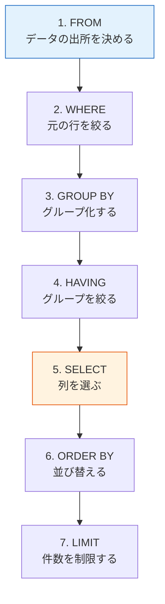
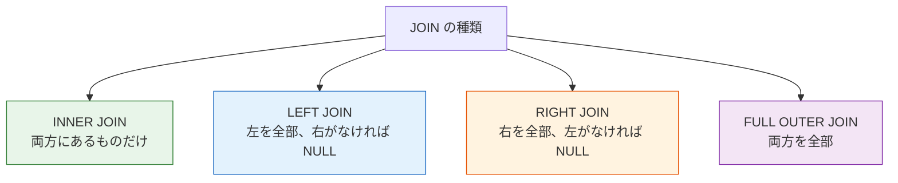

# 3.5.3 SQL 基礎


:::tip この節の位置づけ
SQL を初めて学ぶとき、新人が最もつまずきやすいのは、文法が多いことよりも次の2点です。

- Pandas と一体どういう関係なのか
- クエリの実行順を頭の中でどう整理するか

なので、この節でいちばん大事なのは、最初にすべての文法を暗記することではなく、まず次の判断を持つことです。

> **SQL の本質は、安定した言語で表に質問すること。**
:::

## 学習目標

- SQL の4大操作を理解する：追加、削除、更新、検索
- `SELECT` クエリを使いこなす
- `WHERE` による条件フィルタを学ぶ
- `JOIN` による複数テーブル結合を理解する
- `GROUP BY` によるグループ化と集計を理解する

---

## まず地図を1枚作ろう

SQL を新人が理解しやすい順番は、「最初から文法を丸暗記する」ではなく、まず全体像をつかむことです。


この節で本当に解決したいのは、次の2つです。

- SQL のクエリは頭の中でどう流れるのか
- なぜ `Pandas` の絞り込み、グループ化、結合に対応づけられるのか

## SQL とは？

**SQL**（Structured Query Language、構造化問い合わせ言語）は、データベースと「対話」するための言語です。SQLite、MySQL、PostgreSQL のどれを使っても、SQL の基本文法はほぼ共通です。


:::tip SQL と Pandas の関係
SQL でできることの多くは、Pandas でもできます。実際、Pandas の多くのメソッド名（たとえば `merge` や `groupby`）は SQL からヒントを得ています。両方を対応させながら学ぶと、理解しやすくなります。
:::

### 新人向けの、よりわかりやすい比喩

SQL は次のように考えるとよいです。

- あなたがデータベースに質問している

その質問は、だいたいとても素朴です。

- どの列がほしい？
- どの行だけほしい？
- 何で分ける？
- 2つの表をどうつなぐ？

この比喩は新人にとても向いています。SQL を「別の言語」ではなく、「表にどう質問するか」として捉え直せるからです。

---

## 準備：練習用データベースを作る

この節の例はすべてこの練習用データベースに基づいています。先に実行してください。

```python
import sqlite3

conn = sqlite3.connect(":memory:")  # メモリ上のデータベース。閉じると消える
cursor = conn.cursor()

# users テーブルを作成
cursor.execute("""
    CREATE TABLE users (
        id INTEGER PRIMARY KEY,
        name TEXT NOT NULL,
        age INTEGER,
        city TEXT,
        salary REAL
    )
""")

# orders テーブルを作成
cursor.execute("""
    CREATE TABLE orders (
        order_id INTEGER PRIMARY KEY,
        user_id INTEGER,
        product TEXT,
        amount REAL,
        order_date TEXT,
        FOREIGN KEY (user_id) REFERENCES users(id)
    )
""")

# ユーザーデータを挿入
users_data = [
    (1, "张三", 28, "北京", 15000),
    (2, "李四", 35, "上海", 22000),
    (3, "王五", 22, "广州", 8000),
    (4, "赵六", 42, "北京", 35000),
    (5, "钱七", 30, "上海", 18000),
    (6, "孙八", 26, "深圳", 12000),
]
cursor.executemany("INSERT INTO users VALUES (?, ?, ?, ?, ?)", users_data)

# 注文データを挿入
orders_data = [
    (101, 1, "iPhone", 7999, "2024-11-01"),
    (102, 1, "AirPods", 999, "2024-11-05"),
    (103, 2, "MacBook", 14999, "2024-11-10"),
    (104, 3, "iPad", 3999, "2024-11-15"),
    (105, 2, "キーボード", 599, "2024-11-20"),
    (106, 4, "モニター", 2999, "2024-12-01"),
    (107, 5, "マウス", 299, "2024-12-05"),
]
cursor.executemany("INSERT INTO orders VALUES (?, ?, ?, ?, ?)", orders_data)

conn.commit()

# クエリを簡単に実行するための補助関数を定義
def query(sql):
    cursor.execute(sql)
    cols = [desc[0] for desc in cursor.description]
    rows = cursor.fetchall()
    # ヘッダーを表示
    print(" | ".join(cols))
    print("-" * (len(" | ".join(cols))))
    for row in rows:
        print(" | ".join(str(v) for v in row))
    print()
```

---

## 一、データを検索する（SELECT）

`SELECT` は SQL の中で最もよく使う文で、テーブルからデータを取り出すために使います。

### 基本の検索

```sql
-- すべての列を検索
SELECT * FROM users;

-- 指定した列だけ検索
SELECT name, age, city FROM users;

-- 列に別名をつける
SELECT name AS 氏名, age AS 年齢 FROM users;
```

```python
query("SELECT * FROM users")
# id | name | age | city | salary
# 1 | 张三 | 28 | 北京 | 15000
# 2 | 李四 | 35 | 上海 | 22000
# ...
```

### `DISTINCT`：重複を除く

```sql
-- 重複しない都市名をすべて検索
SELECT DISTINCT city FROM users;
```

### `LIMIT`：件数を制限する

```sql
-- 先頭3件だけ取得
SELECT * FROM users LIMIT 3;
```

### 最初にクエリを書くときの、いちばん安定した順番

基本的には、次の順番が書きやすいです。

1. まず `SELECT`
2. 次に `FROM`
3. 必要なら `WHERE`
4. 最後に並び替えやグループ化

最初から全部の句を一気に混ぜるより、ずっと整理しやすくなります。

---

## 二、条件で絞り込む（WHERE）

`WHERE` は Pandas のブールインデックスのようなもので、条件に合う行だけを選びます。

### 基本比較

```sql
-- 年齢が 30 より大きい
SELECT * FROM users WHERE age > 30;

-- 都市が北京
SELECT * FROM users WHERE city = '北京';

-- 給与が 10000 から 20000 の間
SELECT * FROM users WHERE salary BETWEEN 10000 AND 20000;
```

### 条件の組み合わせ

```sql
-- AND：両方満たす
SELECT * FROM users WHERE city = '北京' AND age > 25;

-- OR：どちらかを満たす
SELECT * FROM users WHERE city = '北京' OR city = '上海';

-- IN：リストの中にある
SELECT * FROM users WHERE city IN ('北京', '上海', '深圳');

-- NOT：否定する
SELECT * FROM users WHERE city NOT IN ('北京');
```

### あいまい検索（`LIKE`）

```sql
-- % は任意の文字列にマッチ（Pandas の str.contains に近い）
SELECT * FROM users WHERE name LIKE '张%';    -- 「张」で始まる
SELECT * FROM users WHERE name LIKE '%三';    -- 「三」で終わる
SELECT * FROM users WHERE email LIKE '%@mail%'; -- 「@mail」を含む
```

### `NULL` の扱い

```sql
-- 空かどうかを判定する（= NULL は使えない）
SELECT * FROM users WHERE city IS NULL;
SELECT * FROM users WHERE city IS NOT NULL;
```

### SQL と Pandas の対応表

| 目的 | SQL | Pandas |
|------|-----|--------|
| 年齢が 30 より大きい | `WHERE age > 30` | `df[df["age"] > 30]` |
| 都市が北京 | `WHERE city = '北京'` | `df[df["city"] == "北京"]` |
| 複数条件 AND | `WHERE age > 30 AND city = '北京'` | `df[(df["age"] > 30) & (df["city"] == "北京")]` |
| 複数条件 OR | `WHERE city IN ('北京', '上海')` | `df[df["city"].isin(["北京", "上海"])]` |
| あいまい検索 | `WHERE name LIKE '张%'` | `df[df["name"].str.startswith("张")]` |
| 空値 | `WHERE city IS NULL` | `df[df["city"].isna()]` |

### 初学者が最初に覚えるとよい対応表

| 頭の中の質問 | 近い SQL |
|---|---|
| 条件に合う記録だけ見る | `WHERE` |
| 1つの表の中の重複しない値を見る | `DISTINCT` |
| まず数件だけ確認する | `LIMIT` |
| 2つの表をつなぐ | `JOIN` |
| 先にグループ分けしてから集計する | `GROUP BY` |

この表は新人にとても役立ちます。SQL をキーワードの一覧ではなく、よくある質問の種類として整理できるからです。

---

## 三、並び替え（ORDER BY）

```sql
-- 給与の昇順（デフォルト）
SELECT * FROM users ORDER BY salary;

-- 給与の降順
SELECT * FROM users ORDER BY salary DESC;

-- まず都市で並べ、同じ都市の中では給与を降順にする
SELECT * FROM users ORDER BY city, salary DESC;
```

### なぜ `ORDER BY` は最後に書くことが多いのか？

並び替えは次のようなものだからです。

- まず結果を出して、最後にどう見せるかを決める

これは、

- 先に絞り込む
- 先にグループ化する

という処理とは、同じ段階ではありません。

---

## 四、集計関数とグループ化（GROUP BY）

### よく使う集計関数

| 関数 | 役割 | 例 |
|------|------|------|
| `COUNT(*)` | 件数を数える | レコードが全部で何件あるか |
| `SUM(col)` | 合計を出す | 総給与 |
| `AVG(col)` | 平均を出す | 平均年齢 |
| `MAX(col)` | 最大値を出す | 最高給与 |
| `MIN(col)` | 最小値を出す | 最低年齢 |

```sql
-- 基本的な集計
SELECT COUNT(*) AS 総人数, AVG(salary) AS 平均給与, MAX(salary) AS 最高給与
FROM users;
```

### `GROUP BY`：グループごとに集計する

```sql
-- 都市ごとに人数と平均給与を集計
SELECT city, COUNT(*) AS 人数, AVG(salary) AS 平均給与
FROM users
GROUP BY city;
```

```
city | 人数 | 平均給与
北京 | 2 | 25000.0
上海 | 2 | 20000.0
广州 | 1 | 8000.0
深圳 | 1 | 12000.0
```

### `HAVING`：グループ化した結果を絞り込む

```sql
-- 平均給与が 15000 を超える都市を探す
SELECT city, AVG(salary) AS avg_salary
FROM users
GROUP BY city
HAVING avg_salary > 15000;
```

:::tip `WHERE` と `HAVING` の違い
- `WHERE` はグループ化**前**に絞り込む（元の行を絞る）
- `HAVING` はグループ化**後**に絞り込む（集計結果を絞る）
:::

### SQL の実行順

SQL は、書く順番と実行順が違います。



---

## 五、複数テーブルの結合（JOIN）

`JOIN` は SQL の最も強力な機能の1つで、複数のテーブルのデータをまとめることができます。

### `INNER JOIN`：内部結合

**両方のテーブルに**一致する行だけを返します。

```sql
-- 各ユーザーの注文情報を検索
SELECT users.name, orders.product, orders.amount
FROM users
INNER JOIN orders ON users.id = orders.user_id;
```

```
name | product | amount
张三 | iPhone | 7999.0
张三 | AirPods | 999.0
李四 | MacBook | 14999.0
王五 | iPad | 3999.0
李四 | キーボード | 599.0
赵六 | モニター | 2999.0
钱七 | マウス | 299.0
```

注意：`孙八` には注文がないので、結果には出てきません。

### `LEFT JOIN`：左結合

左側のテーブルの行をすべて返し、右側で一致しないものは `NULL` になります。

```sql
-- すべてのユーザーとその注文を検索する（注文がないユーザーも表示）
SELECT users.name, orders.product, orders.amount
FROM users
LEFT JOIN orders ON users.id = orders.user_id;
```

```
name | product | amount
张三 | iPhone | 7999.0
张三 | AirPods | 999.0
李四 | MacBook | 14999.0
...
孙八 | None | None       ← 注文がないが、表示されている
```

### `JOIN` の種類の比較



:::tip SQL の JOIN と Pandas の merge
| SQL | Pandas |
|-----|--------|
| `INNER JOIN` | `pd.merge(how="inner")` |
| `LEFT JOIN` | `pd.merge(how="left")` |
| `RIGHT JOIN` | `pd.merge(how="right")` |
| `ON users.id = orders.user_id` | `on="user_id"` または `left_on=, right_on=` |
:::

### 実用的な組み合わせ：`JOIN` + `GROUP BY`

```sql
-- 各ユーザーの注文総額を検索
SELECT users.name, COUNT(orders.order_id) AS 注文数, SUM(orders.amount) AS 総消費額
FROM users
LEFT JOIN orders ON users.id = orders.user_id
GROUP BY users.id, users.name
ORDER BY 総消費額 DESC;
```

---

## 六、追加・更新・削除（INSERT / UPDATE / DELETE）

### データを追加する

```sql
-- 1件追加
INSERT INTO users (name, age, city, salary) VALUES ('周九', 29, '杭州', 16000);

-- 複数件追加
INSERT INTO users (name, age, city, salary) VALUES
    ('吴十', 33, '成都', 13000),
    ('郑十一', 27, '南京', 11000);
```

### データを更新する

```sql
-- 张三 に昇給を反映する
UPDATE users SET salary = 18000 WHERE name = '张三';

-- 北京の社員全員を10%昇給する
UPDATE users SET salary = salary * 1.1 WHERE city = '北京';
```

:::caution `UPDATE` には必ず `WHERE` を付けよう！
`UPDATE users SET salary = 0;` を実行すると、**全ユーザー**の給与が 0 になります。`WHERE` を付け忘れるのは、データベース操作で最もよくある事故の1つです。
:::

### データを削除する

```sql
-- 指定したレコードを削除
DELETE FROM users WHERE name = '周九';

-- 20歳未満をすべて削除
DELETE FROM users WHERE age < 20;
```

:::danger `DELETE` も `WHERE` を付けよう！
`DELETE FROM users;` を実行すると、テーブルの**すべてのデータ**が削除されます。実行前によく考えてください。
:::

### SQL を最初に学ぶときの、いちばん安定した順番

基本的には、次の順番が学びやすいです。

1. まず `SELECT / FROM / WHERE` をしっかり書けるようにする
2. 次に `ORDER BY` を足す
3. 次に `GROUP BY / HAVING` を足す
4. 最後に `JOIN` と追加・更新・削除を学ぶ

最初から全部の文法ブロックを覚えようとするより、ずっと混乱しにくくなります。

---

## SQL 文の速習表

| 操作 | SQL 文法 | 説明 |
|------|---------|------|
| 全件検索 | `SELECT * FROM 表名` | すべてのデータを取る |
| 指定列の検索 | `SELECT 列1, 列2 FROM 表名` | 一部の列を取る |
| 条件フィルタ | `SELECT ... WHERE 条件` | 行を絞り込む |
| 並び替え | `ORDER BY 列 DESC` | 降順に並べる |
| 件数制限 | `LIMIT 10` | 先頭 N 件を取る |
| 重複除去 | `SELECT DISTINCT 列` | 一意な値を取る |
| 集計 | `COUNT / SUM / AVG / MAX / MIN` | 統計計算をする |
| グループ化 | `GROUP BY 列` | グループごとに集計する |
| グループの絞り込み | `HAVING 条件` | 集計結果を絞る |
| 内部結合 | `INNER JOIN 表 ON 条件` | 2つの表の共通部分 |
| 左結合 | `LEFT JOIN 表 ON 条件` | 左表をすべて返す |
| 追加 | `INSERT INTO 表 VALUES (...)` | データを追加する |
| 更新 | `UPDATE 表 SET 列=値 WHERE 条件` | データを変更する |
| 削除 | `DELETE FROM 表 WHERE 条件` | データを削除する |

---

## まとめ

SQL はデータベースと「会話する」ための言語です。核になるのは次の4種類の操作です。

| 分類 | キーワード | 役割 |
|------|--------|------|
| **検索** | `SELECT` | データを検索する（最もよく使う） |
| **追加** | `INSERT` | 新しいデータを入れる |
| **更新** | `UPDATE` | 既存データを変更する |
| **削除** | `DELETE` | データを削除する |

この中でも、`SELECT` に `WHERE`、`JOIN`、`GROUP BY` を組み合わせると、データ分析のほとんどの要求に対応できます。

## この節でいちばん持ち帰ってほしいこと

- SQL で大事なのは、キーワードの数ではなく、表に安定して質問できるかどうか
- 「どの列がほしいか、どの行がほしいか、どう分けるか」を先に考えてから SQL を書くと、文法を丸暗記するよりずっと安定する
- `WHERE / GROUP BY / JOIN` の3つの考え方がわかると、その後の多くのクエリは分解して理解できる

---

## 手を動かして練習しよう

### 練習 1：基本検索

```sql
-- 上の練習用データベースを使って、次の検索を完成させてください。
-- 1. 上海のユーザーをすべて検索
-- 2. 給与が高い順に上位3人を検索
-- 3. 都市ごとの平均給与を検索し、平均給与の高い順に並べる
```

### 練習 2：`JOIN` 検索

```sql
-- 1. すべてのユーザーの名前と、購入した商品を検索
-- 2. 注文したことがないユーザーを検索
--    ヒント：LEFT JOIN + WHERE orders.order_id IS NULL
-- 3. 注文がないユーザーも含めて、ユーザーごとの注文総額を検索する（0 と表示）
```

### 練習 3：総合分析

```sql
-- 1本の SQL で次を完成させてください：
-- 総消費額が 5000 を超えるユーザーの名前、注文数、総消費額を検索
-- 総消費額の高い順に並べる
```
