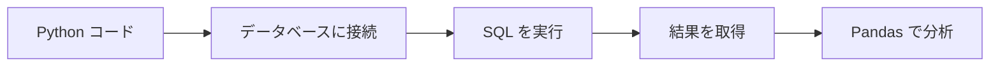
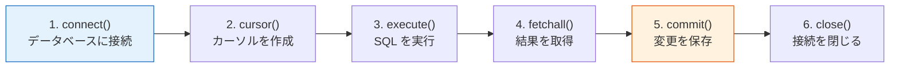

# Python データベース操作


:::tip この節の位置づけ
ここまで来ると、初学者の中には少し混乱し始める人が多いです。

- SQL はもう書ける
- Python も使える

では、なぜわざわざ「Python データベース操作」を学ぶのでしょうか？

一番わかりやすい理解は、次のとおりです。

> **この節は「コードがどうやって本当にデータベースと協力するのか」を解決するためのものです。**

つまり、SQL をもう一度教えるのではなく、次のことを学びます。

- Python でどうやってデータベースに接続するか
- 結果をどうやって取り出すか
- Pandas とどうつなぐか
:::

## 学習目標

- Python の sqlite3 モジュールの基本的な使い方を身につける
- SQL インジェクションを防ぐためのパラメータ化クエリを学ぶ
- Pandas でデータベースを直接読み書きする方法を身につける
- SQLAlchemy の基本概念を理解する

---

## まず全体像をつかもう

Python のデータベース操作は、「接続 -> 実行 -> 取得 -> Pandas に渡す」という流れで考えると理解しやすいです。



この節で本当に解決したいのは、次の2つです。

- Python とデータベースをどうつなぐか
- なぜここが多くのデータプロジェクトの入り口になるのか

## sqlite3 標準ライブラリ

Python には `sqlite3` モジュールが標準で入っているので、インストール不要でそのまま使えます。

### 初学者向けのたとえ

この節は、次のように考えるとわかりやすいです。

- Python で、データが入った引き出しを操作する

`sqlite3` は、たとえるなら：

- 鍵を使って引き出しを開け、表を読んだり書いたりする

`Pandas` は、たとえるなら：

- 引き出しの中のデータを机の上に持ってきて分析する

つまり、この節の大事なポイントは、

- コードとデータベースがつながること

です。

### 基本的な作業フロー



### 完全な例

```python
import sqlite3

# ========== 接続 ==========
# ファイルベースのデータベースに接続（存在しない場合は自動で作成）
conn = sqlite3.connect("example.db")

# またはメモリ上のデータベースを使う（閉じるとデータは消える。テスト向け）
# conn = sqlite3.connect(":memory:")

# カーソルオブジェクトを作成
cursor = conn.cursor()

# ========== テーブル作成 ==========
cursor.execute("""
    CREATE TABLE IF NOT EXISTS students (
        id INTEGER PRIMARY KEY AUTOINCREMENT,
        name TEXT NOT NULL,
        grade INTEGER,
        score REAL
    )
""")

# ========== データ挿入 ==========
# 方法 1：直接挿入
cursor.execute("INSERT INTO students (name, grade, score) VALUES ('張三', 3, 89.5)")

# 方法 2：パラメータ化挿入（おすすめ！）
cursor.execute(
    "INSERT INTO students (name, grade, score) VALUES (?, ?, ?)",
    ("李四", 2, 92.0)
)

# 方法 3：まとめて挿入
students = [
    ("王五", 3, 76.5),
    ("趙六", 1, 95.0),
    ("銭七", 2, 88.0),
    ("孫八", 1, 70.5),
]
cursor.executemany(
    "INSERT INTO students (name, grade, score) VALUES (?, ?, ?)",
    students
)

# 保存を忘れずに！
conn.commit()

# ========== データ取得 ==========
# fetchall()：すべての結果を取得
cursor.execute("SELECT * FROM students")
all_rows = cursor.fetchall()
print("すべての学生：", all_rows)

# fetchone()：1件取得
cursor.execute("SELECT * FROM students WHERE name = '張三'")
one_row = cursor.fetchone()
print("張三：", one_row)

# fetchmany(n)：n件取得
cursor.execute("SELECT * FROM students ORDER BY score DESC")
top3 = cursor.fetchmany(3)
print("上位3人：", top3)

# ========== 列名の取得 ==========
cursor.execute("SELECT * FROM students")
col_names = [desc[0] for desc in cursor.description]
print("列名：", col_names)  # ['id', 'name', 'grade', 'score']

# ========== 終了 ==========
conn.close()
```

### この例でまず覚えるべきこと

まず覚えるべきなのは、次の順番です。

1. まずデータベースに接続する
2. 次にカーソルを作る
3. そのあと SQL を実行する
4. 最後に結果を取得して変更を保存する

最初から全部のメソッドを覚える必要はありません。  
まずはこの流れをしっかりつかむことが大切です。

---

## パラメータ化クエリ：SQL インジェクションを防ぐ

:::danger SQL インジェクションとは？
SQL インジェクションは、最もよくあるセキュリティ脆弱性のひとつです。攻撃者が悪意のある入力を使って SQL 文を改ざんします。
:::

### 悪い書き方（危険！）

```python
# ❌ 文字列を絶対に直接つなげない！
user_input = "張三"
sql = f"SELECT * FROM students WHERE name = '{user_input}'"
cursor.execute(sql)

# もしユーザー入力が次なら：  ' OR '1'='1
# SQL はこうなる：SELECT * FROM students WHERE name = '' OR '1'='1'
# これで全データが返ってしまう！
```

### 正しい書き方（安全！）

```python
# ✅ ? プレースホルダーを使う
user_input = "張三"
cursor.execute("SELECT * FROM students WHERE name = ?", (user_input,))

# ✅ 複数パラメータ
cursor.execute(
    "SELECT * FROM students WHERE grade = ? AND score > ?",
    (3, 80.0)
)
```

:::tip 一言で覚える
**SQL は必ず `?` プレースホルダーを使い、f-string や文字列連結で作らないこと。**
:::

### 初学者がまず覚えるとよい判断基準

次のような形が頭に浮かんだら、

- `f"SELECT ... {user_input} ..."`

すぐに警戒してください。  
初学者にとって一番安全な習慣は、

- ユーザー入力があるなら、必ずパラメータ化クエリを使う

ことです。

---

## with 文で接続を管理する

```python
import sqlite3

# おすすめの書き方：with が自動で commit と close を管理
with sqlite3.connect("example.db") as conn:
    cursor = conn.cursor()

    cursor.execute("SELECT * FROM students WHERE score > ?", (85,))
    results = cursor.fetchall()

    for row in results:
        print(row)
    # with ブロックが終わると自動で commit（例外がなければ）
    # 例外がある場合は自動で rollback
```

---

## Row ファクトリ：辞書のように結果を読む

デフォルトでは、検索結果はタプルとして返るので、`row[0]` のようにインデックスでアクセスします。`Row` ファクトリを使うと、列名でアクセスできます。

```python
import sqlite3

conn = sqlite3.connect("example.db")
conn.row_factory = sqlite3.Row  # 重要な設定

cursor = conn.cursor()
cursor.execute("SELECT * FROM students WHERE name = '張三'")
row = cursor.fetchone()

# 列名でアクセスできる！
print(row["name"])   # 張三
print(row["score"])  # 89.5
print(dict(row))     # {'id': 1, 'name': '張三', 'grade': 3, 'score': 89.5}

conn.close()
```

---

## Pandas + データベース：最強の組み合わせ

Pandas はデータベースを直接読み書きできます。これは実務でとてもよく使われる方法です。

### なぜここが特に大事なのか？

実務では、次の流れがとてもよくあります。

1. まず SQL で必要なデータを取り出す
2. そのあと Pandas で複雑な分析や可視化をする

つまり、この節は

- データベース
- Pandas

を本当に接続するためのものです。

### データベースから DataFrame に読み込む

```python
import pandas as pd
import sqlite3

conn = sqlite3.connect("example.db")

# 方法 1：read_sql_query（おすすめ）
df = pd.read_sql_query("SELECT * FROM students", conn)
print(df)
#    id name  grade  score
# 0   1   張三      3   89.5
# 1   2   李四      2   92.0
# 2   3   王五      3   76.5
# ...

# 方法 2：条件付きで検索
df_top = pd.read_sql_query(
    "SELECT name, score FROM students WHERE score > 85 ORDER BY score DESC",
    conn
)
print(df_top)

# 方法 3：read_sql_table（テーブル全体を読む）
df_all = pd.read_sql_table("students", conn)  # SQLAlchemy が必要

conn.close()
```

### DataFrame をデータベースに書き込む

```python
import pandas as pd
import sqlite3

# DataFrame を作成
df_new = pd.DataFrame({
    "name": ["周九", "呉十", "鄭十一"],
    "grade": [2, 3, 1],
    "score": [85.5, 91.0, 78.0]
})

conn = sqlite3.connect("example.db")

# データベースに書き込む
df_new.to_sql(
    "new_students",     # テーブル名
    conn,
    if_exists="replace",  # テーブルが存在する場合：replace 上書き / append 追加 / fail エラー
    index=False           # DataFrame のインデックスを書き込まない
)

# 確認
df_check = pd.read_sql_query("SELECT * FROM new_students", conn)
print(df_check)

conn.close()
```

### 実務の流れ：データベース → Pandas → 分析

```python
import pandas as pd
import sqlite3

conn = sqlite3.connect("example.db")

# 1. SQL でまず絞り込みと結合を行う（データベースのインデックスを活用して高速化）
df = pd.read_sql_query("""
    SELECT s.name, s.grade, s.score
    FROM students s
    WHERE s.score > 60
    ORDER BY s.score DESC
""", conn)

# 2. Pandas で複雑な分析を行う
print("各学年の平均点：")
print(df.groupby("grade")["score"].mean())

print("\n成績の分布：")
print(df["score"].describe())

conn.close()
```

:::tip ベストプラクティス
- **大きなデータの絞り込み**：まず SQL の WHERE で絞って、Pandas に渡すデータ量を減らす
- **複雑な分析**：SQL で絞ったあと、Pandas で集計や可視化などを行う
- **結果の書き戻し**：分析後に `to_sql()` で結果をデータベースに保存する
:::

## 初学者がそのまま使えるデータベース連携の順番

Python とデータベースを初めて連携するときは、次の順番が一番安定しています。

1. まずデータベースに接続する
2. まず一番簡単な検索をしてみる
3. 次にパラメータ化クエリを試す
4. 次に結果を Pandas に読み込む
5. 最後にデータを書き戻す

この順番のほうが、最初から全部をまとめて扱うよりずっと理解しやすいです。

### 初学者向けの選択表

| 何をしたいか | まず選ぶとよい方法 |
|---|---|
| 大きな表を検索・絞り込みしたい | まず SQL |
| 複雑な集計やグラフを作りたい | まず結果を Pandas に渡す |
| 分析結果を保存したい | `to_sql()` |

この表は、初学者にとってとても役立ちます。  
「SQL と Pandas のどちらを先に使うべきか」を判断しやすくなるからです。

---

## SQLAlchemy の紹介

SQLAlchemy は、Python で最も人気のあるデータベース用ライブラリのひとつです。複数のデータベースに対応し、ORM（オブジェクト関係マッピング）も提供します。

```python
# インストール
# pip install sqlalchemy

from sqlalchemy import create_engine
import pandas as pd

# エンジンを作成（接続先が変わっても URL を変えるだけ）
engine = create_engine("sqlite:///example.db")

# SQLite:  sqlite:///ファイルパス
# MySQL:   mysql+pymysql://ユーザー:パスワード@ホスト:ポート/データベース
# PostgreSQL: postgresql://ユーザー:パスワード@ホスト:ポート/データベース

# Pandas と SQLAlchemy を組み合わせて使う
df = pd.read_sql("SELECT * FROM students", engine)
print(df)

# 書き込み
df.to_sql("students_backup", engine, if_exists="replace", index=False)
```

:::info どんなときに SQLAlchemy を使う？
- SQLite だけを使うなら → `sqlite3` で十分
- MySQL/PostgreSQL に接続するなら → SQLAlchemy を使う
- Web 開発をするなら → SQLAlchemy の ORM 機能を使う
:::

## この節で特に持ち帰ってほしいこと

- この節で本当に大事なのは、「接続コードを書けること」ではなく、Python・SQL・Pandas がどう協力するかを理解することです
- 外部入力があるときは、常にパラメータ化クエリを優先する
- 実際のデータプロジェクトでは、よくある流れは「SQL で先に絞り込み、Pandas で分析する」です

---

## 完全実践：学生成績管理

```python
import sqlite3
import pandas as pd

class StudentDB:
    """シンプルな学生成績管理システム"""

    def __init__(self, db_path="students.db"):
        self.conn = sqlite3.connect(db_path)
        self.conn.row_factory = sqlite3.Row
        self._create_table()

    def _create_table(self):
        self.conn.execute("""
            CREATE TABLE IF NOT EXISTS students (
                id INTEGER PRIMARY KEY AUTOINCREMENT,
                name TEXT NOT NULL,
                subject TEXT NOT NULL,
                score REAL CHECK(score >= 0 AND score <= 100)
            )
        """)
        self.conn.commit()

    def add_student(self, name, subject, score):
        """成績を追加する"""
        self.conn.execute(
            "INSERT INTO students (name, subject, score) VALUES (?, ?, ?)",
            (name, subject, score)
        )
        self.conn.commit()
        print(f"✅ 追加しました: {name} - {subject}: {score}")

    def query_by_name(self, name):
        """名前で検索する"""
        cursor = self.conn.execute(
            "SELECT * FROM students WHERE name = ?", (name,)
        )
        return [dict(row) for row in cursor.fetchall()]

    def get_ranking(self, subject):
        """ある科目の順位を取得する"""
        df = pd.read_sql_query(
            "SELECT name, score FROM students WHERE subject = ? ORDER BY score DESC",
            self.conn,
            params=(subject,)
        )
        df["順位"] = range(1, len(df) + 1)
        return df

    def get_stats(self):
        """統計情報を取得する"""
        return pd.read_sql_query("""
            SELECT subject AS 科目,
                   COUNT(*) AS 人数,
                   ROUND(AVG(score), 1) AS 平均点,
                   MAX(score) AS 最高点,
                   MIN(score) AS 最低点
            FROM students
            GROUP BY subject
        """, self.conn)

    def close(self):
        self.conn.close()


# 使用例
db = StudentDB(":memory:")

# データを追加
for name, subject, score in [
    ("張三", "数学", 89), ("張三", "英語", 75),
    ("李四", "数学", 92), ("李四", "英語", 88),
    ("王五", "数学", 76), ("王五", "英語", 95),
]:
    db.add_student(name, subject, score)

# 検索
print("\n張三の成績:", db.query_by_name("張三"))
print("\n数学の順位:")
print(db.get_ranking("数学"))
print("\n各科目の統計:")
print(db.get_stats())

db.close()
```

---

## まとめ

| 方法 | 適用場面 | 特徴 |
|------|---------|------|
| `sqlite3` | SQLite データベース | Python 標準、追加インストール不要 |
| `pd.read_sql_query()` | SQL → DataFrame | 分析にとても便利 |
| `df.to_sql()` | DataFrame → データベース | 1 行で書き込みできる |
| `SQLAlchemy` | 複数のデータベース | 汎用性が高い |

**基本原則：**
- `?` プレースホルダーを使い、SQL を連結しない
- `with` で接続を管理する
- 大きなデータはまず SQL で絞り込み、そのあと Pandas で分析する

---

## ハンズオン練習

### 練習 1：基本 CRUD

```python
# SQLite データベースを作成する
# books テーブル（書名、著者、価格、出版年）を作る
# 5 冊の本を挿入する
# 価格が 50 より大きい本を検索する
# ある本の価格を 99 に更新する
# 出版年が最も古い本を削除する
```

### 練習 2：Pandas 連携

```python
# 1. pd.read_sql_query を使って books テーブルを DataFrame に読み込む
# 2. Pandas で著者ごとの平均書籍価格を計算する
# 3. 計算結果を to_sql でデータベースの新しいテーブルに書き戻す
```

### 練習 3：クラスを作る

```python
# 上の StudentDB の例を参考にする
# TodoDB クラスを作って、ToDo 管理を実装する：
# - タスクを追加する
# - 完了にする
# - 状態で検索する
# - 完了率を集計する
```
