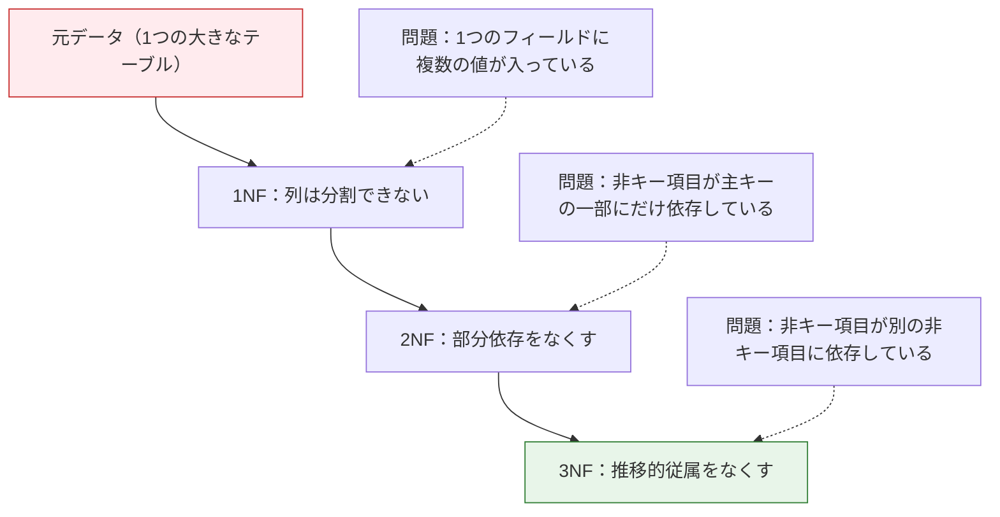
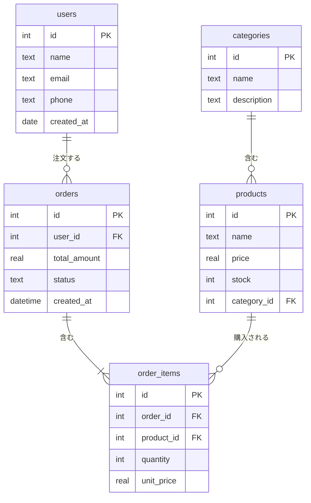
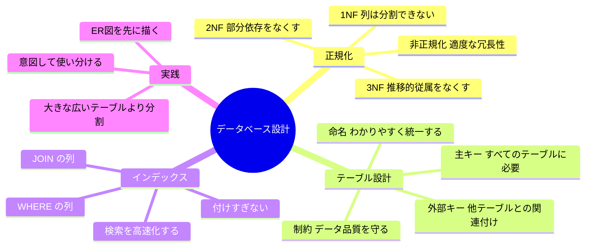

# 3.5.5 データベース設計


:::tip この節の位置づけ
データベース設計を初めて学ぶ人は、次のことに意識が向きがちです。

- 正規形の名前
- ルールの定義

でも、より安定した理解はこうです。

> **データベース設計の本質は、重複を減らし、衝突を減らし、あとで保守するときの事故を減らすことです。**

だからこの節でいちばん大事なのは用語を暗記することではなく、「設計が悪いと何が起きるのか」を先に理解することです。
:::

## 学習目標

- なぜ良いデータベース設計が必要なのかを理解する
- データベース正規化の核心をつかむ
- テーブル構造とリレーションの設計方法を学ぶ
- インデックスの役割と使うタイミングを理解する

---

## まず地図を作ろう

データベース設計は、「先にテーブルを分けて、次にテーブルをつなぎ、最後にインデックスを補う」と考えると理解しやすいです。


この節で本当に解決したいのは、次のことです。

- なぜテーブルをむやみに1つにまとめてはいけないのか
- なぜ設計の問題が、最終的にデータ品質と検索効率の問題になるのか

## なぜ設計が重要なのか？

よくないデータベース設計は、次のような問題を引き起こします。

| 問題 | 結果 |
|------|------|
| データの重複 | 同じ情報を何度も保存するので、容量が無駄になり、修正時に複数箇所を直す必要がある |
| 更新異常 | ある場所だけ直して別の場所を直し忘れ、データが矛盾する |
| 挿入異常 | 新しい情報を追加したいだけなのに、存在しない関連データまで無理に作る必要がある |
| 削除異常 | 1件削除しただけなのに、ほかの必要な情報まで失う |

### 初学者向けのたとえ

データベース設計は、次のように考えるとわかりやすいです。

- 先に倉庫の棚をきちんと設計してから、物を入れる

最初から棚がぐちゃぐちゃだと、

- 同じ種類の物があちこちに置かれる
- 1つの物が何重にも存在する
- 取り出すときに見つけにくい

その結果、あとでの保守コストがどんどん高くなります。

---

## データベース正規化

正規化（Normal Form）は、上のような問題を避けるための設計ルールです。まずは最初の3つの正規形の考え方を押さえましょう。

### 第1正規形（1NF）：列は分割できない

**ルール：** 各フィールドには1つの値だけを入れます。リストやカンマ区切りの複数値は入れません。

```
❌ 1NF違反：
| name | phones                    |
|------|---------------------------|
| 三郎 | 138xxxx, 139xxxx, 186xxxx |   ← 1つのフィールドに複数の値が入っている

✅ 1NFに適合：
| name | phone    |
|------|----------|
| 三郎 | 138xxxx  |
| 三郎 | 139xxxx  |
| 三郎 | 186xxxx  |
```

### 第2正規形（2NF）：部分関数従属をなくす

**ルール：** 1NFを満たしたうえで、非主キー項目は主キー全体に完全に依存しなければなりません。主キーの一部だけに依存してはいけません。

```
❌ 2NF違反（複合主キー = 学生ID + コースID）：
| student_id | course_id | student_name | course_name | score |
|------------|-----------|--------------|-------------|-------|
| 1          | C01       | 三郎         | 数学        | 89    |

student_name は student_id にだけ依存していて、course_id には依存していない
→ 部分依存

✅ 2NFに適合（3つのテーブルに分割）：
students: student_id, student_name
courses:  course_id, course_name
scores:   student_id, course_id, score
```

### 第3正規形（3NF）：推移的従属をなくす

**ルール：** 2NFを満たしたうえで、非主キー項目が別の非主キー項目に依存してはいけません。

```
❌ 3NF違反：
| employee_id | name | dept_id | dept_name | dept_manager |
|-------------|------|---------|-----------|--------------|

dept_name と dept_manager は employee_id ではなく dept_id に依存している
→ 推移的従属: employee_id → dept_id → dept_name

✅ 3NFに適合（テーブル分割）：
employees:   employee_id, name, dept_id
departments: dept_id, dept_name, dept_manager
```

### 正規化のまとめ



:::tip 実務では正規化にこだわりすぎなくてよい
正規化は理論上の指針です。実際の設計では、あえて**非正規化**して、適度な冗長性と引き換えに検索性能を上げることがあります。たとえばユーザーテーブルに `city_id` と `city_name` の両方を持たせると、毎回 JOIN しなくて済みます。
:::

### 初学者がまず覚えやすい正規化の速習表

| 正規形 | まず覚えるべき直感 |
|---|---|
| 1NF | 1つのマスに複数の値を入れない |
| 2NF | 非主キー項目は複合主キーの一部だけに依存しない |
| 3NF | 非主キー項目は別の非主キー項目を経由して依存しない |

この表は、抽象的な正規化を実用的な言葉に置き換えてくれるので、初心者にとても向いています。

---

## 実践：ECサイトのデータベースを設計する

### 要件分析

シンプルなECシステムでは、次の情報を管理する必要があります。
- ユーザー情報
- 商品情報
- 商品カテゴリ
- 注文と注文明細

### ER図（実体関連図）



### 設計上の重要ポイント

**なぜ注文は orders + order_items の2つのテーブルに分けるのか？**

```
❌ 1つのテーブル：
| order_id | user_id | product1 | qty1 | product2 | qty2 | ...
この形だと列数が固定できず、1NFに違反する

❌ 注文情報の重複：
| order_id | user_id | total | product  | quantity |
| 1        | 佐藤太郎 | 8998  | iPhone   | 1        |
| 1        | 佐藤太郎 | 8998  | AirPods  | 1        |
order_id、user_id、total が重複していて、2NFに違反する

✅ 2つのテーブルに分ける：
orders:      order_id, user_id, total_amount, status
order_items: item_id, order_id, product_id, quantity, unit_price
```

### SQLiteで実装する

```python
import sqlite3

conn = sqlite3.connect(":memory:")
cursor = conn.cursor()

# テーブルを作成
cursor.executescript("""
    CREATE TABLE categories (
        id INTEGER PRIMARY KEY AUTOINCREMENT,
        name TEXT NOT NULL UNIQUE
    );

    CREATE TABLE products (
        id INTEGER PRIMARY KEY AUTOINCREMENT,
        name TEXT NOT NULL,
        price REAL NOT NULL CHECK(price > 0),
        stock INTEGER DEFAULT 0,
        category_id INTEGER,
        FOREIGN KEY (category_id) REFERENCES categories(id)
    );

    CREATE TABLE users (
        id INTEGER PRIMARY KEY AUTOINCREMENT,
        name TEXT NOT NULL,
        email TEXT UNIQUE,
        created_at TEXT DEFAULT CURRENT_TIMESTAMP
    );

    CREATE TABLE orders (
        id INTEGER PRIMARY KEY AUTOINCREMENT,
        user_id INTEGER NOT NULL,
        total_amount REAL DEFAULT 0,
        status TEXT DEFAULT 'pending',
        created_at TEXT DEFAULT CURRENT_TIMESTAMP,
        FOREIGN KEY (user_id) REFERENCES users(id)
    );

    CREATE TABLE order_items (
        id INTEGER PRIMARY KEY AUTOINCREMENT,
        order_id INTEGER NOT NULL,
        product_id INTEGER NOT NULL,
        quantity INTEGER NOT NULL CHECK(quantity > 0),
        unit_price REAL NOT NULL,
        FOREIGN KEY (order_id) REFERENCES orders(id),
        FOREIGN KEY (product_id) REFERENCES products(id)
    );
""")

# サンプルデータを挿入
cursor.executescript("""
    INSERT INTO categories (name) VALUES ('スマートフォン'), ('アクセサリー'), ('パソコン');

    INSERT INTO products (name, price, stock, category_id) VALUES
        ('iPhone 16', 7999, 100, 1),
        ('AirPods Pro', 1899, 200, 2),
        ('MacBook Pro', 14999, 50, 3),
        ('スマホケース', 39, 500, 2);

    INSERT INTO users (name, email) VALUES
        ('佐藤太郎', 'sato@mail.com'),
        ('鈴木花子', 'suzuki@mail.com');

    INSERT INTO orders (user_id, total_amount, status) VALUES
        (1, 9898, 'completed'),
        (2, 14999, 'shipped');

    INSERT INTO order_items (order_id, product_id, quantity, unit_price) VALUES
        (1, 1, 1, 7999),
        (1, 2, 1, 1899),
        (2, 3, 1, 14999);
""")

conn.commit()
```

### よく使う検索の例

```python
import pandas as pd

# 各ユーザーの注文詳細を取得
df = pd.read_sql_query("""
    SELECT
        u.name AS ユーザー,
        o.id AS 注文番号,
        p.name AS 商品,
        oi.quantity AS 数量,
        oi.unit_price AS 単価,
        oi.quantity * oi.unit_price AS 小計,
        o.status AS ステータス
    FROM order_items oi
    JOIN orders o ON oi.order_id = o.id
    JOIN users u ON o.user_id = u.id
    JOIN products p ON oi.product_id = p.id
""", conn)
print(df)

# 各カテゴリの売上を集計
df_category = pd.read_sql_query("""
    SELECT
        c.name AS カテゴリ,
        COUNT(oi.id) AS 販売回数,
        SUM(oi.quantity * oi.unit_price) AS 総売上
    FROM categories c
    LEFT JOIN products p ON c.id = p.category_id
    LEFT JOIN order_items oi ON p.id = oi.product_id
    GROUP BY c.id, c.name
    ORDER BY 総売上 DESC
""", conn)
print(df_category)
```

---

## インデックス（Index）

### インデックスとは？

インデックスは本の目次のようなものです。目次がなければ、目的の言葉を探すために本全体をめくる必要があります。目次があれば、該当ページにすぐたどり着けます。

| 場面 | インデックスなし | インデックスあり |
|------|--------|--------|
| 100万行から1件を探す | 全100万行を走査する | すぐに絞り込めるので、数ミリ秒で見つかる |
| 検索の仕組み | 1行ずつ比較する（フルテーブルスキャン） | B-Treeで検索する（対数時間） |

### インデックスの作成と利用

```sql
-- email列にインデックスを作成（email検索を高速化）
CREATE INDEX idx_users_email ON users(email);

-- order_date列にインデックスを作成
CREATE INDEX idx_orders_date ON orders(created_at);

-- 複合インデックス（複数列）
CREATE INDEX idx_items_order_product ON order_items(order_id, product_id);

-- テーブルのインデックスを確認
-- SQLite: PRAGMA index_list('users');
-- MySQL:  SHOW INDEX FROM users;
```

### いつインデックスを付けるべき？

| インデックスを付けるべき | インデックスが不要なことが多い |
|-----------|-------------|
| WHERE条件でよく使う列 | あまり検索に使わない列 |
| JOINで結合に使う列 | データ量が少ないテーブル（数百行程度） |
| ORDER BYでよく並べ替える列 | 更新が頻繁な列（インデックスも更新が必要） |
| 一意性が必要な列 | 重複率が高い列（例：性別） |

:::tip インデックスのコスト
インデックスは無料ではありません。各インデックスは追加の保存領域を使い、挿入・更新・削除のたびにインデックスも更新する必要があります。だから、すべての列にインデックスを付けるのではなく、検索のボトルネックになっている列だけに付けましょう。
:::

### 初学者向けのインデックス判断表

| 場面 | まず考えること |
|---|---|
| ある列を WHERE でよく絞り込む | インデックスを検討する |
| ある列を JOIN でよく使う | インデックスを検討する |
| テーブルが小さい | まずは急いで付けなくてよい |
| 列の更新頻度がとても高い | インデックスはより慎重に考える |

この表は、「いつインデックスを作るべきか」を具体的な判断に変えてくれるので、初心者に向いています。

---

## 設計チェックリスト

データベースを設計するたびに、このチェックリストで確認しましょう。

```
☐ すべてのテーブルに主キーがあるか？
☐ フィールド名はわかりやすく、命名ルールが統一されているか？（snake_case 推奨）
☐ データ型は適切か？（整数は INTEGER、金額は REAL）
☐ 必須フィールドに NOT NULL を付けたか？
☐ 一意であるべき項目に UNIQUE を付けたか？（例：email）
☐ テーブル間の関係を外部キーで作っているか？
☐ 第3正規形を満たしているか？（または意図的に非正規化しているか）
☐ よく検索する列にインデックスを付けたか？
☐ 適切なデフォルト値があるか？（例：status DEFAULT 'active'）
☐ 作成時刻を記録する created_at があるか？
```

## この節でいちばん持ち帰ってほしいこと

- データベース設計で大事なのは、「見た目がきれいなテーブル」を作ることではなく、あとで保守しやすく、矛盾しにくい構造にすること
- 正規化は、重複や異常を減らすための考え方であって、単なる理論暗記ではない
- インデックスは多ければよいわけではなく、実際の検索場面に合わせて使うことが大事

---

## まとめ



| 原則 | 説明 |
|------|------|
| まず ER 図を描く | テーブルを作る前に、実体と関係を整理する |
| 正規化を守る | 重複と異常を減らす |
| 適度に非正規化する | 冗長性を使って性能を上げる |
| インデックスを活用する | 重要な検索を速くする |
| 設計してから実装する | データベース構造の変更は、コード変更よりずっと大変 |

---

## अभ्यासしてみよう

### 練習1：正規化の問題を見つける

```
次のテーブル設計にはどんな問題がありますか？どの正規形に違反していますか？どう直しますか？

テーブル：student_courses
| student_id | student_name | student_phone       | course_id | course_name | teacher   | score |
|------------|-------------|---------------------|-----------|-------------|-----------|-------|
| 1          | 張三        | 138xxxx, 139xxxx    | C01       | 数学        | 李先生    | 89    |
| 1          | 張三        | 138xxxx, 139xxxx    | C02       | 英語        | 王先生    | 75    |
| 2          | 李四        | 186xxxx             | C01       | 数学        | 李先生    | 92    |
```

### 練習2：ブログシステムを設計する

```
次の要件を満たす、シンプルなブログシステムのデータベースを設計してください。
- ユーザー登録とログイン
- 記事の投稿（タイトル、本文、カテゴリあり）
- 記事へのコメント
- 記事タグ（1つの記事に複数のタグを付けられる）

要件：
1. ER図を描く（紙とペンでも Mermaid でもよい）
2. CREATE TABLE 文を書く
3. どの列にインデックスを付けるべきか考える
```

### 練習3：実装して検索してみる

```python
# SQLite で練習2の設計を実装する
# サンプルデータを挿入する
# 次の検索を完成させる：
# 1. あるユーザーが投稿したすべての記事を検索する
# 2. ある記事のすべてのコメントを検索する（コメントした人の名前を含む）
# 3. 各カテゴリごとの記事数を検索する
# 4. "Python" タグが付いたすべての記事を検索する
```
