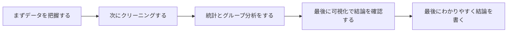
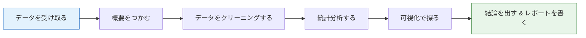
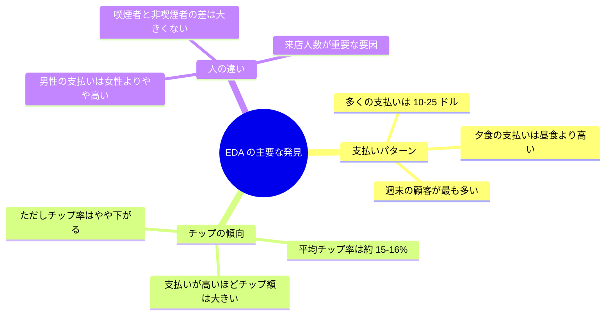

# 3.6.1 実戦プロジェクト：探索的データ分析（EDA）


:::tip プロジェクトの位置づけ
これは 3 データ分析と可視化の**総合実戦プロジェクト**です。前の章で学んだ NumPy、Pandas、Matplotlib/Seaborn の知識を使って、実際のデータセットに対して探索的データ分析を一通り行います。
:::

## まず地図を作ろう

初めて EDA プロジェクトをするなら、いちばん安定した順番は「先に図を全部描く」ではなく、まず全体像をつかむことです。



このプロジェクトで本当に練習したいのは、次のことです。

- 何枚図が描けるか、ではない
- 「データを見る -> 結論を出す」を一つの流れとして進められるか

## プロジェクト概要

**探索的データ分析（Exploratory Data Analysis, EDA）** は、データサイエンスプロジェクトの最初のステップです。モデリングの前に、統計と可視化を使ってデータの中身をしっかり把握します。



### 初心者向けのたとえ

EDA は、次のように考えるとわかりやすいです。

- モデルを作る前の現地調査

地形が見えていないのに、いきなり工事は始めません。  
データ分析も同じで、まだ次のような点を確認していないのに、

- 分布
- 欠損
- 異常値
- 変数同士の関係

すぐにモデリングへ進むのはよくありません。

### このプロジェクトで身につくスキル

| スキル | 対応章 |
|------|---------|
| Pandas によるデータ読み込みとクリーニング | 第 3 章 |
| 統計サマリーとグループ集計 | 第 3 章 |
| Matplotlib / Seaborn による可視化 | 第 4 章 |
| NumPy による数値計算 | 第 2 章 |

### プロジェクト成果物

完成すると、データの概要、クリーニングの過程、統計的な発見、可視化グラフを含む**完全な EDA 分析レポート**（Jupyter Notebook）ができます。

---

## 一、プロジェクト準備

### データセットの選択

Seaborn に内蔵されている **`tips` データセット** を使います。アメリカのレストランでのチップ記録です。

| フィールド | 意味 | 種類 |
|------|------|------|
| `total_bill` | 合計金額（ドル） | 連続型 |
| `tip` | チップ金額（ドル） | 連続型 |
| `sex` | 顧客の性別 | カテゴリ型 |
| `smoker` | 喫煙するかどうか | カテゴリ型 |
| `day` | 曜日 | カテゴリ型 |
| `time` | 昼食/夕食 | カテゴリ型 |
| `size` | 来店人数 | 離散型 |

:::info なぜこのデータセットを選ぶの？
- 内蔵データなので**ダウンロード不要**、1 行で読み込める
- 変数の種類が豊富（連続型 + カテゴリ型）
- データ量が適度（244 行）で学習向き
- 仕事内容がイメージしやすい。誰でもレストランに行ったことがある
:::

### 環境構築

```python
# 必要なライブラリをすべてインポート
import numpy as np
import pandas as pd
import matplotlib.pyplot as plt
import seaborn as sns

# 日本語表示の設定（macOS）
plt.rcParams['font.sans-serif'] = ['Arial Unicode MS']
# Windows ユーザーは次を使えます：plt.rcParams['font.sans-serif'] = ['SimHei']
plt.rcParams['axes.unicode_minus'] = False

# Seaborn のテーマを設定
sns.set_theme(style="whitegrid", font_scale=1.1)

# Jupyter でグラフをインライン表示
# %matplotlib inline
```

### データの読み込み

```python
# 内蔵データセットを読み込む
tips = sns.load_dataset("tips")

# まずは全体を確認する
print(f"データセットのサイズ：{tips.shape[0]} 行 × {tips.shape[1]} 列")
tips.head(10)
```

出力例：

| | total_bill | tip | sex | smoker | day | time | size |
|---|-----------|-----|-----|--------|-----|------|------|
| 0 | 16.99 | 1.01 | Female | No | Sun | Dinner | 2 |
| 1 | 10.34 | 1.66 | Male | No | Sun | Dinner | 3 |
| 2 | 21.01 | 3.50 | Male | No | Sun | Dinner | 3 |
| 3 | 23.68 | 3.31 | Male | No | Sun | Dinner | 2 |
| 4 | 24.59 | 3.61 | Female | No | Sun | Dinner | 4 |

---

## 二、データの概要を確認する

EDA の最初のステップは、いきなり図を描くことではなく、データの大きさ、各列の型、欠損値の有無を確認することです。

### データを見るとき、最初に何を聞くべき？

まず次の 4 つを確認するのがおすすめです。

1. この表の大きさは？
2. 各列の型は？
3. 欠損値はある？
4. 主要な分析対象の列はどんな分布？

この 4 つがわかると、その後の分析がかなり進めやすくなります。

### 基本情報

```python
# データ型と非 null 件数
tips.info()
```

出力では次のことがわかります。

- 7 列、244 行
- 欠損値なし（Non-Null Count がすべて 244）
- `total_bill` と `tip` は float64
- `sex`、`smoker`、`day`、`time` は category

```python
# 統計サマリー
tips.describe()
```

| | total_bill | tip | size |
|---|-----------|-----|------|
| count | 244.0 | 244.0 | 244.0 |
| mean | 19.79 | 3.00 | 2.57 |
| std | 8.90 | 1.38 | 0.95 |
| min | 3.07 | 1.00 | 1.00 |
| 25% | 13.35 | 2.00 | 2.00 |
| 50% | 17.80 | 2.90 | 2.00 |
| 75% | 24.13 | 3.56 | 3.00 |
| max | 50.81 | 10.00 | 6.00 |

**発見**：
- 平均の支払いは約 19.79 ドル、チップは約 3.00 ドル
- チップの最小値は 1 ドル、最大値は 10 ドル
- 来店人数は 2 人が多い

### カテゴリ変数の分布

```python
# カテゴリ変数の各値の件数
for col in ['sex', 'smoker', 'day', 'time']:
    print(f"\n--- {col} ---")
    print(tips[col].value_counts())
```

**発見**：
- 男性客のほうが女性客より多い（157 vs 87）
- 喫煙しない人のほうが喫煙する人より多い（151 vs 93）
- 土曜と日曜のデータが多い
- 夕食のデータが昼食よりかなり多い（176 vs 68）

### 派生特徴量を追加する

よい分析者は、**新しい特徴量を作って** 規則性を見つけやすくします。

```python
# チップ率 = チップ / 合計金額
tips['tip_pct'] = (tips['tip'] / tips['total_bill'] * 100).round(2)

# 1 人あたりの支払額
tips['per_person'] = (tips['total_bill'] / tips['size']).round(2)

tips[['total_bill', 'tip', 'tip_pct', 'per_person']].head()
```

| | total_bill | tip | tip_pct | per_person |
|---|-----------|-----|---------|-----------|
| 0 | 16.99 | 1.01 | 5.94 | 8.50 |
| 1 | 10.34 | 1.66 | 16.05 | 3.45 |
| 2 | 21.01 | 3.50 | 16.66 | 7.00 |
| 3 | 23.68 | 3.31 | 13.97 | 11.84 |
| 4 | 24.59 | 3.61 | 14.68 | 6.15 |

---

## 三、データクリーニング——データ品質を確認する

このデータセットはかなりきれいですが、実際のプロジェクトではこの工程がいちばん時間を使うことも多いです。ここでも一通り確認します。

### 欠損値の確認

```python
# 欠損値の集計
missing = tips.isnull().sum()
print("欠損値の集計：")
print(missing[missing > 0] if missing.sum() > 0 else "欠損値なし ✓")
```

### 重複値の確認

```python
# 完全に重複した行
dup_count = tips.duplicated().sum()
print(f"重複行数：{dup_count}")

if dup_count > 0:
    tips = tips.drop_duplicates()
    print(f"重複行を削除しました。残り {len(tips)} 行です")
```

### 異常値の検出

IQR（四分位範囲）法で異常値を調べます。

```python
def detect_outliers_iqr(df, column):
    """IQR 法で異常値を検出する"""
    Q1 = df[column].quantile(0.25)
    Q3 = df[column].quantile(0.75)
    IQR = Q3 - Q1
    lower = Q1 - 1.5 * IQR
    upper = Q3 + 1.5 * IQR
    
    outliers = df[(df[column] < lower) | (df[column] > upper)]
    return outliers, lower, upper

# 各数値列の異常値を確認する
for col in ['total_bill', 'tip', 'tip_pct']:
    outliers, lower, upper = detect_outliers_iqr(tips, col)
    print(f"\n{col}：正常範囲 [{lower:.2f}, {upper:.2f}]、異常値 {len(outliers)} 個")
    if len(outliers) > 0:
        print(f"  異常値の例：{outliers[col].values[:5]}")
```

:::tip 異常値の扱い方
EDA の段階では、**すぐに異常値を削除しない** のが普通です。まずは見つけて、意味を考えます。
- 入力ミスの可能性がある → 修正する
- 実際に起こりうる極端な値 → 残す。ただし分析時に注意する
- 異常値が多すぎる → データ品質に問題があるかもしれない
:::

---

## 四、統計分析——数字で話す

### 基本統計指標

```python
# 性別ごとのチップ統計
tips.groupby('sex')[['total_bill', 'tip', 'tip_pct']].agg(['mean', 'median', 'std'])
```

```python
# day ごとのグループ集計
day_stats = tips.groupby('day')[['total_bill', 'tip']].agg(['mean', 'count'])
print(day_stats)
```

### クロス分析

```python
# 透視表：性別 × 喫煙有無 のチップ率
pivot = tips.pivot_table(
    values='tip_pct', 
    index='sex', 
    columns='smoker', 
    aggfunc='mean'
).round(2)

print("チップ率(%)：")
print(pivot)
```

出力例：

| smoker | No | Yes |
|--------|-----|------|
| Female | 15.69 | 18.22 |
| Male | 16.07 | 15.28 |

**発見**：女性の喫煙者のチップ率が最も高く、男性の喫煙者が最も低いです。

### 相関分析

```python
# 数値列の相関係数
numeric_cols = ['total_bill', 'tip', 'size', 'tip_pct', 'per_person']
corr_matrix = tips[numeric_cols].corr().round(3)
print(corr_matrix)
```

**重要な発見**：
- `total_bill` と `tip` は正の相関（約 0.68）→ 支払いが多いほどチップも増える
- `total_bill` と `tip_pct` は負の相関（約 -0.09）→ 支払いが多いほど、チップの**割合**は少し下がる
- `size` と `total_bill` は正の相関（約 0.60）→ 人数が多いほど支払いが高くなる

### 初心者がまず覚えやすい分析の順番

EDA では、次の順番が安定しています。

1. まず単変数の分布を見る
2. 次にカテゴリ変数の件数を見る
3. その次に 2 変数の関係を見る
4. 最後に組み合わせ分析と多次元比較をする

最初から複雑な分割グラフを使うより、この順番のほうが主線をつかみやすいです。

---

## 五、可視化探索——データに語らせる

### 数値分布

```python
fig, axes = plt.subplots(1, 3, figsize=(15, 4))

# 合計金額の分布
axes[0].hist(tips['total_bill'], bins=20, color='steelblue', edgecolor='white')
axes[0].set_title('合計金額の分布')
axes[0].set_xlabel('金額（ドル）')
axes[0].set_ylabel('頻度')

# チップの分布
axes[1].hist(tips['tip'], bins=20, color='coral', edgecolor='white')
axes[1].set_title('チップの分布')
axes[1].set_xlabel('金額（ドル）')

# チップ率の分布
axes[2].hist(tips['tip_pct'], bins=20, color='mediumseagreen', edgecolor='white')
axes[2].set_title('チップ率(%)の分布')
axes[2].set_xlabel('パーセント')

plt.tight_layout()
plt.savefig('01_distribution.png', dpi=150, bbox_inches='tight')
plt.show()
```

**解釈**：合計金額もチップも右に偏った分布です。多くの人は 10〜25 ドルの範囲で支払い、チップは 2〜4 ドルの範囲に集中しています。

### カテゴリ変数の可視化

```python
fig, axes = plt.subplots(2, 2, figsize=(12, 10))

# 曜日ごとの件数
sns.countplot(data=tips, x='day', order=['Thur', 'Fri', 'Sat', 'Sun'], 
              palette='Blues_d', ax=axes[0, 0])
axes[0, 0].set_title('各曜日の顧客数')

# 時間帯
sns.countplot(data=tips, x='time', palette='Set2', ax=axes[0, 1])
axes[0, 1].set_title('昼食 vs 夕食')

# 性別
sns.countplot(data=tips, x='sex', palette='Pastel1', ax=axes[1, 0])
axes[1, 0].set_title('顧客の性別分布')

# 喫煙状態
sns.countplot(data=tips, x='smoker', palette='Pastel2', ax=axes[1, 1])
axes[1, 1].set_title('喫煙 vs 非喫煙')

plt.tight_layout()
plt.savefig('02_categorical.png', dpi=150, bbox_inches='tight')
plt.show()
```

### 重要な関係を探る

#### 支払いとチップの関係

```python
fig, axes = plt.subplots(1, 2, figsize=(14, 5))

# 散布図：支払い vs チップ
sns.scatterplot(data=tips, x='total_bill', y='tip', hue='time', 
                style='smoker', s=80, alpha=0.7, ax=axes[0])
axes[0].set_title('合計金額 vs チップ')
axes[0].set_xlabel('合計金額（ドル）')
axes[0].set_ylabel('チップ（ドル）')

# 回帰線
sns.regplot(data=tips, x='total_bill', y='tip', 
            scatter_kws={'alpha': 0.5}, line_kws={'color': 'red'},
            ax=axes[1])
axes[1].set_title('合計金額 vs チップ（トレンド線付き）')
axes[1].set_xlabel('合計金額（ドル）')
axes[1].set_ylabel('チップ（ドル）')

plt.tight_layout()
plt.savefig('03_bill_vs_tip.png', dpi=150, bbox_inches='tight')
plt.show()
```

**解釈**：支払い金額が高いほどチップも高く、はっきりした線形傾向があります。ただし、いくつかの「外れ値」も見えます。たとえば、40 ドル以上使ってチップが 1.5 ドルしかない人もいます。

#### 場面ごとのチップ比較

```python
fig, axes = plt.subplots(1, 3, figsize=(16, 5))

# 曜日ごとのチップ比較
sns.boxplot(data=tips, x='day', y='tip', 
            order=['Thur', 'Fri', 'Sat', 'Sun'],
            palette='coolwarm', ax=axes[0])
axes[0].set_title('各曜日のチップ分布')

# 時間帯ごとの比較
sns.violinplot(data=tips, x='time', y='tip', 
               palette='Set2', ax=axes[1])
axes[1].set_title('昼食 vs 夕食のチップ分布')

# 来店人数ごとの比較
sns.boxplot(data=tips, x='size', y='tip', 
            palette='YlOrRd', ax=axes[2])
axes[2].set_title('来店人数ごとのチップ')

plt.tight_layout()
plt.savefig('04_tip_comparison.png', dpi=150, bbox_inches='tight')
plt.show()
```

**解釈**：
- 日曜のチップ中央値が最も高い
- 夕食のチップは全体的に昼食より高い（夕食のほうが支払いが多いため）
- 人数が多いほどチップも高い

### 相関ヒートマップ

```python
plt.figure(figsize=(8, 6))

# ヒートマップを描く
sns.heatmap(
    corr_matrix, 
    annot=True,           # 数値を表示
    fmt='.2f',            # 小数点以下 2 桁
    cmap='RdBu_r',        # 赤青配色
    center=0,             # 0 を中心にする
    square=True,          # 正方形のセル
    linewidths=0.5        # 枠線の幅
)
plt.title('数値変数の相関行列')
plt.tight_layout()
plt.savefig('05_correlation.png', dpi=150, bbox_inches='tight')
plt.show()
```

### 複数条件の組み合わせ分析

```python
# FacetGrid：性別と喫煙状態ごとに、支払い-チップの関係を見る
g = sns.FacetGrid(tips, col='sex', row='smoker', 
                  height=4, aspect=1.2, margin_titles=True)
g.map_dataframe(sns.scatterplot, x='total_bill', y='tip', 
                hue='time', alpha=0.7)
g.add_legend()
g.set_axis_labels('合計金額（ドル）', 'チップ（ドル）')
g.fig.suptitle('性別 × 喫煙状態で分割', y=1.02, fontsize=14)
plt.savefig('06_facet.png', dpi=150, bbox_inches='tight')
plt.show()
```

---

## 六、分析結果

一通り EDA を行った結果、次のことがわかりました。

### 主要な発見



### 具体的な結論

1. **支払いとチップは正の相関**：合計金額が高いほどチップ額も高い（相関係数 0.68）ですが、チップ率は少し下がります
2. **夕食の支払いは昼食より高い**：夕食の平均支払いとチップは、昼食より明らかに高いです
3. **週末がピーク**：土曜と日曜は顧客が多く、支払いも高いです
4. **来店人数の影響が大きい**：人数が多いほど、合計支払いが高くなります（相関係数 0.60）
5. **性別差は小さい**：男女でチップ率の差は大きくありません（約 1 ポイント）
6. **喫煙の影響は限定的**：喫煙の有無がチップ率に与える影響は目立ちません

### レストランへの提案

- **週末の夕食** は売上の重要な時間帯なので、サービス品質をしっかり保つ
- 大人数の予約や来店を促すとよい（人数が多いほど支払いもチップも増えやすい）
- 昼食向けにセットメニューを出して、昼の集客を増やす

### 初心者が覚えやすい「結論の書き方」

よい EDA の結論は、単に

- 図をたくさん描いた

ではありません。

次の順番で書くとわかりやすいです。

1. 何がわかったか
2. どの図や統計からわかったか
3. それがビジネス上どういう意味か

この順番がとても大切です。Notebook が「図の集まり」ではなく、「結論のある分析」に変わります。

---

## 七、コードの統合——完全な分析スクリプト

上の分析を、一つのわかりやすいスクリプトにまとめると次のようになります。

```python
"""
Tips データセット - 探索的データ分析（EDA）
====================================
分析目的：レストランの支払いとチップに影響する要因を理解する
"""

# ========== 1. インポートと設定 ==========
import numpy as np
import pandas as pd
import matplotlib.pyplot as plt
import seaborn as sns

plt.rcParams['font.sans-serif'] = ['Arial Unicode MS']
plt.rcParams['axes.unicode_minus'] = False
sns.set_theme(style="whitegrid", font_scale=1.1)


# ========== 2. データ読み込み ==========
tips = sns.load_dataset("tips")
print(f"データセット：{tips.shape[0]} 行 × {tips.shape[1]} 列\n")


# ========== 3. データ概要 ==========
print("=== 基本情報 ===")
tips.info()
print("\n=== 統計サマリー ===")
print(tips.describe().round(2))


# ========== 4. 特徴量エンジニアリング ==========
tips['tip_pct'] = (tips['tip'] / tips['total_bill'] * 100).round(2)
tips['per_person'] = (tips['total_bill'] / tips['size']).round(2)


# ========== 5. データ品質チェック ==========
print(f"\n欠損値：{tips.isnull().sum().sum()}")
print(f"重複行：{tips.duplicated().sum()}")


# ========== 6. 統計分析 ==========
print("\n=== 性別ごとの集計 ===")
print(tips.groupby('sex')[['total_bill', 'tip', 'tip_pct']].mean().round(2))

print("\n=== 曜日ごとの集計 ===")
print(tips.groupby('day')[['total_bill', 'tip']].agg(['mean', 'count']).round(2))

print("\n=== 相関行列 ===")
print(tips[['total_bill', 'tip', 'size', 'tip_pct']].corr().round(3))


# ========== 7. 可視化 ==========
# ここは上の第 5 節の可視化コードを参照してください
# Jupyter Notebook で 1 つずつ実行するのが最も見やすいです

print("\n分析完了！")
```

---

## 八、発展チャレンジ

基本の EDA が終わったら、次のチャレンジも試してみましょう。

### チャレンジ 1：別のデータセットを使う

Seaborn 内蔵の **`diamonds`** データセットで EDA をしてみましょう。

```python
diamonds = sns.load_dataset("diamonds")
print(diamonds.shape)       # 53940 行 × 10 列
print(diamonds.head())
```

分析の方向：
- ダイヤモンドの価格に影響する要因は何か？
- カット（cut）、カラー（color）、クラリティ（clarity）は価格にどう影響するか？
- カラット数（carat）と価格は線形関係か？

### チャレンジ 2：EDA レポートを自動化する

コードで簡単なレポートを自動生成してみましょう。

```python
def quick_eda(df, title="EDA Report"):
    """EDA レポートを素早く生成する"""
    print(f"{'='*50}")
    print(f"  {title}")
    print(f"{'='*50}")
    
    # 基本情報
    print(f"\n📊 データセットのサイズ：{df.shape[0]} 行 × {df.shape[1]} 列")
    
    # データ型の集計
    print(f"\n📋 データ型：")
    print(df.dtypes.value_counts().to_string())
    
    # 欠損値
    missing = df.isnull().sum()
    if missing.sum() > 0:
        print(f"\n⚠️ 欠損値：")
        print(missing[missing > 0].to_string())
    else:
        print(f"\n✅ 欠損値なし")
    
    # 数値列の統計
    num_cols = df.select_dtypes(include=[np.number]).columns
    if len(num_cols) > 0:
        print(f"\n📈 数値列の統計：")
        print(df[num_cols].describe().round(2).to_string())
    
    # カテゴリ列の統計
    cat_cols = df.select_dtypes(include=['object', 'category']).columns
    for col in cat_cols:
        print(f"\n🏷️ {col} の分布：")
        print(df[col].value_counts().head(5).to_string())
    
    return None

# 使用例
quick_eda(tips, "Tips データセットの EDA")
```

### チャレンジ 3：Plotly でインタラクティブ版を作る

第 4 章で Plotly を学んだなら、静的なグラフをインタラクティブ版に置き換えてみましょう。

```python
import plotly.express as px

# インタラクティブな散布図
fig = px.scatter(
    tips, x='total_bill', y='tip', 
    color='time', size='size',
    hover_data=['sex', 'smoker', 'day'],
    title='合計金額 vs チップ（インタラクティブ版）'
)
fig.show()
```

---

## 九、EDA チェックリスト

プロジェクトが終わったら、次の項目を確認しましょう。

| チェック項目 | 完了したか |
|--------|---------|
| データを読み込み、先頭数行を確認した | ☐ |
| `info()` と `describe()` を確認した | ☐ |
| 欠損値と重複値を確認した | ☐ |
| 異常値を検出した | ☐ |
| 意味のある派生特徴量を作成した | ☐ |
| 数値変数の分布図を描いた | ☐ |
| カテゴリ変数の件数図を描いた | ☐ |
| 変数同士の関係を探った（散布図、箱ひげ図） | ☐ |
| 相関ヒートマップを描いた | ☐ |
| 多次元のクロス分析をした（分面図、透視表） | ☐ |
| 価値のある発見を 3〜5 個書いた | ☐ |
| データに基づく提案を書いた | ☐ |

## 初心者がそのまま使える EDA チェック表

初めて EDA プロジェクトをするなら、次のチェック表がいちばん安定です。

1. データの概要をきちんと説明できているか？
2. 欠損値と異常値を整理できているか？
3. 単変数・2変数・グループ分析を少なくとも 1 回ずつ行ったか？
4. 重要な図ごとに、明確な結論を 1 行で書けているか？
5. 最後に、発見をビジネスの提案に変換できているか？

この 5 つができていれば、このプロジェクトはただの「お絵かき練習」ではなく、ちゃんとした分析レポートになっています。

:::tip 次のステップ
EDA の結論が出たら、次のステップは通常**予測モデリング**です。たとえば、チップ率を目的変数にして、他の特徴量から予測する、といった形です。これは第 3、4 段階で学ぶ機械学習の内容です。
:::

---

:::note プロジェクトの振り返り
このプロジェクトでは、データの読み込み → 概要確認 → クリーニング → 統計分析 → 可視化 → 結論づけ、という一連の EDA の流れを体験しました。この流れは、ほとんどすべてのデータサイエンスプロジェクトの最初のステップです。ここをしっかり身につけると、どんなデータセットを見ても「何から始めればいいかわからない」と迷いにくくなります。
:::

## バージョン別の進め方

| バージョン | 目標 | 仕上げの重点 |
|---|---|---|
| 基礎版 | 最小限の流れを通す | 入力・処理・出力ができ、サンプルを 1 つ残す |
| 標準版 | 見せられるプロジェクトにする | 設定、ログ、エラー処理、README、スクリーンショットを追加する |
| チャレンジ版 | ポートフォリオ品質に近づける | 評価、比較実験、失敗例分析、次のステップを追加する |

まずは基礎版を完成させることをおすすめします。最初から全部を盛り込みすぎないでください。バージョンを 1 つ上げるたびに、「何を追加したか、どう確認したか、まだ何が課題か」を README に書き足しましょう。
