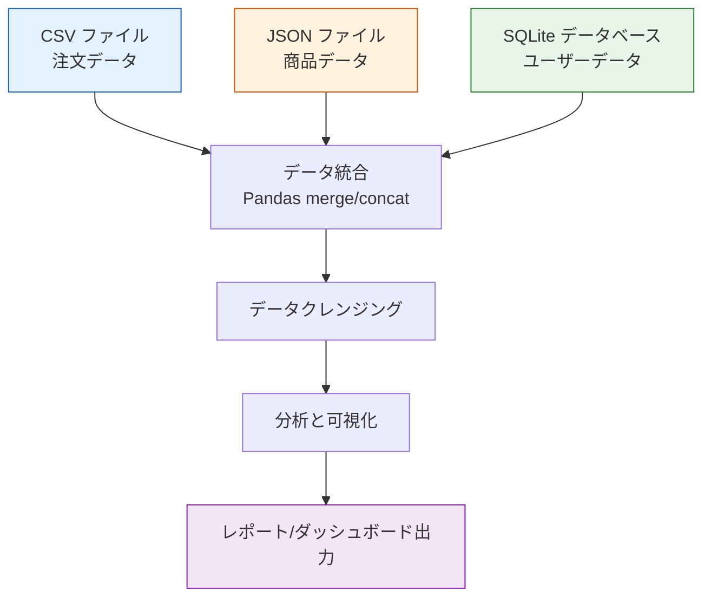
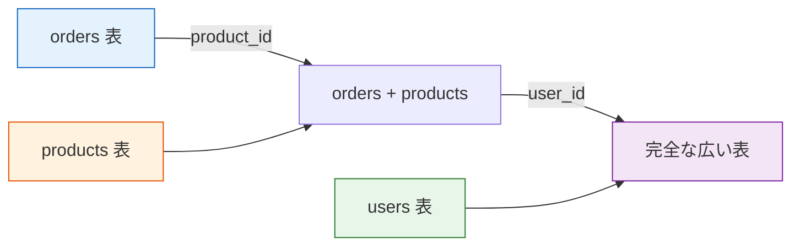
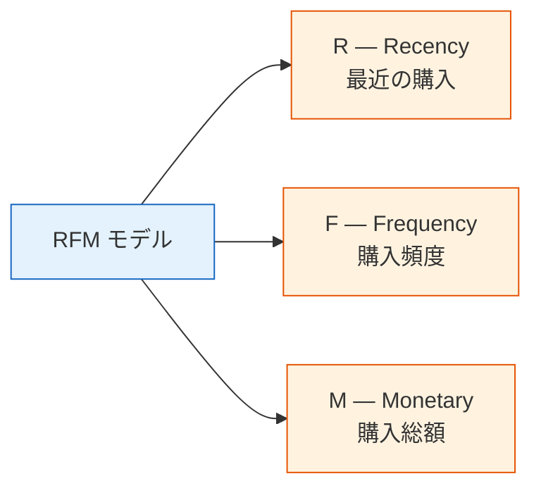
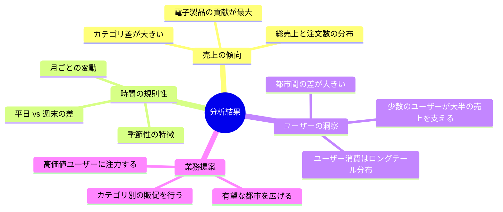

# 実践プロジェクト：多データソース統合分析


:::tip プロジェクトの位置づけ
これは 3 データ分析と可視化の**卒業プロジェクト**です。プロジェクト1（単一データセット EDA）に比べて、本プロジェクトでは**複数ソースのデータ統合**と**時間軸分析**が加わり、実際のデータ分析業務により近い内容になっています。
:::

## まずは全体像をつかもう

このプロジェクトを初学者が理解しやすい順番は、「まず merge を始める」ではなく、先に次をはっきりさせることです。


この節で本当に練習したいのは次の点です。

- 複数ソースのデータを、どうやって同じ分析表に入れるか
- いつキーを確認すべきか、いつから分析を始めるべきか

## プロジェクト概要

実務では、データがきれいに 1 つの CSV にまとまっていることはほとんどありません。CSV、JSON、データベースなど複数のソースからデータを取り、まずクレンジングして統合し、その後で分析します。



### 初学者向けのわかりやすい見立て

このプロジェクトは、次のように考えると理解しやすいです。

- 別々の部署から来た表をつなぎ合わせて、実際に報告できる総合表を作る

つまり、このプロジェクトで本当に難しいのは次のような点です。

- グラフを描けるかどうか

ではなく、

- データを先に正しくそろえられるか
- 表同士を正しくつなげられるか

### プロジェクトのシナリオ

あなたは、ある**オンライン小売会社**のデータアナリストです。会社のデータは、いくつかのシステムに分散しています。

| データソース | 形式 | 内容 |
|---------|------|------|
| 販売システムの出力 | CSV | 注文記録（注文ID、ユーザーID、商品ID、数量、日付） |
| 商品管理システム API | JSON | 商品情報（商品ID、名称、カテゴリ、価格） |
| ユーザーシステムのデータベース | SQLite | ユーザー情報（ユーザーID、名前、都市、登録日） |

あなたの仕事は、これらのデータを統合して売上状況を分析し、価値のある分析レポートを作ることです。

### 関連する知識

| スキル | 対応章 |
|------|---------|
| CSV/JSON の読み書き | 第 3 章 3.2 節 |
| Pandas merge による結合 | 第 3 章 3.7 節 |
| グループ集計とピボットテーブル | 第 3 章 3.6 節 |
| 時系列処理 | 第 3 章 3.8 節 |
| Matplotlib/Seaborn による可視化 | 第 4 章 |
| SQLite データベース操作 | 第 5 章 |

---

## 一、モックデータを準備する

実際のプロジェクトではデータはすでにありますが、学習のためにまず Python でモックデータを作ります。

### 1.1 注文データを生成する（CSV）

```python
import numpy as np
import pandas as pd
import json
import sqlite3
from datetime import datetime, timedelta

np.random.seed(42)

# ---------- 注文データ ----------
n_orders = 2000
order_dates = pd.date_range('2024-01-01', '2024-12-31', freq='h')
order_dates = np.random.choice(order_dates, n_orders)

orders = pd.DataFrame({
    'order_id': range(1, n_orders + 1),
    'user_id': np.random.randint(1, 201, n_orders),       # 200 人のユーザー
    'product_id': np.random.randint(1, 51, n_orders),      # 50 商品
    'quantity': np.random.choice([1, 1, 1, 2, 2, 3], n_orders),
    'order_date': order_dates
})

# CSV として保存
orders.to_csv('orders.csv', index=False)
print(f"注文データ：{orders.shape}")
orders.head()
```

### 1.2 商品データを生成する（JSON）

```python
# ---------- 商品データ ----------
categories = ['電子製品', '衣類', '食品', '家具', '書籍']
products = []

for i in range(1, 51):
    cat = np.random.choice(categories)
    # カテゴリごとに価格帯が異なる
    price_ranges = {
        '電子製品': (200, 5000),
        '衣類': (50, 800),
        '食品': (10, 100),
        '家具': (30, 500),
        '書籍': (20, 150),
    }
    low, high = price_ranges[cat]
    price = round(np.random.uniform(low, high), 2)
    
    products.append({
        'product_id': i,
        'name': f'{cat}_{i:03d}',
        'category': cat,
        'price': price
    })

# JSON として保存
with open('products.json', 'w', encoding='utf-8') as f:
    json.dump(products, f, ensure_ascii=False, indent=2)

print(f"商品データ：{len(products)} 商品")
pd.DataFrame(products).head()
```

### 1.3 ユーザーデータを生成する（SQLite）

```python
# ---------- ユーザーデータ ----------
cities = ['北京', '上海', '广州', '深圳', '杭州', '成都', '武汉', '南京', '重庆', '西安']

users = pd.DataFrame({
    'user_id': range(1, 201),
    'name': [f'ユーザー_{i:03d}' for i in range(1, 201)],
    'city': np.random.choice(cities, 200),
    'register_date': pd.date_range('2022-01-01', periods=200, freq='2D')
})

# SQLite に保存
conn = sqlite3.connect('users.db')
users.to_sql('users', conn, if_exists='replace', index=False)
conn.close()

print(f"ユーザーデータ：{users.shape}")
users.head()
```

:::info データファイル一覧
上のコードを実行すると、次の 3 つのファイルが作成されます。
- `orders.csv` — 2000 件の注文記録
- `products.json` — 50 商品の情報
- `users.db` — 200 人分のユーザー情報を含む SQLite データベース
:::

---

## 二、複数ソースのデータを読み込む

### 2.1 CSV を読む

```python
import pandas as pd
import numpy as np
import matplotlib.pyplot as plt
import seaborn as sns
import json
import sqlite3

plt.rcParams['font.sans-serif'] = ['Arial Unicode MS']
plt.rcParams['axes.unicode_minus'] = False
sns.set_theme(style="whitegrid", font_scale=1.1)

# 1. CSV を読み込む
orders = pd.read_csv('orders.csv', parse_dates=['order_date'])
print(f"注文データ：{orders.shape}")
print(orders.dtypes)
orders.head()
```

### 2.2 JSON を読む

```python
# 2. JSON を読み込む
with open('products.json', 'r', encoding='utf-8') as f:
    products_list = json.load(f)

products = pd.DataFrame(products_list)
print(f"\n商品データ：{products.shape}")
products.head()
```

Pandas なら直接読むこともできます。

```python
# Pandas なら 1 行でOK
products = pd.read_json('products.json')
```

### 2.3 SQLite を読む

```python
# 3. SQLite を読み込む
conn = sqlite3.connect('users.db')
users = pd.read_sql_query("SELECT * FROM users", conn, parse_dates=['register_date'])
conn.close()

print(f"\nユーザーデータ：{users.shape}")
users.head()
```

### 2.4 データの全体確認

```python
print("=" * 50)
print("データソースのまとめ")
print("=" * 50)
print(f"注文表：{orders.shape[0]} 行 × {orders.shape[1]} 列")
print(f"商品表：{products.shape[0]} 行 × {products.shape[1]} 列")
print(f"ユーザー表：{users.shape[0]} 行 × {users.shape[1]} 列")

# 連結キーを確認する
print(f"\n注文データの user_id 範囲：{orders['user_id'].min()} ~ {orders['user_id'].max()}")
print(f"注文データの product_id 範囲：{orders['product_id'].min()} ~ {orders['product_id'].max()}")
print(f"ユーザー表の user_id 範囲：{users['user_id'].min()} ~ {users['user_id'].max()}")
print(f"商品表の product_id 範囲：{products['product_id'].min()} ~ {products['product_id'].max()}")
```

### 初めて多ソース分析をするとき、まず何を確認するべき？

まず確認したいのは、次の 3 つです。

1. どのキーで表同士をつなぐのか
2. キーの範囲や型が一致しているか
3. 結合後に、マッチしないレコードが大量に出ないか

ここはとても大事です。後で「分析がおかしい」と見える問題の多くは、  
最初の結合が正しくできていないことが原因です。

---

## 三、データを統合する

これが本プロジェクトの**中心部分**です。3 つの表を 1 つの広い表にまとめます。

### 3.1 統合方針



### 3.2 結合操作

```python
# 1 つ目：注文 + 商品情報
df = orders.merge(products, on='product_id', how='left')
print(f"商品を結合後：{df.shape}")

# 2 つ目：+ ユーザー情報
df = df.merge(users, on='user_id', how='left')
print(f"ユーザーを結合後：{df.shape}")

df.head()
```

### 3.3 重要指標を計算する

```python
# 注文金額 = 単価 × 数量
df['amount'] = df['price'] * df['quantity']

# 時間軸の特徴を取り出す
df['month'] = df['order_date'].dt.month
df['weekday'] = df['order_date'].dt.day_name()
df['quarter'] = df['order_date'].dt.quarter

# 結果を確認
print(f"\n完全なデータセット：{df.shape[0]} 行 × {df.shape[1]} 列")
print(f"総売上：¥{df['amount'].sum():,.0f}")
print(f"平均注文金額：¥{df['amount'].mean():,.0f}")
df[['order_id', 'name_x', 'category', 'quantity', 'price', 'amount', 'city', 'month']].head(10)
```

:::warning 結合時の列名の衝突に注意
`orders` と `users` の両方に `name` 列がある場合があります。Pandas は自動で `_x` と `_y` の接尾辞を付けます。混乱を避けるため、結合前に列名を変更するか、結合後に整理しましょう。
```python
# 名前を変えて混乱を防ぐ
df = df.rename(columns={'name_x': 'user_name', 'name_y': 'product_name'})
# または結合前に必要な列だけを選ぶ
users_slim = users[['user_id', 'city', 'register_date']]
```
:::

### 3.4 データ品質の確認

```python
# 結合後のデータの完全性を確認する
print("=== 結合後のデータ品質チェック ===")
print(f"総行数：{len(df)}")
print(f"欠損値：")
print(df.isnull().sum()[df.isnull().sum() > 0])

# 欠損値がある場合、いくつかの ID が対応表に存在しない可能性がある
# 孤立レコードを確認する
orphan_products = set(orders['product_id']) - set(products['product_id'])
orphan_users = set(orders['user_id']) - set(users['user_id'])
print(f"\n対応できない product_id：{orphan_products if orphan_products else 'なし'}")
print(f"対応できない user_id：{orphan_users if orphan_users else 'なし'}")
```

### 3.5 初学者がそのまま使える統合チェックリスト

初めて複数ソースを統合するときは、次のチェックを先に行うと安全です。

1. 主キーが一意で、型も一致しているか
2. 結合後に行数が不自然に増減していないか
3. マッチしない孤立レコードが大量に出ていないか
4. 結合後の列名に衝突やあいまいさがないか

この 4 点を先に確認してから分析すると、かなり安定します。

---

## 四、分析 1：売上の全体像

### 4.1 全体指標

```python
print("=" * 50)
print("  2024 年の売上概要")
print("=" * 50)
print(f"  総注文数：{df['order_id'].nunique():,}")
print(f"  総売上：¥{df['amount'].sum():,.0f}")
print(f"  平均客単価：¥{df.groupby('order_id')['amount'].sum().mean():,.0f}")
print(f"  アクティブユーザー数：{df['user_id'].nunique()}")
print(f"  商品数：{df['product_id'].nunique()}")
```

### 4.2 カテゴリ分析

```python
# 各カテゴリの売上と注文数
cat_stats = df.groupby('category').agg(
    売上=('amount', 'sum'),
    注文数=('order_id', 'count'),
    平均単価=('price', 'mean'),
    商品数=('product_id', 'nunique')
).round(0).sort_values('売上', ascending=False)

print(cat_stats)
```

```python
fig, axes = plt.subplots(1, 2, figsize=(14, 5))

# カテゴリ別売上比率
colors = ['#2196f3', '#ff9800', '#4caf50', '#f44336', '#9c27b0']
axes[0].pie(cat_stats['売上'], labels=cat_stats.index, autopct='%1.1f%%',
            colors=colors, startangle=90, pctdistance=0.85)
axes[0].set_title('各カテゴリの売上比率')

# カテゴリ別注文数比較
cat_stats['注文数'].plot(kind='barh', ax=axes[1], color=colors)
axes[1].set_title('各カテゴリの注文数')
axes[1].set_xlabel('注文数')

plt.tight_layout()
plt.savefig('07_category.png', dpi=150, bbox_inches='tight')
plt.show()
```

### 4.3 都市分析

```python
# 売上上位の都市
city_stats = df.groupby('city').agg(
    売上=('amount', 'sum'),
    注文数=('order_id', 'count'),
    ユーザー数=('user_id', 'nunique')
).sort_values('売上', ascending=False)

fig, ax = plt.subplots(figsize=(10, 5))
city_stats['売上'].plot(kind='bar', color='steelblue', ax=ax)
ax.set_title('都市別売上')
ax.set_ylabel('売上（元）')
ax.set_xticklabels(ax.get_xticklabels(), rotation=45, ha='right')

# 棒の上に数値を表示
for i, v in enumerate(city_stats['売上']):
    ax.text(i, v + v*0.01, f'¥{v:,.0f}', ha='center', va='bottom', fontsize=9)

plt.tight_layout()
plt.savefig('08_city.png', dpi=150, bbox_inches='tight')
plt.show()
```

### 4.4 この段階でまず学びたいこと

まず押さえたいのは次の点です。

- 複数ソースのプロジェクトでも、統合ができれば、その後の分析はだんだん単一表の分析に近づく

つまり、このプロジェクトの本当の関門は、グラフそのものよりも次の部分です。

- 結合前のデータ理解
- 結合時のキーの対応づけ

---

## 五、分析 2：時間トレンド

### 5.1 月別トレンド

```python
# 月ごとに集計
monthly = df.groupby('month').agg(
    売上=('amount', 'sum'),
    注文数=('order_id', 'count')
).reset_index()

fig, ax1 = plt.subplots(figsize=(12, 5))

# 二軸グラフ：売上を棒グラフ、注文数を折れ線グラフ
color1 = 'steelblue'
color2 = 'coral'

bars = ax1.bar(monthly['month'], monthly['売上'], color=color1, alpha=0.7, label='売上')
ax1.set_xlabel('月')
ax1.set_ylabel('売上（元）', color=color1)
ax1.tick_params(axis='y', labelcolor=color1)
ax1.set_xticks(range(1, 13))

ax2 = ax1.twinx()
ax2.plot(monthly['month'], monthly['注文数'], color=color2, marker='o', linewidth=2, label='注文数')
ax2.set_ylabel('注文数', color=color2)
ax2.tick_params(axis='y', labelcolor=color2)

ax1.set_title('月別売上トレンド（2024 年）')

# 凡例をまとめる
lines1, labels1 = ax1.get_legend_handles_labels()
lines2, labels2 = ax2.get_legend_handles_labels()
ax1.legend(lines1 + lines2, labels1 + labels2, loc='upper left')

plt.tight_layout()
plt.savefig('09_monthly.png', dpi=150, bbox_inches='tight')
plt.show()
```

### 5.2 週内分布

```python
# 曜日ごとに集計
weekday_order = ['Monday', 'Tuesday', 'Wednesday', 'Thursday', 'Friday', 'Saturday', 'Sunday']
weekday_cn = ['月', '火', '水', '木', '金', '土', '日']

weekday_stats = df.groupby('weekday')['amount'].agg(['sum', 'count']).reindex(weekday_order)
weekday_stats.index = weekday_cn

fig, axes = plt.subplots(1, 2, figsize=(14, 5))

weekday_stats['sum'].plot(kind='bar', color='mediumseagreen', ax=axes[0])
axes[0].set_title('曜日別売上')
axes[0].set_ylabel('売上（元）')
axes[0].set_xticklabels(weekday_cn, rotation=0)

weekday_stats['count'].plot(kind='bar', color='salmon', ax=axes[1])
axes[1].set_title('曜日別注文数')
axes[1].set_ylabel('注文数')
axes[1].set_xticklabels(weekday_cn, rotation=0)

plt.tight_layout()
plt.savefig('10_weekday.png', dpi=150, bbox_inches='tight')
plt.show()
```

### 5.3 カテゴリ別の月次トレンド

```python
# 各カテゴリの月別売上
cat_monthly = df.groupby(['month', 'category'])['amount'].sum().reset_index()

plt.figure(figsize=(12, 6))
sns.lineplot(data=cat_monthly, x='month', y='amount', hue='category',
             marker='o', linewidth=2)
plt.title('各カテゴリの月別売上トレンド')
plt.xlabel('月')
plt.ylabel('売上（元）')
plt.xticks(range(1, 13))
plt.legend(title='カテゴリ', bbox_to_anchor=(1.02, 1), loc='upper left')
plt.tight_layout()
plt.savefig('11_cat_monthly.png', dpi=150, bbox_inches='tight')
plt.show()
```

---

## 六、分析 3：ユーザー分析

### 6.1 ユーザー消費の層別化

**RFM モデル** の簡易版でユーザーを分類します。



```python
# RFM を計算する
today = pd.Timestamp('2025-01-01')  # 参照日

rfm = df.groupby('user_id').agg(
    Recency=('order_date', lambda x: (today - x.max()).days),     # 最終購入からの日数
    Frequency=('order_id', 'nunique'),                             # 注文回数
    Monetary=('amount', 'sum')                                     # 購入総額
).round(0)

print(rfm.describe().round(1))
rfm.head(10)
```

### 6.2 ユーザー層の可視化

```python
fig, axes = plt.subplots(1, 3, figsize=(16, 4))

axes[0].hist(rfm['Recency'], bins=30, color='steelblue', edgecolor='white')
axes[0].set_title('R：最終購入からの日数')
axes[0].set_xlabel('日数')

axes[1].hist(rfm['Frequency'], bins=20, color='coral', edgecolor='white')
axes[1].set_title('F：購入頻度')
axes[1].set_xlabel('注文数')

axes[2].hist(rfm['Monetary'], bins=30, color='mediumseagreen', edgecolor='white')
axes[2].set_title('M：購入総額')
axes[2].set_xlabel('金額（元）')

plt.tight_layout()
plt.savefig('12_rfm.png', dpi=150, bbox_inches='tight')
plt.show()
```

### 6.3 簡単なユーザーセグメント分け

```python
# 購入金額と頻度でユーザーを 4 つのグループに分ける
rfm['value_group'] = pd.qcut(rfm['Monetary'], q=4, labels=['低価値', '中低', '中高', '高価値'])
rfm['freq_group'] = pd.qcut(rfm['Frequency'], q=3, labels=['低頻度', '中頻度', '高頻度'], duplicates='drop')

# クロス集計：価値 × 頻度
cross = pd.crosstab(rfm['value_group'], rfm['freq_group'], margins=True)
print("ユーザーセグメントのクロス表：")
print(cross)
```

```python
# 高価値ユーザーの特徴
high_value = rfm[rfm['value_group'] == '高価値']
print(f"\n高価値ユーザー：{len(high_value)} 人")
print(f"  平均購入額：¥{high_value['Monetary'].mean():,.0f}")
print(f"  平均頻度：{high_value['Frequency'].mean():.1f} 回")
print(f"  平均間隔：{high_value['Recency'].mean():.0f} 日")
```

### 6.4 都市 × ユーザー層

```python
# RFM セグメントを主表に戻す
user_city = df.groupby('user_id')['city'].first().reset_index()
rfm_city = rfm.reset_index().merge(user_city, on='user_id')

# 各都市の高価値ユーザー比率
city_value = pd.crosstab(rfm_city['city'], rfm_city['value_group'], normalize='index') * 100

plt.figure(figsize=(12, 6))
city_value[['高価値', '中高']].plot(kind='barh', stacked=True, 
                                    color=['#2196f3', '#90caf9'],
                                    figsize=(10, 6))
plt.title('各都市における中高/高価値ユーザー比率')
plt.xlabel('割合（%）')
plt.legend(title='ユーザーセグメント')
plt.tight_layout()
plt.savefig('13_city_value.png', dpi=150, bbox_inches='tight')
plt.show()
```

---

## 七、分析 4：総合ダッシュボード

重要な指標とグラフを 1 枚の大きな図にまとめます。

```python
fig = plt.figure(figsize=(18, 14))
fig.suptitle('2024 年 オンライン小売分析ダッシュボード', fontsize=18, fontweight='bold', y=0.98)

# ---------- 1. 主要指標（テキスト） ----------
ax_text = fig.add_subplot(4, 3, (1, 3))
ax_text.axis('off')

metrics = [
    (f"¥{df['amount'].sum():,.0f}", "総売上"),
    (f"{df['order_id'].nunique():,}", "総注文数"),
    (f"{df['user_id'].nunique()}", "アクティブユーザー"),
    (f"¥{df.groupby('order_id')['amount'].sum().mean():,.0f}", "平均客単価"),
]

for i, (value, label) in enumerate(metrics):
    x_pos = 0.12 + i * 0.22
    ax_text.text(x_pos, 0.6, value, fontsize=22, fontweight='bold', 
                 color='#1565c0', ha='center', transform=ax_text.transAxes)
    ax_text.text(x_pos, 0.2, label, fontsize=12, color='#666',
                 ha='center', transform=ax_text.transAxes)

# ---------- 2. 月次トレンド ----------
ax2 = fig.add_subplot(4, 3, (4, 6))
monthly_amount = df.groupby('month')['amount'].sum()
ax2.fill_between(monthly_amount.index, monthly_amount.values, alpha=0.3, color='steelblue')
ax2.plot(monthly_amount.index, monthly_amount.values, color='steelblue', linewidth=2, marker='o')
ax2.set_title('月別売上トレンド', fontsize=13)
ax2.set_xlabel('月')
ax2.set_ylabel('売上')
ax2.set_xticks(range(1, 13))

# ---------- 3. カテゴリ円グラフ ----------
ax3 = fig.add_subplot(4, 3, 7)
cat_amount = df.groupby('category')['amount'].sum().sort_values(ascending=False)
colors = ['#2196f3', '#ff9800', '#4caf50', '#f44336', '#9c27b0']
ax3.pie(cat_amount, labels=cat_amount.index, autopct='%1.0f%%', 
        colors=colors, startangle=90, textprops={'fontsize': 9})
ax3.set_title('カテゴリ売上比率', fontsize=13)

# ---------- 4. Top 商品 ----------
ax4 = fig.add_subplot(4, 3, 8)
# product_id に紐づく name 列を使う（name または product_name の可能性あり）
product_col = 'name' if 'name' in df.columns else df.columns[df.columns.str.contains('name')][0]
top_products = df.groupby('product_id')['amount'].sum().nlargest(8)
product_names = products.set_index('product_id').loc[top_products.index, 'name']
ax4.barh(product_names.values[::-1], top_products.values[::-1], color='coral')
ax4.set_title('売れ筋商品 Top 8', fontsize=13)
ax4.set_xlabel('売上')

# ---------- 5. 都市比較 ----------
ax5 = fig.add_subplot(4, 3, 9)
city_amount = df.groupby('city')['amount'].sum().sort_values(ascending=True)
ax5.barh(city_amount.index, city_amount.values, color='mediumseagreen')
ax5.set_title('都市別売上ランキング', fontsize=13)
ax5.set_xlabel('売上')

# ---------- 6. ユーザー消費分布 ----------
ax6 = fig.add_subplot(4, 3, (10, 12))
user_amount = df.groupby('user_id')['amount'].sum()
ax6.hist(user_amount, bins=40, color='#7986cb', edgecolor='white', alpha=0.8)
ax6.axvline(user_amount.mean(), color='red', linestyle='--', linewidth=2, label=f'平均: ¥{user_amount.mean():,.0f}')
ax6.axvline(user_amount.median(), color='orange', linestyle='--', linewidth=2, label=f'中央値: ¥{user_amount.median():,.0f}')
ax6.set_title('ユーザー購入金額分布', fontsize=13)
ax6.set_xlabel('購入総額（元）')
ax6.set_ylabel('ユーザー数')
ax6.legend()

plt.tight_layout(rect=[0, 0, 1, 0.96])
plt.savefig('14_dashboard.png', dpi=150, bbox_inches='tight')
plt.show()
```

---

## 八、分析結果と提案

### 主な発見



### 会社への提案

1. **高価値ユーザーの維持**：上位 20% のユーザーが売上の大部分を生み出しているため、VIP 施策や専用サービスを用意する
2. **カテゴリ戦略**：電子製品は単価が高い一方で、食品や書籍で集客し、ユーザーの定着を高める
3. **都市展開**：各都市の浸透率を分析し、ユーザー数は少ないが一人当たり消費が高い都市には、積極的にプロモーションを行う価値がある
4. **時系列運営**：月次や週内の傾向に合わせて、販促企画や在庫配置を調整する
5. **ユーザー獲得**：新規・既存ユーザーの転換率に注目し、低頻度ユーザーにはクーポンを配布して再活性化する

---

## 九、プロジェクトまとめと発展

### 学習内容の振り返り

| ステップ | 使ったスキル | 対応コード |
|------|-----------|---------|
| データ読み込み | `read_csv`, `read_json`, `read_sql_query` | 第 2 節 |
| データ結合 | `merge`（複数表の連結） | 第 3 節 |
| グループ集計 | `groupby`, `agg`, `pivot_table` | 第 4〜6 節 |
| 時間処理 | `dt.month`, `dt.day_name()`, `date_range` | 第 5 節 |
| 可視化 | Matplotlib のサブプロット、二軸、Seaborn | 全体 |

### 発展課題

**課題 1：もっと多くのデータソースを追加する**

ネットワーク API からデータ（例：天気データ）を取得し、天気が売上に与える影響を分析します。

```python
# 例：モックの天気データ
weather = pd.DataFrame({
    'date': pd.date_range('2024-01-01', '2024-12-31'),
    'temp': np.random.normal(20, 10, 366).clip(-5, 40),
    'rain': np.random.choice([0, 0, 0, 1], 366)  # 0=晴れ 1=雨
})
```

**課題 2：Plotly でインタラクティブなダッシュボードを作る**

```python
import plotly.express as px
from plotly.subplots import make_subplots

# インタラクティブな月次トレンド
fig = px.line(monthly, x='month', y='売上', 
              title='月別売上トレンド', markers=True)
fig.show()
```

**課題 3：PDF レポートを自動生成する**

`matplotlib` の `PdfPages` または `reportlab` ライブラリを調べて、PDF 分析レポートを自動生成してみましょう。

**課題 4：実データセットを使う**

[Kaggle](https://www.kaggle.com/datasets) で実際の EC データセット（例：[Brazilian E-Commerce](https://www.kaggle.com/datasets/olistbr/brazilian-ecommerce)）を見つけて、このプロジェクトをやり直してみましょう。

---

## 十、プロジェクトチェックリスト

| チェック項目 | 完了したか |
|--------|---------|
| CSV から注文データを読み込む | ☐ |
| JSON から商品データを読み込む | ☐ |
| SQLite からユーザーデータを読み込む | ☐ |
| merge で 3 つの表を結合する | ☐ |
| 結合後のデータ品質を確認する | ☐ |
| 売上概要分析（カテゴリ、都市）を完了する | ☐ |
| 時間トレンド分析（月次、週内）を完了する | ☐ |
| ユーザー分析（RFM、セグメント分け）を完了する | ☐ |
| 総合ダッシュボード（大きな図）を作る | ☐ |
| 少なくとも 3 つの分析結果を書く | ☐ |
| 業務提案を出す | ☐ |

:::note 3 データ分析と可視化の完成、おめでとうございます！
この 2 つのプロジェクトを終えると、データの取得、クレンジングと統合、分析と可視化、レポート作成までの、データ分析の一連の流れを身につけたことになります。これらのスキルは、**機械学習** の段階に進むための強固な土台です。

次のステップでは、4 AI 数学の最小限の基礎 と 5 機械学習入門から実戦へ に進み、データ分析の力を予測とモデリングの力へとアップグレードしていきます。
:::

## バージョンの進め方のおすすめ

| バージョン | 目標 | 仕上げのポイント |
|---|---|---|
| 基本版 | 最小の閉ループを動かす | 入力できる、処理できる、出力できる。さらに 1 組のサンプルを残す |
| 標準版 | 見せられるプロジェクトにする | 設定、ログ、エラー処理、README、スクリーンショットを追加する |
| チャレンジ版 | ポートフォリオ品質に近づける | 評価、比較実験、失敗サンプル分析、次の改善方針を追加する |

まずは基本版を完成させましょう。最初から大きく作り込みすぎないことが大切です。バージョンを 1 つ上げるたびに、「何が増えたか」「どう検証したか」「まだ何が課題か」を README に書き足していきましょう。
