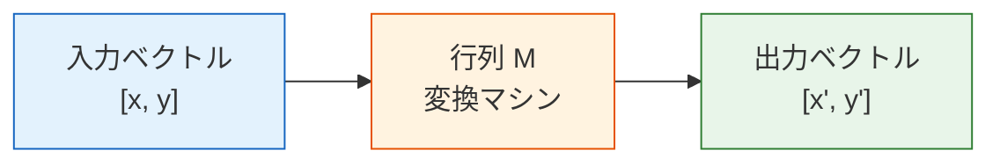
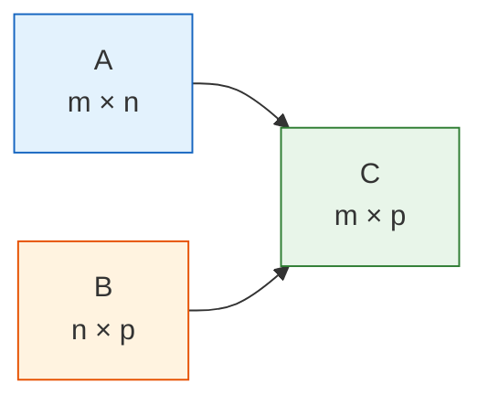
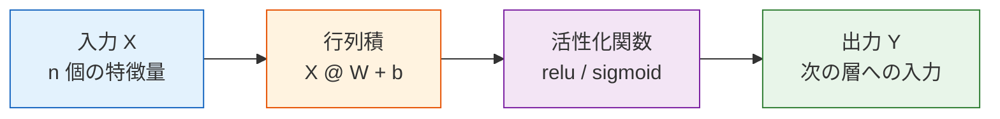

# 行列：データのバッチ変換


## 学習目標

- 行列とは何かを直感的に理解する（1つの表 / 1組の操作）
- 行列積の意味と計算方法を身につける
- 転置、逆行列の直感を理解する
- ニューラルネットワークの各層がなぜ行列積なのかを理解する
- NumPy で行列演算を実装する

## まず、とても大事な学習イメージを共有します

この節では、行列論を全部学び切ることが目的ではありません。まずは、AI でよく出てくる次の3つの感覚をしっかりつかみましょう。

- 行列は、データをまとめて入れられる
- 行列は、バッチ変換を表せる
- 行列積は、後のモデルで何度も登場する

---

## まずは全体像をつかもう

行列をただの「数字の表」として見るだけだと、だんだん抽象的に感じやすくなります。初心者には、次のように見るのがおすすめです。


この節で大事なのは、定義を暗記することではなく、次を理解することです。

- なぜ複数のデータを自然に行列で表すのか
- なぜ行列積で一度に複数のサンプルを処理できるのか
- なぜ深層学習のコードで `X @ W` が何度も出てくるのか

## 一、行列とは何か？

### 1.1 2つの見方

**見方1：行列は1つの表**

### 1.1.1 初心者向けのたとえ

ベクトルが「1枚の情報カード」だとすると、  
行列はまず次のように理解できます。

- きれいに並んだ情報カードの束

だから機械学習では、

- 1つのサンプルはベクトル
- 複数のサンプルは自然に行列

となります。

Pandas の DataFrame も、本質的には行列に近いものです。

```python
import numpy as np

# 3人の学生の4科目の点数
scores = np.array([
    [85, 92, 78, 90],   # 学生1
    [72, 88, 95, 85],   # 学生2
    [90, 76, 88, 92],   # 学生3
])
print(f"形状: {scores.shape}")  # (3, 4) → 3行4列
```

**見方2：行列は「変換マシン」**

行列にベクトルを入れると、新しいベクトルが出てきます。  
これは関数のように、入力 → 変換 → 出力 を行うものです。



これが線形代数の最も大事な考え方です。**行列 = 変換** です。

### 1.2 行列の基本属性

```python
M = np.array([
    [1, 2, 3],
    [4, 5, 6],
])

print(f"形状 (shape): {M.shape}")      # (2, 3) → 2行3列
print(f"行数: {M.shape[0]}")           # 2
print(f"列数: {M.shape[1]}")           # 3
print(f"要素の総数: {M.size}")          # 6
print(f"データ型: {M.dtype}")           # int64
print(f"1行目: {M[0]}")                # [1 2 3]
print(f"1行目3列目: {M[1, 2]}")         # 6
```

### 1.3 「1つのサンプル」から「複数のサンプル」へ

すでにベクトルを学んでいるなら、行列は次のように捉えられます。

> **たくさんのベクトルを、同じ形式で積み重ねたもの。**

```python
import numpy as np

# [面積, 築年数, 駅からの距離]
house_1 = np.array([88, 5, 1.2])
house_2 = np.array([120, 8, 0.5])
house_3 = np.array([75, 2, 1.8])

X = np.array([
    house_1,
    house_2,
    house_3,
])

print(X)
print("形状:", X.shape)  # (3, 3)
```

ここでの意味は次の通りです。

- 各行が1つのサンプル
- 各列が1つの特徴量

これは機械学習や深層学習で最もよく使うデータの並べ方です。

---

## 二、行列の基本演算

### 2.1 行列の足し算とスカラー倍

ベクトルと同じように、**対応する位置どうしを足す / 掛ける** だけです。

```python
A = np.array([[1, 2], [3, 4]])
B = np.array([[5, 6], [7, 8]])

print("足し算:\n", A + B)     # [[6, 8], [10, 12]]
print("スカラー倍:\n", 3 * A) # [[3, 6], [9, 12]]
```

### 2.2 行列積——最重要の演算

行列積は、普通の数の掛け算とは**まったく違います**。ルールはこうです。

**結果の各要素 = 左の行列のある行 と 右の行列のある列 の内積**

```python
A = np.array([[1, 2],
              [3, 4]])   # 2×2

B = np.array([[5, 6],
              [7, 8]])   # 2×2

# 行列積
C = A @ B    # 推奨の書き方
# C = np.dot(A, B)  # 同じ意味

print("A @ B =")
print(C)
# [[19, 22],     ← 1*5+2*7=19, 1*6+2*8=22
#  [43, 50]]     ← 3*5+4*7=43, 3*6+4*8=50
```

**手で確認してみよう**：
- C[0,0] = 1×5 + 2×7 = 5 + 14 = 19
- C[0,1] = 1×6 + 2×8 = 6 + 16 = 22
- C[1,0] = 3×5 + 4×7 = 15 + 28 = 43
- C[1,1] = 3×6 + 4×8 = 18 + 32 = 50

### 2.3 行列積のサイズのルール



**大事なルール：左の行列の列数 = 右の行列の行数**。  
そして、結果の形は (左の行列の行数, 右の行列の列数) になります。

```python
A = np.array([[1, 2, 3],
              [4, 5, 6]])   # 2×3

B = np.array([[1, 2],
              [3, 4],
              [5, 6]])       # 3×2

C = A @ B                    # 2×2 ✓（3 == 3）
print(f"A({A.shape}) @ B({B.shape}) = C({C.shape})")
print(C)
# [[22, 28],
#  [49, 64]]
```

:::warning 行列積は交換法則が成り立たない
`A @ B` と `B @ A` は、普通は**同じになりません**。  
形状がそもそも違うこともあります。これは数の掛け算（3×5 = 5×3）とは違うので、最初は特に注意してください。
:::

```python
A = np.array([[1, 2], [3, 4]])
B = np.array([[5, 6], [7, 8]])

print("A @ B =\n", A @ B)
print("B @ A =\n", B @ A)
print("A@B == B@A?", np.array_equal(A @ B, B @ A))  # False
```

### 2.4 「サンプル行列 × 重み行列」を手計算してみる

これは初心者がぜひ理解したい部分です。後のニューラルネットワークにそのままつながります。

```python
X = np.array([
    [1, 2],
    [3, 4],
    [5, 6],
])  # 3×2

W = np.array([
    [0.1, 1.0],
    [0.2, 0.5],
])  # 2×2

Z = X @ W
print(Z.round(2))
```

行ごとに見ると、次の意味になります。

- 1行目の出力 = 1つ目のサンプル `[1, 2]` に重み行列を適用したもの
- 2行目の出力 = 2つ目のサンプル `[3, 4]` に重み行列を適用したもの
- 3行目の出力 = 3つ目のサンプル `[5, 6]` に重み行列を適用したもの

行列積のすごいところは、

> **1つのサンプルだけでなく、複数のサンプルを一度に計算できること**

です。

### 2.5 初心者がまず確認すべき shape の4ステップ

行列積でよくエラーが出るときは、あわてず次の4つを確認しましょう。

1. 左側の行列の形は何か
2. 右側の行列の形は何か
3. 左側の列数は右側の行数と等しいか
4. 期待している出力の形は何か

```python
print("X.shape =", X.shape)
print("W.shape =", W.shape)
print("Z.shape =", (X @ W).shape)
```

---

## 三、行列を「変換」として見る——直感的な可視化

### 3.1 回転変換

行列はベクトルに対して、**回転、拡大縮小、せん断** などの変換を行えます。  
ここでは、行列で2次元の点を回転させてみます。

```python
import matplotlib.pyplot as plt
plt.rcParams['font.sans-serif'] = ['Arial Unicode MS']
plt.rcParams['axes.unicode_minus'] = False

# 正方形の4頂点 + 始点に戻る
square = np.array([
    [0, 0],
    [1, 0],
    [1, 1],
    [0, 1],
    [0, 0],  # 始点に戻ると閉じた図形として描きやすい
]).T  # 2×5 に転置して、行列積しやすくする

# 45°回転行列
theta = np.radians(45)  # 度をラジアンに変換
R = np.array([
    [np.cos(theta), -np.sin(theta)],
    [np.sin(theta),  np.cos(theta)]
])
print(f"回転行列:\n{R.round(3)}")

# 回転を適用
rotated = R @ square  # 行列積！

fig, axes = plt.subplots(1, 2, figsize=(12, 5))

# 変換前
axes[0].plot(square[0], square[1], 'b-o', linewidth=2, markersize=8)
axes[0].fill(square[0], square[1], alpha=0.2, color='steelblue')
axes[0].set_xlim(-1.5, 1.5)
axes[0].set_ylim(-0.5, 1.8)
axes[0].set_aspect('equal')
axes[0].grid(True, alpha=0.3)
axes[0].set_title('変換前（元の正方形）')

# 変換後
axes[1].plot(square[0], square[1], 'b--', alpha=0.3, linewidth=1)
axes[1].plot(rotated[0], rotated[1], 'r-o', linewidth=2, markersize=8)
axes[1].fill(rotated[0], rotated[1], alpha=0.2, color='coral')
axes[1].set_xlim(-1.5, 1.5)
axes[1].set_ylim(-0.5, 1.8)
axes[1].set_aspect('equal')
axes[1].grid(True, alpha=0.3)
axes[1].set_title('変換後（45°回転）')

plt.suptitle('行列変換 = 回転', fontsize=14)
plt.tight_layout()
plt.show()
```

**重要なポイント**：2×2 の行列に2次元ベクトルを掛けると、空間変換が1回できます。  
この考え方は、任意の次元にも広げられます。

### 3.2 いろいろな変換の例

```python
fig, axes = plt.subplots(1, 4, figsize=(18, 4))

# 元の形
triangle = np.array([
    [0, 0], [1, 0], [0.5, 1], [0, 0]
]).T

transforms = [
    (np.eye(2), '元の形（単位行列）'),
    (np.array([[2, 0], [0, 2]]), '2倍に拡大'),
    (np.array([[1, 0.5], [0, 1]]), '水平せん断'),
    (np.array([[-1, 0], [0, 1]]), '左右反転'),
]

for ax, (M, title) in zip(axes, transforms):
    transformed = M @ triangle
    ax.plot(triangle[0], triangle[1], 'b--', alpha=0.3)
    ax.fill(triangle[0], triangle[1], alpha=0.1, color='blue')
    ax.plot(transformed[0], transformed[1], 'r-o', linewidth=2, markersize=6)
    ax.fill(transformed[0], transformed[1], alpha=0.2, color='coral')
    ax.set_xlim(-2.5, 2.5)
    ax.set_ylim(-0.5, 2.5)
    ax.set_aspect('equal')
    ax.grid(True, alpha=0.3)
    ax.set_title(title)

plt.tight_layout()
plt.show()
```

---

## 四、転置と逆行列

### 4.1 転置（Transpose）

**転置 = 行と列を入れ替えること**。  
元の i 行目が i 列目になります。

```python
A = np.array([
    [1, 2, 3],
    [4, 5, 6],
])
print(f"A の形状: {A.shape}")      # (2, 3)
print(f"A の転置:\n{A.T}")
print(f"転置後の形状: {A.T.shape}")  # (3, 2)
```

出力：
```
A の転置:
[[1 4]
 [2 5]
 [3 6]]
```

**いつ転置を使うの？**
- データ処理： 「行がサンプル、列が特徴量」を「行が特徴量、列がサンプル」にしたいとき
- 行列演算： 公式に合わせるために転置が必要なとき

### 4.2 特殊な行列

```python
# 単位行列（対角線がすべて1）
I = np.eye(3)
print("単位行列:\n", I)
# [[1. 0. 0.]
#  [0. 1. 0.]
#  [0. 0. 1.]]

# 単位行列の性質：A @ I = I @ A = A
A = np.array([[1, 2], [3, 4]])
print("A @ I == A?", np.allclose(A @ np.eye(2), A))  # True
```

:::tip 単位行列は数の 1 のようなもの
数の計算では、どんな数に 1 を掛けても元の数のままです。  
行列でも、単位行列を掛けると元の行列のままです。
:::

### 4.3 逆行列（Inverse）

行列 A が「変換」だとすると、逆行列 A⁻¹ は**「元に戻す変換」**です。  
A の操作を打ち消します。

```python
A = np.array([[2, 1],
              [1, 1]])

# 逆行列を計算
A_inv = np.linalg.inv(A)
print("A の逆行列:\n", A_inv)

# 確認：A @ A_inv = 単位行列
print("A @ A_inv =\n", (A @ A_inv).round(10))
# [[1. 0.]
#  [0. 1.]]  → 単位行列！
```

**直感**：A がベクトルを45°回転させたなら、A⁻¹ はそれを元に戻します。  
A がベクトルを2倍にしたなら、A⁻¹ は2分の1に戻します。

```python
# 可視化：変換 → 逆変換 = 元に戻る
v = np.array([1, 2])

transformed = A @ v             # A で変換
recovered = A_inv @ transformed # A_inv で元に戻す

print(f"元の値: {v}")
print(f"変換後: {transformed}")
print(f"元に戻した後: {recovered}")   # 元と同じ！
```

:::warning すべての行列に逆行列があるわけではない
行列式（determinant）が 0 のとき、その行列には逆行列がありません。
```python
# この行列には逆行列がない
singular = np.array([[1, 2], [2, 4]])
try:
    np.linalg.inv(singular)
except np.linalg.LinAlgError as e:
    print(f"エラー: {e}")  # Singular matrix
```
直感的には、この行列は2次元空間を「ぺたんと押しつぶして」1本の線のようにしてしまうので、情報が失われ、元に戻せません。
:::

---

## 五、行列とニューラルネットワーク

### 5.1 ニューラルネットワークの本質

この節で最も大事な気づきです。**ニューラルネットワークの各層は、本質的には「行列積 + 活性化関数」です。**



### 5.2 1つのニューロンの式から行列の式へ

1つのサンプルだけを見ると、ニューラルネットワークの1層は実はこうです。

`出力 = 入力ベクトル · 重みベクトル + バイアス`

```python
import numpy as np

x = np.array([1.0, 0.5, -0.3])
w = np.array([0.2, -0.4, 0.6])
b = 0.1

y = x @ w + b
print(round(y, 4))
```

1つだけでなく、複数のサンプルをまとめて計算すると、自然に次の形になります。

`Z = X @ W + b`

ここで、

- `X` はサンプル行列
- `W` は重み行列
- `b` はバイアス
- `Z` は線形出力

です。

### 5.3 コードで1層のニューラルネットワークをまねる

```python
# 1層ニューラルネットワークの順伝播をまねる

# 入力：3サンプル、それぞれ4特徴量
X = np.array([
    [1.0, 0.5, -0.3, 0.8],
    [0.2, -0.1, 0.7, 0.3],
    [0.9, 0.4, 0.1, -0.5],
])
print(f"入力 X: {X.shape}")  # (3, 4)

# 重み行列：4特徴量から2出力へ写す
W = np.random.randn(4, 2) * 0.5
print(f"重み W: {W.shape}")  # (4, 2)

# バイアス
b = np.zeros(2)

# 順伝播：行列積 + バイアス
Z = X @ W + b               # (3, 4) @ (4, 2) = (3, 2)
print(f"線形出力 Z: {Z.shape}")

# 活性化関数（ReLU：負の値は0、正の値はそのまま）
def relu(x):
    return np.maximum(0, x)

output = relu(Z)
print(f"活性化後の出力: {output.shape}")  # (3, 2)
print(f"\n最終出力:\n{output.round(3)}")
```

**読み解き**：
- 3つのサンプル（3行）、各サンプルに4特徴量（4列）
- 重み行列 W は 4×2 で、4次元特徴量を2次元へ写す
- 行列積で全サンプルを一度に処理できる。これが**バッチ計算**の強みです

### 5.4 多層ネットワーク = 行列の連続積

```python
# 3層ニューラルネットワークをまねる
np.random.seed(42)

X = np.random.randn(5, 10)  # 5サンプル、10特徴量

# 第1層：10 → 8
W1 = np.random.randn(10, 8) * 0.3
h1 = relu(X @ W1)
print(f"第1層の出力: {h1.shape}")  # (5, 8)

# 第2層：8 → 4
W2 = np.random.randn(8, 4) * 0.3
h2 = relu(h1 @ W2)
print(f"第2層の出力: {h2.shape}")  # (5, 4)

# 第3層（出力層）：4 → 2
W3 = np.random.randn(4, 2) * 0.3
output = h2 @ W3  # 出力層では通常 ReLU を使わない
print(f"最終出力:   {output.shape}")  # (5, 2)
```

### 5.5 初心者がよくやる3つの行列ミス

1. 要素ごとの掛け算 `A * B` を、行列積だと勘違いする  
   本当の行列積は `A @ B` を使います。

2. 形状を見ずにそのまま掛け始める  
   `shape` が合っていないと、必ずエラーになります。

3. 「各行が何を表すのか」が分からなくなる  
   「各行は1つのサンプル」と覚えるだけで、かなり理解しやすくなります。

:::info なぜ行列積だけではだめなの？
活性化関数（relu）がなければ、複数の行列積は1つにまとめられます。

- `(X @ W1) @ W2 = X @ (W1 @ W2)`
- つまり、多層でも単層と変わらなくなります

活性化関数が**非線形性**を入れることで、ネットワークは複雑なパターンを学習できるようになります。だから各層で「行列積 + 活性化関数」が必要です。
:::

---

## 六、実用例：連立一次方程式を解く

行列の代表的な応用の1つが、連立一次方程式を解くことです。

```
2x + y = 5
x + 3y = 7
```

行列で書くと、A @ x = b です。

```python
# 係数行列
A = np.array([[2, 1],
              [1, 3]])
# 右辺の定数
b = np.array([5, 7])

# 方程式を解く
x = np.linalg.solve(A, b)
print(f"解: x = {x[0]:.2f}, y = {x[1]:.2f}")
# 解: x = 1.60, y = 1.80

# 確認
print(f"確認: A @ x = {A @ x}")  # [5. 7.] ✓
```

---

## 七、NumPy の行列操作まとめ

```python
import numpy as np

# ========== 行列を作る ==========
A = np.array([[1, 2], [3, 4]])
B = np.array([[5, 6], [7, 8]])
I = np.eye(2)                          # 単位行列
Z = np.zeros((3, 4))                   # 全要素0の行列
R = np.random.randn(3, 4)              # ランダム行列

# ========== 基本演算 ==========
print("足し算:\n", A + B)
print("スカラー倍:\n", 2 * A)
print("要素ごとの掛け算:\n", A * B)    # 注意：これは行列積ではありません！

# ========== 行列積 ==========
print("行列積:\n", A @ B)              # 推奨
print("行列積:\n", np.dot(A, B))       # 同じ
print("行列積:\n", np.matmul(A, B))    # 同じ

# ========== 転置 ==========
print("転置:\n", A.T)

# ========== 逆行列 ==========
print("逆行列:\n", np.linalg.inv(A))

# ========== 行列式 ==========
print("行列式:", np.linalg.det(A))      # -2.0

# ========== 方程式を解く ==========
b = np.array([1, 2])
x = np.linalg.solve(A, b)
print("方程式の解:", x)
```

---

## ここまで学んだら、次は何を考える？

行列を学んだあと、次の節へ持っていくとよい問いは次の3つです。

1. 行列は、ほとんどのベクトルをどう変えるのか？
2. 変換後も向きが変わらない、特別な方向はあるのか？
3. その「特別な方向」が、なぜ PCA や次元削減につながるのか？

この3つは、そのまま次の話につながります。

- [固有値と固有ベクトル](./03-eigenvalues.md)

:::info 次につながる内容
- **次の節**：固有値と固有ベクトル——行列変換で「向きが変わらない」特別なベクトル
- **ニューラルネットワーク**：各層は行列積 + 活性化関数
- **画像処理**：畳み込みの土台にも行列演算がある
:::

---

## まとめ

| 概念 | 直感的な理解 | NumPy 実装 |
|------|---------|-----------|
| 行列 | 1つの表 / 1つの変換 | `np.array([[1,2],[3,4]])` |
| 行列積 | 行と列の内積の組み合わせ | `A @ B` |
| 転置 | 行と列を入れ替える | `A.T` |
| 単位行列 | 「何もしない」変換 | `np.eye(n)` |
| 逆行列 | 変換を元に戻す | `np.linalg.inv(A)` |
| 方程式を解く | Ax = b → x = ? | `np.linalg.solve(A, b)` |

## この節で一番持ち帰ってほしいこと

- 行列は「データをまとめる」ためにも、「変換を表す」ためにも使われる
- 行列積は、まず「バッチの内積」として理解するとよい
- だから AI のコードでは `X @ W` が何度も出てくる

## 手を動かす練習

### 練習1：行列積を手で確かめる

次が与えられています。
```python
A = np.array([[1, 0, 2],
              [0, 3, 1]])    # 2×3

B = np.array([[2, 1],
              [0, 4],
              [3, 2]])        # 3×2
```

1. まず A @ B の結果を手計算する
2. そのあと NumPy で確認する

### 練習2：回転変換

回転行列を使って三角形を 90° 回転させ、変換前後を比較する図を描いてみましょう。

ヒント：90° の回転行列は `[[0, -1], [1, 0]]` です。

### 練習3：2層ニューラルネットワークをまねる

2層ネットワークを作り、100個のサンプル（各5特徴量）を入力し、1層目で3つの値、2層目で1つの値を出力するようにしてください。  
各層の入力と出力の形状を表示しましょう。
