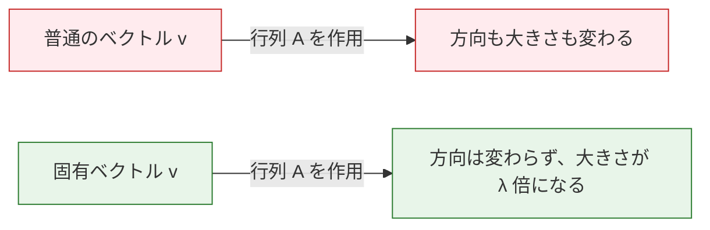
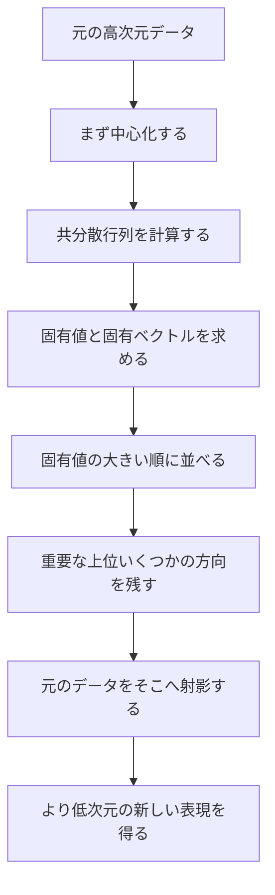
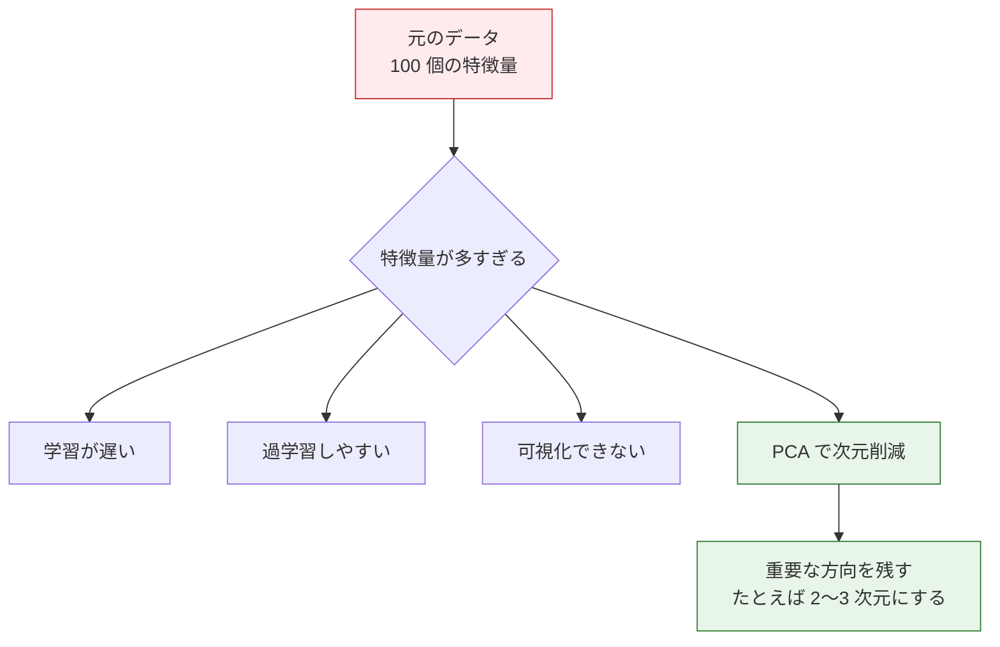
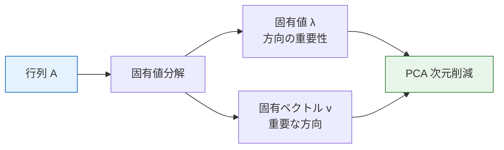

# 固有値と固有ベクトル


:::tip 名前におびえなくて大丈夫
「固有値」と「固有ベクトル」は数学っぽく聞こえますが、直感はとてもシンプルです。**行列変換の下で、ある特別なベクトルは方向を変えずに、伸びたり縮んだりするだけ**です。これが固有ベクトルで、その伸び縮みの倍率が固有値です。
:::

## 学習目標

- 固有値と固有ベクトルの意味を直感的に理解する
- 可視化を通して行列変換の「特別な方向」を見る
- PCA の次元削減がなぜ有効かを理解する
- NumPy を使って固有値と固有ベクトルを計算する

## まず、とても大事な学習イメージを持とう

この節は、初めて読む人がタイトルを見ただけで少し緊張しやすいところです。  
でも、ここで最初に身につけるべきなのは、線形代数のすべての導出ではなく、次の感覚です。

- なぜ「方向は変わらないのに長さだけ変わる」特別なベクトルがあるのか
- なぜその特別な方向が PCA、次元削減、情報保持に直接関係するのか
- なぜ AI ではこれらが何度も登場するのか

なので、この節の最初の目標は、記号を暗記することではなく、  
まず「特別な方向」という直感をしっかり作ることです。

---

## まずは全体像をつかもう

この節は、名前だけ見ると「難しそう」「かなり高度そう」と感じやすいです。ですが、まずは次の流れだけ覚えれば十分です。


この授業で本当に解決したいのは、定義を丸暗記することではなく、次のことです。

- たくさんの変化の中から、いちばん重要な方向をどう見つけるか
- PCA がなぜ情報をあまり失わずにデータを圧縮できるのか

## 一、直感的に理解する

### 1.1 行列変換の「特別な方向」

前の節で学んだように、行列 × ベクトル = 新しいベクトルです（方向も大きさも変わることがあります）。

でも、あるベクトルはとても特別です。行列をかけても、**方向は変わらず**、長さだけが変わります。



数学で書くと、**A × v = λ × v** です。
- v は固有ベクトル（方向が変わらないベクトル）
- λ（lambda）は固有値（伸び縮みの倍率）

### 1.1.1 初心者向けのたとえ

行列変換を、たくさんの矢印に吹く風だと思ってみてください。

- ほとんどの矢印は風で向きが変わる
- でも、いくつかの矢印は風の向きにちょうど合っている

その矢印は、風を受けても

- 方向がずれない
- 長くなったり短くなったりするだけ

この「どう吹いても向きが変わらない」特別な矢印が、  
固有ベクトルです。

### 1.2 可視化：どのベクトルの方向が変わらない？

```python
import numpy as np
import matplotlib.pyplot as plt

plt.rcParams['font.sans-serif'] = ['Arial Unicode MS']
plt.rcParams['axes.unicode_minus'] = False

# 行列を定義
A = np.array([[2, 1],
              [1, 2]])

# 固有値と固有ベクトルを計算
eigenvalues, eigenvectors = np.linalg.eig(A)
print(f"固有値: {eigenvalues}")         # [3. 1.]
print(f"固有ベクトル:\n{eigenvectors}")

# 可視化：たくさんの方向のベクトルに変換をかけ、どの方向が変わらないかを見る
fig, axes = plt.subplots(1, 2, figsize=(14, 6))

# 均等に分布した単位ベクトルを作る
angles = np.linspace(0, 2*np.pi, 50, endpoint=False)
unit_vectors = np.array([np.cos(angles), np.sin(angles)])  # 2×50

# 変換後のベクトル
transformed = A @ unit_vectors  # 2×50

# 変換前後を描く
for ax, vectors, title in [(axes[0], unit_vectors, '変換前（単位円）'), 
                             (axes[1], transformed, '変換後（楕円）')]:
    # すべてのベクトルを描画（グレー）
    for i in range(vectors.shape[1]):
        ax.plot([0, vectors[0, i]], [0, vectors[1, i]], 'gray', alpha=0.3)
    
    # 固有ベクトルの方向を強調表示
    for j in range(2):
        ev = eigenvectors[:, j]
        if ax == axes[0]:
            scale = 1
        else:
            scale = eigenvalues[j]
        color = ['red', 'blue'][j]
        ax.quiver(0, 0, ev[0]*scale, ev[1]*scale, angles='xy', scale_units='xy', 
                  scale=1, color=color, width=0.01,
                  label=f'固有ベクトル {j+1} (λ={eigenvalues[j]:.0f})')
    
    ax.set_xlim(-4, 4)
    ax.set_ylim(-4, 4)
    ax.set_aspect('equal')
    ax.grid(True, alpha=0.3)
    ax.legend(fontsize=10)
    ax.set_title(title, fontsize=13)

plt.suptitle(f'行列 A = [[2,1],[1,2]] の固有ベクトル', fontsize=14)
plt.tight_layout()
plt.show()
```

**解説**：
- 赤と青の矢印が固有ベクトルの方向です
- 変換すると、単位円は楕円になります
- でも固有ベクトルの**方向は変わらず**、長さだけが変わります（それぞれ 3 倍と 1 倍）
- 楕円の長軸と短軸は、ちょうど固有ベクトルの方向になっています

### 1.3 なぜこの図が初心者にとても大事なのか？

この図が大事なのは、「固有値 / 固有ベクトル」が、はじめて抽象的な名前ではなくなるからです。

目で見て、次のことがわかります。

- ほとんどの方向は変わる
- でも、少数の方向だけは特別
- その方向こそが、データで本当に大事な方向であることが多い

つまり、この節で一番大切なのは、まず計算ではなく、  
「特別な方向」の感覚をつかむことです。

---

## 二、NumPy で固有値と固有ベクトルを計算する

### 2.1 基本的な使い方

```python
A = np.array([[4, 2],
              [1, 3]])

# これだけで求まる
eigenvalues, eigenvectors = np.linalg.eig(A)

print("固有値:", eigenvalues)      # [5. 2.]
print("固有ベクトル:\n", eigenvectors)
# 各列が 1 つの固有ベクトル
# 1 つ目の固有ベクトル（λ=5 に対応）: eigenvectors[:, 0]
# 2 つ目の固有ベクトル（λ=2 に対応）: eigenvectors[:, 1]
```

### 2.2 確認する：A × v = λ × v

```python
for i in range(len(eigenvalues)):
    v = eigenvectors[:, i]      # i 番目の固有ベクトル
    lam = eigenvalues[i]        # i 番目の固有値
    
    left = A @ v                # 行列 × ベクトル
    right = lam * v             # 固有値 × ベクトル
    
    print(f"\n固有値 λ={lam:.1f}, 固有ベクトル v={v.round(3)}")
    print(f"  A @ v  = {left.round(6)}")
    print(f"  λ * v  = {right.round(6)}")
    print(f"  等しい？ {np.allclose(left, right)}")  # True
```

### 2.3 対称行列の特別な性質

AI では、**対称行列**（たとえば共分散行列）によく出会います。対称行列には、**固有ベクトルどうしが直交する**という良い性質があります。

```python
# 共分散行列（対称行列の典型例）
rng = np.random.default_rng(seed=42)
data = rng.normal(size=(100, 2))
data[:, 1] = data[:, 0] * 0.8 + rng.normal(size=100) * 0.3  # 相関を作る

cov_matrix = np.cov(data.T)
print(f"共分散行列（対称）:\n{cov_matrix.round(3)}")

eigenvalues, eigenvectors = np.linalg.eig(cov_matrix)
print(f"\n固有値: {eigenvalues.round(3)}")

# 固有ベクトルが垂直か確認（内積 ≈ 0）
dot = np.dot(eigenvectors[:, 0], eigenvectors[:, 1])
print(f"2つの固有ベクトルの内積: {dot:.10f}")  # ≈ 0（垂直）
```

---

## 三、PCA の次元削減――固有値のいちばん重要な応用

### 3.1 まず PCA の流れを覚えよう

初心者にとって PCA は、抽象的な定義よりも、まず流れとして覚えるのがわかりやすいです。



### 3.2 なぜ次元削減が必要なのか？



### 3.3 PCA の直感

PCA（主成分分析）の核心は次の考え方です。

1. データは、方向によって「変化の大きさ」が違う
2. **固有値が最大の方向** = データの変化が最大の方向 = いちばん情報を持つ方向
3. 大事な上位の方向だけ残して、あまり重要でない方向を捨てる → 次元削減

### 3.3.1 初心者向けの言い換え

PCA は、こんなふうに考えると理解しやすいです。

- データは、いろいろな座標軸の上に置かれている
- でも、本当に情報が多い変化は、少数の方向に集まっていることが多い

だから PCA は、

- まず座標軸の向きをうまく回し直して
- いちばん情報のある軸だけを残す

という作業をしています。

これは、最初から「共分散行列の固有分解」と覚えるより、ずっと頭に入りやすいはずです。

```python
# はっきりした主方向を持つ 2D データを生成
rng = np.random.default_rng(seed=42)
n = 200
x = rng.normal(size=n)
y = 0.6 * x + rng.normal(size=n) * 0.3  # y と x に関連がある
data = np.column_stack([x, y])

# 共分散行列を計算
cov = np.cov(data.T)
eigenvalues, eigenvectors = np.linalg.eig(cov)

# 固有値の大きい順に並べる
idx = eigenvalues.argsort()[::-1]
eigenvalues = eigenvalues[idx]
eigenvectors = eigenvectors[:, idx]

print(f"固有値: {eigenvalues.round(3)}")
print(f"分散の割合: {(eigenvalues / eigenvalues.sum() * 100).round(1)}%")
```

### 3.4 可視化：PCA が見つける方向

```python
fig, axes = plt.subplots(1, 2, figsize=(14, 6))

# 左図：元のデータ + 主成分方向
ax = axes[0]
ax.scatter(data[:, 0], data[:, 1], alpha=0.4, s=20, color='gray')

mean = data.mean(axis=0)
colors = ['red', 'blue']
labels = ['第 1 主成分（情報が最も多い）', '第 2 主成分（情報が少ない）']

for i in range(2):
    direction = eigenvectors[:, i] * eigenvalues[i] * 2
    ax.annotate('', xy=mean + direction, xytext=mean,
                arrowprops=dict(arrowstyle='->', color=colors[i], lw=3))
    ax.annotate(labels[i], xy=mean + direction, fontsize=10, color=colors[i])

ax.set_aspect('equal')
ax.grid(True, alpha=0.3)
ax.set_title('元の 2D データ + PCA の方向')
ax.set_xlabel('特徴量 1')
ax.set_ylabel('特徴量 2')

# 右図：第 1 主成分へ射影（1D に削減）
projected = data @ eigenvectors[:, 0]  # 第 1 主成分へ射影
ax = axes[1]
ax.scatter(projected, np.zeros_like(projected), alpha=0.4, s=20, color='red')
ax.set_title(f'1D に削減（{eigenvalues[0]/eigenvalues.sum()*100:.0f}% の情報を保持）')
ax.set_xlabel('第 1 主成分')
ax.set_yticks([])

plt.tight_layout()
plt.show()
```

**解説**：
- 赤い矢印は第 1 主成分で、データの変化が最も大きい方向です
- 青い矢印は第 2 主成分で、変化が小さい方向です
- 第 1 主成分だけを残して 2D から 1D にしても、多くの情報を保てます

### 3.5 scikit-learn で PCA を使う

実際のプロジェクトでは、たいてい scikit-learn の PCA を直接使います。

```bash
python -m pip install --upgrade scikit-learn
```

```python
from sklearn.decomposition import PCA
from sklearn.datasets import load_iris

# 代表的なアヤメのデータセットを読み込む（特徴量 4 個）
iris = load_iris()
X = iris.data       # (150, 4)
y = iris.target      # 3 種類の花

print(f"元の次元: {X.shape}")  # (150, 4)

# PCA で 2 次元に削減
pca = PCA(n_components=2)
X_2d = pca.fit_transform(X)
print(f"次元削減後: {X_2d.shape}")  # (150, 2)

# 各主成分の分散の割合
print(f"分散の割合: {pca.explained_variance_ratio_.round(3)}")
# [0.925, 0.053] → 上位 2 つの主成分で約 97.8% の情報を保持！

# 可視化
plt.figure(figsize=(8, 6))
for i, name in enumerate(iris.target_names):
    mask = y == i
    plt.scatter(X_2d[mask, 0], X_2d[mask, 1], label=name, s=40, alpha=0.7)

plt.xlabel(f'PC1 ({pca.explained_variance_ratio_[0]*100:.1f}%)')
plt.ylabel(f'PC2 ({pca.explained_variance_ratio_[1]*100:.1f}%)')
plt.title('アヤメデータセットの PCA 次元削減（4D → 2D）')
plt.legend()
plt.grid(True, alpha=0.3)
plt.show()
```

**結果**：4 次元データを 2 次元に削減しても、3 種類の花をかなりきれいに分けられます。これは、PCA が重要な情報をうまく保っているということです。

---

## 四、固有値のほかの意味

### 4.1 固有値の大きさの意味

| 固有値 | 意味 |
|--------|------|
| 大きい固有値 | その方向でデータの変化が大きく、情報量が多い |
| 小さい固有値 | その方向でデータの変化が小さく、捨ててもよいことが多い |
| 固有値が 0 | その方向にはまったく変化がない（冗長な次元） |
| 負の固有値 | 行列がその方向で「反転」させている（向きが裏返る） |

### 4.2 分散説明率

PCA でとても重要な指標は、上位 k 個の固有値が全体に占める割合です。

```python
# 高次元データセットをシミュレーション
rng = np.random.default_rng(seed=42)
n_features = 20
X = rng.normal(size=(200, n_features))
# 最初のいくつかの特徴量に強い信号を与える
X[:, :3] = X[:, :3] * 5

# 共分散行列の固有値を計算
cov = np.cov(X.T)
eigenvalues = np.linalg.eigvalsh(cov)  # eigvalsh は対称行列用で高速
eigenvalues = eigenvalues[::-1]        # 大きい順に並べる

# 分散の割合
variance_ratio = eigenvalues / eigenvalues.sum()
cumulative_ratio = np.cumsum(variance_ratio)

# Scree Plot（スクリープロット）を描く
fig, axes = plt.subplots(1, 2, figsize=(14, 5))

axes[0].bar(range(1, 21), variance_ratio * 100, color='steelblue')
axes[0].set_xlabel('主成分番号')
axes[0].set_ylabel('分散の割合 (%)')
axes[0].set_title('各主成分の分散の割合')

axes[1].plot(range(1, 21), cumulative_ratio * 100, 'o-', color='coral')
axes[1].axhline(y=95, color='gray', linestyle='--', label='95% のしきい値')
axes[1].set_xlabel('主成分の数')
axes[1].set_ylabel('累積分散の割合 (%)')
axes[1].set_title('累積分散の割合（主成分はいくつ必要？）')
axes[1].legend()

plt.tight_layout()
plt.show()
```

**解説**：Scree Plot を見ると、どこまで主成分を残せばよいか判断できます。通常は、累積分散が 95% に達するあたりを目安にします。

---

## ここまで学んだら、次は何を意識するといい？

この節を読んだあと、次に持っていくとよい問いは次の 3 つです。

1. 重要な方向を見つけられるなら、もっと抽象的に「空間の次元」とは何だろう？
2. どんなときに、あるベクトル集合は「冗長」と言えるのだろう？
3. なぜ SVD は、この先の多くの AI 手法で共通の道具になるのだろう？

この 3 つの問いは、次の内容へ自然につながります。

- [ベクトル空間と線形変換](./04-vector-spaces.md)



:::info 次につながる内容
- **5 機械学習入門から実践まで**：PCA の次元削減は、よく使われるデータ前処理です
- **11 自然言語処理（方向選択）**：SVD 分解（固有値分解の一般化）は、次元削減やトピックモデルに使われます
- **6 深層学習と Transformer の基礎**：重み行列の固有値を理解すると、ネットワーク学習の安定性を理解しやすくなります
:::

---

## まとめ

| 概念 | 直感的な理解 | NumPy での実装 |
|------|---------|-----------|
| 固有ベクトル | 行列変換の下で方向が変わらないベクトル | `np.linalg.eig(A)[1]` |
| 固有値 | 固有ベクトルがどれだけ伸び縮みするか | `np.linalg.eig(A)[0]` |
| PCA | データの変化が最大の方向を見つけて次元削減する | `sklearn.decomposition.PCA` |
| 分散の割合 | 各主成分がどれだけ情報を保っているか | `pca.explained_variance_ratio_` |

## 手を動かしてみよう

### 練習 1：固有値を計算する

NumPy を使って、次の行列の固有値と固有ベクトルを計算し、A × v = λ × v を確認してください。

```python
A = np.array([[3, 1],
              [0, 2]])
```

### 練習 2：固有ベクトルを可視化する

行列 `A = [[1, 2], [0, 3]]` について、次を描いてみてください。
- 均等に分布した単位ベクトル（円）
- 行列変換後の結果（楕円）
- 固有ベクトルの方向

### 練習 3：PCA を実践する

scikit-learn の `load_digits()` 手書き数字データセット（64 次元）を使って、PCA で 2 次元に削減し、可視化してください。数字の違いが分かれるか見てみましょう。

まだ scikit-learn を入れていない場合は、先に実行してください。

```bash
python -m pip install --upgrade scikit-learn
```

```python
from sklearn.datasets import load_digits
from sklearn.decomposition import PCA

digits = load_digits()
X = digits.data      # (1797, 64)
y = digits.target     # 0~9

# あなたのコード：PCA 次元削減 + 可視化
```
