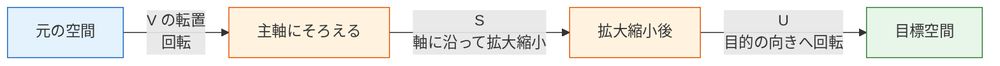

# 4.1.5 ベクトル空間と線形変換【選択】


:::info 選択章
この節の内容は、理解を**深める**のに役立ちます。AI プロジェクトをすぐに始めたいなら、いったん飛ばして、あとで関連する概念が出てきたときに戻ってきても大丈夫です。
:::

## 学習目標

- 線形独立、基底、次元の意味を理解する
- 線形変換の行列表現を理解する
- 特異値分解（SVD）を直感的に理解する

## まず、とても大事な学習イメージについて

この節は選択で、名前も少し抽象的なので、初心者は最初からペースが落ちやすいです。
この節でいちばん大事なのは、線形代数の高度な理論を全部完璧にすることではなく、まずはもっと高い視点を持つことです。

- これまでのベクトル、行列、固有値は、より大きな枠組みの中でそれぞれ何を表しているのか
- なぜ「次元」「基底」「線形独立」という言葉が、後の AI で何度も出てくるのか
- なぜ SVD が多くの手法の土台になるのか

つまり、この節は次のようなものです。

> **前の 3 節で身につけた直感を、より高いレベルの理解の枠組みにまとめること。**

---

## 残す証拠

このページを終えたら、この evidence card を残します。

```text
math_object: vector, matrix, eigenvalue, basis, or vector space concept
numeric_example: small numbers or NumPy snippet used to compute it
visual_or_output: shape, transformed point, similarity score, eigen direction, or projection
ai_link: where this appears in embeddings, batches, PCA, neural layers, or attention
Expected_output: calculation plus one sentence connecting it to an AI operation
```

## この節と前の 3 節はどうつながるの？

前の 3 節が「ベクトルをどう表すか、行列がどう変換するか、固有値で特別な方向をどう見つけるか」だったなら、この節はそれらを少し上の視点から見直すものです。


なので、この授業は「理解を深めるための整理回」のようなものです。すぐに全部を完全理解する必要はありませんが、学べると前の概念がなぜ成り立つのかがより見えてきます。

### 先に読み解いておきたい略語と記号

| 用語 | 英語の正式名称 | 初学者向けの意味 |
|---|---|---|
| `SVD` | Singular Value Decomposition | 特異値分解。行列を方向、強さ、再構成のステップに分ける |
| `PCA` | Principal Component Analysis | 主成分分析。データの重要な方向を見つけ、少ない次元で表す |
| `NLP` | Natural Language Processing | 自然言語処理。テキストや言語を扱う AI 手法 |
| `LSA` | Latent Semantic Analysis | 潜在意味解析。SVD を使って文章中の隠れたトピック構造を探す古典的手法 |
| `V^T` / `Vt` | V transpose | V の転置。行と列を入れ替えたもの。NumPy ではよく `Vt` と呼ばれる |
| `rank` | Matrix rank | 行列の中に、本当に独立した方向がいくつあるか |
| `basis` | Basis vectors | 空間を表すための、最小限で冗長でない座標方向 |
| `span` | Span of vectors | 与えられたベクトルを組み合わせて到達できる範囲 |
| `orthogonal` | Perpendicular / independent directions | 互いに重ならない方向。AI では情報をきれいに分けるイメージで使われる |
| `full_matrices=False` | Compact SVD mode | NumPy に必要な部分だけを返してもらう指定。再構成時に行列サイズを合わせやすい |
| `np.linalg` | NumPy linear algebra module | NumPy の線形代数ツール群。階数、連立方程式、固有値、SVD などを扱う |
| 低ランク近似 | Low-rank approximation | 重要な特異値だけを残し、弱い細部を捨てて少ない情報で元の行列を近似すること |

**この節のコード実行前提**：以下のコードは Notebook 形式を想定しています。順番に実行する場合、後のコードブロックは前で定義した `np`、`plt`、変数を再利用できます。1 つのコードブロックだけを新しい `.py` ファイルにコピーする場合は、先に次を追加してください。

```python
import numpy as np
import matplotlib.pyplot as plt
```

`np` は **NumPy** の標準的な短縮名です。NumPy は Python で配列や線形代数を扱う基礎ライブラリです。`plt` は **Matplotlib pyplot** のよく使われる短縮名で、図やグラフを描くために使います。

## 一、線形独立——「冗長でない」ベクトル

### 線形独立とは？

**直感**：ベクトルの集まりが「線形独立」であるとは、**それぞれのベクトルが独自の情報を持っていて、どれも余計ではない**という意味です。

### 初心者向けのたとえ

「線形独立」は、チームの役割分担のように考えると分かりやすいです。

- チームの各メンバーがそれぞれ違う能力を持っていれば、無駄がない
- 2 人がまったく同じ仕事をしているなら、そのうち 1 人は少し重複しています

だから、線形独立でまず覚えたいのは、厳密な定義よりもこの感覚です。

> **このベクトルの集まりの中に、ほかのベクトルですでに表せる、重複したものはあるか？**

```python
import numpy as np
import matplotlib.pyplot as plt

plt.rcParams['font.sans-serif'] = ['Arial Unicode MS']
plt.rcParams['axes.unicode_minus'] = False

# 線形独立の例：右向きと上向きで、方向がまったく違う
v1 = np.array([1, 0])
v2 = np.array([0, 1])

# 線形従属の例：v2 は v1 の 2 倍で、方向がまったく同じ
u1 = np.array([1, 2])
u2 = np.array([2, 4])  # u2 = 2 * u1, 冗長！
```

```python
fig, axes = plt.subplots(1, 2, figsize=(12, 5))

# 線形独立
ax = axes[0]
ax.quiver(0, 0, v1[0], v1[1], angles='xy', scale_units='xy', scale=1,
          color='steelblue', width=0.01, label='v1 = [1, 0]')
ax.quiver(0, 0, v2[0], v2[1], angles='xy', scale_units='xy', scale=1,
          color='coral', width=0.01, label='v2 = [0, 1]')
ax.set_xlim(-0.5, 2)
ax.set_ylim(-0.5, 2)
ax.set_aspect('equal')
ax.grid(True, alpha=0.3)
ax.legend()
ax.set_title('線形独立\n2 つの方向が異なり、冗長性がない')

# 線形従属
ax = axes[1]
ax.quiver(0, 0, u1[0], u1[1], angles='xy', scale_units='xy', scale=1,
          color='steelblue', width=0.01, label='u1 = [1, 2]')
ax.quiver(0, 0, u2[0], u2[1], angles='xy', scale_units='xy', scale=1,
          color='coral', width=0.01, label='u2 = [2, 4]')
ax.set_xlim(-0.5, 3)
ax.set_ylim(-0.5, 5)
ax.set_aspect('equal')
ax.grid(True, alpha=0.3)
ax.legend()
ax.set_title('線形従属\nu2 = 2×u1, 完全に冗長')

plt.tight_layout()
plt.show()
```

### AI における意味

| 場面 | 線形独立の意味 |
|------|--------------|
| 特徴量エンジニアリング | 2 つの特徴量が線形従属（例：「温度(℃)」と「温度(℉)」）なら、片方は冗長 |
| PCA による次元削減 | 主成分どうしは互いに直交しており（線形独立）、それぞれが独自の情報を持つ |
| ニューラルネットワーク | 重み行列の列が線形従属なら、いくつかのニューロンが冗長になっている可能性がある |

### 行列の階数で判定する

**行列の階数（rank）** = 行列の中で線形独立な行（または列）の最大数です。

```python
# 3 列が線形独立
A = np.array([[1, 0, 0],
              [0, 1, 0],
              [0, 0, 1]])
print(f"A の階数: {np.linalg.matrix_rank(A)}")  # 3（フルランク）

# 第 3 列 = 第 1 列 + 第 2 列、冗長！
B = np.array([[1, 0, 1],
              [0, 1, 1],
              [0, 0, 0]])
print(f"B の階数: {np.linalg.matrix_rank(B)}")  # 2（フルランクではない）
```

期待される出力：

```text
A の階数: 3
B の階数: 2
```

ここで「フルランク」は、まず「無駄な列がない」と考えると分かりやすいです。行列 `B` には 3 列ありますが、独立した方向は 2 つだけなので、有効な情報の次元は 2 です。

---

## 二、基底と次元——空間を表す「座標系」

### 基底（Basis）

**基底** = 線形独立なベクトルの集まりで、それらで空間全体を「張る」ことができるもの（つまり、どんなベクトルもそれらの組み合わせで表せる）。

### 基底でまず覚えるべきなのは、用語より役割

基底は、次のように考えるとよいです。

- 最小限で、十分で、しかも冗長でない座標系

つまり、

- すべてを表せる
- でも余計な方向はない

これが、後の多くの AI 手法で「よりよい表現の基底」を探す理由です。

いちばんよく使う基底は **標準基底** です。

```python
# 2 次元空間の標準基底
e1 = np.array([1, 0])  # x 方向
e2 = np.array([0, 1])  # y 方向

# どんな 2 次元ベクトルも標準基底で表せる
v = np.array([3, 5])
# v = 3 * e1 + 5 * e2

print(f"v = {v[0]} × e1 + {v[1]} × e2 = {v[0]*e1 + v[1]*e2}")
```

期待される出力：

```text
v = 3 × e1 + 5 × e2 = [3 5]
```

**標準基底以外も使えます**。

```python
# 別の基底に変える
b1 = np.array([1, 1])
b2 = np.array([1, -1])

# v = [3, 5] を新しい基底で表すと？
# v = c1 * b1 + c2 * b2
# 方程式を解く
B = np.column_stack([b1, b2])
coords = np.linalg.solve(B, v)
print(f"新しい基底での座標: {coords}")  # [4, -1]
# 確認: 4*[1,1] + (-1)*[1,-1] = [4,4]+[-1,1] = [3,5] ✓
```

期待される出力：

```text
新しい基底での座標: [ 4. -1.]
```

ここで大事なのは、ベクトルそのものは動いていないという点です。変わったのは、それを説明する座標系です。AI で「表現」という言葉が重要になる理由もここにあります。

### 次元（Dimension）

**次元** = 基底ベクトルの個数 = 空間を表すのに必要な最小の座標数。

### なぜ「次元」は AI でよく出るの？

AI では、次の 2 つがよく問題になります。

- 今の表現にどれだけ自由度があるか
- 次元を下げても、できるだけ情報を失わずに済むか

だから、AI における次元は単なる幾何の言葉ではなく、
多くの場合、次のような意味を持ちます。

- 計算コスト
- 情報量
- モデルの複雑さ

| 空間 | 次元 | 例 |
|------|------|------|
| 直線 | 1 | 温度の目盛り |
| 平面 | 2 | 地図上の位置 |
| 3 次元空間 | 3 | 現実世界の位置 |
| 単語ベクトル空間 | 100〜300 | 各単語の「意味の座標」 |
| 画像の画素空間 | 数万〜数百万 | 各画素が 1 つの次元 |

:::tip AI における次元
AI では「高次元空間」という言い方をよくします。たとえば、28×28 の手書き数字画像は、784 次元空間の 1 点です。PCA の本質は、新しい「基底」（主成分）を見つけて、より少ない次元（たとえば 2 次元）でデータを近似的に表せるようにすることです。
:::

---

## 三、線形変換の行列表現

### 線形変換 = 行列

とても重要な結論があります。**どんな線形変換も、行列で表せる** のです。

### これが AI で特に重要な理由

なぜなら、見た目は違っても、いろいろなものを同じ表現にまとめられるからです。

- 回転
- 拡大縮小
- 射影
- ニューラルネットワークの 1 層

つまり、AI の中の多くの「層」は、本質的にはまず次のように見ることができます。

- ある種の線形変換 + その後の非線形処理

線形変換とは何でしょうか？ それは、次の 2 条件を満たす変換 T です。
1. T(a + b) = T(a) + T(b)（足し算を「外に出し入れ」できる）
2. T(ka) = k·T(a)（スカラー倍を「外に出し入れ」できる）

```python
# 回転、拡大縮小、射影、せん断... すべて線形変換

# 標準基底ベクトルが変換後にどこへ行くかを見れば、行列が分かる
# 90° 回転の変換：
# e1 = [1, 0] → [0, 1]
# e2 = [0, 1] → [-1, 0]

# 変換後の基底ベクトルを列に並べれば、それが変換行列！
R90 = np.array([[0, -1],
                [1,  0]])

# 確認
print(R90 @ np.array([1, 0]))  # [0, 1] ✓
print(R90 @ np.array([0, 1]))  # [-1, 0] ✓
```

期待される出力：

```text
[0 1]
[-1  0]
```

行列は「基底ベクトルをどこへ送るか」で完全に決まります。つまり行列は単なる数字の表ではなく、変換をコンパクトに表した説明書です。

### 変換の合成 = 行列の掛け算

45° 回転してから 2 倍に拡大する？ 2 つの行列を掛け算するだけです。

```python
# 45° 回転
theta = np.radians(45)
R45 = np.array([
    [np.cos(theta), -np.sin(theta)],
    [np.sin(theta),  np.cos(theta)]
])

# 2 倍に拡大
S2 = np.array([
    [2, 0],
    [0, 2]
])

# まず回転して、次に拡大 = S2 @ R45（注意：右から左へ読む！）
combined = S2 @ R45
print(f"合成変換行列:\n{combined.round(3)}")

# ベクトルに適用
v = np.array([1, 0])
result = combined @ v
print(f"[1, 0] → {result.round(3)}")  # ≈ [1.414, 1.414]
```

期待される出力：

```text
合成変換行列:
[[ 1.414 -1.414]
 [ 1.414  1.414]]
[1, 0] → [1.414 1.414]
```

`S2 @ R45 @ v` は右から左へ読みます。つまり、ベクトルは先に回転し、その後に拡大されます。この「右端の操作が先に起こる」というルールは、ニューラルネットワークで行列演算をつなぐときにも何度も出てきます。

---

## 四、SVD——行列分解の「スイスアーミーナイフ」

### SVD とは？

**特異値分解（SVD）** は固有値分解の拡張で、**どんな形の** 行列にも使えます（正方行列に限りません）。

### 初心者向けのたとえ

SVD は、次のように考えるとよいです。

- 複雑な変換を、理解しやすい小さな動きに分けるもの

まるで、複雑な機械を分解して見るようなものです。

1. まず、どう向きをそろえるか
2. 次に、どう伸ばすか
3. 最後に、どう目的の向きに戻すか

だからこそ、SVD は多くの AI 手法の土台になります。

- ただ「計算できる」だけではない
- 構造を説明するのにも向いている


SVD は、行列 M を 3 つの行列の積に分解します。

**M = U × S × V^T**

ここで：
- U：左特異ベクトル（直交行列）
- S：特異値（対角行列で、大きい順に並ぶ）
- V^T：V の転置。右特異ベクトル行列を転置したもの

NumPy では、`np.linalg.svd()` は `U, S, Vt` を返します。`S` は対角行列ではなく 1 次元の特異値リストとして返るので、行列を再構成するときは通常 `np.diag(S)` で対角行列に変換します。

`full_matrices=False` は、NumPy にコンパクトな形で返してもらう指定です。初心者にとっては、こちらのほうが形を合わせやすくなります。

- `U`：`(行数, 特異値の個数)`
- `np.diag(S)`：`(特異値の個数, 特異値の個数)`
- `Vt`：`(特異値の個数, 列数)`

```python
# 任意の行列の SVD
M = np.array([
    [1, 2, 3],
    [4, 5, 6],
])  # 2×3 行列

U, S, Vt = np.linalg.svd(M, full_matrices=False)

print(f"U の形状: {U.shape}")     # (2, 2)
print(f"特異値 S: {S.round(3)}")  # [9.508, 0.773]
print(f"Vt の形状: {Vt.shape}")   # (2, 3)

# 確認: M ≈ U @ diag(S) @ Vt
reconstructed = U @ np.diag(S) @ Vt
print(f"\n再構成誤差: {np.linalg.norm(M - reconstructed):.10f}")  # ≈ 0
```

期待される出力：

```text
U の形状: (2, 2)
特異値 S: [9.508 0.773]
Vt の形状: (2, 3)

再構成誤差: 0.0000000000
```

1 つ目の特異値が 2 つ目よりかなり大きいので、この行列には強い主方向と、弱い補正方向があると見られます。「強い構造を先に残し、細部をあとで補う」という考え方が、SVD を圧縮や次元削減に使える理由です。

### SVD の直感

**SVD は、どんな変換も 3 段階に分けます**。



### SVD の応用：画像圧縮

SVD のいちばん分かりやすい応用は、少ないデータで画像を近似することです。

```python
# グレースケール画像の例
# ここではランダム数でグレースケール画像を模擬する
rng = np.random.default_rng(seed=42)
image = rng.integers(0, 256, (100, 150)).astype(float)
# 少し構造を入れる（完全なランダムではない）
for i in range(100):
    for j in range(150):
        image[i, j] = 128 + 50 * np.sin(i/10) * np.cos(j/15) + rng.normal() * 20

print(f"元画像: {image.shape} = {image.size} 個の値")

# SVD 分解
U, S, Vt = np.linalg.svd(image, full_matrices=False)
print(f"特異値の個数: {len(S)}")

for k in [1, 5, 20, 100]:
    compressed_size = k * (U.shape[0] + 1 + Vt.shape[1])
    ratio = compressed_size / image.size * 100
    print(f"k={k:3d}, 保存量は元画像の約 {ratio:5.1f}%")

# 特異値の数を変えて再構成
fig, axes = plt.subplots(1, 4, figsize=(16, 4))

for ax, k in zip(axes, [1, 5, 20, 100]):
    # 先頭の k 個だけ残す
    reconstructed = U[:, :k] @ np.diag(S[:k]) @ Vt[:k, :]

    # 圧縮率 = 保存する数 / 元の数
    original_size = image.size
    compressed_size = k * (U.shape[0] + 1 + Vt.shape[1])
    ratio = compressed_size / original_size * 100

    ax.imshow(reconstructed, cmap='gray')
    ax.set_title(f'k = {k}\n保存量: {ratio:.0f}%')
    ax.axis('off')

plt.suptitle('SVD による画像圧縮：少ない特異値で近似する', fontsize=13)
plt.tight_layout()
plt.show()
```

期待されるテキスト出力：

```text
元画像: (100, 150) = 15000 個の値
特異値の個数: 100
k=  1, 保存量は元画像の約   1.7%
k=  5, 保存量は元画像の約   8.4%
k= 20, 保存量は元画像の約  33.5%
k=100, 保存量は元画像の約 167.3%
```

**解釈**：特異値を最初の 20 個だけ残しても、画像の主要な構造はかなり再現できます。保存する数も大きく減ります。一方で `k=100` では全特異値を残すため再構成は最も正確ですが、`U`、`S`、`Vt` を別々に保存すると元画像より大きくなることがあります。圧縮として意味があるのは、`k` が元の階数より十分小さい場合です。

### AI における SVD の応用

| 応用 | 説明 |
|------|------|
| 画像圧縮 | 少数の特異値で元画像を近似する |
| レコメンドシステム | 行列分解（Netflix の推薦など） |
| NLP | 潜在意味解析（LSA）で SVD を使って単語-文書行列を次元削減する |
| データの次元削減 | SVD は PCA の土台になる |
| 擬似逆行列 | 過剰決定系・非正方系の方程式を解く |

実務でよく問われるのは、「完全に再構成できるか」ではなく、むしろ次の問いです。

> **近似がぼやけすぎたり、情報を失いすぎたりする前に、重要な方向をいくつ残すべきか？**

この問いは、モデル圧縮、Embedding 圧縮、レコメンドシステム、検索システムでも繰り返し出てきます。

### 初学者がまず覚えるとよい見分け表

| この言葉を見たら | まずこう考える |
|------|------|
| 線形独立 | 情報の冗長性があるか |
| 基底 | 最小限で十分な座標系 |
| 次元 | この表現に自由度はいくつあるか |
| 階数 | このデータに本当に有効な情報の次元はいくつか |
| SVD | 複雑な行列を、理解しやすい動きに分けるもの |

この表は初心者にとても役立ちます。なぜなら、あいまいで発散しやすい用語を、まずは使える直感にまとめられるからです。

### 最小の「低ランク近似」の例をもう一度見る

```python
M = np.array([
    [5.0, 4.8, 0.1],
    [4.9, 5.1, 0.2],
    [0.2, 0.1, 4.9],
])

U, S, Vt = np.linalg.svd(M, full_matrices=False)

# いちばん大きい特異値 1 個だけを残す
k = 1
Mk = U[:, :k] @ np.diag(S[:k]) @ Vt[:k, :]

print("元の行列:\n", np.round(M, 3))
print("\n低ランク近似:\n", np.round(Mk, 3))
print("\n再構成誤差:", round(np.linalg.norm(M - Mk), 4))
```

期待される出力：

```text
元の行列:
 [[5.  4.8 0.1]
 [4.9 5.1 0.2]
 [0.2 0.1 4.9]]

低ランク近似:
 [[4.895 4.894 0.294]
 [4.997 4.997 0.3  ]
 [0.297 0.297 0.018]]

再構成誤差: 4.8961
```

この例は初心者にとても向いています。なぜなら、次のことが見えるからです。

- SVD は単に行列を分解するためだけのものではない
- どの構造を重要視して残すか、どれだけ情報が失われるかを教えてくれる
- `k` が小さすぎると、最も強いパターンは残りますが、重要な小さなパターンが消えることもある

これこそが、多くの AI シーンにある共通の考え方です。

- 圧縮
- 次元削減
- 近似表現

---

## ここまで学んだら、次に何へつなげるのがよい？

第 4 ステップまで読んだら、次に持っていくべきなのは、さらに多くの数式ではなく、次の問いです。

1. これらの数学の対象は、機械学習の中で実際にどう使われるのか？
2. どんなときにベクトルは特徴量になり、行列は重みになるのか？
3. なぜ確率、勾配、そしてこれらの線形代数の対象が、同じモデルの中で一緒に出てくるのか？

次に読むのにおすすめなのは、通常こちらです。

- [5 第 5 ステップのトップページ](../../ch05-machine-learning/index.md)
- [5.1.6 数学がどのように機械学習へつながるのか](../../ch05-machine-learning/ch01-ml-basics/03-math-to-ml-bridge.md)

## もし今この節がまだ少し抽象的に感じるなら、まず何をつかむべき？

まず押さえるべきなのは、すべての定義ではなく、この 4 つです。

1. 線形独立 = 冗長性がない
2. 基底 = 最小限で十分な表し方
3. 次元 = 表すのにいくつの自由度が必要か
4. SVD = 複雑な行列変換を分解する

:::info 本章のまとめ
線形代数の 4 つの授業で、あなたは次を学びました。
1. **ベクトル**：AI における基本データ単位。余弦類似度は方向の似ている度合いを測る
2. **行列**：データをまとめて変換する。ニューラルネットワーク各層の中心的な操作
3. **固有値**：データの最も重要な方向を見つける。PCA による次元削減
4. **ベクトル空間**（この節）：次元、基底、SVD を理解する

これらの概念は、今後機械学習、深層学習、NLP を学ぶ中で何度も出てきます。すべての細部を急いで覚える必要はありません。実践を重ねるにつれて、理解はどんどん深まっていきます。
:::

---

## まとめ

| 概念 | 直感 | NumPy |
|------|------|-------|
| 線形独立 | 冗長性のないベクトルの集まり | `np.linalg.matrix_rank(A)` |
| 基底 | 空間を表す座標系 | — |
| 次元 | いくつの座標が必要か | `A.shape` |
| 線形変換 | 行列の掛け算 | `A @ v` |
| SVD | 任意の行列 = 回転 × 拡大縮小 × 回転 | `np.linalg.svd(A)` |
| 行列の階数 | 有効な次元数 | `np.linalg.matrix_rank(A)` |

## この節でいちばん持ち帰ってほしいこと

- 線形独立で最も大事な直感は「情報の冗長性があるか」
- 基底で最も大事な直感は「最小限で十分な座標系」
- 次元で最も大事な直感は「この表現にどれだけ自由度が必要か」
- SVD で最も大事な直感は「複雑な変換を、理解しやすいいくつかの動きに分けること」

## ハンズオン練習

### 練習 1：線形独立を判定する

次の 3 組のベクトルのうち、どれが線形独立か？ `np.linalg.matrix_rank()` で確認してください。

```python
# 第 1 組
g1 = np.array([[1, 2], [3, 6]])

# 第 2 組
g2 = np.array([[1, 0], [0, 1]])

# 第 3 組
g3 = np.array([[1, 2, 3], [4, 5, 6], [5, 7, 9]])

for name, matrix in {"g1": g1, "g2": g2, "g3": g3}.items():
    rank = np.linalg.matrix_rank(matrix)
    dimension = matrix.shape[0]
    print(f"{name}: rank={rank}, dimension={dimension}, independent={rank == dimension}")
```

期待される出力：

```text
g1: rank=1, dimension=2, independent=False
g2: rank=2, dimension=2, independent=True
g3: rank=2, dimension=3, independent=False
```

### 練習 2：SVD 圧縮

`50×80` のランダム行列に SVD で低ランク近似を行い、k の値ごとの再構成誤差の曲線を描いてください。

```python
rng = np.random.default_rng(seed=42)
M = rng.normal(size=(50, 80))
U, S, Vt = np.linalg.svd(M, full_matrices=False)

errors = []
for k in range(1, 51):
    reconstructed = U[:, :k] @ np.diag(S[:k]) @ Vt[:k, :]
    error = np.linalg.norm(M - reconstructed)
    errors.append(error)

plt.plot(range(1, 51), errors, marker="o")
plt.xlabel("k：残す特異値の個数")
plt.ylabel("再構成誤差")
plt.title("SVD の再構成誤差は k が増えると下がる")
plt.grid(alpha=0.3)
plt.show()
```

期待される結果：曲線は全体として下がります。特異値を多く残すほど情報が多く残るため、再構成誤差は小さくなります。

### 練習 3：変換の合成

2 つの 2×2 変換行列を作ってください。まず拡大縮小（x を 2 倍、y はそのまま）、次に 30° 回転です。それらを掛け合わせて合成行列を作り、三角形の頂点の集合に変換を適用して描画してください。

```python
theta = np.radians(30)
scale = np.array([[2, 0], [0, 1]])
rotate = np.array([
    [np.cos(theta), -np.sin(theta)],
    [np.sin(theta),  np.cos(theta)],
])

# 先に拡大縮小し、次に回転する：右端の操作が先に起こる。
combined = rotate @ scale

triangle = np.array([
    [0, 0],
    [1, 0],
    [0.5, 1],
    [0, 0],
])
transformed = triangle @ combined.T

print("合成行列:\n", np.round(combined, 3))
print("変換後の頂点:\n", np.round(transformed, 3))

plt.plot(triangle[:, 0], triangle[:, 1], "o-", label="元の三角形")
plt.plot(transformed[:, 0], transformed[:, 1], "o-", label="変換後の三角形")
plt.axis("equal")
plt.grid(alpha=0.3)
plt.legend()
plt.show()
```

期待されるテキスト出力：

```text
合成行列:
 [[ 1.732 -0.5  ]
 [ 1.     0.866]]
変換後の頂点:
 [[0.    0.   ]
 [1.732 1.   ]
 [0.366 1.366]
 [0.    0.   ]]
```


<details>
<summary>参考解答と解説</summary>

- rank チェックでは、`g1` は rank 1 なので独立ではなく、`g2` は rank 2 なので独立、`g3` は rank 2 なので独立ではありません。
- SVD 圧縮では、`k` が増えるほど再構成誤差は下がり、すべての特異値を使うと 0 に近づきます。曲線が上がるなら、再構成式かスライスが間違っています。
- よい説明は rank と冗長性を結びつけます。独立なベクトルは新しい方向を加え、従属なベクトルは既存情報を繰り返します。

</details>
