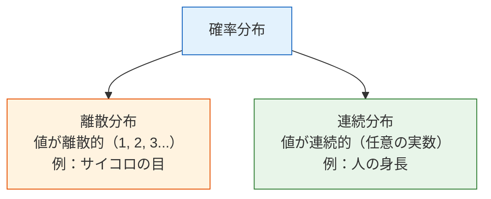
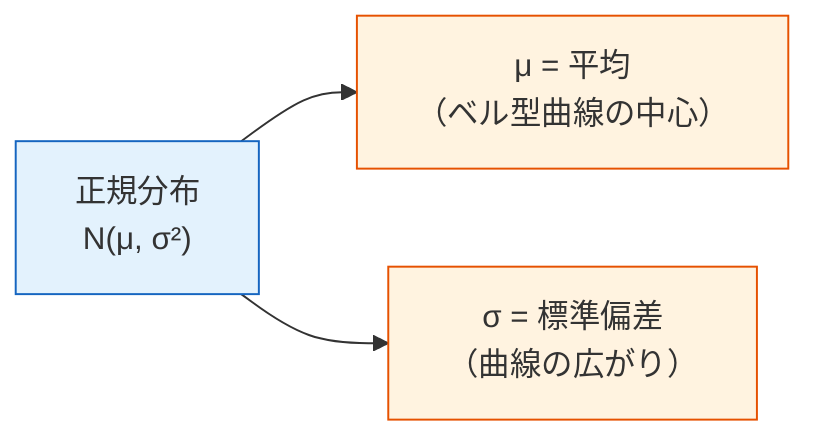

# 4.2.3 確率分布：データの背後にある法則


## 学習目標

- 確率分布とは何かを理解する
- よくある離散分布（ベルヌーイ、二項、ポアソン）を身につける
- よくある連続分布（均一、正規/ガウス）を身につける
- 中心極限定理を直感的に理解する——なぜ正規分布があちこちに現れるのか
- Python でさまざまな分布を生成し、可視化する

## グラフを描く前に用語を読み解こう

この節では、短く見えて意味の多い分布用語がいくつも出てきます。

| 用語 | 正式名称 / 意味 | 初学者向けの理解 |
|---|---|---|
| `random variable` | 確率変数 | 観測する不確実な対象。クリック数、身長、サイコロの目、来客数など |
| `PMF` | Probability Mass Function | 離散値ごとに、どれだけ確率が割り当てられているか |
| `PDF` | Probability Density Function | 連続値で、どこに確率密度が高いか低いか |
| `CDF` | Cumulative Distribution Function | あるしきい値以下になる累積確率 |
| `μ` / `mu` | 平均 | 分布の中心、または平均的な位置 |
| `σ` / `sigma` | 標準偏差 | 分布がどれくらい広がっているか |
| `λ` / `lambda_` | 率または平均回数 | ポアソン分布では、固定区間内で平均何回起きるか |
| `SciPy stats` | SciPy の統計関数モジュール | PMF、PDF、CDF、よくある分布を扱う Python の道具箱 |

ローカルでこの節のコードを実行する場合は、次の 3 つのライブラリをインストールしてください。

```bash
python3 -m pip install numpy matplotlib scipy
```

コードで `lambda` ではなく `lambda_` と書くのは、`lambda` が Python の無名関数のキーワードであり、変数名として使えないためです。

## まず、とても大事な学習イメージを確認しよう

この節の目的は、すべての分布を「試験対策用の完全版」として覚えることではありません。  
まずは、次のとても大事な感覚をつかむことです。

- 確率の基礎は、1つ1つの事象を見る
- 確率分布は、「ランダムな現象全体がどんな姿をしているか」を見る

---

## まず地図を1枚作ろう

前の節で学んだのが「単一事象の確率」なら、この節で学ぶのは：

> **ランダムな現象全体が、どんな形になるか。**


この節のポイントは、すべての分布を暗記することではなく、まず次を知ることです。

- どんな場面でその分布が出てくるのか
- だいたいどんな形をしているのか
- AI でなぜ何度も出会うのか

## 一、確率分布とは？

**確率分布 = ある確率変数が取りうるすべての値と、それぞれの値が出る確率。**

### 初心者向けのたとえ

確率が「ある1回が起こるかどうか」だとすると、  
分布はもっと次のようなものです。

- 長い期間で集計した「可能性の地図」



```python
import numpy as np
import matplotlib.pyplot as plt
from scipy import stats

plt.rcParams['font.sans-serif'] = ['Arial Unicode MS']
plt.rcParams['axes.unicode_minus'] = False
```

`stats` は SciPy の分布ツールです。この節では、二項分布・ポアソン分布・正規分布の公式を手書きせず、直感に集中するために使います。

---

## 二、離散分布

### ベルヌーイ分布——結果は2種類だけ

**1回だけ実験**して、結果が"成功"（1）か"失敗"（0）しかない場合です。

```python
# ベルヌーイ分布：コインを1回投げる
# p = 成功確率
p = 0.6  # 偏ったコイン、表が出る確率 60%

# 10000回シミュレーション
rng = np.random.default_rng(seed=42)
samples = rng.binomial(1, p, 10000)
print(f"表の割合: {samples.mean():.3f}")  # ≈ 0.6

fig, ax = plt.subplots(figsize=(6, 4))
values, counts = np.unique(samples, return_counts=True)
ax.bar(['裏 (0)', '表 (1)'], counts / len(samples), 
       color=['coral', 'steelblue'], edgecolor='white')
ax.set_ylabel('確率')
ax.set_title(f'ベルヌーイ分布 (p={p})')
ax.set_ylim(0, 1)
plt.show()
```

`seed=42` の場合の期待される出力：

```text
表の割合: 0.605
```

**AI での応用**：二値分類タスクのラベルはベルヌーイ分布（0 か 1）です。

### 二項分布——複数回のベルヌーイの合計

**n 回ベルヌーイ実験をして、成功した回数の合計**が二項分布に従います。

```python
# 二項分布：コインを20回投げて、表が出る回数
n = 20   # 実験回数
p = 0.5  # 各回の成功確率

# 理論分布
x = np.arange(0, n + 1)
pmf = stats.binom.pmf(x, n, p)

# シミュレーション
rng = np.random.default_rng(seed=42)
samples = rng.binomial(n, p, 10000)
print(f"期待される表の回数 n*p: {n*p:.1f}")
print(f"最も起こりやすい表の回数: {x[pmf.argmax()]}")
print(f"シミュレーション平均: {samples.mean():.3f}")

fig, axes = plt.subplots(1, 2, figsize=(14, 5))

# 理論
axes[0].bar(x, pmf, color='steelblue', edgecolor='white')
axes[0].set_xlabel('表の回数')
axes[0].set_ylabel('確率')
axes[0].set_title(f'二項分布 B(n={n}, p={p})（理論）')

# シミュレーション
axes[1].hist(samples, bins=range(n+2), density=True, color='coral', edgecolor='white', alpha=0.7)
axes[1].set_xlabel('表の回数')
axes[1].set_ylabel('頻度')
axes[1].set_title(f'二項分布 B(n={n}, p={p})（シミュレーション 10000回）')

plt.tight_layout()
plt.show()
```

`seed=42` の場合の期待される出力：

```text
期待される表の回数 n*p: 10.0
最も起こりやすい表の回数: 10
シミュレーション平均: 9.984
```

**重要なパラメータ**：
- 平均 = n × p（20回公平なコインを投げると、期待される表の回数は10回）
- 分散 = n × p × (1-p)

### ポアソン分布——「まれな事象」の回数

**決まった時間/空間の中で、あるまれな事象が何回起きるか**を表します。

```python
# ポアソン分布：あるタピオカ店に1時間あたり平均5人来る
lambda_ = 5  # 平均値（λ）

x = np.arange(0, 20)
pmf = stats.poisson.pmf(x, lambda_)

fig, ax = plt.subplots(figsize=(8, 5))
ax.bar(x, pmf, color='mediumseagreen', edgecolor='white')
ax.set_xlabel('1時間あたりの来客数')
ax.set_ylabel('確率')
ax.set_title(f'ポアソン分布 Poisson(λ={lambda_})')
ax.set_xticks(x)
plt.show()

print(f"0人来る確率: {stats.poisson.pmf(0, lambda_):.4f}")
print(f"5人来る確率: {stats.poisson.pmf(5, lambda_):.4f}")
print(f"10人以上来る確率: {1 - stats.poisson.cdf(9, lambda_):.4f}")
```

期待される出力：

```text
0人来る確率: 0.0067
5人来る確率: 0.1755
10人以上来る確率: 0.0318
```

**AI での応用**：文章中の珍しい単語の出現回数、Webサイトのアクセス数、異常事象の検出。

---

## 三、連続分布

### 均一分布——完全にランダム

どの値も出る確率が同じです。

```python
# 均一分布 U(0, 1)
rng = np.random.default_rng(seed=42)
samples = rng.uniform(0, 1, 10000)
print(f"均一分布サンプル平均: {samples.mean():.3f}")
print(f"均一分布サンプル最小/最大: {samples.min():.3f}/{samples.max():.3f}")

fig, ax = plt.subplots(figsize=(8, 4))
ax.hist(samples, bins=50, density=True, color='steelblue', edgecolor='white', alpha=0.7)
ax.axhline(y=1, color='red', linestyle='--', label='理論密度 = 1')
ax.set_xlabel('値')
ax.set_ylabel('確率密度')
ax.set_title('均一分布 U(0, 1)')
ax.legend()
plt.show()
```

`seed=42` の場合の期待される出力：

```text
均一分布サンプル平均: 0.497
均一分布サンプル最小/最大: 0.000/1.000
```

**AI での応用**：重みのランダム初期化、ランダムサンプリング、データ拡張でのランダム変換。

### 正規分布（ガウス分布）——最も重要な分布

正規分布は **ガウス分布** とも呼ばれます。`stats.norm.pdf(x, mu, sigma)` は、ベル型曲線の `x` 位置での高さを返します。連続分布では、この高さそのものは確率ではありません。区間の確率は、曲線の下の面積です。



```python
fig, axes = plt.subplots(1, 2, figsize=(14, 5))

# 異なる平均
x = np.linspace(-8, 12, 1000)
for mu in [-2, 0, 3, 5]:
    axes[0].plot(x, stats.norm.pdf(x, mu, 1), linewidth=2, label=f'μ={mu}, σ=1')
axes[0].set_title('異なる平均 μ（中心の位置が違う）')
axes[0].legend()
axes[0].set_xlabel('x')
axes[0].set_ylabel('確率密度')

# 異なる標準偏差
for sigma in [0.5, 1, 2, 4]:
    axes[1].plot(x, stats.norm.pdf(x, 0, sigma), linewidth=2, label=f'μ=0, σ={sigma}')
axes[1].set_title('異なる標準偏差 σ（広がりが違う）')
axes[1].legend()
axes[1].set_xlabel('x')
axes[1].set_ylabel('確率密度')

plt.tight_layout()
plt.show()
```

### 68-95-99.7 ルール

正規分布には、とても実用的な法則があります。

```python
mu, sigma = 0, 1

print("68-95-99.7 ルール：")
for k, pct in [(1, '68.3%'), (2, '95.4%'), (3, '99.7%')]:
    area = stats.norm.cdf(mu + k*sigma) - stats.norm.cdf(mu - k*sigma)
    print(f"  μ ± {k}σ の範囲内: {area:.1%} のデータ（理論 {pct}）")
```

期待される出力：

```text
68-95-99.7 ルール：
  μ ± 1σ の範囲内: 68.3% のデータ（理論 68.3%）
  μ ± 2σ の範囲内: 95.4% のデータ（理論 95.4%）
  μ ± 3σ の範囲内: 99.7% のデータ（理論 99.7%）
```

```python
# 68-95-99.7 を可視化
fig, ax = plt.subplots(figsize=(10, 5))
x = np.linspace(-4, 4, 1000)
y = stats.norm.pdf(x)

ax.plot(x, y, 'k-', linewidth=2)

# 塗りつぶし領域
colors = ['steelblue', 'cornflowerblue', 'lightblue']
labels = ['68.3%（±1σ）', '95.4%（±2σ）', '99.7%（±3σ）']
for k, color, label in zip([3, 2, 1], colors[::-1], labels[::-1]):
    mask = (x >= -k) & (x <= k)
    ax.fill_between(x[mask], y[mask], alpha=0.5, color=color, label=label)

ax.set_xlabel('標準偏差')
ax.set_ylabel('確率密度')
ax.set_title('正規分布の 68-95-99.7 ルール')
ax.legend(loc='upper right')
plt.show()
```

### 正規分布の AI での応用

| 応用シーン | 説明 |
|---------|------|
| 重みの初期化 | ニューラルネットワークの重みは、通常正規分布で初期化します（例：He 初期化、Xavier 初期化） |
| データの標準化 | データを平均 0、標準偏差 1 の「標準正規」にする |
| ノイズのモデル化 | センサーノイズ、測定誤差は通常、正規分布を仮定する |
| 生成モデル | VAE や拡散モデルは正規分布からサンプリングして新しいデータを生成する |
| 異常検知 | 平均から 3σ 以上離れたデータ点は異常値かもしれない |

---

## 四、中心極限定理——最も重要な定理

### 核心の考え方

**元のデータがどんな分布でも、多数の独立サンプルの平均は正規分布に近づく。**

だからこそ、正規分布は自然界やデータサイエンスにあちこち現れます。  
多くの現象は、実はたくさんの独立した要因が重なった結果だからです。

### コードで確かめよう

```python
fig, axes = plt.subplots(2, 3, figsize=(16, 10))

# まったく異なる3つの元の分布
rng = np.random.default_rng(seed=42)
distributions = [
    ('均一分布', lambda n: rng.uniform(0, 1, n)),
    ('指数分布', lambda n: rng.exponential(1, n)),
    ('二項分布', lambda n: rng.binomial(10, 0.3, n)),
]

for col, (name, dist_func) in enumerate(distributions):
    # 上：元の分布
    samples = dist_func(10000)
    axes[0, col].hist(samples, bins=50, density=True, color='coral', 
                       edgecolor='white', alpha=0.7)
    axes[0, col].set_title(f'元の分布：{name}')
    axes[0, col].set_ylabel('確率密度')
    
    # 下：30個のサンプルの平均を取り、10000回繰り返す
    n_samples = 30
    means = np.array([dist_func(n_samples).mean() for _ in range(10000)])
    
    axes[1, col].hist(means, bins=50, density=True, color='steelblue', 
                       edgecolor='white', alpha=0.7)
    
    # 正規分布曲線を重ねる
    x = np.linspace(means.min(), means.max(), 100)
    axes[1, col].plot(x, stats.norm.pdf(x, means.mean(), means.std()), 
                       'r-', linewidth=2, label='正規分布フィット')
    axes[1, col].set_title(f'標本平均の分布（n={n_samples}）')
    axes[1, col].set_ylabel('確率密度')
    axes[1, col].legend()
    print(f"{name}: 標本平均の平均={means.mean():.3f}, 標準偏差={means.std():.3f}")

plt.suptitle('中心極限定理：元の分布が何でも、標本平均は正規分布に近づく', 
             fontsize=14, y=1.01)
plt.tight_layout()
plt.show()
```

`seed=42` の場合の期待される出力：

```text
均一分布: 標本平均の平均=0.500, 標準偏差=0.053
指数分布: 標本平均の平均=0.999, 標準偏差=0.182
二項分布: 標本平均の平均=3.005, 標準偏差=0.262
```

**読み解き**：元のデータが均一でも、偏っていても、離散的でも、十分多くのサンプルの平均を取れば、分布は正規分布に近づきます。

### サンプル数の影響

```python
fig, axes = plt.subplots(1, 4, figsize=(18, 4))

# 指数分布（かなり偏っている）で実験
rng = np.random.default_rng(seed=42)
for ax, n in zip(axes, [1, 5, 30, 100]):
    means = [rng.exponential(1, n).mean() for _ in range(10000)]
    ax.hist(means, bins=50, density=True, color='steelblue', edgecolor='white', alpha=0.7)
    
    x = np.linspace(min(means), max(means), 100)
    ax.plot(x, stats.norm.pdf(x, np.mean(means), np.std(means)), 'r-', linewidth=2)
    ax.set_title(f'n = {n}')
    ax.set_xlabel('標本平均')

plt.suptitle('サンプル数が大きいほど、平均の分布は正規分布に近づく', fontsize=13)
plt.tight_layout()
plt.show()
```

:::tip 経験則
通常、n ≥ 30 なら中心極限定理の効果はかなりよく働きます。  
多くの統計手法で「サンプル数は少なくとも 30」と言われるのはこのためです。
:::

---

## 五、分布一覧表

| 分布 | 種類 | パラメータ | 典型的な場面 | NumPy 生成 |
|------|------|------|---------|-----------|
| ベルヌーイ | 離散 | p（成功確率） | 二値分類ラベル | `rng.binomial(1, p)` |
| 二項 | 離散 | n, p | n 回の実験で成功した回数 | `rng.binomial(n, p)` |
| ポアソン | 離散 | λ（平均回数） | まれな事象の回数 | `rng.poisson(lam)` |
| 均一 | 連続 | a, b（範囲） | ランダム初期化 | `rng.uniform(a, b)` |
| 正規 | 連続 | μ, σ（平均, 標準偏差） | ノイズ、重みの初期化 | `rng.normal(mu, sigma)` |
| 指数 | 連続 | λ（率） | 事象間の時間間隔 | `rng.exponential(1/lam)` |

---

## ここまで学んだら、次の節では何を意識して進もう？

分布を学んだあと、次の節に持っていくとよい問いは次の3つです。

1. ある分布の形が分かっているとき、観測データからどうやってパラメータを推定するのか？
2. 「データをうまく説明する」とは、具体的にどういう意味なのか？
3. A/B テストで差が出たとき、それが本当の差なのか、それとも偶然のゆらぎなのか、どう見分けるのか？

この3つの問いは、そのまま次へつながります。

- [4.2.4 統計的推論の基礎](./03-statistical-inference.md)

:::info 今後とのつながり
- **次の節**：統計的推論——データから分布のパラメータを推定する
- **5 機械学習入門から実践まで**：ロジスティック回帰は sigmoid 関数でベルヌーイ分布のパラメータ p を出力する
- **6 深層学習と Transformer 基礎**：ニューラルネットワークの重みは正規分布で初期化する（He/Xavier 初期化）
- **7 大規模モデルの原理、Prompt と微調整**：VAE モデルは潜在変数が正規分布に従うと仮定する
:::

---

## まとめ

| 概念 | 直感 |
|------|------|
| 確率分布 | 確率変数の「可能性の地図」 |
| 離散分布 | 有限個の値を取り、それぞれに確率がある |
| 連続分布 | 任意の値を取り、確率密度関数で表す |
| PMF | 各離散値に割り当てられた確率 |
| PDF | 連続値の確率密度曲線。確率は曲線下の面積として考える |
| CDF | ある値までの累積確率 |
| 正規分布 | 最も重要な分布——ベル型曲線、μ と σ で決まる |
| 中心極限定理 | 標本平均は正規分布に近づく。元の分布には依存しない |

## この節で一番持ち帰ってほしいこと

- 確率分布で最も大事なのは、「ランダムな現象全体がどんな姿か」という直感
- ベルヌーイ、二項、ポアソンは離散的な数え上げの問題を見る
- 正規分布と中心極限定理は、この後の AI でも何度も出てくる

## 手を動かしてみよう

### 練習 1：すべての分布を描く

1つの 2×3 のサブプロットに、ベルヌーイ、二項、ポアソン、均一、正規、指数分布のグラフをそれぞれ描いてみましょう。

参考実装：

```python
rng = np.random.default_rng(seed=42)
fig, axes = plt.subplots(2, 3, figsize=(15, 8))
axes = axes.ravel()

axes[0].bar([0, 1], [0.4, 0.6], color=["coral", "steelblue"])
axes[0].set_title("Bernoulli(p=0.6)")

x = np.arange(0, 21)
axes[1].bar(x, stats.binom.pmf(x, 20, 0.5), color="steelblue")
axes[1].set_title("Binomial(n=20, p=0.5)")

x = np.arange(0, 16)
axes[2].bar(x, stats.poisson.pmf(x, 5), color="mediumseagreen")
axes[2].set_title("Poisson(lambda=5)")

samples = rng.uniform(0, 1, 10000)
axes[3].hist(samples, bins=40, density=True, color="steelblue", alpha=0.7)
axes[3].set_title("Uniform(0, 1)")

x = np.linspace(-4, 4, 300)
axes[4].plot(x, stats.norm.pdf(x), color="black")
axes[4].set_title("Normal(0, 1)")

samples = rng.exponential(1, 10000)
axes[5].hist(samples, bins=40, density=True, color="orange", alpha=0.7)
axes[5].set_title("Exponential(scale=1)")

plt.tight_layout()
plt.show()
```

### 練習 2：68-95-99.7 を確かめる

N(170, 5) の身長データを 100000 個生成し（平均 170cm、標準偏差 5cm）、160〜180cm の範囲に入る人の割合（±2σ）を確かめましょう。

参考実装：

```python
rng = np.random.default_rng(seed=42)
heights = rng.normal(170, 5, 100000)
within = ((heights >= 160) & (heights <= 180)).mean()
print(f"身長が 160-180cm に入る割合: {within:.1%}")
```

期待される出力：

```text
身長が 160-180cm に入る割合: 95.4%
```

### 練習 3：中心極限定理の実験

サイコロ（1〜6 の均一分布）で中心極限定理を実験してみましょう。  
1回、10回、50回、200回サイコロを振って平均値を取り、それぞれ 10000 組繰り返し、平均値の分布を描きます。

参考実装：

```python
rng = np.random.default_rng(seed=42)
for n_rolls in [1, 10, 50, 200]:
    means = rng.integers(1, 7, size=(10000, n_rolls)).mean(axis=1)
    print(f"サイコロ n={n_rolls}: 平均={means.mean():.3f}, 標準偏差={means.std():.3f}")
```

期待される出力：

```text
サイコロ n=1: 平均=3.475, 標準偏差=1.704
サイコロ n=10: 平均=3.503, 標準偏差=0.541
サイコロ n=50: 平均=3.499, 標準偏差=0.241
サイコロ n=200: 平均=3.500, 標準偏差=0.120
```

平均は 3.5 に近いままですが、平均値の標準偏差はどんどん小さくなります。これが中心極限定理がコード上で見えている状態です。
