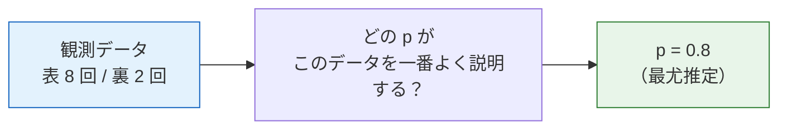
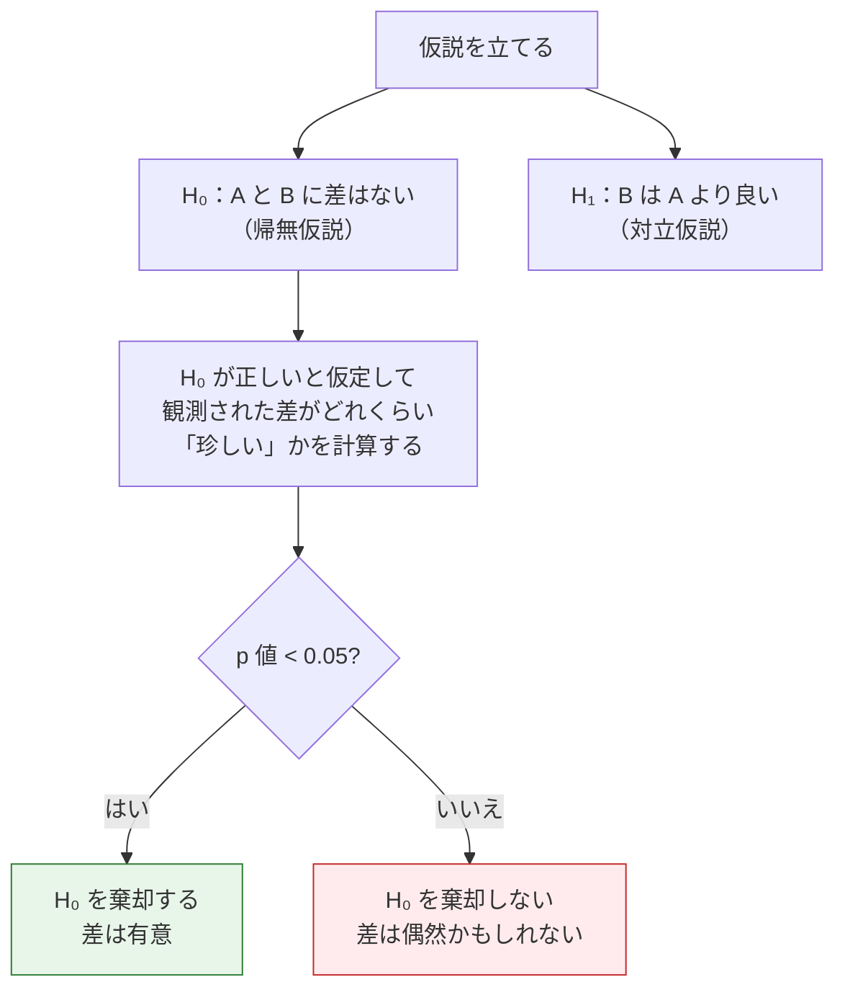
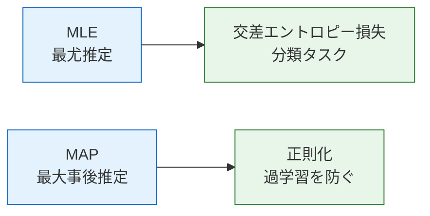

# 統計推論の基礎


:::tip 統計推論 = データから規則を逆に推測する
前の節では、いろいろな確率分布を学びました。でも現実世界では、分布のパラメータは分かりません（たとえば、コインの表が出る確率がいくつか、など）。統計推論とは、**観測したデータから分布のパラメータを逆に推測すること**です。
:::

## 学習目標

- 最尤推定（MLE）の直感を理解する——なぜ「確率を最大化する」のか
- 最大事後推定（MAP）を理解する——事前知識を加える
- 仮説検定と p 値を理解する（A/Bテストの考え方）
- Python で MLE を実装する

## 歴史的背景：MLE と EM はそれぞれどう生まれたのか？

この節には、特に知っておくとよい歴史的な節目が 2 つあります。

| 年 | 節目 | 主要な著者 | 最も重要に解決したこと |
|---|---|---|---|
| 1922 | Maximum Likelihood Estimation | Ronald Fisher | 「観測データを最もよく説明するパラメータ」を体系化し、統計学習や損失関数の主流の重要な土台になった |
| 1977 | EM Algorithm | Dempster, Laird, Rubin | 「潜在変数や欠損情報がある」パラメータ推定問題に、安定した反復フレームワークを与えた |

ここでとても大事な区別があります。

- **MLE** は、より広い分野 / 原則
- **EM** は、ある種の難しい場面で MLE を求めるための代表的な方法

なので、初めてこの節を学ぶ人がまず知るべきなのは次のことです。

> **MLE は「どのパラメータが本物らしいか」を答え、EM は「問題の中に見えない部分があるとき、どうやって少しずつそのパラメータに近づくか」を答えます。**

### なぜこの流れは、初学者にとって特に魅力的なのか？

それは、「データから規則を逆に推測する」ことが、まるで事件を解くように感じられるからです。

- 真実を直接見ているわけではない
- パラメータも誰も教えてくれない
- でも、手元にはたくさんの観測の痕跡がある

すると、問題はこう変わります。

- どんな説明が、この痕跡を一番うまくつなげられるのか？

MLE は「探偵っぽい」と感じさせ、  
EM は「見えない箱の中を手探りで進む」ように感じさせます。  
だから、統計推論を初めて真剣に学ぶ人は、突然こう思うことがあります。

> **なるほど、モデルの学習は単に式を計算するだけではなく、段階的に逆算していく作業なんだ。**

### なぜこの流れが、その後の統計学習でとても重要になったのか？

とても素朴な問いを、すごく分かりやすく説明しているからです。

- 世界はパラメータをそのまま教えてくれない
- だから、データから逆向きに推測するべき

MLE の一番魅力的なところは、まさに探偵の仕事に似ていることです。

- 現場にはたくさんの痕跡が残っている
- 真実は分からない
- でも「どの説明が本当に起きたことに一番近いか？」は考えられる

そして EM は、こう言っているようなものです。

- 現場の情報の一部が、どうしても見えないなら
- それでも諦めず、まず 1 回仮定して、そこから何度も修正して近づいていこう

だから、この主線が初学者にとって魅力的なのは、

> **「データから規則を逆に推測する」ことが、段階的で、戦略があり、少しずつ近づけるプロセスとして見えるようになるからです。**

## まず、とても大事な学習イメージ

この節は、`MLE / MAP / p 値` が出てきたところで、急に難しく感じやすいです。  
でも、ここで大事なのは、統計推論を統計学の授業のように全部完璧に覚えることではなく、まず次のことを知ることです。

- データが見えたとき、私たちは何を逆に推測したいのか
- 「データを最もよく説明する」とは、数学的にどういう意味か
- なぜこれらの考え方が、最終的に loss、正則化、A/Bテストにそのままつながるのか

---

## まずは全体の地図を作る

前の 2 つの節では「確率をどう定義するか、分布はどんな形か」を学びました。  
ここからは次の段階に進みます。

> **データを手に入れたとき、その背後にあるパラメータや結論をどう逆推測するのか？**


この節で一番大事なのは、用語を覚えることより、まず次の 3 つをつかむことです。

- MLE：どのパラメータがこのデータを一番よく説明するか
- MAP：データに加えて、事前の常識も考える
- 仮説検定：差が見えたとき、それが偶然かどうかを判断する

## 一、最尤推定（MLE）

### 1.1 直感：どのパラメータがデータを一番よく説明するか？

コインを 1 枚拾いました。公平かどうか分かりません。10 回投げたら、**表表裏表表表裏表表表** でした（表 8 回、裏 2 回）。

**質問：このコインが表になる確率 p は、どれくらいが最もありそうでしょうか？**

直感的には、p ≈ 0.8 です。MLE はこの直感を数式にしたものです——**観測されたデータが起こる確率を最大にするパラメータを見つける**のです。

### 1.1.1 初学者向けの、もっと覚えやすい例え

MLE はまず、「探偵が事件を再現する」作業だと思うと分かりやすいです。

- すでにいくつかの手がかり（観測データ）を見ている
- そこから、どんなパラメータ設定ならこの出来事が本当に起きたように見えるかを逆算する

つまり、MLE の中心は「最大化したいから最大化する」のではなく、こういうことです。

> **目の前のデータを最もよく説明できるパラメータを見つける。**



### 1.2 コードで理解する

```python
import numpy as np
import matplotlib.pyplot as plt
from scipy import stats

plt.rcParams['font.sans-serif'] = ['Arial Unicode MS']
plt.rcParams['axes.unicode_minus'] = False

# 観測データ：10 回投げて、表 8 回・裏 2 回
n_heads = 8
n_tails = 2
n_total = n_heads + n_tails

# さまざまな p について、このデータが起こる確率（尤度関数）を計算する
p_values = np.linspace(0.01, 0.99, 1000)

# 尤度関数：L(p) = C(n,k) * p^k * (1-p)^(n-k)
# p に依存しない C(n,k) は無視してよい
likelihood = p_values**n_heads * (1 - p_values)**n_tails

# MLE：尤度が最大の p
p_mle = p_values[np.argmax(likelihood)]
print(f"MLE 推定: p = {p_mle:.3f}")

# 可視化
plt.figure(figsize=(10, 5))
plt.plot(p_values, likelihood, color='steelblue', linewidth=2)
plt.axvline(x=p_mle, color='red', linestyle='--', linewidth=2, label=f'MLE: p = {p_mle:.2f}')
plt.fill_between(p_values, likelihood, alpha=0.1, color='steelblue')
plt.xlabel('p（表が出る確率）')
plt.ylabel('尤度 L(p)')
plt.title(f'尤度関数：硬貨を 10 回投げる、表 {n_heads} 回・裏 {n_tails} 回')
plt.legend(fontsize=12)
plt.grid(True, alpha=0.3)
plt.show()
```

### 1.3 MLE の数学的な直感

MLE の答えは実はとてもシンプルです。**p = 表の回数 / 総回数 = 8/10 = 0.8**

ただし、MLE の価値は、これが**どんな分布にも使える共通の考え方**だという点にあります。  
つまり、どんな分布でも、同じ発想でパラメータを探せます。

### 1.3.1 これが AI にとって特に重要な理由

多くの損失関数は、一見すると「最適化している」だけに見えます。  
でも、もっと深い見方をすると、実際には次のことをしています。

- パラメータの組を探す
- その組が、学習データを一番よく説明するようにする

つまり、MLE は多くの学習目標の共通言語です。

### 1.4 データが増えるほど、推定はより正確になる

```python
# 本当の p = 0.6
true_p = 0.6
n_experiments = [10, 50, 100, 500, 2000]

fig, axes = plt.subplots(1, len(n_experiments), figsize=(20, 4))

for ax, n in zip(axes, n_experiments):
    # n 回コインを投げる
    heads = np.random.binomial(n, true_p)
    
    # 尤度関数
    p_vals = np.linspace(0.01, 0.99, 500)
    ll = heads * np.log(p_vals) + (n - heads) * np.log(1 - p_vals)
    ll = np.exp(ll - ll.max())  # 正規化
    
    p_mle = heads / n
    
    ax.plot(p_vals, ll, color='steelblue', linewidth=2)
    ax.axvline(x=true_p, color='green', linestyle='--', label=f'真の p={true_p}')
    ax.axvline(x=p_mle, color='red', linestyle='--', label=f'MLE={p_mle:.3f}')
    ax.set_title(f'n = {n}')
    ax.set_xlabel('p')
    ax.legend(fontsize=8)

plt.suptitle('データが多いほど、MLE はより正確で、より確実になる（曲線が細くなる）', fontsize=13)
plt.tight_layout()
plt.show()
```

**解釈**：データが多いほど、尤度関数のピークは細くなり、真の値に近づきます。これが「ビッグデータ」の力です。

---

## 二、最大事後推定（MAP）

### 2.1 MLE の問題点

もしコインを 3 回だけ投げて、すべて表だったら、MLE は p = 3/3 = 1.0 と答えます。  
つまり、「このコインは永遠に表が出る」と言っていることになります。

これは明らかに不自然です。私たちの**常識**では、普通のコインの p は 0.5 に近いはずです。

### 2.2 MAP：事前知識を加える

MAP は MLE に「事前知識（prior）」を加えます。つまり、パラメータについての前もっての信念です。

**MAP = 尤度 × 事前分布**

### 2.2.1 もっと覚えやすい言い方

MLE が

- 目の前の証拠だけを見る

だとしたら、MAP はもっとこうです。

- 目の前の証拠 + もともと持っている世界の常識

だから、AI の中のいろいろな現象を説明するのにとても向いています。

- なぜ「パラメータを大きくしすぎない」ようにすると安定するのか
- なぜ正則化は単なるテクニックではなく、ある種の事前仮定なのか

```python
# データ：3 回すべて表
n, k = 3, 3

p_values = np.linspace(0.01, 0.99, 1000)

# 尤度関数
likelihood = p_values**k * (1 - p_values)**(n - k)

# 事前分布：p は 0.5 付近にあると考える（Beta 分布で表現）
prior = stats.beta.pdf(p_values, a=5, b=5)  # 0.5 を中心とした事前分布

# 事後分布 ∝ 尤度 × 事前分布
posterior = likelihood * prior
posterior = posterior / np.trapz(posterior, p_values)  # 正規化

# 最大値を探す
p_mle = p_values[np.argmax(likelihood)]
p_map = p_values[np.argmax(posterior)]

print(f"MLE: p = {p_mle:.3f}")
print(f"MAP: p = {p_map:.3f}")

# 可視化
fig, ax = plt.subplots(figsize=(10, 5))
ax.plot(p_values, likelihood / np.trapz(likelihood, p_values), 
        '--', color='coral', linewidth=2, label='尤度関数')
ax.plot(p_values, prior / np.trapz(prior, p_values), 
        '--', color='green', linewidth=2, label='事前分布')
ax.plot(p_values, posterior, color='steelblue', width=0.01, label='事後分布')
ax.axvline(x=p_mle, color='coral', linestyle=':', alpha=0.7, label=f'MLE = {p_mle:.2f}')
ax.axvline(x=p_map, color='steelblue', linestyle=':', alpha=0.7, label=f'MAP = {p_map:.2f}')
ax.set_xlabel('p')
ax.set_ylabel('確率密度')
ax.set_title('MLE vs MAP（データが 3 回しかない場合）')
ax.legend()
ax.grid(True, alpha=0.3)
plt.show()
```

**解釈**：
- MLE は p=1.0 を出す（少ないデータに引っ張られすぎる）
- MAP は p≈0.69 を出す（データと事前分布の折衷）
- データが増えると、MAP と MLE は同じ値に近づく

### 2.3 MLE vs MAP

| | MLE | MAP |
|---|-----|-----|
| 事前分布を使う？ | いいえ | はい |
| データが少ないとき | 過学習しやすい | より安定 |
| データが多いとき | MAP に近づく | MLE に近づく |
| AI での対応 | 通常の学習 | 正則化（例：L2 正則化 = ガウス事前分布） |

:::tip AI とのつながり
**L2 正則化**（weight decay とも呼ばれる）は、本質的には MAP です。これは、重みの事前分布が平均 0 の正規分布だと仮定し、重みが大きくなりすぎないようにします。これが、正則化が過学習を防げる理由です。
:::

---

## 三、仮説検定と A/Bテスト

### 3.1 日常の場面

Web サイトのボタンの色を変えました（A 版は青、B 版は緑）。すると、B 版のクリック率が 2% 上がりました。

**質問：この差は本当にあるのでしょうか？ それとも単なるランダムな揺れでしょうか？**

### 3.2 仮説検定の考え方



### 3.3 p 値の直感

**p 値 = 真の差がないと仮定したときに、これと同じくらい大きい（またはそれ以上の）差が、偶然だけで出る確率。**

- p 値が小さい（たとえば 0.01）→ 「本当に差がないなら、こんな結果はほとんど起きない」→ 差は本物っぽい
- p 値が大きい（たとえば 0.3）→ 「本当に差がなくても、こういう結果はよく起きる」→ ただの偶然かもしれない

### 3.4 A/Bテストの実践

```python
# A/Bテストをシミュレーションする
np.random.seed(42)

# A グループ：青いボタン、真のクリック率 10%
n_a = 1000
clicks_a = np.random.binomial(n_a, 0.10)
rate_a = clicks_a / n_a

# B グループ：緑のボタン、真のクリック率 12%（本当に良い）
n_b = 1000
clicks_b = np.random.binomial(n_b, 0.12)
rate_b = clicks_b / n_b

print(f"A グループのクリック率: {rate_a:.1%} ({clicks_a}/{n_a})")
print(f"B グループのクリック率: {rate_b:.1%} ({clicks_b}/{n_b})")
print(f"差: {rate_b - rate_a:.1%}")

# z 検定を使う
from scipy.stats import norm

# 合算比率
p_pool = (clicks_a + clicks_b) / (n_a + n_b)
# 標準誤差
se = np.sqrt(p_pool * (1 - p_pool) * (1/n_a + 1/n_b))
# z 統計量
z = (rate_b - rate_a) / se
# p 値（片側）
p_value = 1 - norm.cdf(z)

print(f"\nz 統計量: {z:.3f}")
print(f"p 値: {p_value:.4f}")

if p_value < 0.05:
    print("→ p < 0.05 なので、差は有意です！B 版は本当に良いです。")
else:
    print("→ p >= 0.05 なので、差は有意ではありません。偶然かもしれません。")
```

### 3.5 シミュレーションで p 値を理解する

```python
# シミュレーション：A と B に本当に差がない（どちらも 10%）なら、
# どれくらいの差が見えるのか？
np.random.seed(42)
n_simulations = 10000
simulated_diffs = []

for _ in range(n_simulations):
    # 2 つのグループに同じ 10% の確率を使う
    sim_a = np.random.binomial(1000, 0.10) / 1000
    sim_b = np.random.binomial(1000, 0.10) / 1000
    simulated_diffs.append(sim_b - sim_a)

simulated_diffs = np.array(simulated_diffs)

# 分布を描く
observed_diff = rate_b - rate_a

plt.figure(figsize=(10, 5))
plt.hist(simulated_diffs, bins=50, density=True, color='steelblue', 
         edgecolor='white', alpha=0.7, label='帰無仮説下の差の分布')
plt.axvline(x=observed_diff, color='red', linewidth=2, linestyle='--',
            label=f'観測された差: {observed_diff:.3f}')

# p 値 = 赤線より右側の面積
p_sim = (simulated_diffs >= observed_diff).mean()
plt.fill_between(np.linspace(observed_diff, 0.08, 100),
                 0, 30, alpha=0.3, color='red', label=f'p 値 ≈ {p_sim:.4f}')

plt.xlabel('クリック率の差 (B - A)')
plt.ylabel('密度')
plt.title('p 値の直感：観測された差はどれくらい「珍しい」か？')
plt.legend()
plt.grid(True, alpha=0.3)
plt.show()
```

---

## 四、MLE と損失関数の関係

### 4.1 MLE = 交差エントロピーを最小化すること

これはとても重要な関係です——**分類問題では、尤度を最大化することは、交差エントロピー損失を最小化することと等価です。**

```python
# 二値分類問題
# モデル予測: p_hat = モデルがラベル 1 だと考える確率
# 正解ラベル: y ∈ {0, 1}

# 尤度関数
# L = ∏ p_hat^y * (1-p_hat)^(1-y)

# 対数を取る（対数尤度）
# log L = Σ [y * log(p_hat) + (1-y) * log(1-p_hat)]

# log L を最大化する = -log L を最小化する = 交差エントロピーを最小化する！

# 例
y_true = np.array([1, 0, 1, 1, 0])
p_pred = np.array([0.9, 0.2, 0.8, 0.7, 0.3])

# 交差エントロピー（手計算）
cross_entropy = -np.mean(
    y_true * np.log(p_pred) + (1 - y_true) * np.log(1 - p_pred)
)
print(f"交差エントロピー損失: {cross_entropy:.4f}")

# 対数尤度（手計算）
log_likelihood = np.mean(
    y_true * np.log(p_pred) + (1 - y_true) * np.log(1 - p_pred)
)
print(f"対数尤度: {log_likelihood:.4f}")
print(f"交差エントロピー = -対数尤度: {-log_likelihood:.4f}")
```

:::info なぜこれが大事なのか？
PyTorch の `nn.CrossEntropyLoss()` や `nn.BCELoss()` を見たとき、今なら分かるはずです——**これらは本質的に最尤推定をしているのです。** 損失関数は適当に作られているのではなく、確率論の深い基礎の上にあります。
:::

---

## ここまで学んだら、次の節で何を持っていくべきか？

この節を読んだあと、次に持っていくとよい問いは次の 3 つです。

1. モデルが分布を予測するなら、「分布と分布の違い」はどう測るのか？
2. なぜ交差エントロピーは、情報理論の概念にも、学習の損失にも見えるのか？
3. なぜ KL 散逸は、VAE、RLHF、蒸留で何度も登場するのか？

この 3 つの問いは、自然に次へつながります。

- [情報理論の基礎](./04-information-theory.md)



:::info 次の内容とのつながり
- **次の節**：情報理論——交差エントロピーを別の角度から理解する
- **第 5 ステーション**：ロジスティック回帰の損失関数は交差エントロピー（MLE 由来）
- **第 5 ステーション**：正則化（L1/L2）の確率的な解釈は MAP
- **第 6 ステーション**：ニューラルネットの学習 = 損失関数を最小化する = MLE/MAP を行う
:::

---

## まとめ

| 概念 | 直感 | 公式/コード |
|------|------|----------|
| MLE | データを一番よく説明するパラメータを見つける | 尤度関数を最大化する |
| MAP | MLE + 事前知識 | 尤度 × 事前分布を最大化する |
| p 値 | 差がどれくらい「珍しい」か | 帰無仮説下でその差が起こる確率 |
| A/Bテスト | 2 つのグループに本当の差があるか比べる | `scipy.stats` |
| 交差エントロピー | 交差エントロピーを最小化する = MLE | `nn.CrossEntropyLoss()` |

## ハンズオン演習

### 演習 1：コイン投げの MLE

コインを 100 回投げて、表が 62 回出たとします。
1. MLE で p を推定する
2. 尤度関数を描く
3. 事前分布が Beta(10, 10) のとき、MAP 推定はいくつか？

### 演習 2：A/Bテスト

A/Bテストをシミュレーションしてください：A グループ（n=500）の真のコンバージョン率は 8%、B グループ（n=500）の真のコンバージョン率も 8%（差はない）。これを 1000 回実行し、p 値が 0.05 未満になる回数を数えてください（これが「偽陽性率」です。理論上は約 5% のはずです）。

### 演習 3：正規分布の MLE 推定

N(5, 2) から 200 個のサンプルを生成し、MLE で平均と標準偏差を推定してください（正規分布の MLE：平均 = 標本平均、標準偏差 = 標本標準偏差）。真の値と比較してみましょう。
