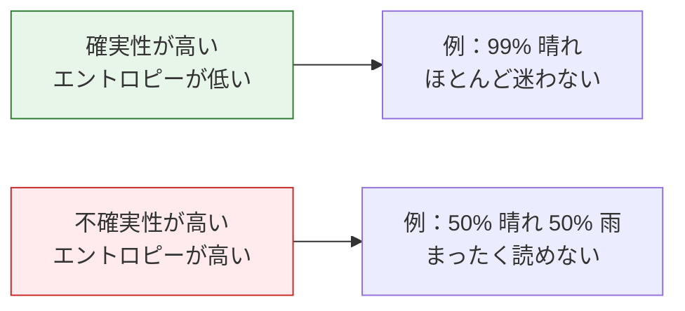
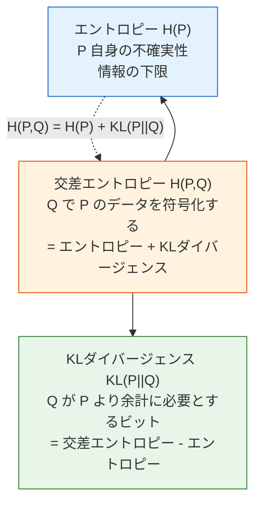

# 4.2.5 情報理論の基礎


:::tip なぜ情報理論を学ぶの？
分類モデルの学習で使う `CrossEntropyLoss`（交差エントロピー損失）には、名前に「エントロピー」が入っています。情報理論は、**この損失関数がいったい何を測っているのか**、そしてなぜ分類タスクにこんなに有効なのかを教えてくれます。
:::

## 学習目標

- 情報量とエントロピーを理解する——不確実性の尺度
- 交差エントロピーを理解する——2つの分布の違いを測る
- KLダイバージェンスを理解する——ある分布から別の分布への「距離」
- Pythonで計算と可視化を行う

## 数式に入る前に用語をほどく

情報理論の用語は抽象的に聞こえますが、多くはとても具体的な問いに答えています。

| 用語 | 意味 | 初心者がまず持つとよい問い |
|---|---|---|
| `bit` | `log2` を使うときの情報量の単位 | この情報は、はい/いいえの質問いくつ分に相当する？ |
| `nat` | 自然対数 `ln` を使うときの情報量の単位 | 深層学習の損失関数で内部的によく使われる単位 |
| `log2` | 2 を底とする対数 | 情報量を bit で表したいときに使う |
| `entropy` | 分布の平均的な不確実性 | 答えを見る前に、平均してどれくらい迷っている？ |
| `cross-entropy` | 真の分布が P のとき、予測分布 Q を使うコスト | モデルの予測で真実を説明すると、どれくらい高くつく？ |
| `KL divergence` | P の代わりに Q を使うことで生じる追加コスト | モデルの分布がずれると、どれくらい余計なコストが増える？ |
| `logits` | 確率に変換する前のモデルの生スコア | softmax の前にニューラルネットワークが出す未正規化スコア |
| `softmax` | logits を確率に変換する関数 | クラスごとのスコアを、合計 1 の確率分布に変える |
| `perplexity` | 交差エントロピーが bit 単位のときの `2 ** cross_entropy` | 言語モデルの困惑度。低いほど、通常はモデルが迷っていない |
| `RLHF` / `PPO` | Reinforcement Learning from Human Feedback / Proximal Policy Optimization | KL を使って、微調整後のモデルが元のモデルから離れすぎないようにする訓練手法 |

この節では、情報理論の直感を作るために `log2` を使い、単位は **bit** とします。多くの深層学習ライブラリは自然対数を使うため、損失値の単位は **nat** です。曲線の形や最適化上の意味は同じで、単位だけが違います。

## 歴史的背景：この節の情報理論で最も重要な出発点は？

この節でまず知っておきたい歴史的な出来事は次のとおりです。

| 年 | 論文 | 主要な著者 | 最も重要に解決したこと |
|---|---|---|---|
| 1948 | *A Mathematical Theory of Communication* | Claude Shannon | 情報量、エントロピー、現代情報理論の主軸を体系的に提示した |

初心者の方がまず覚えておくとよいのは、次の一言です。

> **シャノンは、「情報がどれくらいあるのか」を初めて厳密に測れるようにした。**

なので、この節で出てくる

- 情報量
- エントロピー
- 交差エントロピー

はバラバラな概念ではなく、同じ情報理論の主軸の上にあります。

## まず、とても大事な学習の心構え

この節で初心者がつまずきやすい点は次の通りです。

- 名前がとても抽象的に見える
- 数式が「数学の中の数学」に見える

でも、ここで本当に大事なのは、最初から定義を全部暗記することではなく、まず次を理解することです。

- なぜ「意外なほど情報量が大きい」のか
- なぜ「不確実なほどエントロピーが大きい」のか
- なぜ分類の損失がこれらと結びつくのか

この節は、まずこんなふうに理解するとよいです。

> **モデルがどれくらい確信しているか、予測がどれくらい外れているかを、より正確に表すための言葉。**

---

## まずは全体の地図を作ろう

この節は見た目にはあまり「確率の授業」らしく見えませんが、実はモデル学習ととても強く結びついています。


この授業で本当に伝えたいのは、次の点です。

- なぜ「意外な出来事ほど情報量が大きい」のか
- なぜ分布が不確実なほどエントロピーが大きいのか
- なぜ交差エントロピーが分類タスクの中心的な損失関数になるのか

## 一、情報量 —— 「どれだけ驚くか」

### 直感

あるメッセージが持つ**情報量** = それがどれだけ**予想外**か、です。

- 「太陽は東から昇る」 → 情報量 ≈ 0（まったく意外ではない）
- 「今日の北京は雪が降った」（夏） → 情報量が大きい（とても意外）
- 「今日の北京は雪が降った」（冬） → 情報量は中くらい

**起こる確率が低い出来事ほど、起きたときの情報量は大きくなります。**

### 初心者向けのたとえ

情報量は、まずこんなふうに考えられます。

- 「この出来事にどれくらい驚くか」

たとえば、

- 明日も太陽が昇る → 驚かない
- 夏に雪が降る → かなり驚く

なので、情報量でまず覚えるべきなのは式よりも、次の一文です。

> **あまり起こらないことほど、起きたときに多くの情報を運ぶ。**

### 数学的な定義

**情報量 = -log2(確率)**

```python
import numpy as np
import matplotlib.pyplot as plt

plt.rcParams['font.sans-serif'] = ['Arial Unicode MS']
plt.rcParams['axes.unicode_minus'] = False

# 異なる確率に対応する情報量
probs = np.linspace(0.01, 1, 100)
info = -np.log2(probs)

plt.figure(figsize=(8, 5))
plt.plot(probs, info, color='steelblue', linewidth=2)
plt.xlabel('事象の確率')
plt.ylabel('情報量（bit）')
plt.title('情報量 = -log₂(確率)')
plt.grid(True, alpha=0.3)

# いくつかの重要な点を注釈
for p, label in [(1.0, '必然的な事象'), (0.5, 'コイン投げ'), (0.01, 'まれな事象')]:
    i = -np.log2(p)
    plt.annotate(f'{label}\np={p}, info={i:.1f}bit',
                 xy=(p, i), fontsize=10,
                 xytext=(p+0.15, i+0.5),
                 arrowprops=dict(arrowstyle='->', color='gray'))

plt.show()
```

| 事象の確率 | 情報量 | 直感 |
|---------|--------|------|
| 1.0 | 0 bit | 必ず起こるので、情報はない |
| 0.5 | 1 bit | 1回のコイン投げで1ビットの情報 |
| 0.25 | 2 bit | 2桁の2進数を当てる |
| 0.01 | 6.64 bit | とても意外で、情報量が大きい |

式を直接実行すると、次のようになります。

```python
for p in [1.0, 0.5, 0.25, 0.01]:
    print(f"p={p:>4}: 情報量={-np.log2(p):.4f} bits")
```

期待される出力：

```text
p= 1.0: 情報量=-0.0000 bits
p= 0.5: 情報量=1.0000 bits
p=0.25: 情報量=2.0000 bits
p=0.01: 情報量=6.6439 bits
```

---

## 二、エントロピー —— 平均的な不確実性

### 直感

**エントロピー（Entropy）= ある分布の「平均情報量」= システムの「平均的な不確実性」**

### エントロピーでまず覚えるべきなのは、定義よりも「混乱の度合い」

エントロピーは、まずこんなふうに考えられます。

- 判断する前に、どれくらい自信がないか

あるシステムがほぼ確実なら：

- エントロピーは低い

毎回とても予想しにくいなら：

- エントロピーは高い

エントロピーの一番素朴な意味は、結局これです。

> **平均的にどれだけ不確実か。**



### 公式と計算

**H(X) = -Σ p(x) × log2(p(x))**

```python
def entropy(probs):
    """エントロピーを計算する（単位は bit）"""
    probs = np.array(probs)
    # log(0) を避ける
    probs = probs[probs > 0]
    return -np.sum(probs * np.log2(probs))

# 例1：公平なコイン（最大の不確実性）
h1 = entropy([0.5, 0.5])
print(f"公平なコインのエントロピー: {h1:.3f} bit")  # 1.0

# 例2：偏ったコイン
h2 = entropy([0.9, 0.1])
print(f"偏ったコイン(0.9, 0.1)のエントロピー: {h2:.3f} bit")  # 0.469

# 例3：必然的な事象（不確実性なし）
h3 = entropy([1.0, 0.0])
print(f"必然的な事象のエントロピー: {h3:.3f} bit")  # 0.0

# 例4：公平なサイコロ
h4 = entropy([1/6]*6)
print(f"公平なサイコロのエントロピー: {h4:.3f} bit")  # 2.585
```

期待される出力：

```text
公平なコインのエントロピー: 1.000 bit
偏ったコイン(0.9, 0.1)のエントロピー: 0.469 bit
必然的な事象のエントロピー: -0.000 bit
公平なサイコロのエントロピー: 2.585 bit
```

`-0.000` は浮動小数点の丸めによる表示です。概念としては、エントロピーは正確に 0 です。

### 可視化：コインのエントロピーが p によってどう変わるか

```python
p_values = np.linspace(0.001, 0.999, 1000)
entropies = [-p * np.log2(p) - (1-p) * np.log2(1-p) for p in p_values]

plt.figure(figsize=(8, 5))
plt.plot(p_values, entropies, color='steelblue', linewidth=2)
plt.xlabel('表が出る確率 p')
plt.ylabel('エントロピー H (bit)')
plt.title('二値分布のエントロピー：p=0.5 で最大（最も不確実）')
plt.axvline(x=0.5, color='red', linestyle='--', alpha=0.5, label='p=0.5（最大エントロピー）')
plt.legend()
plt.grid(True, alpha=0.3)
plt.show()
```

**重要なポイント**：p = 0.5 のときエントロピーは最大（最も不確実）になり、p = 0 または 1 のときエントロピーは 0（完全に確実）になります。

### AI におけるエントロピーの応用

| 応用 | 説明 |
|------|------|
| 決定木 | **情報利得**（エントロピーの減少量）を使って最適な分割特徴を選ぶ |
| モデル出力 | 分類モデルの出力確率分布のエントロピーが低いほど、モデルはより「自信がある」 |
| データ圧縮 | エントロピーはデータ圧縮の理論的な下限 |
| 言語モデル | 困惑度(Perplexity) = 2^(交差エントロピー)、モデルの良し悪しを測る |

---

## 三、交差エントロピー —— 「予測がどれくらい正確か」を測る

### 直感

**交差エントロピー = 分布 Q を使って分布 P のデータを符号化すると、平均して1サンプルあたり何ビット必要か。**

### 初心者向けの言い方

交差エントロピーは、まず次のように理解しても大丈夫です。

- 予測分布と真の分布がどれくらいずれているか

初心者にとっては、これで十分役に立ちます。
というのも、その後の分類モデルで本当に気にするのも、

- モデルが正しいクラスにより高い確率を与えているか

だからです。

Q と P が完全に同じなら → 交差エントロピー = P のエントロピー（最小値）
Q と P の差が大きいなら → 交差エントロピーは P のエントロピーよりかなり大きくなる

### 公式と計算

**H(P, Q) = -Σ p(x) × log2(q(x))**

```python
def cross_entropy(p, q):
    """交差エントロピーを計算する"""
    p, q = np.array(p), np.array(q)
    # log(0) を避ける
    q = np.clip(q, 1e-10, 1)
    return -np.sum(p * np.log2(q))

# 真の分布 P
P = [0.7, 0.2, 0.1]  # 3クラス問題

# 予測分布 Q（予測の質が異なる）
Q_good = [0.65, 0.25, 0.10]   # 良い予測
Q_bad  = [0.33, 0.33, 0.34]   # 悪い予測（ほぼ一様に予測）
Q_wrong = [0.1, 0.1, 0.8]     # 間違った予測

print(f"P のエントロピー:        {entropy(P):.4f}")
print(f"良い予測の交差エントロピー:   {cross_entropy(P, Q_good):.4f}")
print(f"悪い予測の交差エントロピー:   {cross_entropy(P, Q_bad):.4f}")
print(f"間違った予測の交差エントロピー: {cross_entropy(P, Q_wrong):.4f}")
```

期待される出力：

```text
P のエントロピー:        1.1568
良い予測の交差エントロピー:   1.1672
悪い予測の交差エントロピー:   1.5952
間違った予測の交差エントロピー: 3.0219
```

### 交差エントロピーを損失関数として使う

分類タスクでは、**交差エントロピーを最小化する = モデルの予測を真の分布にできるだけ近づける** ことです。

```python
# 二値分類の交差エントロピー損失
def binary_cross_entropy(y_true, y_pred):
    """二値分類の交差エントロピー（PyTorch の BCELoss と等価）"""
    y_pred = np.clip(y_pred, 1e-10, 1 - 1e-10)
    return -np.mean(
        y_true * np.log(y_pred) + (1 - y_true) * np.log(1 - y_pred)
    )

# 真のラベル
y_true = np.array([1, 0, 1, 1, 0])

# 予測の質が異なる出力
predictions = {
    "完璧な予測":   np.array([1.0, 0.0, 1.0, 1.0, 0.0]),
    "良い予測":     np.array([0.9, 0.1, 0.8, 0.9, 0.2]),
    "悪い予測":     np.array([0.6, 0.4, 0.6, 0.6, 0.4]),
    "完全に間違い": np.array([0.1, 0.9, 0.1, 0.1, 0.9]),
}

for name, y_pred in predictions.items():
    loss = binary_cross_entropy(y_true, y_pred)
    print(f"{name:10s} → 交差エントロピー損失 = {loss:.4f}")
```

出力：
```text
完璧な予測   → 交差エントロピー損失 ≈ 0.0000
良い予測     → 交差エントロピー損失 ≈ 0.1525
悪い予測     → 交差エントロピー損失 ≈ 0.5108
完全に間違い → 交差エントロピー損失 ≈ 2.3026
```

このコードは `np.log`、つまり自然対数を使っているため、単位は nat です。これは多くの深層学習フレームワークの交差エントロピー損失と一致します。

### 可視化：予測の正確さ vs 損失

```python
# 真のラベルが y=1 のとき、予測値 p と損失の関係
p_pred = np.linspace(0.01, 0.99, 100)

# y=1 のとき、loss = -log(p)
loss_y1 = -np.log(p_pred)

# y=0 のとき、loss = -log(1-p)
loss_y0 = -np.log(1 - p_pred)

fig, axes = plt.subplots(1, 2, figsize=(14, 5))

axes[0].plot(p_pred, loss_y1, color='steelblue', linewidth=2)
axes[0].set_xlabel('モデルの予測 P(y=1)')
axes[0].set_ylabel('損失')
axes[0].set_title('真のラベル y=1 のときの損失\n予測が 1 に近いほど損失は小さい')
axes[0].grid(True, alpha=0.3)

axes[1].plot(p_pred, loss_y0, color='coral', linewidth=2)
axes[1].set_xlabel('モデルの予測 P(y=1)')
axes[1].set_ylabel('損失')
axes[1].set_title('真のラベル y=0 のときの損失\n予測が 0 に近いほど損失は小さい')
axes[1].grid(True, alpha=0.3)

plt.tight_layout()
plt.show()
```

**解釈**：交差エントロピー損失にはとても良い性質があります。予測が外れたとき、たとえば y=1 なのにモデルが 0.01 を出した場合、損失は**急激に大きく**なり、誤った予測を強く罰します。

### 初心者向けの分類の直感

交差エントロピーは、まず次のように考えるとよいです。

- 正解にどれだけ信頼を置いたか

たとえば正しいクラスが `猫` なのに、大部分の確率を `犬` に割り当てていたら、
交差エントロピーは大きくなります。
逆に、正しいクラスに確率をしっかり割り当てていれば、
交差エントロピーは小さくなります。

つまり、交差エントロピーでまず覚えるべきなのは数式ではなく、次の一文です。

> **モデルが正解により多くの確率を割り当てるほど、損失は通常小さくなる。**

### 単一サンプルの交差エントロピーの最小例をもう一度見る

```python
labels = ["猫", "犬", "鳥"]
true_label = "犬"
pred_probs = [0.1, 0.7, 0.2]

true_index = labels.index(true_label)
loss = -np.log(pred_probs[true_index])

print("正しいクラス:", true_label)
print("モデルの予測:", dict(zip(labels, pred_probs)))
print("交差エントロピー損失:", round(loss, 4))
```

期待される出力：

```text
正しいクラス: 犬
モデルの予測: {'猫': 0.1, '犬': 0.7, '鳥': 0.2}
交差エントロピー損失: 0.3567
```

この例は初心者にとても向いています。抽象的な分布の話を、いつもの分類問題に戻して考えられるからです。

- 正解はどれか
- そのクラスにどれだけ確率を与えたか
- それがそのままどれくらいの損失になるか

---

## 四、KLダイバージェンス —— 2つの分布の「距離」

### 直感

**KLダイバージェンス（KL Divergence）= ある分布 Q を使って真の分布 P の代わりにすると、どれだけ「余計に」ビットが必要になるか。**

### なぜ KLダイバージェンス は少し分かりにくいのか？

見た目は「分布間の距離」に見えるのに、
実は対称ではありません。

初心者には、まず次の理解が安定です。

- KL は普通の幾何学的な距離ではない
- これは「真の分布を近似するとき、間違った分布を使ったらどれくらい余計にコストがかかるか」に近い

この直感があれば、次のような場面での役割も理解しやすくなります。

- VAE
- 蒸留
- RLHF

**KL(P || Q) = 交差エントロピー(P, Q) - エントロピー(P)**

```python
def kl_divergence(p, q):
    """KLダイバージェンスを計算する"""
    p, q = np.array(p), np.array(q)
    q = np.clip(q, 1e-10, 1)
    p = np.clip(p, 1e-10, 1)
    return np.sum(p * np.log2(p / q))

P = [0.7, 0.2, 0.1]
Q1 = [0.65, 0.25, 0.10]  # P に近い
Q2 = [0.33, 0.33, 0.34]  # P から遠い

print(f"KL(P || Q1): {kl_divergence(P, Q1):.4f} (Q1 は P に近い)")
print(f"KL(P || Q2): {kl_divergence(P, Q2):.4f} (Q2 は P から遠い)")
print(f"KL(P || P):  {kl_divergence(P, P):.4f} (P 自身)")
```

期待される出力：

```text
KL(P || Q1): 0.0105 (Q1 は P に近い)
KL(P || Q2): 0.4384 (Q2 は P から遠い)
KL(P || P):  0.0000 (P 自身)
```

### KLダイバージェンスの性質

| 性質 | 説明 |
|------|------|
| 非負性 | KL(P \|\| Q) ≥ 0。等号が成り立つのは P = Q のときだけ |
| 非対称 | KL(P \|\| Q) ≠ KL(Q \|\| P)。本当の「距離」ではない |
| P=Q のとき 0 | 2つの分布が完全に同じなら、KLダイバージェンスは 0 |

```python
# 非対称性を確認する
P = [0.7, 0.2, 0.1]
Q = [0.33, 0.33, 0.34]

print(f"KL(P || Q) = {kl_divergence(P, Q):.4f}")
print(f"KL(Q || P) = {kl_divergence(Q, P):.4f}")
print("両者は等しくありません！")
```

期待される出力：

```text
KL(P || Q) = 0.4384
KL(Q || P) = 0.4807
両者は等しくありません！
```

### 可視化：分布の差が大きくなると KLダイバージェンス はどう変わるか

```python
# 二値分布：P = [0.8, 0.2]、Q を [0.01, 0.99] から [0.99, 0.01] まで変化させる
p = 0.8
q_values = np.linspace(0.01, 0.99, 200)

kl_values = [kl_divergence([p, 1-p], [q, 1-q]) for q in q_values]

plt.figure(figsize=(8, 5))
plt.plot(q_values, kl_values, color='steelblue', linewidth=2)
plt.axvline(x=p, color='red', linestyle='--', label=f'q = p = {p}（KL=0）')
plt.xlabel('q の値')
plt.ylabel('KL(P || Q)')
plt.title(f'KLダイバージェンス：P=[{p}, {1-p}]、Q=[q, 1-q]')
plt.legend()
plt.grid(True, alpha=0.3)
plt.show()
```

### AI における KLダイバージェンス の応用

| 応用 | 説明 |
|------|------|
| VAE | 潜在変数の分布を標準正規分布に近づける：KL(q(z\|x) \|\| N(0,1)) |
| 知識蒸留 | 小さなモデルの出力分布を大きなモデルに近づける：KLダイバージェンスを最小化する |
| RLHF | 微調整後のモデルが元のモデルから離れすぎないようにする |
| 方策最適化 | PPO で方策更新の大きさを制限する |

:::tip RLHF における KLダイバージェンス の重要な役割
大規模言語モデルの微調整（RLHF）では、「人間の好みに合うこと」と「元のモデルから離れすぎないこと」のバランスが必要です。KLダイバージェンスは、その「離れすぎないようにする」ための制約です。
:::

---

## 五、3つの関係



**核心的な関係：交差エントロピー = エントロピー + KLダイバージェンス**

```python
P = [0.7, 0.2, 0.1]
Q = [0.5, 0.3, 0.2]

h = entropy(P)
ce = cross_entropy(P, Q)
kl = kl_divergence(P, Q)

print(f"エントロピー H(P):        {h:.4f}")
print(f"交差エントロピー H(P,Q):  {ce:.4f}")
print(f"KLダイバージェンス:        {kl:.4f}")
print(f"H(P) + KL =     {h + kl:.4f}")  # = 交差エントロピー ✓
```

期待される出力：

```text
エントロピー H(P):        1.1568
交差エントロピー H(P,Q):  1.2796
KLダイバージェンス:        0.1228
H(P) + KL =     1.2796
```

:::info なぜ分類では KLダイバージェンス ではなく交差エントロピーを使うの？
学習時には真の分布 P が固定されている（ラベルは変わらない）ので、H(P) は定数です。交差エントロピー H(P,Q) を最小化することは、KL(P||Q) を最小化することと同じです。ただし交差エントロピーのほうが計算しやすく、H(P) を知る必要がありません。
:::

### 初心者がまず覚えるとよい比較表

| 概念 | まず覚えるべき問い |
|------|------|
| 情報量 | この出来事はどれくらい意外？ |
| エントロピー | 全体として平均どれくらい不確実？ |
| 交差エントロピー | 予測と真実はどれくらい違う？ |
| KLダイバージェンス | 間違った分布を使うと、どれくらい余計にコストがかかる？ |

この表は初心者に特に役立ちます。第4章を「公式のかたまり」ではなく、直感の地図として見直せるからです。

---

## ここまで学んだら、次はどこへ進むべき？

確率と統計の章をここまで読んだら、次に持っていくべきなのは、さらに多くの公式ではなく、次のような問いです。

1. 確率、交差エントロピー、KLダイバージェンスは、実際にどうやって loss になるのか？
2. モデルはなぜ絶対的な結論ではなく、いつも確率を出力するのか？
3. こうした「不確実性を表す言葉」は、機械学習の中でどのように学習や評価の道具になるのか？

次に読むのにおすすめなのは、たとえば次のページです。

- [5 第5章のトップページ](../../ch05-machine-learning/index.md)
- [5.2.3 ロジスティック回帰](../../ch05-machine-learning/ch02-supervised/02-logistic-regression.md)
- [5.4.2 評価指標](../../ch05-machine-learning/ch04-evaluation/01-metrics.md)

:::info 本章のまとめ
確率と統計の4つの授業で、あなたは次のことを学びました。
1. **確率の基礎**：条件付き確率、ベイズの定理——証拠を使って信念を更新する
2. **確率分布**：正規分布は至るところにある、中心極限定理
3. **統計的推定**：MLE は交差エントロピー損失の源、MAP は正則化
4. **情報理論**（本節）：エントロピーは不確実性を測り、交差エントロピーは分類損失であり、KLダイバージェンスは分布の違いを制約する

これらの概念は、機械学習、深層学習、大規模言語モデルで何度も登場します。

**融合学習へのジャンプ**：今すぐ**第5章・2.2 ロジスティック回帰 + 2.3 決定木**を見てみるのがおすすめです。学んだばかりの確率と情報理論の知識を使って、分類アルゴリズムの損失関数と情報利得を理解しましょう。
:::

---

## 残す証拠

このページを終えたら、この evidence card を残します。

```text
random_process: event, distribution, sample, likelihood, entropy, or Bayes update
simulation_or_formula: code or formula used to make uncertainty visible
output: probability, sample statistic, interval, entropy, or updated belief
failure_check: base-rate confusion, p-value misuse, sample bias, or mixing probability with certainty
Expected_output: numeric result plus interpretation in plain language
```

## まとめ

| 概念 | 直感 | 値域 |
|------|------|------|
| 情報量 | ある出来事がどれだけ「意外」か | ≥ 0 |
| エントロピー | ある分布がどれだけ「不確実」か | ≥ 0 |
| 交差エントロピー | 予測分布と真の分布の差 | ≥ H(P) |
| KLダイバージェンス | 2つの分布の「距離」 | ≥ 0 |

## この節で一番持ち帰るべきこと

- 情報量の最も大事な直感は「意外なほど情報が大きい」
- エントロピーの最も大事な直感は「平均してどれくらい不確実か」
- 交差エントロピーの最も大事な直感は「予測と真実がどれくらい違うか」
- KLダイバージェンスの最も大事な直感は「間違った分布を使うとどれくらい余計にコストがかかるか」

## 手を動かして練習しよう

### 練習 1：エントロピーを計算する

次の分布のエントロピーを計算し、どれが最も「不確実」か説明してください。
1. [0.25, 0.25, 0.25, 0.25]（4面サイコロ）
2. [0.97, 0.01, 0.01, 0.01]（ほぼ確実）
3. [0.4, 0.3, 0.2, 0.1]（不均一）

参考実装：

```python
distributions = [
    [0.25, 0.25, 0.25, 0.25],
    [0.97, 0.01, 0.01, 0.01],
    [0.4, 0.3, 0.2, 0.1],
]

for probs in distributions:
    print(f"{probs} -> entropy={entropy(probs):.4f} bits")
```

期待される出力：

```text
[0.25, 0.25, 0.25, 0.25] -> entropy=2.0000 bits
[0.97, 0.01, 0.01, 0.01] -> entropy=0.2419 bits
[0.4, 0.3, 0.2, 0.1] -> entropy=1.8464 bits
```

最初の分布が最も不確実です。4つの結果がすべて同じ確率で起こるからです。

### 練習 2：交差エントロピー損失

3クラス分類問題です。真のラベルは第2クラス（one-hot: [0, 1, 0]）、モデルの softmax 出力は [0.1, 0.7, 0.2] です。交差エントロピー損失を計算してください。もしモデルの出力が [0.05, 0.9, 0.05] に変わったら、損失はどう変わるでしょうか？

参考実装：

```python
P = np.array([0, 1, 0])
Q1 = np.array([0.1, 0.7, 0.2])
Q2 = np.array([0.05, 0.9, 0.05])

loss1 = -np.sum(P * np.log(Q1))
loss2 = -np.sum(P * np.log(Q2))

print(f"Loss with [0.1, 0.7, 0.2]: {loss1:.4f} nats")
print(f"Loss with [0.05, 0.9, 0.05]: {loss2:.4f} nats")
```

期待される出力：

```text
Loss with [0.1, 0.7, 0.2]: 0.3567 nats
Loss with [0.05, 0.9, 0.05]: 0.1054 nats
```

2つ目の予測は正しいクラスにより高い確率を割り当てているため、損失が小さくなります。

### 練習 3：KLダイバージェンスを可視化する

真の分布 P = [0.6, 0.3, 0.1] を固定し、Q をあるパラメータに沿って変化させたとき（たとえば q1 を 0.1 から 0.9 まで変える）、KL(P||Q) の変化曲線を描いてみましょう。

参考実装：

```python
P = np.array([0.6, 0.3, 0.1])
q1_values = np.linspace(0.1, 0.9, 200)
kl_values = []

for q1 in q1_values:
    # 残りの確率を 3:1 の比率で後ろ2つのクラスに分ける。
    Q = np.array([q1, (1 - q1) * 0.75, (1 - q1) * 0.25])
    kl_values.append(kl_divergence(P, Q))

plt.figure(figsize=(8, 5))
plt.plot(q1_values, kl_values, color="steelblue", linewidth=2)
plt.axvline(x=0.6, color="red", linestyle="--", label="Q = P")
plt.xlabel("q1")
plt.ylabel("KL(P || Q)")
plt.title("KLダイバージェンスは Q が P と一致すると最小になる")
plt.legend()
plt.grid(alpha=0.3)
plt.show()

for q1 in [0.1, 0.6, 0.9]:
    Q = np.array([q1, (1 - q1) * 0.75, (1 - q1) * 0.25])
    print(f"q1={q1:.1f}, Q={Q.round(3)}, KL={kl_divergence(P, Q):.4f}")
```

期待される出力：

```text
q1=0.1, Q=[0.1   0.675 0.225], KL=1.0830
q1=0.6, Q=[0.6 0.3 0.1], KL=-0.0000
q1=0.9, Q=[0.9   0.075 0.025], KL=0.4490
```


<details>
<summary>参考解答と解説</summary>

- 3 つのエントロピーは `2.0000`、約 `0.2419`、約 `1.8464` bits です。4 つの結果が一様な分布が最も不確実です。どの結果も優先されないからです。
- 3 クラスのクロスエントロピー例では、loss は約 `0.3567` と `0.1054` nats です。正解クラスにより高い確率を与えると loss は下がります。
- よい説明は訓練につなげます。クロスエントロピーは、正解クラスへの適切な自信を評価し、誤ったクラスへ高い確率を置くことを罰します。

</details>
