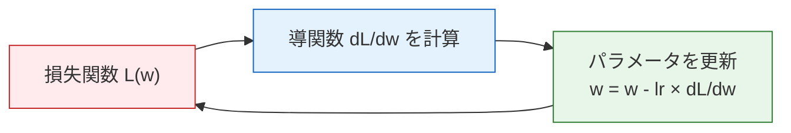

# 4.3.2 導関数：変化率の直感


:::tip 公式を丸暗記しなくてOK
この節では、導出の仕方をあなたに試しません。大事なのは、**導関数 = 変化の速さ** という直感を理解して、Python で導関数を計算できるようになることです。あとで勾配降下法を学ぶとき、導関数は「どの方向にパラメータを調整すれば損失を小さくできるか」を教えてくれるものだと分かります。
:::

## 学習目標

- 導関数 = 接線の傾き = 変化の速さ を直感的に理解する
- 速度や株価などの身近な例で導関数を理解する
- よく使う微分ルールを身につける
- Python で数値微分と可視化を行う

## まず、とても大事な学習イメージを共有します

この節の目的は、最初から「全部の導関数を導出できる人」になることではありません。
そうではなく、まず本当に次のことを理解するためのものです。

- 導関数は何を表しているのか
- なぜそれがモデルのパラメータ更新に直接関係するのか

もし今この節を一通り読んでも、たくさんの微分問題をすぐに解けないとしても、それはまったく普通です。
むしろ、より大事なのは次の点です。

- 導関数を「変化率」として説明できるか
- それを後の損失の変化やパラメータ更新と結びつけられるか

---

## まずは全体の地図をつくろう

この節は、先に章全体の中でどこにあるかを意識すると理解しやすくなります。


つまりこの節は、単独の数学知識ではなく、後の最適化の流れ全体の土台をつくる部分です。

## 一、導関数とは何か？

### 生活の中の「変化率」

| 場面 | 変数 | 変化率（導関数） |
|------|------|--------------|
| 車を運転する | 時間に対する距離の変化 | 速度（km/h） |
| 株価を見る | 時間に対する株価の変化 | 上がり下がりの速さ |
| 勉強する | 練習時間に対する点数の変化 | 学習効率 |
| AI の学習 | 学習ステップに対する損失値の変化 | 収束の速さ |

**導関数 = ある量が、その瞬間にどれくらいの速さで変化しているか。**

### 初学者向けの、もっと分かりやすい例え

「接線の傾き」がまだ少し抽象的に感じるなら、まずは導関数を次のように考えてみてください。

- メーターに表示される「今の速度」

たとえば運転中なら、

- 総距離は累積した値
- 速度は、今この瞬間にどれだけ速く変化しているか

だから導関数は、「これまでに全部でどれだけ変わったか」を聞いているのではなく、
次のことを聞いています。

> **今この瞬間、変化はどれくらい速いのか。**

### 幾何学的な直感：接線の傾き

```python
import numpy as np
import matplotlib.pyplot as plt

plt.rcParams['font.sans-serif'] = ['Arial Unicode MS']
plt.rcParams['axes.unicode_minus'] = False

# 関数 f(x) = x²
def f(x):
    return x ** 2

# x=1 における接線
x0 = 1
slope = 2 * x0  # f'(x) = 2x → f'(1) = 2

x = np.linspace(-1, 3, 200)
tangent = slope * (x - x0) + f(x0)

plt.figure(figsize=(8, 6))
plt.plot(x, f(x), 'steelblue', linewidth=2, label='f(x) = x²')
plt.plot(x, tangent, 'r--', linewidth=2, label=f'接線（傾き = {slope}）')
plt.plot(x0, f(x0), 'ro', markersize=10, zorder=5)
plt.annotate(f'x={x0}, 傾き={slope}', xy=(x0, f(x0)),
             xytext=(x0+0.5, f(x0)+1.5), fontsize=12,
             arrowprops=dict(arrowstyle='->', color='gray'))
plt.xlim(-1, 3)
plt.ylim(-1, 8)
plt.xlabel('x')
plt.ylabel('f(x)')
plt.title('導関数 = 接線の傾き')
plt.legend()
plt.grid(True, alpha=0.3)
plt.show()
```

**解説**：f(x) = x² の x=1 における導関数は 2 です。これは、「x が 1 の近くで少し増えると、f(x) はだいたいその 2 倍くらい増える」という意味です。

### 数値微分——Python で「近似的に」計算する

公式を知らなくても、関数値が計算できれば導関数を求められます。

**f'(x) ≈ (f(x + h) - f(x - h)) / (2h)** （h は十分小さい数）

```python
def numerical_derivative(f, x, h=1e-7):
    """中心差分法で数値微分を計算する"""
    return (f(x + h) - f(x - h)) / (2 * h)

# テスト：f(x) = x² の導関数は 2x のはず
f = lambda x: x ** 2

for x0 in [0, 1, 2, 3]:
    approx = numerical_derivative(f, x0)
    exact = 2 * x0
    print(f"x={x0}: 数値微分={approx:.6f}, 厳密解={exact}")
```

:::tip 数値微分 vs 解析微分
- **解析微分**：公式を使って導出する方法（例： (x²)' = 2x）。正確ですが、数学の理解が必要です
- **数値微分**：コードで近似的に計算する方法。簡単ですが、わずかな誤差があります
- **自動微分**（PyTorch で使うもの）：正確さと自動化の両方を兼ねています。第 6 章で学びます
:::

---

## 二、よく使う微分ルール

すべて覚える必要はありません。まずは、よく出るものだけに慣れれば大丈夫です。

### 基本ルール早見表

| 関数 | 導関数 | 例 |
|------|------|------|
| 定数 c | 0 | (5)' = 0 |
| x の n 乗 | n × x の (n-1) 乗 | (x³)' = 3x² |
| e の x 乗 | e の x 乗 | (eˣ)' = eˣ |
| ln(x) | 1/x | (ln x)' = 1/x |
| sin(x) | cos(x) | (sin x)' = cos x |

### Python で確認する

```python
# よく使う微分ルールを確認する
functions = [
    ("x³",      lambda x: x**3,       lambda x: 3*x**2),
    ("eˣ",      lambda x: np.exp(x),  lambda x: np.exp(x)),
    ("ln(x)",   lambda x: np.log(x),  lambda x: 1/x),
    ("sin(x)",  lambda x: np.sin(x),  lambda x: np.cos(x)),
]

print(f"{'関数':<10} {'x':<5} {'数値微分':<15} {'解析微分':<15} {'誤差':<15}")
print("-" * 60)

for name, f, f_prime in functions:
    x0 = 1.0
    numerical = numerical_derivative(f, x0)
    analytical = f_prime(x0)
    error = abs(numerical - analytical)
    print(f"{name:<10} {x0:<5} {numerical:<15.8f} {analytical:<15.8f} {error:<15.2e}")
```

### 可視化：関数とその導関数

```python
fig, axes = plt.subplots(2, 2, figsize=(14, 10))

cases = [
    ('f(x) = x²', lambda x: x**2, lambda x: 2*x),
    ('f(x) = x³', lambda x: x**3, lambda x: 3*x**2),
    ('f(x) = sin(x)', np.sin, np.cos),
    ('f(x) = eˣ', np.exp, np.exp),
]

for ax, (name, f, f_prime) in zip(axes.flat, cases):
    x = np.linspace(-2, 2, 200)
    ax.plot(x, f(x), 'steelblue', linewidth=2, label='f(x)')
    ax.plot(x, f_prime(x), 'coral', linewidth=2, linestyle='--', label="f'(x)")
    ax.axhline(y=0, color='gray', linewidth=0.5)
    ax.set_title(name, fontsize=12)
    ax.legend()
    ax.grid(True, alpha=0.3)

plt.suptitle('関数（青）と導関数（赤）', fontsize=14)
plt.tight_layout()
plt.show()
```

---

## 三、導関数が AI で果たす役割

### 損失関数の導関数 = 最適化の方向



**導関数は、損失を小さくするために、パラメータをどの方向へ調整すべきかを教えてくれます。** これが勾配降下法の中心的な考え方です（次の節で詳しく学びます）。

### AI でよく使う関数の導関数

```python
# Sigmoid 関数とその導関数
def sigmoid(x):
    return 1 / (1 + np.exp(-x))

def sigmoid_derivative(x):
    s = sigmoid(x)
    return s * (1 - s)

# ReLU 関数とその導関数
def relu(x):
    return np.maximum(0, x)

def relu_derivative(x):
    return (x > 0).astype(float)

fig, axes = plt.subplots(1, 2, figsize=(14, 5))
x = np.linspace(-5, 5, 200)

# Sigmoid
axes[0].plot(x, sigmoid(x), 'steelblue', linewidth=2, label='sigmoid(x)')
axes[0].plot(x, sigmoid_derivative(x), 'coral', linewidth=2, linestyle='--', label="sigmoid'(x)")
axes[0].set_title('Sigmoid とその導関数')
axes[0].legend()
axes[0].grid(True, alpha=0.3)

# ReLU
axes[1].plot(x, relu(x), 'steelblue', linewidth=2, label='ReLU(x)')
axes[1].plot(x, relu_derivative(x), 'coral', linewidth=2, linestyle='--', label="ReLU'(x)")
axes[1].set_title('ReLU とその導関数')
axes[1].legend()
axes[1].grid(True, alpha=0.3)

plt.tight_layout()
plt.show()
```

**Sigmoid の導関数の問題**：x が 0 から大きく離れると、導関数は 0 に近づきます（「勾配消失」）。これが、深いニューラルネットワークで ReLU がよく使われる理由です。

---

## ここまで学んだら、次の節に持っていくべき問いは？

導関数を学んだあと、次の節へ持っていくとよい問いは次の 3 つです。

1. 関数が 1 つの変数ではなく、複数の変数を持つとき、変化率はどう表すのか？
2. パラメータがたくさんあるとき、モデルはどの方向へまとめて更新すればよいのか？
3. 「1 変数の導関数」は、なぜ自然に「多変数の勾配」へ広がるのか？

この 3 つの疑問が、そのまま次の内容につながります。

- [4.3.3 偏導関数と勾配](./02-partial-derivatives-gradient.md)

:::info 次につながる内容
- **次の節**：偏導関数と勾配——複数の変数があるときの「方向微分」
- **3.3 節**：勾配降下法——導関数を使って少しずつモデルを最適化する
- **第 6 章**：PyTorch の `autograd` が導関数を自動で計算する（自動微分）
:::

---

## 残す証拠

このページを終えたら、この evidence card を残します。

```text
function: objective, loss, derivative, gradient, or chain-rule expression
calculation: numeric derivative, gradient step, or backprop trace
output: slope, gradient vector, updated parameter, or loss change
failure_check: sign error, learning rate too large, local slope misunderstanding, or broken chain
Expected_output: calculation trace showing how a parameter changes
```

## まとめ

| 概念 | 直感 | Python 実装 |
|------|------|------------|
| 導関数 | 関数がその点でどれくらい速く変化するか | `(f(x+h) - f(x-h)) / (2h)` |
| 接線の傾き | 導関数の幾何学的な意味 | 接線を描いて可視化する |
| よく使うルール | 冪関数、指数関数、対数関数、三角関数 | 数値微分で確認する |
| AI での役割 | 導関数が最適化の方向を示す | 勾配降下法の基礎 |

## この節で最も持ち帰ってほしいこと

- 導関数でいちばん大事な直感は「今の変化率」
- 数値微分は、いきなり導出を暗記するのではなく、まず変化を見えるようにするためのもの
- AI における導関数の最重要な役割は、モデルのパラメータをどちらに調整すべきかを示すこと

## 手を動かして練習しよう

### 練習 1：数値微分

`numerical_derivative` 関数を使って、次の関数の x=2 における導関数を求め、厳密値と比較してください。
1. f(x) = 3x² + 2x - 1
2. f(x) = 1/x
3. f(x) = x × sin(x)

### 練習 2：導関数のグラフを描く

f(x) = x³ - 3x と、その導関数 f'(x) = 3x² - 3 を、[-3, 3] の範囲で描いてください。
観察してみましょう：f'(x) = 0 となる場所（x = ±1）は、f(x) のどんな特徴に対応しているでしょうか？

### 練習 3：Sigmoid の勾配消失

Sigmoid の導関数のグラフを描き、導関数の最大値がいくつか、またそれがどこで起こるかを調べてください。
そして、それがなぜ「勾配消失」問題につながるのかを説明してみましょう。


<details>
<summary>参考解答と解説</summary>

- `x=2` では、`3x^2+2x-1` の導関数値は `14`、`1/x` は `-0.25`、`x sin(x)` は `sin(2)+2cos(2)≈0.0770` です。
- `f(x)=x^3-3x` では、導関数は `x=-1` と `x=1` で 0 になり、グラフ上の局所最大と局所最小に対応します。
- Sigmoid の導関数は `x=0` で最大になり、値は `0.25` です。0 から遠い場所では導関数が 0 に近づき、勾配による更新が非常に小さくなります。

</details>
