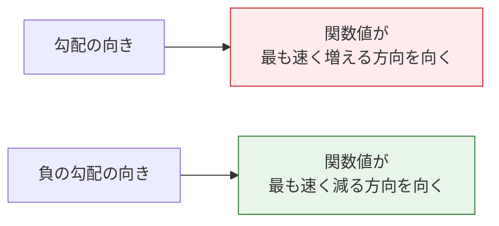

# 4.3.3 偏導数と勾配：多変数の変化する向き


## 学習目標

- 偏導数を理解する——ほかの変数は固定して、1つの変数の影響を見る
- 勾配を理解する——すべての偏導数をまとめたベクトルで、「最も上がる」方向を向く
- 3次元曲面上の勾配を可視化する
- 勾配がニューラルネットワークの学習で果たす中心的な役割を理解する

## 初学者はまずここを押さえる / 上級ではさらに理解する

この節を初めて学ぶなら、すぐに複雑な関数を自在に導出できる必要はありません。初学者は次の3つを押さえれば十分です。偏導数は「1つの変数だけを動かして影響を見る」、勾配は「すべての偏導数を1つの向きにまとめる」、負の勾配は「損失が最も下がる向き」です。

もし数学の基礎が少しあるなら、さらに次の点にも注目できます。なぜ勾配の向きは等高線に垂直なのか、なぜ学習率が負の勾配に沿って進む効果に影響するのか、そして PyTorch の `loss.backward()` が本質的にどの偏導数を自動計算しているのか、です。

## まず、とても大事な学習の見通しを話します

この節は、多くの初学者が「数学って本当に少し難しくなってきた」と感じる最初の場所です。
でもここで大切なのは、いきなり多変数微積分を完全に理解することではなく、まず次のことを理解することです。

- 1変数の導関数が、なぜ自然に偏導数へ広がるのか
- 勾配がなぜ「たくさんの変化率」をひとつの向きにまとめるのか
- なぜそれがモデルのパラメータ更新を直接決めるのか

---

## まずは地図を作ろう

### まずは物語から：複雑な機械を調整していると考える

目の前にコーヒーマシンがあるとしましょう。コーヒーの味は、たくさんのつまみで決まります。たとえば、水温、挽き具合、コーヒー粉の量、抽出時間です。もしコーヒーが苦すぎるとき、「全体のどこが悪いのか」だけでは足りません。1つずつ試す必要があります。水温だけを変えたらどうなるか、挽き具合だけを変えたらどうなるか、時間だけを変えたらどうなるか、を見ます。

偏導数がやっているのは、まさにこのことです。ほかのつまみを固定して、1つのつまみが結果にどう影響するかを見るのです。勾配は、そのすべてをまとめて「調整の案内図」にし、全体としてどの方向に変えればよいかを教えてくれます。

前の節では「1つの変数がどう変わるか」を見ました。ここでは問題を次のように一段上げます。

> **ある関数がたくさんの変数に影響されるとき、どの方向に調整すればよいのでしょうか？**


この節でいちばん大切なのは、まず記号を覚えることではなく、次を理解することです。

- 偏導数は「ほかの変数が動かない」前提で1つの変数を見る
- 勾配は、すべての局所的な変化情報を1つのベクトルにまとめる

## 一、偏導数——「1つの変数だけを動かす」

### 1変数から多変数へ

前の節の導関数には、変数は1つしかありませんでした。でも AI では、損失関数は通常、**何千、何万ものパラメータ**に依存します。

偏導数の考え方はとてもシンプルです。**ほかのすべての変数を固定して、1つの変数だけが結果にどう影響するかを見る**のです。

### 初学者向けの、よりイメージしやすい例え

偏導数は「ミキサーの1つのつまみ」だと考えるとわかりやすいです。

- まず1つのつまみだけを回す
- ほかのつまみはそのままにする
- 出力がどう変わるかを見る

これが偏導数の最初の大事な直感です。

> **まずは1つの変数の影響だけを見る。**

```python
import numpy as np
import matplotlib.pyplot as plt
from mpl_toolkits.mplot3d import Axes3D

plt.rcParams['font.sans-serif'] = ['Arial Unicode MS']
plt.rcParams['axes.unicode_minus'] = False
```

### 生活の直感

あなたのテストの点数が「勉強時間」と「睡眠時間」で決まるとしましょう。

**点数 = f(勉強時間, 睡眠時間)**

- 偏導数 ∂f/∂勉強時間 = **睡眠時間を固定したまま**、1時間多く勉強すると点数はどれだけ上がるか？
- 偏導数 ∂f/∂睡眠時間 = **勉強時間を固定したまま**、1時間多く寝ると点数はどれだけ上がるか？

### 数学の例

f(x, y) = x² + y²

- ∂f/∂x = 2x（y を定数として、x だけで微分する）
- ∂f/∂y = 2y（x を定数として、y だけで微分する）

```python
# 数値的な偏導数
def partial_derivative(f, args, var_index, h=1e-7):
    """多変数関数 f の、第 var_index 番目の変数に関する偏導数を計算する"""
    args_plus = list(args)
    args_minus = list(args)
    args_plus[var_index] += h
    args_minus[var_index] -= h
    return (f(*args_plus) - f(*args_minus)) / (2 * h)

# f(x, y) = x² + y²
f = lambda x, y: x**2 + y**2

# (1, 2) における偏導数
x0, y0 = 1, 2
df_dx = partial_derivative(f, [x0, y0], 0)
df_dy = partial_derivative(f, [x0, y0], 1)

print(f"({x0}, {y0}) において：")
print(f"  ∂f/∂x = {df_dx:.4f}（厳密値: {2*x0}）")
print(f"  ∂f/∂y = {df_dy:.4f}（厳密値: {2*y0}）")
```

---

## 二、勾配——「いちばん上がる向き」

### 定義

**勾配 = すべての偏導数をまとめたベクトル。**

### 覚えやすい言い方

勾配は、次のように考えると覚えやすいです。

- それぞれの変数に「局所的な変化率」がある
- 勾配は、その変化率を1本の矢印にまとめたもの

この矢印が大事なのは、見た目がきれいだからではありません。

- 関数がどちらに向かっていちばん速く増えるかを教えてくれるからです

f(x, y) に対して：勾配 = [∂f/∂x, ∂f/∂y]

```python
def gradient(f, args, h=1e-7):
    """多変数関数の勾配を計算する"""
    grad = []
    for i in range(len(args)):
        grad.append(partial_derivative(f, args, i, h))
    return np.array(grad)

# (1, 2) における勾配
grad = gradient(f, [1, 2])
print(f"勾配: {grad}")  # [2, 4]
```

### 勾配の方向の意味



**重要なポイント**：勾配は「上り坂」の最も急な向きを指します。だから損失関数を下げたいときは、**負の勾配**の方向へ進むべきです。これが勾配降下法の考え方です。

### これは AI でなぜ特に大事なのか？

モデルを学習するとき、本当に知りたいのは次のことだからです。

- パラメータを今どちらに変えるべきか

そして勾配は、まさにその答えを与えてくれます。

### 初学者向けの、いちばん大きな例え

勾配は、次のように考えられます。

- 山の斜面に立っている自分の足元から、いちばん急な上り坂を指す矢印

高いところへ行きたいなら、勾配の向きに進みます。
低いところへ行きたいなら、負の勾配の向きに進みます。

この例えはぜひ先に覚えておくとよいです。抽象的な「偏導数をまとめたベクトル」が、ぐっと具体的な動作の問題になります。

- 今、どちらへ一歩踏み出すべきか

### 可視化：3次元曲面上の勾配

```python
# f(x, y) = x² + y²（お椀形の曲面）
x = np.linspace(-3, 3, 100)
y = np.linspace(-3, 3, 100)
X, Y = np.meshgrid(x, y)
Z = X**2 + Y**2

# 3次元曲面図
fig = plt.figure(figsize=(14, 5))

# 左：3次元曲面
ax1 = fig.add_subplot(121, projection='3d')
ax1.plot_surface(X, Y, Z, cmap='coolwarm', alpha=0.8)
ax1.set_xlabel('x')
ax1.set_ylabel('y')
ax1.set_zlabel('f(x,y)')
ax1.set_title('f(x,y) = x² + y²（3次元表示）')

# 右：等高線 + 勾配矢印
ax2 = fig.add_subplot(122)
contour = ax2.contourf(X, Y, Z, levels=20, cmap='coolwarm', alpha=0.7)
plt.colorbar(contour, ax=ax2)

# いくつかの点に勾配矢印を描く
points = [(-2, -2), (-1, 1), (1, -1), (2, 2), (0.5, 0.5)]
for px, py in points:
    gx, gy = 2*px, 2*py  # 解析的な勾配
    ax2.quiver(px, py, gx, gy, color='black', scale=30, width=0.005)

ax2.set_xlabel('x')
ax2.set_ylabel('y')
ax2.set_title('等高線 + 勾配の向き（矢印）\n矢印は、いちばん上がる向きを示す')
ax2.set_aspect('equal')

plt.tight_layout()
plt.show()
```

**読み方**：
- 等高線図では、矢印（勾配）は常に**等高線に垂直**で、高い方を向く
- 中心から遠いほど勾配は大きい（矢印が長い）——つまり関数の変化が激しい
- 最低点 (0,0) では、勾配は [0,0] —— もう底に着いている

### お椀形ではない曲面の勾配

```python
# もっと面白い関数：複数の極値を持つ
def rosenbrock(x, y):
    return (1 - x)**2 + 100 * (y - x**2)**2

x = np.linspace(-2, 2, 200)
y = np.linspace(-1, 3, 200)
X, Y = np.meshgrid(x, y)
Z = rosenbrock(X, Y)

fig, ax = plt.subplots(figsize=(10, 8))
contour = ax.contourf(X, Y, np.log1p(Z), levels=30, cmap='viridis', alpha=0.8)
plt.colorbar(contour, ax=ax, label='log(1 + f(x,y))')

# いくつかの点で勾配を描く
for px, py in [(-1, 1), (0, 0), (1, 1), (1.5, 2)]:
    grad = gradient(rosenbrock, [px, py])
    # 表示しやすいようにスケーリングする
    norm = np.linalg.norm(grad)
    if norm > 0:
        grad_scaled = grad / norm * 0.3
        ax.quiver(px, py, -grad_scaled[0], -grad_scaled[1],
                  color='red', scale=3, width=0.008)

ax.plot(1, 1, 'r*', markersize=20, label='最小値 (1, 1)')
ax.set_xlabel('x')
ax.set_ylabel('y')
ax.set_title('Rosenbrock 関数（最適化の定番テスト関数）\n赤い矢印 = 負の勾配の向き（下降方向）')
ax.legend(fontsize=12)
plt.show()
```

---

## 三、ニューラルネットワークにおける勾配の意味

### 損失関数の勾配

ニューラルネットワークでは：
- **パラメータ** = 数千から数十億の重み [w1, w2, ..., wn]
- **損失関数** = L(w1, w2, ..., wn)
- **勾配** = [∂L/∂w1, ∂L/∂w2, ..., ∂L/∂wn]

勾配は、**それぞれの重みを増やすべきか減らすべきか**、そしてそれによって損失がどう変わるかを教えてくれます。

```python
# 模擬例：2つのパラメータだけを持つ簡単なモデル
# 損失関数 L(w1, w2) = (w1 - 3)² + (w2 + 1)²
# 最適解：w1 = 3, w2 = -1

def loss(w1, w2):
    return (w1 - 3)**2 + (w2 + 1)**2

# 現在のパラメータ
w1, w2 = 0, 0
grad = gradient(loss, [w1, w2])

print(f"現在のパラメータ: w1={w1}, w2={w2}")
print(f"現在の損失: {loss(w1, w2)}")
print(f"勾配: {grad}")
print(f"→ w1 の偏導数 = {grad[0]:.1f}（負の数 → w1 は増やすべき）")
print(f"→ w2 の偏導数 = {grad[1]:.1f}（正の数 → w2 は減らすべき）")
```

### 高次元の勾配の難しさ

| モデル | パラメータ数 | 勾配の次元 |
|------|---------|---------|
| 線形回帰 | 数個〜数百 | 数個〜数百 |
| CNN (ResNet-50) | 2500万 | 2500万次元の勾配 |
| BERT | 1.1億 | 1.1億次元の勾配 |
| GPT-3 | 1750億 | 1750億次元の勾配 |

次元は非常に高いですが、勾配の計算ルールは同じです。つまり、各パラメータの偏導数を求めるだけです。PyTorch の `autograd` は、それを効率よく自動で計算してくれます。

### 最小の「勾配でパラメータを更新する」例をもう一度見る

```python
def loss(w1, w2):
    return (w1 - 3)**2 + (w2 + 1)**2


def grad_loss(w1, w2):
    return np.array([2 * (w1 - 3), 2 * (w2 + 1)])


w = np.array([0.0, 0.0])
lr = 0.1

for step in range(3):
    grad = grad_loss(w[0], w[1])
    w = w - lr * grad
    print(f"step={step+1}, w={np.round(w, 4)}, loss={round(loss(w[0], w[1]), 4)}")
```

この例は初学者にとても向いています。なぜなら、「勾配はただの向き」という話が、実際に

- パラメータが一歩ずつどう変わるか

に変わるからです。

つまり、勾配は数学の対象であるだけでなく、
学習の更新そのものになるのです。

### 初学者が先に覚えたい比較表

| 概念 | まず覚えるべき問い |
|------|------|
| 偏導数 | もしこの1つのつまみだけを回したら、結果はどう変わる？ |
| 勾配 | すべてのつまみの変化率をまとめたら、どちらに調整するべき？ |
| 負の勾配 | 損失を下げたいなら、どちらへ進むべき？ |

この表は初学者にとても役立ちます。多変数微積分を、実際に扱えるいくつかの問いに戻してくれるからです。

### よくある間違い：勾配の向きに沿って損失を更新してしまう

多くの初学者は、初めて勾配降下法を書くとき、うっかり次のように書いてしまいます。

```python
w = w + lr * grad
```

損失を小さくしたいのなら、たいていこれは向きが逆です。勾配は関数値が最も増える向きを指すので、損失を最小化するには負の勾配に沿って進む必要があります。

```python
w = w - lr * grad
```

違いを次の小さな例で直感的に見てみましょう。

```python
def loss_1d(w):
    return (w - 3) ** 2


def grad_1d(w):
    return 2 * (w - 3)


for direction in ["wrong", "right"]:
    w = 0.0
    lr = 0.1
    print("\n方向:", direction)
    for step in range(3):
        grad = grad_1d(w)
        if direction == "wrong":
            w = w + lr * grad
        else:
            w = w - lr * grad
        print(f"step={step+1}, w={w:.3f}, loss={loss_1d(w):.3f}")
```

この間違いはぜひ覚えておきましょう。もし学習が進むほど loss が大きくなるなら、まず確認すべきは更新の向きと学習率です。

---

## ここまで学んだら、次に何へつなぐとよいか？

偏導数と勾配を学んだら、次のような問いを次の節に持っていくとよいです。

1. 勾配が方向を教えてくれるなら、どうやって本当にその方向へ進むのか？
2. なぜ学習は一気に終わらず、何度も更新を繰り返すのか？
3. 学習率は「どちらへ調整するか」以外に、何を決めるのか？

次に読むのに最適なのは通常、次の節です。

- [4.3.4 勾配降下法](./03-gradient-descent.md)

:::info 後続につなぐ
- **次の節**：勾配降下法——負の勾配の方向へ少しずつ進み、損失関数の最小点を見つける
- **3.4 節**：連鎖律——複雑なネットワークの勾配をどう効率よく計算するか
- **第 6 ステーション**：PyTorch の `loss.backward()` は、まさに勾配を計算している
:::

---

## 残す証拠

このページを終えたら、この evidence card を残します。

```text
関数：目的関数、損失、導関数、勾配、または連鎖律の式
計算：数値微分、勾配更新、または backprop の trace
出力：slope、gradient vector、更新されたパラメータ、またはlossの変化
失敗確認: 符号ミス、学習率が大きすぎる、局所的な傾きの誤解、または chain の破損
期待される成果：パラメータがどう変わるかを示す計算 trace
```

## まとめ

| 概念 | 直感 | Python |
|------|------|--------|
| 偏導数 | ほかの変数を固定して、1つの変数の影響を見る | `partial_derivative(f, args, i)` |
| 勾配 | すべての偏導数をまとめたベクトルで、いちばん上がる方向を向く | `gradient(f, args)` |
| 負の勾配 | いちばん下がる方向を向く | `-gradient(f, args)` |
| 勾配の大きさ | 関数の変化の激しさ | `np.linalg.norm(grad)` |

## この節でいちばん持ち帰るべきこと

- 偏導数のいちばん大事な直感は「まず1つの変数だけが結果にどう影響するかを見る」こと
- 勾配のいちばん大事な直感は「たくさんの局所的な変化率を1つの向きにまとめる」こと
- AI では、勾配の最も重要な価値は、モデルのパラメータをどちらへ調整すべきかを教えてくれること

## この節の学習の閉じ方

この節を学び終えたら、次の表で本当に理解できたか確認できます。

| 層 | できるようになっていること |
|---|---|
| 直感 | 「1つの変数だけを動かす」と「負の勾配に沿って下る」が何を意味するか説明できる |
| コード | 数値差分で2変数関数の偏導数と勾配を計算できる |
| 図 | 等高線図で、勾配の矢印がなぜ高い方を向くのか理解できる |
| AI とのつながり | モデル学習でなぜ勾配がパラメータ更新に必要なのか説明できる |

---

## やってみよう

### 練習 1：勾配を計算する

`gradient` 関数を使って、f(x, y) = x²y + xy² の (2, 3) における勾配を計算してください。手計算でも確かめてみましょう（∂f/∂x = 2xy + y², ∂f/∂y = x² + 2xy）。

### 練習 2：勾配場を可視化する

f(x, y) = sin(x) + cos(y) の等高線図と勾配の矢印を描いてみましょう（`plt.quiver` を使います）。

### 練習 3：3変数の勾配

f(x, y, z) = x² + 2y² + 3z² に対して、(1, 1, 1) における勾配を計算し、どの方向に最も速く変化するかを判断してください。


<details>
<summary>解法と解説</summary>

- `f(x,y)=x^2y+xy^2` の勾配は `[2xy+y^2, x^2+2xy]` で、`(2,3)` では `[21,16]` です。
- `sin(x)+cos(y)` では、勾配矢印は `[cos(x), -sin(y)]` に従います。等高線図と矢印は視覚的に一致し、矢印はより速く増える方向を向きます。
- `x^2+2y^2+3z^2` の `(1,1,1)` における勾配は `[2,4,6]` です。したがって最速増加方向はこのベクトル方向で、最速減少方向は反対向きです。

</details>
