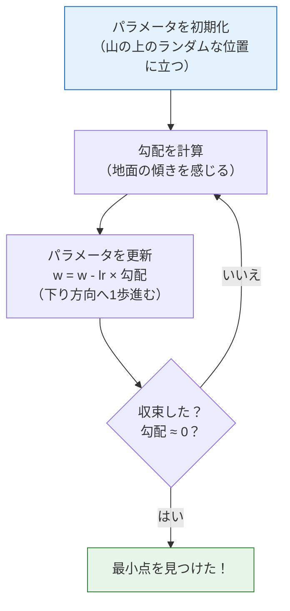
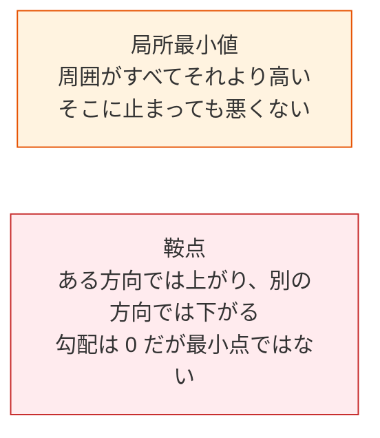

# 4.3.4 勾配降下法：AI の最も重要な最適化アルゴリズム


:::tip この節は数学パート全体の山場です
勾配降下法は**すべての深層学習モデルの学習の土台**です。これを理解すると、AI モデルがどのように「学ぶ」のかが分かるようになります。
:::

## 学習目標

- 勾配降下法を直感で理解する――「目をつぶって山を下りる」
- 学習率の影響を理解する（大きすぎる／小さすぎる）
- **ゼロから実装して**勾配降下法で直線をフィットする
- BGD、SGD、Mini-batch SGD の違いを知る
- 局所最小値と鞍点を理解する

## まず、学習に関する大事な期待値をお伝えします

この節の目的は、最適化の細かい部分を今すぐすべて完全に理解することではありません。  
まずは、次のことを本当に理解することです。

- モデルはなぜ「一気に学習する」のではないのか
- そして、小さな更新を何回も重ねることで少しずつ良くなるのか

---

## まずは地図を1枚つくろう

前の2節では「関数がどう変わるかをどう知るか」を学びました。ここからは、次の問いを考えます。

> **どう変わるかが分かったら、どうやってパラメータを少しずつより良い位置へ動かすのか？**


この節を理解できると、今後オプティマイザ、学習率、学習過程を見たときに、ただ「API を覚える」だけで終わらなくなります。

## 一、直感：目をつぶって山を下りる

山の上に立っていて、目隠しをされているとします。山のふもとの最も低い場所に行きたいとき、どうしますか？

1. **足で地面を感じる**：どの方向がいちばん急か？（= 勾配を計算する）
2. **いちばん急な下り坂の方向へ1歩進む**（= 負の勾配方向にパラメータを更新する）
3. **これを繰り返す**。周りが平らに感じるまで（= 勾配がほぼ 0 になり、最小点に到達）

### なぜこのたとえは初心者にとても大事なのか？

それは、次の1点を先に受け入れやすくなるからです。

- モデル学習は一度で終わるものではない
- 見えない全体地図のない損失地形の中を、少しずつ低い場所へ進んでいくもの



---

## 二、コードから理解する

### もっとも簡単な例：f(x) = x² の最小値を探す

```python
import numpy as np
import matplotlib.pyplot as plt

plt.rcParams['font.sans-serif'] = ['Arial Unicode MS']
plt.rcParams['axes.unicode_minus'] = False

# 目的関数
def f(x):
    return x ** 2

# 導関数
def df(x):
    return 2 * x

# 勾配降下法
x = 4.0          # 初期位置
lr = 0.3         # 学習率
history = [x]     # 軌跡を記録

for step in range(20):
    grad = df(x)              # 勾配を計算
    x = x - lr * grad         # パラメータを更新
    history.append(x)
    if step < 8:
        print(f"ステップ {step+1}: x = {x:.4f}, f(x) = {f(x):.6f}, 勾配 = {grad:.4f}")

print(f"\n最終結果: x = {x:.6f}, f(x) = {f(x):.10f}")
```

### 下降の過程を可視化する

```python
x_plot = np.linspace(-5, 5, 200)

plt.figure(figsize=(10, 6))
plt.plot(x_plot, f(x_plot), 'steelblue', linewidth=2, label='f(x) = x²')

# 各ステップの位置を描く
for i in range(len(history) - 1):
    plt.plot(history[i], f(history[i]), 'ro', markersize=8, alpha=0.5)
    plt.annotate('', xy=(history[i+1], f(history[i+1])),
                 xytext=(history[i], f(history[i])),
                 arrowprops=dict(arrowstyle='->', color='red', lw=1.5))

plt.plot(history[0], f(history[0]), 'ro', markersize=12, label=f'開始点 x={history[0]}')
plt.plot(history[-1], f(history[-1]), 'g*', markersize=15, label=f'終点 x={history[-1]:.2f}')

plt.xlabel('x')
plt.ylabel('f(x)')
plt.title('勾配降下法の過程：x=4 から出発して少しずつ最小点へ向かう')
plt.legend()
plt.grid(True, alpha=0.3)
plt.show()
```

---

## 三、学習率——最も重要なハイパーパラメータ

### 学習率が大きすぎる場合 vs 小さすぎる場合

### 初心者により分かりやすい例え

学習率は、山を下りるときの1歩の大きさのようなものです。

- 1歩が小さすぎる：進みが遅い
- 1歩が大きすぎる：谷底を飛び越えて、行ったり来たりしやすい

```python
fig, axes = plt.subplots(1, 3, figsize=(18, 5))
x_plot = np.linspace(-5, 5, 200)

for ax, lr, title in zip(axes, [0.01, 0.3, 0.95], 
                          ['小さすぎる (lr=0.01)', 'ちょうどよい (lr=0.3)', '大きすぎる (lr=0.95)']):
    x = 4.0
    history = [x]
    for _ in range(30):
        x = x - lr * df(x)
        history.append(x)
    
    ax.plot(x_plot, f(x_plot), 'steelblue', linewidth=2)
    
    for i in range(min(len(history)-1, 20)):
        ax.plot(history[i], f(history[i]), 'ro', markersize=5, alpha=0.6)
        if i < len(history)-1:
            ax.plot([history[i], history[i+1]], 
                    [f(history[i]), f(history[i+1])], 'r-', alpha=0.3)
    
    ax.set_title(f'{title}\n30 ステップ後 x={history[-1]:.4f}')
    ax.set_xlabel('x')
    ax.set_ylabel('f(x)')
    ax.set_ylim(-1, 30)
    ax.grid(True, alpha=0.3)

plt.suptitle('学習率が勾配降下法に与える影響', fontsize=14)
plt.tight_layout()
plt.show()
```

| 学習率 | 挙動 | 問題 |
|--------|------|------|
| 小さい（0.01） | 1歩が短すぎる | 収束が非常に遅く、何万ステップも必要になる |
| 適切（0.1〜0.5） | 安定して下がる | 理想的 |
| 大きすぎる（0.95+） | 行ったり来たりする | いつまでも収束しない可能性がある |
| 大きすぎる（>1.0） | どんどん遠ざかる | 発散する（損失が爆発する） |

:::warning 学習率が 1.0 を超えるとき
f(x)=x² では、lr > 1 の場合、毎回 x の絶対値がどんどん大きくなります。つまり、モデルが「学習しすぎて暴走する」状態です。
```python
x = 4.0
for i in range(5):
    x = x - 1.1 * (2*x)
    print(f"ステップ {i+1}: x={x:.2f}, f(x)={x**2:.2f}")
# x がどんどん大きくなる！
```
:::

---

## 四、実践：ゼロから勾配降下法で直線をフィットする

### 問題設定

勾配降下法で y = wx + b をフィットし、最適な w と b を見つけます。

```python
# データ生成：y = 2x + 3 + ノイズ
rng = np.random.default_rng(seed=42)
n = 100
X = rng.uniform(-5, 5, n)
y_true = 2 * X + 3 + rng.normal(size=n) * 1.5

plt.figure(figsize=(8, 5))
plt.scatter(X, y_true, alpha=0.5, s=30, color='steelblue')
plt.xlabel('x')
plt.ylabel('y')
plt.title('データ点（真の関係：y = 2x + 3 + ノイズ）')
plt.grid(True, alpha=0.3)
plt.show()
```

### 損失関数

**平均二乗誤差（MSE）**：

MSE = (1/n) × Σ (予測値 - 真の値)²

```python
def predict(X, w, b):
    """予測関数：y = wx + b"""
    return w * X + b

def mse_loss(X, y, w, b):
    """平均二乗誤差の損失"""
    y_pred = predict(X, w, b)
    return np.mean((y_pred - y) ** 2)

def compute_gradients(X, y, w, b):
    """損失の w と b に関する勾配を計算する"""
    y_pred = predict(X, w, b)
    n = len(y)
    dw = (2/n) * np.sum((y_pred - y) * X)
    db = (2/n) * np.sum(y_pred - y)
    return dw, db
```

### 勾配降下法で学習する

```python
# パラメータを初期化
w = 0.0
b = 0.0
lr = 0.01
epochs = 200

# 学習過程を記録
loss_history = []
w_history = []
b_history = []

for epoch in range(epochs):
    # 1. 損失を計算
    loss = mse_loss(X, y_true, w, b)
    loss_history.append(loss)
    w_history.append(w)
    b_history.append(b)
    
    # 2. 勾配を計算
    dw, db = compute_gradients(X, y_true, w, b)
    
    # 3. パラメータを更新
    w = w - lr * dw
    b = b - lr * db
    
    # 進捗を表示
    if epoch % 40 == 0:
        print(f"Epoch {epoch:4d}: loss={loss:.4f}, w={w:.4f}, b={b:.4f}")

print(f"\n最終結果: w={w:.4f}, b={b:.4f}")
print(f"真のパラメータ: w=2.0000, b=3.0000")
```

### 学習過程を可視化する

```python
fig, axes = plt.subplots(1, 3, figsize=(18, 5))

# 1. 損失曲線
axes[0].plot(loss_history, color='coral', linewidth=2)
axes[0].set_xlabel('Epoch')
axes[0].set_ylabel('MSE Loss')
axes[0].set_title('学習損失曲線')
axes[0].grid(True, alpha=0.3)

# 2. パラメータの収束過程
axes[1].plot(w_history, label='w', color='steelblue', linewidth=2)
axes[1].plot(b_history, label='b', color='coral', linewidth=2)
axes[1].axhline(y=2.0, color='steelblue', linestyle='--', alpha=0.5, label='w の真値')
axes[1].axhline(y=3.0, color='coral', linestyle='--', alpha=0.5, label='b の真値')
axes[1].set_xlabel('Epoch')
axes[1].set_ylabel('パラメータ値')
axes[1].set_title('パラメータの収束過程')
axes[1].legend()
axes[1].grid(True, alpha=0.3)

# 3. フィット結果
x_line = np.linspace(-5, 5, 100)
axes[2].scatter(X, y_true, alpha=0.4, s=20, color='gray')
axes[2].plot(x_line, 2*x_line + 3, 'g--', linewidth=2, label='真の式: y=2x+3')
axes[2].plot(x_line, w*x_line + b, 'r-', linewidth=2, label=f'フィット結果: y={w:.2f}x+{b:.2f}')
axes[2].set_xlabel('x')
axes[2].set_ylabel('y')
axes[2].set_title('フィット結果')
axes[2].legend()
axes[2].grid(True, alpha=0.3)

plt.tight_layout()
plt.show()
```

---

## 五、勾配降下法の3つの変種

### バッチ勾配降下法（BGD）

毎回、**全データ**を使って勾配を計算します（上の実装が BGD です）。

```python
# BGD：全 n 個のサンプルを使って勾配を計算
dw = (2/n) * np.sum((y_pred - y) * X)  # すべてのデータを使う
```

### 確率的勾配降下法（SGD）

毎回、**1つのサンプル**だけで勾配を計算します。

```python
# SGD：毎回 1 サンプルだけ使う
rng = np.random.default_rng(seed=42)
i = rng.integers(0, n)
dw = 2 * (w * X[i] + b - y_true[i]) * X[i]
```

### ミニバッチ勾配降下法（Mini-batch SGD）

毎回、少数のデータ（たとえば 32 サンプル）を使います。**最もよく使われます**。

```python
# Mini-batch SGD
rng = np.random.default_rng(seed=42)
batch_size = 32
indices = rng.choice(n, batch_size, replace=False)
X_batch = X[indices]
y_batch = y_true[indices]
dw = (2/batch_size) * np.sum((w * X_batch + b - y_batch) * X_batch)
```

### 比較

| 方法 | 毎回使うデータ | 勾配推定 | 速度 | 実際の使用 |
|------|------------|---------|------|---------|
| BGD | 全データ | 正確 | 遅い（データが多いとき） | 小規模データセット |
| SGD | 1 サンプル | ノイズが大きい | 速いが揺れやすい | 理論分析 |
| Mini-batch | 32〜512 個 | 比較的正確で速い | バランスがよい | **最もよく使われる** |

```python
# 3つの手法の収束曲線を比較
fig, ax = plt.subplots(figsize=(10, 5))
rng = np.random.default_rng(seed=42)

for method, batch_size, color in [('BGD', n, 'steelblue'),
                                    ('Mini-batch(32)', 32, 'coral'),
                                    ('SGD', 1, 'gray')]:
    w, b = 0.0, 0.0
    lr = 0.01
    losses = []
    
    for epoch in range(200):
        if batch_size == n:
            idx = np.arange(n)
        else:
            idx = rng.choice(n, batch_size, replace=False)
        
        X_b, y_b = X[idx], y_true[idx]
        y_pred = w * X_b + b
        
        dw = (2/len(idx)) * np.sum((y_pred - y_b) * X_b)
        db = (2/len(idx)) * np.sum(y_pred - y_b)
        
        w -= lr * dw
        b -= lr * db
        
        losses.append(mse_loss(X, y_true, w, b))
    
    ax.plot(losses, label=method, color=color, linewidth=2, 
            alpha=0.7 if method != 'SGD' else 0.4)

ax.set_xlabel('Epoch')
ax.set_ylabel('MSE Loss')
ax.set_title('3つの勾配降下法の収束比較')
ax.legend()
ax.grid(True, alpha=0.3)
plt.show()
```

---

## 六、局所最小値と鞍点

### 非凸関数の難しさ

```python
# 複数の極値を持つ関数
def tricky_f(x):
    return x**4 - 4*x**2 + 0.5*x

def tricky_df(x):
    return 4*x**3 - 8*x + 0.5

x_plot = np.linspace(-2.5, 2.5, 200)

plt.figure(figsize=(10, 5))
plt.plot(x_plot, tricky_f(x_plot), 'steelblue', linewidth=2)

# 異なる開始点から試す
for x0, color in [(-2.0, 'red'), (0.5, 'green'), (2.0, 'orange')]:
    x = x0
    history = [x]
    for _ in range(100):
        x = x - 0.01 * tricky_df(x)
        history.append(x)
    
    for h in history[::5]:
        plt.plot(h, tricky_f(h), 'o', color=color, markersize=4, alpha=0.5)
    plt.plot(history[0], tricky_f(history[0]), 's', color=color, markersize=10,
             label=f'開始点 x={x0} → 終点 x={history[-1]:.2f}')

plt.xlabel('x')
plt.ylabel('f(x)')
plt.title('開始点が違うと、異なる極値にたどり着くことがある')
plt.legend()
plt.grid(True, alpha=0.3)
plt.show()
```

**解説**：開始点が違うと、異なる谷底（局所最小値）に「下り着く」ことがあります。深層学習では、うれしいことに、高次元空間では局所最小値でも十分よいことが多いです。

### 鞍点



高次元空間では、局所最小値よりも鞍点のほうがよく現れます。現代のオプティマイザ（たとえば Adam）は、モーメンタムの仕組みによって鞍点を通り抜けやすくなります。

---

## ここまで学んだら、次の節には何を持っていけばよい？

勾配降下法を学んだあと、次の節へ持っていくとよい問いは次の3つです。

1. ネットワークに層がたくさんあるとき、勾配はどうやって1層ずつ戻ってくるのか？
2. なぜ `loss.backward()` だけで、すべてのパラメータの勾配が一気に計算できるのか？
3. 連鎖律は複雑なネットワークの中で、どのように働いているのか？

この3つの疑問は、そのまま次の内容へ自然につながります。

- [4.3.5 連鎖律とバックプロパゲーションの予習](./04-chain-rule-backprop.md)

:::info 次へのつながり
- **次の節**：連鎖律――複雑なネットワークの各パラメータの勾配を効率よく計算する方法
- **第5のポイント**：線形回帰、ロジスティック回帰の学習はどちらも勾配降下法を使う
- **第6のポイント**：PyTorch の `optimizer.step()` は、勾配降下の1ステップを実行している
- **高度なオプティマイザ**：Adam、AdamW は勾配降下法の改良版（自動調整学習率 + モーメンタム）
:::

---

## まとめ

| 概念 | 直感 |
|------|------|
| 勾配降下法 | 負の勾配方向へ少しずつ進んで最小点を目指す |
| 学習率 | 1回でどれだけ進むか（大きすぎると振動、小さすぎると遅い） |
| BGD | 全データで勾配を計算する（正確だが遅い） |
| Mini-batch SGD | 少量のデータで計算する（最もよく使う） |
| 局所最小値 | 全体最適ではないが、勾配が 0 の点 |

## この節でいちばん持ち帰ってほしいこと

- 勾配降下法のいちばん大事な直感は、「損失が下がる方向へ少しずつ更新する」こと
- 学習率は「1歩でどれだけ進むか」を決める
- モデル学習の本質は、「勾配を見る → 1歩進む → また見る」を繰り返すこと

## 手を動かして練習しよう

### 練習 1：学習率を調整する

4.3 節のコードを変更して、lr=0.001、0.01、0.1、0.5 で学習し、4本の損失曲線を比較して描いてみましょう。

### 練習 2：二次関数をゼロからフィットする

勾配降下法で y = ax² + bx + c をフィットし、最適な a、b、c を見つけてください。データは次のとおりです。

```python
X = np.linspace(-3, 3, 100)
rng = np.random.default_rng(seed=42)
y = 0.5 * X**2 - 2 * X + 1 + rng.normal(size=100) * 0.5
```

### 練習 3：2次元の勾配降下を可視化する

f(x, y) = x² + 2y² について、(4, 3) から勾配降下法を行い、等高線図の上に下降軌跡を描いてみましょう。
