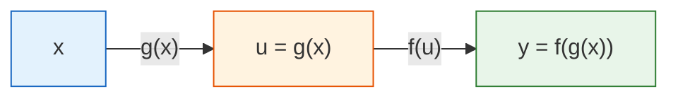
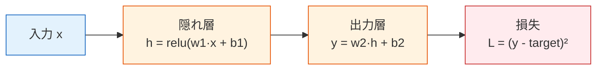
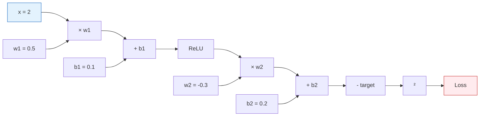
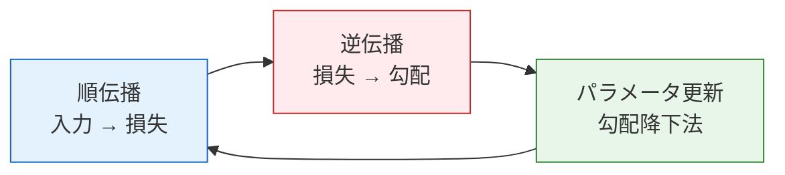

# 連鎖律と逆伝播のプレビュー


:::tip この節は数学と深層学習をつなぐ橋です
連鎖律は、ある核心的な問題を説明します。**何百層もあるニューラルネットワークで、損失関数を各パラメータで微分するにはどうすればよいのでしょうか？** その答えが逆伝播です。これは本質的に、連鎖律を体系的に適用したものです。
:::

## 学習目標

- 連鎖律を理解する——複合関数の微分の仕方
- シンプルな2層ネットワークで逆伝播を手計算する
- 計算グラフを理解する——なぜ PyTorch が必要なのか
- 第6ステージの深層学習に備える

## まず、とても大事な学習イメージを先に伝えます

この節は、第4ステージの中で初心者が一気に不安になりやすい部分です。  
なので、まず最初に押さえるべきなのは、式の1つ1つではなく、次の考え方です。

- 複雑なネットワークも、実はたくさんの簡単な手順がつながったもの
- 逆伝播は不思議なアルゴリズムではなく、各層で連鎖律を順番に使っているだけ
- PyTorch の `backward()` は、その作業を自動でやってくれているだけ

---

## まず地図を作ろう

このレッスンは、第4ステージから第6ステージの深層学習へ進むための橋です。


もし前の節で学んだのが：

- 導関数：ある量がどう変わるか
- 勾配：たくさんの量が一緒にどう変わるか
- 勾配降下法：パラメータをどう更新するか

なら、この節で補うべきなのは：

- たくさんの層があるネットワークで、勾配をどうやって順番に計算して戻すのか

## 1. 連鎖律——「玉ねぎの皮むき法」

### 1.1 直感

もし関数が「入れ子」構造になっているなら、つまり外側の中にさらに別の関数があるなら、その導関数は**1層ずつはがしていき、各層の導関数を掛け合わせる**ことで求めます。



**連鎖律：dy/dx = (dy/du) × (du/dx)**

「y の x に対する変化率 = y の u に対する変化率 × u の x に対する変化率」

### 1.1.1 初心者向けのたとえ

連鎖律は、まず歯車の列だと思うとわかりやすいです。

- 最初の歯車が少し動く
- すると次の歯車が動く
- さらにその次も動く

つまり、最後の量がどう変わるかは、  
途中の各層が「変化をどれだけ伝えるか」によって決まります。

だから連鎖律の基本動作は次の2つです。

- 1層ずつ内側へ分解する
- 各層の変化率を順番に掛ける

### 1.2 生活の直感

給料が10%上がり、物価が5%上がると、実際の購買力はどう変わるでしょうか？

- 給料の変化 → 財布に影響 → 購買力に影響
- 全体の変化 = 給料の変化率 × 変換率

各段階の変化率を掛け合わせると、全体の変化率になります。

### 1.3 計算例

```python
import numpy as np

# 例：y = (3x + 2)²
# 分解：u = 3x + 2, y = u²
# dy/dx = dy/du × du/dx = 2u × 3 = 6(3x + 2)

# 方法1：連鎖律
def chain_rule_example(x):
    u = 3 * x + 2        # 内側の関数
    y = u ** 2            # 外側の関数
    
    du_dx = 3             # 内側の関数の導関数
    dy_du = 2 * u         # 外側の関数の導関数
    dy_dx = dy_du * du_dx # 連鎖律
    
    return y, dy_dx

# 方法2：数値で確認
def numerical_derivative(f, x, h=1e-7):
    return (f(x + h) - f(x - h)) / (2 * h)

f = lambda x: (3*x + 2)**2

x0 = 1
y, dy_dx_chain = chain_rule_example(x0)
dy_dx_numerical = numerical_derivative(f, x0)

print(f"x = {x0}")
print(f"  連鎖律: dy/dx = {dy_dx_chain}")
print(f"  数値確認: dy/dx = {dy_dx_numerical:.4f}")
```

### 1.4 多段の連鎖律

もっと多くの層が入れ子になっていたらどうでしょう？ もちろん同じように、1層ずつはがします。

```python
# y = sin(exp(x²))
# 分解：a = x², b = exp(a), y = sin(b)
# dy/dx = dy/db × db/da × da/dx
#       = cos(b) × exp(a) × 2x

x0 = 0.5
a = x0 ** 2
b = np.exp(a)
y = np.sin(b)

da_dx = 2 * x0
db_da = np.exp(a)
dy_db = np.cos(b)

dy_dx = dy_db * db_da * da_dx

# 数値確認
f = lambda x: np.sin(np.exp(x**2))
dy_dx_num = numerical_derivative(f, x0)

print(f"連鎖律: {dy_dx:.6f}")
print(f"数値確認: {dy_dx_num:.6f}")
```

---

## 2. 逆伝播——連鎖律の体系化

### 2.1 2層のニューラルネットワーク



### 2.2 順伝播（Forward Pass）

```python
# シンプルな2層ネットワーク
np.random.seed(42)

# 入力と目標値
x = 2.0
target = 1.0

# パラメータ
w1 = 0.5
b1 = 0.1
w2 = -0.3
b2 = 0.2

# --- 順伝播 ---
# 第1層：線形 + ReLU
z1 = w1 * x + b1
h = max(0, z1)       # ReLU

# 第2層：線形
y = w2 * h + b2

# 損失
loss = (y - target) ** 2

print("=== 順伝播 ===")
print(f"z1 = w1*x + b1 = {w1}*{x} + {b1} = {z1}")
print(f"h  = ReLU(z1) = {h}")
print(f"y  = w2*h + b2 = {w2}*{h} + {b2} = {y}")
print(f"loss = (y - target)² = ({y} - {target})² = {loss:.4f}")
```

### 2.2.1 なぜ先に順伝播を計算してから、逆伝播を考えるのか？

それは、逆伝播は何もないところから起こるわけではないからです。  
まず順伝播で、次の中間値を計算しておく必要があります。

- `z1`
- `h`
- `y`
- `loss`

なので、理解しやすい見方はこうです。

- 順伝播は、通り道を作る作業
- 逆伝播は、その通り道に沿って勾配を1層ずつ戻す作業

### 2.3 逆伝播（Backward Pass）

**損失から始めて、各パラメータの勾配を後ろ向きに計算します。**

```python
# --- 逆伝播 ---
# 最後の層から始めて、連鎖律で1層ずつ戻る

# dL/dy
dL_dy = 2 * (y - target)
print(f"\n=== 逆伝播 ===")
print(f"dL/dy = 2*(y-target) = {dL_dy:.4f}")

# dL/dw2 = dL/dy × dy/dw2 = dL/dy × h
dL_dw2 = dL_dy * h
print(f"dL/dw2 = dL/dy × h = {dL_dy:.4f} × {h} = {dL_dw2:.4f}")

# dL/db2 = dL/dy × dy/db2 = dL/dy × 1
dL_db2 = dL_dy * 1
print(f"dL/db2 = dL/dy × 1 = {dL_db2:.4f}")

# dL/dh = dL/dy × dy/dh = dL/dy × w2
dL_dh = dL_dy * w2
print(f"dL/dh  = dL/dy × w2 = {dL_dy:.4f} × {w2} = {dL_dh:.4f}")

# dL/dz1 = dL/dh × dh/dz1（ReLU の導関数：z1>0 のとき 1、それ以外は 0）
relu_grad = 1.0 if z1 > 0 else 0.0
dL_dz1 = dL_dh * relu_grad
print(f"dL/dz1 = dL/dh × relu'(z1) = {dL_dh:.4f} × {relu_grad} = {dL_dz1:.4f}")

# dL/dw1 = dL/dz1 × dz1/dw1 = dL/dz1 × x
dL_dw1 = dL_dz1 * x
print(f"dL/dw1 = dL/dz1 × x = {dL_dz1:.4f} × {x} = {dL_dw1:.4f}")

# dL/db1 = dL/dz1 × dz1/db1 = dL/dz1 × 1
dL_db1 = dL_dz1 * 1
print(f"dL/db1 = dL/dz1 × 1 = {dL_db1:.4f}")
```

### 2.4 勾配でパラメータを更新する

```python
lr = 0.1

print(f"\n=== パラメータ更新 (lr={lr}) ===")
print(f"w1: {w1:.4f} → {w1 - lr * dL_dw1:.4f}")
print(f"b1: {b1:.4f} → {b1 - lr * dL_db1:.4f}")
print(f"w2: {w2:.4f} → {w2 - lr * dL_dw2:.4f}")
print(f"b2: {b2:.4f} → {b2 - lr * dL_db2:.4f}")

# 更新
w1 -= lr * dL_dw1
b1 -= lr * dL_db1
w2 -= lr * dL_dw2
b2 -= lr * dL_db2

# 損失が小さくなったか確認
z1_new = w1 * x + b1
h_new = max(0, z1_new)
y_new = w2 * h_new + b2
loss_new = (y_new - target) ** 2

print(f"\n損失の変化: {loss:.4f} → {loss_new:.4f} ({'↓ 小さくなった！' if loss_new < loss else '↑ 大きくなった'})")
```

---

## 3. 計算グラフ——逆伝播のデータ構造

### 3.1 計算グラフとは？

**計算グラフ = 各計算ステップをノードとして表した有向グラフ。**



**順伝播**：矢印の方向に沿って、入力から損失まで計算する。

**逆伝播**：矢印と逆向きに、損失から各パラメータの勾配を計算する。

### 3.1.1 なぜ計算グラフで急にわかりやすくなるのか？

それは、「複雑なネットワーク」を、たくさんの小さなノードに分けて見られるからです。

- 乗算
- 加算
- 活性化
- 損失

ネットワークをこれらのノードのつながりとして見ると、  
逆伝播はもう魔法ではなく、次のように見えてきます。

- グラフに沿って勾配を1層ずつ戻していく

### 3.2 なぜ PyTorch に計算グラフが必要なのか？

```python
# PyTorch では（第6ステージで詳しく学びます）
# import torch
# 
# x = torch.tensor(2.0)
# w1 = torch.tensor(0.5, requires_grad=True)
# b1 = torch.tensor(0.1, requires_grad=True)
# w2 = torch.tensor(-0.3, requires_grad=True)
# b2 = torch.tensor(0.2, requires_grad=True)
# 
# # 順伝播（PyTorch が自動で計算グラフを構築）
# h = torch.relu(w1 * x + b1)
# y = w2 * h + b2
# loss = (y - 1.0) ** 2
# 
# # 逆伝播（1行で、すべての勾配を自動計算！）
# loss.backward()
# 
# print(w1.grad)  # dL/dw1
# print(b1.grad)  # dL/db1
# print(w2.grad)  # dL/dw2
# print(b2.grad)  # dL/db2
```

PyTorch は順伝播のときに各操作を自動で記録して計算グラフを作り、`loss.backward()` でそのグラフを逆向きにたどって、連鎖律を使いながら各パラメータの勾配を自動で計算します。

:::info それがすごい理由
手で 4 個のパラメータの勾配を計算するだけでも大変です。GPT-3 には 1750億個のパラメータがあります。これを手計算することはできません。PyTorch の自動微分エンジン（autograd）を使えば、順伝播のコードを書くことだけに集中でき、勾配計算は完全に自動化されます。
:::

---

## 4. 完全な例：小さなネットワークを学習する

順伝播 + 逆伝播 + パラメータ更新をまとめて、2層ネットワークを学習してみましょう。

```python
import matplotlib.pyplot as plt

# データ
np.random.seed(42)
X_data = np.random.uniform(-2, 2, 50)
y_data = X_data ** 2 + np.random.randn(50) * 0.3  # y = x² + ノイズ

# 2層ネットワークのパラメータ
w1 = np.random.randn()
b1 = 0.0
w2 = np.random.randn()
b2 = 0.0

lr = 0.01
losses = []

for epoch in range(500):
    total_loss = 0
    
    for x, target in zip(X_data, y_data):
        # === 順伝播 ===
        z1 = w1 * x + b1
        h = max(0, z1)
        y_pred = w2 * h + b2
        loss = (y_pred - target) ** 2
        total_loss += loss
        
        # === 逆伝播 ===
        dL_dy = 2 * (y_pred - target)
        dL_dw2 = dL_dy * h
        dL_db2 = dL_dy
        dL_dh = dL_dy * w2
        dL_dz1 = dL_dh * (1.0 if z1 > 0 else 0.0)
        dL_dw1 = dL_dz1 * x
        dL_db1 = dL_dz1
        
        # === パラメータ更新 ===
        w1 -= lr * dL_dw1
        b1 -= lr * dL_db1
        w2 -= lr * dL_dw2
        b2 -= lr * dL_db2
    
    losses.append(total_loss / len(X_data))
    if epoch % 100 == 0:
        print(f"Epoch {epoch}: loss = {losses[-1]:.4f}")

# 可視化
fig, axes = plt.subplots(1, 2, figsize=(14, 5))

axes[0].plot(losses, color='coral', linewidth=2)
axes[0].set_xlabel('Epoch')
axes[0].set_ylabel('Loss')
axes[0].set_title('学習損失')
axes[0].grid(True, alpha=0.3)

x_test = np.linspace(-2, 2, 200)
y_pred_test = []
for x in x_test:
    z1 = w1 * x + b1
    h = max(0, z1)
    y_pred_test.append(w2 * h + b2)

axes[1].scatter(X_data, y_data, alpha=0.4, s=20, color='gray', label='データ')
axes[1].plot(x_test, x_test**2, 'g--', linewidth=2, label='y = x²（真の値）')
axes[1].plot(x_test, y_pred_test, 'r-', linewidth=2, label='ネットワーク予測')
axes[1].set_title('近似結果（2層ネットワーク、隠れニューロン1個）')
axes[1].legend()
axes[1].grid(True, alpha=0.3)

plt.tight_layout()
plt.show()
```

:::tip ニューロンが1個だけだと限界がある
このネットワークは隠れニューロンが1個しかありません（本質的には区分線形関数です）。そのため、x² を完全に近似するのは難しいです。ニューロンを増やせば、もっとよく近似できます。これが第6ステージで学ぶ内容です。
:::

---

## まとめ

| 概念 | 直感 |
|------|------|
| 連鎖律 | 複合関数の導関数 = 各層の導関数の積 |
| 順伝播 | 入力から損失まで、順に計算する |
| 逆伝播 | 損失からパラメータへ、順に勾配を計算する |
| 計算グラフ | 計算手順を記録し、自動微分を可能にする |
| 自動微分 | PyTorch がすべての勾配を自動で計算してくれる |

## この節で一番持ち帰ってほしいこと

- 連鎖律の最重要の直感は、「変化は多層構造を通って1層ずつ伝わる」ということ
- 逆伝播の最重要の直感は、「損失から始めて、勾配を1層ずつ戻す」ということ
- 計算グラフの最重要の価値は、この流れを記録でき、自動化できる形にしてくれること



:::info 本章の振り返り & ステージまとめ
微積分の3つのレッスン + この節で、あなたは次を学びました。
1. **導関数**：変化の速さ、最適化の方向
2. **偏導関数と勾配**：多変数のときの方向、最も増える方向を指す
3. **勾配降下法**：AI 学習の核心——負の勾配方向へ少しずつ進む
4. **連鎖律と逆伝播**：各パラメータの勾配を効率よく計算する

**🔖 第4ステージ完了！**

これで、AI に必要な3つの大きな数学基礎を身につけました。
- **線形代数**：ベクトル、行列、固有値——データの表現と変換
- **確率統計**：確率分布、ベイズ、MLE——不確実性と損失関数
- **微積分**：導関数、勾配、勾配降下法——モデルがどう学ぶか

**🔀 次のステップ**：**第5ステージ・機械学習**へ進み、これらの数学ツールを実際の機械学習アルゴリズムに使っていきましょう。
:::

---

## 実践練習

### 練習1：連鎖律を手計算する

y = (2x + 1)³ について、連鎖律を使って dy/dx を求め、x=1 で確認してください。

### 練習2：ネットワークを拡張する

第4節の2層ネットワークを、隠れニューロンが3個ある形に変更してください（w1 を3つの重みにする）。順伝播と逆伝播のコードを手で書いてみましょう。

### 練習3：手計算と自動計算を比べる

もし PyTorch をすでにインストールしているなら、`torch.autograd` を使って第2節のすべてのパラメータの勾配を計算し、手計算の結果と比べてみましょう。

```python
# ヒント
import torch

x = torch.tensor(2.0)
w1 = torch.tensor(0.5, requires_grad=True)
# ... コードを補完してください ...
# loss.backward()
# print(w1.grad)
```
