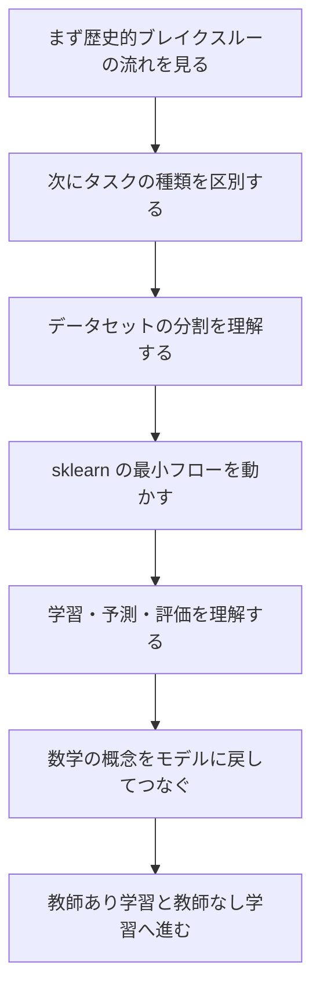
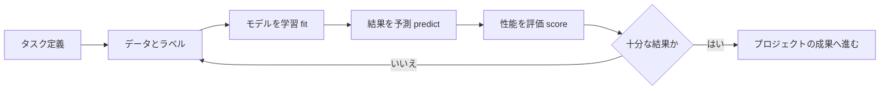

# 学習ガイド：機械学習基礎のこの章では何を学ぶのか

この章は、アルゴリズム名を暗記するための章ではありません。まずは「機械学習プロジェクトの地図感」を身につけるためのものです。この章をしっかり学べば、後の教師あり学習、教師なし学習、モデル評価、特徴量エンジニアリング、プロジェクト実践が、バラバラの概念になりません。

## この章がコース全体の中でどこにあるのか

ここまでで、すでに Python、データ分析、AI 数学の最小限の基礎を学んできました。ここからは、コースが「データを処理する」段階から「モデルにデータから規則性を学ばせる」段階へ進みます。

この変化で大事なのは、従来のプログラミングでは主に人がルールを書くのに対し、機械学習ではデータを用意し、目的を定義し、モデルを選び、モデルを学習させ、評価結果で本当に規則性を学べたかを判断する、という点です。

前半の重点は「データ」と「数学」の準備です。まずはデータを読めるようになり、データを処理できるようになってから、ベクトル、確率、最適化といった、機械学習で何度も使う概念を理解していきます。

## この章が本当に解決する問題

この章では、まず4つの基本問題に答えます。機械学習と従来のプログラミングは何が違うのか。分類、回帰、クラスタリングといったタスクを、なぜ最初に区別する必要があるのか。学習用データ、検証用データ、テスト用データを、なぜ混ぜてはいけないのか。`scikit-learn` はなぜ学習、予測、評価を一つの統一された流れにまとめられるのか。

初心者は、機械学習を「アルゴリズムの一覧」として学びがちです。でも本当に大事なのは、各アルゴリズムがどの種類のタスクのためにあるのかを先に理解することです。そして、タスク、データ、特徴量、評価方法がそろって初めて、そのモデルに意味があるかどうかが決まります。

## 初心者におすすめの学習順序

まず「機械学習の歴史的ブレイクスルーの流れ」を見て、ベイズ、線形モデル、決定木、SVM、ランダムフォレスト、Boosting、sklearn を一本の技術進化の線として捉えましょう。次に「機械学習とは何か」を見て、教師あり学習、教師なし学習、分類、回帰、クラスタリング、学習用データ、テスト用データといった座標軸を立てます。続いて `Scikit-learn` 入門で、`fit / predict / score` という最短のモデリングの流れを理解します。最後に「数学はどうやって機械学習に本当に入ってくるのか」を見直し、第4ステーションで学んだ線形代数、確率統計、微積分をモデル学習につなげます。

## この章で押さえるべき主線

この章は、最小の閉ループとして覚えるとよいです。まずタスクが何かを判断し、次にデータとラベルを準備し、それから baseline モデルを選び、`fit` で学習し、`predict` で予測し、`score` などの指標で評価します。最後に、その結果を見て特徴量を直すのか、モデルを変えるのか、データを見直すのかを決めます。

## この章と後続の章との関係

この章は第5ステーションの入口です。後半の教師あり学習では分類と回帰を展開し、教師なし学習ではクラスタリングと次元削減を扱います。モデル評価では、そのスコアが信頼できるかどうかを見ます。特徴量エンジニアリングでは、データをモデルに合いやすくする方法を学び、最後のプロジェクト実践で、これらを一つの完全なモデリングフローとしてまとめます。

この章をしっかり学べていないと、よくある問題が起きます。各アルゴリズムは見たことがあるのに、いつ使うべきか分からない。コードは動くのに、結果が本当に信頼できるか判断できない。モデルのスコアは高いのに、データリークや評価ミスの可能性に気づけない。そんな状態になりやすいのです。

「なぜこれらのアルゴリズムが登場したのか」を先に整理したいなら、まず [1.2 機械学習の歴史的ブレイクスルーの流れ](./04-history-breakthroughs.md) を読んでください。ここでは Bayes、MLE、EM、線形モデル、決定木、SVM、ランダムフォレスト、Boosting、XGBoost、sklearn を、それぞれ対応する学習章へ割り当てていきます。

## 初心者と上級学習者はどう読むか

初心者がこの章を初めて学ぶときは、まず主線と最小の実行例をつかみましょう。すべての細部を一度で理解する必要はありません。この章が何を解決するのか、入力と出力は何か、最小のプロジェクトをどう動かすのかを説明できれば、次へ進んで大丈夫です。

経験のある学習者は、この章を「抜け漏れの確認」と「実務化の練習」として使えます。境界条件、失敗例、評価方法、コードの再現性、前後の章とのつながりに注目しましょう。読んだ後は、本章の内容を自分の作品の README や実験記録に残せると理想的です。

## 学習時間と難易度の目安

| 学習方法 | おすすめ時間 | 目標 |
|---|---|---|
| ざっと読む | 20〜30 分 | この章が何を解決するのかを理解し、後でどこで使うのかを把握する |
| 最小クリア | 1〜2 時間 | 最小例を動かし、本章のミニプロジェクト出口を終える |
| じっくり練習 | 半日〜1 日 | エラー分析、比較実験、またはプロジェクト README の記録を追加する |

## 本章の自己チェック問題

| 自己チェック問題 | 合格基準 |
|---|---|
| この章は何を解決するのか？ | コース全体の中での位置づけを一言で説明できる |
| 最小の入力と出力は何か？ | 例に何を入力し、どんな結果が出るかを説明できる |
| よくある失敗ポイントはどこか？ | 少なくとも1つ、エラー・性能低下・理解のズレの原因を挙げられる |
| 学び終えた後に何を残せるか？ | 本章の成果を README、実験記録、作品集に書ける |

## 本章のミニプロジェクト出口

この章を学び終えたら、最小限の分類または回帰の練習をしてみましょう。sklearn の組み込みデータセットを使って、データ読み込み、学習・テスト分割、モデル学習、予測、評価、そして簡単な結論の説明まで行います。プロジェクトは複雑である必要はありませんが、少なくとも「分類か回帰か」「入力特徴量は何か」「目的ラベルは何か」「どの評価指標を使ったか」「モデル結果は baseline として使えるか」をはっきり説明できることが大切です。

## 合格基準

この章が終わるころには、機械学習と従来のプログラミングの違いを自分の言葉で説明でき、分類・回帰・クラスタリングを区別でき、学習用データとテスト用データを分ける理由を説明でき、`fit / predict / score` の意味を理解し、最小の sklearn モデリングフローを動かせるようになっているはずです。

さらに、「このスコアは本当に信頼できるのか」「データリークはないか」「baseline はどのくらいか」を自分から確認できるようになっていれば、もうただ API を学んでいるだけではありません。機械学習プロジェクトの考え方を、しっかり身につけ始めています。
