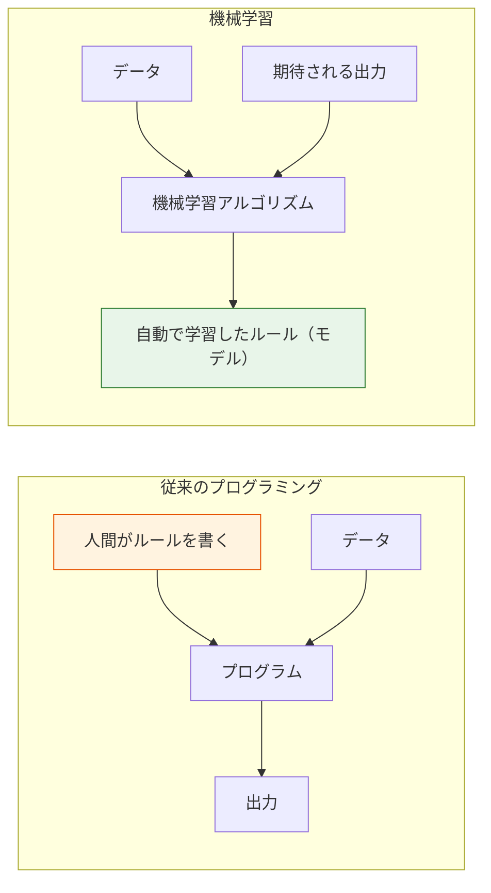
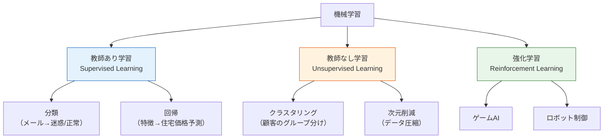
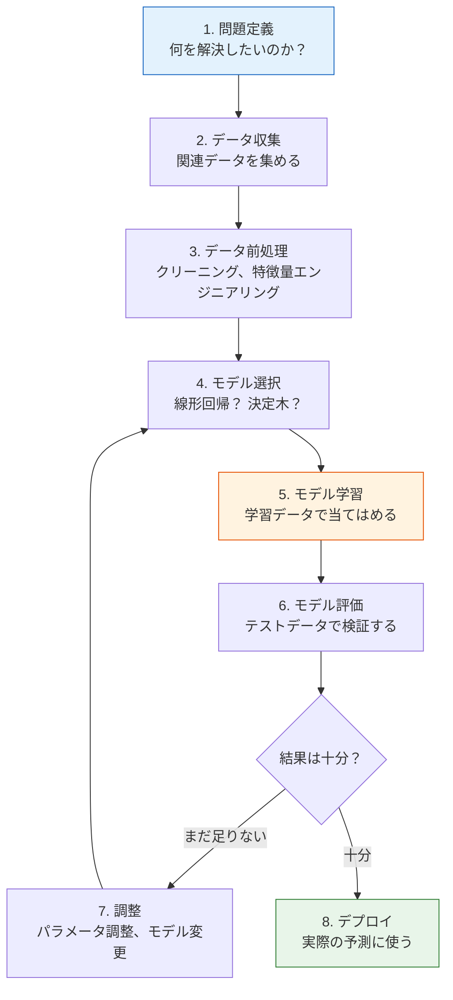
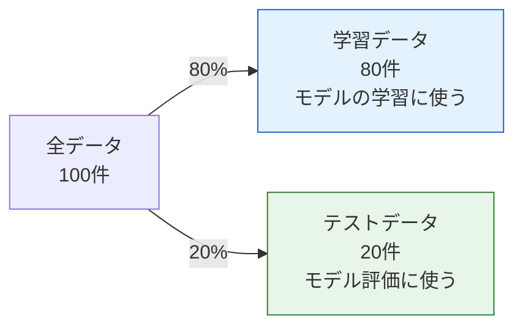
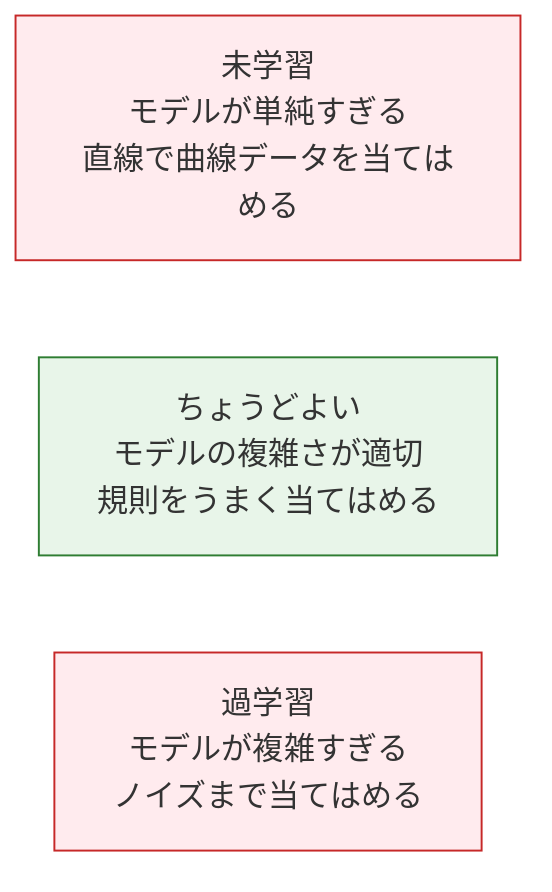

# 5.1.2 機械学習とは何か


## 残す証拠

このページを終えたら、この evidence card を残します。

```text
ml_problem: supervised, unsupervised, evaluation, or feature-engineering task
baseline: simplest sklearn/modeling loop and fixed train/test split
output: prediction, metric, chart, or model decision note
failure_check: data leakage, unclear target, weak baseline, or metric mismatch
Expected_output: minimal ML loop with metric and one failure observation
```

## この節の位置づけ

この節は、あなたが機械学習に正式に入る最初の一歩です。大事なのは定義を暗記することではなく、機械学習と従来のプログラミングの違いを理解し、「問題の種類 → データの形 → 学習方法」を見分ける考え方を身につけることです。これが、この後の教師あり学習、教師なし学習、モデル評価の土台になります。

:::tip ようこそ機械学習の段階へ
最初の3つの段階で、Python、データ分析、数学の基礎を学びました。ここからついに、コンピュータに**自分で"学ばせる"**ことが始まります。AI の旅の中でも、とてもワクワクする段階のひとつです。
:::

## 学習目標

- 機械学習とは何か、そして従来のプログラミングとの違いを理解する
- 機械学習の3つの大分類（教師あり学習、教師なし学習、強化学習）を身につける
- 機械学習の全体のワークフローを理解する
- 正しい ML の考え方を身につける

---

## まずは地図を1枚つくろう

このページでいちばん大切なのは、定義を丸暗記することではなく、まず判断のための枠組みを作ることです。


この図が理解できると、第5章の多くの節が一気に分かりやすくなります。


この漫画は、最初の判断チェックリストとして使えます。ルールを明確に書けるなら通常のプログラムで十分かもしれません。規則が多くの事例の中に隠れているなら、機械学習が役立ちます。そのうえで、ラベルがあるか、出力がカテゴリか数値か、評価指標で本当に有用性を示せるかを確認します。

---

## 機械学習とは何か？

### 一言でいうと

**機械学習 = 人間がルールを書き込むのではなく、コンピュータがデータから規則を自動で見つけること。**

### 従来のプログラミング vs 機械学習



| | 従来のプログラミング | 機械学習 |
|---|---------|---------|
| 入力 | ルール + データ | データ + 期待される出力 |
| 出力 | 結果 | ルール（モデル） |
| 向いている場面 | ルールが明確な場合（例：税額計算） | ルールを表しにくい場合（例：猫の識別） |
| 書き方 | 人が if-else のロジックを書く | アルゴリズムがデータから自動で学習する |

### なぜ機械学習が必要なのか？

人間が**ルールをうまく説明できない**タスクがあります。

```python
# 従来のプログラミング：メールが迷惑メールか判定する
def is_spam_traditional(email):
    if "無料" in email:
        return True
    if "当選" in email:
        return True
    if "クリックして受け取る" in email:
        return True
    # ... まだまだルールはある？ 永遠に書き切れない！
    return False

# 機械学習：10万件のラベル付きメールをモデルに学習させる
# model.fit(emails, labels)
# model.predict(new_email)  → 自動で判定
```

機械学習が向いている場面：
- ルールが複雑、または不明な場合（画像認識、音声認識）
- ルールが変化する場合（推薦システム、不正検知）
- データ量が多く、人手で分析しきれない場合
- 個別最適化された結果が必要な場合

### 機械学習を学び始めたら、まず何をつかむべきか？

最初に押さえるべきなのは「モデルには何種類あるか」ではなく、この一文です：

> **機械学習は、手書きのルールをデータで置き換える技術です。**

この考え方をつかむと、次のようなことが判断しやすくなります。

- いつ従来のプログラミングで十分か
- いつモデルに学習させるべきか
- なぜデータの質がモデルの限界を直接決めるのか

### 初心者が早めにほどいておきたい用語

| 用語 | 何を意味するか | この章でなぜ重要か |
|---|---|---|
| `ML` | Machine Learning の略 | 図、ファイル名、プロジェクトメモで何度も出てきます |
| `model` | 学習されたルールや関数 | 学習後に保存され、再利用され、予測に使われるものです |
| `algorithm` | 学習方法 | 決定木、ロジスティック回帰、K-Means は学習前にはアルゴリズムです |
| `training` | データから学ぶ処理 | コードでは多くの場合 `fit` を呼んだときに起こります |
| `inference` | 学習済みモデルを新しいデータに使うこと | sklearn では `predict` や `predict_proba` として現れます |
| `baseline` | 最初に超えるべき一番単純な結果 | 後の改善が本物か、偶然かを判断する基準になります |
| `metric` | 成功を測るものさし | Accuracy、F1、MAE、RMSE はそれぞれ違う評価の問いに答えます |

初心者にとって特に大切なのは、`algorithm` と `model` の違いです。アルゴリズムは学習のレシピで、モデルはそのレシピがデータを見たあとに得られる学習済みの結果です。

---

## 機械学習の3つの大分類



### 教師あり学習——"正解"がある

**核心**：入力と出力が対になった大量のデータを使って、対応関係を学習します。

| 種類 | 出力 | 例 |
|------|------|------|
| **分類** | 離散的なカテゴリ | メール→迷惑/正常、画像→猫/犬 |
| **回帰** | 連続値 | 面積→住宅価格、特徴→気温 |

```python
# 教師あり学習のデータ形式
# X（特徴/入力）       y（ラベル/出力）
# [面積, 部屋数, 階数]   → 住宅価格
# [120,  3,    15]      → 350万円
# [80,   2,    8]       → 220万円
# [200,  4,    20]      → 580万円
```

**重要**：学習データには**ラベル**（正解）が必要です。モデルの目的は、X から y を予測できるようになることです。

### ある問題が教師あり学習か、すぐ見分けるには？

自分にこう聞いてみましょう。

- 「入力 → 正しい出力」の組みになったデータを持っているか？

もしあるなら、たいてい教師あり学習です。
次にこう考えます。

- 出力はカテゴリか、それとも連続値か？

すると自然に次の2つに分かれます。

- 分類
- 回帰

### 教師なし学習——"正解"がない

**核心**：入力データだけがあり、ラベルはありません。モデルがデータの中の構造やパターンを自分で見つけます。

| 種類 | 何をするか | 例 |
|------|--------|------|
| **クラスタリング** | 似ているデータをまとめる | 顧客のグループ分け、ニュースの分類 |
| **次元削減** | 特徴量の数を減らす | PCA（第4章で学習済み） |
| **異常検知** | 異常なデータを見つける | クレジットカード不正検知 |

```python
# 教師なし学習のデータ：ラベルなし
# X（特徴）
# [支出額, 購入頻度, 最終購入日]
# [500,      10,      3日前]
# [50,       2,       30日前]
# [1000,     20,      1日前]
# → モデルが自動で「高価値顧客」「低頻度顧客」などのグループに分ける
```

### 教師なし学習で誤解しやすい点

初心者は、教師なし学習を「機械が勝手に本当の答えを見つけるもの」と考えがちです。
でも、より正確にいうと次の通りです。

- モデルは、ひとつのあり得る構造を見つける手助けをする
- ただし、その構造にビジネス上の価値があるかどうかは、最後に人が解釈する必要がある

なので教師なし学習では、「結果を出すこと」と同じくらい「結果をどう説明するか」が大切です。

### 強化学習——"試行錯誤"で学ぶ

**核心**：エージェント（Agent）が環境の中で行動し、報酬や罰則をもとに方針を調整します。

| 要素 | 説明 |
|------|------|
| エージェント | 意思決定を行う AI |
| 環境 | エージェントがいる世界 |
| 状態 | いまの環境情報 |
| 行動 | エージェントが取れる選択 |
| 報酬 | 行動のあとに得られるフィードバック |

```python
# 強化学習のイメージ：子犬のしつけ
# 状態：子犬が見ている環境
# 行動：座る / 立つ / 握手する
# 報酬：うまくできた → おやつ（+1）、失敗した → なし（0）
# 何度も試行錯誤するうちに、子犬は正しい行動を学ぶ
```

:::info このコースでの重点
この段階では主に**教師あり学習**と**教師なし学習**を学びます。強化学習は、後のエージェントシステムの内容で扱います。
:::

### 3つの学習方法の比較

| | 教師あり学習 | 教師なし学習 | 強化学習 |
|---|---------|----------|---------|
| データにラベルがある？ | ある | ない | 報酬信号がある |
| 目的 | ラベルを予測する | 構造を見つける | 報酬を最大化する |
| 代表的なアルゴリズム | 線形回帰、決定木 | K-Means、PCA | Q-Learning、PPO |
| AI の応用 | 画像分類、翻訳 | 顧客のグループ分け、推薦 | ゲーム AI、ロボット |

---

## 機械学習のワークフロー

### 全体の流れ



### まずは流れを一文で読む

この流れは、初心者向けにこう言い換えられます。

> **まず問題を決め、データを準備し、動くものを作り、結果を見て、少しずつ改善する。**

これが、実は第5章全体の土台になる考え方です。

### 学習データ vs テストデータ

ML でとても重要な考え方のひとつは、**学習データでモデルを評価してはいけない**ということです。

```python
import numpy as np

# データセットのシミュレーション
rng = np.random.default_rng(seed=42)
n = 100
X = rng.normal(size=(n, 3))
y = rng.integers(0, 2, n)

# 通常は 80% を学習、20% をテストに使う
from sklearn.model_selection import train_test_split

X_train, X_test, y_train, y_test = train_test_split(
    X, y, test_size=0.2, random_state=42
)

print(f"学習データ: {X_train.shape[0]} 件")
print(f"テストデータ: {X_test.shape[0]} 件")
```

期待される出力：

```text
学習データ: 80 件
テストデータ: 20 件
```



:::warning なぜ分けるの？
同じデータで学習と評価をすると、モデルはデータを"覚える"ことで満点に近づけます。でも、新しいデータではうまくいかないかもしれません。これを**過学習**（overfit）といいます。試験前に答えを丸暗記して、別の問題が出ると解けないのと同じです。
:::


この図を読むときは、まず3つの境界線に注目してください。学習データは学習に使い、検証データは方針選びに使い、テストデータは最後の評価だけに使います。もし、途中の処理でテストデータの情報を先に見てしまうと、たとえば全データで先に標準化したり、全データで先に特徴量を選んだりして、モデルの点数が「見かけ上高く」なってしまうことがあります。

### 初心者がやりがちな落とし穴：「学習できた」を「覚えた」と勘違いする

機械学習でとても大事な分かれ道はここです。

- 学習データでうまくいくからといって、本当に規則を学べたとは限らない
- 単に学習データを覚えているだけのこともある

だからこの節から、次の習慣を持つようにしましょう。

- 高いスコアを見たら、まず「それは学習データのスコア？ テストデータのスコア？」と確認する

### 最小の完全な例

コードを読む前に、まず全体の流れを見ておきましょう。


この図は、最小限でも役に立つ ML プロジェクトの形です。問題を決め、`X` と `y` を用意し、モデルを学習し、指標で評価し、次に何を改善するかを決めます。下のコードはあえて小さくしています。各行を図のステップに対応づけながら読めるようにするためです。

```python
from sklearn.datasets import load_iris
from sklearn.model_selection import train_test_split
from sklearn.tree import DecisionTreeClassifier
from sklearn.metrics import accuracy_score

# 1. データを読み込む
iris = load_iris()
X, y = iris.data, iris.target
print(f"データセット: {X.shape[0]} 件のサンプル, {X.shape[1]} 個の特徴量, {len(set(y))} 個のカテゴリ")

# 2. 学習データとテストデータに分ける
X_train, X_test, y_train, y_test = train_test_split(X, y, test_size=0.2, random_state=42)

# 3. モデルを選んで学習する
model = DecisionTreeClassifier(random_state=42)
model.fit(X_train, y_train)  # 学習！

# 4. 予測して評価する
y_pred = model.predict(X_test)
accuracy = accuracy_score(y_test, y_pred)
print(f"テストデータの正解率: {accuracy:.1%}")
```

期待される出力：

```text
データセット: 150 件のサンプル, 4 個の特徴量, 3 個のカテゴリ
テストデータの正解率: 100.0%
```

**たった数行で、完全な ML プロジェクトが1つ完成します！** これからの章で、各ステップを少しずつ深掘りしていきます。

もし `ModuleNotFoundError: No module named 'sklearn'` と表示されたら、先にこの章の依存ライブラリをインストールしてください。

```bash
python -m pip install --upgrade scikit-learn
```

ここで `scikit-learn` はインストールするパッケージ名で、`sklearn` は Python コードで import するモジュール名です。

コードは次の対応で読むと分かりやすくなります。

| コードのキーワード | 意味 | なぜ重要か |
|---|---|---|
| `load_iris()` | 組み込みの練習用データセットを読み込む | ファイルをダウンロードせず、安全に最初の練習ができます |
| `X` | 特徴量行列、つまり入力の列 | モデルはこの値から規則を学びます |
| `y` | 目的変数、つまり正解ラベル | 教師あり学習では、学習のためにラベルが必要です |
| `train_test_split` | データを学習用と確認用に分ける | すでに見たデータでモデルを評価することを防ぎます |
| `fit` | モデルを学習する | ここでアルゴリズムが学習済みモデルになります |
| `predict` | 学習済みモデルを新しい入力に使う | 実際のアプリで使う推論のステップです |
| `accuracy_score` | 正しく予測できた割合を計算する | モデルの振る舞いを測れる数字に変えます |
| `random_state` | ランダムな分割やモデルの乱数を固定する | 何度実行しても同じ結果になり、学習しやすくなります |

---

## 重要用語の早見表

| 用語 | 英語 | 意味 |
|------|------|------|
| サンプル | Sample | 1件のデータ |
| 特徴量 | Feature | サンプルを表す属性（入力の各列） |
| ラベル | Label / Target | サンプルの"正解"（予測したい値） |
| 学習データ | Training Set | モデルを学習させるためのデータ |
| テストデータ | Test Set | モデルを評価するためのデータ |
| 過学習 | Overfitting | モデルが学習データを"暗記"してしまい、汎化能力が低いこと |
| 未学習 | Underfitting | モデルが単純すぎて、学習データすらうまく学べないこと |
| 汎化 | Generalization | 新しいデータでもうまく動く能力 |
| ハイパーパラメータ | Hyperparameter | 人が設定する必要があるパラメータ（学習率、木の深さなど） |
| データ漏えい | Data leakage | テストデータや未来情報が誤って学習に入り、スコアが実力以上に見えること |
| 検証データ | Validation Set | 最終テストの前に、モデルやハイパーパラメータを選ぶためのデータ |

### 過学習 vs 未学習



```python
import matplotlib.pyplot as plt

rng = np.random.default_rng(seed=42)
x = np.linspace(0, 1, 20)
y = np.sin(2 * np.pi * x) + rng.normal(size=20) * 0.3

fig, axes = plt.subplots(1, 3, figsize=(15, 4))
x_smooth = np.linspace(0, 1, 200)

# 未学習：1次多項式（直線）
coeffs = np.polyfit(x, y, 1)
axes[0].scatter(x, y, color='steelblue', s=40)
axes[0].plot(x_smooth, np.polyval(coeffs, x_smooth), 'r-', linewidth=2)
axes[0].set_title('未学習（直線）\n単純すぎて規則を捉えられない')

# ちょうどよい：3次多項式
coeffs = np.polyfit(x, y, 3)
axes[1].scatter(x, y, color='steelblue', s=40)
axes[1].plot(x_smooth, np.polyval(coeffs, x_smooth), 'r-', linewidth=2)
axes[1].set_title('ちょうどよい（3次多項式）\n規則をうまく当てはめている')

# 過学習：18次多項式
coeffs = np.polyfit(x, y, 18)
axes[2].scatter(x, y, color='steelblue', s=40)
y_overfit = np.polyval(coeffs, x_smooth)
y_overfit = np.clip(y_overfit, -3, 3)
axes[2].plot(x_smooth, y_overfit, 'r-', linewidth=2)
axes[2].set_title('過学習（18次多項式）\nノイズまで当てはめている')
axes[2].set_ylim(-3, 3)

for ax in axes:
    ax.grid(True, alpha=0.3)

plt.tight_layout()
plt.show()
```

---

## まとめ

| 要点 | 説明 |
|------|------|
| 機械学習 | データから規則を学ぶこと |
| 教師あり学習 | ラベルあり、予測を学ぶ（分類/回帰） |
| 教師なし学習 | ラベルなし、構造を見つける（クラスタリング/次元削減） |
| 強化学習 | 試行錯誤で方針を学ぶ（報酬ベース） |
| 基本の流れ | データ → 前処理 → 学習 → 評価 → デプロイ |
| 学習/テスト分割 | 必ず分ける。過学習を防ぐため |

## この節で一番持ち帰ってほしいこと

もし一文だけ覚えるなら、これです。

> **機械学習の本当の出発点は、モデルを覚えることではなく、問題・データ・評価方法をきちんと対応づけることです。**

この節で得てほしい最重要ポイントは次の通りです。

- 教師あり学習と教師なし学習を区別できる
- 分類と回帰を区別できる
- なぜ学習データとテストデータを分ける必要があるか分かる
- 第5章以降のアルゴリズムは、すべてこの地図の中にあると分かる

:::info 次につながる内容
- **次の節**：Scikit-learn 入門——ML 実践の標準ツール
- **第2章**：具体的なアルゴリズムを学ぶ（線形回帰、ロジスティック回帰、決定木など）
- **第4章**：モデル評価を深く学ぶ——モデルが良いかをどう科学的に判断するか
:::

---

## 実践演習

### 演習1：分類 vs 回帰

次のタスクが分類か回帰かを判断してください。
1. 明日の気温を予測する
2. 写真に人の顔があるかどうかを判定する
3. ある株の明日の終値を予測する
4. ニュースをスポーツ/テクノロジー/エンタメ/金融に分ける
5. あるユーザーが離脱するかを予測する

### 演習2：最初の ML モデル

scikit-learn の `load_wine()` データセットを使って決定木分類器を学習し、テストデータの正解率を出力してください。

```python
from sklearn.datasets import load_wine
from sklearn.model_selection import train_test_split
from sklearn.tree import DecisionTreeClassifier

wine = load_wine()
X_train, X_test, y_train, y_test = train_test_split(
    wine.data, wine.target, test_size=0.2, random_state=42, stratify=wine.target
)

model = DecisionTreeClassifier(random_state=42)
model.fit(X_train, y_train)
accuracy = model.score(X_test, y_test)
print(f"Test accuracy: {accuracy:.3f}")
```

現在の sklearn では、期待される出力はおおよそ次のようになります。

```text
Test accuracy: 0.944
```

sklearn のバージョンや分割設定が変わると、結果が少し変わることがあります。ここで大切なのは、データを読み込み、分割し、学習データだけで学習し、テストデータで評価する流れです。

### 演習3：過学習を観察する

4.3節の過学習の例を修正し、異なる次数の多項式（1, 3, 5, 10, 18）でデータを当てはめて、5枚のサブプロットを描き、複雑さが当てはまり方に与える影響を観察してください。

<details>
<summary>参考解答と解説</summary>

1. 明日の気温と株価の終値は、予測対象が数値なので回帰です。顔の有無、ニュースカテゴリ、ユーザー離脱は、予測対象が離散ラベルなので分類です。
2. `load_wine()` の演習では、教師あり学習の基本手順を守ります。特徴量とラベルを読み込み、学習前に train/test に分け、`X_train, y_train` だけで fit し、`X_test, y_test` で score します。この分割で `0.944` 前後の精度は自然ですが、数値そのものよりテストデータを学習に漏らさないことが重要です。
3. 1 次はたいてい単純すぎて underfitting し、3 次や 5 次は主な傾向を捉えやすく、10 次や 18 次はノイズまで追いかけることがあります。訓練データへの当てはまりだけでなく、検証/テスト誤差も見て複雑さを判断します。

</details>
