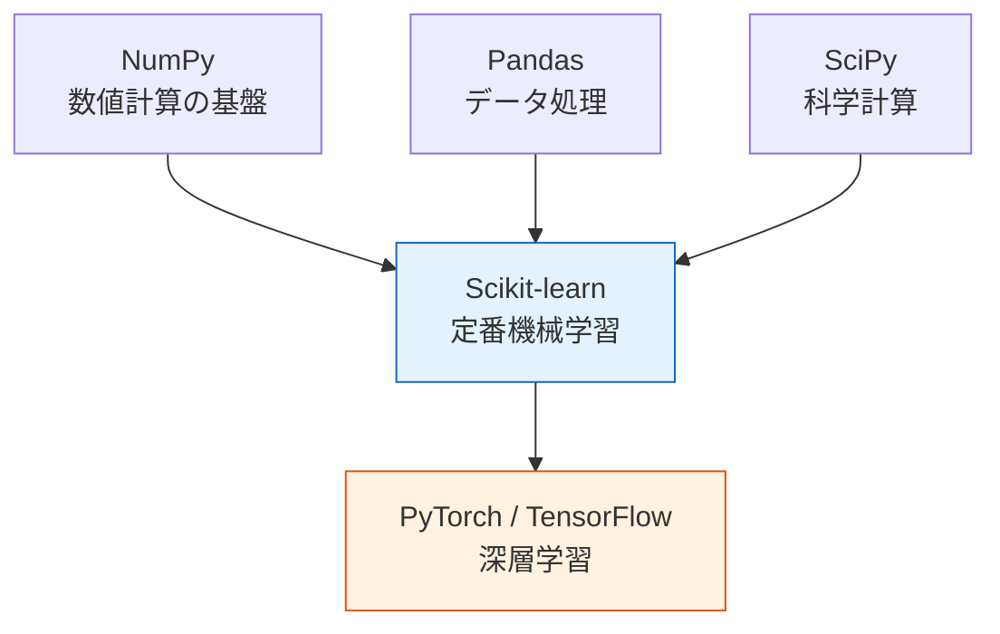
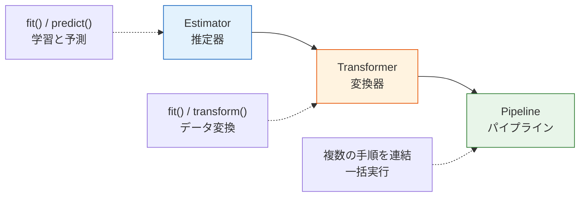
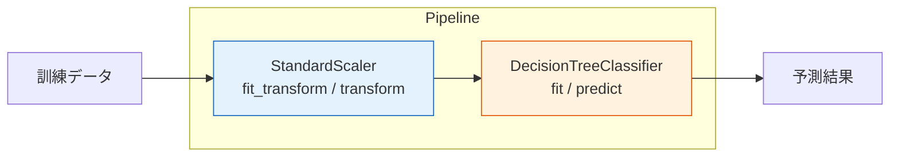
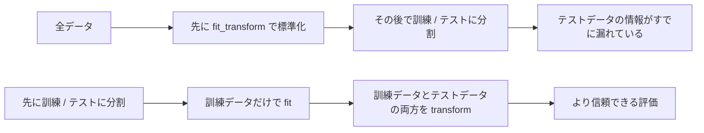

# Scikit-learn フレームワーク入門


:::tip この節の位置づけ
Scikit-learn は Python の機械学習における**事実上の標準ライブラリ**です。ほとんどすべての典型的な ML タスクはこれで実行できます。sklearn の API パターンを身につけると、あとでどんなアルゴリズムを学んでもとてもスムーズです。
:::

## 学習目標

- Scikit-learn の設計思想と統一 API を理解する
- Estimator、Transformer、Pipeline の3つのコア概念を身につける
- データセットの読み込みと生成を学ぶ
- 学習から予測までの一連の流れを完成させる
- モデルの保存と読み込みを学ぶ

---

## 初心者はまず押さえる / 上級者は後で深く理解する

もしあなたが初心者なら、この節ではまず一つだけ覚えてください。sklearn で最も大事なのは、個別のアルゴリズムではなく**統一されたワークフロー**です。まずは `fit`、`transform`、`predict`、`score` という動作を、「学習、変換、予測、評価」に対応づけましょう。

すでに経験があるなら、さらに次の点に注目できます。Pipeline を使ってデータリークを防ぐ方法、前処理とモデルをまとめて保存する方法、統一 API でモデル比較やチューニングを行う方法です。

---

## まず全体の地図を作る

この節で大切なのは、「ライブラリを一つ学ぶ」ことではなく、機械学習の操作習慣をとても安定した形で身につけることです。

初心者にとって `scikit-learn` の最大の価値は次の点です。

- さまざまなアルゴリズムを同じインターフェースで扱える
- まずは実装の違いより、モデリングの流れに集中できる

より安定した心のモデルは次の図です。


この流れを頭に入れておけば、あとでどの定番 ML モデルに切り替えても、あまり不安になりません。

---

## 一、なぜ Scikit-learn なのか？

### 1.1 sklearn が ML エコシステムで占める位置



| 特徴 | 説明 |
|------|------|
| **統一された API** | すべてのアルゴリズムで同じ `fit` / `predict` / `transform` を使う |
| **豊富なアルゴリズム** | 分類、回帰、クラスタリング、次元削減、前処理がそろっている |
| **優れたドキュメント** | どのアルゴリズムにも詳しい説明と例がある |
| **活発なコミュニティ** | 世界で最も使われている ML ライブラリの一つ |
| **実運用に対応** | 実際のプロジェクトにそのまま使える |

### 1.1.1 初心者にとって、sklearn の一番大きな価値は？

一番大事なのは「アルゴリズムが多いこと」ではなく、次の点です。

- モデルが変わっても毎回インターフェースを学び直さなくてよい
- ライブラリの違いに邪魔されず、モデル比較に集中できる
- 「学習、予測、評価」が実は共通の流れだと理解しやすい

### 1.2 インストール

```bash
python -m pip install --upgrade scikit-learn
```

```python
import sklearn
print(sklearn.__version__)
```

期待される出力はバージョン番号です。たとえば次のようになります。

```text
1.8.0
```

`scikit-learn` は `pip` でインストールするときのパッケージ名です。`sklearn` は Python コードで import するときのモジュール名です。インストール後に `import sklearn` が失敗する場合は、まず `pip` と `python` が同じ環境を指しているか確認してください。

---

## 二、Scikit-learn の設計思想

### 2.1 統一 API —— ひとつ覚えれば全部に使える

Scikit-learn の強みは、**すべてのアルゴリズムが同じ API パターンに従う**ことです。線形回帰でも、決定木でも、SVM でも、使い方は同じです。

次のコードはワークフローのテンプレートです。完全な例の中で `X_train`、`X_test`、`y_train`、`y_test` を作ったあとに実行できます。

```python
# どんなアルゴリズムでも、コード構造は同じです：
from sklearn.xxx import SomeModel

model = SomeModel(ハイパーパラメータ)      # モデルを作る
model.fit(X_train, y_train)   # 学習
y_pred = model.predict(X_test) # 予測
score = model.score(X_test, y_test)  # 評価
```

具体例をいくつか見てみましょう。コード構造が同じであることに注目してください。

```python
from sklearn.tree import DecisionTreeClassifier
from sklearn.linear_model import LogisticRegression
from sklearn.svm import SVC
from sklearn.neighbors import KNeighborsClassifier

# 使い方は完全に同じ！ 変わるのはモデル名だけ
models = {
    "決定木": DecisionTreeClassifier(),
    "ロジスティック回帰": LogisticRegression(),
    "SVM": SVC(),
    "KNN": KNeighborsClassifier(),
}

for name, model in models.items():
    model.fit(X_train, y_train)
    score = model.score(X_test, y_test)
    print(f"{name}: {score:.1%}")
```

:::info 統一 API のメリット
`fit` / `predict` / `score` を一度覚えれば、sklearn のすべてのアルゴリズムに使えます。モデルを変えるのは、部品を交換するくらい簡単です。
:::

### 2.1.1 初心者が最初に覚えるべき 3 つの動作は？

今すぐ 3 つだけ覚えるなら、次の通りです。

- `fit`：学習する
- `predict`：予測する
- `score`：まずは基本的な結果を見る

この 3 つは、第 5 ステップで最もよく出てくる最小の閉ループです。

### 2.1.2 API 用語を先にほどいておく

| 用語 | 何を指すか | この節でなぜ重要か |
|---|---|---|
| `API` | Application Programming Interface。ライブラリが提供するメソッド名や入力形式 | sklearn は多くのモデルが同じ `fit`、`predict`、`score` API を共有するため学びやすい |
| `Estimator` | データから学習するオブジェクト | 多くの場合 `fit` のあとに `predict` や `score` を使う |
| `Transformer` | 変換用パラメータを学び、データの形やスケールを変えるオブジェクト | 多くの場合 `fit`、`transform`、`fit_transform` を持つ |
| `Pipeline` | 前処理手順とモデルを順番につなげたもの | 学習と予測を同じ経路にし、データリークや手作業ミスを減らす |
| `hyperparameter` | 学習開始前に人が決める設定値 | 例：`max_depth`、`n_neighbors`、`C`、`random_state` |
| `parameter` | `fit` の中でデータから学ばれる値 | 例：木の分岐ルール、標準化の平均と標準偏差、線形モデルの重み |
| `attribute_` | sklearn で末尾に `_` が付く学習後属性 | 例：`classes_`、`mean_`、`feature_importances_`。`fit` 後だけ存在する |

### 2.2 3つのコア役割



| 役割 | コアメソッド | すること | 例 |
|------|---------|--------|------|
| **Estimator** | `fit()`, `predict()` | データから学習し、その後予測する | 決定木、線形回帰、SVM |
| **Transformer** | `fit()`, `transform()` | データからパラメータを学び、データを変換する | 標準化、PCA、One-Hot Encoding |
| **Pipeline** | 上の両方をつなぐ | 複数の手順をパイプラインとしてまとめる | 標準化 → PCA → 分類器 |


この図は sklearn の「部品説明書」のように使えます。Transformer はデータを整え、Estimator は規則を学び、Pipeline は学習と予測が同じ流れになるようにします。初心者はまずこの 3 つの役割を分けて理解すると、あとでモデルや前処理を切り替えるときに混乱しません。

### 2.3 3つの役割を一言で覚えるには？

そのまま次のように覚えればOKです。

- `Estimator`：規則を学び、予測する
- `Transformer`：データを学習しやすい形に変える
- `Pipeline`：それらの手順をつなげて、手作業のミスを防ぐ

---

## 三、Estimator —— 学習と予測

### 3.1 コアメソッド

```python
# Estimator は「学習できる」オブジェクトの基底クラスです
# すべての Estimator は次を実装します：
#   fit(X, y)       — データから学習する
#   predict(X)      — 新しいデータを予測する
#   score(X, y)     — 予測の質を評価する

from sklearn.tree import DecisionTreeClassifier

# Estimator を作成する（ハイパーパラメータを渡せる）
model = DecisionTreeClassifier(max_depth=3, random_state=42)

# いくつかのハイパーパラメータを確認する
params = model.get_params()
print(params["criterion"], params["max_depth"], params["random_state"])
```

期待される出力：

```text
gini 3 42
```

### 3.2 完全な例

```python
from sklearn.datasets import load_iris
from sklearn.model_selection import train_test_split
from sklearn.tree import DecisionTreeClassifier
import numpy as np

# データを読み込む
iris = load_iris()
X, y = iris.data, iris.target
feature_names = iris.feature_names
target_names = iris.target_names

print(f"特徴名: {feature_names}")
print(f"クラス名: {target_names}")
print(f"データ形状: X={X.shape}, y={y.shape}")

# データを分割する
X_train, X_test, y_train, y_test = train_test_split(
    X, y, test_size=0.2, random_state=42
)

# モデルを作成して学習する
model = DecisionTreeClassifier(max_depth=3, random_state=42)
model.fit(X_train, y_train)

# 予測する
y_pred = model.predict(X_test)
print(f"\n最初の 10 個の予測: {y_pred[:10]}")
print(f"最初の 10 個の正解: {y_test[:10]}")

# 評価する
score = model.score(X_test, y_test)
print(f"\n正解率: {score:.1%}")

# 学習後にできる属性を見る（末尾の _ = 学習後のみ存在）
print(f"\n特徴量の重要度: {np.round(model.feature_importances_, 4)}")
```

期待される出力：

```text
特徴名: ['sepal length (cm)', 'sepal width (cm)', 'petal length (cm)', 'petal width (cm)']
クラス名: ['setosa' 'versicolor' 'virginica']
データ形状: X=(150, 4), y=(150,)

最初の 10 個の予測: [1 0 2 1 1 0 1 2 1 1]
最初の 10 個の正解: [1 0 2 1 1 0 1 2 1 1]

正解率: 100.0%

特徴量の重要度: [0.     0.     0.9346 0.0654]
```

:::note fit の後に使える属性
sklearn では、末尾にアンダースコア `_` が付く属性（`feature_importances_` など）は**学習後にのみ存在**します。`fit()` の前にアクセスするとエラーになります。これは sklearn の命名規則です。
:::

### 3.2.1 `fit` はいったい何を「学習」しているの？

これは特に最初に整理しておくとよいポイントです。

モデルによって `fit` で学ぶ内容は異なります。たとえば：

- 線形回帰はパラメータ `w, b` を学ぶ
- 決定木は分割ルールを学ぶ
- 標準化器は平均値と標準偏差を学ぶ

つまり `fit` の本質は、単に関数を実行することではなく、

> **学習データから、あとで再利用するパラメータやルールを取り出すこと。**

です。

### 3.3 予測確率

分類問題では、多くのモデルが `predict_proba()` もサポートします。

```python
from sklearn.linear_model import LogisticRegression

model = LogisticRegression(max_iter=200, random_state=42)
model.fit(X_train, y_train)

# predict はクラスを返す
print("予測クラス:", model.predict(X_test[:3]))

# predict_proba は各クラスの確率を返す
proba = model.predict_proba(X_test[:3])
print("予測確率:")
for i, p in enumerate(proba):
    readable = {str(name): float(prob) for name, prob in zip(target_names, np.round(p, 3))}
    print(f"  サンプル {i}: {readable}")
```

期待される出力：

```text
予測クラス: [1 0 2]
予測確率:
  サンプル 0: {'setosa': 0.004, 'versicolor': 0.828, 'virginica': 0.168}
  サンプル 1: {'setosa': 0.947, 'versicolor': 0.053, 'virginica': 0.0}
  サンプル 2: {'setosa': 0.0, 'versicolor': 0.002, 'virginica': 0.998}
```

`predict` は最も可能性の高いクラスを返します。`predict_proba` は、各クラスに対するモデルの確信度の分布を返します。実務では、しきい値設定、ランキング、リスクスコア、人による確認キューを作るときに確率が役立ちます。

---

## 四、Transformer —— データ変換

### 4.1 なぜデータ変換が必要なのか？

多くの ML アルゴリズムは、データの**スケールに敏感**です。たとえば、ある特徴量の範囲が [0, 1] で、別の特徴量の範囲が [0, 1000000] だと、後者が前者を「押しつぶして」しまいます。

```python
import numpy as np

# 問題の例：特徴量のスケール差が非常に大きい
salary = np.array([50000, 80000, 120000])   # 万円台
age = np.array([25, 35, 45])                # 2桁台

print(f"給与の平均: {salary.mean():.0f}, 標準偏差: {salary.std():.0f}")
print(f"年齢の平均: {age.mean():.0f}, 標準偏差: {age.std():.0f}")
# 給与の値が年齢よりはるかに大きい → そのまま使うと、モデルが給与に引っ張られる可能性がある
```

期待される出力：

```text
給与の平均: 83333, 標準偏差: 28674
年齢の平均: 35, 標準偏差: 8
```

### 4.2 StandardScaler による標準化

```python
from sklearn.preprocessing import StandardScaler
import numpy as np

# サンプルデータを作る
X = np.array([
    [50000, 25],
    [80000, 35],
    [120000, 45],
    [60000, 28],
    [90000, 40],
])

# Transformer を作る
scaler = StandardScaler()

# fit: 平均と標準偏差を学習する
scaler.fit(X)
print(f"学習した平均: {np.round(scaler.mean_, 2).tolist()}")
print(f"学習した標準偏差: {np.round(scaler.scale_, 4).tolist()}")

# transform: 学習したパラメータでデータを変換する
X_scaled = scaler.transform(X)
print(f"\n標準化前:\n{X}")
print(f"\n標準化後:\n{np.round(X_scaled, 2)}")
print(f"\n標準化後の平均: {X_scaled.mean(axis=0).round(2)}")    # 0 に近い
print(f"標準化後の標準偏差: {X_scaled.std(axis=0).round(2)}")     # 1 に近い
```

期待される出力：

```text
学習した平均: [80000.0, 34.6]
学習した標準偏差: [24494.8974, 7.3919]

標準化前:
[[ 50000     25]
 [ 80000     35]
 [120000     45]
 [ 60000     28]
 [ 90000     40]]

標準化後:
[[-1.22 -1.3 ]
 [ 0.    0.05]
 [ 1.63  1.41]
 [-0.82 -0.89]
 [ 0.41  0.73]]

標準化後の平均: [-0. -0.]
標準化後の標準偏差: [1. 1.]
```

### 4.2.1 なぜ標準化も先に `fit` してから `transform` するのか？


標準化器も、まず「学習」が必要だからです。

- まず訓練データから各列の平均値と標準偏差を学ぶ
- その後、そのパラメータを使って訓練データとテストデータを変換する

これは、前処理の多くが本質的には「訓練データからパラメータを学ぶ」作業であることを示しています。

初心者が最初に覚えるべきルールは、`fit` は訓練データを見てパラメータを学ぶ操作で、`transform` は学んだパラメータを適用する操作だということです。テストデータまで `fit` に使うと、評価は新しいデータを試す公平なシミュレーションではなくなります。

### 4.3 fit_transform のショートカット

```python
# fit + transform をまとめて実行（訓練データでよく使う）
X_scaled = scaler.fit_transform(X)

# 注意：テストデータでは transform だけを使う（fit しない。訓練データのパラメータを使う）
# X_test_scaled = scaler.transform(X_test)  ← 訓練データで学んだパラメータでテストデータを変換する
```

:::warning 重要な違い
- **訓練データ**：`fit_transform()` を使う — パラメータを学び、変換する
- **テストデータ**：`transform()` だけを使う — 訓練データのパラメータで変換する
- **間違ったやり方**：テストデータにも `fit_transform()` を使う → データリーク！
:::

### 4.4 よく使う Transformer

| Transformer | すること | 公式/説明 |
|------------|--------|----------|
| `StandardScaler` | 標準化 | `(x - 平均) / 標準偏差` → 平均0、標準偏差1 |
| `MinMaxScaler` | 正規化 | `(x - min) / (max - min)` → [0, 1] にスケーリング |
| `LabelEncoder` | ラベルエンコード | カテゴリを数字にする（猫→0、犬→1） |
| `OneHotEncoder` | One-Hot Encoding | 猫→[1,0]、犬→[0,1] |
| `PCA` | 次元削減 | 特徴量数を減らす（第4ステップで学習済み） |

```python
from sklearn.preprocessing import MinMaxScaler

# MinMaxScaler で [0, 1] に正規化する
mm_scaler = MinMaxScaler()
X_minmax = mm_scaler.fit_transform(X)
print("MinMaxScaler による正規化:")
print(np.round(X_minmax, 2))
print(f"最小値: {X_minmax.min(axis=0)}")  # [0, 0]
print(f"最大値: {X_minmax.max(axis=0)}")  # [1, 1]
```

期待される出力：

```text
MinMaxScaler による正規化:
[[0.   0.  ]
 [0.43 0.5 ]
 [1.   1.  ]
 [0.14 0.15]
 [0.57 0.75]]
最小値: [0. 0.]
最大値: [1. 1.]
```

---

## 五、データセット —— 読み込みと生成

### 5.1 使える実データセット

sklearn には、学習や実験にとても便利な定番データセットがいくつも入っています。

```python
from sklearn import datasets

# ===== 小規模データセット（そのままメモリに読み込む） =====
iris = datasets.load_iris()         # アヤメ分類（150サンプル、4特徴量、3クラス）
wine = datasets.load_wine()         # ワイン分類（178サンプル、13特徴量、3クラス）
digits = datasets.load_digits()     # 手書き数字（1797サンプル、64特徴量、10クラス）
boston = datasets.load_diabetes()    # 糖尿病回帰（442サンプル、10特徴量）

# データセットの構造を見る
print("Iris データセット:")
print(f"  特徴行列の形状: {iris.data.shape}")
print(f"  ラベルの形状: {iris.target.shape}")
print(f"  特徴名: {iris.feature_names}")
print(f"  クラス名: {iris.target_names}")
print(f"  説明: {iris.DESCR[:200]}...")
```

### 5.2 模擬データを生成する

アルゴリズムの挙動を理解するために、「調整したデータ」が必要なことがあります。

```python
from sklearn.datasets import make_classification, make_regression, make_blobs
import matplotlib.pyplot as plt

fig, axes = plt.subplots(1, 3, figsize=(15, 4))

# 1. 分類データを生成する
X, y = make_classification(
    n_samples=200, n_features=2, n_informative=2,
    n_redundant=0, n_clusters_per_class=1, random_state=42
)
axes[0].scatter(X[:, 0], X[:, 1], c=y, cmap='coolwarm', s=20, alpha=0.7)
axes[0].set_title('make_classification\n（分類データ）')

# 2. 回帰データを生成する
X_reg, y_reg = make_regression(
    n_samples=200, n_features=1, noise=20, random_state=42
)
axes[1].scatter(X_reg, y_reg, s=20, alpha=0.7, color='steelblue')
axes[1].set_title('make_regression\n（回帰データ）')

# 3. クラスタリングデータを生成する
X_blob, y_blob = make_blobs(
    n_samples=200, centers=4, cluster_std=0.8, random_state=42
)
axes[2].scatter(X_blob[:, 0], X_blob[:, 1], c=y_blob, cmap='viridis', s=20, alpha=0.7)
axes[2].set_title('make_blobs\n（クラスタリングデータ）')

for ax in axes:
    ax.grid(True, alpha=0.3)

plt.tight_layout()
plt.show()
```

### 5.3 よく使うデータ生成関数

| 関数 | 用途 | 主な引数 |
|------|------|---------|
| `make_classification` | 分類データ | `n_samples`, `n_features`, `n_classes` |
| `make_regression` | 回帰データ | `n_samples`, `n_features`, `noise` |
| `make_blobs` | クラスタリングデータ | `n_samples`, `centers`, `cluster_std` |
| `make_moons` | 半月形データ | `n_samples`, `noise` |
| `make_circles` | 同心円データ | `n_samples`, `noise` |

```python
from sklearn.datasets import make_moons, make_circles

fig, axes = plt.subplots(1, 2, figsize=(10, 4))

X_m, y_m = make_moons(n_samples=300, noise=0.15, random_state=42)
axes[0].scatter(X_m[:, 0], X_m[:, 1], c=y_m, cmap='coolwarm', s=20)
axes[0].set_title('make_moons（半月形）')

X_c, y_c = make_circles(n_samples=300, noise=0.08, factor=0.5, random_state=42)
axes[1].scatter(X_c[:, 0], X_c[:, 1], c=y_c, cmap='coolwarm', s=20)
axes[1].set_title('make_circles（同心円）')

for ax in axes:
    ax.grid(True, alpha=0.3)
    ax.set_aspect('equal')

plt.tight_layout()
plt.show()
```

---

## 六、Pipeline —— すべてをつなげる

### 6.1 なぜ Pipeline が必要なのか？

実際のプロジェクトでは、データ処理とモデル学習はたいてい複数の手順に分かれます。

```python
# Pipeline がない書き方（ミスしやすい）
scaler = StandardScaler()
X_train_scaled = scaler.fit_transform(X_train)
X_test_scaled = scaler.transform(X_test)  # transform のみを使うことを忘れやすい

model = DecisionTreeClassifier()
model.fit(X_train_scaled, y_train)
score = model.score(X_test_scaled, y_test)
```

問題は、手順が増えると**抜け漏れや勘違い**が起きやすいことです。Pipeline は、これらの手順をまとめてくれます。

### 6.2 Pipeline を作る

```python
from sklearn.pipeline import Pipeline
from sklearn.preprocessing import StandardScaler
from sklearn.tree import DecisionTreeClassifier
from sklearn.datasets import load_iris
from sklearn.model_selection import train_test_split

# データを読み込む
X, y = load_iris(return_X_y=True)
X_train, X_test, y_train, y_test = train_test_split(X, y, test_size=0.2, random_state=42)

# Pipeline を作る：標準化 → 決定木
pipe = Pipeline([
    ("scaler", StandardScaler()),           # 手順1：標準化
    ("classifier", DecisionTreeClassifier(max_depth=3, random_state=42)),  # 手順2：分類
])

# 学習を一度で行う（自動的に fit_transform → fit が順番に実行される）
pipe.fit(X_train, y_train)

# 予測も一度で行う（自動的に transform → predict が順番に実行される）
score = pipe.score(X_test, y_test)
print(f"Pipeline の正解率: {score:.1%}")
```

期待される出力：

```text
Pipeline の正解率: 100.0%
```



### 6.3 `make_pipeline` のショートカット

```python
from sklearn.pipeline import make_pipeline

# 自動で手順名を付ける（クラス名を小文字にする）
pipe = make_pipeline(
    StandardScaler(),
    DecisionTreeClassifier(max_depth=3, random_state=42)
)

pipe.fit(X_train, y_train)
print(f"正解率: {pipe.score(X_test, y_test):.1%}")

# 手順名を確認する
print(f"手順: {list(pipe.named_steps.keys())}")
```

期待される出力：

```text
正解率: 100.0%
手順: ['standardscaler', 'decisiontreeclassifier']
```

### 6.4 Pipeline のメリット

| メリット | 説明 |
|------|------|
| **データリークを防ぐ** | fit は訓練データのみに対して自動で行われる |
| **コードがすっきりする** | 複数の手順をひとつのオブジェクトにまとめられる |
| **チューニングしやすい** | GridSearchCV と組み合わせて全手順をまとめて調整できる |
| **デプロイしやすい** | Pipeline オブジェクトひとつに前処理がすべて含まれる |

---

## 七、モデルの永続化 —— 保存と読み込み

学習済みモデルは**保存**しておけば、あとでそのまま使えます。毎回再学習する必要はありません。


sklearn のプロジェクトでは、前処理もワークフローに含まれるなら、`Pipeline` 全体を保存するのが安全です。そうすれば、新しいデータも同じ標準化器、エンコーダ、特徴量選択、モデルを同じ順序で通ります。

### 7.1 joblib を使う（推奨）

```python
import joblib
from sklearn.pipeline import make_pipeline
from sklearn.preprocessing import StandardScaler
from sklearn.tree import DecisionTreeClassifier
from sklearn.datasets import load_iris
from sklearn.model_selection import train_test_split

# モデルを学習する
X, y = load_iris(return_X_y=True)
X_train, X_test, y_train, y_test = train_test_split(X, y, test_size=0.2, random_state=42)

pipe = make_pipeline(StandardScaler(), DecisionTreeClassifier(max_depth=3, random_state=42))
pipe.fit(X_train, y_train)
print(f"訓練後の正解率: {pipe.score(X_test, y_test):.1%}")

# モデルを保存する
joblib.dump(pipe, "iris_model.joblib")
print("モデルを iris_model.joblib として保存しました")

# モデルを読み込む
loaded_model = joblib.load("iris_model.joblib")
print(f"読み込み後の正解率: {loaded_model.score(X_test, y_test):.1%}")
```

期待される出力：

```text
訓練後の正解率: 100.0%
モデルを iris_model.joblib として保存しました
読み込み後の正解率: 100.0%
```

このコードはローカルに `iris_model.joblib` というファイルを作ります。実務では、保存したモデルだけでなく、学習コード、依存ライブラリのバージョン、特徴量定義も一緒に管理すると再現しやすくなります。

`joblib` は単なる「ファイル形式」ではありません。sklearn オブジェクトには NumPy 配列が多く含まれるため、Python では sklearn モデルの保存によく使われるシリアライズ用ツールです。シリアライズとは、メモリ上の Python オブジェクトを、ディスクに保存して後で読み戻せるバイト列に変換することです。

### 7.2 pickle を使う

```python
import pickle

# 保存
with open("iris_model.pkl", "wb") as f:
    pickle.dump(pipe, f)

# 読み込み
with open("iris_model.pkl", "rb") as f:
    loaded_model = pickle.load(f)

print(f"pickle 読み込み後の正解率: {loaded_model.score(X_test, y_test):.1%}")
```

期待される出力：

```text
pickle 読み込み後の正解率: 100.0%
```

:::tip joblib と pickle の違い
- **joblib** は大量の NumPy 配列を含むオブジェクトに対してより効率的です（sklearn モデルに推奨）
- **pickle** は Python 標準ライブラリで、より汎用的です
- どちらも、保存したモデルは**同じ sklearn バージョン**で読み込む必要があります（バージョンが違うとエラーになることがあります）
- 信頼できない提供元の `pickle` や `joblib` ファイルは読み込まないでください。読み込み時にコードが実行される可能性があります
:::

---

## 八、総合実践：複数モデルの比較

ここまで学んだ内容をつなげて、同じデータで複数モデルを比較してみましょう。

```python
from sklearn.datasets import load_wine
from sklearn.model_selection import train_test_split
from sklearn.pipeline import make_pipeline
from sklearn.preprocessing import StandardScaler
from sklearn.tree import DecisionTreeClassifier
from sklearn.linear_model import LogisticRegression
from sklearn.neighbors import KNeighborsClassifier
from sklearn.svm import SVC
import matplotlib.pyplot as plt

# 1. データを準備する
X, y = load_wine(return_X_y=True)
X_train, X_test, y_train, y_test = train_test_split(X, y, test_size=0.2, random_state=42)

print(f"Wine データセット: {X.shape[0]} サンプル, {X.shape[1]} 特徴量, {len(set(y))} クラス")

# 2. 複数のモデルを定義する（すべて Pipeline + 標準化を使う）
models = {
    "決定木": make_pipeline(StandardScaler(), DecisionTreeClassifier(max_depth=5, random_state=42)),
    "ロジスティック回帰": make_pipeline(StandardScaler(), LogisticRegression(max_iter=1000, random_state=42)),
    "KNN (k=5)": make_pipeline(StandardScaler(), KNeighborsClassifier(n_neighbors=5)),
    "SVM": make_pipeline(StandardScaler(), SVC(random_state=42)),
}

# 3. 学習して評価する
results = {}
for name, model in models.items():
    model.fit(X_train, y_train)
    train_score = model.score(X_train, y_train)
    test_score = model.score(X_test, y_test)
    results[name] = {"train": train_score, "test": test_score}
    print(f"{name:10s} | 訓練: {train_score:.1%} | テスト: {test_score:.1%}")

# 4. 可視化して比較する
fig, ax = plt.subplots(figsize=(10, 5))
x = range(len(results))
train_scores = [v["train"] for v in results.values()]
test_scores = [v["test"] for v in results.values()]

bars1 = ax.bar([i - 0.2 for i in x], train_scores, 0.35, label='訓練集', color='steelblue')
bars2 = ax.bar([i + 0.2 for i in x], test_scores, 0.35, label='テスト集', color='coral')

ax.set_xticks(list(x))
ax.set_xticklabels(results.keys())
ax.set_ylabel('正解率')
ax.set_title('複数モデル比較（Wine データセット）')
ax.set_ylim(0.7, 1.05)
ax.legend()

# 数値ラベルを追加
for bar in bars1:
    ax.text(bar.get_x() + bar.get_width()/2, bar.get_height() + 0.01,
            f'{bar.get_height():.1%}', ha='center', fontsize=9)
for bar in bars2:
    ax.text(bar.get_x() + bar.get_width()/2, bar.get_height() + 0.01,
            f'{bar.get_height():.1%}', ha='center', fontsize=9)

ax.grid(axis='y', alpha=0.3)
plt.tight_layout()
plt.show()
```

グラフが表示される前に、ターミナルにはおおよそ次のように出力されます。

```text
Wine データセット: 178 サンプル, 13 特徴量, 3 クラス
決定木        | 訓練: 100.0% | テスト: 94.4%
ロジスティック回帰 | 訓練: 100.0% | テスト: 100.0%
KNN (k=5)  | 訓練: 98.6% | テスト: 94.4%
SVM        | 訓練: 100.0% | テスト: 100.0%
```

訓練データのスコアが最も高いモデルを、そのまま選んではいけません。この例では、未知データに近い状況を表すテストスコアのほうが重要です。

---

## 九、sklearn API 早見表

### コアメソッド

| メソッド | 所属 | 説明 |
|------|------|------|
| `fit(X, y)` | Estimator | データから学習する |
| `predict(X)` | Estimator | 新しいデータを予測する |
| `predict_proba(X)` | 分類器 | 予測確率を返す |
| `score(X, y)` | Estimator | モデルを評価する（分類→正解率、回帰→R²） |
| `transform(X)` | Transformer | 学習したパラメータでデータを変換する |
| `fit_transform(X)` | Transformer | `fit` + `transform` をまとめて実行する |
| `get_params()` | すべて | ハイパーパラメータを確認する |
| `set_params()` | すべて | ハイパーパラメータを変更する |

### よく使うモジュール

| モジュール | 説明 |
|------|------|
| `sklearn.datasets` | データセットの読み込みと生成 |
| `sklearn.model_selection` | データ分割、交差検証、チューニング |
| `sklearn.preprocessing` | データ前処理（標準化、エンコード） |
| `sklearn.linear_model` | 線形モデル（線形回帰、ロジスティック回帰） |
| `sklearn.tree` | 決定木 |
| `sklearn.ensemble` | アンサンブル手法（ランダムフォレスト、勾配ブースティング） |
| `sklearn.svm` | サポートベクターマシン |
| `sklearn.neighbors` | 近傍アルゴリズム |
| `sklearn.cluster` | クラスタリングアルゴリズム |
| `sklearn.decomposition` | 次元削減（PCA） |
| `sklearn.metrics` | 評価指標 |
| `sklearn.pipeline` | Pipeline |

---

## 十、よくある間違い：全データに先に前処理をかける

初心者が sklearn で最初にやりがちなミスは、データ全体に標準化をかけてから訓練データとテストデータを分けることです。これだと、テストデータの情報が先に学習側へ漏れてしまいます。


この漫画は安全チェックリストとして読めます。`fit` は学ぶ、`transform` は適用する、そして `Pipeline` は訓練データとテストデータの境界をうっかり越えないように守ります。



より安全な基本形は、先にデータを分割し、その後に Pipeline を使って訓練データで `fit` し、最後にテストデータで評価することです。こうすれば、前処理のパラメータは訓練データだけから作られるので、テストデータは本当に未経験のデータとして扱えます。

## 十一、この節の学習ループ

| レベル | できるようになること |
|---|---|
| 直感 | sklearn がなぜ多くのモデルを `fit / predict / score` に統一しているか説明できる |
| コード | データ読み込み、分割、学習、予測、評価の一連の流れを実行できる |
| 実装 | Pipeline を使って前処理とモデルをつなげ、データリークを防げる |
| プロジェクト | モデルを保存し、統一 API で複数モデルの性能を比較できる |

---

## まとめ

| 要点 | 説明 |
|------|------|
| 統一 API | すべてのモデルで `fit` / `predict` / `score` を使う |
| Estimator | 学習と予測ができるオブジェクト |
| Transformer | データを変換できるオブジェクト（例：StandardScaler） |
| Pipeline | 前処理とモデルを一本の流れにまとめる |
| データセット | `load_*` で実データを読み込み、`make_*` で模擬データを生成する |
| モデル保存 | `joblib.dump()` / `joblib.load()` |

## この節でいちばん持ち帰ってほしいこと

もし一つだけ覚えるなら、次の一文です。

> **Scikit-learn の最大の価値は、個々のアルゴリズムそのものではなく、「学習、変換、予測、評価」を再利用できるワークフローに統一していることです。**

ですので、この節を終えた時点で大切なのは、モジュール名をたくさん暗記することではありません。次のことを安定して言えることです。

- いつ `fit` するのか
- いつ `transform` するのか
- いつ `predict` するのか
- なぜ `Pipeline` がプロジェクトを安定させるのか

:::info 次の内容につなげる
- **第 2 章**：具体的なアルゴリズムを深く学ぶ——線形回帰、ロジスティック回帰、決定木、アンサンブル手法
- **第 4 章**：モデル評価——モデルを科学的に比較し、選ぶ方法
- **第 5 章**：特徴量エンジニアリング——Pipeline で完全なデータ処理フローを作る
:::

---

## ハンズオン練習

### 練習 1：データセットを調べる

`load_digits()` データセットを読み込み、次の質問に答えてください。

- サンプル数はいくつですか？特徴量はいくつですか？クラスはいくつですか？
- 各特徴量は何を表していますか？（ヒント：`digits.DESCR` を確認してください）
- Matplotlib で最初の 20 個の手書き数字を描画してください（ヒント：`plt.imshow(digits.images[i], cmap='gray')`）

### 練習 2：複数モデルの Pipeline 比較

`make_moons()` で非線形分類データを作り、次の 4 つのモデルを比較してください。

- ロジスティック回帰
- 決定木
- KNN
- SVM（RBF カーネルを使用）

すべてのモデルで、Pipeline の中に StandardScaler を入れてください。

### 練習 3：データ生成と可視化

`make_classification` を使って、`n_informative` と `class_sep` を調整しながら、難易度の異なる分類データを生成してください。データ分布の変化を観察し、決定木分類器で正解率の変化も確認してください。

### 練習 4：モデルの保存と読み込み

1. Wine データセットで SVM モデルを学習する
2. joblib でモデルを保存する
3. joblib でモデルを読み込む
4. 読み込んだモデルの予測結果が一致するか確認する
