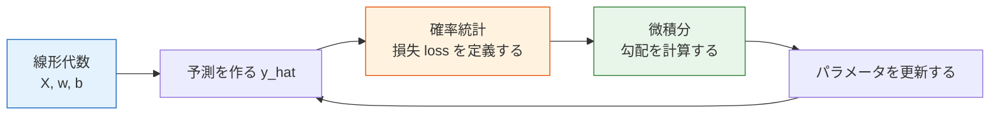
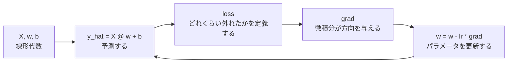

# 5.1.4 数学はいかにして機械学習へつながるのか


:::tip この節の位置づけ
これは新しい数学の授業でも、具体的なアルゴリズムの授業でもありません。役割はただ一つです。第 4 章で学んだ数学を、第 5 章の機械学習モデリングの流れに本当に接続することです。
:::

## 学習目標

- 線形代数、確率統計、微積分が機械学習の中でそれぞれ何を担当するのかを理解する
- 「データ行列 -> 予測 -> 損失 -> 勾配 -> 更新」という統一した見方を身につける
- 数学、コード、モデルを別々のものとして考えなくなる
- この先の線形回帰、ロジスティック回帰、評価、最適化への橋渡しをする

---

## 初学者はまず押さえる / 経験者はさらに深く理解する

もしあなたが初学者なら、この節ではまず主な流れをつかみましょう。線形代数はデータとパラメータをベクトル / 行列で表すため、確率統計は不確実性を表現し損失を定義するため、微積分はパラメータをどちらの方向に修正すべきかを教えるために使われます。

すでに経験があるなら、これらの数学的対象が実際の学習ループの中でコードにどう対応するかに注目できます。`X @ w + b` は予測、`loss` は目標、`grad` は更新の方向、`lr` は一歩の大きさです。

---

## まずは地図を作ろう

### まずは物語で理解する：機械学習は「学習するタピオカ店」を開くようなもの

たとえばタピオカ店を開いて、飲み物の売上を予測したいとします。気温、週末かどうか、価格、キャンペーンの有無などを記録します。これらの記録が特徴量です。過去の売上を使って予測が合っているかを判断します。これが損失です。予測のずれに応じて、それぞれの要素の重要度を調整します。これがパラメータ更新です。

線形代数は毎日の記録を表に整理するのを助け、確率統計は予測の不確かさや誤差の大きさを考えるのを助け、微積分は各パラメータをどの方向に調整すべきかを教えてくれます。機械学習は突然現れた魔法ではなく、これらの数学ツールが同じ学習パイプラインの中で役割分担しているものです。

多くの初学者は第 4 章を学んだあと、第 5 章に入ると別の授業に変わったように感じます。  
その原因は、数学を学んでいないことではなく、数学の対象とモデリングの動作を結びつけられていないことがほとんどです。

より安定した理解のしかたは、まずこの図を覚えることです。


この図を先につかんでおけば、あとで式を見ても慌てにくくなります。なぜなら、次のことが分かるからです。

- その式がどの数学の主線に属するのか
- モデリングの流れの中で何を担当しているのか

---

## 一、線形代数：データとパラメータを整理する

第 4 章ではすでに次のものを見ました。

- ベクトル
- 行列
- 行列積
- 線形変換

機械学習では、これらの最も直接的な用途は次の通りです。

- ベクトルで 1 件のサンプルを表す
- 行列で複数のサンプルを表す
- パラメータベクトルで、モデルが学習する重みを表す

### なぜ 1 件のサンプルをベクトルで表すのか？

たとえば、ある家を次の特徴で表すとします。

- 面積
- 部屋数
- 階数

この場合、次のようなベクトルで表せます。

> `x = [120, 3, 15]`

これはかっこよく書くためではなく、モデルがさまざまな特徴を統一的に扱えるようにするためです。

### なぜ複数のサンプルを行列で表すのか？

たくさんの家があるときは、それらを行列 `X` にまとめます。

```python
import numpy as np

# 3 つのサンプル、3 つの特徴
X = np.array([
    [120.0, 3.0, 15.0],
    [80.0,  2.0,  8.0],
    [150.0, 4.0, 20.0],
])

print("X の形状:", X.shape)
print(X)
```

期待される出力：

```text
X の形状: (3, 3)
[[120.   3.  15.]
 [ 80.   2.   8.]
 [150.   4.  20.]]
```

このとき：

- 行 = サンプル
- 列 = 特徴量

だからこそ、後で `sklearn` で `X.shape = (n_samples, n_features)` をよく見るのです。

### なぜパラメータもベクトルで表すのか？

モデルが各特徴量に重みを持つなら、パラメータもベクトルで表せます。

```python
w = np.array([2.5, 30.0, 2.0])  # 各特徴量に 1 つずつの重み
b = 50.0                        # 切片

pred = X @ w + b
print("予測値:", pred)
```

期待される出力：

```text
予測値: [470. 326. 585.]
```

ここで重要なのはコードそのものではなく、次のことに気づくことです。

- `X` はデータ
- `w` はモデルが学習するパラメータ
- `X @ w + b` は、「特徴量の影響」を合計して予測を作るということ

:::info 記号をほどく
`X @ w` は Python での行列積です。`@` は機械学習専用の特別な魔法ではなく、特徴量行列と重みベクトルを掛ける演算子です。`b` は切片で、すべての予測に足される基準値のように考えられます。
:::

### 線形代数は第 5 章のどこで出てくるのか？

| 数学の対象 | 第 5 章ではどこに出てくるか |
|---|---|
| ベクトル | 1 件のサンプルの特徴表現 |
| 行列 | すべての学習データ `X` |
| 行列積 | 線形回帰、ロジスティック回帰、PCA |
| 固有値 / 固有ベクトル | PCA の次元削減 |

つまり、機械学習における線形代数の最重要な役割は、計算式を導くことそのものではなく、

> **データとモデルパラメータに、統一された計算可能な表現を与えること**

です。

---

## 二、確率統計：不確実性を表し、良し悪しを定義する

線形代数が「物をきれいに並べる」役割だとすると、確率統計の役割は次の通りです。

- モデル出力の信頼度をどう表すか
- 予測の誤差をどう定義するか
- モデルが本当に良いのかをどう評価するか

### なぜロジスティック回帰は確率を出力するのか？

線形回帰では連続値を予測します。  
しかし分類では、私たちがもっと知りたいのは次のことです。

- このサンプルが正例である確率はどのくらいか？

最小例はこう考えられます。

```python
import numpy as np

z = np.array([-2.0, -0.5, 0.0, 1.0, 3.0])
prob = 1 / (1 + np.exp(-z))

print("線形スコア z:", z)
print("確率出力:", np.round(prob, 4))
```

期待される出力：

```text
線形スコア z: [-2.  -0.5  0.   1.   3. ]
確率出力: [0.1192 0.3775 0.5    0.7311 0.9526]
```

ここでの `prob` は、「線形スコア」を `0~1` の範囲に押し込めたものです。  
つまり、確率統計の役割は次のように理解できます。

- モデル出力を「解釈しやすい不確実性」に変える

`z` は分類では logit と呼ばれることがあります。確率に変換する前の生のスコアです。Sigmoid 関数は、どんな実数も 0 から 1 の間に押し込む柔らかいゲートのようなものです。

### なぜ損失関数は確率と関係するのか？

教師あり学習では、モデルの予測がどれくらい良いかを判断する必要があります。  
ここで確率統計は次の 2 つの場面に入ってきます。

- 回帰では：誤差分布を通して `MSE / MAE` を理解することが多い
- 分類では：確率の視点から交差エントロピーを理解することが多い

とても素朴に言えば、次のようになります。

- 予測が真の値に近いほど、損失は小さい
- 正しいクラスにより確信があるほど、分類損失は小さい

### 確率統計は第 5 章のどこで出てくるのか？

| 確率統計の概念 | 第 5 章ではどこに出てくるか |
|---|---|
| 確率出力 | ロジスティック回帰、分類閾値 |
| 分布とばらつき | データ分析、異常検知 |
| 平均 / 分散 | 標準化、バイアス-バリアンスのトレードオフ |
| 統計的評価 | 指標、交差検証、実験比較 |

したがって、機械学習における確率統計の最重要な仕事は、単に「確率を計算すること」ではなく、

> **不確実性を表し、損失を定義し、モデルを比較すること**

です。

---

## 三、微積分：パラメータをどちらへ修正すべきかを教える

ここまでで次の 2 つは解決しました。

- データをどう表すか
- 結果をどう評価するか

でも、モデルにはまだ最後の一歩が必要です。

- 結果がよくないとき、パラメータをどう直すのか？

ここで微積分の出番です。

### 勾配降下法のいちばん素朴な意味は？

公式を覚える前に、まずこの一文を覚えましょう。

> **損失が大きいなら、損失が小さくなる方向へ、パラメータを少しずつ動かす。**

これが勾配降下法の中心となる直感です。

### 最小の勾配降下法の実行例

次の例は、ただ 1 つのことだけをします。  
もっとも単純な線形関係 `y = wx + b` を使って、パラメータが少しずつ学習される様子を見ることです。


コードを見る前に、まず図を読んでください。各ループでは、まず予測し、どれくらい外れたかを測り、改善方向を計算し、最後に `w` と `b` を少しだけ動かします。下の NumPy コードは、この図をプログラムとして書いたものです。

```python
import numpy as np

x = np.array([1.0, 2.0, 3.0, 4.0, 5.0])
y = np.array([3.2, 5.1, 7.0, 8.9, 11.1])  # おおよそ 2x + 1 に近い

w = 0.0
b = 0.0
lr = 0.05

for epoch in range(200):
    y_pred = w * x + b
    loss = np.mean((y - y_pred) ** 2)

    dw = -2 * np.mean(x * (y - y_pred))
    db = -2 * np.mean(y - y_pred)

    w -= lr * dw
    b -= lr * db

print("学習された w:", round(w, 4))
print("学習された b:", round(b, 4))
print("最終損失:", round(loss, 6))
```

期待される出力：

```text
学習された w: 1.9654
学習された b: 1.1604
最終損失: 0.007272
```

この例でいちばん大事なのは公式そのものではなく、次の 4 ステップです。

1. まず予測する
2. 次に損失を計算する
3. 次に勾配を計算する
4. 最後にパラメータを更新する

この 4 ステップが、後で出てくる深層学習の学習ループの原型です。

`lr` は learning rate、つまり学習率です。1 回の更新でどれくらい大きく進むかを決めます。小さすぎると学習が遅くなり、大きすぎると良い地点を飛び越えて損失が不安定になることがあります。

### 微積分は第 5 章のどこで出てくるのか？

| 微積分の概念 | 第 5 章ではどこに出てくるか |
|---|---|
| 導関数 | 線形回帰の最適化 |
| 勾配 | 勾配降下法によるパラメータ更新 |
| 連鎖律 | ここではまだ軽く触れる程度、第 6 章でより重要になる |
| 最適化 | パラメータ調整、学習、損失の低下 |

したがって、この段階での微積分の最重要な役割は、

> **「モデルを良くする」を、計算可能で実行可能な更新プロセスに変えること**

です。

---

## 四、この 3 本の線を本当にまとめる

1 回の最小限の機械学習学習は、実は次のステップに分けられます。


この図は上から下へ読んでください。表が `X` になり、つまみが `w` になり、予測と正解の差が `loss` になり、坂を下る道が勾配降下法になります。上のコードと同じ話を、学習ループとして描いたものです。



これを一番大事な日常語にすると、次の一文になります。

> **まずデータとパラメータを整理し、次に「良いか悪いか」を決め、そして勾配に従ってパラメータを少しずつより良い方向へ押していく。**

これが、第 4 章の数学が第 5 章の機械学習へ本当に流れ込む方法です。

---

## 五、初心者向けの「式の読み方」

この先の第 5 章では、式をどんどん目にすることになります。  
初学者が一番怖いのは、最初からそれらを見慣れない記号の塊として見てしまうことです。

より安定した読み方は、毎回次の 4 つに分けて考えることです。

1. ここでの `X`、`x`、`w`、`b` は誰か？
2. これは予測をしているのか、損失を計算しているのか？
3. これは確率 / 統計量なのか、それとも勾配 / 更新量なのか？
4. このステップは学習の流れのどこにあるのか？

こう分解していけば、式はだんだん「記号の壁」ではなく「流れを表す言葉」のように見えてきます。

---

## 六、よくあるミス：数学の概念をバラバラに覚えること

多くの初学者は、行列、確率、勾配をそれぞれ別々に覚えます。  
でも機械学習のコードを見ると、どうつながるのか分からなくなります。原因はたいてい、それらを同じ学習ループの中に置いていないからです。



だから今後は、式を見たらまず「この式は難しいか？」と考えるのではなく、先に「このループのどのステップか？」を考えましょう。

---

## 七、この節の学習の締めくくり

この節を学び終えたら、次の表で本当に機械学習の主線につながっているか確認できます。

| レベル | できるようになっていてほしいこと |
|---|---|
| 直感 | 線形代数、確率統計、微積分が機械学習の中で何を担当するかを説明できる |
| コード | `X @ w + b`、`loss`、`grad`、`w -= lr * grad` がそれぞれ何をしているか読める |
| 式 | 1 つの式を、データ、パラメータ、予測、損失、更新に分解できる |
| その先への接続 | なぜ線形回帰、ロジスティック回帰、ニューラルネットワークでこの学習ループが何度も出てくるのか分かる |

---
## 八、この節でいちばん持ち帰ってほしいこと

1 つだけ持ち帰るなら、これを覚えてください。

> **第 4 章の数学は、第 5 章の前提荷物ではなく、第 5 章のすべてのモデリング動作の背後にある言語です。**

この節で本当に得てほしいものは次の通りです。

- 行列を見たら、データとパラメータがどう整理されているかを思い浮かべる
- 確率と損失を見たら、モデルの良し悪しがどう定義されるかを思い浮かべる
- 勾配を見たら、パラメータがどう更新されるかを思い浮かべる
- 数学、コード、モデルを別々のものとして見なくなる

:::info 次にどう学ぶとスムーズか
このページを読み終えたら、次に続けて学ぶのがおすすめです。

1. [5.1.3 Scikit-learn フレームワーク入門](./02-sklearn-intro.md)
2. [5.2.2 線形回帰](../ch02-supervised/01-linear-regression.md)
3. [5.4.2 評価指標](../ch04-evaluation/01-metrics.md)

そうすると、「数学が本当にモデルの中で働き始めた」と最も実感しやすくなります。
:::
