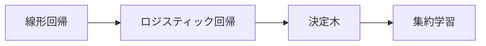

# 学習ガイド：この章の監督学習では何を学ぶのか

この章は、5 機械学習入門から実践までの中心になる部分です。ここで学ぶのは、次のことです。

> **手元にラベル付きデータがあるとき、どうやって予測できるモデルを学習するか。**

## まずは地図を作ろう

この章は、最も学びやすい形だと「1つのモデルを学んだら、次のモデルへ進む」という流れになりがちです。  
でも、より安定した理解のしかたは、まずこれを1本の段階的な主線として見ることです。

「シンプルなものから複雑なものへ、単体モデルから複数モデルへ」という流れをつかめると、この章はかなり理解しやすくなります。

## この章の学習順序がこのようになっている理由

この流れには段階があります。

- 線形回帰：まずは最もシンプルな連続値予測を学ぶ
- ロジスティック回帰：次に、最も基本的な分類モデルを学ぶ
- 決定木：さらに、非線形性やルールによる分割を見る
- 集約学習：最後に、複数の弱いモデルを組み合わせて、より強いモデルにする方法を学ぶ
- SVM：補助的に、定番の最大マージンの考え方を学び、「境界はサンプルから少し離れていたほうがよい」という汎化の直感をつかむ

## 新人におすすめの読み方

これを「4つの独立したアルゴリズムの説明」として読むのではなく、次の4つの問いとして読むのがおすすめです。

1. 関係がだいたい線形なら、まずは最もシンプルなモデルで解けるか？
2. タスクが分類になったら、線形の考え方はまだ使えるか？
3. 関係が明らかに非線形なら、ルールによる切り分けに変えられるか？
4. 分類境界をより安定させたいなら、両側のサンプルとの安全距離を最大化できるか？
5. 単体モデルでは不安定、または弱いなら、たくさんのモデルを組み合わせられるか？

こう考えると、単にモデル名を覚えるよりも、全体像をつかみやすくなります。

## この章を学ぶときに身につけたい習慣

- 1つのモデルを学ぶたびに、それがどんなタスクに向いているかを考える
- 1つのモデルを学ぶたびに、どんなデータで失敗しやすいかを考える
- 1つのモデルを学ぶたびに、前のモデルと比べて何を新しく解決したのかを考える

こうすると、学びが「道具の一覧」ではなく、「モデルを選ぶ判断の流れ」になります。

## この章で新人がいちばん持ち帰るべきこと

- 回帰と分類は別の種類のタスクだと分かる
- 線形モデルと木モデルの違いが分かる
- 集約学習がなぜ強いことが多いのかが分かる
- モデルの精度が悪いとき、原因はアルゴリズムの弱さだけでなく、データや特徴量の処理不足かもしれないと分かる

## この章を学び終えたら、自分で答えられるようになること

- なぜ線形回帰が出発点なのか
- なぜロジスティック回帰は「回帰」という名前なのに分類モデルなのか
- なぜ木モデルはより柔軟で、同時に過学習しやすいのか
- なぜ表形式データのタスクでは、集約木モデルが特に強いことが多いのか

## 新人はどう読むか、上級者はどう読むか

新人がこの章を初めて学ぶときは、まず主線と最小実行例をつかみましょう。すべての細部を一度に理解する必要はありません。まずは、この章が何を解決するのか、入力と出力は何か、最小プロジェクトをどう動かすかを説明できれば十分です。

経験のある学習者は、この章を「抜けの確認」と「実装練習」として読むとよいでしょう。境界条件、失敗例、評価方法、コードの再現性、前後の章とのつながりに注目してください。読み終えたら、内容を自分の作品の README や実験記録にまとめておくのがおすすめです。

## 学習時間と難易度の目安

| 学び方 | 目安時間 | 目標 |
|---|---|---|
| ざっと読む | 20～30 分 | この章が何を解決するのかを理解し、後でどこで使うかを知る |
| 最小クリア | 1～2 時間 | 最小例を動かし、この章の小プロジェクトの出口まで到達する |
| じっくり練習 | 半日～1 日 | エラー分析、比較実験、またはプロジェクト README の記録を追加する |

## この章の自己チェック問題

| 自己チェック問題 | 合格基準 |
|---|---|
| この章は何を解決するのか？ | コース全体の中での位置を一文で説明できる |
| 最小の入力と出力は何か？ | 例に何が必要で、どんな結果が出るかを説明できる |
| よくある失敗ポイントはどこか？ | エラー、精度の悪さ、理解のズレの原因を少なくとも1つ挙げられる |
| 学び終えた後、何を残せるか？ | この章の成果をプロジェクト README、実験記録、または作品集に書ける |

## この章の小プロジェクトの出口

この章を学び終えたら、最小演習を1つやってみましょう。本章で最も重要な概念またはツールを1つ選び、動かせて、スクリーンショットを残せて、README に書ける小さな成果物を作ります。複雑である必要はありませんが、入力・処理・出力が何かを説明できることが大切です。

## 合格基準

この章の終わりには、自分の言葉で「この章は何を解決するのか」「前後の学習ポイントとどうつながるのか」を説明でき、さらに本章の小プロジェクトの出口を最小版で完成できるようになっているはずです。

さらに、よくあるエラーを1回記録し、1回デバッグの流れを残し、または1回結果改善の工夫を書けるなら、ただ「読んだだけ」ではなく、この章を自分のプロジェクト経験に変えられていると言えます。
