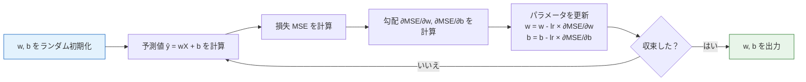
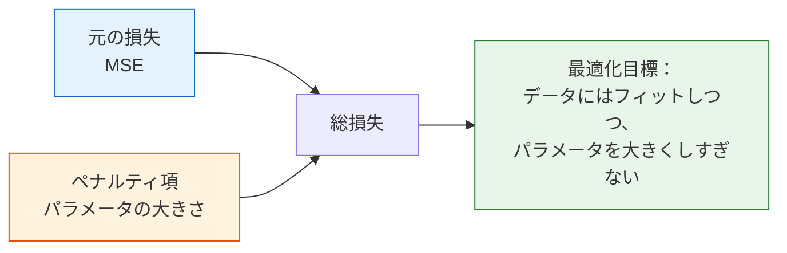
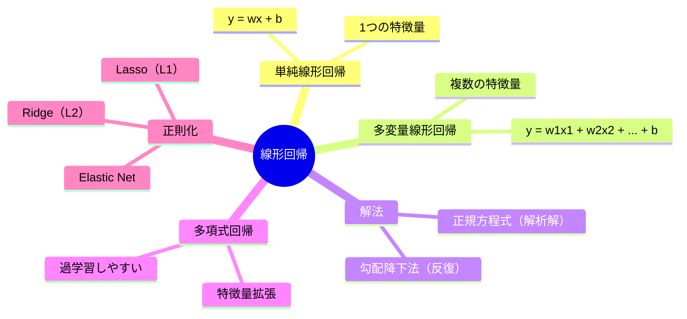

# 5.2.2 線形回帰


:::tip この節の位置づけ
線形回帰は**最もシンプルで、かつ最も重要**な機械学習アルゴリズムです。後続のすべてのアルゴリズムを理解するための土台であり、ロジスティック回帰、ニューラルネットワーク、さらには GPT の内部にもその考え方が見えます。
:::

## 学習目標

- 単純線形回帰と多変量線形回帰を理解する
- 最小二乗法と正規方程式を理解する
- 勾配降下法による解法を理解する（第 4 ステーションとつながる）
- 多項式回帰と過学習を理解する
- 正則化（Ridge、Lasso、Elastic Net）を理解する

## まず、とても大事な学習の期待値をお伝えします

この節は長く、新人の方は「一度にたくさん覚えないといけない」と感じやすいです。

- 回帰タスク
- 損失関数
- 正規方程式
- 勾配降下
- 多項式回帰
- 正則化

でも、新人の最初の目標は実はひとつだけです。

> **まず「1つの機械学習モデルが、タスク定義から損失、解法、評価、改善へどう進むのか」という主線をつかむこと。**

この流れがつかめると、あとで学ぶロジスティック回帰、ニューラルネットワーク、もっと複雑なモデルもかなり理解しやすくなります。

---

## まずは地図を作ろう

初めて線形回帰を学ぶと、起きやすいのは次の 2 パターンです。

- 数式は書けるが、各ステップが何を解いているのか分からない
- `LinearRegression()` は呼べるが、なぜまず baseline を作るのか、なぜ残差を見るのか、なぜ正則化で過学習を防げるのか分からない

より安定した理解の順番は次のとおりです。


数式に入る前に、この漫画を読んでください。直線は調整できる定規、残差は点から直線までの縦の距離、MSE はその距離を学習目標に変えるもの、正則化は柔軟すぎるモデルが曲がりすぎないようにするブレーキです。

この線を先につかめば、以後の数式も「何のための式か」が見えやすくなります。

:::tip 先に実行環境を準備する
この節では `numpy`、`matplotlib`、`pandas`、`scikit-learn` を使います。新しい環境なら、まずプロジェクトルートで `python -m pip install -r requirements-course-core.txt` を実行してください。`pandas` は、下の多変量回帰例で表形式データを扱うためのライブラリです。
:::

---

## 一、単純線形回帰

### 直感：最適な直線を見つける

**問題**：家の面積と価格のデータがあるとき、新しい面積に対する価格を予測できるか？

```python
import numpy as np
import matplotlib.pyplot as plt

# 模擬データ：面積 → 価格
rng = np.random.default_rng(seed=42)
X = rng.uniform(50, 200, 30)    # 面積（平方メートル）
y = 2.5 * X + 50 + rng.normal(size=30) * 30  # 価格（万元）

plt.figure(figsize=(8, 5))
plt.scatter(X, y, color='steelblue', s=50, alpha=0.7)
plt.xlabel('面積（平方メートル）')
plt.ylabel('価格（万元）')
plt.title('家の面積 vs 価格')
plt.grid(True, alpha=0.3)
plt.show()
```

**目標**：直線 `y = wx + b` を見つけて、その線ができるだけすべてのデータ点に「近く」なるようにすること。

- **w**（weight）= 傾き = 面積が 1 平方メートル増えたとき、価格がどれだけ増えるか
- **b**（bias）= 切片 = 面積が 0 のときの基準価格

### この 2 つのパラメータは何を制御しているのか？

この直線は、動かしたり回転させたりできる棒のようなものだと考えられます。

- `w` は棒の傾きを決める
- `b` は棒全体を上に動かすか、下に動かすかを決める

つまり、線形回帰の学習の本質は、この 2 つを少しずつ調整して、直線をデータ点にできるだけ近づけることです。

### 新人向けのたとえ

線形回帰は、まず次のように考えると分かりやすいです。

- 手元に、回転も上下移動もできる定規がある
- その定規を、目の前の点の集まりにできるだけ近づけたい

ここで最初に覚えるべきなのは数式ではなく、次の点です。

- `w` は定規の傾きを決める
- `b` は定規全体を上げるか下げるかを決める
- 学習とは、この 2 つのつまみを何度も微調整すること

:::info まず 1 つだけ覚えよう
線形回帰は「公式を暗記する」ものではなく、**入力の変化と出力の変化の関係を、できるだけ安定したルールとして表す** ことを目指すものです。
:::

### 「最適」とは何か？——損失関数

「近い」を数学的に定義する必要があります。ここでは**平均二乗誤差（MSE）**を使います。

> **MSE = (1/n) × Σ(yi - ŷi)²**

ここで `ŷi = w×xi + b` はモデルの予測値です。

**直感**：各データ点の誤差を二乗してから平均します。MSE が小さいほど、フィットが良いということです。

### なぜ誤差をまず二乗するのか？

これはとても大事です。何を罰するのかがここで決まります。

- 二乗すると必ず正になるので、正負の誤差が打ち消し合わない
- 大きな誤差はより強く大きくなるので、極端に外れた点をより強く修正しようとする
- 二乗の形は微分しやすく、解析解や勾配降下法の式を作りやすい

ただし、副作用もあります。

- データに極端な外れ値があると、MSE はそれらに強く引っ張られます

新人の方が最初に回帰をやるときは、次のように覚えておくとよいです。

- まずは `MSE / RMSE` を基本にする
- 外れ値が多そうなら `MAE` も見る

### 回帰指標のキーワードを先にほどく

| 用語 | 意味 | なぜ重要か |
|---|---|---|
| `baseline` | 最初に作るシンプルな比較モデル | 出発点がないと、後のモデルが本当に良くなったか判断しにくい |
| `residual` | `正解値 - 予測値`、残差 | 残差プロットは、1 つのスコアでは見えないパターンを見せてくれる |
| `MSE` | Mean Squared Error、平均二乗誤差 | 大きな誤差を強く罰し、最適化目標としてよく使う |
| `RMSE` | Root Mean Squared Error、平方根平均二乗誤差 | MSE の平方根で、目的変数と同じ単位に戻る |
| `MAE` | Mean Absolute Error、平均絶対誤差 | 外れ値に支配されたくないときに比較的安定する |
| `R²` | モデルが目的変数の変動をどれだけ説明できるか | フィットの概要を見るには便利だが、診断の代わりにはならない |

```python
def mse_loss(y_true, y_pred):
    """平均二乗誤差"""
    return np.mean((y_true - y_pred) ** 2)

# いくつか違う直線を試す
fig, axes = plt.subplots(1, 3, figsize=(15, 4))
params = [(1.0, 100, '傾きが小さすぎる'), (2.5, 50, 'ちょうどよい'), (4.0, -50, '傾きが大きすぎる')]

for ax, (w, b, title) in zip(axes, params):
    y_pred = w * X + b
    loss = mse_loss(y, y_pred)
    ax.scatter(X, y, color='steelblue', s=30, alpha=0.7)
    x_line = np.linspace(40, 210, 100)
    ax.plot(x_line, w * x_line + b, 'r-', linewidth=2)
    ax.set_title(f'{title}\nw={w}, b={b}, MSE={loss:.0f}')
    ax.set_xlabel('面積')
    ax.set_ylabel('価格')
    ax.grid(True, alpha=0.3)

plt.tight_layout()
plt.show()
```

この例では、真ん中の線がたいてい最も小さい MSE になります。

```text
傾きが小さすぎる: MSE ≈ 28463
ちょうどよい: MSE ≈ 575
傾きが大きすぎる: MSE ≈ 14502
```

---

## 二、解法 1：正規方程式（解析解）

### 式

線形回帰の MSE には**閉形式解**があります。

> **w = (Xᵀ X)⁻¹ Xᵀ y**

これが**正規方程式（Normal Equation）**です。

### 手動実装

```python
# データを準備（切片列を追加）
X_b = np.c_[np.ones(len(X)), X]  # X の前に 1 の列を追加（切片 b に対応）
print(f"X_b の形状: {X_b.shape}")  # (30, 2)

# 正規方程式で解く
w = np.linalg.inv(X_b.T @ X_b) @ X_b.T @ y
b_fit, w_fit = w[0], w[1]
print(f"切片 b = {b_fit:.2f}")
print(f"傾き w = {w_fit:.2f}")

# 可視化
plt.figure(figsize=(8, 5))
plt.scatter(X, y, color='steelblue', s=50, alpha=0.7, label='データ点')
x_line = np.linspace(40, 210, 100)
plt.plot(x_line, w_fit * x_line + b_fit, 'r-', linewidth=2,
         label=f'フィット直線: y = {w_fit:.2f}x + {b_fit:.2f}')
plt.xlabel('面積（平方メートル）')
plt.ylabel('価格（万元）')
plt.title('正規方程式による線形回帰の解法')
plt.legend()
plt.grid(True, alpha=0.3)
plt.show()
```

期待される出力：

```text
X_b の形状: (30, 2)
切片 b = 57.36
傾き w = 2.47
```

### 正規方程式の長所と短所

| 長所 | 短所 |
|------|------|
| 反復なしで直接答えが出る | 行列の逆行列計算が必要で、計算量は O(n³) |
| 学習率を調整する必要がない | 特徴量が多いと非常に遅い |
| 必ず大域最適に到達する | 特徴数 > サンプル数 の場合は使えない |

### どんなときに正規方程式を優先して考えるか？

正規方程式は「直接答えを計算する」方法だと考えるとよいです。特に次のような場面に向いています。

- 特徴量が少ない
- データ規模が小さい
- 線形関係があるかを素早く確認したい

最初の小さな回帰 baseline を作るときは、正規方程式か `sklearn` の線形回帰がちょうどよいことが多いです。  
ただし、次のような場面では、勾配降下法の考え方に自然に切り替える必要があります。

- 特徴量の次元が多い
- データ規模が明らかに大きい
- のちにニューラルネットワークの学習にもつなげたい
- 「答えを 1 回で出す」より、「統一された学習フレームワークに乗せたい」

---

## 三、解法 2：勾配降下法


正規方程式と勾配降下法は、別々の問題を解いているわけではありません。どちらも同じ MSE の最小点へ向かう方法です。正規方程式は特徴量が少ないときに直接答えを計算する方法で、勾配降下法は一歩ずつ答えへ近づく方法です。データや特徴量が大きくなったり、後でニューラルネットワークの学習につなげたりする場合は、勾配降下法の考え方がより自然になります。特徴量スケーリングは、この反復の道をずっと安全にしてくれます。

### 第 4 ステーションとのつながり

第 4 ステーションの微積分の章で、勾配降下法の原理を学びました。ここではそれを線形回帰に適用します。



### まずは勾配の式を暗記する前に、何を表しているかを見る

勾配降下法の本質は、「たくさん公式があること」ではありません。次の流れです。

- 今のパラメータで 1 回予測する
- 予測と正解の差を見る
- どちらの方向にパラメータを動かすべきか判断する
- 少しだけ動かす
- これを何度も繰り返す

この 5 ステップが分かると、`dw` や `db` はただの記号ではなくなります。

- `dw` は「傾きをどちらに調整すべきか」を示す
- `db` は「直線全体を上げるか下げるか」を示す

### 勾配の導出

MSE の w と b に対する勾配は次のとおりです。

> **∂MSE/∂w = -(2/n) × Σ xi(yi - ŷi)**
>
> **∂MSE/∂b = -(2/n) × Σ (yi - ŷi)**

### ゼロから実装する

```python
# 勾配降下法で線形回帰を解く

# パラメータ初期化
w_gd = 0.0
b_gd = 0.0
lr = 0.00005   # 学習率（注意：特徴値が大きいと学習率は小さくする必要がある）
epochs = 500

# 学習過程を記録
history = {'loss': [], 'w': [], 'b': []}

for epoch in range(epochs):
    # 順伝播：予測
    y_pred = w_gd * X + b_gd

    # 損失を計算
    loss = mse_loss(y, y_pred)

    # 勾配を計算
    dw = -2 * np.mean(X * (y - y_pred))
    db = -2 * np.mean(y - y_pred)

    # パラメータ更新
    w_gd -= lr * dw
    b_gd -= lr * db

    history['loss'].append(loss)
    history['w'].append(w_gd)
    history['b'].append(b_gd)

print(f"勾配降下法の結果: w = {w_gd:.2f}, b = {b_gd:.2f}")
print(f"正規方程式の結果: w = {w_fit:.2f}, b = {b_fit:.2f}")

# 学習過程を可視化
fig, axes = plt.subplots(1, 3, figsize=(15, 4))

axes[0].plot(history['loss'])
axes[0].set_title('損失曲線')
axes[0].set_xlabel('Epoch')
axes[0].set_ylabel('MSE')
axes[0].set_yscale('log')

axes[1].plot(history['w'], label='w')
axes[1].axhline(y=w_fit, color='r', linestyle='--', label=f'最適 w={w_fit:.2f}')
axes[1].set_title('w の収束過程')
axes[1].legend()

axes[2].plot(history['b'], label='b')
axes[2].axhline(y=b_fit, color='r', linestyle='--', label=f'最適 b={b_fit:.2f}')
axes[2].set_title('b の収束過程')
axes[2].legend()

for ax in axes:
    ax.grid(True, alpha=0.3)

plt.tight_layout()
plt.show()
```

期待される出力：

```text
勾配降下法の結果: w = 2.86, b = 0.29
正規方程式の結果: w = 2.47, b = 57.36
```

この簡単な勾配降下法のデモは、まだ正規方程式の結果に完全には一致していません。`X` の値が大きく、学習率をわざと小さくしているからです。これは学習用の選択です。まず更新ループを安全に見るためで、実務では勾配降下の前に特徴量を標準化するのが基本です。

### より安定した版：先に標準化してから勾配降下法を使う

次のコードは同じデータを使いますが、先に `X` を標準化します。学習後にパラメータを元の尺度へ戻すと、正規方程式の結果と一致します。

```python
X_mean = X.mean()
X_std = X.std()
X_scaled = (X - X_mean) / X_std

w_scaled = 0.0
b_scaled = 0.0
lr = 0.1
epochs = 1000

for epoch in range(epochs):
    y_pred = w_scaled * X_scaled + b_scaled
    loss = mse_loss(y, y_pred)

    dw = -2 * np.mean(X_scaled * (y - y_pred))
    db = -2 * np.mean(y - y_pred)

    w_scaled -= lr * dw
    b_scaled -= lr * db

# y = w_scaled * ((x - mean) / std) + b_scaled を y = w*x + b に戻す
w_original = w_scaled / X_std
b_original = b_scaled - w_scaled * X_mean / X_std

print(f"標準化後の勾配降下法: w = {w_original:.2f}, b = {b_original:.2f}, loss = {loss:.2f}")
```

期待される出力：

```text
標準化後の勾配降下法: w = 2.47, b = 57.36, loss = 561.73
```

これはとても大切な経験則です。勾配降下法が不安定に見えたり、極端に遅く見えたりするとき、まず疑うべきなのは勾配降下法そのものではなく、特徴量のスケールであることが多いです。

---

## 四、多変量線形回帰

### 1 つの特徴量から複数の特徴量へ

実際の問題では、家の価格は面積だけでなく、部屋数、階数、駅までの距離などにも影響されます。

> **ŷ = w₁x₁ + w₂x₂ + ... + wpxp + b = wᵀx + b**

### 多変量線形回帰で本当に変わるのは何か？

初めて多変量線形回帰を見ると、「急にすごく複雑になった」と感じやすいです。  
でも本質的には問題が変わったわけではありません。変わるのは、次の点だけです。

- 「1 つの入力が出力を決める」から
- 「複数の入力が一緒に線形に出力へ寄与する」へ変わる

本当に重要な変化は 2 つです。

- パラメータが 1 つの `w` から `w1, w2, ..., wp` の集合になる
- 特徴量スケール、共線性、特徴量の解釈をきちんと考える必要が出てくる

つまり、多変量線形回帰は別のアルゴリズムではなく、線形回帰が実データに入ったときの自然な姿です。

### Scikit-learn で実装する

```python
from sklearn.linear_model import LinearRegression
from sklearn.model_selection import train_test_split
from sklearn.metrics import mean_squared_error, r2_score
import pandas as pd

# 多特徴量の家賃データを模擬する
rng = np.random.default_rng(seed=42)
n = 200
data = pd.DataFrame({
    '面積': rng.uniform(50, 200, n),
    '部屋数': rng.integers(1, 6, n),
    '階数': rng.integers(1, 30, n),
    '駅までの距離(km)': rng.uniform(0.1, 5, n),
})
# 真の関係 + ノイズ
data['価格'] = (2.5 * data['面積']
               + 30 * data['部屋数']
               + 2 * data['階数']
               - 20 * data['駅までの距離(km)']
               + 50
               + rng.normal(size=n) * 30)

print(data.head())
print(f"\nデータ形状: {data.shape}")

# データ準備
X = data[['面積', '部屋数', '階数', '駅までの距離(km)']].values
y = data['価格'].values

X_train, X_test, y_train, y_test = train_test_split(X, y, test_size=0.2, random_state=42)

# モデルを学習
model = LinearRegression()
model.fit(X_train, y_train)

# 学習したパラメータを見る
print("\nモデルパラメータ:")
for name, coef in zip(['面積', '部屋数', '階数', '駅までの距離(km)'], model.coef_):
    print(f"  {name}: {coef:.2f}")
print(f"  切片: {model.intercept_:.2f}")

# 評価
y_pred = model.predict(X_test)
print(f"\nMSE: {mean_squared_error(y_test, y_pred):.2f}")
print(f"R² Score: {r2_score(y_test, y_pred):.4f}")
```

期待される出力はおおよそ次のようになります。

```text
データ形状: (200, 5)

モデルパラメータ:
  面積: 2.52
  部屋数: 31.38
  階数: 1.78
  駅までの距離(km): -21.83
  切片: 48.11

MSE: 860.36
R² Score: 0.9328
```

### R² スコア

R² は回帰モデルで最もよく使われる評価指標です。

> **R² = 1 - Σ(yi - ŷi)² / Σ(yi - ȳ)²**

| R² 値 | 意味 |
|-------|------|
| 1.0 | 完璧にフィット |
| 0.8~1.0 | とても良いモデル |
| 0.5~0.8 | 普通のモデル |
| < 0.5 | あまり良くない |
| < 0 | 平均値で予測するより悪い |

```python
# 予測値と実測値を可視化
plt.figure(figsize=(6, 6))
plt.scatter(y_test, y_pred, alpha=0.6, s=30, color='steelblue')
plt.plot([y_test.min(), y_test.max()], [y_test.min(), y_test.max()],
         'r--', linewidth=2, label='完全予測線')
plt.xlabel('実際の価格')
plt.ylabel('予測価格')
plt.title(f'予測 vs 実際 (R² = {r2_score(y_test, y_pred):.4f})')
plt.legend()
plt.grid(True, alpha=0.3)
plt.axis('equal')
plt.tight_layout()
plt.show()
```

---

## 五、多項式回帰 —— データが直線ではないとき

### 問題：直線では足りない

```python
# 非線形データを生成
rng = np.random.default_rng(seed=42)
X_nl = np.linspace(-3, 3, 50)
y_nl = 0.5 * X_nl**2 - X_nl + 2 + rng.normal(size=50) * 0.8

# 線形回帰で無理やりフィット
lr = LinearRegression()
lr.fit(X_nl.reshape(-1, 1), y_nl)
y_pred_linear = lr.predict(X_nl.reshape(-1, 1))

plt.figure(figsize=(8, 5))
plt.scatter(X_nl, y_nl, color='steelblue', s=30, alpha=0.7)
plt.plot(X_nl, y_pred_linear, 'r-', linewidth=2, label='線形回帰（アンダーフィット）')
plt.title('直線では曲線データをうまく表せない')
plt.legend()
plt.grid(True, alpha=0.3)
plt.show()
```

### 多項式回帰

**考え方**：元の特徴量 `x` を `[x, x², x³, ...]` に拡張し、それでも線形回帰を使う。

```python
from sklearn.preprocessing import PolynomialFeatures

# 多項式特徴量を作る
poly = PolynomialFeatures(degree=2, include_bias=False)
X_poly = poly.fit_transform(X_nl.reshape(-1, 1))
print(f"元の特徴量: {X_nl[:3]}")
print(f"多項式特徴量:\n{X_poly[:3]}")  # [x, x²]

# 線形回帰で多項式特徴量をフィット
lr_poly = LinearRegression()
lr_poly.fit(X_poly, y_nl)
y_pred_poly = lr_poly.predict(X_poly)

plt.figure(figsize=(8, 5))
plt.scatter(X_nl, y_nl, color='steelblue', s=30, alpha=0.7)
plt.plot(X_nl, y_pred_linear, 'r--', linewidth=2, label='線形回帰')
plt.plot(X_nl, y_pred_poly, 'g-', linewidth=2, label='多項式回帰 (degree=2)')
plt.title('多項式回帰で曲線をフィットできる')
plt.legend()
plt.grid(True, alpha=0.3)
plt.show()
```

特徴量展開の期待出力：

```text
元の特徴量: [-3.         -2.87755102 -2.75510204]
多項式特徴量:
[[-3.          9.        ]
 [-2.87755102  8.28029988]
 [-2.75510204  7.59058726]]
```

### 多項式の次数と過学習

```python
fig, axes = plt.subplots(2, 3, figsize=(15, 9))

degrees = [1, 2, 3, 5, 10, 18]
x_smooth = np.linspace(-3.2, 3.2, 200)

for ax, deg in zip(axes.ravel(), degrees):
    poly = PolynomialFeatures(degree=deg, include_bias=False)
    X_p = poly.fit_transform(X_nl.reshape(-1, 1))
    X_s = poly.transform(x_smooth.reshape(-1, 1))

    lr = LinearRegression()
    lr.fit(X_p, y_nl)

    y_s = lr.predict(X_s)
    y_s = np.clip(y_s, -10, 20)  # 極端値を防ぐ

    train_score = lr.score(X_p, y_nl)

    ax.scatter(X_nl, y_nl, color='steelblue', s=20, alpha=0.6)
    ax.plot(x_smooth, y_s, 'r-', linewidth=2)
    ax.set_title(f'degree = {deg}, R² = {train_score:.3f}')
    ax.set_ylim(-5, 15)
    ax.grid(True, alpha=0.3)

plt.suptitle('多項式の次数と過学習', fontsize=14, y=1.02)
plt.tight_layout()
plt.show()
```

:::warning 過学習の警告
degree が高くなるほど、訓練データの R² は 1 に近づきますが、新しいデータでは性能が悪くなることがあります。これが**過学習**です。解決策は正則化です。
:::

### 多項式回帰で最も学びを間違えやすい点

新人の方がここでよく誤解しがちなのは、次の考え方です。

- 「曲線っぽくきれいにフィットできるほど、良いモデルだ」

でも本当に見るべきなのは、次です。

- 訓練データが良くなったあと、テストデータも良くなっているか？
- モデルが複雑になって、汎化能力が下がっていないか？

つまり、多項式回帰の教育的価値は「もっと曲がった線を描けること」ではなく、次の事実を非常に分かりやすく見せる点にあります。

- モデルが単純すぎるとアンダーフィットになる
- モデルが複雑すぎると過学習になる
- モデルの良し悪しは訓練データだけでは判断できない


数式に進む前に、まずこの図を上から下へ読んでください。多項式特徴量はモデルを柔軟にするアクセルで、正則化はノイズを追いかけすぎないようにするブレーキです。選ぶべきなのは、訓練データで一番きれいに見えるモデルではなく、検証データやテストデータでも安定するモデルです。

---

## 六、正則化 —— 過学習を防ぐ

### 正則化の考え方

正則化 = 損失関数に**ペナルティ項**を加えて、パラメータが大きくなりすぎるのを罰すること。



**直感**：大きなパラメータに罰を与える → モデルがシンプルになる → 過学習を減らせる。

正則化付きの線形モデルでは、特徴量のスケールがとても重要です。片方の特徴量だけ数値が大きいと、ペナルティが公平に働きません。そのため、下のコードでは `Pipeline(PolynomialFeatures -> StandardScaler -> Ridge/Lasso/ElasticNet)` を使います。

### 3 種類の正則化

| 方法 | ペナルティ項 | 効果 |
|------|--------|------|
| **Ridge（L2）** | `α × Σ(wi²)` | パラメータは小さくなるが 0 にはなりにくい |
| **Lasso（L1）** | `α × Σ|wi|` | 一部のパラメータが 0 になる（特徴選択） |
| **Elastic Net** | L1 + L2 の混合 | それぞれの長所を合わせ持つ |

### Ridge 回帰（L2 正則化）

```python
from sklearn.pipeline import make_pipeline
from sklearn.preprocessing import StandardScaler
from sklearn.linear_model import Ridge

# 高次多項式 + Ridge の比較
X_base = X_nl.reshape(-1, 1)
X_smooth_base = x_smooth.reshape(-1, 1)

fig, axes = plt.subplots(1, 3, figsize=(15, 4))
alphas = [0, 0.1, 10]
titles = ['正則化なし (α=0)', 'Ridge α=0.1', 'Ridge α=10']

for ax, alpha, title in zip(axes, alphas, titles):
    if alpha == 0:
        model = make_pipeline(
            PolynomialFeatures(degree=10, include_bias=False),
            StandardScaler(),
            LinearRegression()
        )
    else:
        model = make_pipeline(
            PolynomialFeatures(degree=10, include_bias=False),
            StandardScaler(),
            Ridge(alpha=alpha)
        )

    model.fit(X_base, y_nl)
    y_s = np.clip(model.predict(X_smooth_base), -10, 20)

    ax.scatter(X_nl, y_nl, color='steelblue', s=20, alpha=0.6)
    ax.plot(x_smooth, y_s, 'r-', linewidth=2)
    ax.set_title(title)
    ax.set_ylim(-5, 15)
    ax.grid(True, alpha=0.3)

plt.suptitle('Ridge 正則化の効果（degree=10）', fontsize=13)
plt.tight_layout()
plt.show()
```

### Lasso 回帰（L1 正則化）——自動特徴選択

```python
from sklearn.linear_model import Lasso

# Lasso は一部のパラメータを 0 にできる → 自動特徴選択
ridge = make_pipeline(
    PolynomialFeatures(degree=10, include_bias=False),
    StandardScaler(),
    Ridge(alpha=1.0)
)
ridge.fit(X_base, y_nl)

lasso = make_pipeline(
    PolynomialFeatures(degree=10, include_bias=False),
    StandardScaler(),
    Lasso(alpha=0.1, max_iter=20000)
)
lasso.fit(X_base, y_nl)

ridge_coef = ridge.named_steps["ridge"].coef_
lasso_coef = lasso.named_steps["lasso"].coef_

# パラメータを可視化
fig, axes = plt.subplots(1, 2, figsize=(12, 4))

axes[0].bar(range(len(ridge_coef)), np.abs(ridge_coef), color='steelblue')
axes[0].set_title('Ridge パラメータ（すべて非ゼロ）')
axes[0].set_xlabel('特徴量番号')
axes[0].set_ylabel('|パラメータ値|')

axes[1].bar(range(len(lasso_coef)), np.abs(lasso_coef), color='coral')
axes[1].set_title('Lasso パラメータ（一部が 0 → 特徴選択）')
axes[1].set_xlabel('特徴量番号')
axes[1].set_ylabel('|パラメータ値|')

for ax in axes:
    ax.grid(axis='y', alpha=0.3)

plt.tight_layout()
plt.show()

# Lasso がどの特徴を残したか確認
print("Lasso パラメータ:", np.round(lasso_coef, 4))
print(f"非ゼロパラメータ数: {np.sum(lasso_coef != 0)} / {len(lasso_coef)}")
```

期待される出力：

```text
Lasso パラメータ: [-1.5605  1.1533 -0.      0.1151 -0.      0.     -0.      0.     -0.      0.    ]
非ゼロパラメータ数: 3 / 10
```

### Elastic Net

```python
from sklearn.linear_model import ElasticNet

# Elastic Net = L1 + L2 の混合
# l1_ratio は L1 と L2 の比率を制御する（1.0 = 純 Lasso、0.0 = 純 Ridge）
en = make_pipeline(
    PolynomialFeatures(degree=10, include_bias=False),
    StandardScaler(),
    ElasticNet(alpha=0.1, l1_ratio=0.5, max_iter=20000)
)
en.fit(X_base, y_nl)
en_coef = en.named_steps["elasticnet"].coef_

print("Elastic Net パラメータ:", np.round(en_coef, 4))
print(f"非ゼロパラメータ数: {np.sum(en_coef != 0)} / {len(en_coef)}")
```

期待される出力：

```text
Elastic Net パラメータ: [-1.3582  0.8776 -0.2011  0.3548 -0.      0.0579 -0.      0.     -0.      0.    ]
非ゼロパラメータ数: 5 / 10
```

### 正則化の比較まとめ

| | Ridge（L2） | Lasso（L1） | Elastic Net |
|---|-----------|-----------|-------------|
| ペナルティ項 | `α × Σ(wi²)` | `α × Σ\|wi\|` | 2 つの加重和 |
| パラメータへの影響 | 小さくなるが 0 にはなりにくい | 一部が 0 になる | 一部が 0 になる |
| 適した場面 | すべての特徴が有用 | 不要な特徴が多い | 特徴が多く、相関もある |
| sklearn クラス | `Ridge` | `Lasso` | `ElasticNet` |

---

## 七、完全実践：糖尿病データセット

```python
from sklearn.datasets import load_diabetes
from sklearn.model_selection import train_test_split
from sklearn.linear_model import LinearRegression, Ridge, Lasso
from sklearn.preprocessing import StandardScaler
from sklearn.pipeline import make_pipeline
from sklearn.metrics import mean_squared_error, r2_score
import matplotlib.pyplot as plt

# データを読み込む
diabetes = load_diabetes()
X, y = diabetes.data, diabetes.target
print(f"データセット: {X.shape[0]} サンプル, {X.shape[1]} 特徴量")
print(f"特徴量名: {diabetes.feature_names}")

# データ分割
X_train, X_test, y_train, y_test = train_test_split(X, y, test_size=0.2, random_state=42)

# 複数モデルを比較
models = {
    "線形回帰": make_pipeline(StandardScaler(), LinearRegression()),
    "Ridge α=1": make_pipeline(StandardScaler(), Ridge(alpha=1.0)),
    "Ridge α=10": make_pipeline(StandardScaler(), Ridge(alpha=10.0)),
    "Lasso α=0.1": make_pipeline(StandardScaler(), Lasso(alpha=0.1, max_iter=10000)),
    "Lasso α=1": make_pipeline(StandardScaler(), Lasso(alpha=1.0, max_iter=10000)),
}

results = {}
for name, model in models.items():
    model.fit(X_train, y_train)
    y_pred = model.predict(X_test)
    mse = mean_squared_error(y_test, y_pred)
    r2 = r2_score(y_test, y_pred)
    results[name] = {'MSE': mse, 'R²': r2}
    print(f"{name:15s} | MSE: {mse:.1f} | R²: {r2:.4f}")

# R² を可視化
fig, ax = plt.subplots(figsize=(10, 5))
names = list(results.keys())
r2_scores = [v['R²'] for v in results.values()]
colors = ['steelblue', 'coral', 'coral', 'seagreen', 'seagreen']
bars = ax.bar(names, r2_scores, color=colors, alpha=0.8)

for bar, score in zip(bars, r2_scores):
    ax.text(bar.get_x() + bar.get_width()/2, bar.get_height() + 0.005,
            f'{score:.4f}', ha='center', fontsize=10)

ax.set_ylabel('R² Score')
ax.set_title('さまざまな正則化手法の比較（糖尿病データセット）')
ax.set_ylim(0, 0.6)
ax.grid(axis='y', alpha=0.3)
plt.xticks(rotation=15)
plt.tight_layout()
plt.show()
```

ターミナルの出力例：

```text
データセット: 442 サンプル, 10 特徴量
特徴量名: ['age', 'sex', 'bmi', 'bp', 's1', 's2', 's3', 's4', 's5', 's6']
線形回帰        | MSE: 2900.2 | R²: 0.4526
Ridge α=1     | MSE: 2892.0 | R²: 0.4541
Ridge α=10    | MSE: 2875.8 | R²: 0.4572
Lasso α=0.1   | MSE: 2884.6 | R²: 0.4555
Lasso α=1     | MSE: 2824.6 | R²: 0.4669
```

### この節を終えたら、次に何をすべきか？

線形回帰を学び終えたら、すぐにもっと複雑なモデルへ行くより、まずは次の最小のモデリング・チェーンを身につけるのが安全です。

1. 目的が連続値予測かどうかを確認する
2. まず線形回帰の baseline を作る
3. 訓練誤差とテスト誤差を見る
4. 残差プロットと `R²` を見る
5. もしアンダーフィットなら、特徴量設計やより複雑なモデルを考える
6. もし過学習なら、正則化、交差検証、パラメータ調整を考える

この流れは、後で扱う機械学習プロジェクト全体の原型です。


この図を読むときは、`R²` だけを見ないでください。まず残差がランダムに散らばっているかを確認します。残差が曲線状なら、モデルがアンダーフィットしている可能性があります。少数の点だけ誤差がとても大きいなら、まず外れ値を疑います。誤差が予測値とともに大きくなるなら、目的変数の変換や評価指標の変更を考える必要があります。

### 初めて回帰問題を解くときの、いちばん安定した順番

回帰問題を初めて解くとき、いきなり多くのモデルを比較するのはおすすめしません。  
より安定した順番は、次のとおりです。

1. まず目的変数が連続値か確認する
2. まず線形回帰の baseline を作る
3. まず `RMSE / MAE / R²` を見る
4. 次に残差図に明確なパターンがあるか確認する
5. その後で、特徴量を変えるか、正則化を加えるか、もっと複雑なモデルにするか決める

この 5 ステップを先に身につけると、線形回帰の節は本当に理解できたことになります。

---

## まとめ



| 要点 | 説明 |
|------|------|
| 核心 | 線形関数でデータを近似し、MSE を最小化する |
| 正規方程式 | 直接解く。小規模データでは速いが、大規模データでは遅い |
| 勾配降下法 | 反復的に解く。大規模データに向いている |
| 多項式回帰 | 高次特徴量で非線形データを近似する |
| 正則化 | 大きなパラメータを罰して、過学習を防ぐ |

## この節で一番持ち帰ってほしいこと

ひと言だけ選ぶなら、これを覚えてください。

> **線形回帰の最重要点は直線そのものではなく、「モデリング、損失、解法、診断、汎化」という機械学習の一連の考え方を、最初にひとつにつないでくれることです。**

この節を終えたとき、本当の収穫は次のようなものです。

- baseline とは何かが分かる
- なぜまず損失を定義するのかが分かる
- 正規方程式と勾配降下法が同じ問題を解いていると分かる
- モデルは複雑なら複雑なほど良いわけではないと分かる
- 評価と診断が次の行動を決めると分かる

:::info 次の節へつなげる
- **次の節**：ロジスティック回帰——回帰から分類へ、Sigmoid を 1 つ加えるだけ
- **第 4 ステーションの復習**：勾配降下法（3.3 節）、交差エントロピー（2.4 節）
:::

---

## 手を動かす練習

### 練習 1：勾配降下法を手で実装する

上の多特徴量の家賃データを使って、多変量線形回帰の勾配降下法を手で実装してください（ヒント：先に特徴量を標準化します）。

### 練習 2：正則化のパラメータ調整

`load_diabetes()` データセットを使って、さまざまな Ridge の alpha 値（0.01, 0.1, 1, 10, 100）を試し、alpha とテストセットの R² の関係を描いて、最適な alpha を見つけてください。

### 練習 3：多項式の次数選択

非線形データを生成し、異なる次数の多項式回帰でフィットさせ、訓練セットとテストセットそれぞれの R² を計算してください。「次数 vs R²」の図を描き、過学習の転換点を観察してください。
