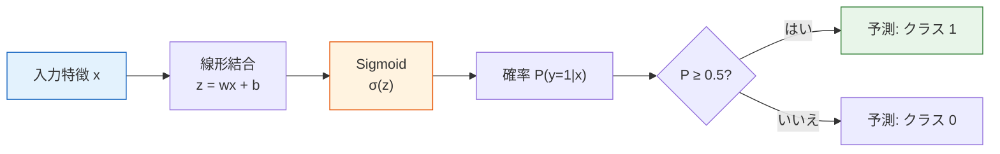
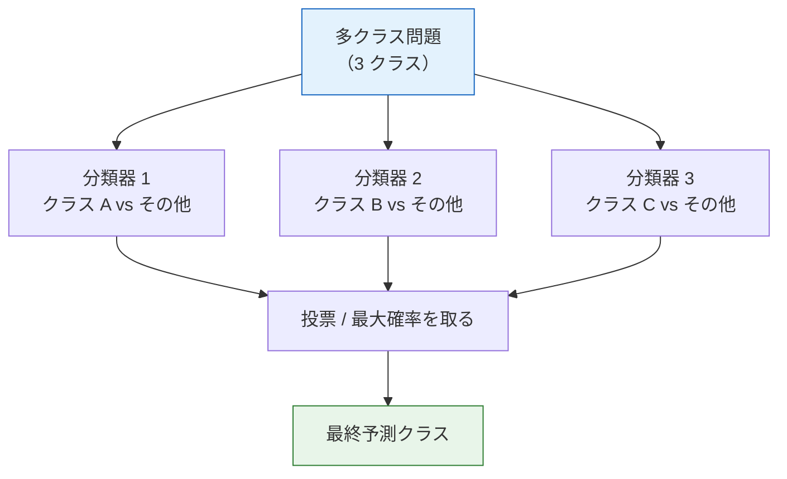

# ロジスティック回帰


:::tip この節の位置づけ
ロジスティック回帰は名前に「回帰」と付いていますが、実は**分類**アルゴリズムです。線形回帰に Sigmoid 関数を加えることで、連続値を確率に変換できます。これは最も代表的な分類アルゴリズムであり、ニューラルネットワークを理解するうえでも重要です。
:::

## 学習目標

- 線形回帰から分類への流れを理解する
- Sigmoid 関数と決定境界を理解する
- 交差エントロピー損失関数を理解する（第 4 ステーションの情報理論につなげる）
- 多クラス拡張（One-vs-Rest、Softmax）を理解する
- Scikit-learn を使ってロジスティック回帰を実装できるようになる

## 最初に大事な学習イメージを持とう

この節では、初心者が次の 3 つの言葉でつまずきやすいです。

- `Sigmoid`
- `交差エントロピー`
- `決定境界`

でも、最初の 1 回で大事なのは、すべての導出を完璧に理解することではありません。まずは、次の主線をつかむことです。

> **線形回帰は連続値を学び、ロジスティック回帰は確率を学び、その確率を分類判断に変える。**

この流れが先に見えていれば、後で出てくる交差エントロピー、しきい値、Softmax も理解しやすくなります。

---

## まずは全体の地図を作ろう

ロジスティック回帰を初めて学ぶときは、「線形回帰 + Sigmoid で終わり」ではなく、分類の主線の中でどこにあるかを見るのが大切です。


この節で本当に理解したいのは次の点です。

- なぜ分類問題に線形回帰をそのまま使えないのか
- ロジスティック回帰は確率を学んでいるのか、それとも境界を学んでいるのか
- なぜロジスティック回帰が後のニューラルネットワークへの橋渡しになるのか

### 用語の整理

| 用語 | この節での意味 | 実務で重要な理由 |
|------|------|------|
| `logit` | Sigmoid に入る前の生のスコア `z = wᵀx + b` | まだ確率ではないので、業務上のしきい値と直接比べるべきではありません |
| `Sigmoid` | 任意の実数を `(0, 1)` に押し込む関数 | 生のスコアを確率のような値に変えます |
| `BCE` | Binary Cross-Entropy、二値分類の確率予測に使う損失 | 自信満々で間違えた予測を強く罰します |
| `OvR` | One-vs-Rest、クラスごとに二値分類器を 1 つ作る方法 | 多クラス分類を複数の「このクラスか？」問題として理解できます |
| `Softmax` | 複数のスコアを合計 1 の確率分布に変える関数 | 多クラス分類やニューラルネットワークでよく使われます |
| `threshold` | 確率をクラスに変えるためのしきい値 | 変えると再現率と誤報のバランスが変わります |
| `solver` | sklearn がパラメータを探すために使う数値最適化器 | 最適化器によって使える正則化の形式が異なります |
| `C` | sklearn のロジスティック回帰で使う正則化強度の逆数 | `C` が小さいほど正則化が強く、係数はシンプルになりやすいです |

## 一、回帰から分類へ

### 1.1 問題：出力は数値ではなくなる

| 線形回帰 | ロジスティック回帰 |
|---------|---------|
| 連続値を予測する（住宅価格、気温） | クラスを予測する（スパム/正常、猫/犬） |
| 出力：任意の実数 | 出力：確率 [0, 1] |

**重要な問題**：線形回帰の出力 `wx + b` は任意の実数になれますが、確率は [0, 1] の範囲に入る必要があります。どう変換するのでしょうか？

### 1.2 なぜ「線形回帰をそのまま分類に使う」と問題が出るのか？

ここでまず覚えておくべきなのは、「式が違う」ということよりも、次の点です。

- 線形回帰の出力には確率としての意味がない

たとえば予測値が次のようになったとします。

- `1.7`
- `-0.4`

これを「正例である確率」だと解釈すると、すぐにおかしくなります。  
つまり、ロジスティック回帰が最初に解決するのは「境界を変えること」ではなく、

- **出力をまず確率にすること**

です。

### 1.2.1 初心者向けのたとえ

次のように考えるとわかりやすいです。

- 線形回帰は「点数」をそのまま出す
- ロジスティック回帰は「どれくらい確からしいか」を先に出す

たとえば：

- `0.92` は「かなり正例っぽい」
- `0.51` は「少し正例寄り」

つまり、ロジスティック回帰の重要な進化は、モデルが急に複雑になったことではなく、

- 出力を「生の点数」ではなく「確信度」に変えたこと

です。


数式を見る前に、まずこの図を読んでください。ロジスティック回帰は最初に生の `logit` スコアを計算し、Sigmoid で確率に変換し、最後にしきい値でクラスへ変換します。この分離は実務でも重要です。確率モデルは同じまま、誤報と見逃しのコストに応じてしきい値だけを調整できるからです。

### 1.3 Sigmoid 関数 —— [0, 1] に圧縮する

> **σ(z) = 1 / (1 + e⁻ᶻ)**

```python
import numpy as np
import matplotlib.pyplot as plt

def sigmoid(z):
    return 1 / (1 + np.exp(-z))

z = np.linspace(-8, 8, 200)
plt.figure(figsize=(8, 5))
plt.plot(z, sigmoid(z), 'b-', linewidth=2)
plt.axhline(y=0.5, color='r', linestyle='--', alpha=0.5, label='y = 0.5')
plt.axvline(x=0, color='gray', linestyle='--', alpha=0.5)
plt.fill_between(z, sigmoid(z), alpha=0.1, color='blue')
plt.xlabel('z = wx + b')
plt.ylabel('σ(z) = 確率')
plt.title('Sigmoid 関数：任意の実数を (0, 1) に圧縮する')
plt.legend()
plt.grid(True, alpha=0.3)
plt.ylim(-0.05, 1.05)
plt.show()

for value in [-8, -2, 0, 2, 8]:
    print(f"z={value:>2}: σ(z)={sigmoid(value):.4f}")
```

期待される出力：

```text
z=-8: σ(z)=0.0003
z=-2: σ(z)=0.1192
z= 0: σ(z)=0.5000
z= 2: σ(z)=0.8808
z= 8: σ(z)=0.9997
```

Sigmoid の性質：
| 性質 | 説明 |
|------|------|
| z → +∞ | σ(z) → 1 |
| z → -∞ | σ(z) → 0 |
| z = 0 | σ(z) = 0.5 |
| 導関数 | σ'(z) = σ(z) × (1 - σ(z)) |

### 1.4 ロジスティック回帰の完全なモデル



> **P(y=1|x) = σ(wᵀx + b) = 1 / (1 + e^-(wᵀx + b))**

### 1.5 とても重要だけれど見落とされがちな点

ロジスティック回帰の出力は最終クラスではなく、  
あくまで

- あるクラスが起こる確率の推定

です。

その後に、その確率へしきい値を適用して初めてクラスが決まります。

つまり、自然に次の 2 段階に分かれています。

1. 確率のモデリング
2. しきい値による判断

---

## 二、決定境界

### 2.1 決定境界とは？

決定境界とは、**モデルが「クラス 0」と「クラス 1」を分ける境界線**のことです。

ロジスティック回帰では、決定境界は `wᵀx + b = 0` の直線（または超平面）になります。

### 2.2 なぜ決定境界は `wᵀx + b = 0` になるのか？

理由は次の通りです。

- `σ(z) = 0.5` のとき、2 つのクラスがちょうど同点
- Sigmoid は `z = 0` で `0.5` を返す

つまり、この境界は適当に決めたものではなく、  
確率の意味で「ちょうど半々」の場所なのです。

```python
from sklearn.datasets import make_classification
from sklearn.linear_model import LogisticRegression

# 二値分類データを生成
X, y = make_classification(n_samples=200, n_features=2, n_informative=2,
                           n_redundant=0, n_clusters_per_class=1, random_state=42)

# ロジスティック回帰を学習
model = LogisticRegression(random_state=42)
model.fit(X, y)

# 決定境界を可視化
fig, ax = plt.subplots(figsize=(8, 6))

# データ点を描画
scatter = ax.scatter(X[:, 0], X[:, 1], c=y, cmap='coolwarm', s=30, alpha=0.7, edgecolors='w', linewidth=0.5)

# 決定境界を描画
x_min, x_max = X[:, 0].min() - 1, X[:, 0].max() + 1
y_min, y_max = X[:, 1].min() - 1, X[:, 1].max() + 1
xx, yy = np.meshgrid(np.linspace(x_min, x_max, 200),
                      np.linspace(y_min, y_max, 200))
Z = model.predict_proba(np.c_[xx.ravel(), yy.ravel()])[:, 1]
Z = Z.reshape(xx.shape)

ax.contourf(xx, yy, Z, levels=np.linspace(0, 1, 11), cmap='coolwarm', alpha=0.3)
ax.contour(xx, yy, Z, levels=[0.5], colors='black', linewidths=2)

ax.set_xlabel('特徴 1')
ax.set_ylabel('特徴 2')
ax.set_title('ロジスティック回帰の決定境界')
plt.colorbar(scatter, label='クラス')
plt.grid(True, alpha=0.3)
plt.show()

print(f"重み: w = {model.coef_[0]}")
print(f"切片: b = {model.intercept_[0]:.4f}")
print(f"正解率: {model.score(X, y):.1%}")
```

期待される出力：

```text
重み: w = [ 1.818 -0.409]
切片: b = 0.1873
正解率: 84.0%
```

黒い等高線が `0.5` の確率境界です。一方は `P(y=1|x) >= 0.5`、もう一方は `P(y=1|x) < 0.5` になります。

---

## 三、損失関数 —— 交差エントロピー

### 3.1 なぜ MSE を使わないのか？

分類問題で MSE を使うと、損失曲面が**非凸**になり、勾配降下法が局所最適に落ちやすくなります。そこで、より適した損失関数が必要です。

### 3.2 ここで大事なのは「非凸」という言葉そのものではない

初心者にとって、より実用的な理解は次の通りです。

- MSE は連続値の誤差に向いている
- 分類問題では「確率分布が正しいか」を重視する

交差エントロピーは、次のように問うています。

> **本当のクラスに割り当てた確率は十分に高いか？**

### 3.3 二値交差エントロピー


この図では、最も大事な性質を先に見せています。正解ラベルに高い確率を与えたとき、BCE は小さくなります。一方、自信満々で間違えたとき、BCE は大きくなります。だから BCE は、最終クラスの正誤だけを見るよりも、確率分類の学習に向いています。

> **BCE = -(1/n) × Σ[ yi × log(p̂i) + (1-yi) × log(1-p̂i) ]**

:::info 第 4 ステーションとのつながり
これは第 4 ステーション「2.4 情報理論の基礎」で学んだ**交差エントロピー**です。そのときの式は `H(P,Q) = -Σ p(x) log q(x)` でした。ここでは、`p` が正解ラベル、`q` がモデルの予測確率です。
:::

```python
def binary_cross_entropy(y_true, y_pred_prob):
    """二値交差エントロピー損失"""
    eps = 1e-15  # log(0) を防ぐ
    y_pred_prob = np.clip(y_pred_prob, eps, 1 - eps)
    return -np.mean(
        y_true * np.log(y_pred_prob) + (1 - y_true) * np.log(1 - y_pred_prob)
    )

# 直感：正解ラベルが 1 のとき
p = np.linspace(0.01, 0.99, 100)
loss_y1 = -np.log(p)      # y=1 のときの損失
loss_y0 = -np.log(1 - p)  # y=0 のときの損失

fig, axes = plt.subplots(1, 2, figsize=(12, 4))
axes[0].plot(p, loss_y1, 'b-', linewidth=2)
axes[0].set_xlabel('予測確率 P(y=1)')
axes[0].set_ylabel('損失')
axes[0].set_title('正解ラベル y=1 のとき\n1 に近いほど損失は小さい')

axes[1].plot(p, loss_y0, 'r-', linewidth=2)
axes[1].set_xlabel('予測確率 P(y=1)')
axes[1].set_ylabel('損失')
axes[1].set_title('正解ラベル y=0 のとき\n0 に近いほど損失は小さい')

for ax in axes:
    ax.grid(True, alpha=0.3)

plt.tight_layout()
plt.show()

examples = [
    (np.array([1]), np.array([0.9])),
    (np.array([1]), np.array([0.1])),
    (np.array([0]), np.array([0.1])),
    (np.array([0]), np.array([0.9])),
]
for y_true, y_prob in examples:
    print(
        f"正解={y_true[0]}, 予測確率={y_prob[0]:.1f}, "
        f"損失={binary_cross_entropy(y_true, y_prob):.4f}"
    )
```

期待される出力：

```text
正解=1, 予測確率=0.9, 損失=0.1054
正解=1, 予測確率=0.1, 損失=2.3026
正解=0, 予測確率=0.1, 損失=0.1054
正解=0, 予測確率=0.9, 損失=2.3026
```

最も大事な直感は、交差エントロピーが「正解か不正解か」だけでなく、「本当の答えにどれだけ高い確率を置いたか」を見ているという点です。

### 3.4 ゼロからロジスティック回帰を実装する

```python
# 勾配降下法でロジスティック回帰をゼロから実装する

# シンプルなデータを生成
from sklearn.datasets import make_classification
X_train, y_train = make_classification(n_samples=200, n_features=2, n_informative=2,
                                        n_redundant=0, random_state=42)

# 標準化
X_mean = X_train.mean(axis=0)
X_std = X_train.std(axis=0)
X_norm = (X_train - X_mean) / X_std

# パラメータ初期化
w = np.zeros(2)
b = 0.0
lr = 0.1
epochs = 200
history = []

for epoch in range(epochs):
    # 順伝播
    z = X_norm @ w + b
    p = sigmoid(z)

    # 損失計算
    loss = binary_cross_entropy(y_train, p)
    history.append(loss)

    # 勾配計算
    error = p - y_train
    dw = (X_norm.T @ error) / len(y_train)
    db = np.mean(error)

    # パラメータ更新
    w -= lr * dw
    b -= lr * db

print(f"学習完了: w = {w}, b = {b:.4f}")
print(f"最終損失: {history[-1]:.4f}")

# 学習精度を計算
predictions = (sigmoid(X_norm @ w + b) >= 0.5).astype(int)
accuracy = np.mean(predictions == y_train)
print(f"学習精度: {accuracy:.1%}")

# 損失曲線を可視化
plt.figure(figsize=(8, 4))
plt.plot(history)
plt.xlabel('Epoch')
plt.ylabel('交差エントロピー損失')
plt.title('ゼロから実装したロジスティック回帰の学習過程')
plt.grid(True, alpha=0.3)
plt.show()
```

期待される出力：

```text
学習完了: w = [ 2.101 -0.201], b = -0.0519
最終損失: 0.3577
学習精度: 86.0%
```

このループは 5 つの小さなステップとして読むとわかりやすいです。スコアを計算し、確率に変換し、BCE で確率の誤差を測り、勾配を計算し、`w` と `b` を少し更新します。ニューラルネットワークでも同じ型、つまり順伝播、損失、逆伝播、パラメータ更新が繰り返されます。

---

## 四、多クラス拡張

### 4.1 One-vs-Rest（OvR）

K 個のクラスに対して K 個の二値分類器を学習し、それぞれが「このクラスか、それ以外か」を判定します。

### 4.2 初心者が多クラス分類を最初に理解するときのおすすめ順序

より安定した順序は、次のようになります。

1. まず二値分類版のロジスティック回帰を理解する
2. 次に、多クラスを「二値分類器の集まり」または Softmax の確率分布として理解する
3. 最後に、sklearn の `Softmax`、`OvR`、最適化器などの実装に戻る



### 4.3 Softmax 回帰

K 個のクラスの確率分布を直接出力します。

> **P(y=k|x) = e^(zk) / Σ e^(zj)**

ここで `zk = wk·x + bk` です。

**直感**：Softmax は多クラス版の Sigmoid です。すべてのクラス確率の合計は 1 になります。

```python
def softmax(z):
    """Softmax 関数"""
    exp_z = np.exp(z - np.max(z))  # オーバーフローを防ぐため最大値を引く
    return exp_z / exp_z.sum()

# 例
z = np.array([2.0, 1.0, 0.5])
probs = softmax(z)
print(f"元のスコア: {z}")
print(f"Softmax 確率: {probs.round(3)}")
print(f"確率の合計: {probs.sum():.4f}")
```

期待される出力：

```text
元のスコア: [2.  1.  0.5]
Softmax 確率: [0.629 0.231 0.14 ]
確率の合計: 1.0000
```

### 4.4 sklearn での多クラス実践

```python
from sklearn.datasets import load_iris
from sklearn.linear_model import LogisticRegression
from sklearn.model_selection import train_test_split
from sklearn.metrics import classification_report, confusion_matrix
from sklearn.pipeline import make_pipeline
from sklearn.preprocessing import StandardScaler
import matplotlib.pyplot as plt
import numpy as np

# データを読み込む
iris = load_iris()
X, y = iris.data, iris.target
X_train, X_test, y_train, y_test = train_test_split(X, y, test_size=0.2, random_state=42)

# 多クラスロジスティック回帰。
# 新しい sklearn では、最適化器が対応していれば適切な多クラス目的を自動で使います。
# 標準化を入れると最適化が安定します。
model = make_pipeline(
    StandardScaler(),
    LogisticRegression(max_iter=500, random_state=42)
)
model.fit(X_train, y_train)

# 評価
y_pred = model.predict(X_test)
print("分類レポート:")
print(classification_report(y_test, y_pred, target_names=iris.target_names, zero_division=0))

# 混同行列
cm = confusion_matrix(y_test, y_pred)
fig, ax = plt.subplots(figsize=(6, 5))
im = ax.imshow(cm, cmap='Blues')
ax.set_xticks(range(3))
ax.set_yticks(range(3))
ax.set_xticklabels(iris.target_names, rotation=45)
ax.set_yticklabels(iris.target_names)
ax.set_xlabel('予測クラス')
ax.set_ylabel('正解クラス')
ax.set_title('混同行列')

# 各マスに数値を表示
for i in range(3):
    for j in range(3):
        color = 'white' if cm[i, j] > cm.max() / 2 else 'black'
        ax.text(j, i, str(cm[i, j]), ha='center', va='center', color=color, fontsize=16)

plt.colorbar(im)
plt.tight_layout()
plt.show()
```

期待される出力：

```text
分類レポート:
              precision    recall  f1-score   support

      setosa       1.00      1.00      1.00        10
  versicolor       1.00      1.00      1.00         9
   virginica       1.00      1.00      1.00        11

    accuracy                           1.00        30
   macro avg       1.00      1.00      1.00        30
weighted avg       1.00      1.00      1.00        30
```

:::tip 新しい sklearn での注意
古いチュートリアルでは `multi_class='multinomial'` や `multi_class='ovr'` がよく出てきます。最近の sklearn では、通常の多クラスロジスティック回帰ならデフォルトで十分です。明示的に One-vs-Rest にしたい場合は `OneVsRestClassifier(LogisticRegression(...))` を使うと意図がはっきりします。
:::

### 4.5 予測確率

```python
# Softmax 出力の確率を確認する
proba = model.predict_proba(X_test[:5])
print("最初の 5 サンプルの予測確率:")
for i, p in enumerate(proba):
    pred_class = str(iris.target_names[y_pred[i]])
    true_class = str(iris.target_names[y_test[i]])
    probability_map = {
        str(name): float(round(probability, 3))
        for name, probability in zip(iris.target_names, p)
    }
    print(f"  サンプル {i}: {probability_map} "
          f"→ 予測: {pred_class}, 正解: {true_class}")
```

期待される出力：

```text
最初の 5 サンプルの予測確率:
  サンプル 0: {'setosa': 0.011, 'versicolor': 0.876, 'virginica': 0.113} → 予測: versicolor, 正解: versicolor
  サンプル 1: {'setosa': 0.964, 'versicolor': 0.036, 'virginica': 0.0} → 予測: setosa, 正解: setosa
  サンプル 2: {'setosa': 0.0, 'versicolor': 0.003, 'virginica': 0.997} → 予測: virginica, 正解: virginica
```

---

## 五、正則化とハイパーパラメータ

### 5.1 C パラメータ

sklearn のロジスティック回帰では、`C` パラメータで正則化の強さを制御します（注意：**C が小さいほど、正則化は強くなる**。Ridge の alpha とは逆です）。

> **C = 1 / α**

```python
from sklearn.datasets import make_classification
from sklearn.linear_model import LogisticRegression
from sklearn.model_selection import train_test_split
from sklearn.pipeline import make_pipeline
from sklearn.preprocessing import StandardScaler

# データを生成
X, y = make_classification(n_samples=300, n_features=20, n_informative=5,
                           n_redundant=10, random_state=42)
X_train, X_test, y_train, y_test = train_test_split(X, y, test_size=0.2, random_state=42)

# さまざまな C 値
C_values = [0.001, 0.01, 0.1, 1, 10, 100]
train_scores = []
test_scores = []

for C in C_values:
    model = make_pipeline(
        StandardScaler(),
        LogisticRegression(C=C, max_iter=1000, random_state=42)
    )
    model.fit(X_train, y_train)
    train_scores.append(model.score(X_train, y_train))
    test_scores.append(model.score(X_test, y_test))
    print(f"C={C:>6}: train={train_scores[-1]:.3f}, test={test_scores[-1]:.3f}")

plt.figure(figsize=(8, 5))
plt.plot(C_values, train_scores, 'bo-', label='学習用データ')
plt.plot(C_values, test_scores, 'ro-', label='テストデータ')
plt.xscale('log')
plt.xlabel('C（正則化強度の逆数）')
plt.ylabel('正解率')
plt.title('C パラメータがモデル性能に与える影響')
plt.legend()
plt.grid(True, alpha=0.3)
plt.show()
```

期待される出力：

```text
C= 0.001: train=0.796, test=0.750
C=  0.01: train=0.850, test=0.783
C=   0.1: train=0.850, test=0.783
C=     1: train=0.867, test=0.767
C=    10: train=0.867, test=0.767
C=   100: train=0.867, test=0.767
```

### 5.2 L1 と L2 の正則化

```python
# L1 正則化 → 疎なパラメータ（特徴選択）
# L2 正則化 → パラメータを小さくする（デフォルト）
# sklearn 1.8+ では、非推奨になった penalty の代わりに l1_ratio を使うのが推奨されます。

model_l1 = make_pipeline(
    StandardScaler(),
    LogisticRegression(l1_ratio=1.0, solver='saga', C=1.0, max_iter=5000, random_state=42)
)
model_l2 = make_pipeline(
    StandardScaler(),
    LogisticRegression(l1_ratio=0.0, solver='saga', C=1.0, max_iter=5000, random_state=42)
)

model_l1.fit(X_train, y_train)
model_l2.fit(X_train, y_train)

coef_l1 = model_l1.named_steps["logisticregression"].coef_[0]
coef_l2 = model_l2.named_steps["logisticregression"].coef_[0]

fig, axes = plt.subplots(1, 2, figsize=(12, 4))

axes[0].bar(range(20), np.abs(coef_l1), color='coral')
axes[0].set_title(f'L1 正則化（非ゼロのパラメータ: {np.sum(coef_l1 != 0)}/20）')
axes[0].set_xlabel('特徴番号')
axes[0].set_ylabel('|パラメータ値|')

axes[1].bar(range(20), np.abs(coef_l2), color='steelblue')
axes[1].set_title(f'L2 正則化（非ゼロのパラメータ: {np.sum(coef_l2 != 0)}/20）')
axes[1].set_xlabel('特徴番号')
axes[1].set_ylabel('|パラメータ値|')

for ax in axes:
    ax.grid(axis='y', alpha=0.3)

plt.tight_layout()
plt.show()

print(f"L1 非ゼロパラメータ数: {np.sum(coef_l1 != 0)}/20")
print(f"L2 非ゼロパラメータ数: {np.sum(coef_l2 != 0)}/20")
print(f"L1 テスト精度: {model_l1.score(X_test, y_test):.1%}")
print(f"L2 テスト精度: {model_l2.score(X_test, y_test):.1%}")
```

期待される出力：

```text
L1 非ゼロパラメータ数: 9/20
L2 非ゼロパラメータ数: 20/20
L1 テスト精度: 76.7%
L2 テスト精度: 76.7%
```

L1 は「少数の有用なつまみだけを残す」イメージです。L2 は「全部のつまみを残してよいが、どれか 1 つを極端に強くしすぎない」イメージです。そのため、L1 は特徴選択に役立つことがあり、L2 は安定した baseline として使いやすいです。

### 5.3 初めて分類プロジェクトをするとき、なぜロジスティック回帰を最初に試す価値が高いのか？

理由は、次の特徴を同時に持っていることが多いからです。

- 解釈しやすい
- 速い
- baseline として強い
- 確率出力が自然

そのため、テキスト分類や表形式データの分類では、  
今でもとても良い最初の選択肢です。

---

## 六、決定境界の可視化比較

```python
from sklearn.datasets import make_moons, make_circles

datasets = [
    ("線形分離可能", make_classification(n_samples=200, n_features=2,
                                    n_informative=2, n_redundant=0, random_state=42)),
    ("半月形", make_moons(n_samples=200, noise=0.2, random_state=42)),
    ("同心円", make_circles(n_samples=200, noise=0.1, factor=0.5, random_state=42)),
]

fig, axes = plt.subplots(1, 3, figsize=(15, 4))

for ax, (title, (X_d, y_d)) in zip(axes, datasets):
    model = LogisticRegression(random_state=42)
    model.fit(X_d, y_d)

    x_min, x_max = X_d[:, 0].min() - 0.5, X_d[:, 0].max() + 0.5
    y_min, y_max = X_d[:, 1].min() - 0.5, X_d[:, 1].max() + 0.5
    xx, yy = np.meshgrid(np.linspace(x_min, x_max, 200),
                          np.linspace(y_min, y_max, 200))
    Z = model.predict(np.c_[xx.ravel(), yy.ravel()]).reshape(xx.shape)

    ax.contourf(xx, yy, Z, alpha=0.3, cmap='coolwarm')
    ax.scatter(X_d[:, 0], X_d[:, 1], c=y_d, cmap='coolwarm', s=20, edgecolors='w', linewidth=0.5)
    ax.set_title(f'{title}\n正解率: {model.score(X_d, y_d):.1%}')
    ax.grid(True, alpha=0.3)

plt.suptitle('ロジスティック回帰の決定境界（線形境界）', fontsize=13)
plt.tight_layout()
plt.show()
```

典型的な結果：

```text
線形分離可能: 約 86.5%
半月形: 約 85.0%
同心円: 約 50.5%
```

:::note ロジスティック回帰の限界
ロジスティック回帰の決定境界は**線形**です（直線/平面）。半月形や同心円のような非線形データでは、性能があまり良くありません。後の決定木や SVM などは、非線形データを扱えます。
:::


ロジスティック回帰の出力は「最初からクラス」ではなく、確率です。しきい値を 0.5 から下げると、正例をより多く拾えますが、誤報も増えやすくなります。逆にしきい値を上げると、予測は慎重になりますが、正例を見逃しやすくなります。分類プロジェクトでは、しきい値もビジネス判断の一部です。

---

## 初めて分類問題に取り組むときの、最も安定した基本順序

もし初めて分類問題を解くなら、次の順序で進めるのが安全です。

1. 目的が連続値ではなくクラスかどうかを確認する
2. まずロジスティック回帰で baseline を作る
3. 混同行列と `Precision / Recall / F1` を確認する
4. 予測確率としきい値を調整する必要があるかを見る
5. 最後に、より複雑なモデルへ進むか決める

この順序は、いきなり多くのモデルを比較するよりも安定しています。なぜなら、まず次の最短の主線を練習できるからです。

- 確率
- 分類
- 評価
- 判定しきい値

---

## まとめ

| 要点 | 説明 |
|------|------|
| 核心となる式 | `P(y=1) = σ(wx + b)` |
| Sigmoid | 線形出力を (0, 1) に圧縮する |
| 損失関数 | 二値交差エントロピー（BCE） |
| 決定境界 | 線形（直線/超平面） |
| 多クラス | OvR または Softmax |
| 正則化 | C パラメータ（C が小さいほど正則化が強い） |

:::info 次につながる内容
- **次の節**：決定木 —— 非線形な決定境界、高い解釈性
- **第 4 ステーションの復習**：Sigmoid の導関数（3.1 節）、交差エントロピー（2.4 節）、勾配降下法（3.3 節）
:::

## この節で必ず持ち帰りたいこと

- ロジスティック回帰は「確率を学び、その後に分類する」モデル
- これは回帰主線から分類主線へ進む最初の橋
- Sigmoid、決定境界、交差エントロピーの関係を説明できれば、この節は本当に理解できています

## ハンズオン演習

### 演習 1：Softmax 回帰をゼロから実装する

本節の「ゼロからロジスティック回帰を実装する」を拡張し、Softmax の多クラス版にして Iris データセットで学習してみましょう。

### 演習 2：決定境界の比較

`make_moons` データを使って、異なる C 値（0.01, 1, 100）でロジスティック回帰の決定境界がどう変わるか比べてみましょう。

### 演習 3：特徴量の重要度分析

Iris データセットでロジスティック回帰を学習し、`model.coef_` を見て、どの特徴が異なるアヤメの品種を見分けるのに重要かを分析しましょう。棒グラフで可視化してください。
