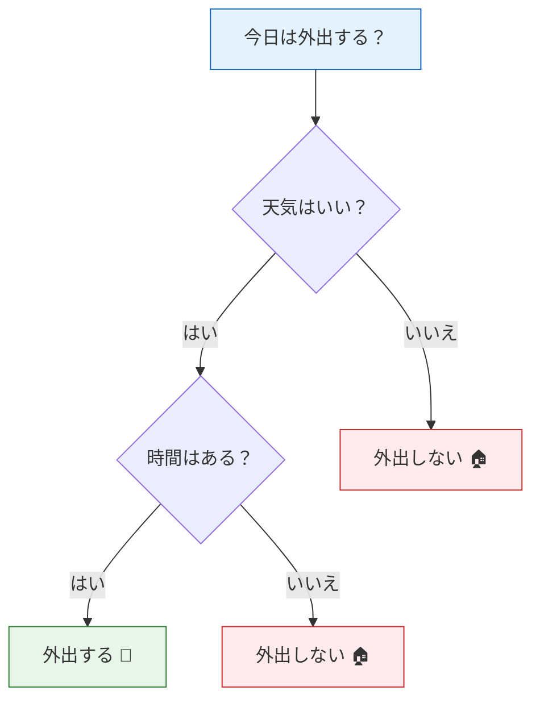

# 決定木


:::tip この節の位置づけ
決定木は、**もっとも直感的で、もっとも解釈しやすい** ML アルゴリズムです。まるで「20 の質問」ゲームのように、一連の yes/no の判断でデータを分類します。さらに重要なのは、決定木がこのあとに出てくるアンサンブル学習（ランダムフォレスト、XGBoost）の基礎になることです。
:::

## 学習目標

- 決定木の構築プロセスを理解する
- 情報利得、ジニ指数（第 4 章のエントロピーの概念につなげる）
- 枝刈り戦略（事前枝刈り、事後枝刈り）を理解する
- 決定木の可視化と解釈性を理解する
- 回帰木を知る

## まず、とても大事な学習イメージについて

この節は、初学者が最初に次のような正反対の感覚を持ちやすいです。

- 「決定木は if-else みたいで、すごく簡単そう」
- 「でも、エントロピーやジニ、枝刈りが出てくると、急に難しく感じる」

初回学習でいちばん大事なのは、すべての数式を一気に理解することではなく、まずこの主線をつかむことです。

> **木は少しずつルールを育てていき、ルールが細かくなるほど訓練データを覚えやすくなる。だから、最終的には必ず複雑さの制御が必要になる。**

この流れが先に見えていれば、あとで出てくる純度、枝刈り、ランダムフォレストもつながりやすくなります。

---

## まずは全体図をつかもう

決定木は、初学者に「とても直感的だから、きっと難しくないはず」と思わせやすいです。  
でも実際にプロジェクトを始めると、よくある疑問はむしろ次のようなものです。

- なぜ木は訓練データに対してすぐ高得点を出せるのか？
- なぜこんなに過学習しやすいのか？
- 単体の木は見やすいのに、実務ではなぜランダムフォレストや Boosting の方が好まれるのか？

より安定した理解の順番は次の通りです。


この流れを先につかめば、あとで学ぶエントロピー、ジニ、枝刈り、アンサンブル学習がずっと理解しやすくなります。

---

## 一、決定木の直感

### 1.1 日常生活の決定木



決定木は、**if-else の判断**を何段にも重ねたものです。毎回、ある特徴量の値に基づいてデータを 2 つ（または複数）に分けます。

### 1.2 機械学習における決定木

| 要素 | 説明 |
|------|------|
| **根ノード** | いちばん上のノード。すべてのデータを含む |
| **内部ノード** | 判断を行うノード（ある特徴量で分岐する） |
| **葉ノード** | 最終的な判定結果（クラスまたは数値） |
| **分岐条件** | 例: 「花びらの長さ ≤ 2.5cm」 |
| **深さ** | 根から葉までの最長経路 |

### 1.2.1 なぜ決定木は一目でわかるのか？

それは、モデルをたくさんの小さな局所問題に分けるからです。

- まず 1 つ質問する
- 答えに応じて左か右へ進む
- 次の質問をする

これは、線形回帰やロジスティック回帰のように「すべての特徴量を一度に 1 つの式へまとめる」やり方とはかなり違います。  
そのため、決定木の大きな学習価値は次の 3 つです。

- モデルが「どう判断しているか」を初めて見せてくれる
- 「なぜそう判定したのか」を説明しやすい
- 「なぜ訓練データを覚えてしまうのか」も直感的にわかる

### 1.2.2 初学者に合うたとえ

決定木は、こんなイメージで考えるとわかりやすいです。

- とても質問好きな面接官

毎回こう聞いてきます。

- 「この質問で、サンプルをもっときれいに分けられる？」

分けられるなら続けるし、分けられないならそこで結論を出します。  
つまり木が深くなるほど、本質的には次のような状態になります。

- ルールがどんどん細かくなる
- 分類がどんどん細かく分かれる
- ただし訓練データの細部まで覚えやすくなる

### 1.3 かんたんな例

```python
from sklearn.datasets import load_iris
from sklearn.tree import DecisionTreeClassifier, plot_tree
import matplotlib.pyplot as plt

# 可視化しやすいように、2 つの特徴量だけ使う
iris = load_iris()
X = iris.data[:, 2:4]  # 花びらの長さと幅
y = iris.target

# 浅い決定木を学習
tree = DecisionTreeClassifier(max_depth=3, random_state=42)
tree.fit(X, y)

# 決定木を可視化
fig, ax = plt.subplots(figsize=(14, 8))
plot_tree(tree, feature_names=['花びらの長さ', '花びらの幅'],
          class_names=iris.target_names, filled=True,
          rounded=True, fontsize=10, ax=ax)
plt.title('アイリスの決定木（max_depth=3）')
plt.tight_layout()
plt.show()
```

---

## 二、決定木はどうやって「学習」するのか？——分裂基準

### 2.1 核心の問い

各ノードで、アルゴリズムは次の 2 つを決める必要があります。
1. **どの特徴量**で分岐するか？
2. **どのしきい値**で分岐するか？

目的は、分岐後の子ノードのデータをできるだけ**「純粋」**にすることです。

### 2.1.1 まず数式を覚える前に、ひとことだけ

決定木が各ステップでやっていることは、とてもシンプルです。

> **分けたあと、2 つのグループが元より整っているような質問を探す。**

この「どれだけ整ったか」を数値化するのが、情報利得やジニ指数です。

### 2.1.2 木モデルを最初に学ぶとき、何を先に覚えるべき？

最初から

- エントロピーの式
- ジニの式

を丸暗記するより、次を先に覚える方が大切です。

- 分岐のたびに、より純粋な状態を目指す
- 木を細かくしすぎると、訓練データを覚え始める
- だから、最後は必ず「複雑さの制御」に進む

### 2.2 情報利得とエントロピー

:::info 第 4 章とのつながり
第 4 章の「2.4 情報理論の基礎」で、**エントロピー**を学びました。これは集合の「不確かさ」を表す指標です。決定木では、このエントロピーを使ってどう分岐するかを決めます。
:::

**エントロピー（Entropy）**：

> **H(S) = -Σ pk × log₂(pk)**

- `pk` = 集合 S におけるクラス k の割合
- エントロピーが大きい = もっと「混ざっている」
- エントロピー = 0 = 完全に純粋（1 つのクラスだけ）

**情報利得**：分岐の前後で、エントロピーがどれだけ減ったか。

> **IG(S, A) = H(S) - Σ (|Sv|/|S|) × H(Sv)**

```python
import numpy as np

def entropy(y):
    """エントロピーを計算する"""
    classes, counts = np.unique(y, return_counts=True)
    probs = counts / len(y)
    return -np.sum(probs * np.log2(probs + 1e-10))

def information_gain(y, y_left, y_right):
    """情報利得を計算する"""
    n = len(y)
    return entropy(y) - (len(y_left)/n * entropy(y_left) + len(y_right)/n * entropy(y_right))

# 例: 10 サンプル
y_parent = np.array([0, 0, 0, 0, 0, 1, 1, 1, 1, 1])  # 5:5 の混合
print(f"親ノードのエントロピー: {entropy(y_parent):.4f}")

# 分岐案 A: 完璧な分割
y_left_a = np.array([0, 0, 0, 0, 0])  # すべて 0
y_right_a = np.array([1, 1, 1, 1, 1])  # すべて 1
ig_a = information_gain(y_parent, y_left_a, y_right_a)
print(f"案 A（完璧な分割）の情報利得: {ig_a:.4f}")

# 分岐案 B: よくない分割
y_left_b = np.array([0, 0, 1, 1, 1])   # 2:3 の混合
y_right_b = np.array([0, 0, 0, 1, 1])   # 3:2 の混合
ig_b = information_gain(y_parent, y_left_b, y_right_b)
print(f"案 B（よくない分割）の情報利得: {ig_b:.4f}")
```

### 2.3 ジニ指数（Gini Impurity）

「純度」を測る別の指標です。計算が少し速いです。

> **Gini(S) = 1 - Σ pk²**

- Gini = 0 → 完全に純粋
- Gini が最大 → 完全に混ざっている

```python
def gini(y):
    """ジニ指数を計算する"""
    classes, counts = np.unique(y, return_counts=True)
    probs = counts / len(y)
    return 1 - np.sum(probs ** 2)

# エントロピーとジニ指数を比較
p = np.linspace(0.01, 0.99, 100)
entropy_vals = -p * np.log2(p) - (1-p) * np.log2(1-p)
gini_vals = 2 * p * (1 - p)

plt.figure(figsize=(8, 5))
plt.plot(p, entropy_vals, 'b-', linewidth=2, label='エントロピー (Entropy)')
plt.plot(p, gini_vals, 'r-', linewidth=2, label='ジニ指数 (Gini)')
plt.xlabel('正例の割合 p')
plt.ylabel('不純度')
plt.title('エントロピー vs ジニ指数')
plt.legend()
plt.grid(True, alpha=0.3)
plt.show()
```

### 2.4 sklearn での選び方

| パラメータ | 選択肢 | 説明 |
|------|------|------|
| `criterion='gini'` | ジニ指数 | sklearn の**デフォルト**。計算が速い |
| `criterion='entropy'` | 情報利得 | 分岐はより厳密だが、計算はやや遅い |

実際には、両者の差は大きくありません。まずは `gini` で十分です。

### 2.5 初めてのプロジェクトでは、`gini` と `entropy` をどう選ぶのが安定？

アルゴリズム比較を特別にしたいのでなければ、最初のプロジェクトでは次のように考えると安定です。

- まずはデフォルトの `gini` を使う
- `max_depth`、`min_samples_leaf`、`ccp_alpha` に主に注目する
- これらを調整し終えてから、必要なら `entropy` と比較する

理由はシンプルです。

- 分裂基準は、性能差の主因になりにくい
- 木の複雑さを抑えることの方が、たいてい重要

### 2.6 初めて木モデルを調整するときの、いちばん安定な順番

初めて決定木を調整するなら、次の順番がおすすめです。

1. まず浅い木で baseline を作る
2. 次に `max_depth` を見る
3. その後 `min_samples_leaf` を見る
4. さらに `ccp_alpha` を見る
5. 最後に `gini / entropy` を比べる

この順番が安定しているのは、最初に解決したいのが次だからです。

- 木が長くなりすぎていないか
- ルールが細かすぎてデータを覚え始めていないか

---

## 三、決定境界の可視化

```python
from sklearn.datasets import make_classification, make_moons
from sklearn.tree import DecisionTreeClassifier
import numpy as np
import matplotlib.pyplot as plt

def plot_decision_boundary(ax, model, X, y, title):
    x_min, x_max = X[:, 0].min() - 0.5, X[:, 0].max() + 0.5
    y_min, y_max = X[:, 1].min() - 0.5, X[:, 1].max() + 0.5
    xx, yy = np.meshgrid(np.linspace(x_min, x_max, 200),
                          np.linspace(y_min, y_max, 200))
    Z = model.predict(np.c_[xx.ravel(), yy.ravel()]).reshape(xx.shape)
    ax.contourf(xx, yy, Z, alpha=0.3, cmap='coolwarm')
    ax.scatter(X[:, 0], X[:, 1], c=y, cmap='coolwarm', s=20, edgecolors='w', linewidth=0.5)
    ax.set_title(title)
    ax.grid(True, alpha=0.3)

# 異なる深さの決定木
X, y = make_moons(n_samples=300, noise=0.25, random_state=42)

fig, axes = plt.subplots(1, 4, figsize=(18, 4))
depths = [1, 3, 5, None]

for ax, depth in zip(axes, depths):
    tree = DecisionTreeClassifier(max_depth=depth, random_state=42)
    tree.fit(X, y)
    label = f'深さ制限なし' if depth is None else f'深さ={depth}'
    plot_decision_boundary(ax, tree, X, y,
                          f'{label}\n訓練精度: {tree.score(X, y):.1%}')

plt.suptitle('決定木の深さが決定境界に与える影響', fontsize=13)
plt.tight_layout()
plt.show()
```

:::warning 決定木の過学習
深さ制限のない決定木は、訓練サンプルをほぼすべて「覚えて」しまいます（訓練精度 100%）。しかし、その決定境界は非常に複雑になります。これが過学習です。**枝刈り**でこれを抑えます。
:::

### 3.1 この境界図を初めて見るとき、何を見るべき？

まず訓練精度を見るのではなく、次を見てください。

- 境界が細かくなりすぎていないか
- 孤立した点が小さな領域として切り出されていないか
- 訓練スコアとテストスコアが離れ始めていないか

これは機械学習でとても大事な診断です。

- 「学べるかどうか」だけでなく
- 「学んだのが本当の規則なのか、それともノイズなのか」を見る


この図は、上の境界図と一緒に見ると理解しやすいです。木が深くなるほど、孤立したノイズが独立した小領域として切り出されやすくなります。枝刈りは「モデルを弱くする」ためではなく、細かすぎて訓練サンプルにしか効かない分岐を取り除き、モデルをより規則学習に近づけるために行います。

---

## 四、枝刈り——複雑さの制御

### 4.1 事前枝刈り（Pre-pruning）

**構築中に**木の成長を制限します。

| パラメータ | 説明 | デフォルト値 |
|------|------|--------|
| `max_depth` | 最大深さ | None（制限なし） |
| `min_samples_split` | ノードが分岐するために必要な最小サンプル数 | 2 |
| `min_samples_leaf` | 葉ノードに必要な最小サンプル数 | 1 |
| `max_leaf_nodes` | 最大葉ノード数 | None（制限なし） |

### 4.1.1 初めて木モデルを調整するとき、より安定した順番は？

初学者は、最初にいろいろなパラメータを一気に変えてしまいがちです。すると、どれが効いているのかわからなくなります。  
より安定した順番は次の通りです。

1. まず `max_depth` だけを調整する
2. 次に `min_samples_leaf` が必要かを見る
3. 最後に `min_samples_split` と `ccp_alpha` を見る

理由は次の通りです。

- `max_depth` が木の複雑さを最も直接的に決める
- `min_samples_leaf` は「少数点だけを切り出す」のを抑えるのに向いている
- 他のパラメータは、より細かな調整に近い

```python
from sklearn.model_selection import train_test_split

X, y = make_moons(n_samples=500, noise=0.3, random_state=42)
X_train, X_test, y_train, y_test = train_test_split(X, y, test_size=0.2, random_state=42)

# 異なる深さを比較
fig, axes = plt.subplots(1, 4, figsize=(18, 4))
configs = [
    (None, '枝刈りなし'),
    (3, 'max_depth=3'),
    (5, 'max_depth=5'),
    (10, 'max_depth=10'),
]

for ax, (depth, title) in zip(axes, configs):
    tree = DecisionTreeClassifier(max_depth=depth, random_state=42)
    tree.fit(X_train, y_train)
    train_acc = tree.score(X_train, y_train)
    test_acc = tree.score(X_test, y_test)
    plot_decision_boundary(ax, tree, X_train, y_train,
                          f'{title}\n訓練: {train_acc:.1%}, テスト: {test_acc:.1%}')

plt.suptitle('事前枝刈りによる過学習の制御', fontsize=13)
plt.tight_layout()
plt.show()
```

### 4.2 事後枝刈り（Post-pruning）——コスト複雑度枝刈り

**まず完全な木まで育ててから、あとで「剪定」する**方法です。sklearn では `ccp_alpha`（Cost Complexity Pruning）を使います。

```python
# 最適な ccp_alpha を探す
tree_full = DecisionTreeClassifier(random_state=42)
tree_full.fit(X_train, y_train)

# 異なる alpha に対応する部分木を取得
path = tree_full.cost_complexity_pruning_path(X_train, y_train)
ccp_alphas = path.ccp_alphas

# 各 alpha で木を学習
train_scores = []
test_scores = []
for alpha in ccp_alphas:
    tree = DecisionTreeClassifier(ccp_alpha=alpha, random_state=42)
    tree.fit(X_train, y_train)
    train_scores.append(tree.score(X_train, y_train))
    test_scores.append(tree.score(X_test, y_test))

plt.figure(figsize=(8, 5))
plt.plot(ccp_alphas, train_scores, 'b-o', markersize=3, label='訓練集')
plt.plot(ccp_alphas, test_scores, 'r-o', markersize=3, label='テスト集')
plt.xlabel('ccp_alpha')
plt.ylabel('精度')
plt.title('コスト複雑度枝刈り')
plt.legend()
plt.grid(True, alpha=0.3)

# 最良点を表示
best_idx = np.argmax(test_scores)
plt.axvline(x=ccp_alphas[best_idx], color='green', linestyle='--',
            label=f'最適 alpha={ccp_alphas[best_idx]:.4f}')
plt.legend()
plt.show()

print(f"最適な ccp_alpha: {ccp_alphas[best_idx]:.4f}")
print(f"最適なテスト精度: {test_scores[best_idx]:.1%}")
```

---

## 五、特徴量重要度

決定木は、自然に**特徴量重要度**を提供します。これは、各特徴量が分類判断にどれだけ貢献したかを表します。

```python
from sklearn.datasets import load_wine
from sklearn.tree import DecisionTreeClassifier

wine = load_wine()
X, y = wine.data, wine.target

tree = DecisionTreeClassifier(max_depth=4, random_state=42)
tree.fit(X, y)

# 特徴量重要度
importance = tree.feature_importances_
sorted_idx = np.argsort(importance)

plt.figure(figsize=(8, 6))
plt.barh(range(len(sorted_idx)), importance[sorted_idx], color='steelblue')
plt.yticks(range(len(sorted_idx)), np.array(wine.feature_names)[sorted_idx])
plt.xlabel('特徴量重要度')
plt.title('決定木の特徴量重要度（Wine データセット）')
plt.grid(axis='x', alpha=0.3)
plt.tight_layout()
plt.show()
```

---

## 六、回帰木

決定木は分類だけでなく、**回帰**にも使えます。

### 6.1 原理

分類木の葉ノードは**クラス**を出力します。回帰木の葉ノードは**数値**を出力します（その領域にあるすべてのサンプルの平均値）。

### 6.2 例

```python
from sklearn.tree import DecisionTreeRegressor

# 非線形データを生成
np.random.seed(42)
X_reg = np.sort(np.random.uniform(0, 10, 200)).reshape(-1, 1)
y_reg = np.sin(X_reg.ravel()) + np.random.randn(200) * 0.3

# 異なる深さの回帰木
fig, axes = plt.subplots(1, 3, figsize=(15, 4))
depths = [2, 5, None]

for ax, depth in zip(axes, depths):
    tree = DecisionTreeRegressor(max_depth=depth, random_state=42)
    tree.fit(X_reg, y_reg)

    X_test_reg = np.linspace(0, 10, 500).reshape(-1, 1)
    y_pred = tree.predict(X_test_reg)

    ax.scatter(X_reg, y_reg, s=10, alpha=0.5, color='steelblue')
    ax.plot(X_test_reg, y_pred, 'r-', linewidth=2)
    label = '制限なし' if depth is None else str(depth)
    ax.set_title(f'深さ={label}, R²={tree.score(X_reg, y_reg):.3f}')
    ax.grid(True, alpha=0.3)

plt.suptitle('回帰木の異なる深さ', fontsize=13)
plt.tight_layout()
plt.show()
```

:::note 回帰木 vs 線形回帰
回帰木の予測は**段差状**です（各区間で一定の値を返す）であり、滑らかではありません。そのため、非線形データにはよく合いますが、過学習もしやすいです。
:::

---

## 七、決定木の長所と短所

| 長所 | 短所 |
|------|------|
| 理解しやすく、説明しやすい（可視化できる） | 過学習しやすい |
| 特徴量のスケーリングが不要 | データのわずかな変化に敏感 |
| 分類と回帰の両方に使える | 決定境界が軸平行になる |
| 多クラス問題に対応できる | 貪欲法なので、全体最適は保証されない |
| 暗黙的に特徴選択ができる | 単体の木の表現力には限界がある |

:::info 短所を解決する方法
決定木の多くの短所は、**アンサンブル学習**（次の節）で改善できます。
- 複数の木で投票する → 過学習を減らす
- ランダムサンプリングする → 個々のデータ点への敏感さを減らす
:::

### 7.1 決定木はどんなときに特に試す価値がある？

単体の木が必ずしも最強モデルではありませんが、次の場面ではとても有用です。

- とくに解釈性がほしいとき
- どの特徴量が役立ちそうか、素早く見たいとき
- 特徴量とラベルの間に、はっきりした段階的ルールがあると疑うとき
- ビジネス側に説明しやすい baseline をまず作りたいとき

この講義での価値は、単なるアルゴリズムではなく、次の 2 つをつなぐところにもあります。

- 解釈しやすいモデリング
- アンサンブル木モデルの出発点

---

## 九、最初に決定木をプロジェクトへ入れるときの、いちばん安定した順番

最初に本当にプロジェクトへ入れるなら、次の順番がおすすめです。

1. まずは解釈しやすい baseline として使う
2. まず木の深さを制限し、最初から無限に育てない
3. 訓練スコアと検証スコアの差を見る
4. そのうえで、単体の木をさらに調整するか、ランダムフォレスト / Boosting に進むか決める

この方が、いきなりアンサンブル学習へ飛ぶより安定しています。なぜなら、次のことをちゃんと理解できるからです。

- 単体の木がなぜ直感的なのか
- 単体の木がなぜ不安定なのか
- アンサンブル学習が何を補っているのか

:::info 次につながる内容
- **次の節**: アンサンブル学習 — 複数の決定木を組み合わせると、単体の木よりはるかに高い性能が出る
- **第 4 章の復習**: エントロピーと情報利得（2.4 節の情報理論）
:::

---

## まとめ

| ポイント | 説明 |
|------|------|
| 核心思想 | 一連の判断条件でデータを再帰的に分割する |
| 分裂基準 | 情報利得（エントロピー）またはジニ指数 |
| 過学習の制御 | 事前枝刈り（深さやサンプル数を制限）または事後枝刈り（ccp_alpha） |
| 解釈性 | 決定パスを可視化し、特徴量重要度を出せる |
| 回帰木 | 葉ノードはクラスではなく数値を出力する |

## この節でいちばん持ち帰ってほしいこと

ひとことで言うなら、これです。

> **決定木の核心は「分裂できること」ではなく、モデルの複雑さと過学習を“目で見える形”にしてくれることです。**

つまり、重要な学びは次の通りです。

- なぜ木は直感的なのか
- なぜ木は過学習しやすいのか
- 初めて木モデルを調整するとき、どのパラメータから触るべきか
- なぜこのあとランダムフォレストや Boosting へ自然につながるのか

## ハンズオン練習

### 練習 1: 情報利得を手で計算する

10 個のサンプルがあり、ラベルは `[はい,はい,いいえ,はい,いいえ,いいえ,はい,はい,いいえ,いいえ]`（「はい」が 5 個、「いいえ」が 5 個）です。特徴 A で分岐したあと、左ノード = `[はい,はい,はい,いいえ]`、右ノード = `[いいえ,いいえ,いいえ,いいえ,はい,はい]` になります。情報利得を手で計算してください。

### 練習 2: 深さのチューニング

`make_moons` データ（noise=0.3）を使って、`max_depth` を 1〜20 まで変えながら、訓練集とテスト集の精度変化を描き、最適な深さを見つけてください。

### 練習 3: 回帰木 vs 線形回帰

`y = sin(x) + ノイズ` でデータを作り、`LinearRegression`、`PolynomialFeatures(degree=5) + LinearRegression`、`DecisionTreeRegressor(max_depth=5)` の 3 つでフィットし、比較図を描いてください。

### 練習 4: 特徴量重要度

`load_iris()` を使って決定木を学習し、特徴量重要度の棒グラフを描いてください。重要でない特徴量を取り除いて再学習し、精度が下がるか確認してください。
